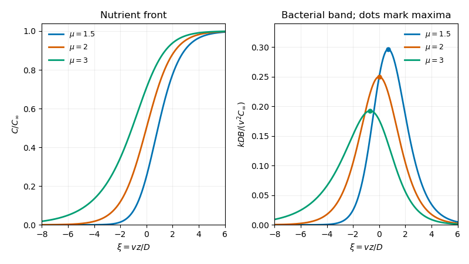

<h1 id="3/b/solution">Solution</h1>

↑ **Parent:** [B](../b.md)

Put $\mu=\alpha/D>1$; here $\mu$ is the dimensionless chemotactic ratio, unrelated to the fluid viscosity in the other questions. Integrating the first-order relation yields

$$
B=K C^\mu e^{-vz/D},\qquad K>0.
$$

Substitute into $vC'=kB$ and separate variables. With $\xi=vz/D$,

$$
\frac{dC}{d\xi}=\frac{kDK}{v^2}C^\mu e^{-\xi},\qquad
C^{1-\mu}=C_\infty^{1-\mu}+\frac{(\mu-1)kDK}{v^2}e^{-\xi}.
$$

The first integration constant is fixed by the positive nutrient concentration ahead. The second positive constant can be written $C_\infty^{1-\mu}A_0$, and a translation of the wave origin sets $A_0=1$. Indeed $A_0e^{-vz/D}=e^{-v(z-z_0)/D}$ with $z_0=(D/v)\log A_0$. With that origin choice the [nutrient-consuming chemotactic travelling band](../../../../../../nutrient-consuming-chemotactic-travelling-band.md) is

$$
\boxed{C(z)=C_\infty(1+e^{-\xi})^{-1/(\mu-1)},\qquad
B(z)=\frac{v^2C_\infty}{kD(\mu-1)}e^{-\xi}
(1+e^{-\xi})^{-\mu/(\mu-1)}.}
$$

The second formula also follows by differentiating the first and using $B=vC'/k$, so its prefactor is fixed, not a freely chosen independent amplitude.

As $\xi\to+\infty$, $C\to C_\infty$ and $B\sim[v^2C_\infty/(kD(\mu-1))]e^{-\xi}\to0$. As $\xi\to-\infty$,

$$
C\sim C_\infty e^{\xi/(\mu-1)},\qquad
B\sim\frac{v^2C_\infty}{kD(\mu-1)}e^{\xi/(\mu-1)}\to0.
$$

Thus all four required limits hold. The singular sensitivity causes no finite-$z$ problem, and $C'/C$ tends to the finite value $v/[D(\mu-1)]$ behind. Since $C'=kB/v>0$, $C$ is strictly monotone increasing.

For the bacterial peak, differentiate its logarithm:

$$
\frac{d\log B}{d\xi}
=-1+\frac{\mu}{\mu-1}\frac{e^{-\xi}}{1+e^{-\xi}}.
$$

This strictly decreases from $1/(\mu-1)>0$ to $-1<0$, so it vanishes exactly once. The peak values are

$$
\boxed{\xi_*=-\log(\mu-1),\qquad
C_* = C_\infty\mu^{-1/(\mu-1)},\qquad
B_{\max}=\frac{v^2C_\infty}{kD}\mu^{-\mu/(\mu-1)}.}
$$

Accordingly the nutrient curve is a smooth rising front, and the bacterial curve is a positive pulse, with generally different exponential decay lengths ahead and behind. The nutrient concentration $C_\infty$ is the undepleted nutrient density in the fresh liquid ahead of the migrating band. Behind the band the nutrient has been consumed. The plot shows the front and pulse for several admissible chemotactic ratios; at $\mu=2$ the bacterial pulse is symmetric about $\xi=0$.

**[Figure 1](#3/b/image-nutrient-front-and-bacterial-band). Nutrient front and bacterial band**.

The condition $\mu>1$ is sufficient for this smooth exponential-tail family. The derivation does not claim to classify all limiting or weak solutions at other parameter values.

## ↑ Ancestors (11)

1. [B](../b.md)
2. [3](../../3.md)
3. [Paper 342](../../../paper-342-split.md)
4. [Iii](../../../split.md)
5. [2017](../../../../split.md)
6. [Past exam of the mathematics course of the University of Cambridge](../../../../../split.md)
7. [Mathematics course of the University of Cambridge](../../../../../../mathematics-course-of-the-university-of-cambridge.md)
8. [Course of the University of Cambridge](../../../../../../course-of-the-university-of-cambridge.md)
9. [University of Cambridge](../../../../../../university-of-cambridge-split.md)
10. [List of universities](../../../../../../list-of-universities.md)
11. [Codex Wiki](../../../../../../split.md)
