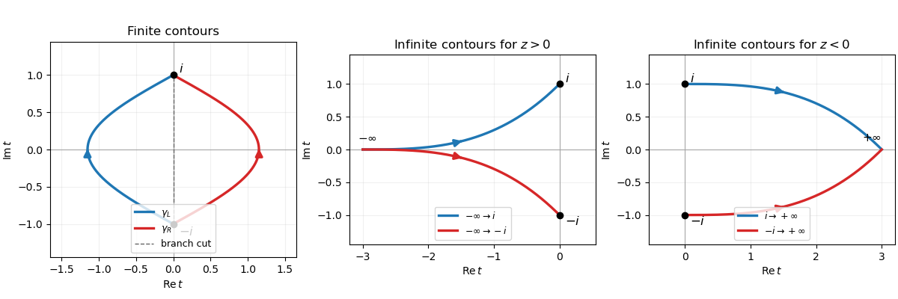
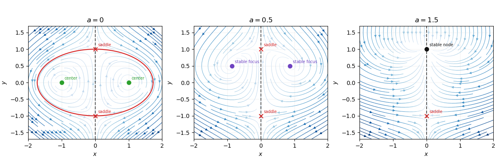

# Paper 1

↑ **Parent:** [Ii](../ii.md)

[https://www.maths.cam.ac.uk/undergrad/pastpapers/files/2018/paperii_1_2018.pdf](https://www.maths.cam.ac.uk/undergrad/pastpapers/files/2018/paperii_1_2018.pdf)

**Table of contents**

- [1G](#1g)
  - [a](#1g/a)
    - [Solution](#1g/a/solution)
  - [b](#1g/b)
    - [Solution](#1g/b/solution)
- [2F](#2f)
  - [Solution](#2f/solution)
- [3H](#3h)
  - [Solution](#3h/solution)
- [4G](#4g)
  - [a](#4g/a)
    - [Solution](#4g/a/solution)
  - [b](#4g/b)
    - [i](#4g/b/i)
      - [Solution](#4g/b/i/solution)
    - [ii](#4g/b/ii)
      - [Solution](#4g/b/ii/solution)
    - [iii](#4g/b/iii)
      - [Solution](#4g/b/iii/solution)
  - [c](#4g/c)
    - [Solution](#4g/c/solution)
- [5J](#5j)
  - [Solution](#5j/solution)
- [6C](#6c)
  - [a](#6c/a)
    - [Solution](#6c/a/solution)
  - [b](#6c/b)
    - [Solution](#6c/b/solution)
  - [c](#6c/c)
    - [Solution](#6c/c/solution)
- [7B](#7b)
  - [a](#7b/a)
    - [Solution](#7b/a/solution)
  - [b](#7b/b)
    - [Solution](#7b/b/solution)
- [8B](#8b)
  - [Solution](#8b/solution)
- [9B](#9b)
  - [Solution](#9b/solution)
- [10D](#10d)
  - [a](#10d/a)
    - [Solution](#10d/a/solution)
  - [b](#10d/b)
    - [Solution](#10d/b/solution)
- [11H](#11h)
  - [Solution](#11h/solution)
- [12G](#12g)
  - [a](#12g/a)
    - [Solution](#12g/a/solution)
  - [b](#12g/b)
    - [Solution](#12g/b/solution)
  - [c](#12g/c)
    - [Solution](#12g/c/solution)
  - [d](#12g/d)
    - [i](#12g/d/i)
      - [Solution](#12g/d/i/solution)
    - [ii](#12g/d/ii)
      - [Solution](#12g/d/ii/solution)
    - [iii](#12g/d/iii)
      - [Solution](#12g/d/iii/solution)
- [13J](#13j)
  - [a](#13j/a)
    - [Solution](#13j/a/solution)
  - [b](#13j/b)
    - [Solution](#13j/b/solution)
  - [c](#13j/c)
    - [Solution](#13j/c/solution)
- [14B](#14b)
  - [a](#14b/a)
    - [Solution](#14b/a/solution)
  - [b](#14b/b)
    - [Solution](#14b/b/solution)
  - [c](#14b/c)
    - [Solution](#14b/c/solution)
- [15B](#15b)
  - [a](#15b/a)
    - [Solution](#15b/a/solution)
  - [b](#15b/b)
    - [Solution](#15b/b/solution)
  - [c](#15b/c)
    - [Solution](#15b/c/solution)
  - [d](#15b/d)
    - [Solution](#15b/d/solution)
- [16G](#16g)
  - [Solution](#16g/solution)
- [17I](#17i)
  - [a](#17i/a)
    - [Solution](#17i/a/solution)
  - [b](#17i/b)
    - [Solution](#17i/b/solution)
  - [c](#17i/c)
    - [Solution](#17i/c/solution)
- [18I](#18i)
  - [Solution](#18i/solution)
- [19I](#19i)
  - [a](#19i/a)
    - [Solution](#19i/a/solution)
  - [b](#19i/b)
    - [i](#19i/b/i)
      - [Solution](#19i/b/i/solution)
    - [ii](#19i/b/ii)
      - [Solution](#19i/b/ii/solution)
    - [iii](#19i/b/iii)
      - [Solution](#19i/b/iii/solution)
- [20G](#20g)
  - [a](#20g/a)
    - [Solution](#20g/a/solution)
  - [b](#20g/b)
    - [Solution](#20g/b/solution)
- [21H](#21h)
  - [a](#21h/a)
    - [Solution](#21h/a/solution)
  - [b](#21h/b)
    - [Solution](#21h/b/solution)
  - [c](#21h/c)
    - [Solution](#21h/c/solution)
  - [d](#21h/d)
    - [Solution](#21h/d/solution)
- [22F](#22f)
  - [a](#22f/a)
    - [Solution](#22f/a/solution)
  - [b](#22f/b)
    - [Solution](#22f/b/solution)
  - [c](#22f/c)
    - [Solution](#22f/c/solution)
- [23F](#23f)
  - [a](#23f/a)
    - [Solution](#23f/a/solution)
  - [b](#23f/b)
    - [Solution](#23f/b/solution)
  - [c](#23f/c)
    - [Solution](#23f/c/solution)
- [24F](#24f)
  - [Solution](#24f/solution)
- [25I](#25i)
  - [a](#25i/a)
    - [Solution](#25i/a/solution)
  - [b](#25i/b)
    - [Solution](#25i/b/solution)
  - [c](#25i/c)
    - [Solution](#25i/c/solution)
- [26I](#26i)
  - [a](#26i/a)
    - [Solution](#26i/a/solution)
  - [b](#26i/b)
    - [Solution](#26i/b/solution)
  - [c](#26i/c)
    - [Solution](#26i/c/solution)
  - [d](#26i/d)
    - [Solution](#26i/d/solution)
- [27J](#27j)
  - [a](#27j/a)
    - [Solution](#27j/a/solution)
  - [b](#27j/b)
    - [Solution](#27j/b/solution)
  - [c](#27j/c)
    - [Solution](#27j/c/solution)
  - [d](#27j/d)
    - [i](#27j/d/i)
      - [Solution](#27j/d/i/solution)
    - [ii](#27j/d/ii)
      - [Solution](#27j/d/ii/solution)
- [28J](#28j)
  - [Solution](#28j/solution)
- [29K](#29k)
  - [a](#29k/a)
    - [Solution](#29k/a/solution)
  - [b](#29k/b)
    - [Solution](#29k/b/solution)
  - [c](#29k/c)
    - [Solution](#29k/c/solution)
- [30K](#30k)
  - [a](#30k/a)
    - [Solution](#30k/a/solution)
  - [b](#30k/b)
    - [Solution](#30k/b/solution)
  - [c](#30k/c)
    - [Solution](#30k/c/solution)
  - [d](#30k/d)
    - [i](#30k/d/i)
      - [Solution](#30k/d/i/solution)
    - [ii](#30k/d/ii)
      - [Solution](#30k/d/ii/solution)
- [31E](#31e)
  - [a](#31e/a)
    - [Solution](#31e/a/solution)
  - [b](#31e/b)
    - [Solution](#31e/b/solution)
  - [c](#31e/c)
    - [Solution](#31e/c/solution)
- [32A](#32a)
  - [a](#32a/a)
    - [Solution](#32a/a/solution)
  - [b](#32a/b)
    - [Solution](#32a/b/solution)
  - [c](#32a/c)
    - [Solution](#32a/c/solution)
  - [d](#32a/d)
    - [Solution](#32a/d/solution)
  - [e](#32a/e)
    - [Solution](#32a/e/solution)
- [33D](#33d)
  - [Solution](#33d/solution)
- [34A](#34a)
  - [Solution](#34a/solution)
- [35A](#35a)
  - [a](#35a/a)
    - [Solution](#35a/a/solution)
  - [b](#35a/b)
    - [i](#35a/b/i)
      - [Solution](#35a/b/i/solution)
    - [ii](#35a/b/ii)
      - [Solution](#35a/b/ii/solution)
- [36D](#36d)
  - [Solution](#36d/solution)
- [37E](#37e)
  - [a](#37e/a)
    - [Solution](#37e/a/solution)
  - [b](#37e/b)
    - [Solution](#37e/b/solution)
  - [c](#37e/c)
    - [Solution](#37e/c/solution)
  - [d](#37e/d)
    - [Solution](#37e/d/solution)
- [38C](#38c)
  - [Solution](#38c/solution)
- [39C](#39c)
  - [Solution](#39c/solution)
- [40E](#40e)
  - [a](#40e/a)
    - [Solution](#40e/a/solution)
  - [b](#40e/b)
    - [Solution](#40e/b/solution)

## 1G

↑ **Parent:** [Paper 1](paper-1.md)

<h3 id="1g/a">a</h3>

↑ **Parent:** [1G](#1g)

<h4 id="1g/a/solution">Solution</h4>

↑ **Parent:** [A](#1g/a)

For pairwise [coprime integers](../../../number-theory.md#coprime-integers) $m_1,\ldots,m_r$, put $M=\prod_i m_i$. The [Chinese remainder theorem](../../../mathematics.md#chinese-remainder-theorem) states that reduction gives an isomorphism

$$
\mathbb Z/M\mathbb Z\longrightarrow\prod_{i=1}^r\mathbb Z/m_i\mathbb Z.
$$

Equivalently, every system $x\equiv a_i\pmod {m_i}$ has one solution modulo $M$.

For existence, let $M_i=M/m_i$. Since $\gcd(M_i,m_i)=1$, choose $u_i$ with $u_iM_i\equiv1\pmod {m_i}$. Then

$$
x=\sum_{i=1}^r a_i u_iM_i
$$

has every required residue: modulo $m_j$, all terms except the $j$th vanish and the remaining term is $a_j$. For uniqueness, if $x$ and $y$ have the same residues, every $m_i$ divides $x-y$. Pairwise coprimality then makes $M$ divide $x-y$. **Thus the simultaneous solution exists and is unique modulo $M$.**

<h3 id="1g/b">b</h3>

↑ **Parent:** [1G](#1g)

<h4 id="1g/b/solution">Solution</h4>

↑ **Parent:** [B](#1g/b)

Choose distinct [primes](../../../number-theory.md#prime-number) $p_1,\ldots,p_{1000}$. The moduli $p_k^2$ are pairwise [coprime](../../../number-theory.md#coprime-integers), so the [Chinese remainder theorem](../../../mathematics.md#chinese-remainder-theorem) supplies an integer $N$ satisfying

$$
N\equiv p_k-k\pmod {p_k^2}
\qquad(1\leq k\leq1000).
$$

Consequently

$$
N+k\equiv p_k\pmod {p_k^2},
$$

so $p_k\mid N+k$ but $p_k^2\nmid N+k$. By the definition of a [squarefull number](../../../number-theory.md#powerful-number), $N+k$ is therefore not squarefull. Adding a sufficiently large multiple of $\prod_kp_k^2$ makes $N$ positive without changing any congruence. **The integers $N+1,\ldots,N+1000$ are the required consecutive integers.**

## 2F

↑ **Parent:** [Paper 1](paper-1.md)

<h3 id="2f/solution">Solution</h3>

↑ **Parent:** [2F](#2f)

[Sperner's lemma](../../../topological-analysis.md#sperner-s-lemma) says that if a [triangle](../../../geometry-and-topology.md#triangle) is triangulated, its vertices are labelled $1,2,3$, and label $i$ is forbidden on the edge opposite vertex $i$, then an odd number of small triangles have all three labels.

To prove it, count incidences with edges whose endpoint labels are $1$ and $2$. Along the outer $12$-edge, the labels begin at $1$ and end at $2$, so the number of $12$ transitions is odd; no other boundary edge contributes. An interior edge contributes twice. A small triangle contributes an odd number precisely when its three labels are $1,2,3$: a triangle using only $1,2$ contributes two, and every other non-tricoloured triangle contributes zero. The number of tricoloured triangles is therefore odd.

Now suppose the closed sets $A_i$ in the question existed. Let $d_i(x)$ be the [distance from a point to a closed set](../../../topological-analysis.md#distance-from-a-point-to-a-closed-set) $A_i$. Empty triple intersection makes $d_1+d_2+d_3>0$, so

$$
r(x)=\frac{d_1(x)v_1+d_2(x)v_2+d_3(x)v_3}
{d_1(x)+d_2(x)+d_3(x)}
$$

is a [continuous function](../../../calculus.md#continuous-function) from the large triangle to itself, where $v_i$ is the vertex opposite $\alpha_i$. Since the $A_i$ cover the triangle, at least one $d_i(x)$ vanishes, so $r(x)$ always lies on the boundary. On $\alpha_i\subseteq A_i$, its $i$th barycentric coordinate vanishes, hence $r(\alpha_i)\subseteq\alpha_i$. Thus $r$ is face-preserving on the boundary; its boundary restriction is homotopic there to the identity by the straight-line homotopy. This would give a map from the triangle into its boundary whose boundary degree is one, contradicting the [no-retraction theorem](../../../topological-analysis.md#no-retraction-theorem), the standard topological consequence of Sperner's lemma. **Therefore the three closed sets must have a common point.**

## 3H

↑ **Parent:** [Paper 1](paper-1.md)

<h3 id="3h/solution">Solution</h3>

↑ **Parent:** [3H](#3h)

Let a memoryless source have probabilities $p_1,\ldots,p_m$, and let a uniquely decodable $D$-ary code have word lengths $\ell_i$ and mean length $L=\sum_i p_i\ell_i$. The [Shannon source coding theorem](../../../coding-theory.md#shannon-s-source-coding-theorem) states

$$
H_D(p)\leq L,
\qquad
H_D(p)=-\sum_i p_i\log_Dp_i,
$$

and that some [prefix code](../../../coding-theory.md#prefix-code) satisfies

$$
H_D(p)\leq L<H_D(p)+1.
$$

For the lower bound, the [Kraft inequality](../../../coding-theory.md#kraft-mcmillan-inequality) gives $K=\sum_iD^{-\ell_i}\leq1$. Set $q_i=D^{-\ell_i}/K$. The [Gibbs inequality](../../../probability-and-statistics.md#gibbs-inequality), or nonnegativity of [relative entropy](../../../probability-and-statistics.md#kullback-leibler-divergence), gives

$$
0\leq\sum_i p_i\log_D\frac{p_i}{q_i}
=-H_D(p)+L+\log_DK.
$$

Therefore $L\geq H_D(p)-\log_DK\geq H_D(p)$.

For achievability choose $\ell_i=\lceil-\log_Dp_i\rceil$. Then $\sum_iD^{-\ell_i}\leq\sum_ip_i=1$, so the converse part of the Kraft theorem supplies a prefix code with these lengths, and

$$
L<\sum_i p_i(-\log_Dp_i+1)=H_D(p)+1.
$$

**Hence the entropy is the optimal mean code length up to less than one code symbol.**

## 4G

↑ **Parent:** [Paper 1](paper-1.md)

<h3 id="4g/a">a</h3>

↑ **Parent:** [4G](#4g)

<h4 id="4g/a/solution">Solution</h4>

↑ **Parent:** [A](#4g/a)

The [pumping lemma for context-free languages](../../../foundations-of-mathematics.md#pumping-lemma-for-context-free-languages) states that every [context-free language](../../../foundations-of-mathematics.md#context-free-language) $L$ has a [pumping length](../../../foundations-of-mathematics.md#pumping-length) $p$ such that every $w\in L$ with $|w|\geq p$ can be written

$$
w=uvxyz
$$

with $|vxy|\leq p$, $|vy|>0$, and $uv^ixy^iz\in L$ for every integer $i\geq0$.

<h3 id="4g/b">b</h3>

↑ **Parent:** [4G](#4g)

<h4 id="4g/b/i">i</h4>

↑ **Parent:** [B](#4g/b)

<h5 id="4g/b/i/solution">Solution</h5>

↑ **Parent:** [I](#4g/b/i)

This language is **not context-free**. Suppose it were, and define the homomorphism

$$
h(a)=h(c)=a,qquad h(b)=h(d)=b.
$$

Then closure under inverse homomorphism and [intersection of a context-free language with a regular language](../../../foundations-of-mathematics.md#intersection-of-a-context-free-language-with-a-regular-language) would make

$$
h^{-1}(L)cap a^+b^+c^+d^+
={a^m b^n c^m d^n:m,ngeq1}
$$

context-free. The equality holds because the midpoint of a square with four nonempty alternating runs must lie between its second and third runs.

Apply the [pumping lemma for context-free languages](../../../foundations-of-mathematics.md#pumping-lemma-for-context-free-languages) to $a^pb^pc^pd^p$. A pumpable window of length at most $p$ meets at most two adjacent blocks. Pumping changes at least one block but cannot reach its equal-count partner two blocks away, so either the $a,c$ counts or the $b,d$ counts cease to agree. This contradiction proves the claim.

<h4 id="4g/b/ii">ii</h4>

↑ **Parent:** [B](#4g/b)

<h5 id="4g/b/ii/solution">Solution</h5>

↑ **Parent:** [Ii](#4g/b/ii)

The equations force $m=4r$, $n=3r$, $k=5s$, and $l=2s$. Hence the language is

$$
\{a^{4r}b^{3r}:r\geq0\}\,
\{c^{5s}d^{2s}:s\geq0\}.
$$

It is **context-free**; one explicit [context-free grammar](../../../foundations-of-mathematics.md#context-free-grammar) is

$$
S\to XY,\qquad
X\to aaaaXbbb\mid\epsilon,\qquad
Y\to cccccYdd\mid\epsilon.
$$

<h4 id="4g/b/iii">iii</h4>

↑ **Parent:** [B](#4g/b)

<h5 id="4g/b/iii/solution">Solution</h5>

↑ **Parent:** [Iii](#4g/b/iii)

This language is **not context-free**. Let $p$ be a proposed [pumping length](../../../foundations-of-mathematics.md#pumping-length) and choose $n$ with $3^n\geq p$. In any pumping decomposition of the unary word $a^{3^n}$, pumping once more increases its length by an integer $d$ with $1\leq d\leq p$. But

$$
3^n<3^n+d\leq2\cdot3^n<3^{n+1},
$$

so the pumped length is not a power of three, contrary to the [pumping lemma for context-free languages](../../../foundations-of-mathematics.md#pumping-lemma-for-context-free-languages). This is also an instance of the fact that a [unary context-free language is regular](../../../foundations-of-mathematics.md#unary-context-free-language-is-regular), whereas the powers of three are not ultimately periodic.

<h3 id="4g/c">c</h3>

↑ **Parent:** [4G](#4g)

<h4 id="4g/c/solution">Solution</h4>

↑ **Parent:** [C](#4g/c)

Take a [context-free grammar](../../../foundations-of-mathematics.md#context-free-grammar) for $L$ with start symbol $S$, rename nonterminals if necessary, and add a fresh start symbol $S_0$ with

$$
S_0\to\epsilon\mid SS_0.
$$

Every derivation concatenates finitely many words of $L$, and every finite concatenation can be derived. **The resulting grammar generates $L^*$**, proving [closure of context-free languages under Kleene star](../../../foundations-of-mathematics.md#closure-of-context-free-languages-under-kleene-star).

## 5J

↑ **Parent:** [Paper 1](paper-1.md)

<h3 id="5j/solution">Solution</h3>

↑ **Parent:** [5J](#5j)

Write $Y_i$ for the request count on day $i$. Both fits are [Poisson regression](../../../statistical-modelling.md#poisson-regression) models with independent

$$
Y_i\sim\operatorname{Poisson}(\lambda_i).
$$

In model 1,

$$
\log\lambda_i=\beta_0+\beta_WW_i+\beta_EE_i+\beta_BB_i
+\beta_LL_i+\beta_MM_i,
$$

where the variables are [indicator variables](../../../statistical-modelling.md#indicator-variable) for winter, weekend, bank holiday, and low or medium pollution; non-winter weekdays that are not bank holidays and have high pollution form the baseline. Model 2 imposes

$$
H_0:\quad\beta_B=\beta_L=\beta_M=0,
$$

retaining only winter and weekend effects.

The models are nested, and the [likelihood-ratio test statistic](../../../statistical-modelling.md#likelihood-ratio-test-statistic) is the decrease in residual deviance,

$$
316.39-304.97=11.42.
$$

There are three restrictions. By [Wilks theorem](../../../statistical-inference.md#wilks-theorem), under $H_0$ this statistic is asymptotically a [chi-squared distribution](../../../probability-theory.md#chi-squared-distribution) with three degrees of freedom. Since

$$
11.42>\chi^2_{3,0.99}=11.34487,
$$

**we reject model 2 at the $1\%$ level in favour of model 1.**

## 6C

↑ **Parent:** [Paper 1](paper-1.md)

<h3 id="6c/a">a</h3>

↑ **Parent:** [6C](#6c)

<h4 id="6c/a/solution">Solution</h4>

↑ **Parent:** [A](#6c/a)

With $p_{-1}=0$, the [birth-death master equation](../../../markov-process.md#birth-death-master-equation) for birth rate $b_n=Bn$ and death rate $d_n=Dn$ is

$$
\dot p_n=B(n-1)p_{n-1}+D(n+1)p_{n+1}-(B+D)np_n,
\qquad n\geq0.
$$

<h3 id="6c/b">b</h3>

↑ **Parent:** [6C](#6c)

<h4 id="6c/b/solution">Solution</h4>

↑ **Parent:** [B](#6c/b)

Multiply the [birth-death master equation](../../../markov-process.md#birth-death-master-equation) by $n$ and sum. Index shifts give

$$
\dot\mu=(B-D)\mu.
$$

For the second moment, a birth changes $n^2$ by $2n+1$ and a death changes it by $-2n+1$, so

$$
\frac d{dt}\mathbb E[N^2]
=2(B-D)\mathbb E[N^2]+(B+D)\mu.
$$

Since $\sigma^2=\mathbb E[N^2]-\mu^2$,

$$
\boxed{\ (\sigma^2)'=2(B-D)\sigma^2+(B+D)\mu\ }.
$$

Together these are the [moment equations of a linear birth-death process](../../../markov-process.md#moment-equations-of-a-linear-birth-death-process).

<h3 id="6c/c">c</h3>

↑ **Parent:** [6C](#6c)

<h4 id="6c/c/solution">Solution</h4>

↑ **Parent:** [C](#6c/c)

The deterministic equation has solution $n(t)=n(0)e^{(B-D)t}$ and is identical in form to the equation for the stochastic [expected value](../../../probability-theory.md#expected-value). It therefore identifies only the net rate

$$
r=B-D.
$$

The [variance](../../../variance.md) equation also contains the total event rate $s=B+D$. Once $r$ and $s$ are inferred,

$$
\boxed{\ B=\frac{s+r}{2},\qquad D=\frac{s-r}{2}\ }.
$$

The deterministic trajectory cannot distinguish frequent births and deaths that nearly cancel from infrequent events with the same net growth, whereas fluctuations can.

## 7B

↑ **Parent:** [Paper 1](paper-1.md)

<h3 id="7b/a">a</h3>

↑ **Parent:** [7B](#7b)

<h4 id="7b/a/solution">Solution</h4>

↑ **Parent:** [A](#7b/a)

In the integral defining the [Beta function](../../../complex-analysis.md#beta-function), put $t=(1+x)/2$ and then $u=x^2$. Symmetry gives

$$
\begin{aligned}
B(z,z)
&=2^{1-2z}\int_{-1}^{1}(1-x^2)^{z-1}\,dx\\
&=2^{2-2z}\int_0^1(1-x^2)^{z-1}\,dx\\
&=2^{1-2z}\int_0^1u^{-1/2}(1-u)^{z-1}\,du\\
&=2^{1-2z}B(z,\tfrac12).
\end{aligned}
$$

This proves the identity for $\operatorname{Re}z>0$. Both sides extend by [analytic continuation](../../../complex-analysis.md#analytic-continuation) to the same [meromorphic function](../../../isolated-singularity.md#meromorphic-function), equivalently by the [beta--gamma identity](../../../complex-analysis.md#beta-gamma-identity) and the [Gamma duplication formula](../../../complex-analysis.md#gamma-duplication-formula). **The identity holds meromorphically for every $z\in\mathbb C$; both sides are finite for $z\notin\{0,-1,-2,\ldots\}$ and have matching poles at the excluded points.**

<h3 id="7b/b">b</h3>

↑ **Parent:** [7B](#7b)

<h4 id="7b/b/solution">Solution</h4>

↑ **Parent:** [B](#7b/b)

Start from the product of two [Gamma function](../../../complex-analysis.md#gamma-function) integrals:

$$
\Gamma(p)\Gamma(q)=
\int_0^\infty\int_0^\infty e^{-(x+y)}x^{p-1}y^{q-1}\,dx\,dy.
$$

Use the [sum-and-ratio substitution for gamma integrals](../../../complex-analysis.md#sum-and-ratio-substitution-for-gamma-integrals)

$$
r=x+y,\qquad t=\frac{x}{x+y},\qquad
x=rt,\quad y=r(1-t),
$$

whose Jacobian is $r$. Absolute convergence for $\operatorname{Re}p,\operatorname{Re}q>0$ justifies the change of variables and separates the integral:

$$
\Gamma(p)\Gamma(q)
=\left(\int_0^\infty e^{-r}r^{p+q-1}\,dr\right)
 \left(\int_0^1t^{p-1}(1-t)^{q-1}\,dt\right)
=\Gamma(p+q)B(p,q).
$$

Therefore

$$
\boxed{\ B(p,q)=\frac{\Gamma(p)\Gamma(q)}{\Gamma(p+q)}\ }.
$$

## 8B

↑ **Parent:** [Paper 1](paper-1.md)

<h3 id="8b/solution">Solution</h3>

↑ **Parent:** [8B](#8b)

Use the first-order [action](../../../classical-mechanics.md#action)

$$
S[q,p]=\int_{t_1}^{t_2}\bigl(p\dot q-H(q,p,t)\bigr)\,dt.
$$

Varying $q$ with fixed endpoints and varying $p$ freely gives

$$
\delta S=\int_{t_1}^{t_2}
\left[(\dot q-H_p)\delta p+(-\dot p-H_q)\delta q\right]dt.
$$

The [principle of stationary action](../../../classical-mechanics.md#principle-of-stationary-action) therefore yields [Hamilton's equations](../../../classical-mechanics.md#hamilton-s-equations)

$$
\dot q=H_p,\qquad\dot p=-H_q.
$$

For $H=p^2+q^{-2}$ these become $\dot q=2p$ and $\dot p=2q^{-3}$. Along their [Hamiltonian flow](../../../classical-mechanics.md#hamiltonian-flow), $H=E$ is conserved and

$$
\frac d{dt}(pq)=\dot p\,q+p\dot q=2q^{-2}+2p^2=2H.
$$

Thus $F=pq-ctH$ is an [integral of motion](../../../classical-mechanics.md#integral-of-motion) exactly when **$c=2$**.

Write its constant value as $F_0$. The surfaces $pq-2tE=F_0$ in extended $(q,p,t)$-space give

$$
pq=F_0+2Et.
$$

Using $Eq^2=p^2q^2+1$,

$$
\boxed{\ q(t)=\pm\sqrt{\frac{(F_0+2Et)^2+1}{E}},
\qquad
p(t)=\frac{F_0+2Et}{q(t)}\ }.
$$

The sign of $q$ is fixed. In [phase space](../../../classical-mechanics.md#phase-space), each energy orbit is one of the two branches

$$
p^2+q^{-2}=E,\qquad
q=\pm(E-p^2)^{-1/2},\qquad |p|<\sqrt E.
$$

Each branch approaches $p=-\sqrt E$ and $p=+\sqrt E$ as $|q|\to\infty$ and turns at $(p,q)=(0,\pm E^{-1/2})$.

## 9B

↑ **Parent:** [Paper 1](paper-1.md)

<h3 id="9b/solution">Solution</h3>

↑ **Parent:** [9B](#9b)

Let $\mathcal H=a'/a=\dot a$, where a prime denotes differentiation with respect to [conformal time](../../../cosmology.md#conformal-time) $d\tau=dt/a$. Multiplying the [Friedmann equation](../../../cosmology.md#friedmann-equations) by $a^2$ gives

$$
\mathcal H^2+kc^2=\frac{8\pi G}{3}\rho a^2.
$$

The [critical density](../../../cosmology.md#critical-density) is the value obtained when $k=0$, so

$$
\Omega=\frac{\rho}{\rho_{\rm crit}}
=\frac{8\pi G\rho a^2}{3\mathcal H^2},
\qquad
\boxed{\ \frac{kc^2}{\mathcal H^2}=\Omega-1\ }.
$$

Since $\mathcal H'=a\ddot a$, the pressure-free [Raychaudhuri equation](../../../cosmology.md#friedmann-acceleration-equation) gives

$$
2\mathcal H'=-\frac{8\pi G}{3}\rho a^2
=-(\mathcal H^2+kc^2),
$$

or

$$
2\mathcal H'+\mathcal H^2+kc^2=0.
$$

Differentiating $\Omega=1+kc^2/\mathcal H^2$ and substituting this equation yields

$$
\boxed{\ \Omega'=\mathcal H\Omega(\Omega-1)\ }.
$$

For an expanding universe $\mathcal H>0$. The [Einstein-de Sitter universe](../../../large-scale-structure-of-the-universe.md#einstein-de-sitter-universe) $\Omega=1$ is an unstable constant solution: curves starting with $0<\Omega<1$ decrease towards $0$, while curves starting with $\Omega>1$ rise away from $1$ and diverge as the closed model reaches maximum expansion. This is the [flatness problem](../../../cosmology.md#flatness-problem).

## 10D

↑ **Parent:** [Paper 1](paper-1.md)

<h3 id="10d/a">a</h3>

↑ **Parent:** [10D](#10d)

<h4 id="10d/a/solution">Solution</h4>

↑ **Parent:** [A](#10d/a)

A pure bipartite state is [entangled](../../../bell-state.md#entangled-state) when it is not a [product state](../../../bell-state.md#product-state) $|u\rangle_A\otimes|v\rangle_B$.

Since

$$
H\otimes H|11\rangle
=\frac12(|00\rangle-|01\rangle-|10\rangle+|11\rangle),
$$

we have

$$
|\alpha\rangle
=\frac1{2\sqrt3}
(3|00\rangle+|01\rangle+|10\rangle-|11\rangle).
$$

Its coefficient matrix is proportional to

$$
\begin{pmatrix}3&1\\1&-1\end{pmatrix},
$$

whose determinant is $-4\ne0$. By the [two-qubit product-state determinant criterion](../../../bell-state.md#two-qubit-product-state-determinant-criterion), a product state would have determinant zero. **Therefore $|\alpha\rangle$ is entangled.**

<h3 id="10d/b">b</h3>

↑ **Parent:** [10D](#10d)

<h4 id="10d/b/solution">Solution</h4>

↑ **Parent:** [B](#10d/b)

This is [superdense coding](../../../bell-state.md#superdense-coding). To encode $00,01,10,11$, Alice applies respectively $I,X,Z,XZ$ to her half of $|\Phi^+\rangle$. These local [Pauli operators](../../../quantum-circuit.md#pauli-operator) transform the shared state into the four mutually orthogonal [Bell states](../../../bell-state.md) $|\Phi^+\rangle,|\Psi^+\rangle,|\Phi^-\rangle,|\Psi^-\rangle$, up to irrelevant global phases. Alice sends her one qubit to Bob. Bob now holds both qubits and performs a [Bell-basis measurement](../../../bell-state.md#bell-basis-measurement), whose outcome identifies Alice's two-bit message with certainty. **One transmitted qubit communicates two classical bits because one shared Bell pair was available beforehand.**

## 11H

↑ **Parent:** [Paper 1](paper-1.md)

<h3 id="11h/solution">Solution</h3>

↑ **Parent:** [11H](#11h)

For length-$n$ binary [linear codes](../../../coding-theory.md#linear-code) $C_2\subseteq C_1$, their [bar product of binary linear codes](../../../coding-theory.md#bar-product-of-binary-linear-codes) is

$$
C_1|C_2=\{(u,u+v):u\in C_1, v\in C_2\}.
$$

The map $(u,v)\mapsto(u,u+v)$ is injective and linear, so

$$
\dim(C_1|C_2)=\dim C_1+\dim C_2.
$$

If $d_i$ is the minimum distance of $C_i$, then

$$
\operatorname{wt}(u)+\operatorname{wt}(u+v)
\geq\operatorname{wt}(v).
$$

For $v\ne0$ this is at least $d_2$; for $v=0$ a nonzero word has weight at least $2d_1$. Words $(0,v)$ and $(u,u)$ attain these bounds, proving

$$
\boxed{\ d(C_1|C_2)=\min(d_2,2d_1)\ }.
$$

A [parity-check matrix](../../../coding-theory.md#parity-check-matrix) $P$ for a code $C$ is a matrix satisfying $C=\ker P$. A pair $(x,y)$ belongs to $C_1|C_2$ exactly when

$$
x\in C_1,\qquad x+y\in C_2.
$$

Thus a parity-check matrix is

$$
\boxed{\begin{pmatrix}
P_1&0\\
P_2&P_2
\end{pmatrix}}.
$$

This is the [parity-check matrix of a bar product](../../../coding-theory.md#parity-check-matrix-of-a-bar-product).

The [Reed-Muller code](../../../coding-theory.md#reed-muller-code) $\operatorname{RM}(d,r)$ is the length-$2^d$ binary code obtained by evaluating every square-free polynomial in $d$ Boolean variables of degree at most $r$ on all points of $\mathbb F_2^d$. Equivalently,

$$
\operatorname{RM}(d,r)
=\operatorname{RM}(d-1,r)\mid\operatorname{RM}(d-1,r-1).
$$

The square-free monomials form a basis, so

$$
\boxed{\ \dim\operatorname{RM}(d,r)=\sum_{j=0}^r\binom dj\ }.
$$

A word in $\operatorname{RM}(d,1)$ evaluates an affine function $a_0+a\cdot x$. The two constant functions have weights $0$ and $2^d$. Every nonconstant affine function takes each value equally often, so all other codewords have weight $2^{d-1}$.

A monomial of degree $j$ has weight $2^{d-j}$. Hence every generator, and therefore every codeword, has even weight when $r<d$. For $r=d$, the monomial $x_1\cdots x_d$ has weight one. **All words have even weight exactly for $0\leq r\leq d-1$.**

## 12G

↑ **Parent:** [Paper 1](paper-1.md)

<h3 id="12g/a">a</h3>

↑ **Parent:** [12G](#12g)

<h4 id="12g/a/solution">Solution</h4>

↑ **Parent:** [A](#12g/a)

Fix an effective enumeration $\varphi_0,\varphi_1,\ldots$ of unary partial computable functions. The [diagonal halting set](../../../foundations-of-mathematics.md#diagonal-halting-set) is

$$
K=\{e:\varphi_e(e)\downarrow\}.
$$

It is a [computably enumerable set](../../../foundations-of-mathematics.md#recursively-enumerable-set): on input $e$, simulate $\varphi_e(e)$ and accept if that computation halts.

Suppose $K$ were a [computable set](../../../foundations-of-mathematics.md#computable-set). A program could then halt on input $e$ exactly when the decider says $e\notin K$. Let $d$ be its own index. If $d\in K$, the program does not halt, while if $d\notin K$, it halts. Both alternatives contradict the definition of $K$. **Thus $K$ is computably enumerable but not computable.**

<h3 id="12g/b">b</h3>

↑ **Parent:** [12G](#12g)

<h4 id="12g/b/solution">Solution</h4>

↑ **Parent:** [B](#12g/b)

A [many-one reduction](../../../foundations-of-mathematics.md#many-one-reduction) $A\leq_mB$ is a [total computable function](../../../foundations-of-mathematics.md#total-computable-function) $f$ such that

$$
n\in A\quad\Longleftrightarrow\quad f(n)\in B.
$$

If $B$ is a [computably enumerable set](../../../foundations-of-mathematics.md#recursively-enumerable-set), compute $f(n)$ and run a semidecision procedure for $B$ on that value. It halts exactly when $f(n)\in B$, equivalently exactly when $n\in A$. **Therefore $A$ is computably enumerable.**

<h3 id="12g/c">c</h3>

↑ **Parent:** [12G](#12g)

<h4 id="12g/c/solution">Solution</h4>

↑ **Parent:** [C](#12g/c)

Let $S(n)=n+1$ be the [successor function](../../../foundations-of-mathematics.md#successor-function). Define $f$ by [primitive recursion](../../../foundations-of-mathematics.md#primitive-recursion)

$$
f(0)=0,\qquad f(n+1)=S(S(f(n))).
$$

Induction gives $f(n)=2n$. Then define

$$
g(n)=S(f(n))=2n+1
$$

by composition. Initial functions, composition, and primitive recursion produce [primitive recursive functions](../../../foundations-of-mathematics.md#primitive-recursive-function), so $f$ and $g$ are [partial recursive functions](../../../foundations-of-mathematics.md#computable-function) and are visibly defined for every $n$. **Both functions are total.**

<h3 id="12g/d">d</h3>

↑ **Parent:** [12G](#12g)

<h4 id="12g/d/i">i</h4>

↑ **Parent:** [D](#12g/d)

<h5 id="12g/d/i/solution">Solution</h5>

↑ **Parent:** [I](#12g/d/i)

The total computable maps

$$
n\longmapsto2n,\qquad n\longmapsto2n+1
$$

satisfy

$$
n\in X\iff2n\in X\oplus Y,
\qquad
n\in Y\iff2n+1\in X\oplus Y.
$$

Hence **$X\leq_mX\oplus Y$ and $Y\leq_mX\oplus Y$**.

<h4 id="12g/d/ii">ii</h4>

↑ **Parent:** [D](#12g/d)

<h5 id="12g/d/ii/solution">Solution</h5>

↑ **Parent:** [Ii](#12g/d/ii)

Let $K$ be the [diagonal halting set](../../../foundations-of-mathematics.md#diagonal-halting-set) and put

$$
C=(\mathbb N\setminus K)\oplus K
=\{2n:n\notin K\}\cup\{2n+1:n\in K\}.
$$

If $C$ were a [computably enumerable set](../../../foundations-of-mathematics.md#recursively-enumerable-set), then $n\mapsto2n$ would many-one reduce $\mathbb N\setminus K$ to $C$, making the complement of $K$ computably enumerable. Together with the computable enumerability of $K$, that would make $K$ a [computable set](../../../foundations-of-mathematics.md#computable-set), a contradiction.

Moreover

$$
\mathbb N\setminus C=K\oplus(\mathbb N\setminus K).
$$

If this complement were computably enumerable, $n\mapsto2n+1$ would again make $\mathbb N\setminus K$ computably enumerable. **Thus neither $C$ nor its complement is computably enumerable.**

<h4 id="12g/d/iii">iii</h4>

↑ **Parent:** [D](#12g/d)

<h5 id="12g/d/iii/solution">Solution</h5>

↑ **Parent:** [Iii](#12g/d/iii)

Let total computable $f$ and $g$ witness $X\leq_mZ$ and $Y\leq_mZ$. Define

$$
h(2n)=f(n),\qquad h(2n+1)=g(n).
$$

Parity testing and integer division by two are computable, so $h$ is total computable. For every $m$,

$$
m\in X\oplus Y
\quad\Longleftrightarrow\quad
h(m)\in Z.
$$

Therefore **$X\oplus Y\leq_mZ$**.

## 13J

↑ **Parent:** [Paper 1](paper-1.md)

<h3 id="13j/a">a</h3>

↑ **Parent:** [13J](#13j)

<h4 id="13j/a/solution">Solution</h4>

↑ **Parent:** [A](#13j/a)

Writing $S_i(t)=1-F_i(t)$ for the [survival function](../../../survival-analysis.md#survival-function), the definition of the [hazard function](../../../survival-analysis.md#hazard-function) gives

$$
h_i(t)=\frac{f_i(t)}{S_i(t)}
=-\frac{S_i'(t)}{S_i(t)}
=-\frac d{dt}\log S_i(t).
$$

Since $S_i(0)=1$, integration yields

$$
S_i(t)=\exp\left[-\int_0^t h_i(s)\,ds\right].
$$

Therefore

$$
\boxed{\ F_i(t)=1-\exp\left[-\int_0^t h_i(s)\,ds\right]\ }.
$$

The exponent is the negative [cumulative hazard](../../../survival-analysis.md#cumulative-hazard-function).

<h3 id="13j/b">b</h3>

↑ **Parent:** [13J](#13j)

<h4 id="13j/b/solution">Solution</h4>

↑ **Parent:** [B](#13j/b)

Let

$$
\Lambda(t)=\int_0^t\lambda(s)\,ds
$$

be the baseline [cumulative hazard](../../../survival-analysis.md#cumulative-hazard-function). Under the [proportional hazards model](../../../survival-analysis.md#proportional-hazards-model),

$$
h_i(t)=\lambda(t)e^{\beta^Tx_i},
\qquad
S_i(t)=\exp[-e^{\beta^Tx_i}\Lambda(t)].
$$

Thus

$$
f_i(Y_i)=h_i(Y_i)S_i(Y_i)
=\lambda(Y_i)e^{\beta^Tx_i}
\exp[-e^{\beta^Tx_i}\Lambda(Y_i)].
$$

Independence makes the log likelihood

$$
\boxed{\
\ell(\beta)=\sum_{i=1}^n
\left[
\log\lambda(Y_i)+\beta^Tx_i
-e^{\beta^Tx_i}\Lambda(Y_i)
\right]\
}.
$$

<h3 id="13j/c">c</h3>

↑ **Parent:** [13J](#13j)

<h4 id="13j/c/solution">Solution</h4>

↑ **Parent:** [C](#13j/c)

Fit a [Poisson regression](../../../statistical-modelling.md#poisson-regression) to artificial responses $Z_i=1$ with means

$$
\mu_i=\Lambda(Y_i)e^{\beta^Tx_i}.
$$

With the logarithmic link, this is the [generalized linear model](../../../statistical-modelling.md#generalized-linear-model)

$$
\log\mu_i=\beta^Tx_i+\log\Lambda(Y_i),
$$

where $\log\Lambda(Y_i)$ is a known offset. Its log likelihood, apart from constants, is

$$
\ell_P(\beta)
=\sum_i[\log\Lambda(Y_i)+\beta^Tx_i-\Lambda(Y_i)e^{\beta^Tx_i}].
$$

The difference

$$
\ell(\beta)-\ell_P(\beta)
=\sum_i[\log\lambda(Y_i)-\log\Lambda(Y_i)]
$$

does not depend on $\beta$. **The Poisson surrogate therefore has exactly the same maximum-likelihood estimate of $\beta$.** This is the [Poisson surrogate for an uncensored proportional-hazards likelihood](../../../survival-analysis.md#poisson-surrogate-for-an-uncensored-proportional-hazards-likelihood).

## 14B

↑ **Parent:** [Paper 1](paper-1.md)

<h3 id="14b/a">a</h3>

↑ **Parent:** [14B](#14b)

<h4 id="14b/a/solution">Solution</h4>

↑ **Parent:** [A](#14b/a)

Insert

$$
w(z)=\int_\gamma e^{zt}f(t)\,dt
$$

into the equation. Since $w'=\int_\gamma te^{zt}f\,dt$ and $w''=\int_\gamma t^2e^{zt}f\,dt$, use $ze^{zt}=\partial_te^{zt}$ and [integration by parts](../../../calculus.md#integration-by-parts):

$$
zw''+2aw'+zw
=\left[e^{zt}(1+t^2)f(t)\right]_{\partial\gamma}
+\int_\gamma e^{zt}
\left[
2atf-\frac d{dt}\bigl((1+t^2)f\bigr)
\right]dt.
$$

The integral vanishes when

$$
(1+t^2)f'=2(a-1)tf,
$$

so, up to a constant and on a consistently chosen branch,

$$
\boxed{\ f(t)=(1+t^2)^{a-1}\ }.
$$

The remaining contour condition is

$$
\boxed{\
\left[e^{zt}(1+t^2)^a\right]_{\partial\gamma}=0\
}.
$$

This is the [Laplace contour-integral method for a linear differential equation](../../../differential-equation.md#laplace-contour-integral-method-for-a-linear-differential-equation).

<h3 id="14b/b">b</h3>

↑ **Parent:** [14B](#14b)

<h4 id="14b/b/solution">Solution</h4>

↑ **Parent:** [B](#14b/b)

Because $\operatorname{Re}a>0$, the endpoint factor $(1+t^2)^a$ vanishes at the [branch points](../../../complex-analysis.md#branch-point) $t=\pm i$. A finite contour may therefore run from $-i$ to $i$ on either side of a chosen [branch cut](../../../analysis.md#branch-cut); the diagram shows contours bowing through the left and right half-planes.

**[Figure 1](#14b/b/image-contour-choices-for-the-laplace-transform). Contour choices for the Laplace transform**.

For $a=1$, $f(t)=1$ is entire, so path independence makes either contour give, up to orientation,

$$
\int_{-i}^{i}e^{zt}\,dt
=\frac{e^{iz}-e^{-iz}}{z}
=\frac{2i\sin z}{z}.
$$

Hence a nonzero constant multiple gives the solution

$$
\boxed{\ w_1(z)=\frac{\sin z}{z}\ }.
$$

<h3 id="14b/c">c</h3>

↑ **Parent:** [14B](#14b)

<h4 id="14b/c/solution">Solution</h4>

↑ **Parent:** [C](#14b/c)

For real $z>0$, the exponential decays as $\operatorname{Re}t\to-\infty$, so two allowed contours run from $-\infty$ to $i$ and from $-\infty$ to $-i$. For real $z<0$, it decays as $\operatorname{Re}t\to+\infty$, so reverse the construction: run from $i$ or $-i$ to $+\infty$. These are the infinite contours in the diagram.

For $z>0$ their integrals are

$$
\int_{-\infty}^{\pm i}e^{zt}\,dt=\frac{e^{\pm iz}}{z};
$$

for $z<0$ the corresponding orientation changes only an overall sign. Taking the sum of the two exponentials produces a solution independent of $\sin z/z$:

$$
\boxed{\ w_2(z)=\frac{\cos z}{z}\ }.
$$

Its nonzero [Wronskian](../../../differential-equation.md#wronskian) with $w_1$ on $z\ne0$ proves [linear independence](../../../vector-space.md#linear-independence).

## 15B

↑ **Parent:** [Paper 1](paper-1.md)

<h3 id="15b/a">a</h3>

↑ **Parent:** [15B](#15b)

<h4 id="15b/a/solution">Solution</h4>

↑ **Parent:** [A](#15b/a)

Differentiate the [Friedmann equation](../../../cosmology.md#friedmann-equations):

$$
2H\dot H
=\frac{1}{3M_{\rm Pl}^2}
\left(\dot\phi\,\ddot\phi+c^2V'(\phi)\dot\phi\right).
$$

The scalar-field equation gives $\ddot\phi+c^2V'=-3H\dot\phi$, hence

$$
2H\dot H=-\frac{H\dot\phi^2}{M_{\rm Pl}^2}.
$$

By continuity this also holds through isolated zeros of $H$, so the [Raychaudhuri equation](../../../cosmology.md#friedmann-acceleration-equation) is

$$
\boxed{\ \dot H=-\frac{\dot\phi^2}{2M_{\rm Pl}^2}\ }.
$$

<h3 id="15b/b">b</h3>

↑ **Parent:** [15B](#15b)

<h4 id="15b/b/solution">Solution</h4>

↑ **Parent:** [B](#15b/b)

Differentiating the ansatz gives

$$
\dot\phi
=\frac{2\lambda\phi_0}{\sinh(2\lambda t)}.
$$

The [Raychaudhuri equation](../../../cosmology.md#friedmann-acceleration-equation) therefore becomes

$$
\dot H
=-2\lambda^2\frac{\phi_0^2}{M_{\rm Pl}^2}
\operatorname{csch}^2(2\lambda t).
$$

Since $d[\coth(2\lambda t)]/dt=-2\lambda\operatorname{csch}^2(2\lambda t)$, the requested specific solution takes the integration constant to be zero:

$$
\boxed{\
H(t)=\lambda\frac{\phi_0^2}{M_{\rm Pl}^2}\coth(2\lambda t)\
}.
$$

Now $\dot a/a=H$, so

$$
\log a
=\frac{\phi_0^2}{2M_{\rm Pl}^2}\log\sinh(2\lambda t)+\log a_0,
$$

and

$$
\boxed{\
a(t)=a_0[\sinh(2\lambda t)]^{\phi_0^2/(2M_{\rm Pl}^2)}\
}.
$$

<h3 id="15b/c">c</h3>

↑ **Parent:** [15B](#15b)

<h4 id="15b/c/solution">Solution</h4>

↑ **Parent:** [C](#15b/c)

Put $u=\tanh(\lambda t)=e^{\phi/\phi_0}$. The [hyperbolic cotangent](../../../calculus.md#hyperbolic-cotangent) double-angle identity gives

$$
\coth(2\lambda t)=\frac{1+u^2}{2u}
=\cosh\left(\frac{\phi}{\phi_0}\right),
$$

so

$$
\boxed{\
H(\phi)=\lambda\frac{\phi_0^2}{M_{\rm Pl}^2}
\cosh\left(\frac{\phi}{\phi_0}\right)\
}.
$$

Also

$$
\operatorname{csch}^2(2\lambda t)
=\cosh^2\left(\frac{\phi}{\phi_0}\right)-1.
$$

Solving the [Friedmann equation](../../../cosmology.md#friedmann-equations) for the scalar potential,

$$
c^2V=3M_{\rm Pl}^2H^2-\frac12\dot\phi^2,
$$

therefore gives

$$
\boxed{\
V(\phi)=\frac{2\lambda^2\phi_0^2}{c^2}
\left[
\left(\frac{3\phi_0^2}{2M_{\rm Pl}^2}-1\right)
\cosh^2\left(\frac{\phi}{\phi_0}\right)+1
\right]\
}.
$$

<h3 id="15b/d">d</h3>

↑ **Parent:** [15B](#15b)

<h4 id="15b/d/solution">Solution</h4>

↑ **Parent:** [D](#15b/d)

Write $r=\phi_0^2/M_{\rm Pl}^2$. As $t\to0$,

$$
\tanh(\lambda t)\sim\lambda t,\qquad
\sinh(2\lambda t)\sim2\lambda t,
$$

so $\phi\to-\infty$ and

$$
a(t)\sim \text{constant}\,t^{r/2}.
$$

Because $2/3<r<2$, the power $r/2$ lies in $(1/3,1)$; thus $\ddot a<0$ and the early expansion decelerates. As $t\to\infty$, $\phi\to0$ and $\sinh(2\lambda t)\sim e^{2\lambda t}/2$, giving

$$
a(t)\sim \text{constant}\,e^{\lambda rt},
$$

so the late universe has [accelerating expansion](../../../cosmology.md#accelerating-expansion-of-the-universe).

The transition satisfies $\ddot a/a=H^2+\dot H=0$. Substitution gives

$$
r^2\coth^2(2\lambda t)-2r\operatorname{csch}^2(2\lambda t)=0,
$$

or $r\cosh^2(2\lambda t)=2$. Therefore

$$
\boxed{\
t_{\rm acc}
=\frac{1}{2\lambda}
\operatorname{arcosh}\left(\sqrt{\frac{2M_{\rm Pl}^2}{\phi_0^2}}\right)\
}.
$$

This is the transition described by the [exact hyperbolic-sine scalar-field cosmology](../../../cosmic-inflation.md#exact-hyperbolic-sine-scalar-field-cosmology).

## 16G

↑ **Parent:** [Paper 1](paper-1.md)

<h3 id="16g/solution">Solution</h3>

↑ **Parent:** [16G](#16g)

[Ordinal exponentiation](../../../set-theory.md#ordinal-exponentiation) is defined by [transfinite recursion](../../../set-theory.md#transfinite-recursion):

$$
\alpha^0=1,\qquad
\alpha^{\beta+1}=\alpha^\beta\alpha,\qquad
\alpha^\lambda=\sup_{\xi<\lambda}\alpha^\xi
$$

when $\lambda$ is a nonzero [limit ordinal](../../../set-theory.md#limit-ordinal). If $\alpha\geq1$, each successor step and each supremum show that $\beta\mapsto\alpha^\beta$ is nondecreasing. If $\alpha\geq2$, [transfinite induction](../../../set-theory.md#transfinite-induction) strengthens this to strict increase: $\alpha^\beta<\alpha^{\beta+1}$, and the value at a limit exceeds every earlier value.

Strict increase can disappear when the base changes. For example, with $\omega<\omega+1<\omega+2$,

$$
(\omega+1)^\omega=(\omega+2)^\omega=\omega^\omega,
$$

because for every positive finite $n$, both finite powers have leading term $\omega^n$, and taking the supremum gives $\omega^\omega$.

We next prove

$$
\boxed{\ \alpha^{\beta+\gamma}=\alpha^\beta\alpha^\gamma\ }.
$$

Apply [transfinite induction](../../../set-theory.md#transfinite-induction) to $\gamma$. The zero and successor cases follow directly from the recursive definitions and the associativity of [ordinal multiplication](../../../set-theory.md#ordinal-multiplication). At a limit $\lambda$, continuity of ordinal multiplication in its right argument gives

$$
\alpha^{\beta+\lambda}
=\sup_{\xi<\lambda}\alpha^{\beta+\xi}
=\sup_{\xi<\lambda}\alpha^\beta\alpha^\xi
=\alpha^\beta\alpha^\lambda.
$$

The superficially similar identity $(\alpha\beta)^\gamma=\alpha^\gamma\beta^\gamma$ is false: for $\alpha=\omega$, $\beta=2$, and $\gamma=2$,

$$
(\omega2)^2=\omega^2 2\ne\omega^2 4=\omega^2 2^2.
$$

Finally,

$$
\boxed{\ \alpha^{\omega_1}\geq\omega_1\iff\alpha\geq2\ },
\qquad
\boxed{\ \alpha^{\omega_1}\geq\omega_2\iff\alpha\geq\omega_2\ }.
$$

For the first equivalence, bases zero and one fail, while strict increase embeds every countable ordinal into the powers of any base $\alpha\geq2$. For the second, $\alpha\geq\omega_2$ immediately gives $\alpha^{\omega_1}\geq\alpha$. Conversely, if $\alpha<\omega_2$, then $|\alpha|\leq\aleph_1$. Every exponent below the [first uncountable ordinal](../../../set-theory.md#first-uncountable-ordinal) $\omega_1$ is countable, so each $\alpha^\beta$ has cardinality at most $\aleph_1$; the supremum of $\aleph_1$ such ordinals still has cardinality at most $\aleph_1$ and is therefore below the [second uncountable ordinal](../../../set-theory.md#second-uncountable-ordinal) $\omega_2$.

## 17I

↑ **Parent:** [Paper 1](paper-1.md)

<h3 id="17i/a">a</h3>

↑ **Parent:** [17I](#17i)

<h4 id="17i/a/solution">Solution</h4>

↑ **Parent:** [A](#17i/a)

Write

$$
d_n(H)=\frac{\operatorname{ex}(n,H)}{\binom n2}.
$$

Let $G$ be an $H$-free [graph](../../../graph.md) on $n$ vertices with $\operatorname{ex}(n,H)$ edges, and choose a uniformly random set of $m<n$ vertices. Its [induced subgraph](../../../graph-theory.md#induced-subgraph) is still $H$-free, and each edge survives with probability $\binom m2/\binom n2$. Hence

$$
\operatorname{ex}(m,H)\geq
\operatorname{ex}(n,H)\frac{\binom m2}{\binom n2},
$$

so $d_m(H)\geq d_n(H)$. Thus the normalized [extremal number](../../../graph-theory.md#extremal-number) is nonincreasing and bounded below by zero, proving that

$$
\boxed{\ \lim_{n\to\infty}\frac{\operatorname{ex}(n,H)}{\binom n2}\ \text{exists}.\ }
$$

<h3 id="17i/b">b</h3>

↑ **Parent:** [17I](#17i)

<h4 id="17i/b/solution">Solution</h4>

↑ **Parent:** [B](#17i/b)

The [Erdős-Stone theorem](../../../graph-theory.md#erdos-stone-theorem) states that if the [chromatic number](../../../graph-theory.md#chromatic-number) of $H$ is $r+1\geq2$, then

$$
\operatorname{ex}(n,H)
=\left(1-\frac1r+o(1)\right)\binom n2.
$$

If $H$ is a [bipartite graph](../../../graph-theory.md#bipartite-graph) with at least one edge, its chromatic number is two, so $r=1$ and therefore

$$
\boxed{\ \lim_{n\to\infty}\frac{\operatorname{ex}(n,H)}{\binom n2}=0.\ }
$$

<h3 id="17i/c">c</h3>

↑ **Parent:** [17I](#17i)

<h4 id="17i/c/solution">Solution</h4>

↑ **Parent:** [C](#17i/c)

First consider a $K_{t,t}$-free [bipartite graph](../../../graph-theory.md#bipartite-graph) with parts $X,Y$, each of size at most $n$, and $m$ edges. Count pairs $(S,y)$ in which $S$ is a $t$-element subset of the [graph neighbourhood](../../../graph-theory.md#graph-neighbourhood) of $y\in Y$. Any $t$ vertices of $X$ have at most $t-1$ common neighbours, since $t$ common neighbours would form the [complete bipartite graph](../../../graph-theory.md#complete-bipartite-graph) $K_{t,t}$. Consequently

$$
\sum_{y\in Y}\binom{d(y)}t\leq(t-1)\binom{|X|}t.
$$

If the average [degree of a vertex](../../../graph-theory.md#degree-graph-theory) is bounded in terms of $t$, then $m=O(n)$ and the required result is immediate. Otherwise, [convexity](../../../real-analysis.md#convex-function) of $x\mapsto\binom xt$ and the preceding inequality give

$$
|Y|\binom{m/|Y|}t=O(n^t),
$$

and hence $m=O(n^{2-1/t})$. Every graph has a bipartite spanning subgraph containing at least half its edges, obtained by choosing a random bipartition. Applying the bipartite estimate to that subgraph proves the [Kővári–Sós–Turán theorem](../../../graph-theory.md#kovari-sos-turan-theorem) in the required form:

$$
\boxed{\ \operatorname{ex}(n,K_{t,t})=O(n^{2-1/t}).\ }
$$

The stated "nice" subsets of the [finite cyclic group](../../../group.md#finite-cyclic-group) $\mathbb Z_n$ are [Sidon sets](../../../additive-combinatorics.md#sidon-set). If

$$
a-b=c-d,
\qquad a\ne b,\qquad c\ne d,
$$

then $a+d=c+b$. Niceness forces $(a,b)=(c,d)$; the alternative pairing would force $a=b$. Thus the $|A|(|A|-1)$ ordered nonzero differences are distinct elements of the $n-1$ nonzero residue classes. Therefore

$$
|A|(|A|-1)\leq n-1,
$$

so

$$
\boxed{\ f(n)\leq\frac{1+\sqrt{4n-3}}2=O(\sqrt n).\ }
$$

## 18I

↑ **Parent:** [Paper 1](paper-1.md)

<h3 id="18i/solution">Solution</h3>

↑ **Parent:** [18I](#18i)

Let $G$ be the [Galois group of a polynomial](../../../galois-theory.md#galois-group-of-a-polynomial) of the irreducible quartic. Irreducibility makes $G$ a transitive subgroup of $S_4$. The three roots of the given [cubic resolvent of a quartic](../../../galois-theory.md#cubic-resolvent-of-a-quartic) correspond to the three partitions of the four quartic roots into two unordered pairs, and the kernel of the $S_4$-action on these partitions is the [Klein four-group](../../../finite-group-theory.md#klein-four-group) $V_4$. If the resolvent has Galois group $S_3$, the image of $G$ in this action is all of $S_3$. Among the [transitive subgroups of the symmetric group on four points](../../../galois-theory.md#transitive-subgroups-of-the-symmetric-group-on-four-points), only $S_4$ has this image. Hence

$$
\boxed{\ \operatorname{Gal}(f/\mathbb Q)\cong S_4.\ }
$$

Now put $f_p(t)=t^4+pt+p$. The [Eisenstein criterion](../../../commutative-algebra.md#eisenstein-criterion) at $p$ proves that $f_p$ is an [irreducible polynomial](../../../polynomial.md#irreducible-polynomial), and its cubic resolvent is

$$
g_p(t)=t^3-4pt-p^2.
$$

Its [discriminant of a depressed cubic](../../../galois-theory.md#discriminant-of-a-depressed-cubic) is

$$
\Delta_p=256p^3-27p^4=p^3(256-27p).
$$

For odd $p$, the $p$-adic valuation of $\Delta_p$ is three because $p\nmid256$; for $p=2$, $\Delta_2=2^4\cdot101$. Thus $\Delta_p$ is never a square in $\mathbb Q$.

By the [rational root theorem](../../../mathematics.md#rational-root-theorem), a reducible $g_p$ has an integer root among $\pm1,\pm p,\pm p^2$. Reduction modulo $p$ shows that the root is divisible by $p$; writing it as $pk$, with $k\in\{\pm1,\pm p\}$, gives

$$
pk^3-4k-1=0.
$$

The only possibilities are $k=-1,p=3$ and $k=1,p=5$, corresponding to roots $-3$ and $5$. For every other prime, $g_p$ is irreducible with nonsquare discriminant, so its Galois group is $S_3$ and the criterion above gives the quartic group $S_4$. For $p=3$ or $5$, the reducible resolvent makes the quartic group a proper subgroup. Therefore

$$
\boxed{\ p=3\ \text{or}\ p=5.\ }
$$

## 19I

↑ **Parent:** [Paper 1](paper-1.md)

<h3 id="19i/a">a</h3>

↑ **Parent:** [19I](#19i)

<h4 id="19i/a/solution">Solution</h4>

↑ **Parent:** [A](#19i/a)

The [commutator subgroup](../../../group-theory.md#commutator-subgroup), or derived subgroup, is

$$
G'=\langle[x,y]:x,y\in G\rangle,
\qquad [x,y]=x^{-1}y^{-1}xy.
$$

A [linear character](../../../representation-theory.md#linear-character) is afforded by a one-dimensional representation $\rho:G\to\mathbb C^\times$. Since $\mathbb C^\times$ is abelian, every commutator lies in $\ker\rho$, so

$$
\boxed{\ G'\leq\ker\chi.\ }
$$

Let $\pi:G\to G/G'$ be the quotient map. Every [irreducible representation of a finite abelian group](../../../representation-theory.md#irreducible-representation-of-a-finite-abelian-group) is one-dimensional, so each irreducible character $\psi$ of the [abelianization](../../../group-theory.md#abelianization) $G/G'$ inflates to the linear character $\psi\circ\pi$ of $G$. Conversely, the containment $G'\leq\ker\chi$ makes every linear character of $G$ factor uniquely through $G/G'$. Thus [inflation of a group representation](../../../representation-theory.md#inflation-of-a-group-representation) gives a bijection

$$
\boxed{\ \operatorname{Irr}(G/G')\longleftrightarrow
\{\text{linear characters of }G\}.\ }
$$

<h3 id="19i/b">b</h3>

↑ **Parent:** [19I](#19i)

<h4 id="19i/b/i">i</h4>

↑ **Parent:** [B](#19i/b)

<h5 id="19i/b/i/solution">Solution</h5>

↑ **Parent:** [I](#19i/b/i)

Put

$$
A=\begin{pmatrix}0&\varepsilon\\\varepsilon&0\end{pmatrix},
\qquad
B=\begin{pmatrix}\omega&0\\0&\omega^2\end{pmatrix}.
$$

Then $A^2=\varepsilon^2I$, so $A^{2n}=I$ because $\varepsilon^{2n}=1$, and $B^3=I$. Moreover, $A$ exchanges the two eigenspaces of $B$, giving

$$
A^{-1}BA=B^{-1}.
$$

The matrices therefore satisfy every defining relation of $G_{6n}$, and the universal property of a group presentation gives the required [complex representation](../../../representation-theory.md#complex-representation).

<h4 id="19i/b/ii">ii</h4>

↑ **Parent:** [B](#19i/b)

<h5 id="19i/b/ii/solution">Solution</h5>

↑ **Parent:** [Ii](#19i/b/ii)

In the [abelianization](../../../group-theory.md#abelianization), the relation $a^{-1}ba=b^{-1}$ becomes $b=b^{-1}$. Together with $b^3=1$ this forces $b=1$, so

$$
G_{6n}^{\mathrm{ab}}\cong C_{2n}.
$$

Consequently there are $2n$ [linear characters](../../../representation-theory.md#linear-character)

$$
\lambda_j(a)=\xi^j,\qquad \lambda_j(b)=1,
\qquad 0\leq j<2n,
$$

where $\xi=e^{2\pi i/(2n)}$.

The representations from part (i), denoted $\rho_\varepsilon$, are irreducible: the two eigenspaces of $B$ are its only invariant lines, and $A$ exchanges them. The [character of a representation](../../../representation-theory.md#character-of-a-representation) agrees for two parameters exactly when their squares agree, so $\rho_\varepsilon\cong\rho_{-\varepsilon}$ and there are $n$ pairwise nonisomorphic two-dimensional representations. Their squared dimensions sum to

$$
2n\cdot1^2+n\cdot2^2=6n=|G_{6n}|.
$$

The [sum of squares of irreducible degrees](../../../representation-theory.md#sum-of-squares-of-irreducible-degrees) proves that no others exist. Hence the complete list is

$$
\boxed{\ 2n\text{ one-dimensional representations and }n\text{ two-dimensional representations }\rho_\varepsilon/\{\varepsilon\sim-\varepsilon\}.\ }
$$

This is the classification of the [Irreducible representations of G6n](../../../representation-theory.md#irreducible-representations-of-g6n).

<h4 id="19i/b/iii">iii</h4>

↑ **Parent:** [B](#19i/b)

<h5 id="19i/b/iii/solution">Solution</h5>

↑ **Parent:** [Iii](#19i/b/iii)

Every element has a unique form $a^s b^t$. Since $a^2$ is central, the conjugacy classes, indexed by $0\leq r<n$, are

$$
C_r=\{a^{2r}\},\qquad
D_r=\{a^{2r}b,a^{2r}b^2\},\qquad
E_r=\{a^{2r+1},a^{2r+1}b,a^{2r+1}b^2\}.
$$

These have sizes one, two, and three and account for all $6n$ elements.

Take $\rho_k=\rho_{\xi^k}$ for $0\leq k<n$. On an even power of $a$, its representing matrix is scalar; on an odd power it is off-diagonal. Since $\omega+\omega^2=-1$, the full [Character table of G6n](../../../representation-theory.md#character-table-of-g6n) is

$$
\boxed{
\begin{array}{c|ccc}
&C_r&D_r&E_r\\ \hline
\lambda_j&\xi^{2jr}&\xi^{2jr}&\xi^{j(2r+1)}\\
\chi_{\rho_k}&2\xi^{2kr}&-\xi^{2kr}&0
\end{array}
}
$$

for $0\leq j<2n$, $0\leq k<n$, and $0\leq r<n$.

## 20G

↑ **Parent:** [Paper 1](paper-1.md)

<h3 id="20g/a">a</h3>

↑ **Parent:** [20G](#20g)

<h4 id="20g/a/solution">Solution</h4>

↑ **Parent:** [A](#20g/a)

Let

$$
\theta=\frac{1+\sqrt{-p}}2\in\mathcal O_L.
$$

Its minimal polynomial is $X^2-X+m$, and the [algebraic norm](../../../algebraic-number-theory.md#algebraic-norm) gives

$$
N_{L/\mathbb Q}(n+\theta)=n^2+n+m=:N.
$$

Suppose that $N$ is composite and choose a prime divisor $q\leq\sqrt N<m$. Since $X^2-X+m$ has the root $-n$ modulo $q$, the ideal

$$
\mathfrak q=(q,n+\theta)
$$

is a [prime ideal](../../../commutative-algebra.md#prime-ideal) of [ideal norm](../../../algebraic-number-theory.md#ideal-norm) $q$. The triviality of the [ideal class group](../../../algebraic-number-theory.md#ideal-class-group) makes $\mathfrak q=(\beta)$ principal, so $|N_{L/\mathbb Q}(\beta)|=q$.

The [ring of integers of a quadratic field](../../../algebraic-number-theory.md#ring-of-integers-of-a-quadratic-field) consists of elements

$$
\beta=\frac{a+b\sqrt{-p}}2,
\qquad a\equiv b\pmod2,
$$

whose norm is $(a^2+pb^2)/4$. If $b=0$, this norm is a square and cannot be the prime $q$. If $b\ne0$, then

$$
q=\frac{a^2+pb^2}{4}\geq\frac p4=m-\frac14,
$$

and integrality gives $q\geq m$, again a contradiction. Therefore the [Euler prime-generating quadratic from class number one](../../../algebraic-number-theory.md#euler-prime-generating-quadratic-from-class-number-one) yields

$$
\boxed{\ n^2+n+m\text{ is prime}.\ }
$$

<h3 id="20g/b">b</h3>

↑ **Parent:** [20G](#20g)

<h4 id="20g/b/solution">Solution</h4>

↑ **Parent:** [B](#20g/b)

For $K=\mathbb Q(\sqrt{-163})$, the [fundamental discriminant](../../../algebraic-number-theory.md#fundamental-discriminant) is $-163$ and the [Minkowski bound for ideal classes](../../../algebraic-number-theory.md#minkowski-s-bound) is

$$
\frac2\pi\sqrt{163}<9.
$$

Thus every ideal class contains an integral ideal of norm at most eight.

The [ring of integers of a quadratic field](../../../algebraic-number-theory.md#ring-of-integers-of-a-quadratic-field) is $\mathbb Z[\theta]$ for $\theta=(1+\sqrt{-163})/2$, whose minimal polynomial is $X^2-X+41$. Its discriminant $-163$ is a quadratic nonresidue modulo each of $3,5,$ and $7$; directly modulo two, $X^2+X+1$ has no root. Hence these primes are inert by the [splitting of rational primes in a quadratic field](../../../algebraic-number-theory.md#splitting-of-rational-primes-in-a-quadratic-field). The only prime ideal over one of them with norm at most eight is $(2)$, which has norm four and is principal. Unique [prime ideal factorization](../../../algebraic-number-theory.md#prime-ideal-factorization) now makes every ideal of norm at most eight principal. The Minkowski bound therefore proves

$$
\boxed{\ \operatorname{Cl}(\mathbb Q(\sqrt{-163}))=1.\ }
$$

This is the [Ideal class group of Q of square root of minus one hundred sixty-three](../../../algebraic-number-theory.md#ideal-class-group-of-q-of-square-root-of-minus-one-hundred-sixty-three).

## 21H

↑ **Parent:** [Paper 1](paper-1.md)

<h3 id="21h/a">a</h3>

↑ **Parent:** [21H](#21h)

<h4 id="21h/a/solution">Solution</h4>

↑ **Parent:** [A](#21h/a)

Write $v(x,y,z)$ for the displayed upper-unitriangular matrix. Matrix multiplication gives

$$
v(x,y,z)v(x',y',z')=v(x+x',y+y'+xz',z+z').
$$

Thus $V$ is the [real Heisenberg group](../../../lie-algebra.md#heisenberg-group) and $\Gamma$ is its [Integer Heisenberg group](../../../lie-algebra.md#integer-heisenberg-group). The subgroup $\Gamma$ is discrete. Choose an identity neighbourhood $U\subset V$ so small that

$$
UU^{-1}\cap\Gamma=\{1\}.
$$

Then the translates $\gamma U$ are pairwise disjoint, and the quotient map restricts on each one to a homeomorphism onto the same open subset of $N$. Hence every point has an evenly covered neighbourhood and

$$
\boxed{\ V\longrightarrow\Gamma\backslash V\text{ is a covering map}.\ }
$$

This is the general [quotient of a topological group by a discrete subgroup](../../../algebraic-topology.md#quotient-of-a-topological-group-by-a-discrete-subgroup) construction.

<h3 id="21h/b">b</h3>

↑ **Parent:** [21H](#21h)

<h4 id="21h/b/solution">Solution</h4>

↑ **Parent:** [B](#21h/b)

The map

$$
g:T\to T,
\qquad g(u,v)=(uv^{-1},v),
$$

is continuous and satisfies $g\circ f=f\circ g=\operatorname{id}_T$. Therefore

$$
\boxed{\ f^{-1}(u,v)=(uv^{-1},v),\quad\text{so }f\text{ is a homeomorphism}.\ }
$$

<h3 id="21h/c">c</h3>

↑ **Parent:** [21H](#21h)

<h4 id="21h/c/solution">Solution</h4>

↑ **Parent:** [C](#21h/c)

For $u=e^{2\pi i y}$ and $w=e^{2\pi i z}$, define

$$
\Phi:M\longrightarrow N,
\qquad
\Phi([t,(u,w)])=\Gamma v(-t,y,z).
$$

Changing $y$ or $z$ by an integer changes $v(-t,y,z)$ by left multiplication by an element of $\Gamma$, so $\Phi$ is independent of the chosen lifts. It also respects the mapping-torus seam because

$$
v(1,0,0)v(-1,y,z)=v(0,y+z,z),
$$

which is exactly the identification

$$
(1,(u,w))\sim(0,(uw,w))=(0,f(u,w)).
$$

Every $\Gamma$-orbit has a representative with its first coordinate in $[-1,0]$, so $\Phi$ is surjective. If two such representatives lie in one orbit, the integer shift of their first coordinates is zero unless they are opposite endpoints; in the first case their torus coordinates agree, and in the endpoint case they are related by the displayed seam. Thus $\Phi$ is injective. It is continuous, $M$ is compact, and $N$ is Hausdorff, so a continuous-bijection theorem gives

$$
\boxed{\ M\cong N.\ }
$$

This realizes the [Heisenberg nilmanifold as a torus mapping torus](../../../algebraic-topology.md#heisenberg-nilmanifold-as-a-torus-mapping-torus).

<h3 id="21h/d">d</h3>

↑ **Parent:** [21H](#21h)

<h4 id="21h/d/solution">Solution</h4>

↑ **Parent:** [D](#21h/d)

The space $V$ is homeomorphic to $\mathbb R^3$, hence contractible and simply connected. Part (a) therefore identifies $V\to N$ as the [universal covering map](../../../algebraic-topology.md#universal-cover). Its [deck transformation group](../../../algebraic-topology.md#deck-transformation-group) consists of the left translations by $\Gamma$, so covering-space theory gives

$$
\pi_1(N)\cong\Gamma.
$$

Combining this with the homeomorphism from part (c),

$$
\boxed{\ \pi_1(M)\cong\Gamma.\ }
$$

## 22F

↑ **Parent:** [Paper 1](paper-1.md)

<h3 id="22f/a">a</h3>

↑ **Parent:** [22F](#22f)

<h4 id="22f/a/solution">Solution</h4>

↑ **Parent:** [A](#22f/a)

The [Arzelà-Ascoli theorem](../../../topological-analysis.md#arzela-ascoli-theorem) says that a subset $\mathcal F\subseteq C(K)$ is [relatively compact](../../../topological-analysis.md#relatively-compact-subset) in the uniform norm exactly when it is [equicontinuous](../../../topological-analysis.md#equicontinuity) and pointwise bounded.

The real [Stone-Weierstrass theorem](../../../functional-analysis.md#stone-weierstrass-theorem) says that a real subalgebra $A\subseteq C(K,\mathbb R)$ is uniformly dense if it contains the constants and separates points of $K$. In the complex version, a complex subalgebra $A\subseteq C(K,\mathbb C)$ must additionally be closed under complex conjugation.

For an example, take $K=[0,1]$ and

$$
\mathcal F=\{x\mapsto x^n:n\geq1\}.
$$

This family is bounded in the uniform norm, but it is not equicontinuous at $1$. Equivalently, every subsequence converges pointwise to the discontinuous function that is zero on $[0,1)$ and one at $1$, so no subsequence converges uniformly. Thus **$\mathcal F$ is bounded but not relatively compact.**

<h3 id="22f/b">b</h3>

↑ **Parent:** [22F](#22f)

<h4 id="22f/b/solution">Solution</h4>

↑ **Parent:** [B](#22f/b)

For each positive integer $i$, apply the [Stone-Weierstrass theorem](../../../functional-analysis.md#stone-weierstrass-theorem) on the closed ball $\overline B(0,i)$ to choose a polynomial $p_i$ in $n$ variables satisfying

$$
\sup_{|x|\leq i}|p_i(x)-f(x)|<\frac1i.
$$

Every compact $B\subset\mathbb R^n$ lies in some such ball, so the same estimate for all sufficiently large $i$ proves that $p_i|_B\to f|_B$ uniformly.

Now suppose instead that $p_i\to f$ uniformly on all of $\mathbb R^n$. For sufficiently large $i,j$, the polynomial $p_i-p_j$ is bounded on $\mathbb R^n$, and every nonconstant real polynomial is unbounded along a suitable line. Hence $p_i-p_j$ is constant. A tail of the sequence is therefore one fixed polynomial plus a uniformly convergent sequence of constants, and its limit is a polynomial. The converse is immediate from the constant sequence. Thus

$$
\boxed{\ f\text{ is a globally uniform limit of polynomials}\iff f\text{ is a polynomial}.\ }
$$

This is the [globally uniform limit of real polynomials](../../../functional-analysis.md#globally-uniform-limit-of-real-polynomials) criterion.

<h3 id="22f/c">c</h3>

↑ **Parent:** [22F](#22f)

<h4 id="22f/c/solution">Solution</h4>

↑ **Parent:** [C](#22f/c)

Suppose $C(K)$ is [equicontinuous](../../../topological-analysis.md#equicontinuity). At each $x\in K$, choose a neighbourhood $U$ such that

$$
|f(y)-f(x)|<1
$$

for every $y\in U$ and every $f\in C(K)$. If some $y\in U$ differed from $x$, the [Urysohn lemma](../../../topology.md#urysohn-s-lemma) for the compact Hausdorff space $K$ would give a continuous function with $f(x)=0$ and $f(y)=2$, a contradiction. Thus every singleton is open, so $K$ is discrete. A compact discrete space is finite, proving

$$
\boxed{\ C(K)\text{ equicontinuous}\Longrightarrow K\text{ finite}.\ }
$$

Compactness is essential. Any infinite set with the discrete topology has equicontinuous $C(K)$, because the singleton neighbourhood $\{x\}$ works simultaneously for every function, but the space is infinite.

## 23F

↑ **Parent:** [Paper 1](paper-1.md)

<h3 id="23f/a">a</h3>

↑ **Parent:** [23F](#23f)

<h4 id="23f/a/solution">Solution</h4>

↑ **Parent:** [A](#23f/a)

For every $t\geq0$, the fundamental theorem of calculus gives

$$
\varphi(t)=\int_0^t\varphi'(s)\,ds
=\int_0^\infty\varphi'(s)\mathbf1_{\{s<t\}}\,ds.
$$

Apply this with $t=|F(x)|$. Since the integrand is nonnegative, [Tonelli theorem](../../../measure-theory.md#tonelli-theorem) permits exchanging the integrals:

$$
\begin{aligned}
\int_X\varphi(|F(x)|)\,d\mu(x)
&=\int_X\int_0^\infty
\varphi'(s)\mathbf1_{\{s<|F(x)|\}}\,ds\,d\mu(x)\\
&=\int_0^\infty\varphi'(s)
\mu(\{|F|>s\})\,ds.
\end{aligned}
$$

This is the generalized [layer cake representation](../../../functional-analysis.md#layer-cake-representation).

<h3 id="23f/b">b</h3>

↑ **Parent:** [23F](#23f)

<h4 id="23f/b/solution">Solution</h4>

↑ **Parent:** [B](#23f/b)

The [layer cake representation](../../../functional-analysis.md#layer-cake-representation) with $\varphi(t)=t^p$ gives

$$
\lVert Mf\rVert_p^p
=p\int_0^\infty s^{p-1}
\lambda(\{Mf>s\})\,ds.
$$

For each $s>0$, split

$$
f=f_0+f_1,
\qquad f_0=f\mathbf1_{\{|f|>s/2\}},
\qquad f_1=f\mathbf1_{\{|f|\leq s/2\}}.
$$

Since $Mf_1\leq s/2$ and the maximal operator is sublinear,

$$
\{Mf>s\}\subseteq\{Mf_0>s/2\}.
$$

The weak $(1,1)$ [Hardy-Littlewood maximal inequality](../../../analysis.md#hardy-littlewood-maximal-inequality) therefore gives

$$
\lambda(\{Mf>s\})
\leq\frac{2C_1}{s}
\int_{\{|f|>s/2\}}|f(x)|\,dx.
$$

Substitution into the distribution formula and another application of [Tonelli theorem](../../../measure-theory.md#tonelli-theorem) yield

$$
\begin{aligned}
\lVert Mf\rVert_p^p
&\leq2pC_1\int_{\mathbb R^n}|f(x)|
\int_0^{2|f(x)|}s^{p-2}\,ds\,dx\\
&=\frac{2^ppC_1}{p-1}\lVert f\rVert_p^p.
\end{aligned}
$$

Thus the [Strong Lp bound for the Hardy-Littlewood maximal function](../../../analysis.md#strong-lp-bound-for-the-hardy-littlewood-maximal-function) holds with

$$
\boxed{\ \lVert Mf\rVert_p\leq
\left(\frac{2^ppC_1}{p-1}\right)^{1/p}\lVert f\rVert_p.\ }
$$

<h3 id="23f/c">c</h3>

↑ **Parent:** [23F](#23f)

<h4 id="23f/c/solution">Solution</h4>

↑ **Parent:** [C](#23f/c)

The relation $1/q=1/p-\alpha/n>0$ implies $\alpha p<n$. Fix $r>0$ and split the [Riesz potential](../../../distribution-theory.md#riesz-potential) into the regions $|x-y|<r$ and $|x-y|\geq r$.

For the near part, decompose the ball into the dyadic annuli

$$
2^{-k-1}r\leq|x-y|<2^{-k}r,
\qquad k\geq0.
$$

The definition of the [Hardy-Littlewood maximal function](../../../analysis.md#hardy-littlewood-maximal-function) then gives

$$
\int_{|x-y|<r}\frac{|f(y)|}{|x-y|^{n-\alpha}}\,dy
\leq C_{n,\alpha}r^\alpha Mf(x)
\sum_{k=0}^\infty2^{-k\alpha}
\leq C r^\alpha Mf(x).
$$

For the far part, [Hölder's inequality](../../../real-analysis.md#holder-s-inequality) gives

$$
\begin{aligned}
\int_{|x-y|\geq r}\frac{|f(y)|}{|x-y|^{n-\alpha}}\,dy
&\leq\lVert f\rVert_p
\left(\int_{|z|\geq r}|z|^{-(n-\alpha)p'}\,dz\right)^{1/p'}\\
&\leq C\lVert f\rVert_p r^{\alpha-n/p},
\end{aligned}
$$

where convergence follows from $\alpha p<n$.

If $Mf(x)>0$, choose

$$
r^{n/p}=\frac{\lVert f\rVert_p}{Mf(x)}.
$$

The two bounds then have the same size. If $Mf(x)=0$, the result is immediate. Consequently the [Hedberg inequality](../../../distribution-theory.md#hedberg-inequality) is

$$
\boxed{\ I_\alpha|f|(x)
\leq C_{n,p,\alpha}
\lVert f\rVert_p^{\alpha p/n}
(Mf(x))^{1-\alpha p/n}.\ }
$$

Here the dimensional constant is required for the unnormalized kernel and Lebesgue measure used in the question.

## 24F

↑ **Parent:** [Paper 1](paper-1.md)

<h3 id="24f/solution">Solution</h3>

↑ **Parent:** [24F](#24f)

A function element is a pair $(f,D)$ consisting of a domain $D\subseteq G$ and a [holomorphic function](../../../complex-analysis.md#holomorphic-function) $f:D\to\mathbb C$ belonging to the given complete analytic function. Its [germ of a holomorphic function](../../../complex-analysis.md#germ-of-a-holomorphic-function) at $z\in D$ is the equivalence class $[f]_z$, where two elements are equivalent when they agree on a neighbourhood of $z$.

For every function element $(f,D)$ and sufficiently small open $U\subseteq D$, set

$$
U_f=\{[f]_z:z\in U\}.
$$

These sets form a basis for the [space of germs of holomorphic functions](../../../complex-analysis.md#space-of-germs-of-holomorphic-functions). The projection

$$
\pi:\mathcal G\to G,
\qquad \pi([f]_z)=z,
$$

restricts to a homeomorphism $U_f\to U$. The inverse projections $\pi|_{U_f}$ are compatible complex charts, making $\mathcal G$ a [Riemann surface](../../../complex-analysis.md#riemann-surfaces) and $\pi$ a covering map and local biholomorphism. In such a chart, the [evaluation map on a space of germs](../../../complex-analysis.md#evaluation-map-on-a-space-of-germs) has coordinate expression

$$
\mathcal E\circ(\pi|_{U_f})^{-1}(z)=f(z).
$$

It is therefore holomorphic on every chart, hence analytic on each component of $\mathcal G$.

Now let $f:R\to S$ be a nonconstant analytic map of compact connected Riemann surfaces, and let $B$ be its finite branch-value set. Each point of $B$ is a [branch value of a holomorphic map](../../../complex-analysis.md#branch-value-of-a-holomorphic-map). At every point of $R\setminus f^{-1}(B)$ the local degree is one, so the holomorphic inverse-function theorem supplies a neighbourhood on which $f$ is biholomorphic. For $y\in S\setminus B$, the fibre is finite. Choose disjoint inverse neighbourhoods around all its points and shrink their common image; compactness, or equivalently properness of $f$, ensures that no additional preimages enter. Thus

$$
f:R\setminus f^{-1}(B)\longrightarrow S\setminus B
$$

is an ordinary unramified covering map.

Fix $P\in S\setminus B$. Given a loop $\gamma$ based at $P$, lift it from every $Q\in f^{-1}(P)$ and send $Q$ to the endpoint of its lift. The [path lifting theorem](../../../algebraic-topology.md#path-lifting-theorem) makes this a permutation; concatenation of loops composes the permutations and reversal gives inverses. Its image is the [monodromy group of a covering](../../../complex-analysis.md#monodromy-group-of-a-covering). The punctured surface $R\setminus f^{-1}(B)$ is path connected. Given two points of the fibre, join them there by a path; its projection is a loop whose lift joins those points. Hence the monodromy action is transitive.

Finally consider

$$
F(z)=z^2+z^{-2}=\frac{z^4+1}{z^2}.
$$

It has degree four. Its finite critical points satisfy

$$
F'(z)=2z-2z^{-3}=0,
\qquad z^4=1,
$$

with branch values $2$ and $-2$; the double poles at zero and infinity give the branch value infinity. For a regular value, the fibre is

$$
\{z,-z,z^{-1},-z^{-1}\}.
$$

The two commuting involutions $z\mapsto-z$ and $z\mapsto z^{-1}$ preserve $F$ and act transitively on this fibre. They generate all four deck transformations, so the covering is normal and its monodromy group is

$$
\boxed{\ H\cong V_4=C_2\times C_2.\ }
$$

With the displayed ordering of the fibre, its elements are

$$
1,\qquad(12)(34),\qquad(13)(24),\qquad(14)(23).
$$

This is the [monodromy group of z squared plus z to the minus two](../../../complex-analysis.md#monodromy-group-of-z-squared-plus-z-to-the-minus-two).

## 25I

↑ **Parent:** [Paper 1](paper-1.md)

<h3 id="25i/a">a</h3>

↑ **Parent:** [25I](#25i)

<h4 id="25i/a/solution">Solution</h4>

↑ **Parent:** [A](#25i/a)

The quotient $A$ is a field generated as a $k$-algebra by the images $\alpha_1,\ldots,\alpha_n$ of the variables. We prove the relevant form of [Zariski lemma](../../../algebraic-geometry.md#zariski-s-lemma).

Choose a maximal algebraically independent subfamily, say $\alpha_1,\ldots,\alpha_r$, and put

$$
K=k(\alpha_1,\ldots,\alpha_r).
$$

Every remaining $\alpha_j$ is algebraic over $K$. After clearing the finitely many denominators in their monic equations, there is a nonzero

$$
h\in k[\alpha_1,\ldots,\alpha_r]
$$

such that all $\alpha_j$ with $j>r$ are integral over

$$
R=k[\alpha_1,\ldots,\alpha_r,h^{-1}].
$$

Because $A$ is a field containing $R$ and is generated by these integral elements, $A$ is integral over $R$. If a field is integral over a subring, that subring is itself a field: for $0\ne c\in R$, an integral equation for $c^{-1}$ can be multiplied by a power of $c$ to express $c^{-1}$ in $R$.

If $r>0$, uncountability of $k$ lets us choose $a\in k$ such that $\alpha_1-a$ does not divide $h$. Then $\alpha_1-a$ is not invertible in the localization $R$, contradicting that $R$ is a field. Hence $r=0$, so every generator $\alpha_i$, and therefore every element of the finite algebraic extension they generate, is algebraic over $k$. Thus

$$
\boxed{\ A/k\text{ is algebraic}.\ }
$$

<h3 id="25i/b">b</h3>

↑ **Parent:** [25I](#25i)

<h4 id="25i/b/solution">Solution</h4>

↑ **Parent:** [B](#25i/b)

Use the [Rabinowitsch trick](../../../algebraic-geometry.md#rabinowitsch-trick). In the polynomial ring $k[x_1,\ldots,x_n,t]$, consider

$$
I=(J,1-tf).
$$

If $I$ were proper, it would lie in a maximal ideal. Part (a), together with algebraic closedness of $k$, is the [Weak Hilbert Nullstellensatz](../../../algebraic-geometry.md#weak-hilbert-nullstellensatz), so that maximal ideal would be evaluation at a point $(a_1,\ldots,a_n,b)\in k^{n+1}$. We would then have

$$
a=(a_1,\ldots,a_n)\in Z(J),
\qquad 1-bf(a)=0.
$$

But the hypothesis gives $f(a)=0$, a contradiction. Therefore $I$ is the unit ideal.

There are polynomials $g_j$ and $h$ such that

$$
1=\sum_jg_jj+h(1-tf),
\qquad j\in J.
$$

Substitute $t=f^{-1}$ in the localization $k[x_1,\ldots,x_n]_f$. This gives $1\in J_f$; clearing a power of $f$ yields

$$
\boxed{\ f^N\in J\text{ for some }N\geq1.\ }
$$

This is the [Strong Hilbert Nullstellensatz](../../../algebraic-geometry.md#strong-hilbert-nullstellensatz) inclusion $I(Z(J))\subseteq\sqrt J$.

<h3 id="25i/c">c</h3>

↑ **Parent:** [25I](#25i)

<h4 id="25i/c/solution">Solution</h4>

↑ **Parent:** [C](#25i/c)

Suppose first that $\overline{f(X)}=Y$. If $g\in\ker f^*$, then $g\circ f=0$, so the zero set of the regular function $g$ contains $f(X)$ and hence its closure $Y$. Thus $g=0$ in the [coordinate ring](../../../algebraic-geometry.md#coordinate-ring) $k[Y]$, and $f^*$ is injective.

Conversely, if $\overline{f(X)}$ were a proper closed subset of $Y$, its vanishing ideal in $k[Y]$ would contain a nonzero regular function $g$. Then $g$ vanishes on $f(X)$, so $f^*(g)=0$, contradicting injectivity. Therefore

$$
\boxed{\ \overline{f(X)}=Y\iff f^*:k[Y]\to k[X]\text{ is injective}.\ }
$$

This is the coordinate-ring criterion for a [dominant morphism of affine varieties](../../../algebraic-geometry.md#dominant-morphism-of-affine-varieties).

For an irreducible affine variety, define dimension by

$$
\dim X=\operatorname{trdeg}_k k(X),
\qquad k(X)=\operatorname{Frac}(k[X]).
$$

Irreducibility makes both coordinate rings [integral domains](../../../commutative-algebra.md#integral-domain). The injective map $f^*:k[Y]\hookrightarrow k[X]$ extends to an embedding of function fields

$$
k(Y)\hookrightarrow k(X).
$$

An algebraically independent family in $k(Y)$ remains algebraically independent in $k(X)$, so the [dimension of an irreducible affine variety by transcendence degree](../../../algebraic-geometry.md#dimension-of-an-irreducible-affine-variety-by-transcendence-degree) gives

$$
\boxed{\ \dim X\geq\dim Y.\ }
$$

## 26I

↑ **Parent:** [Paper 1](paper-1.md)

<h3 id="26i/a">a</h3>

↑ **Parent:** [26I](#26i)

<h4 id="26i/a/solution">Solution</h4>

↑ **Parent:** [A](#26i/a)

Let $d=\dim X$ and choose a local parametrization

$$
\phi:U\subseteq\mathbb R^d\longrightarrow X,
\qquad \phi(u_0)=p,
$$

whose derivative has rank $d$. Define

$$
T_pX=\operatorname{im}D\phi_{u_0}\subseteq\mathbb R^n.
$$

This is a vector subspace because it is the image of a linear map, and rank $D\phi_{u_0}=d$ gives $\dim T_pX=d$.

If $\psi$ is another local parametrization through $p$, the transition map $h=\psi^{-1}\circ\phi$ is a local diffeomorphism. The chain rule gives

$$
D\phi=D\psi\,Dh,
$$

and $Dh$ is invertible, so $\operatorname{im}D\phi=\operatorname{im}D\psi$. Thus the definition is independent of the parametrization. Equivalently, $T_pX$ is the set of velocity vectors of smooth curves in $X$ through $p$. This is the [tangent space from a local parametrization](../../../differential-geometry.md#tangent-space-from-a-local-parametrization).

<h3 id="26i/b">b</h3>

↑ **Parent:** [26I](#26i)

<h4 id="26i/b/solution">Solution</h4>

↑ **Parent:** [B](#26i/b)

After a fixed orthogonal change of ambient coordinates, a neighbourhood of $p$ in $X$ is the graph

$$
\{(u,g(u)):u\in U\subseteq\mathbb R^d\}
$$

of a smooth map $g:U\to\mathbb R^{n-d}$. Write $p_i=(u_i,g(u_i))$ for all sufficiently large $i$. Every tangent vector has the unique form

$$
w_i=(v_i,Dg(u_i)v_i).
$$

The convergence of $w_i$ implies convergence of its first component, say $v_i\to v$. Since $u_i\to u$ and $Dg$ is continuous,

$$
w_i\longrightarrow(v,Dg(u)v)\in T_pX.
$$

This proves the [closedness of tangent spaces under convergent base points](../../../differential-geometry.md#closedness-of-tangent-spaces-under-convergent-base-points).

Conversely, suppose $d>0$ and write $w=(v,Dg(u)v)\in T_pX$. Choose a nonzero $e\in\mathbb R^d$ and positive $t_i\to0$ with $u_i=u+t_ie\in U$. Then

$$
p_i=(u_i,g(u_i))\ne p,
\qquad
w_i=(v,Dg(u_i)v)\in T_{p_i}X,
$$

and $p_i\to p$, $w_i\to w$. **Every tangent vector arises as such a limit from distinct base points.**

<h3 id="26i/c">c</h3>

↑ **Parent:** [26I](#26i)

<h4 id="26i/c/solution">Solution</h4>

↑ **Parent:** [C](#26i/c)

If $a\ne0$, the first equation defines the ellipse

$$
x_1^2+2x_2^2=a^2
$$

in the $(x_1,x_2)$-plane, a smooth one-dimensional manifold, while $x_3=ax_4$ defines a one-dimensional linear subspace in the $(x_3,x_4)$-plane. Their product is a smooth manifold, parametrized by

$$
(\theta,t)\longmapsto
(a\cos\theta,a\sin\theta/\sqrt2,at,t),
$$

so $\dim X_a=2$.

For $a=0$, positivity of the first equation forces $x_1=x_2=0$, and the second forces $x_3=0$. Hence

$$
X_0=\{(0,0,0,t):t\in\mathbb R\},
$$

a smooth line. Therefore

$$
\boxed{\ \dim X_a=2\text{ for }a\ne0,
\qquad \dim X_0=1.\ }
$$

<h3 id="26i/d">d</h3>

↑ **Parent:** [26I](#26i)

<h4 id="26i/d/solution">Solution</h4>

↑ **Parent:** [D](#26i/d)

The answer is no. Let $a_i\ne0$ tend to zero and take

$$
p_i=(a_i,0,0,0)\in X_{a_i},
\qquad p_i\to p=(0,0,0,0)\in X_0.
$$

At a point $x\in X_a$ with $a\ne0$, differentiating the defining equations gives

$$
x_1w_1+2x_2w_2=0,
\qquad w_3=aw_4.
$$

Thus

$$
w_i=(0,1,0,0)\in T_{p_i}X_{a_i}
$$

for every $i$, and $w_i\to w=(0,1,0,0)$. But $X_0$ is the $x_4$-axis, so

$$
T_pX_0=\operatorname{span}\{(0,0,0,1)\},
\qquad w\notin T_pX_0.
$$

Hence

$$
\boxed{\ T_pX_a\text{ does not depend continuously on }(p,a)\text{ at }a=0.\ }
$$

The obstruction is the [dimension jump in a smooth family of manifolds](../../../differential-geometry.md#dimension-jump-in-a-smooth-family-of-manifolds).

## 27J

↑ **Parent:** [Paper 1](paper-1.md)

<h3 id="27j/a">a</h3>

↑ **Parent:** [27J](#27j)

<h4 id="27j/a/solution">Solution</h4>

↑ **Parent:** [A](#27j/a)

For every $a\in\mathbb R$,

$$
X-a=(X-\mathbb EX)+(\mathbb EX-a).
$$

After squaring and taking expectations, the cross term vanishes because $\mathbb E[X-\mathbb EX]=0$. Therefore

$$
\mathbb E[(X-a)^2]
=\operatorname{Var}(X)+(\mathbb EX-a)^2.
$$

The second term is nonnegative and vanishes exactly at $a=\mathbb EX$, so the [variance as the minimum mean squared error of a constant](../../../variance.md#variance-as-the-minimum-mean-squared-error-of-a-constant) identity is

$$
\boxed{\ \operatorname{Var}(X)=\inf_{a\in\mathbb R}\mathbb E[(X-a)^2].\ }
$$

<h3 id="27j/b">b</h3>

↑ **Parent:** [27J](#27j)

<h4 id="27j/b/solution">Solution</h4>

↑ **Parent:** [B](#27j/b)

Using the convention

$$
\widehat f(u)=\int_{\mathbb R}f(x)e^{-iux}\,dx,
$$

the [Fourier transform of an interval indicator](../../../analysis.md#fourier-transform-of-an-interval-indicator) is

$$
\widehat f(u)=\int_{-1}^{1}e^{-iux}\,dx
=\frac{e^{iu}-e^{-iu}}{iu}
=\frac{2\sin u}{u}.
$$

The removable value at the origin is obtained by taking the limit. Thus

$$
\boxed{\ \widehat f(u)=2\frac{\sin u}{u},
\qquad \widehat f(0)=2.\ }
$$

<h3 id="27j/c">c</h3>

↑ **Parent:** [27J](#27j)

<h4 id="27j/c/solution">Solution</h4>

↑ **Parent:** [C](#27j/c)

For $f=\mathbf1_{[-1,1]}$, part (b) gives $\widehat f(u)=2\sin u/u$. The [Plancherel theorem](../../../fourier-analysis.md#plancherel-theorem) in the stated Fourier convention gives

$$
\int_{\mathbb R}|f(x)|^2\,dx
=\frac1{2\pi}\int_{\mathbb R}|\widehat f(u)|^2\,du.
$$

Since the left side is two,

$$
2=\frac1{2\pi}\int_{\mathbb R}4\left(\frac{\sin u}{u}\right)^2du.
$$

The integrand is even, so the [sinc-squared integral](../../../analysis.md#sinc-squared-integral) is

$$
\boxed{\ \int_0^\infty\left(\frac{\sin x}{x}\right)^2dx=\frac\pi2.\ }
$$

<h3 id="27j/d">d</h3>

↑ **Parent:** [27J](#27j)

<h4 id="27j/d/i">i</h4>

↑ **Parent:** [D](#27j/d)

<h5 id="27j/d/i/solution">Solution</h5>

↑ **Parent:** [I](#27j/d/i)

Set $Z=e^{iuX}$. Then $|Z|=1$ almost surely and

$$
\mathbb E\left[|Z-\mathbb EZ|^2\right]
=\mathbb E|Z|^2-|\mathbb EZ|^2
=1-|\widehat\mu_X(u)|^2=0.
$$

Thus $Z=\mathbb EZ$ almost surely. Its constant value has modulus one, so it equals $e^{i\theta}$ for some $\theta\in\mathbb R$. Consequently the [unit modulus of a characteristic function](../../../probability-theory.md#unit-modulus-of-a-characteristic-function) criterion gives

$$
\boxed{\ uX\in\theta+2\pi\mathbb Z\quad\text{almost surely}.\ }
$$

<h4 id="27j/d/ii">ii</h4>

↑ **Parent:** [D](#27j/d)

<h5 id="27j/d/ii/solution">Solution</h5>

↑ **Parent:** [Ii](#27j/d/ii)

Let $X'$ be an independent copy of $X$. Part (i), applied simultaneously to $X$ and $X'$, gives

$$
u(X-X')\in2\pi\mathbb Z,
\qquad
v(X-X')\in2\pi\mathbb Z
$$

almost surely. Since $u/v$ is irrational, the lattices $(2\pi/u)\mathbb Z$ and $(2\pi/v)\mathbb Z$ intersect only at zero. Hence $X=X'$ almost surely.

If two independent variables with the same law agree almost surely, that law is a point mass: for every Borel set $A$, independence gives

$$
0=\mathbb P(X\in A,X'\notin A)
=\mathbb P(X\in A)(1-\mathbb P(X\in A)),
$$

so every such probability is zero or one. Applying this to half-lines identifies a constant $c$ with $X=c$ almost surely. Therefore the [irrational unit-modulus frequencies force a point mass](../../../probability-theory.md#irrational-unit-modulus-frequencies-force-a-point-mass) result is

$$
\boxed{\ X\text{ is almost surely constant}.\ }
$$

## 28J

↑ **Parent:** [Paper 1](paper-1.md)

<h3 id="28j/solution">Solution</h3>

↑ **Parent:** [28J](#28j)

An [Inhomogeneous Poisson process](../../../probability-theory.md#inhomogeneous-poisson-process) with intensity $\lambda$ is a counting process with $N_0=0$, independent increments, and

$$
N_t-N_s\sim\operatorname{Poisson}(\Lambda(t)-\Lambda(s)),
\qquad
\Lambda(t)=\int_0^t\lambda(u)\,du.
$$

The continuity and positivity of $\lambda$ make $\Lambda$ strictly increasing.

For $M_t=N_{g(t)}$ and $0\leq s<t$,

$$
M_t-M_s=N_{g(t)}-N_{g(s)}
$$

has a Poisson distribution with mean

$$
\Lambda(g(t))-\Lambda(g(s))=t-s.
$$

Disjoint increments remain independent, so $M$ is a homogeneous rate-one [Poisson process](../../../probability-theory.md#poisson-process). Taking $g=\Lambda^{-1}$ gives $N_t=M_{\Lambda(t)}$, and hence

$$
\boxed{\ N_t\sim\operatorname{Poisson}(\Lambda(t)).\ }
$$

This is the [time change of an inhomogeneous Poisson process](../../../probability-theory.md#time-change-of-an-inhomogeneous-poisson-process).

For the bicycle model, let an arrival occur at time $s\leq t$ and have velocity $V$. At time $t$ its position is $V(t-s)$, so it lies in the first $x$ miles exactly when

$$
V(t-s)\leq x.
$$

Conditional on its arrival time, independently marking the bicycle by whether this event occurs is [Poisson thinning](../../../probability-theory.md#poisson-thinning). Therefore the desired count is Poisson with mean

$$
\begin{aligned}
\lambda\int_0^t\mathbb P(V(t-s)\leq x)\,ds
&=\lambda\mathbb E\int_0^t\mathbf1_{\{Vu\leq x\}}\,du\\
&=\lambda\mathbb E\left[\min\left(t,\frac{x}{V}\right)\right]\\
&=\lambda\mathbb E\left[V^{-1}\min\{x,Vt\}\right].
\end{aligned}
$$

Thus

$$
\boxed{\ \#\{\text{bicycles in the first }x\text{ miles at time }t\}
\sim\operatorname{Poisson}\!\left(\lambda\mathbb E[V^{-1}\min\{x,Vt\}]\right).\ }
$$

## 29K

↑ **Parent:** [Paper 1](paper-1.md)

<h3 id="29k/a">a</h3>

↑ **Parent:** [29K](#29k)

<h4 id="29k/a/solution">Solution</h4>

↑ **Parent:** [A](#29k/a)

The two parental chromosomes are independent, with probabilities $1-\theta$ and $\theta$ for alleles $A$ and $B$. Therefore the [Hardy-Weinberg principle](../../../biology.md#hardy-weinberg-principle) gives

$$
\boxed{
 f(X,\theta)=
 \begin{cases}
 (1-\theta)^2,&X=AA,\\
 \theta^2,&X=BB,\\
 2\theta(1-\theta),&X=AB.
 \end{cases}
}
$$

<h3 id="29k/b">b</h3>

↑ **Parent:** [29K](#29k)

<h4 id="29k/b/solution">Solution</h4>

↑ **Parent:** [B](#29k/b)

The expectation is

$$
\mathbb E_\theta[\widehat\theta_w]
=w_{AA}(1-\theta)^2+w_{BB}\theta^2
+2w_{AB}\theta(1-\theta).
$$

For this polynomial to equal $\theta$ for every $\theta\in(0,1)$, comparison of its constant, linear, and quadratic coefficients gives

$$
w_{AA}=0,
\qquad 2w_{AB}=1,
\qquad w_{BB}-2w_{AB}=0.
$$

Thus the unique choice is

$$
\boxed{\ w^*=(0,1,1/2),
\qquad
\widehat\theta_{w^*}=\frac{2n_{BB}+n_{AB}}{2n}.\ }
$$

For fly $i$, let $Z_i$ be half its number of $B$ alleles. Then $Z_i\in\{0,1/2,1\}$, the $Z_i$ are independent and identically distributed,

$$
\mathbb EZ_i=\theta,
\qquad
\operatorname{Var}(Z_i)=\frac{\theta(1-\theta)}2,
$$

and $\widehat\theta_{w^*}=n^{-1}\sum_iZ_i$. The [weak law of large numbers](../../../convergence-of-random-variables.md#weak-law-of-large-numbers) gives $\widehat\theta_{w^*}\to\theta$ in probability. Hence **the estimator is unbiased and consistent**.

<h3 id="29k/c">c</h3>

↑ **Parent:** [29K](#29k)

<h4 id="29k/c/solution">Solution</h4>

↑ **Parent:** [C](#29k/c)

Ignoring the multinomial coefficient, the likelihood is

$$
\begin{aligned}
L(\theta)
&=(1-\theta)^{2n_{AA}}\theta^{2n_{BB}}
[2\theta(1-\theta)]^{n_{AB}}\\
&=2^{n_{AB}}
\theta^{2n_{BB}+n_{AB}}
(1-\theta)^{2n_{AA}+n_{AB}}.
\end{aligned}
$$

The score equation is

$$
\frac{2n_{BB}+n_{AB}}{\theta}
-\frac{2n_{AA}+n_{AB}}{1-\theta}=0,
$$

and strict concavity of the log-likelihood gives

$$
\boxed{\ \widehat\theta_{\rm MLE}
=\frac{2n_{BB}+n_{AB}}{2n}
=\widehat\theta_{w^*}.\ }
$$

Using the variables $Z_i$ from part (b), the [central limit theorem](../../../convergence-of-random-variables.md#central-limit-theorem) gives

$$
\sqrt n(\widehat\theta_{\rm MLE}-\theta)
=\frac1{\sqrt n}\sum_{i=1}^n(Z_i-\theta)
\xrightarrow{d}
N\left(0,\operatorname{Var}(Z_1)\right).
$$

Therefore the [allele-frequency estimator under Hardy-Weinberg equilibrium](../../../biology.md#allele-frequency-estimator-under-hardy-weinberg-equilibrium) has limiting law

$$
\boxed{\ \sqrt n(\widehat\theta_{\rm MLE}-\theta)
\xrightarrow{d}N\left(0,\frac{\theta(1-\theta)}2\right).\ }
$$

## 30K

↑ **Parent:** [Paper 1](paper-1.md)

<h3 id="30k/a">a</h3>

↑ **Parent:** [30K](#30k)

<h4 id="30k/a/solution">Solution</h4>

↑ **Parent:** [A](#30k/a)

The pair $(M_n,\mathcal F_n)_{n\geq0}$ is a [martingale](../../../martingale.md) when $(\mathcal F_n)$ is a [filtration](../../../stochastic-process.md#filtration-probability-theory), each $M_n$ is $\mathcal F_n$-measurable and integrable, and

$$
\boxed{\ \mathbb E[M_{n+1}\mid\mathcal F_n]=M_n
\quad\text{almost surely for every }n.\ }
$$

<h3 id="30k/b">b</h3>

↑ **Parent:** [30K](#30k)

<h4 id="30k/b/solution">Solution</h4>

↑ **Parent:** [B](#30k/b)

The variable $M_n$ is $\mathcal F_n$-measurable. Positivity, independence, and the mean-one assumption give

$$
\mathbb E[M_n]=\prod_{i=1}^n\mathbb E[Y_i]=1,
$$

so it is integrable. Since $Y_{n+1}$ is independent of $\mathcal F_n$,

$$
\mathbb E[M_{n+1}\mid\mathcal F_n]
=\mathbb E[M_nY_{n+1}\mid\mathcal F_n]
=M_n\mathbb E[Y_{n+1}]
=M_n.
$$

Thus **$(M_n)$ is the [product martingale from independent mean-one factors](../../../martingale.md#product-martingale-from-independent-mean-one-factors).**

<h3 id="30k/c">c</h3>

↑ **Parent:** [30K](#30k)

<h4 id="30k/c/solution">Solution</h4>

↑ **Parent:** [C](#30k/c)

Define $A_0=0$ and recursively set

$$
A_{n+1}-A_n
=\mathbb E[X_{n+1}-X_n\mid\mathcal F_n].
$$

The increment is $\mathcal F_n$-measurable, so $A_{n+1}$ is $\mathcal F_n$-measurable by induction; hence $A$ is [predictable](../../../martingale.md#predictable-process). Conditional expectation preserves integrability, so $A_n$ and

$$
M_n=X_n-A_n
$$

are integrable and adapted. Their increments satisfy

$$
\mathbb E[M_{n+1}-M_n\mid\mathcal F_n]
=\mathbb E[X_{n+1}-X_n\mid\mathcal F_n]
-(A_{n+1}-A_n)=0,
$$

so $M$ is a martingale.

For uniqueness, suppose $X=M+A=M'+A'$ are two such decompositions. Then

$$
D=M-M'=A'-A
$$

is both a martingale and predictable, with $D_0=0$. Since $D_{n+1}$ is $\mathcal F_n$-measurable,

$$
D_{n+1}=\mathbb E[D_{n+1}\mid\mathcal F_n]=D_n.
$$

Induction gives $D=0$, and therefore $M=M'$ and $A=A'$. This proves the [Doob decomposition of an adapted integrable process](../../../martingale.md#doob-decomposition-of-an-adapted-integrable-process).

<h3 id="30k/d">d</h3>

↑ **Parent:** [30K](#30k)

<h4 id="30k/d/i">i</h4>

↑ **Parent:** [D](#30k/d)

<h5 id="30k/d/i/solution">Solution</h5>

↑ **Parent:** [I](#30k/d/i)

Every martingale is a [supermartingale](../../../martingale.md#supermartingale), with equality in its defining conditional expectation. Taking expectations and using the [tower property of conditional expectation](../../../measure-theory.md#law-of-total-expectation) gives

$$
\mathbb E[X_{n+1}]=\mathbb E[X_n],
$$

so induction yields

$$
\boxed{\ \mathbb E[X_n]=\mathbb E[X_0]\quad\text{for every }n.\ }
$$

<h4 id="30k/d/ii">ii</h4>

↑ **Parent:** [D](#30k/d)

<h5 id="30k/d/ii/solution">Solution</h5>

↑ **Parent:** [Ii](#30k/d/ii)

Conversely, for a supermartingale define

$$
Z_n=X_n-\mathbb E[X_{n+1}\mid\mathcal F_n]\geq0.
$$

The assumed equality of expectations gives

$$
\mathbb E[Z_n]
=\mathbb E[X_n]-\mathbb E[X_{n+1}]=0.
$$

A nonnegative random variable of expectation zero vanishes almost surely, so

$$
\mathbb E[X_{n+1}\mid\mathcal F_n]=X_n
$$

for every $n$. Hence $X$ is a martingale. Together with part (i), this proves the [constant-expectation supermartingale is a martingale](../../../martingale.md#constant-expectation-supermartingale-is-a-martingale) criterion.

## 31E

↑ **Parent:** [Paper 1](paper-1.md)

<h3 id="31e/a">a</h3>

↑ **Parent:** [31E](#31e)

<h4 id="31e/a/solution">Solution</h4>

↑ **Parent:** [A](#31e/a)

The stationary equations are

$$
2x(y-a)=0,
\qquad x^2+y^2=1.
$$

Thus

$$
P_+=(0,1),
\qquad P_-=(0,-1),
$$

always exist, and for $|a|\leq1$ there are also

$$
Q_\pm=(\pm\sqrt{1-a^2},a).
$$

The [Jacobian matrix](../../../calculus.md#jacobian-matrix) is

$$
J(x,y)=\begin{pmatrix}2(y-a)&2x\\-2x&-2y\end{pmatrix}.
$$

At $P_+$ its eigenvalues are $2(1-a),-2$, so it is a saddle for $a<1$, a stable node for $a>1$, and nonhyperbolic at $a=1$. At $P_-$ they are $-2(1+a),2$, so it is a saddle for $a>-1$, an unstable node for $a<-1$, and nonhyperbolic at $a=-1$.

At $Q_\pm$, for $|a|<1$, the characteristic polynomial is

$$
\lambda^2+2a\lambda+4(1-a^2).
$$

The equilibria are stable for $a>0$ and unstable for $a<0$; they are foci when $|a|<2/\sqrt5$ and nodes when $2/\sqrt5<|a|<1$, with a repeated-eigenvalue transition at equality. For $a=0$ the eigenvalues are purely imaginary. In that case the system is Hamiltonian with [first integral](../../../differential-equation.md#first-integral)

$$
H(x,y)=xy^2+\frac{x^3}{3}-x,
$$

because $\dot x=H_y$ and $\dot y=-H_x$. The Hessian of $H$ is positive definite at $(1,0)$ and negative definite at $(-1,0)$, so nearby regular level sets are closed curves. Hence both nonhyperbolic equilibria are genuine nonlinear centers.

Finally,

$$
\nabla\mathbin\cdot(\dot x,\dot y)
=2(y-a)-2y=-2a.
$$

For $a\ne0$ this has a strict constant sign throughout the simply connected plane, so the [Bendixson-Dulac criterion](../../../dynamical-systems.md#bendixson-dulac-theorem) proves that **there are no periodic orbits**. These results comprise the [phase portrait of x dot equals two x times y minus a](../../../dynamical-systems.md#phase-portrait-of-x-dot-equals-two-x-times-y-minus-a).

<h3 id="31e/b">b</h3>

↑ **Parent:** [31E](#31e)

<h4 id="31e/b/solution">Solution</h4>

↑ **Parent:** [B](#31e/b)

The line $x=0$ is invariant for every $a$; on it, $\dot y=1-y^2$, so the segment from $P_-$ to $P_+$ is a heteroclinic orbit. For $a=0$, the zero-energy set is

$$
H=0
\quad\Longleftrightarrow\quad
x=0\quad\text{or}\quad y^2+\frac{x^2}{3}=1.
$$

These separatrices divide the two families of closed orbits around the centers from the exterior trajectories. For $a=1/2$, both axial equilibria are saddles and $Q_\pm=(\pm\sqrt3/2,1/2)$ are stable foci. For $a=3/2$, the off-axis equilibria have disappeared, $P_+$ is a stable node, and $P_-$ remains a saddle.

**[Figure 2](#31e/b/image-phase-portraits-of-the-planar-dynamical-system). Phase portraits of the planar dynamical system**.

The arrows, fixed-point types, invariant axis, and the exact $a=0$ separatrix are shown in the three [phase portraits](../../../dynamical-systems.md#phase-portrait).

<h3 id="31e/c">c</h3>

↑ **Parent:** [31E](#31e)

<h4 id="31e/c/solution">Solution</h4>

↑ **Parent:** [C](#31e/c)

The off-axis equilibria exist for $|a|\leq1$ and coalesce with an axial equilibrium at each endpoint. Thus the stationary bifurcations occur at

$$
\boxed{\ a=\pm1.\ }
$$

For the positive bifurcation, $a_0=y_0=1$. Put

$$
Y=y-1,
\qquad \mu=a-1,
$$

so that

$$
\dot x=2x(Y-\mu),
\qquad
\dot Y=-x^2-2Y-Y^2,
\qquad
\dot\mu=0.
$$

Write the extended [center manifold](../../../dynamical-systems.md#center-manifold) as $Y=h(x,\mu)$. Its invariance equation is

$$
2x(h-\mu)h_x=-x^2-2h-h^2.
$$

Under the scaling $\mu=O(x^2)$, comparison of the terms of order $x^2$ gives

$$
\boxed{\ Y=h(x,\mu)=-\frac{x^2}{2}+O(x^4).\ }
$$

Substitution into the $x$ equation gives

$$
\boxed{\ \dot x=-2\mu x-x^3+O(x^5).\ }
$$

With the reversed parameter $\nu=-2\mu=2(1-a)$, this is the [pitchfork bifurcation](../../../dynamical-systems.md#pitchfork-bifurcation-normal-form) normal form $\dot x=\nu x-x^3$. Therefore the positive stationary bifurcation is a **supercritical pitchfork in the parameter $\nu=2(1-a)$**, or equivalently the stable daughter equilibria exist on the $a<1$ side.

## 32A

↑ **Parent:** [Paper 1](paper-1.md)

<h3 id="32a/a">a</h3>

↑ **Parent:** [32A](#32a)

<h4 id="32a/a/solution">Solution</h4>

↑ **Parent:** [A](#32a/a)

[Hamilton's equations](../../../classical-mechanics.md#hamilton-s-equations) are

$$
\boxed{\ \dot q_j=\frac{\partial H}{\partial p_j},
\qquad
\dot p_j=-\frac{\partial H}{\partial q_j}.\ }
$$

A time-independent function $F:M\to\mathbb R$ is a [first integral](../../../differential-equation.md#first-integral) when it is constant along every Hamiltonian trajectory. Since

$$
\frac{dF}{dt}=\{F,H\},
$$

this is equivalent to $\{F,H\}=0$.

The $2n$-dimensional Hamiltonian system is [integrable](../../../classical-mechanics.md#integrable-hamiltonian-system) when it possesses $n$ first integrals $F_1=H,F_2,\ldots,F_n$ that are functionally independent on a dense open set and in mutual involution:

$$
\{F_j,F_k\}=0
\qquad(1\leq j,k\leq n).
$$

<h3 id="32a/b">b</h3>

↑ **Parent:** [32A](#32a)

<h4 id="32a/b/solution">Solution</h4>

↑ **Parent:** [B](#32a/b)

The [Arnold-Liouville theorem](../../../classical-mechanics.md#liouville-arnold-theorem) states that if $F_1,\ldots,F_n$ are independent commuting first integrals and a connected component $L$ of a regular common level

$$
F_1=c_1,\ldots,F_n=c_n
$$

is compact, then $L$ is diffeomorphic to the $n$-torus. A neighbourhood of $L$ admits [action-angle variables](../../../classical-mechanics.md#action-angle-variables) $(I_1,\ldots,I_n,\theta_1,\ldots,\theta_n)$ in which

$$
\omega=\sum_jdI_j\wedge d\theta_j,
\qquad H=H(I),
$$

and the motion is linear on each invariant torus:

$$
\dot I_j=0,
\qquad
\dot\theta_j=\frac{\partial H}{\partial I_j}.
$$

<h3 id="32a/c">c</h3>

↑ **Parent:** [32A](#32a)

<h4 id="32a/c/solution">Solution</h4>

↑ **Parent:** [C](#32a/c)

From $z_j=q_j+ip_j$ and $\bar z_j=q_j-ip_j$, the chain rule gives

$$
\frac{\partial}{\partial q_j}
=\frac{\partial}{\partial z_j}
+\frac{\partial}{\partial\bar z_j},
\qquad
\frac{\partial}{\partial p_j}
=i\frac{\partial}{\partial z_j}
-i\frac{\partial}{\partial\bar z_j}.
$$

Substituting these identities into the canonical [Poisson bracket](../../../classical-mechanics.md#poisson-bracket) and cancelling the $f_{z_j}g_{z_j}$ and $f_{\bar z_j}g_{\bar z_j}$ terms gives

$$
\boxed{\
\{f,g\}
=-2i\frac{\partial f}{\partial z_j}
\frac{\partial g}{\partial\bar z_j}
+2i\frac{\partial g}{\partial z_j}
\frac{\partial f}{\partial\bar z_j}.\
}
$$

This is the [Poisson bracket in complex canonical coordinates](../../../classical-mechanics.md#poisson-bracket-in-complex-canonical-coordinates).

<h3 id="32a/d">d</h3>

↑ **Parent:** [32A](#32a)

<h4 id="32a/d/solution">Solution</h4>

↑ **Parent:** [D](#32a/d)

Anti-Hermiticity makes $\bar z_jA_{jk}z_k$ purely imaginary, so $I_A$ is real. Its complex derivatives are

$$
\frac{\partial I_A}{\partial z_l}
=\frac1{2i}\bar z_jA_{jl},
\qquad
\frac{\partial I_A}{\partial\bar z_l}
=\frac1{2i}A_{lk}z_k.
$$

The complex-coordinate bracket from part (c) therefore gives

$$
\begin{aligned}
\{I_A,I_B\}
&=\frac{i}{2}\bar z_j(A_{jl}B_{lk}-B_{jl}A_{lk})z_k\\
&=\frac{i}{2}\bar z[A,B]z\\
&=-\frac1{2i}\bar z[A,B]z.
\end{aligned}
$$

Hence the [anti-Hermitian quadratic Hamiltonian](../../../classical-mechanics.md#anti-hermitian-quadratic-hamiltonian) identity is

$$
\boxed{\ \{I_A,I_B\}=-I_{[A,B]}.\ }
$$

<h3 id="32a/e">e</h3>

↑ **Parent:** [32A](#32a)

<h4 id="32a/e/solution">Solution</h4>

↑ **Parent:** [E](#32a/e)

The Hamiltonian in the question is

$$
H=\frac12\bar z_jz_j
=\frac12\sum_{j=1}^n(q_j^2+p_j^2).
$$

Define

$$
I_j=\frac12|z_j|^2=\frac12(q_j^2+p_j^2).
$$

Each $I_j$ is a first integral, the functions involve disjoint canonical coordinate pairs and hence satisfy $\{I_j,I_k\}=0$, and their differentials are independent wherever every $z_j\ne0$. Since $H=\sum_jI_j$, these $n$ integrals prove [Liouville integrability of the isotropic harmonic oscillator](../../../classical-mechanics.md#liouville-integrability-of-the-isotropic-harmonic-oscillator).

For constants $c_j>0$, the common level is

$$
I_j=c_j
\quad\Longleftrightarrow\quad
|z_j|=\sqrt{2c_j},
$$

so the regular invariant set is

$$
\boxed{\ S^1_{\sqrt{2c_1}}\times\cdots\times S^1_{\sqrt{2c_n}}\cong\mathbb T^n.\ }
$$

Hamilton's equations give $\dot z_j=-iz_j$, so every angle evolves as $\theta_j(t)=\theta_j(0)-t$. If some $c_j=0$, the corresponding circle collapses and the level is a lower-dimensional singular invariant torus.

## 33D

↑ **Parent:** [Paper 1](paper-1.md)

<h3 id="33d/solution">Solution</h3>

↑ **Parent:** [33D](#33d)

From the [creation and annihilation operators](../../../quantum-mechanics.md#creation-and-annihilation-operators) commutator,

$$
[H,A]=\hbar\omega[A^\dagger A,A]=-\hbar\omega A.
$$

Therefore $A|n\rangle$ is either zero or an [energy eigenstate](../../../quantum-mechanics.md#energy-eigenstate) with energy $E_n-\hbar\omega=E_{n-1}$. Since each energy level of the one-dimensional [quantum harmonic oscillator](../../../quantum-mechanics.md#quantum-harmonic-oscillator) is [nondegenerate](../../../linear-algebra.md#nondegenerate-bilinear-form), $A|n\rangle=c_n|n-1\rangle$. Its [norm](../../../functional-analysis.md#norm) determines the coefficient:

$$
|c_n|^2=\langle n|A^\dagger A|n\rangle=n.
$$

Choosing the conventional phases of the [number states](../../../quantum-mechanics.md#number-state) gives

$$
\boxed{A|n\rangle=\sqrt n\,|n-1\rangle.}
$$

Solving the given relation for the [position operator](../../../quantum-mechanics.md#position-operator) gives

$$
X=\sqrt{\frac{\hbar}{2m\omega}}(A+A^\dagger).
$$

Put $Q=A+A^\dagger$. Repeated use of the ladder relations gives

$$
Q|0\rangle=|1\rangle,
\qquad Q^2|0\rangle=|0\rangle+\sqrt2|2\rangle,
$$

$$
Q^3|0\rangle=3|1\rangle+\sqrt6|3\rangle,
\qquad
Q^4|0\rangle=3|0\rangle+6\sqrt2|2\rangle+2\sqrt6|4\rangle.
$$

Hence

$$
X^4|0\rangle=\left(\frac{\hbar}{2m\omega}\right)^2
\left(3|0\rangle+6\sqrt2|2\rangle+2\sqrt6|4\rangle\right).
$$

In [first-order nondegenerate perturbation theory](../../../quantum-mechanics.md#first-order-nondegenerate-perturbation-theory), the $|0\rangle$ component is omitted from the state correction, while $E_0-E_2=-2\hbar\omega$ and $E_0-E_4=-4\hbar\omega$. It follows that

$$
\boxed{|0_\lambda\rangle
=|0\rangle-\frac{\hbar\lambda}{4m^2\omega^3}
\left(3\sqrt2|2\rangle+\sqrt{\frac32}|4\rangle\right)+O(\lambda^2),}
$$

which is the [first-order ground state of the quartic oscillator](../../../quantum-mechanics.md#first-order-ground-state-of-the-quartic-oscillator).

## 34A

↑ **Parent:** [Paper 1](paper-1.md)

<h3 id="34a/solution">Solution</h3>

↑ **Parent:** [34A](#34a)

Choose any basis of two independent local solutions and collect their coefficients into a column $c_n$ immediately to the right of the $n$th cell boundary. The **[Floquet matrix](../../../quantum-theory.md#floquet-matrix-for-a-one-dimensional-periodic-potential)** is the one-period matrix $F(E)$ defined by

$$
c_{n+1}=F(E)c_n.
$$

Equivalently, it advances the Cauchy data $(\psi,\psi')^T$ by one period. The [Wronskian](../../../differential-equation.md#wronskian) of two solutions of the stationary [Schrödinger equation](../../../physics.md#schrodinger-equation) is constant between the delta functions, and the derivative jump at each delta function also has determinant one. Consequently

$$
\boxed{\det F=1.}
$$

For a real potential the Floquet matrix in the real Cauchy-data basis is real, so its trace is real in every basis. Its [Floquet multipliers](../../../dynamical-systems.md#floquet-multiplier) $\rho_\pm$ satisfy

$$
\rho_+\rho_-=1,
\qquad
\rho_++\rho_-=\operatorname{tr}F.
$$

By [Bloch theorem](../../../quantum-theory.md#bloch-s-theorem), an energy is in the interior of an [allowed energy band](../../../quantum-theory.md#allowed-energy-band) when $\rho_\pm=e^{\pm iqa}$ are distinct unit-modulus numbers. Since $\operatorname{tr}F$ is real, this is equivalent to

$$
\boxed{(\operatorname{tr}F)^2<4.}
$$

For the [attractive delta-comb Kronig-Penney model](../../../quantum-theory.md#attractive-delta-comb-kronig-penney-model), integrating the [Schrödinger equation](../../../physics.md#schrodinger-equation) across a lattice point gives

$$
\psi(na^+)=\psi(na^-),
\qquad
\psi'(na^+)-\psi'(na^-)=-2\lambda\psi(na).
$$

At negative energy write $E=-\hbar^2\mu^2/(2m)$ and use the local basis $e^{\pm\mu(x-na)}$. Free propagation through one cell followed by the derivative jump gives

$$
F_-(\mu)=
\begin{pmatrix}1-\lambda/\mu&-\lambda/\mu\\
\lambda/\mu&1+\lambda/\mu\end{pmatrix}
\begin{pmatrix}e^{\mu a}&0\\0&e^{-\mu a}\end{pmatrix}.
$$

Thus

$$
\det F_-=1,
\qquad
\frac12\operatorname{tr}F_-
=\cosh(\mu a)-\frac\lambda\mu\sinh(\mu a).
$$

The band condition is therefore

$$
-1<\cosh(\mu a)-\frac\lambda\mu\sinh(\mu a)<1.
$$

Using $(\cosh u-1)/\sinh u=\tanh(u/2)$ and $(\cosh u+1)/\sinh u=\coth(u/2)$ gives the requested inequality

$$
\boxed{\lambda\tanh\frac{\mu a}{2}<\mu<\lambda\coth\frac{\mu a}{2}.}
$$

At positive energy write $E=\hbar^2k^2/(2m)$ and use $e^{\pm ik(x-na)}$. The corresponding matrix is

$$
F_+(k)=
\begin{pmatrix}1+i\lambda/k&i\lambda/k\\
-i\lambda/k&1-i\lambda/k\end{pmatrix}
\begin{pmatrix}e^{ika}&0\\0&e^{-ika}\end{pmatrix},
$$

so

$$
\det F_+=1,
\qquad
\frac12\operatorname{tr}F_+
=\cos(ka)-\frac\lambda k\sin(ka).
$$

Hence the positive-energy bands are exactly the values of $k>0$ for which

$$
\boxed{\left|\cos(ka)-\frac\lambda k\sin(ka)\right|<1.}
$$

Finally, the zero-energy limit has $\tfrac12\operatorname{tr}F=1-\lambda a$. If $\lambda a>2$, then $|1-\lambda a|>1$, and therefore **zero energy lies in a forbidden gap**.

## 35A

↑ **Parent:** [Paper 1](paper-1.md)

<h3 id="35a/a">a</h3>

↑ **Parent:** [35A](#35a)

<h4 id="35a/a/solution">Solution</h4>

↑ **Parent:** [A](#35a/a)

In the [microcanonical ensemble](../../../statistical-physics.md#microcanonical-ensemble), the [microcanonical energy-shell entropy](../../../statistical-physics.md#microcanonical-energy-shell-entropy) is the [Boltzmann entropy](../../../thermodynamics.md#boltzmann-s-entropy-formula)

$$
\boxed{S(E,V,N;\delta E)=k_B\log\Omega(E,V,N;\delta E).}
$$

For a macroscopic system, changing the small energy resolution by a fixed factor changes $\log\Omega$ only by a nonextensive additive term, while $S=O(Nk_B)$. Its relative effect therefore vanishes in the [thermodynamic limit](../../../statistical-physics.md#thermodynamic-limit).

The [thermodynamic temperature](../../../thermodynamics.md#thermodynamic-temperature), [pressure](../../../thermodynamics.md#pressure), and [chemical potential](../../../thermodynamics.md#chemical-potential) are defined in the entropy representation by

$$
\frac1T=\left(\frac{\partial S}{\partial E}\right)_{V,N},
\qquad
\frac PT=\left(\frac{\partial S}{\partial V}\right)_{E,N},
\qquad
-\frac\mu T=\left(\frac{\partial S}{\partial N}\right)_{E,V}.
$$

Thus

$$
dS=\frac1T dE+\frac PT dV-\frac\mu T dN,
$$

or, equivalently, the [first law of thermodynamics](../../../thermodynamics.md#first-law-of-thermodynamics) in fundamental form is

$$
\boxed{dE=T dS-P dV+\mu dN.}
$$

<h3 id="35a/b">b</h3>

↑ **Parent:** [35A](#35a)

<h4 id="35a/b/i">i</h4>

↑ **Parent:** [B](#35a/b)

<h5 id="35a/b/i/solution">Solution</h5>

↑ **Parent:** [I](#35a/b/i)

For the [one-dimensional freely jointed chain](../../../statistical-physics.md#one-dimensional-freely-jointed-chain), counting right- and left-pointing links gives

$$
N_{\rightarrow}+N_{\leftarrow}=N,
\qquad
a(N_{\rightarrow}-N_{\leftarrow})=L.
$$

Therefore

$$
\boxed{N_{\rightarrow}=\frac12\left(N+\frac La\right),
\qquad
N_{\leftarrow}=\frac12\left(N-\frac La\right).}
$$

Choosing which links point right gives the [state degeneracy](../../../statistical-physics.md#state-degeneracy)

$$
\boxed{\Omega(L,N)=\binom N{N_{\rightarrow}}
=\frac{N!}{N_{\rightarrow}!N_{\leftarrow}!}.}
$$

Put $x=L/(Na)$. Applying the [Stirling formula](../../../real-analysis.md#stirling-formula) to $S=k_B\log\Omega$ and discarding terms subleading in $N$ yields

$$
\boxed{S(L,N)=k_BN\left[
\log2-\frac{1+x}{2}\log(1+x)
-\frac{1-x}{2}\log(1-x)
\right],
\qquad x=\frac{L}{Na}.}
$$

<h4 id="35a/b/ii">ii</h4>

↑ **Parent:** [B](#35a/b)

<h5 id="35a/b/ii/solution">Solution</h5>

↑ **Parent:** [Ii](#35a/b/ii)

Because increasing the length by $dL$ requires work $f dL$ on the chain, its [first law of thermodynamics](../../../thermodynamics.md#first-law-of-thermodynamics) is

$$
dE=T dS+f dL.
$$

All configurations have the same energy, so at fixed $E$ and $N$,

$$
f=-T\left(\frac{\partial S}{\partial L}\right)_{E,N}.
$$

Differentiating the entropy found above gives

$$
\frac{\partial S}{\partial L}
=\frac{k_B}{2a}\log\frac{1-L/(Na)}{1+L/(Na)},
$$

and hence the [entropic Hooke law for a one-dimensional chain](../../../statistical-physics.md#entropic-hooke-law-for-a-one-dimensional-chain) is

$$
\boxed{f=\frac{k_BT}{2a}\log\frac{1+L/(Na)}{1-L/(Na)}
=\frac{k_BT}{a}\operatorname{artanh}\frac{L}{Na}.}
$$

When $L\ll Na$, the [Taylor expansion](../../../calculus.md#taylor-expansion) of $\operatorname{artanh}x$ gives

$$
\boxed{f\sim\frac{k_BT}{Na^2}L,}
$$

which is [Hooke's law](../../../continuum-mechanics.md#hooke-s-law). Conversely, at fixed force,

$$
\boxed{L=Na\tanh\frac{fa}{k_BT}.}
$$

The extension decreases as the temperature rises and tends to zero as $T\to\infty$: the rubber contracts on heating at fixed tension.

## 36D

↑ **Parent:** [Paper 1](paper-1.md)

<h3 id="36d/solution">Solution</h3>

↑ **Parent:** [36D](#36d)

Use the [Minkowski metric](../../../special-relativity.md#minkowski-metric) $\eta=\operatorname{diag}(-1,1,1,1)$ and define the [electromagnetic field tensor](../../../electromagnetism.md#electromagnetic-field-tensor) by

$$
F^{\mu\nu}=\partial^\mu A^\nu-\partial^\nu A^\mu.
$$

As a rank-two [Lorentz tensor](../../../special-relativity.md#lorentz-tensor), it transforms under a [Lorentz transformation](../../../special-relativity.md#lorentz-transformation) as

$$
\boxed{F'^{\mu\nu}(x')
=\Lambda^\mu{}_{\rho}\Lambda^\nu{}_{\sigma}F^{\rho\sigma}(x).}
$$

Two independent quadratic [electromagnetic field invariants](../../../electromagnetism.md#electromagnetic-field-invariants) are

$$
I_1=\frac12F_{\mu\nu}F^{\mu\nu},
\qquad
I_2=\frac12F_{\mu\nu}\widetilde F^{\mu\nu},
\qquad
\widetilde F^{\mu\nu}=\frac12\varepsilon^{\mu\nu\rho\sigma}F_{\rho\sigma}.
$$

With $A^\mu=(\phi/c,\mathbf A)$, $\mathbf E=-\nabla\phi-\partial_t\mathbf A$, and $\mathbf B=\nabla\times\mathbf A$, the components are

$$
F^{\mu\nu}=
\begin{pmatrix}
0&E_x/c&E_y/c&E_z/c\\
-E_x/c&0&B_z&-B_y\\
-E_y/c&-B_z&0&B_x\\
-E_z/c&B_y&-B_x&0
\end{pmatrix}.
$$

Direct contraction gives

$$
\boxed{I_1=\mathbf B^2-\frac{\mathbf E^2}{c^2}=S,}
\qquad
\boxed{I_2=-\frac{2}{c}\mathbf E\mathbin\cdot\mathbf B=-\frac{2}{c}T,}
$$

where the sign of $I_2$ changes if the opposite spacetime orientation is chosen. Since both are complete tensor contractions, $S$ and $T$ are [Lorentz scalars](../../../special-relativity.md#lorentz-scalar).

For a constant uniform field, the [relativistic Lorentz force](../../../electromagnetism.md#relativistic-lorentz-force) is a constant-coefficient [linear ordinary differential equation](../../../differential-equation.md#linear-ordinary-differential-equation). Its solution is the [matrix exponential](../../../linear-operator-theory.md#matrix-exponential)

$$
\boxed{u^\mu(\tau)=
\left[\exp\left(\frac{q\tau}{m}F\right)\right]^\mu{}_{\nu}u^\nu(0)
=\sum_{n=0}^{\infty}\frac1{n!}
\left(\frac{q\tau}{m}\right)^n
(F^n)^\mu{}_{\nu}u^\nu(0).}
$$

Now $S=T=0$ implies that the field is a [null electromagnetic field](../../../electromagnetism.md#null-electromagnetic-field):

$$
\mathbf E\perp\mathbf B,
\qquad |\mathbf E|=c|\mathbf B|.
$$

The stated axes allow us to choose

$$
\mathbf B=B\mathbf e_z,
\qquad
\mathbf E=cB\mathbf e_x.
$$

Put $\Omega=qB/m$. On the $(ct,x,y)$ coordinates, the mixed tensor divided by $B$ is

$$
N=\begin{pmatrix}0&1&0\\1&0&1\\0&-1&0\end{pmatrix},
\qquad N^3=0.
$$

The particle starts with [four-velocity](../../../special-relativity.md#four-velocity) $u(0)=(c,0,0,0)$, so the exponential terminates after its quadratic term and gives

$$
u^0=c\left(1+\frac{\Omega^2\tau^2}{2}\right),
\qquad
u^x=c\Omega\tau,
\qquad
u^y=-\frac{c\Omega^2\tau^2}{2},
\qquad u^z=0.
$$

Integrating with the particle initially at the origin gives the [relativistic trajectory in a constant null crossed field](../../../electromagnetism.md#relativistic-trajectory-in-a-constant-null-crossed-field)

$$
x=\frac{c\Omega\tau^2}{2},
\qquad
y=-\frac{c\Omega^2\tau^3}{6}.
$$

Eliminating $\tau$ yields

$$
\boxed{y^2=Ax^3,
\qquad A=\frac{2qB}{9mc}.}
$$

If the original positive $x$ direction is opposite to $\mathbf E$, both the sign of $x$ and the displayed signed coefficient reverse.

## 37E

↑ **Parent:** [Paper 1](paper-1.md)

<h3 id="37e/a">a</h3>

↑ **Parent:** [37E](#37e)

<h4 id="37e/a/solution">Solution</h4>

↑ **Parent:** [A](#37e/a)

For the [Expanding flat slicing of de Sitter spacetime](../../../general-relativity.md#expanding-flat-slicing-of-de-sitter-spacetime), take the [geodesic Lagrangian](../../../riemannian-geometry.md#geodesic-lagrangian)

$$
L=\frac12g_{\mu\nu}\dot x^\mu\dot x^\nu
=\frac12\left[-\dot t^2+e^{2Ht}(\dot x^2+\dot y^2+\dot z^2)\right].
$$

The [Euler-Lagrange equation](../../../analysis.md#euler-lagrange-equation) for $t$ is

$$
\ddot t+He^{2Ht}(\dot x^2+\dot y^2+\dot z^2)=0,
$$

while each spatial coordinate $x^i$ obeys

$$
\ddot x^i+2H\dot t\dot x^i=0.
$$

Comparing these equations with the [geodesic equation](../../../riemannian-geometry.md#geodesic-equation) gives the complete list of nonzero [Christoffel symbols](../../../riemannian-geometry.md#christoffel-symbol):

$$
\boxed{\Gamma^t{}_{ij}=He^{2Ht}\delta_{ij},
\qquad
\Gamma^i{}_{tj}=\Gamma^i{}_{jt}=H\delta^i{}_j,
\qquad i,j\in\{x,y,z\}.}
$$

<h3 id="37e/b">b</h3>

↑ **Parent:** [37E](#37e)

<h4 id="37e/b/solution">Solution</h4>

↑ **Parent:** [B](#37e/b)

Because $\tau$ is [proper time](../../../special-relativity.md#proper-time), the [four-velocity](../../../special-relativity.md#four-velocity) has normalization

$$
g_{\mu\nu}\dot x^\mu\dot x^\nu=-1.
$$

At $t=0$, the initial data therefore give

$$
-\dot t(0)^2+v_0^2=-1.
$$

Both $t$ and $\tau$ are future oriented, so the positive root must be chosen:

$$
\boxed{\dot t(0)=\sqrt{1+v_0^2}.}
$$

<h3 id="37e/c">c</h3>

↑ **Parent:** [37E](#37e)

<h4 id="37e/c/solution">Solution</h4>

↑ **Parent:** [C](#37e/c)

The $x$ [Euler-Lagrange equation](../../../analysis.md#euler-lagrange-equation) has the first integral

$$
e^{2Ht}\dot x=v_0,
$$

where the constant follows from the initial data. Combining this with [proper-time normalization](../../../special-relativity.md#proper-time-normalization) gives the [Timelike geodesic in the expanding flat slicing of de Sitter spacetime](../../../general-relativity.md#timelike-geodesic-in-the-expanding-flat-slicing-of-de-sitter-spacetime):

$$
-\dot t^2+e^{2Ht}\dot x^2=-1
\quad\Longrightarrow\quad
\dot t=\sqrt{1+v_0^2e^{-2Ht}}.
$$

Consequently

$$
\frac{d\tau}{dt}=\frac1{\sqrt{1+v_0^2e^{-2Ht}}}.
$$

Integrating from $t=0$, where $\tau=0$, gives

$$
\boxed{\tau(t)=\frac1{2H}\log\left[
\frac{\sqrt{1+v_0^2e^{-2Ht}}+1}
{\sqrt{1+v_0^2e^{-2Ht}}-1}
\frac{\sqrt{1+v_0^2}-1}
{\sqrt{1+v_0^2}+1}
\right].}
$$

As $t\to-\infty$, the first ratio tends to $1$, so

$$
\boxed{\tau\longrightarrow\tau_-
=-\frac1{2H}\log\frac{\sqrt{1+v_0^2}+1}
{\sqrt{1+v_0^2}-1}>-\infty.}
$$

Thus $t$ tends to $-\infty$ at the finite proper time $\tau_-$.

<h3 id="37e/d">d</h3>

↑ **Parent:** [37E](#37e)

<h4 id="37e/d/solution">Solution</h4>

↑ **Parent:** [D](#37e/d)

This is the [Past incompleteness of the expanding flat slicing of de Sitter spacetime](../../../general-relativity.md#past-incompleteness-of-the-expanding-flat-slicing-of-de-sitter-spacetime). The coordinate patch covers only half of global [de Sitter spacetime](../../../general-relativity.md#de-sitter-spacetime), and the surface $t=-\infty$ is its past boundary. The finite proper-time endpoint is **a coordinate-patch boundary, not a curvature singularity**: the timelike geodesic continues smoothly after passing to global de Sitter coordinates.

## 38C

↑ **Parent:** [Paper 1](paper-1.md)

<h3 id="38c/solution">Solution</h3>

↑ **Parent:** [38C](#38c)

At the rigid surface, the [no-slip boundary condition](../../../viscous-fluid-flow.md#no-slip-boundary-condition) and no penetration give

$$
\boxed{u=v=0\qquad(y=0).}
$$

At the horizontal [free surface](../../../fluid-mechanics.md#free-surface), the [kinematic boundary condition](../../../fluid-mechanics.md#kinematic-boundary-condition) and the [stress boundary condition](../../../viscous-fluid-flow.md#stress-boundary-condition) are

$$
\boxed{v=\dot h,
\qquad \sigma_{xy}=0,
\qquad \sigma_{yy}=-p_{
m air}
=-p_0+\frac12\rho_aE^2x^2
\qquad(y=h).}
$$

Here surface tension is absent and the inviscid air exerts no tangential traction.

The incompressible [Stokes equation](../../../stokes-flow.md#stokes-equation) is

$$
-\nabla p+\mu\nabla^2\mathbf u=0,
\qquad \nabla\mathbin\cdot\mathbf u=0.
$$

Use the [Cartesian streamfunction](../../../fluid-mechanics.md#cartesian-streamfunction) convention $u=\psi_y$, $v=-\psi_x$ and set

$$
\psi=xf(y).
$$

Then

$$
u=xf'(y),
\qquad v=-f(y),
$$

and the wall and zero-shear conditions become

$$
f(0)=f'(0)=0,
\qquad f''(h)=0.
$$

The two momentum equations read

$$
p_x=\mu x f'''(y),
\qquad p_y=-\mu f''(y).
$$

Equality of mixed derivatives gives $f^{(4)}=0$, so the boundary conditions imply

$$
f(y)=C\left(y^3-3hy^2\right).
$$

Integrating for the pressure and imposing the normal-stress condition at $y=h$ determines

$$
C=-\frac{\rho_aE^2}{6\mu}.
$$

The complete instantaneous velocity and pressure fields are therefore

$$
\boxed{u=\frac{\rho_aE^2}{2\mu}xy(2h-y),
\qquad
v=-\frac{\rho_aE^2}{6\mu}y^2(3h-y),}
$$

$$
\boxed{p=p_0-\frac{\rho_aE^2}{2}
\left(x^2+2hy-y^2+h^2\right).}
$$

Indeed, with the [viscous stress tensor](../../../fluid-mechanics.md#viscous-stress-tensor) $\sigma=-pI+\mu(\nabla\mathbf u+\nabla\mathbf u^T)$, these expressions satisfy both traction conditions. Evaluating the vertical velocity at the material surface gives the [pressure-driven thinning of a uniform Stokes layer](../../../stokes-flow.md#pressure-driven-thinning-of-a-uniform-stokes-layer):

$$
\dot h=v(h)=-\frac{\rho_aE^2}{3\mu}h^3.
$$

Thus

$$
\boxed{V=-\frac{dh}{dt}=\frac13\frac{\rho_a}{\mu}E^2h^3.}
$$

## 39C

↑ **Parent:** [Paper 1](paper-1.md)

<h3 id="39c/solution">Solution</h3>

↑ **Parent:** [39C](#39c)

Write the density and pressure as $\rho_0+\rho'$ and $p_0+p'$, and let the small fluid velocity be the gradient of an [acoustic velocity potential](../../../linear-acoustics.md#acoustic-velocity-potential), $\mathbf u=\nabla\phi$. The [linear homentropic acoustic equations](../../../linear-acoustics.md#linear-homentropic-acoustic-equations) are

$$
\rho'_t+\rho_0\nabla^2\phi=0,
\qquad
\rho_0\nabla\phi_t=-\nabla p',
\qquad
p'=c_0^2\rho',
$$

where the [adiabatic sound speed](../../../compressible-flow.md#adiabatic-sound-speed) of a perfect gas is $c_0^2=\gamma p_0/\rho_0$. Absorbing a function of time into $\phi$, the momentum equation gives

$$
\boxed{p'=-\rho_0\phi_t.}
$$

Eliminating $p'$ and $\rho'$ gives the acoustic [wave equation](../../../wave-equation.md)

$$
\boxed{\phi_{tt}=c_0^2\nabla^2\phi.}
$$

Let the shell displacement be $a(t)-a_0=\operatorname{Re}(\eta e^{-i\omega t})$ and put $k=\omega/c_0$, $\theta=ka_0$. The spherically symmetric solution regular at the centre is

$$
\phi(r,t)=\operatorname{Re}\left(A\frac{\sin kr}{r}e^{-i\omega t}\right).
$$

The [kinematic boundary condition](../../../fluid-mechanics.md#kinematic-boundary-condition) $\phi_r(a_0,t)=\dot a(t)$ gives

$$
A\frac{\sin\theta}{a_0^2}(\theta\cot\theta-1)
=-i\omega\eta.
$$

Since $p'=-\rho_0\phi_t$, the pressure amplitude on the shell is therefore

$$
\widehat p(a_0)=
\frac{\rho_0\omega^2a_0}{\theta\cot\theta-1}\eta.
$$

The radial [Newton's second law](../../../classical-mechanics.md#newton-s-second-law) per unit area is

$$
m\ddot a=p'(a_0,t)-\kappa(a-a_0),
$$

so its complex amplitude satisfies

$$
(\kappa-m\omega^2)\eta=\widehat p(a_0).
$$

For a nonzero mode, cancellation of $\eta$ and multiplication by $a_0^2/(mc_0^2)$ yield the frequency equation for [spherically symmetric vibration of a gas-filled elastic shell](../../../linear-acoustics.md#spherically-symmetric-vibration-of-a-gas-filled-elastic-shell):

$$
\boxed{\theta^2\left(1+\frac{\alpha}{\theta\cot\theta-1}\right)
=\frac{\kappa a_0^2}{mc_0^2},
\qquad
\alpha=\frac{\rho_0a_0}{m}.}
$$

The spectrum is discrete and contains infinitely many positive solutions. Indeed, for sufficiently large $n$, $\theta\cot\theta-1$ runs from $+\infty$ to $-\infty$ on $(n\pi,(n+1)\pi)$, forcing at least one root there. These high modes are predominantly standing acoustic modes of the gas, while the lowest mode is predominantly the shell's radial breathing mode; the coupling shifts both families.

## 40E

↑ **Parent:** [Paper 1](paper-1.md)

<h3 id="40e/a">a</h3>

↑ **Parent:** [40E](#40e)

<h4 id="40e/a/solution">Solution</h4>

↑ **Parent:** [A](#40e/a)

Since $S\mathbf w=c\mathbf e^{(1)}$ and $A\mathbf w=\lambda_1\mathbf w$,

$$
\widehat A(c\mathbf e^{(1)})
=SAS^{-1}S\mathbf w
=SA\mathbf w
=\lambda_1c\mathbf e^{(1)}.
$$

Thus the first column of $\widehat A$ is $(\lambda_1,0,\ldots,0)^T$, and $\widehat A$ is a [block upper triangular matrix](../../../linear-algebra.md#block-upper-triangular-matrix):

$$
\widehat A=
\begin{pmatrix}
\lambda_1&*\\
0&B
\end{pmatrix},
$$

where $B$ is its bottom-right $(n-1)\times(n-1)$ submatrix. Therefore

$$
\det(zI-\widehat A)=(z-\lambda_1)\det(zI-B).
$$

A [similarity transformation](../../../linear-algebra.md#similarity-transformation) preserves the [characteristic polynomial](../../../linear-operator-theory.md#characteristic-polynomial), so

$$
\boxed{\operatorname{spec}(A)=\{\lambda_1\}\mathbin\cup\operatorname{spec}(B),}
$$

with [algebraic multiplicities](../../../linear-operator-theory.md#algebraic-multiplicity) included.

To construct $S$, use a [Householder transformation](../../../linear-algebra.md#householder-transformation). With $\alpha=\|\mathbf w\|_2$, choose the sign of $\alpha$ to avoid cancellation and set

$$
\mathbf v=\mathbf w-\alpha\mathbf e^{(1)},
\qquad
S=I-2\frac{\mathbf v\mathbf v^T}{\mathbf v^T\mathbf v}.
$$

Then $S$ is an [orthogonal matrix](../../../linear-algebra.md#orthogonal-matrix) and maps $\mathbf w$ to $\alpha\mathbf e^{(1)}$ up to the chosen sign. If $\mathbf w$ already lies on the first coordinate axis, take a suitable diagonal sign matrix. This is the one-vector case of [orthogonal coordinate reduction of a subspace](../../../linear-algebra.md#orthogonal-coordinate-reduction-of-a-subspace).

<h3 id="40e/b">b</h3>

↑ **Parent:** [40E](#40e)

<h4 id="40e/b/solution">Solution</h4>

↑ **Parent:** [B](#40e/b)

Let $W=\operatorname{span}\{\mathbf v,\mathbf w\}=\operatorname{col}V$. Since the two columns are [linearly independent](../../../vector-space.md#linear-independence), the leading $2\times2$ block $R_1$ in

$$
R=SV=\begin{pmatrix}R_1\\0\end{pmatrix}
$$

is invertible. Hence $S(W)=\operatorname{span}\{\mathbf e^{(1)},\mathbf e^{(2)}\}$. The hypothesis that $W$ is an [invariant subspace](../../../representation-theory.md#invariant-subspace) of $A$ implies that this coordinate plane is invariant under $\widehat A=SAS^{-1}$. Consequently the first two columns of $\widehat A$ have no entries below row two, and

$$
\widehat A=
\begin{pmatrix}
B&C\\
0&D
\end{pmatrix},
$$

where $B$ is the top-left $2\times2$ block and $D$ is the bottom-right $(n-2)\times(n-2)$ block. [Eigenvalue deflation by an invariant subspace](../../../linear-algebra.md#eigenvalue-deflation-by-an-invariant-subspace) now gives

$$
\det(zI-A)=\det(zI-\widehat A)
=\det(zI_2-B)\det(zI_{n-2}-D),
$$

so

$$
\boxed{\operatorname{spec}(A)=\operatorname{spec}(B)\mathbin\cup\operatorname{spec}(D),}
$$

again counting [algebraic multiplicities](../../../linear-operator-theory.md#algebraic-multiplicity).

For the required orthogonal reduction, take a thin [QR decomposition](../../../linear-algebra.md#qr-decomposition) $V=Q_1R_1$, extend the two orthonormal columns of $Q_1$ to an orthogonal matrix $Q$, and set $S=Q^T$. Then

$$
SV=Q^TV=\begin{pmatrix}R_1\\0\end{pmatrix}.
$$

Equivalently, apply one [Householder transformation](../../../linear-algebra.md#householder-transformation) to annihilate entries $2,\ldots,n$ of $\mathbf v$, followed by a second Householder transformation acting only on coordinates $2,\ldots,n$ to annihilate entries $3,\ldots,n$ of the transformed $\mathbf w$.

## ↑ Ancestors (8)

1. [Ii](../ii.md)
2. [2018](../../2018.md)
3. [Past exam of the mathematics course of the University of Cambridge](../../../past-exam-of-the-mathematics-course-of-the-university-of-cambridge.md)
4. [Mathematics course of the University of Cambridge](../../../university-of-cambridge.md#mathematics-course-of-the-university-of-cambridge)
5. [Course of the University of Cambridge](../../../university-of-cambridge.md#course-of-the-university-of-cambridge)
6. [University of Cambridge](../../../university-of-cambridge.md)
7. [List of universities](../../../README.md#list-of-universities)
8. [Codex Wiki](../../../README.md)
