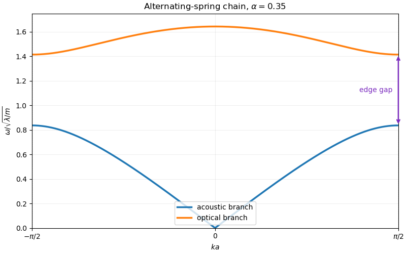
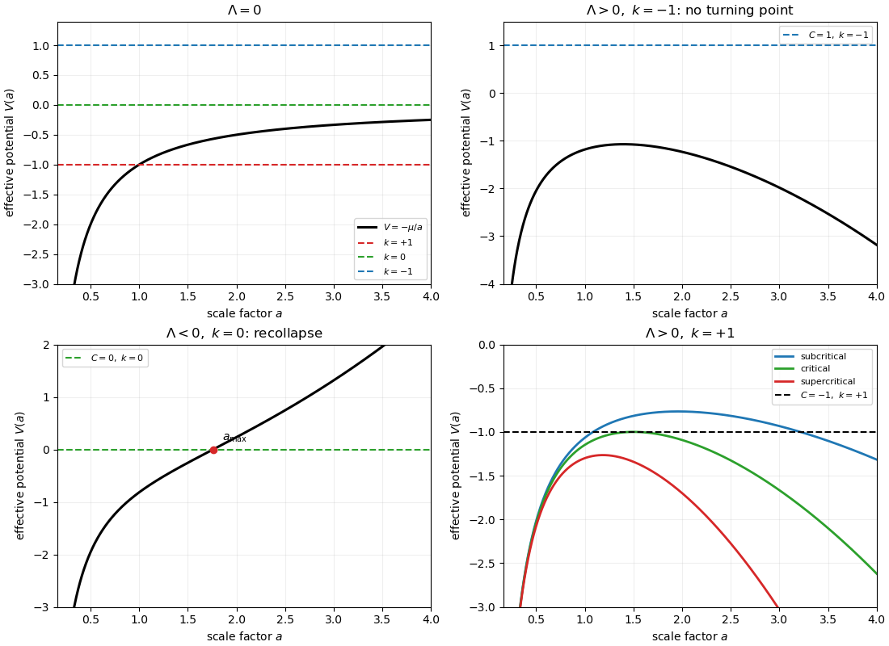
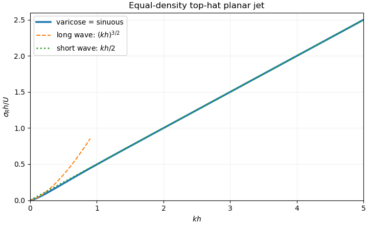

# Paper 2

↑ **Parent:** [Ii](../ii.md)

[https://www.maths.cam.ac.uk/undergrad/pastpapers/files/2018/paperii_2_2018.pdf](https://www.maths.cam.ac.uk/undergrad/pastpapers/files/2018/paperii_2_2018.pdf)

**Table of contents**

- [1G](#1g)
  - [Solution](#1g/solution)
- [2F](#2f)
  - [b](#2f/b)
    - [Solution](#2f/b/solution)
- [3H](#3h)
  - [Solution](#3h/solution)
- [4G](#4g)
  - [a](#4g/a)
    - [Solution](#4g/a/solution)
  - [b](#4g/b)
    - [Solution](#4g/b/solution)
  - [c](#4g/c)
    - [Solution](#4g/c/solution)
- [5J](#5j)
  - [Solution](#5j/solution)
- [6C](#6c)
  - [Solution](#6c/solution)
- [7B](#7b)
  - [Solution](#7b/solution)
- [8B](#8b)
  - [Solution](#8b/solution)
- [9B](#9b)
  - [a](#9b/a)
    - [Solution](#9b/a/solution)
  - [b](#9b/b)
    - [Solution](#9b/b/solution)
- [10D](#10d)
  - [a](#10d/a)
    - [Solution](#10d/a/solution)
  - [b](#10d/b)
    - [Solution](#10d/b/solution)
- [11F](#11f)
  - [a](#11f/a)
    - [Solution](#11f/a/solution)
  - [b](#11f/b)
    - [i](#11f/b/i)
      - [Solution](#11f/b/i/solution)
    - [ii](#11f/b/ii)
      - [Solution](#11f/b/ii/solution)
    - [iii](#11f/b/iii)
      - [Solution](#11f/b/iii/solution)
    - [iv](#11f/b/iv)
      - [Solution](#11f/b/iv/solution)
    - [v](#11f/b/v)
      - [Solution](#11f/b/v/solution)
- [12H](#12h)
  - [Solution](#12h/solution)
- [13B](#13b)
  - [a](#13b/a)
    - [Solution](#13b/a/solution)
  - [b](#13b/b)
    - [i](#13b/b/i)
      - [Solution](#13b/b/i/solution)
    - [ii](#13b/b/ii)
      - [Solution](#13b/b/ii/solution)
    - [iii](#13b/b/iii)
      - [Solution](#13b/b/iii/solution)
- [14B](#14b)
  - [Solution](#14b/solution)
- [15D](#15d)
  - [a](#15d/a)
    - [Solution](#15d/a/solution)
  - [b](#15d/b)
    - [Solution](#15d/b/solution)
- [16G](#16g)
  - [Solution](#16g/solution)
- [17I](#17i)
  - [Solution](#17i/solution)
- [18I](#18i)
  - [Solution](#18i/solution)
- [19I](#19i)
  - [a](#19i/a)
    - [Solution](#19i/a/solution)
  - [b](#19i/b)
    - [i](#19i/b/i)
      - [Solution](#19i/b/i/solution)
    - [ii](#19i/b/ii)
      - [Solution](#19i/b/ii/solution)
    - [iii](#19i/b/iii)
      - [Solution](#19i/b/iii/solution)
  - [c](#19i/c)
    - [Solution](#19i/c/solution)
- [20G](#20g)
  - [a](#20g/a)
    - [Solution](#20g/a/solution)
  - [b](#20g/b)
    - [Solution](#20g/b/solution)
  - [c](#20g/c)
    - [Solution](#20g/c/solution)
- [21H](#21h)
  - [a](#21h/a)
    - [Solution](#21h/a/solution)
  - [b](#21h/b)
    - [Solution](#21h/b/solution)
  - [c](#21h/c)
    - [Solution](#21h/c/solution)
  - [d](#21h/d)
    - [Solution](#21h/d/solution)
  - [e](#21h/e)
    - [Solution](#21h/e/solution)
- [22F](#22f)
  - [a](#22f/a)
    - [Solution](#22f/a/solution)
  - [b](#22f/b)
    - [Solution](#22f/b/solution)
  - [c](#22f/c)
    - [Solution](#22f/c/solution)
- [23F](#23f)
  - [Solution](#23f/solution)
- [24I](#24i)
  - [a](#24i/a)
    - [Solution](#24i/a/solution)
  - [b](#24i/b)
    - [Solution](#24i/b/solution)
- [25I](#25i)
  - [a](#25i/a)
    - [Solution](#25i/a/solution)
  - [b](#25i/b)
    - [Solution](#25i/b/solution)
  - [c](#25i/c)
    - [Solution](#25i/c/solution)
  - [d](#25i/d)
    - [Solution](#25i/d/solution)
- [26J](#26j)
  - [a](#26j/a)
    - [Solution](#26j/a/solution)
  - [b](#26j/b)
    - [Solution](#26j/b/solution)
  - [c](#26j/c)
    - [Solution](#26j/c/solution)
  - [d](#26j/d)
    - [Solution](#26j/d/solution)
- [27J](#27j)
  - [Solution](#27j/solution)
- [28K](#28k)
  - [a](#28k/a)
    - [Solution](#28k/a/solution)
  - [b](#28k/b)
    - [Solution](#28k/b/solution)
  - [c](#28k/c)
    - [Solution](#28k/c/solution)
  - [d](#28k/d)
    - [Solution](#28k/d/solution)
- [29K](#29k)
  - [a](#29k/a)
    - [Solution](#29k/a/solution)
  - [b](#29k/b)
    - [Solution](#29k/b/solution)
- [30K](#30k)
  - [a](#30k/a)
    - [Solution](#30k/a/solution)
  - [b](#30k/b)
    - [Solution](#30k/b/solution)
- [31B](#31b)
  - [Solution](#31b/solution)
- [32E](#32e)
  - [Solution](#32e/solution)
- [33A](#33a)
  - [a](#33a/a)
    - [Solution](#33a/a/solution)
  - [b](#33a/b)
    - [i](#33a/b/i)
      - [Solution](#33a/b/i/solution)
    - [ii](#33a/b/ii)
      - [Solution](#33a/b/ii/solution)
- [34D](#34d)
  - [Solution](#34d/solution)
- [35A](#35a)
  - [Solution](#35a/solution)
- [36A](#36a)
  - [a](#36a/a)
    - [Solution](#36a/a/solution)
  - [b](#36a/b)
    - [i](#36a/b/i)
      - [Solution](#36a/b/i/solution)
    - [ii](#36a/b/ii)
      - [Solution](#36a/b/ii/solution)
    - [iii](#36a/b/iii)
      - [Solution](#36a/b/iii/solution)
- [37E](#37e)
  - [a](#37e/a)
    - [Solution](#37e/a/solution)
  - [b](#37e/b)
    - [Solution](#37e/b/solution)
  - [c](#37e/c)
    - [i](#37e/c/i)
      - [Solution](#37e/c/i/solution)
    - [ii](#37e/c/ii)
      - [Solution](#37e/c/ii/solution)
    - [iii](#37e/c/iii)
      - [Solution](#37e/c/iii/solution)
- [38C](#38c)
  - [Solution](#38c/solution)
- [39C](#39c)
  - [Solution](#39c/solution)
- [40E](#40e)
  - [a](#40e/a)
    - [Solution](#40e/a/solution)
  - [b](#40e/b)
    - [Solution](#40e/b/solution)
  - [c](#40e/c)
    - [Solution](#40e/c/solution)
  - [d](#40e/d)
    - [Solution](#40e/d/solution)

## 1G

↑ **Parent:** [Paper 2](paper-2.md)

<h3 id="1g/solution">Solution</h3>

↑ **Parent:** [1G](#1g)

For an odd [prime](../../../number-theory.md#prime-number) $p$, the [Legendre symbol](../../../number-theory.md#legendre-symbol) is

$$
\left(\frac ap\right)=
\begin{cases}
0,&p\mid a,\\
1,&a\not\equiv0\pmod p\text{ and }a\text{ is a quadratic residue},\\
-1,&a\text{ is a quadratic nonresidue}.
\end{cases}
$$

[Gauss lemma](../../../riemannian-geometry.md#gauss-s-lemma-riemannian-geometry) says that if $p\nmid a$ and $N$ of the least positive residues of

$$
a,2a,\ldots,\frac{p-1}{2}a
$$

exceed $p/2$, then $(a/p)=(-1)^N$.

For $a=2$, none of $2,4,\ldots,p-1$ needs reduction modulo $p$, and the terms exceeding $p/2$ are those with $j>p/4$. Hence

$$
N=\frac{p-1}{2}-\left\lfloor\frac p4\right\rfloor.
$$

Checking $p\equiv1,3,5,7\pmod8$ shows that $N$ has the same parity as $(p^2-1)/8$. Therefore

$$
\boxed{\left(\frac2p\right)=(-1)^{(p^2-1)/8}.}
$$

By [quadratic reciprocity](../../../number-theory.md#quadratic-reciprocity), and because $149\equiv1\pmod4$,

$$
\left(\frac{105}{149}\right)
=\left(\frac3{149}\right)
 \left(\frac5{149}\right)
 \left(\frac7{149}\right)
=\left(\frac2{3}\right)
 \left(\frac4{5}\right)
 \left(\frac2{7}\right).
$$

The three factors are $-1,1,1$, respectively, so

$$
\boxed{\left(\frac{105}{149}\right)=-1.}
$$

## 2F

↑ **Parent:** [Paper 2](paper-2.md)

<h3 id="2f/b">b</h3>

↑ **Parent:** [2F](#2f)

<h4 id="2f/b/solution">Solution</h4>

↑ **Parent:** [B](#2f/b)

For part (a), fix $\mathbf x\in L$ and consider the line segment

$$
\mathbf y(t)=(1-t)\mathbf1+t\mathbf x,
\qquad 0\leq t\leq1.
$$

The [convex set](../../../mathematical-optimization.md#convex-set) $L$ contains this entire segment. For

$$
g(t)=\prod_{j=1}^n\bigl(1+t(x_j-1)\bigr)
$$

we have $g(0)=1$ and

$$
g'(0)=\sum_{j=1}^n(x_j-1)=\sum_{j=1}^nx_j-n.
$$

If $\sum_jx_j>n$, then $g(t)>1$ for all sufficiently small positive $t$, contradicting the hypothesis on $L$. Thus

$$
\boxed{\sum_{j=1}^nx_j\leq n.}
$$

For part (b), $K$ is compact, and the product of the coordinates is a [continuous function](../../../calculus.md#continuous-function). The [extreme value theorem](../../../real-analysis.md#extreme-value-theorem) therefore supplies $\mathbf u\in K$ maximizing that product. Assume every $u_j>0$ and apply part (a) to the convex set

$$
L=\left\{\left(\frac{x_1}{u_1},\ldots,\frac{x_n}{u_n}\right):\mathbf x\in K\right\}.
$$

It contains $\mathbf1$, and maximality of $\mathbf u$ makes every coordinate product at most one. Hence

$$
\boxed{\sum_{j=1}^n\frac{x_j}{u_j}\leq n\qquad(\mathbf x\in K).}
$$

If $\mathbf v$ is another maximizer, its coordinates are positive and $\prod_j(v_j/u_j)=1$. The [arithmetic-geometric mean inequality](../../../mathematical-optimization.md#arithmetic-geometric-mean-inequality) gives

$$
\frac1n\sum_j\frac{v_j}{u_j}\geq
\left(\prod_j\frac{v_j}{u_j}\right)^{1/n}=1,
$$

while the displayed inequality gives the reverse bound. Equality in the arithmetic-geometric mean inequality forces every $v_j/u_j=1$. Therefore **the maximizer $\mathbf u$ is unique**.

## 3H

↑ **Parent:** [Paper 2](paper-2.md)

<h3 id="3h/solution">Solution</h3>

↑ **Parent:** [3H](#3h)

The [binary symmetric channel](../../../coding-theory.md#binary-symmetric-channel) with crossover probability $p$ has channel matrix

$$
\boxed{\begin{pmatrix}1-p&p\\p&1-p\end{pmatrix}.}
$$

[Maximum-likelihood decoding](../../../coding-theory.md#maximum-likelihood-decoding) chooses a codeword $c$ maximizing $\mathbb P(Y=y\mid X=c)$, while [minimum-distance decoding](../../../coding-theory.md#minimum-distance-decoding) chooses one minimizing the [Hamming distance](../../../coding-theory.md#hamming-distance) $d_H(c,y)$. For a block of length $n$ sent through a binary symmetric channel,

$$
\mathbb P(Y=y\mid X=c)
=p^{d_H(c,y)}(1-p)^{n-d_H(c,y)}
=(1-p)^n\left(\frac p{1-p}\right)^{d_H(c,y)}.
$$

When $p<1/2$, the final factor decreases strictly with the distance. Thus **maximum-likelihood and minimum-distance decoding agree**.

For the length-three [repetition code](../../../coding-theory.md#repetition-code) $\{000,111\}$, majority decoding is wrong exactly when at least two bits flip. Therefore

$$
\boxed{\mathbb P(\text{error})
=\binom32p^2(1-p)+p^3
=3p^2-2p^3.}
$$

## 4G

↑ **Parent:** [Paper 2](paper-2.md)

<h3 id="4g/a">a</h3>

↑ **Parent:** [4G](#4g)

<h4 id="4g/a/solution">Solution</h4>

↑ **Parent:** [A](#4g/a)

For a set $S\subseteq Q_E$, let $E(S)$ be its [epsilon closure](../../../foundations-of-mathematics.md#epsilon-closure), and put

$$
\delta_E(S,a)=\bigcup_{q\in S}\delta_E(q,a).
$$

The [subset construction with epsilon transitions](../../../foundations-of-mathematics.md#subset-construction-with-epsilon-transitions) gives the [deterministic finite automaton](../../../foundations-of-mathematics.md#deterministic-finite-automaton)

$$
Q_D=\mathcal P(Q_E),
\qquad q_D=E(\{q_0\}),
$$

$$
\boxed{\delta_D(S,a)=E\bigl(\delta_E(S,a)\bigr),
\qquad
F_D=\{S\subseteq Q_E:S\cap F_E\ne\varnothing\}.}
$$

Unreachable subsets may be deleted from $Q_D$ without changing the recognized language.

<h3 id="4g/b">b</h3>

↑ **Parent:** [4G](#4g)

<h4 id="4g/b/solution">Solution</h4>

↑ **Parent:** [B](#4g/b)

Let $\widehat\delta_E(q_0,w)$ mean all states reachable after reading $w$, allowing arbitrary epsilon transitions before, between, and after its symbols. We prove by [mathematical induction](../../../foundations-of-mathematics.md#mathematical-induction) on $|w|$ that

$$
\widehat\delta_E(q_0,w)=\widehat\delta_D(q_D,w).
$$

For $w=\epsilon$, both sides equal $E(\{q_0\})=q_D$. Suppose the claim holds for $w$, and append $a\in\Sigma$. By the definitions of the extended transition functions and the subset construction,

$$
\widehat\delta_E(q_0,wa)
=E\bigl(\delta_E(\widehat\delta_E(q_0,w),a)\bigr)
=\delta_D(\widehat\delta_D(q_D,w),a)
=\widehat\delta_D(q_D,wa).
$$

This completes the induction.

<h3 id="4g/c">c</h3>

↑ **Parent:** [4G](#4g)

<h4 id="4g/c/solution">Solution</h4>

↑ **Parent:** [C](#4g/c)

A word $w$ is accepted by the [Epsilon-NFA](../../../foundations-of-mathematics.md#epsilon-nfa) precisely when

$$
\widehat\delta_E(q_0,w)\cap F_E\ne\varnothing.
$$

By part (b), this reached subset is exactly $\widehat\delta_D(q_D,w)$, and by the definition of $F_D$ the intersection condition is equivalent to $\widehat\delta_D(q_D,w)\in F_D$. Hence

$$
\boxed{\mathcal L(D)=\mathcal L(E).}
$$

## 5J

↑ **Parent:** [Paper 2](paper-2.md)

<h3 id="5j/solution">Solution</h3>

↑ **Parent:** [5J](#5j)

Let $RSS_0$ and $RSS_1$ be the residual sums of squares under the restricted model with $p_0$ coefficients and the full model with $p$ coefficients. Assuming $X$ has full column rank, the [nested-model F-test](../../../probability-and-statistics.md#nested-model-f-test) uses

$$
\boxed{F=\frac{(RSS_0-RSS_1)/(p-p_0)}{RSS_1/(n-p)}.}
$$

Under the null hypothesis this has the $F_{p-p_0,n-p}$ distribution.

Maximizing the Gaussian likelihood over $\beta$ and the unknown variance gives $\widehat\sigma^2=RSS/n$. Thus the [likelihood-ratio test statistic](../../../statistical-modelling.md#likelihood-ratio-test-statistic) is

$$
-2\log\Lambda=n\log\frac{RSS_0}{RSS_1}.
$$

Since

$$
\frac{RSS_0}{RSS_1}=1+\frac{p-p_0}{n-p}F,
$$

we obtain

$$
\boxed{-2\log\Lambda
=n\log\left(1+\frac{p-p_0}{n-p}F\right).}
$$

The logarithm is strictly increasing, so the two test statistics give exactly the same rejection ordering.

## 6C

↑ **Parent:** [Paper 2](paper-2.md)

<h3 id="6c/solution">Solution</h3>

↑ **Parent:** [6C](#6c)

Adding the three equations of the [SIRS model](../../../mathematical-biology.md#sir-model-with-waning-immunity) gives

$$
\frac d{dt}(S+I+R)=0,
$$

so

$$
\boxed{S(t)+I(t)+R(t)=N.}
$$

At a fixed point, $I(bS-c)=0$. The disease-free equilibrium is

$$
\boxed{(S,I,R)=(N,0,0).}
$$

For an endemic equilibrium $I^*>0$, one has $S^*=c/b$ and $aR^*=cI^*$. Conservation then gives

$$
\boxed{S^*=\frac cb,
\qquad I^*=\frac{a(bN-c)}{b(a+c)},
\qquad R^*=\frac{c(bN-c)}{b(a+c)}.}
$$

It exists with positive infected population exactly when

$$
\boxed{bN>c,}
$$

equivalently when the [basic reproduction number](../../../mathematical-biology.md#basic-reproduction-number) $bN/c$ exceeds one.

Eliminating $R=N-S-I$ yields

$$
\dot S=a(N-S-I)-bSI,
\qquad
\dot I=(bS-c)I.
$$

At the endemic equilibrium its [Jacobian matrix](../../../calculus.md#jacobian-matrix) is

$$
J=\begin{pmatrix}
-a-bI^*&-(a+c)\\
bI^*&0
\end{pmatrix}.
$$

Its trace and determinant are

$$
T=-\frac{a(a+bN)}{a+c}<0,
\qquad D=a(bN-c)>0.
$$

Therefore the endemic equilibrium is locally asymptotically stable. It is a stable node when

$$
\boxed{\frac{a^2(a+bN)^2}{(a+c)^2}\geq4a(bN-c),}
$$

and a stable focus when the inequality is reversed. Near a node, perturbations are sums of two nonoscillatory decaying exponentials. Near a focus, they execute damped oscillations with decay rate $-T/2$ and angular frequency $\sqrt{4D-T^2}/2$.

## 7B

↑ **Parent:** [Paper 2](paper-2.md)

<h3 id="7b/solution">Solution</h3>

↑ **Parent:** [7B](#7b)

Integration by parts is legitimate after symmetrically excluding a neighborhood of zero; the boundary terms vanish because $\cos(nx)-\cos(mx)=O(x^2)$ at zero and is bounded at infinity. Hence

$$
\operatorname{PV}\int_{-\infty}^{\infty}
\frac{\cos nx-\cos mx}{x^2} dx
=-n\operatorname{PV}\int_{-\infty}^{\infty}\frac{\sin nx}{x} dx
+m\operatorname{PV}\int_{-\infty}^{\infty}\frac{\sin mx}{x} dx.
$$

The standard [Dirichlet integral](../../../fourier-analysis.md#dirichlet-integral), obtained by closing the contour for $e^{iaz}/z$ in the upper half-plane and indenting above its pole at zero, is

$$
\operatorname{PV}\int_{-\infty}^{\infty}\frac{\sin(ax)}x dx=\pi
\qquad(a>0).
$$

Therefore

$$
\boxed{\operatorname{PV}\int_{-\infty}^{\infty}
\frac{\cos nx-\cos mx}{x^2} dx=\pi(m-n).}
$$

## 8B

↑ **Parent:** [Paper 2](paper-2.md)

<h3 id="8b/solution">Solution</h3>

↑ **Parent:** [8B](#8b)

In Cartesian coordinates the Lagrangian is

$$
\mathcal L=\frac12(\dot x^2+\dot y^2+\dot z^2)+y\dot x.
$$

Introduce a [Lagrange multiplier](../../../mathematical-optimization.md#lagrange-multiplier) $\lambda$ for $x^2+y^2+z^2=c^{-2}$. The [Euler-Lagrange equations](../../../analysis.md#euler-lagrange-equation) become

$$
\ddot x+\dot y=\lambda x,
\qquad
\ddot y-\dot x=\lambda y,
\qquad
\ddot z=\lambda z,
$$

or

$$
\ddot{\mathbf x}+\dot y\,\mathbf i-\dot x\,\mathbf j
=\lambda\mathbf x.
$$

Differentiating the constraint twice gives

$$
\mathbf x\mathbin\cdot\dot{\mathbf x}=0,
\qquad
\mathbf x\mathbin\cdot\ddot{\mathbf x}=-|\dot{\mathbf x}|^2.
$$

Taking the scalar product of the vector equation with $\mathbf x$ therefore yields

$$
\lambda=c^2\left(-|\dot{\mathbf x}|^2+x\dot y-y\dot x\right).
$$

Substitution gives

$$
\boxed{\ddot{\mathbf x}+\dot y\,\mathbf i-\dot x\,\mathbf j
+c^2\left(|\dot{\mathbf x}|^2+y\dot x-x\dot y\right)\mathbf x=0.}
$$

For $c=0$, the equations have the first integrals

$$
\dot x+y=A,
\qquad
\dot y-x=B,
\qquad
\dot z=C.
$$

Writing $X=x+B$ and $Y=y-A$ gives $\dot X=-Y$ and $\dot Y=X$. Hence every trajectory is

$$
\boxed{x(t)=R\cos(t-t_0)-B,
\qquad
y(t)=R\sin(t-t_0)+A,
\qquad
z(t)=Ct+D.}
$$

These are [helices](../../../electromagnetism.md#helical-motion-in-a-uniform-magnetic-field) of unit angular frequency about a line parallel to the $z$ axis, including circles when $C=0$ and a straight line when $R=0$.

## 9B

↑ **Parent:** [Paper 2](paper-2.md)

<h3 id="9b/a">a</h3>

↑ **Parent:** [9B](#9b)

<h4 id="9b/a/solution">Solution</h4>

↑ **Parent:** [A](#9b/a)

Spatial homogeneity says that the velocity of $B$ relative to $A$ depends only on their separation. Comparing both galaxies with $C$ gives

$$
\mathbf v(\mathbf r_B-\mathbf r_A)
=\mathbf v(\mathbf r_B-\mathbf r_C)-\mathbf v(\mathbf r_A-\mathbf r_C).
$$

Thus $\mathbf v(\mathbf x-\mathbf y)=\mathbf v(\mathbf x)-\mathbf v(\mathbf y)$, so continuity of the macroscopic velocity field turns this [Cauchy functional equation](../../../analysis.md#cauchy-s-functional-equation) into a linear map:

$$
v_i=H_{ij}r_j.
$$

Isotropy requires $RH=HR$ for every [rotation matrix](../../../linear-algebra.md#rotation-matrix) $R$. The only such rank-two tensor is a scalar multiple of the identity, and hence

$$
\boxed{\mathbf v=H\mathbf r.}
$$

This is the [Hubble law](../../../cosmology.md#hubble-s-law). A comoving galaxy has physical position $\mathbf r(t)=a(t)\mathbf x$, so

$$
\mathbf v=\dot a\mathbf x=\frac{\dot a}{a}\mathbf r,
\qquad
\boxed{H_0=\left.\frac{\dot a}{a}\right|_{t=t_0}.}
$$

<h3 id="9b/b">b</h3>

↑ **Parent:** [9B](#9b)

<h4 id="9b/b/solution">Solution</h4>

↑ **Parent:** [B](#9b/b)

The physical [particle horizon](../../../cosmology.md#particle-horizon) is

$$
d_H(t)=a(t)\int_0^t\frac{c\,dt'}{a(t')}.
$$

For an [Einstein-de Sitter universe](../../../large-scale-structure-of-the-universe.md#einstein-de-sitter-universe), $a(t)\propto t^{2/3}$, so

$$
d_H(t_0)=t_0^{2/3}c\int_0^{t_0}t'^{-2/3} dt'=3ct_0.
$$

Since $H_0=2/(3t_0)$,

$$
\boxed{d_H(t_0)=\frac{2c}{H_0}.}
$$

The [horizon problem](../../../cosmology.md#horizon-problem) is that widely separated regions of the observed universe have nearly identical conditions even though, in a decelerating standard Big Bang history, their past light cones do not overlap early enough to establish causal thermal equilibrium.

## 10D

↑ **Parent:** [Paper 2](paper-2.md)

<h3 id="10d/a">a</h3>

↑ **Parent:** [10D](#10d)

<h4 id="10d/a/solution">Solution</h4>

↑ **Parent:** [A](#10d/a)

For $|\psi\rangle=a|0\rangle+b|1\rangle$, the [Controlled-NOT gate](../../../quantum-theory.md#controlled-not-gate) gives

$$
CX(|\psi\rangle|0\rangle)=a|00\rangle+b|11\rangle.
$$

A cloned product would instead be

$$
|\psi\rangle|\psi\rangle
=a^2|00\rangle+ab|01\rangle+ab|10\rangle+b^2|11\rangle.
$$

Equality up to a physically irrelevant global phase requires $ab=0$. Thus

$$
\boxed{CX\text{ clones precisely the computational-basis states }|0\rangle\text{ and }|1\rangle,\text{ up to phase}.}
$$

For a genuine superposition it creates [quantum entanglement](../../../bell-state.md#entangled-state) instead of two independent copies.

<h3 id="10d/b">b</h3>

↑ **Parent:** [10D](#10d)

<h4 id="10d/b/solution">Solution</h4>

↑ **Parent:** [B](#10d/b)

The [no-cloning theorem for two pure states](../../../quantum-theory.md#no-cloning-theorem-for-two-pure-states) states that no single [unitary operator](../../../vector-space.md#unitary-operator) can clone two distinct nonorthogonal states. Suppose, to the contrary, that

$$
U|\alpha_j\rangle|0\rangle
=|\alpha_j\rangle|\alpha_j\rangle,
\qquad j=0,1.
$$

Preservation of the [inner product](../../../linear-algebra.md#inner-product) by $U$ gives

$$
\langle\alpha_0|\alpha_1\rangle
=\langle\alpha_0|\alpha_1\rangle^2.
$$

Writing $z=\langle\alpha_0|\alpha_1\rangle$, this requires $z=0$ or $z=1$. The first case is orthogonality; the second means that the normalized states represent the same ray. Both contradict the assumptions. Therefore **distinct nonorthogonal quantum states cannot be cloned by a unitary process**.

## 11F

↑ **Parent:** [Paper 2](paper-2.md)

<h3 id="11f/a">a</h3>

↑ **Parent:** [11F](#11f)

<h4 id="11f/a/solution">Solution</h4>

↑ **Parent:** [A](#11f/a)

For $f\in C[0,1]$, define its [Bernstein polynomial](../../../functional-analysis.md#bernstein-polynomial)

$$
B_nf(x)=\sum_{k=0}^nf\left(\frac kn\right)\binom nkx^k(1-x)^{n-k}.
$$

If $X_{n,x}\sim\operatorname{Bin}(n,x)$, then

$$
B_nf(x)=\mathbb E f(X_{n,x}/n),
\quad
\mathbb E(X_{n,x}/n)=x,
\quad
\operatorname{Var}(X_{n,x}/n)=\frac{x(1-x)}n\leq\frac1{4n}.
$$

Let $M=\|f\|_\infty$. By [uniform continuity](../../../topological-analysis.md#uniform-continuity), for any $\varepsilon>0$ choose $\delta>0$ such that $|f(u)-f(v)|<\varepsilon/2$ whenever $|u-v|<\delta$. Splitting the expectation according to that event and using [Chebyshev's inequality](../../../probability-inequality.md#chebyshev-inequality) gives, uniformly in $x$,

$$
|B_nf(x)-f(x)|
\leq\frac\varepsilon2+2M\mathbb P(|X_{n,x}/n-x|\geq\delta)
\leq\frac\varepsilon2+\frac{M}{2n\delta^2}.
$$

For sufficiently large $n$ this is below $\varepsilon$. Thus $B_nf\to f$ uniformly on $[0,1]$. An affine change of variable treats every compact interval, proving the [Weierstrass approximation theorem](../../../functional-analysis.md#weierstrass-approximation-theorem).

<h3 id="11f/b">b</h3>

↑ **Parent:** [11F](#11f)

<h4 id="11f/b/i">i</h4>

↑ **Parent:** [B](#11f/b)

<h5 id="11f/b/i/solution">Solution</h5>

↑ **Parent:** [I](#11f/b/i)

**True.** For each $n$, the [Weierstrass approximation theorem](../../../functional-analysis.md#weierstrass-approximation-theorem) gives a polynomial $P_n$ such that

$$
\sup_{|x|\leq n}|P_n(x)-f(x)|<\frac1n.
$$

For each fixed $x\in\mathbb R$, this estimate applies once $n\geq|x|$, so $P_n(x)\to f(x)$ pointwise.

<h4 id="11f/b/ii">ii</h4>

↑ **Parent:** [B](#11f/b)

<h5 id="11f/b/ii/solution">Solution</h5>

↑ **Parent:** [Ii](#11f/b/ii)

**False.** Take the bounded nonconstant continuous function $f(x)=\sin x$. If polynomials $P_n$ converged uniformly to $f$ on $\mathbb R$, then each sufficiently late $P_n$ would be bounded on $\mathbb R$ and hence constant. A uniform limit of constants is constant, a contradiction. More generally, the [globally uniform limit of real polynomials](../../../functional-analysis.md#globally-uniform-limit-of-real-polynomials) is itself a polynomial.

<h4 id="11f/b/iii">iii</h4>

↑ **Parent:** [B](#11f/b)

<h5 id="11f/b/iii/solution">Solution</h5>

↑ **Parent:** [Iii](#11f/b/iii)

**False.** The bounded continuous function $f(x)=\sin(1/x)$ on $(0,1]$ has no limit at zero. If polynomials converged uniformly to it there, they would be uniformly Cauchy on $(0,1]$ and hence on $[0,1]$ by continuity at zero. Their uniform limit on $[0,1]$ would continuously extend $f$ to zero, which is impossible.

<h4 id="11f/b/iv">iv</h4>

↑ **Parent:** [B](#11f/b)

<h5 id="11f/b/iv/solution">Solution</h5>

↑ **Parent:** [Iv](#11f/b/iv)

**True.** First choose polynomials $Q_n\to f$ uniformly by the [Weierstrass approximation theorem](../../../functional-analysis.md#weierstrass-approximation-theorem). Let $L_1,\ldots,L_m$ be the [Lagrange interpolation polynomials](../../../numerical-analysis.md#lagrange-polynomial) for the nodes $x_1,\ldots,x_m$, so $L_j(x_i)=\delta_{ij}$. Set

$$
P_n(x)=Q_n(x)+\sum_{j=1}^m\bigl(f(x_j)-Q_n(x_j)\bigr)L_j(x).
$$

Then $P_n(x_j)=f(x_j)$ for every $j$, while

$$
\|P_n-f\|_\infty
\leq\|Q_n-f\|_\infty
\left(1+\sum_{j=1}^m\|L_j\|_\infty\right)\longrightarrow0.
$$

<h4 id="11f/b/v">v</h4>

↑ **Parent:** [B](#11f/b)

<h5 id="11f/b/v/solution">Solution</h5>

↑ **Parent:** [V](#11f/b/v)

**True.** By the [Weierstrass approximation theorem](../../../functional-analysis.md#weierstrass-approximation-theorem), choose polynomials $q_n$ with $q_n\to f^{(m)}$ uniformly. Define $P_n$ by integrating $q_n$ exactly $m$ times and choose the $m$ integration constants so that

$$
P_n^{(r)}(0)=f^{(r)}(0),
\qquad 0\leq r<m.
$$

Then $P_n^{(m)}=q_n$, and repeated use of the [fundamental theorem of calculus](../../../calculus.md#fundamental-theorem-of-calculus) gives

$$
\|P_n^{(r)}-f^{(r)}\|_\infty
\leq\frac{\|q_n-f^{(m)}\|_\infty}{(m-r)!}
\qquad(0\leq r<m).
$$

Every derivative therefore converges uniformly as required.

## 12H

↑ **Parent:** [Paper 2](paper-2.md)

<h3 id="12h/solution">Solution</h3>

↑ **Parent:** [12H](#12h)

In the [RSA cryptosystem](../../../algebra.md#rsa-cryptosystem), choose distinct primes $p,q$, set $N=pq$, and choose $e$ with $\gcd(e,\phi(N))=1$. The public key is $(N,e)$; the private exponent satisfies

$$
ed\equiv1\pmod{\phi(N)}.
$$

A message $m$ is encrypted and decrypted by

$$
c\equiv m^e\pmod N,
\qquad
m\equiv c^d\pmod N.
$$

Suppose $\phi(N)\mid2^ab$, where $b$ is odd. For a unit $x$ modulo $N$, both $O_p(x^b)$ and $O_q(x^b)$ are powers of two dividing $2^a$. If these orders differ, assume without loss of generality that

$$
O_p(x^b)=2^r<2^s=O_q(x^b).
$$

Taking $t=r<a$ gives

$$
x^{2^tb}\equiv1\pmod p,
\qquad
x^{2^tb}\not\equiv1\pmod q,
$$

and hence

$$
\boxed{\gcd(x^{2^tb}-1,N)=p,}
$$

a nontrivial factor.

To count successful $x$, write $p-1=2^ru$ and $q-1=2^sv$ with $u,v$ odd. Raising to the odd power $b$, which is divisible by the odd parts, maps a uniformly chosen element of each cyclic multiplicative group uniformly onto its Sylow two-subgroup. In a cyclic group of order $2^r$, the probability of order $1$ is $2^{-r}$ and that of order $2^j$ is $2^{j-1-r}$ for $1\leq j\leq r$. If $r\leq s$, the probability that the two resulting orders agree is

$$
\frac{1+\sum_{j=1}^r4^{j-1}}{2^{r+s}}
=\frac{4^r+2}{3\cdot2^{r+s}}
\leq\frac12.
$$

Thus at least half of the $\phi(N)$ units satisfy $O_p(x^b)\ne O_q(x^b)$.

Knowing $d$ reveals the multiple $ed-1$ of $\phi(N)$. Writing $ed-1=2^ab$ with $b$ odd and trying random units therefore yields a factor with probability at least one half per trial; nonunits already reveal a factor by taking their greatest common divisor with $N$. Conversely, factoring $N$ gives $\phi(N)$ and hence $d=e^{-1}\pmod{\phi(N)}$. This proves that recovering the private key is computationally equivalent, up to randomized polynomial-time work, to factoring the RSA modulus, as summarized by [RSA private exponent reveals the factorization](../../../algebra.md#rsa-private-exponent-reveals-the-factorization).

For $N=77$ and $e=43$, $\phi(N)=60$ and

$$
d\equiv43^{-1}\equiv7\pmod{60}.
$$

Therefore

$$
\boxed{m\equiv5^7\equiv47\pmod{77}.}
$$

Finally, $e$ is odd because it is coprime to the even integer $\phi(N)$. If $m^e\equiv m\pmod N$, then

$$
(N-m)^e\equiv(-m)^e\equiv-m^e\equiv-m\equiv N-m\pmod N.
$$

Thus **fixed points occur in complementary pairs $m,N-m$**, which is the [Complementary RSA fixed points](../../../algebra.md#complementary-rsa-fixed-points) property.

## 13B

↑ **Parent:** [Paper 2](paper-2.md)

<h3 id="13b/a">a</h3>

↑ **Parent:** [13B](#13b)

<h4 id="13b/a/solution">Solution</h4>

↑ **Parent:** [A](#13b/a)

A [branch point](../../../complex-analysis.md#branch-point) of a multivalued analytic function is a point around which analytic continuation along a closed loop can return a different value. A [branch cut](../../../analysis.md#branch-cut) is a curve or union of curves removed from the domain so that loops causing this monodromy are excluded and one single-valued branch can be chosen.

<h3 id="13b/b">b</h3>

↑ **Parent:** [13B](#13b)

<h4 id="13b/b/i">i</h4>

↑ **Parent:** [B](#13b/b)

<h5 id="13b/b/i/solution">Solution</h5>

↑ **Parent:** [I](#13b/b/i)

Write $z=re^{i\theta}$ with $r>0$ and $0\leq\theta<2\pi$, and write $w=u+iv$. Since

$$
e^w=e^ue^{iv}=re^{i\theta},
$$

we have

$$
u=\log r,
\qquad
v=\theta+2\pi n,
\qquad n\in\mathbb Z.
$$

Thus the inverse of the exponential is the infinitely valued [complex logarithm](../../../analysis.md#complex-logarithm)

$$
\boxed{w(z)=\log r+i(\theta+2\pi n),\qquad n\in\mathbb Z.}
$$

For the angle convention in the question, its principal value is

$$
\boxed{\operatorname{Log}z=\log r+i\theta,\qquad0\leq\theta<2\pi.}
$$

<h4 id="13b/b/ii">ii</h4>

↑ **Parent:** [B](#13b/b)

<h5 id="13b/b/ii/solution">Solution</h5>

↑ **Parent:** [Ii](#13b/b/ii)

On taking $z$ once anticlockwise around zero, $\theta$ increases by $2\pi$ and $w$ changes by $2\pi i$; hence zero is a [branch point](../../../complex-analysis.md#branch-point). Under the coordinate $\zeta=1/z$, a loop around $\zeta=0$ corresponds to a loop around infinity and produces the opposite increment, so infinity is also a branch point. Removing any curve joining the two branch points prevents such loops. With $0<\arg z<2\pi$, one possible [branch cut](../../../analysis.md#branch-cut) is therefore

$$
\boxed{\{z:\operatorname{Im}z=0,\ \operatorname{Re}z>0\}.}
$$

<h4 id="13b/b/iii">iii</h4>

↑ **Parent:** [B](#13b/b)

<h5 id="13b/b/iii/solution">Solution</h5>

↑ **Parent:** [Iii](#13b/b/iii)

On the cut plane choose $0<\theta<2\pi$. For $z=x+iy$,

$$
u(x,y)=\frac12\log(x^2+y^2),
\qquad v(x,y)=\arg(x+iy).
$$

Their derivatives are

$$
u_x=\frac{x}{x^2+y^2}=v_y,
\qquad
u_y=\frac{y}{x^2+y^2}=-v_x.
$$

The [Cauchy-Riemann equations](../../../analysis.md#cauchy-riemann-equations) hold, so this branch is holomorphic. Its derivative is

$$
\boxed{\frac{dw}{dz}=u_x+iv_x
=\frac{x-iy}{x^2+y^2}=\frac1z.}
$$

## 14B

↑ **Parent:** [Paper 2](paper-2.md)

<h3 id="14b/solution">Solution</h3>

↑ **Parent:** [14B](#14b)

A [principal body frame](../../../classical-mechanics.md#principal-body-frame) is an orthonormal basis $\mathbf e_a(t)$ fixed in the rotating body and aligned with its principal axes. If $R(t)$ is the rotation matrix whose columns are these vectors, differentiating $R^TR=I$ shows that $\dot R R^T$ is [skew-symmetric](../../../linear-algebra.md#skew-symmetric-matrix). Every skew-symmetric linear map in three dimensions is cross product with a unique vector $\boldsymbol\omega$, so

$$
\boxed{\dot{\mathbf e}_a=\boldsymbol\omega\mathbin\times\mathbf e_a.}
$$

For any vector $\mathbf A=A_a\mathbf e_a$,

$$
\left(\frac{d\mathbf A}{dt}\right)_{
m space}
=\dot A_a\mathbf e_a+\boldsymbol\omega\mathbin\times\mathbf A.
$$

Applying this to the conserved angular momentum

$$
\mathbf L=I_1\omega_1\mathbf e_1+I_2\omega_2\mathbf e_2+I_3\omega_3\mathbf e_3
$$

gives the [Euler equations for a torque-free rigid body](../../../classical-mechanics.md#euler-equations-for-a-torque-free-rigid-body):

$$
\boxed{
I_1\dot\omega_1=(I_2-I_3)\omega_2\omega_3,
\quad
I_2\dot\omega_2=(I_3-I_1)\omega_3\omega_1,
\quad
I_3\dot\omega_3=(I_1-I_2)\omega_1\omega_2.}
$$

Multiplying these equations respectively by $\omega_i$ and summing proves conservation of [kinetic energy](../../../classical-mechanics.md#kinetic-energy); multiplying by $I_i\omega_i$ and summing proves conservation of squared [angular momentum](../../../classical-mechanics.md#angular-momentum). Thus the [torque-free rigid-body invariants](../../../classical-mechanics.md#torque-free-rigid-body-invariants) are

$$
2E=I_1\omega_1^2+I_2\omega_2^2+I_3\omega_3^2,
\qquad
L^2=I_1^2\omega_1^2+I_2^2\omega_2^2+I_3^2\omega_3^2.
$$

Solving these two linear equations for the first two squared components gives

$$
\omega_1^2=
\frac{L^2-2EI_2+I_3(I_2-I_3)\omega_3^2}{I_1(I_1-I_2)},
$$

$$
\omega_2^2=
\frac{L^2-2EI_1+I_3(I_1-I_3)\omega_3^2}{I_2(I_2-I_1)}.
$$

Using $I_3\dot\omega_3=(I_1-I_2)\omega_1\omega_2$ yields the [quartic equation for one component of torque-free angular velocity](../../../classical-mechanics.md#quartic-equation-for-one-component-of-torque-free-angular-velocity):

$$
\boxed{
\dot\omega_3^2=f(\omega_3)
=-\frac{
\left[L^2-2EI_2+I_3(I_2-I_3)\omega_3^2\right]
\left[L^2-2EI_1+I_3(I_1-I_3)\omega_3^2\right]
}{I_1I_2I_3^2}.}
$$

## 15D

↑ **Parent:** [Paper 2](paper-2.md)

<h3 id="15d/a">a</h3>

↑ **Parent:** [15D](#15d)

<h4 id="15d/a/solution">Solution</h4>

↑ **Parent:** [A](#15d/a)

Let $|\alpha\rangle=a|0\rangle+b|1\rangle$ be Alice's unknown qubit, and label her half of the shared [Bell state](../../../bell-state.md) by $A$ and Bob's by $B$. Alice applies a [Controlled-NOT gate](../../../quantum-theory.md#controlled-not-gate) from the unknown qubit to $A$, then a [Hadamard gate](../../../quantum-theory.md#hadamard-gate) to the unknown qubit. The three-qubit state becomes

$$
\frac12\sum_{j,k\in\{0,1\}}|jk\rangle\,X^kZ^j|\alpha\rangle_B.
$$

Alice measures her two qubits in the computational basis and sends the two classical outcomes $(j,k)$ to Bob. Bob applies $Z^jX^k$, recovering $|\alpha\rangle$ with certainty. This is [quantum teleportation](../../../bell-state.md#quantum-teleportation); Alice never needs to know the state.

For the shared [GHZ state](../../../quantum-theory.md#greenberger-horne-zeilinger-state), Charlie first applies a Hadamard gate to his qubit. Then

$$
\frac{|000\rangle+|111\rangle}{\sqrt2}
\longmapsto
\frac1{\sqrt2}\left(|\phi^+\rangle_{AB}|0\rangle_C
+|\phi^-\rangle_{AB}|1\rangle_C\right).
$$

Charlie measures in the computational basis. Outcome $0$ leaves Alice and Bob with $|\phi^+\rangle$; outcome $1$ leaves $|\phi^-\rangle$, which either party converts to $|\phi^+\rangle$ by applying $Z$ after Charlie reports the outcome. Thus

$$
\boxed{\text{Charlie creates the required shared Bell pair with probability one.}}
$$

<h3 id="15d/b">b</h3>

↑ **Parent:** [15D](#15d)

<h4 id="15d/b/solution">Solution</h4>

↑ **Parent:** [B](#15d/b)

[Quantum no-signalling](../../../quantum-theory.md#quantum-no-signalling) says that, without communicating a measurement outcome, any local trace-preserving operation performed on subsystem $A$ leaves all outcome probabilities for measurements on subsystem $B$ unchanged; equivalently, it leaves the [reduced density matrix](../../../bell-state.md#reduced-density-matrix) $\rho_B$ unchanged.

The two Bell states are orthogonal. Applying the inverse Bell-state preparation circuit, namely a [Controlled-NOT gate](../../../quantum-theory.md#controlled-not-gate) from $A$ to $B$ followed by a [Hadamard gate](../../../quantum-theory.md#hadamard-gate) on $A$, gives

$$
|\phi^+\rangle\longmapsto|00\rangle,
\qquad
|\phi^-\rangle\longmapsto|10\rangle.
$$

A computational-basis measurement therefore distinguishes them perfectly, so

$$
\boxed{P_{\rm err}^{AB}=0.}
$$

If only $B$ is accessible, however,

$$
\operatorname{tr}_A|\phi^+\rangle\langle\phi^+|
=\operatorname{tr}_A|\phi^-\rangle\langle\phi^-|
=\frac I2.
$$

Every measurement on $B$ consequently has the same outcome distribution under both hypotheses. With equal prior probabilities no information is available, and

$$
\boxed{P_{\rm err}^{B}=\frac12,}
$$

the error probability of a random guess.

## 16G

↑ **Parent:** [Paper 2](paper-2.md)

<h3 id="16g/solution">Solution</h3>

↑ **Parent:** [16G](#16g)

The [Knaster–Tarski fixed-point theorem](../../../mathematical-logic.md#knaster-tarski-fixed-point-theorem) states that if $L$ is a [complete lattice](../../../mathematical-logic.md#complete-lattice) and $f:L\to L$ is [order-preserving](../../../set.md#order-preserving-function), then the fixed points of $f$ form a complete lattice; in particular, $f$ has least and greatest fixed points.

Let

$$
P=\{x\in L:f(x)\leq x\},
\qquad a=\bigwedge P.
$$

For every $x\in P$, monotonicity gives $f(a)\leq f(x)\leq x$, so $f(a)\leq a$. Applying $f$ once more shows $f(f(a))\leq f(a)$, hence $f(a)\in P$. Therefore $a\leq f(a)$ by the definition of $a$, and $f(a)=a$. Every fixed point belongs to $P$, so $a$ is the least fixed point. Dually, $\bigvee\{x:x\leq f(x)\}$ is the greatest fixed point. For any family $S$ of fixed points, apply the same argument inside the upper interval above $\bigvee S$ to obtain the least fixed point above every member of $S$; this is their join in the fixed-point set. The dual construction supplies meets, proving the full statement.

To deduce the [Cantor-Schröder-Bernstein theorem](../../../set-theory.md#cantor-schroder-bernstein-theorem), let $i:A\to B$ and $j:B\to A$ be injections. On the complete lattice $\mathcal P(A)$ define

$$
F(X)=A\setminus j(B\setminus i(X)).
$$

This map is order-preserving, so it has a fixed point $X$. The relation

$$
A\setminus X=j(B\setminus i(X))
$$

shows that

$$
h(a)=\begin{cases}
i(a),&a\in X,\\
j^{-1}(a),&a\notin X
\end{cases}
$$

is a bijection: its two pieces map bijectively onto the disjoint sets $i(X)$ and $B\setminus i(X)$. Thus injections both ways imply a bijection.

Let $P$ be the poset of countable subsets of $\mathbb R$. The family of all singletons $\{\{r\}:r\in\mathbb R\}$ has no upper bound in $P$, since any upper bound would contain every real number and would be uncountable. Therefore

$$
\boxed{P\text{ is not complete}.}
$$

Finally, use the [well-ordering theorem](../../../set-theory.md#well-ordering-theorem) to fix a well-order $\prec$ of $\mathbb R$. Every countable $A$ omits some real number; let $m(A)$ be its $\prec$-least omitted element and define

$$
f(A)=A\cup\{m(A)\}.
$$

If $A\subseteq B$, then either $m(A)\in B$, or every point preceding $m(A)$ lies in $A\subseteq B$ and $m(A)=m(B)$. In either case $f(A)\subseteq f(B)$, so $f$ is order-preserving. Yet $m(A)\notin A$, and hence

$$
\boxed{f(A)\ne A\text{ for every }A\in P.}
$$

This does not contradict Knaster–Tarski because $P$ is not a complete lattice.

## 17I

↑ **Parent:** [Paper 2](paper-2.md)

<h3 id="17i/solution">Solution</h3>

↑ **Parent:** [17I](#17i)

We first prove the required case of [Menger's theorem](../../../graph-theory.md#menger-theorem) directly. Split each vertex $v$ into $v_{
m in}$ and $v_{
m out}$ joined by a directed edge of capacity one. Replace every graph edge $uv$ by the two directed edges $u_{
m out}v_{
m in}$ and $v_{
m out}u_{
m in}$ of capacity $k$, add a source joined to every $a_{\rm in}$ for $a\in A$, and join every $b_{\rm out}$ for $b\in B$ to a sink, using unit capacities at the ends.

Starting with zero integral flow, repeatedly augment by one along a source-to-sink path in the residual directed graph. If fewer than $k$ augmentations have occurred and no augmenting path remains, let $R$ be the residual-reachable vertices. The capacity from $R$ to its complement equals the current flow: every forward edge in this cut is saturated and every reverse edge carries zero flow, by residual reachability. Since the cut has capacity below $k$, it uses no capacity-$k$ graph edge. The original vertices whose unit-capacity split or endpoint edges cross the cut form an $AB$-separator of size below $k$, contrary to the hypothesis. Hence at least $k$ augmentations occur. The resulting integral flow decomposes into $k$ source-to-sink paths, and the unit split capacities make their corresponding $AB$ paths vertex-disjoint. This proves

$$
\boxed{\text{there are }k\text{ vertex-disjoint }AB\text{-paths}.}
$$

The same augmenting-path proof, with the source vertex given capacity $k$, yields the [fan lemma](../../../graph-theory.md#fan-lemma): from a vertex $x$ to any set of at least $k$ vertices in a [k-connected graph](../../../graph-theory.md#k-connected-graph), there is a $k$-fan with distinct endpoints.

Now let $C$ be a longest cycle in a finite $k$-connected graph $G$. If $C$ is not Hamiltonian, choose $x\notin C$. A $k$-fan from $x$ to $C$ has $k$ distinct attachment vertices. If $|C|<2k$, two consecutive attachment vertices on $C$ are joined by an edge of $C$, because the $k$ cyclic gaps cannot all have length at least two. The two corresponding fan paths form, through $x$, an alternative path of length at least two between those adjacent vertices. Replacing their edge on $C$ by this path creates a longer cycle, a contradiction. Therefore

$$
\boxed{|C|\geq\min\{|G|,2k\}.}
$$

This is the [Dirac circumference theorem](../../../graph-theory.md#dirac-circumference-theorem); in particular, a $k$-connected graph contains a cycle of length at least $k$, and when $|G|\geq2k$ it **must** contain one of length at least $2k$.

For $k=3$, every 3-connected graph with at least six vertices consequently has a cycle of length at least six. This cannot be improved: the [complete bipartite graph](../../../graph-theory.md#complete-bipartite-graph) $K_{3,m}$ is 3-connected for $m\geq3$, but every cycle alternates between its two parts and therefore has length at most six. Taking $m$ arbitrarily large defeats every proposed bound above six. Hence

$$
\boxed{n=6.}
$$

## 18I

↑ **Parent:** [Paper 2](paper-2.md)

<h3 id="18i/solution">Solution</h3>

↑ **Parent:** [18I](#18i)

The [splitting field](../../../galois-theory.md#splitting-field) of $f\in K[t]$ is the smallest extension $L/K$ in which $f$ is a product of linear factors; equivalently, $L$ is generated over $K$ by all its [roots of a polynomial](../../../polynomial.md#root-of-a-polynomial). To prove [existence and uniqueness of splitting fields](../../../galois-theory.md#existence-and-uniqueness-of-splitting-fields), adjoin a root of an [irreducible polynomial](../../../polynomial.md#irreducible-polynomial) dividing $f$ and repeat until $f$ splits. If $L$ and $L'$ are two resulting fields, an embedding between the fields generated so far extends by sending each newly adjoined root to a root of its transformed [minimal polynomial](../../../linear-operator-theory.md#minimal-polynomial). Repetition gives a $K$-embedding $L\to L'$, whose image contains every root of $f$ and is therefore all of $L'$. Thus the splitting field exists and is unique up to $K$-isomorphism.

Now write $K=\mathbb F_q$, and let the distinct irreducible factors of $f$ have degrees $d_1,\ldots,d_r$. The [irreducible factors of a finite-field Frobenius polynomial](../../../algebra.md#irreducible-factors-of-a-finite-field-frobenius-polynomial) show that a root of the degree-$d_i$ factor lies in $\mathbb F_{q^n}$ exactly when $d_i\mid n$. Hence the [splitting field over a finite field](../../../galois-theory.md#splitting-field-over-a-finite-field) is

$$
L=\mathbb F_{q^m},
\qquad
\boxed{[L:K]=m=\operatorname{lcm}(d_1,\ldots,d_r)}.
$$

Every [finite field](../../../algebra.md#finite-field) is a [perfect field](../../../algebra.md#perfect-field), so $L/K$ is separable; it is normal because it is a splitting field. It is consequently a [Galois extension](../../../galois-theory.md#finite-galois-extension). More explicitly, the [Galois group of a finite field extension](../../../algebra.md#galois-group-of-a-finite-field-extension) is the [cyclic group](../../../group.md#cyclic-group) of order $m$ generated by the [finite-field Frobenius automorphism](../../../algebra.md#finite-field-frobenius-automorphism) $x\mapsto x^q$.

Finally, let $N_2(n)$ denote the [number of monic irreducible polynomials over a finite field](../../../algebra.md#number-of-monic-irreducible-polynomials-over-a-finite-field) of degree $n$ over $\mathbb F_2$. Since

$$
N_q(n)=\frac1n\sum_{d\mid n}\mu(d)q^{n/d},
$$

and $\mu(1)=1$, $\mu(3)=-1$, $\mu(9)=0$, we obtain

$$
\boxed{|\mathcal P_9|=N_2(9)=\frac{2^9-2^3}{9}=56.}
$$

## 19I

↑ **Parent:** [Paper 2](paper-2.md)

<h3 id="19i/a">a</h3>

↑ **Parent:** [19I](#19i)

<h4 id="19i/a/solution">Solution</h4>

↑ **Parent:** [A](#19i/a)

By [character orthogonality](../../../representation-theory.md#character-orthogonality), the squared multiplicities are the [character inner product](../../../representation-theory.md#character-inner-product) norm of the [restriction of a character](../../../representation-theory.md#restriction-of-a-character):

$$
\sum_{i=1}^r a_i^2
=\langle\chi\mathbin{\downarrow}_H,\chi\mathbin{\downarrow}_H\rangle_H
=\frac1{|H|}\sum_{h\in H}|\chi(h)|^2.
$$

Since $\chi$ is an [irreducible character](../../../representation-theory.md#irreducible-character), its norm on $G$ is one, and hence

$$
\sum_i a_i^2
\leq\frac1{|H|}\sum_{g\in G}|\chi(g)|^2
=\frac{|G|}{|H|}=[G:H].
$$

The omitted summands are nonnegative, so the [character restriction norm bound](../../../representation-theory.md#character-restriction-norm-bound) is an equality precisely when

$$
\boxed{\chi(g)=0\quad\text{for every }g\in G\setminus H.}
$$

<h3 id="19i/b">b</h3>

↑ **Parent:** [19I](#19i)

<h4 id="19i/b/i">i</h4>

↑ **Parent:** [B](#19i/b)

<h5 id="19i/b/i/solution">Solution</h5>

↑ **Parent:** [I](#19i/b/i)

Because $[G:H]=2$, part (a) says that the squared norm of $\chi\mathbin{\downarrow}_H$ is either one or two. It is one exactly when the restriction is irreducible, whereas it is two exactly when $\chi$ vanishes throughout $G\setminus H$. Thus condition (1) is equivalent to the existence in condition (2).

On $H$ we always have $\chi\lambda=\chi$, while outside $H$ we have $\chi\lambda=-\chi$. Therefore $\chi\lambda=\chi$ exactly when $\chi$ vanishes outside $H$. This proves all three equivalences in the [index-two character restriction dichotomy](../../../representation-theory.md#index-two-character-restriction-dichotomy):

$$
\boxed{(1)\Longleftrightarrow(2)\Longleftrightarrow(3).}
$$

<h4 id="19i/b/ii">ii</h4>

↑ **Parent:** [B](#19i/b)

<h5 id="19i/b/ii/solution">Solution</h5>

↑ **Parent:** [Ii](#19i/b/ii)

The [permutation character of a coset action](../../../representation-theory.md#permutation-character-of-a-coset-action) on $G/H$ is $1_G+\lambda$. The [tensor identity for an induced character](../../../representation-theory-of-the-symmetric-group.md#tensor-identity-for-an-induced-character) therefore gives

$$
\operatorname{Ind}_H^G(\chi\mathbin{\downarrow}_H)
=\chi(1_G+\lambda)=\chi+\chi\lambda.
$$

If $\psi\mathbin{\downarrow}_H=\chi\mathbin{\downarrow}_H$ is irreducible, then [Frobenius reciprocity](../../../representation-theory.md#frobenius-reciprocity) gives

$$
1=\langle\chi\mathbin{\downarrow}_H,
\psi\mathbin{\downarrow}_H\rangle_H
=\langle\chi+\chi\lambda,\psi\rangle_G.
$$

Both $\chi$ and $\chi\lambda$ are irreducible, so

$$
\boxed{\psi=\chi\quad\text{or}\quad\psi=\chi\lambda.}
$$

<h4 id="19i/b/iii">iii</h4>

↑ **Parent:** [B](#19i/b)

<h5 id="19i/b/iii/solution">Solution</h5>

↑ **Parent:** [Iii](#19i/b/iii)

Here the restriction has squared norm two, so part (b)(i) gives $\chi\lambda=\chi$. Consequently

$$
\operatorname{Ind}_H^G\psi_1+
\operatorname{Ind}_H^G\psi_2
=\operatorname{Ind}_H^G(\chi\mathbin{\downarrow}_H)
=\chi+\chi\lambda=2\chi.
$$

By [Frobenius reciprocity](../../../representation-theory.md#frobenius-reciprocity), each induced character on the left contains $\chi$, because each $\psi_i$ is a [character constituent](../../../representation-theory.md#character-constituent) of $\chi\mathbin{\downarrow}_H$. Positivity of irreducible multiplicities then forces

$$
\operatorname{Ind}_H^G\psi_1
=\operatorname{Ind}_H^G\psi_2=\chi.
$$

If $\phi\mathbin{\downarrow}_H$ contains either $\psi_i$, Frobenius reciprocity makes $\phi$ a constituent of $\operatorname{Ind}_H^G\psi_i=\chi$. Since both are irreducible,

$$
\boxed{\phi=\chi.}
$$

<h3 id="19i/c">c</h3>

↑ **Parent:** [19I](#19i)

<h4 id="19i/c/solution">Solution</h4>

↑ **Parent:** [C](#19i/c)

The norm

$$
\langle\chi\mathbin{\downarrow}_K,
\chi\mathbin{\downarrow}_K\rangle_K
$$

is a positive integer, because it is the sum of the squares of the multiplicities of the irreducible constituents. The [character restriction norm bound](../../../representation-theory.md#character-restriction-norm-bound) and $[G:K]=3$ make it at most three. It is therefore **$1$, $2$, or $3$**.

All three values occur:

- In $G=S_3$ with $K=\langle(12)\rangle$, the trivial character remains irreducible on $K$, giving norm $1$.
- For the same pair, the two-dimensional [standard representation of the symmetric group](../../../representation-theory.md#standard-representation-of-the-symmetric-group) restricts to the sum of the trivial and nontrivial linear characters of $K$, giving norm $1^2+1^2=2$.
- In $G=A_4$ with its normal [Klein four-group](../../../finite-group-theory.md#klein-four-group) $K=V_4$, the [three-dimensional irreducible representation of the alternating group on four letters](../../../representation-theory.md#three-dimensional-irreducible-representation-of-the-alternating-group-on-four-letters) restricts to the sum of the three nontrivial linear characters of $V_4$, giving norm $1^2+1^2+1^2=3$.

## 20G

↑ **Parent:** [Paper 2](paper-2.md)

<h3 id="20g/a">a</h3>

↑ **Parent:** [20G](#20g)

<h4 id="20g/a/solution">Solution</h4>

↑ **Parent:** [A](#20g/a)

The [cyclotomic polynomial](../../../galois-theory.md#cyclotomic-polynomial) of the primitive $p$th root $\omega$ is

$$
\Phi_p(X)=1+X+\cdots+X^{p-1}.
$$

By the [irreducibility of cyclotomic polynomials](../../../galois-theory.md#irreducibility-of-cyclotomic-polynomials), this is the [minimal polynomial](../../../linear-operator-theory.md#minimal-polynomial) of $\omega$ over $\mathbb Q$. The [prime cyclotomic field degree](../../../galois-theory.md#prime-cyclotomic-field-degree) therefore gives

$$
\boxed{[L:\mathbb Q]=\deg\Phi_p=p-1.}
$$

<h3 id="20g/b">b</h3>

↑ **Parent:** [20G](#20g)

<h4 id="20g/b/solution">Solution</h4>

↑ **Parent:** [B](#20g/b)

The conjugates of $\omega$ are $\omega,ldots,\omega^{p-1}$. From

$$
X^p-1=(X-1)\Phi_p(X)
$$

we obtain, at every nontrivial $p$th root $\alpha$,

$$
\Phi_p'(\alpha)=\frac{p\alpha^{-1}}{\alpha-1}.
$$

The product of the roots is one and $\prod_{a=1}^{p-1}(1-\omega^a)=\Phi_p(1)=p$. The derivative formula for a [polynomial discriminant](../../../galois-theory.md#polynomial-discriminant) therefore yields the [discriminant of a prime cyclotomic power basis](../../../galois-theory.md#discriminant-of-a-prime-cyclotomic-power-basis):

$$
\boxed{\operatorname{disc}(1,\omega,\ldots,\omega^{p-2})
=(-1)^{(p-1)/2}p^{p-2}.}
$$

Since $p\equiv1\pmod4$, the sign is positive. The [Vandermonde determinant](../../../galois-theory.md#vandermonde-determinant)

$$
\Delta=\prod_{1\leq a<b\leq p-1}(\omega^a-\omega^b)
$$

belongs to $L$ and satisfies $\Delta^2=p^{p-2}$. Hence

$$
\boxed{\sqrt p=\mathord\pm\frac{\Delta}{p^{(p-3)/2}}\in L.}
$$

<h3 id="20g/c">c</h3>

↑ **Parent:** [20G](#20g)

<h4 id="20g/c/solution">Solution</h4>

↑ **Parent:** [C](#20g/c)

Put $L=\mathbb Q(\omega)$ and $F=\mathbb Q(\omega+\omega^{-1})$. The [maximal real subfield of the fifth cyclotomic field](../../../galois-theory.md#maximal-real-subfield-of-the-fifth-cyclotomic-field) is $F=\mathbb Q(\sqrt5)$. The [roots of unity in a rational cyclotomic field](../../../galois-theory.md#roots-of-unity-in-a-rational-cyclotomic-field) show that the roots of unity in $L$ are exactly $\{\mathord\pm\omega^a\}$.

Let $u\in\mathcal O_L^\times$. For every embedding $\sigma:L\to\mathbb C$,

$$
\left|\sigma\left(\frac{u}{\bar u}\right)\right|=1.
$$

Thus the [kernel of the logarithmic unit embedding](../../../algebraic-number-theory.md#kernel-of-the-logarithmic-unit-embedding) implies that $u/\bar u$ is a root of unity. Since conjugation acts trivially modulo the prime element $1-\omega$, we have $u/\bar u\equiv1\pmod{1-\omega}$. Among the tenth roots of unity this excludes the elements $-\omega^a$, so $u/\bar u\in\langle\omega\rangle$. Squaring is a bijection on this group of order five, so choose a root of unity $\eta$ with $\eta/\bar\eta=u/\bar u$. Then $v=u/\eta$ is fixed by conjugation and is therefore a unit of $F$.

The [units of the quadratic field Q square root of five](../../../algebraic-number-theory.md#units-of-the-quadratic-field-q-square-root-of-five) are $\mathord\pm\phi^b$, where $\phi=(1+\sqrt5)/2$. Absorbing the sign and $\eta$ into $\mathord\pm\omega^a$ proves

$$
\boxed{\mathcal O_L^\times
=\left\{\mathord\pm\omega^a
\left(\frac{1+\sqrt5}{2}\right)^b:a,b\in\mathbb Z\right\}.}
$$

## 21H

↑ **Parent:** [Paper 2](paper-2.md)

<h3 id="21h/a">a</h3>

↑ **Parent:** [21H](#21h)

<h4 id="21h/a/solution">Solution</h4>

↑ **Parent:** [A](#21h/a)

For every nonempty simplex $\sigma$ of $K$, let $b_\sigma$ be its barycentre. The first [barycentric subdivision](../../../homology.md#barycentric-subdivision) $K'$ has the $b_\sigma$ as vertices, and

$$
[b_{\sigma_0},\ldots,b_{\sigma_q}]
$$

is a simplex exactly when, after reordering, $\sigma_0\subsetneq\cdots\subsetneq\sigma_q$. Its realization is the same [polyhedron](../../../geometry-and-topology.md#polyhedron) as that of $K$. The [iterated barycentric subdivision](../../../homology.md#iterated-barycentric-subdivision) is defined by

$$
\boxed{K^{(0)}=K,
\qquad K^{(r+1)}=(K^{(r)})'.}
$$

<h3 id="21h/b">b</h3>

↑ **Parent:** [21H](#21h)

<h4 id="21h/b/solution">Solution</h4>

↑ **Parent:** [B](#21h/b)

The [mesh of a simplicial complex](../../../homology.md#mesh-of-a-simplicial-complex) is the largest diameter of one of its realized simplices, or the supremum when $K$ is not finite:

$$
\mu(K)=\sup_{\sigma\in K}\operatorname{diam}|\sigma|.
$$

If $\dim K=n$, then

$$
\mu(K')\leq\frac{n}{n+1}\mu(K).
$$

Iterating gives

$$
\boxed{\mu(K^{(r)})\leq
\left(\frac{n}{n+1}\right)^r\mu(K)\longrightarrow0.}
$$

<h3 id="21h/c">c</h3>

↑ **Parent:** [21H](#21h)

<h4 id="21h/c/solution">Solution</h4>

↑ **Parent:** [C](#21h/c)

A [simplicial map](../../../algebraic-topology.md#simplicial-map) $g:K\to L$ is a [simplicial approximation](../../../algebraic-topology.md#simplicial-approximation) to $f:|K|\to|L|$ when

$$
f(\operatorname{st}_K(v))
\subseteq\operatorname{st}_L(g(v))
$$

for every vertex $v$, where $\operatorname{st}$ denotes the [open star in a simplicial complex](../../../algebraic-topology.md#open-star-in-a-simplicial-complex).

Fix $x$ in a simplex with vertices $v_0,\ldots,v_q$, retaining only vertices with positive barycentric coordinate at $x$. Then $x\in\operatorname{st}_K(v_i)$ for every $i$, so $f(x)$ lies in every $\operatorname{st}_L(g(v_i))$. The vertices $g(v_i)$ and the vertices carrying the barycentric coordinates of $f(x)$ consequently span a common simplex of $L$. Both $f(x)$ and $|g|(x)$ lie in its convex realization. The [straight-line homotopy from a simplicial approximation](../../../algebraic-topology.md#straight-line-homotopy-from-a-simplicial-approximation)

$$
\boxed{H(x,t)=(1-t)f(x)+t|g|(x)}
$$

is therefore well-defined and continuous, with endpoints $f$ and $|g|$.

<h3 id="21h/d">d</h3>

↑ **Parent:** [21H](#21h)

<h4 id="21h/d/solution">Solution</h4>

↑ **Parent:** [D](#21h/d)

The [Simplicial approximation theorem](../../../algebraic-topology.md#simplicial-approximation-theorem) states that if $K$ is a finite simplicial complex, $L$ is a simplicial complex, and $f:|K|\to|L|$ is continuous, then for some $r\geq0$ there is a simplicial approximation $g:K^{(r)}\to L$ to $f$.

The target open stars form an open cover of $|L|$, so their inverse images under $f$ form an open cover of the compact metric space $|K|$. The [Lebesgue number lemma](../../../topology.md#lebesgue-number-lemma) supplies $\delta>0$ such that every subset of diameter below $\delta$ lies in one inverse image. Choose $r$ so large that every vertex star in $K^{(r)}$ has diameter below $\delta$; this is possible because its diameter is at most twice $\mu(K^{(r)})$ and the mesh tends to zero.

For each vertex $v$ choose a vertex $w(v)$ of $L$ such that

$$
f(\operatorname{st}_{K^{(r)}}(v))
\subseteq\operatorname{st}_L(w(v)).
$$

If $v_0,\ldots,v_q$ span a simplex, a point in its relative interior belongs to all their open stars. Its image belongs to all the open stars of $w(v_0),\ldots,w(v_q)$, so these target vertices span a simplex. Thus $v\mapsto w(v)$ extends to a simplicial map $g$, and its defining inclusion says exactly that $g$ approximates $f$. This proves the theorem.

<h3 id="21h/e">e</h3>

↑ **Parent:** [21H](#21h)

<h4 id="21h/e/solution">Solution</h4>

↑ **Parent:** [E](#21h/e)

Triangulate $S^n$ and $S^m$. By the [Simplicial approximation theorem](../../../algebraic-topology.md#simplicial-approximation-theorem), after subdividing the domain, a continuous map $f:S^n\to S^m$ is homotopic to the realization of a simplicial map $g$. Since $n<m$, the image of $|g|$ lies in the $n$-skeleton of the target triangulation and therefore misses an interior point of every $m$-simplex. A sphere with one point removed is homeomorphic to the [Euclidean space](../../../functional-analysis.md#euclidean-norm) $\mathbb R^m$, which is [contractible](../../../algebraic-topology.md#contractible-space). Hence $|g|$, and therefore $f$, is homotopic to a constant map. Thus

$$
\boxed{n<m\quad\Longrightarrow\quad
\text{every }f:S^n\to S^m\text{ is null-homotopic}.}
$$

## 22F

↑ **Parent:** [Paper 2](paper-2.md)

<h3 id="22f/a">a</h3>

↑ **Parent:** [22F](#22f)

<h4 id="22f/a/solution">Solution</h4>

↑ **Parent:** [A](#22f/a)

A [bounded linear operator](../../../topological-vector-space.md#continuous-linear-operator) $T:X\to Y$ is a [compact operator](../../../compact-operator.md) when the image of the closed unit ball has [compact closure](../../../topological-analysis.md#relatively-compact-subset), equivalently when every bounded sequence $(x_n)$ has a subsequence for which $(Tx_n)$ converges.

Each $T_i$ is compact because its image lies in a finite-dimensional subspace. Let $B_X$ be the unit ball and fix $\varepsilon>0$. Choose $i$ with $\lVert T-T_i\rVert<\varepsilon/3$. Since $T_i(B_X)$ is relatively compact, it has a finite $\varepsilon/3$-net $y_1,\ldots,y_N$. For each $x\in B_X$, choose $y_j$ with $\lVert T_ix-y_j\rVert<\varepsilon/3$; then

$$
\lVert Tx-y_j\rVert
\leq\lVert(T-T_i)x\rVert+\lVert T_ix-y_j\rVert
<\frac{2\varepsilon}{3}.
$$

Thus $T(B_X)$ is [totally bounded](../../../topological-analysis.md#totally-bounded-space). Its closure is complete because $Y$ is a [Banach space](../../../banach-space.md), so it is compact. This proves the [norm-closedness of compact operators](../../../compact-operator.md#norm-closedness-of-compact-operators) and hence

$$
\boxed{T\text{ is compact}.}
$$

<h3 id="22f/b">b</h3>

↑ **Parent:** [22F](#22f)

<h4 id="22f/b/solution">Solution</h4>

↑ **Parent:** [B](#22f/b)

Let $K=\overline{T(B_X)}$, which is compact. Every $y^*$ in the unit ball of the [continuous dual space](../../../continuous-dual-space.md) $Y^*$ restricts to a function on $K$. These functions are uniformly bounded and equicontinuous, since

$$
|y^*(z)-y^*(w)|\leq\lVert z-w\rVert.
$$

By the [Arzelà-Ascoli theorem](../../../topological-analysis.md#arzela-ascoli-theorem), every sequence $(y_n^*)$ in the unit ball has a subsequence that converges uniformly on $K$. Along this subsequence,

$$
\lVert T^*y_n^*-T^*y_m^*\rVert
=\sup_{x\in B_X}|(y_n^*-y_m^*)(Tx)|
\leq\sup_{z\in K}|(y_n^*-y_m^*)(z)|\longrightarrow0.
$$

The [continuous dual space](../../../continuous-dual-space.md) $X^*$ is complete, so $(T^*y_n^*)$ converges in norm. Every sequence in the image of the unit ball therefore has a convergent subsequence, proving the forward direction of the [Schauder theorem for compact operators](../../../compact-operator.md#schauder-theorem-for-compact-operators):

$$
\boxed{T^*:Y^*\to X^*\text{ is compact}.}
$$

<h3 id="22f/c">c</h3>

↑ **Parent:** [22F](#22f)

<h4 id="22f/c/solution">Solution</h4>

↑ **Parent:** [C](#22f/c)

Normalize the mutually orthogonal eigenvectors so that $(x_j)$ is an [orthonormal sequence](../../../hilbert-space.md#orthonormal-sequence). If $\lambda_j$ did not tend to zero, some subsequence would satisfy $|\lambda_j|\geq\varepsilon>0$. For distinct indices in this subsequence, orthogonality gives

$$
\lVert Tx_j-Tx_k\rVert^2
=\lVert\lambda_jx_j-\lambda_kx_k\rVert^2
=|\lambda_j|^2+|\lambda_k|^2
\geq2\varepsilon^2.
$$

Thus $(Tx_j)$ would have no Cauchy subsequence, contradicting compactness of $T$. Therefore the [orthogonal eigenvectors of a compact operator](../../../compact-operator.md#orthogonal-eigenvectors-of-a-compact-operator) satisfy

$$
\boxed{\lambda_j\longrightarrow0.}
$$

## 23F

↑ **Parent:** [Paper 2](paper-2.md)

<h3 id="23f/solution">Solution</h3>

↑ **Parent:** [23F](#23f)

The [uniformization theorem](../../../complex-analysis.md#uniformization-theorem) states that every simply connected [Riemann surface](../../../complex-analysis.md#riemann-surfaces) is [biholomorphic](../../../complex-analysis.md#biholomorphism) to exactly one of the [Riemann sphere](../../../complex-analysis.md#riemann-sphere) $\widehat{\mathbb C}$, the [complex plane](../../../complex-analysis.md#complex-plane) $\mathbb C$, or the [unit disc](../../../topology.md#unit-disc) $\mathbb D$. A surface is uniformized by one of these when that surface is its universal cover. The only surface uniformized by $\widehat{\mathbb C}$ is the sphere itself, because every nonidentity Möbius transformation has a fixed point and therefore cannot act as a deck transformation. The [Riemann surfaces uniformized by the complex plane](../../../complex-analysis.md#riemann-surfaces-uniformized-by-the-complex-plane) are

$$
\boxed{\mathbb C,\qquad\mathbb C^*,\qquad
\mathbb C/\Lambda\text{ for a lattice }\Lambda.}
$$

Let $U\subseteq\mathbb C$ have a complement containing at least two points. Its universal cover cannot be the sphere because $U$ is noncompact. If it were the plane, the covering map $\mathbb C\to U\hookrightarrow\mathbb C$ would be a nonconstant [entire function](../../../complex-analysis.md#entire-function) omitting two values, contrary to the [Little Picard theorem](../../../complex-analysis.md#little-picard-theorem). The [plane domain with two omitted points is hyperbolic](../../../complex-analysis.md#plane-domain-with-two-omitted-points-is-hyperbolic), so

$$
\boxed{U\text{ is uniformized by }\mathbb D.}
$$

Now put $S=R\setminus\{P_1,\ldots,P_n\}$. The spherical possibility occurs only for $(g,n)=(0,0)$. By the preceding list, the plane-uniformized possibilities are

$$
(g,n)=(0,1),(0,2),(1,0),
$$

which give respectively $2g-2+n=-1,0,0$. Every remaining pair has $2g-2+n>0$ and must have disc universal cover. Thus the [uniformization of a punctured compact Riemann surface](../../../complex-analysis.md#uniformization-of-a-punctured-compact-riemann-surface) gives

$$
\boxed{
\begin{aligned}
S\text{ is uniformized by }\mathbb D
&\Longleftrightarrow 2g-2+n>0,\\
S\text{ is uniformized by }\mathbb C
&\Longleftrightarrow 2g-2+n\in\{-1,0\}.
\end{aligned}}
$$

For the [complex torus](../../../complex-geometry.md#complex-torus) $X=\mathbb C/\Lambda$, any analytic map $f:\mathbb C\to X$ lifts through the [universal covering map](../../../algebraic-topology.md#universal-cover) to an entire function $F:\mathbb C\to\mathbb C$. If $F$ is constant, so is $f$. Otherwise Little Picard says that $F$ omits at most one complex number. For every $x\in X$, its lifts form an infinite coset $z+\Lambda$, so at least one lift is attained by $F$. Hence the [holomorphic map from the complex plane to a one-dimensional complex torus](../../../complex-geometry.md#holomorphic-map-from-the-complex-plane-to-a-one-dimensional-complex-torus) satisfies

$$
\boxed{f\text{ is constant or surjective}.}
$$

Finally, $\mathbb C$ and $\mathbb D$ are homeomorphic by

$$
z\longmapsto\frac{z}{1+|z|},
\qquad
w\longmapsto\frac{w}{1-|w|}.
$$

They are not [conformally equivalent](../../../geometry-and-topology.md#conformal-equivalence): a biholomorphism $\mathbb C\to\mathbb D$ would be a nonconstant bounded entire function, contradicting the [Liouville theorem](../../../complex-analysis.md#liouville-theorem). This proves the claimed example of [complex plane and unit disc are homeomorphic but not conformally equivalent](../../../geometry-and-topology.md#complex-plane-and-unit-disc-are-homeomorphic-but-not-conformally-equivalent).

## 24I

↑ **Parent:** [Paper 2](paper-2.md)

<h3 id="24i/a">a</h3>

↑ **Parent:** [24I](#24i)

<h4 id="24i/a/solution">Solution</h4>

↑ **Parent:** [A](#24i/a)

For an [affine variety](../../../algebraic-geometry.md#affine-algebraic-set) $X\subseteq\mathbb A_k^n$ with [vanishing ideal](../../../algebraic-geometry.md#vanishing-ideal) $I(X)$, its [Zariski tangent space](../../../algebraic-geometry.md#zariski-tangent-space) at $p$ is

$$
T_pX=\left\{v\in k^n:
\sum_{i=1}^n\frac{\partial h}{\partial x_i}(p)v_i=0
\text{ for every }h\in I(X)\right\}.
$$

The [dimension from minimum tangent dimension](../../../algebraic-geometry.md#dimension-from-minimum-tangent-dimension) is

$$
\dim X=\min_{p\in X}\dim_kT_pX.
$$

Now let $X=Z(f)$ with $f$ irreducible. The [Strong Hilbert Nullstellensatz](../../../algebraic-geometry.md#strong-hilbert-nullstellensatz) gives $I(X)=(f)$, so

$$
T_pX=\ker\left(v\mapsto\nabla f(p)\mathbin\cdot v\right).
$$

Its dimension is at least $n-1$, and it is exactly $n-1$ wherever $\nabla f(p)\ne0$.

It remains to find such a point in positive characteristic $q$. If every partial derivative of $f$ were the zero polynomial, every exponent occurring in $f$ would be divisible by $q$. Since the algebraically closed field $k$ is [perfect](../../../algebra.md#perfect-field), all coefficients have $q$th roots and $f$ would be a $q$th power, contradicting irreducibility. Thus some partial derivative $f_{x_i}$ is nonzero. If the gradient nevertheless vanished at every point of $Z(f)$, the Nullstellensatz would imply $f_{x_i}\in(f)$. This is impossible because $0\leq\deg f_{x_i}<\deg f$. The [smooth point on an irreducible hypersurface in positive characteristic](../../../algebraic-geometry.md#smooth-point-on-an-irreducible-hypersurface-in-positive-characteristic) therefore exists, and

$$
\boxed{\dim Z(f)=n-1.}
$$

<h3 id="24i/b">b</h3>

↑ **Parent:** [24I](#24i)

<h4 id="24i/b/solution">Solution</h4>

↑ **Parent:** [B](#24i/b)

Write a polynomial $f\in W$ by its coefficients. Evaluation of $f$ and of each first partial derivative at $p$ is polynomial in these coefficients and in the coordinates of $p$. Consequently the bad incidence locus

$$
B=\left\{(f,p):f(p)=1,
\quad f_{x_1}(p)=f_{x_2}(p)=f_{x_3}(p)=0\right\}
$$

is [Zariski closed](../../../algebraic-geometry.md#zariski-closed-set), and $U=(W\times k^3)\setminus B$ is [Zariski open](../../../algebraic-geometry.md#zariski-open-set). Here a hypersurface is regarded as smooth at an ambient point outside it automatically.

In fact $B$ is empty. For homogeneous $f$ of degree $d>0$, the [Euler homogeneous function theorem](../../../real-analysis.md#euler-theorem-for-homogeneous-functions) says

$$
p_1f_{x_1}(p)+p_2f_{x_2}(p)+p_3f_{x_3}(p)=df(p).
$$

If $(f,p)\in B$, its left side is zero while its right side is $d$, which is nonzero because $\operatorname{char}k=0$. Thus every nonzero level is covered by the [smoothness of a nonzero homogeneous level set](../../../algebraic-geometry.md#smoothness-of-a-nonzero-homogeneous-level-set), and

$$
\boxed{U=W\times k^3,}
$$

which is certainly nonempty and Zariski open.

## 25I

↑ **Parent:** [Paper 2](paper-2.md)

<h3 id="25i/a">a</h3>

↑ **Parent:** [25I](#25i)

<h4 id="25i/a/solution">Solution</h4>

↑ **Parent:** [A](#25i/a)

Fix $t_0\in[a,b]$ and define

$$
s(t)=\int_{t_0}^t\lVert\gamma'(u)\rVert,du.
$$

Because $\gamma$ is a [regular curve](../../../differential-geometry.md#regular-curve), $s'(t)=\lVert\gamma'(t)\rVert>0$. The [inverse function theorem](../../../calculus.md#inverse-function-theorem) gives a smooth inverse $t=t(s)$ onto the corresponding interval. For $\widetilde\gamma(s)=\gamma(t(s))$,

$$
\left\lVert\frac{d\widetilde\gamma}{ds}\right\rVert
=\lVert\gamma'(t(s))\rVert\frac{dt}{ds}=1.
$$

Thus the [arc-length parametrization](../../../differential-geometry.md#arc-length-parametrization) exists.

<h3 id="25i/b">b</h3>

↑ **Parent:** [25I](#25i)

<h4 id="25i/b/solution">Solution</h4>

↑ **Parent:** [B](#25i/b)

For a unit-speed curve with nonzero [curvature of a space curve](../../../differential-geometry.md#curvature-of-a-space-curve) $\kappa$, define the [Frenet frame](../../../differential-geometry.md#frenet-frame)

$$
T=\gamma',
\qquad N=\frac{T'}{\kappa},
\qquad B=T\times N.
$$

The [torsion of a space curve](../../../differential-geometry.md#torsion-of-a-curve) is

$$
\boxed{\tau=-B'\mathbin\cdot N}
$$

with this choice of convention.

For the requested example, take the unit-speed circle

$$
\gamma_1(s)=(\cos s,\sin s,0)
$$

and the unit-speed [circular helix](../../../differential-geometry.md#circular-helix)

$$
\gamma_2(s)=
\left(\frac12\cos(\sqrt2s),
\frac12\sin(\sqrt2s),
\frac{s}{\sqrt2}\right).
$$

Both have the constant nonzero curvature $\kappa=1$, but their torsions are respectively $0$ and $1$. A [proper Euclidean motion of Euclidean three-space](../../../differential-geometry.md#proper-euclidean-motion-of-euclidean-three-space) preserves torsion, so no such rigid motion relates the two curves.

<h3 id="25i/c">c</h3>

↑ **Parent:** [25I](#25i)

<h4 id="25i/c/solution">Solution</h4>

↑ **Parent:** [C](#25i/c)

Choose unequal positive numbers $a,b$. The planar [ellipse](../../../geometry-and-topology.md#ellipse)

$$
\gamma(t)=(a\cos t,b\sin t,0),
\qquad 0\leq t\leq2\pi,
$$

is a simple closed curve and is not a circle. The nonidentity proper [rigid motion](../../../geometry-and-topology.md#rigid-transformation)

$$
R=\operatorname{diag}(-1,-1,1),
\qquad T=0,
$$

is rotation through $\pi$ about the $z$-axis, and $R\gamma(t)=\gamma(t+\pi)$. It therefore preserves the curve as a set.

<h3 id="25i/d">d</h3>

↑ **Parent:** [25I](#25i)

<h4 id="25i/d/solution">Solution</h4>

↑ **Parent:** [D](#25i/d)

Let $M_t(x)=R(t)x+T(t)$ be the given family. Composing throughout with $M_0^{-1}$ lets us assume $M_0$ is the identity; the family remains regular and preserves $\gamma$. Differentiating at $t=0$ produces a nonzero [infinitesimal proper Euclidean motion](../../../differential-geometry.md#infinitesimal-proper-euclidean-motion)

$$
V(x)=a\times x+b.
$$

For every $x\in\gamma$, the path $t\mapsto M_t(x)$ lies in $\gamma$, so $V(x)$ is tangent to $\gamma$. The flow of this complete vector field consequently preserves $\gamma$ for all times.

The [orbit of a one-parameter proper Euclidean motion](../../../differential-geometry.md#orbit-of-a-one-parameter-proper-euclidean-motion) is a line if $a=0$, and otherwise a helix about an axis parallel to $a$. Since $\gamma$ is compact, it cannot contain an entire line or a helix with nonzero axial pitch. Thus the flow is a pure rotation about an axis. The curve cannot lie entirely in the fixed axis, because no subset of a line is a simple closed curve. Choose a point off the axis. Its orbit is a circle contained in $\gamma$; as a one-dimensional orbit it is open in the connected one-dimensional manifold $\gamma$, and it is closed by compactness. It must therefore equal the whole curve. Hence the [continuous rigid-motion symmetry of a simple closed space curve](../../../differential-geometry.md#continuous-rigid-motion-symmetry-of-a-simple-closed-space-curve) gives

$$
\boxed{\gamma([a,b])\text{ is a circle}.}
$$

## 26J

↑ **Parent:** [Paper 2](paper-2.md)

<h3 id="26j/a">a</h3>

↑ **Parent:** [26J](#26j)

<h4 id="26j/a/solution">Solution</h4>

↑ **Parent:** [A](#26j/a)

The [Cauchy-Schwarz inequality](../../../probability-and-statistics.md#cauchy-schwarz-inequality) gives

$$
\mathbb E|ZX_n|
\leq(\mathbb E|Z|^2)^{1/2}
(\mathbb E|X_n|^2)^{1/2}
\leq\lVert Z\rVert_2<\infty.
$$

Thus **$ZX_n$ is integrable** for every $n$.

<h3 id="26j/b">b</h3>

↑ **Parent:** [26J](#26j)

<h4 id="26j/b/solution">Solution</h4>

↑ **Parent:** [B](#26j/b)

The hypothesis says exactly that $X_n\rightharpoonup0$ in the [Hilbert space](../../../hilbert-space.md) $L^2$. We give the constructive [weak Banach–Saks theorem in a Hilbert space](../../../hilbert-space.md#weak-banach-saks-theorem-in-a-hilbert-space) argument. Choose $n_1<n_2<\cdots$ inductively so that, for $Y_k=X_{n_k}$,

$$
|\mathbb E(Y_jY_k)|\leq2^{-k}
\qquad(1\leq j<k).
$$

This is possible because each earlier $Y_j$ is an admissible test variable in the weak-convergence assumption. Since $\lVert Y_k\rVert_2\leq1$,

$$
\begin{aligned}
\left\lVert\frac1N\sum_{k=1}^NY_k\right\rVert_2^2
&=\frac1{N^2}\left(
\sum_{k=1}^N\lVert Y_k\rVert_2^2
+2\sum_{1\leq j<k\leq N}\mathbb E(Y_jY_k)
\right)\\
&\leq\frac1N+
\frac2{N^2}\sum_{k=2}^N(k-1)2^{-k}
\longrightarrow0.
\end{aligned}
$$

Therefore

$$
\boxed{\frac1N\sum_{k=1}^NY_k\longrightarrow0
\quad\text{in }L^2.}
$$

<h3 id="26j/c">c</h3>

↑ **Parent:** [26J](#26j)

<h4 id="26j/c/solution">Solution</h4>

↑ **Parent:** [C](#26j/c)

From [convergence in probability](../../../convergence-of-random-variables.md#convergence-in-probability), choose a subsequence $X_{n_k}\to X$ almost surely. The [Fatou lemma](../../../measure-theory.md#fatou-s-lemma) then gives

$$
\mathbb E|X|^2
\leq\liminf_{k\to\infty}\mathbb E|X_{n_k}|^2
\leq1,
$$

so $X\in L^2$.

The bounded second moments make $(X_n)$ [uniformly integrable](../../../convergence-of-random-variables.md#uniform-integrability-from-bounded-second-moments), and $X$ is integrable. Convergence in probability together with [uniform integrability](../../../convergence-of-random-variables.md#uniform-integrability) therefore gives

$$
\boxed{X_n\longrightarrow X\quad\text{in }L^1.}
$$

Convergence in $L^2$ need not follow. On $[0,1]$ with Lebesgue measure, let

$$
X_n=\sqrt n\,\mathbf1_{(0,1/n)},
\qquad X=0.
$$

Then $X_n\to0$ in probability and $\mathbb E|X_n|^2=1$, but $\lVert X_n\rVert_2=1$ for every $n$. This is the [bounded second moments do not upgrade convergence in probability to convergence in L2](../../../convergence-of-random-variables.md#bounded-second-moments-do-not-upgrade-convergence-in-probability-to-convergence-in-l2) example.

<h3 id="26j/d">d</h3>

↑ **Parent:** [26J](#26j)

<h4 id="26j/d/solution">Solution</h4>

↑ **Parent:** [D](#26j/d)

Set

$$
m_N=\mathbb EY_N=\frac1N\sum_{k=1}^N\mathbb EX_k.
$$

By [variance additivity for independent random variables](../../../variance.md#variance-additivity-for-independent-random-variables),

$$
\lVert Y_N-m_N\rVert_2^2
=\operatorname{Var}(Y_N)
=\frac1{N^2}\sum_{k=1}^N\operatorname{Var}(X_k)
\leq\frac1N\longrightarrow0.
$$

Thus $Y_N$ differs in $L^2$ by $o(1)$ from the deterministic scalar $m_N$. The [L2 convergence of averages of independent variables with bounded second moments](../../../variance.md#l2-convergence-of-averages-of-independent-variables-with-bounded-second-moments) gives the necessary and sufficient condition

$$
\boxed{
Y_N\text{ converges in }L^2
\Longleftrightarrow
\frac1N\sum_{k=1}^N\mathbb EX_k
\text{ converges}.}
$$

## 27J

↑ **Parent:** [Paper 2](paper-2.md)

<h3 id="27j/solution">Solution</h3>

↑ **Parent:** [27J](#27j)

For the finite state space $S$, the generator or [Q-matrix](../../../markov-process.md#transition-rate-matrix) $G=(g_{ij})$ is defined by

$$
g_{ij}=\lim_{h\downarrow0}
\frac{\mathbb P_i(X_h=j)-\mathbf1_{\{i=j\}}}{h}.
$$

Its off-diagonal entries are nonnegative jump rates and $g_{ii}=-\sum_{j\ne i}g_{ij}$. The [transition semigroup of a continuous-time Markov chain](../../../markov-process.md#transition-semigroup-of-a-continuous-time-markov-chain) is $P(t)=e^{tG}$.

An [invariant distribution of a continuous-time Markov chain](../../../markov-process.md#invariant-distribution-of-a-continuous-time-markov-chain) is a probability row vector $\pi$ satisfying $\pi P(t)=\pi$ for every $t\geq0$. Differentiation at zero gives $\pi G=0$; conversely, $\pi G=0$ implies $\pi e^{tG}=\pi$. Thus

$$
\boxed{\pi\text{ is invariant}\Longleftrightarrow\pi G=0.}
$$

Invariant distributions need not be unique: each [closed communicating class](../../../markov-process.md#closed-communicating-class) supports one, and their convex combinations are invariant. A finite irreducible chain has a unique invariant distribution.

Let $0=T_0<T_1<\cdots$ be the arrival times of the independent rate-$\lambda$ [Poisson process](../../../probability-theory.md#poisson-process). The increments $T_{n+1}-T_n$ are independent exponential variables of rate $\lambda$. Conditional on $Y_n=X_{T_n}=i$, the [Markov property](../../../markov-process.md#markov-property), time homogeneity, and independence of the next increment give

$$
\begin{aligned}
\mathbb P(Y_{n+1}=j\mid Y_0,\ldots,Y_n)
&=\int_0^\infty\lambda e^{-\lambda t}P_{ij}(t)\,dt\\
&=(P_\lambda)_{ij}.
\end{aligned}
$$

Hence $(Y_n)$ is a discrete-time Markov chain. Its transition matrix is the [Poisson-sampled continuous-time Markov chain](../../../markov-process.md#poisson-sampled-continuous-time-markov-chain) resolvent

$$
\boxed{P_\lambda
=\int_0^\infty\lambda e^{-\lambda t}e^{tG}\,dt
=\lambda(\lambda I-G)^{-1}.}
$$

If $\pi G=0$, then $\pi e^{tG}=\pi$ and integration gives $\pi P_\lambda=\pi$. Conversely, if a probability row vector $\nu$ satisfies $\nu P_\lambda=\nu$, multiplying

$$
\nu\lambda(\lambda I-G)^{-1}=\nu
$$

on the right by $\lambda I-G$ yields $\nu G=0$. Therefore the sampled chain and the original chain have **exactly the same invariant distributions**.

## 28K

↑ **Parent:** [Paper 2](paper-2.md)

<h3 id="28k/a">a</h3>

↑ **Parent:** [28K](#28k)

<h4 id="28k/a/solution">Solution</h4>

↑ **Parent:** [A](#28k/a)

The [risk function](../../../statistical-modelling.md#risk-function) of an estimator $\widehat\theta$ under the stated [quadratic loss](../../../statistical-inference.md#squared-error-loss) is

$$
R(\theta,\widehat\theta)
=\mathbb E_\theta
\lVert\widehat\theta(X)-\theta\rVert_2^2.
$$

The [multivariate normal density](../../../probability-and-statistics.md#multivariate-normal-density) is proportional, as a function of $\theta$, to

$$
\exp\left(-\frac12\lVert X-\theta\rVert^2\right),
$$

so [maximum likelihood estimation](../../../statistical-modelling.md#maximum-likelihood-estimation) gives $\widehat\theta_{\rm MLE}=X$. Writing $X=\theta+Z$ with $Z\sim N_p(0,I_p)$,

$$
\boxed{R(\theta,\widehat\theta_{\rm MLE})
=\mathbb E\lVert Z\rVert^2=p}
$$

for every $\theta\in\mathbb R^p$.

<h3 id="28k/b">b</h3>

↑ **Parent:** [28K](#28k)

<h4 id="28k/b/solution">Solution</h4>

↑ **Parent:** [B](#28k/b)

An [admissible estimator](../../../statistical-modelling.md#admissible-estimator) is one for which there is no estimator $\delta$ satisfying

$$
R(\theta,\delta)\leq R(\theta,\widehat\theta)
$$

for every $\theta$, with strict inequality for at least one $\theta$. For $p\geq3$, the [James–Stein estimator](../../../statistical-modelling.md#james-stein-estimator)

$$
\delta_{\rm JS}(X)=
\left(1-\frac{p-2}{\lVert X\rVert^2}\right)X
$$

has risk

$$
R(\theta,\delta_{\rm JS})
=p-(p-2)^2\mathbb E_\theta
\frac1{\lVert X\rVert^2}<p.
$$

It strictly dominates $X$, and hence

$$
\boxed{\widehat\theta_{\rm MLE}\text{ is inadmissible}.}
$$

<h3 id="28k/c">c</h3>

↑ **Parent:** [28K](#28k)

<h4 id="28k/c/solution">Solution</h4>

↑ **Parent:** [C](#28k/c)

Combining the Gaussian likelihood with the prior $\theta\sim N_p(0,c^2I_p)$ gives the posterior precision and mean

$$
I_p+c^{-2}I_p,
\qquad
\left(I_p+c^{-2}I_p\right)^{-1}X.
$$

Thus the posterior in the [Gaussian normal-mean shrinkage Bayes estimator](../../../statistical-inference.md#gaussian-normal-mean-shrinkage-bayes-estimator) is

$$
\theta\mid X
\sim N_p\left(
\frac{c^2}{1+c^2}X,
\frac{c^2}{1+c^2}I_p
\right).
$$

The [Bayes estimator under squared error loss](../../../statistical-inference.md#bayes-estimator-under-squared-error-loss) is the posterior mean, so

$$
\boxed{\widehat\theta_c(X)=\frac{c^2}{1+c^2}X.}
$$

Its posterior expected loss is the trace of the posterior covariance and does not depend on $X$. Therefore its [Bayes risk](../../../statistical-inference.md#bayes-risk) is

$$
\boxed{r(\pi_c)=\frac{pc^2}{1+c^2}.}
$$

<h3 id="28k/d">d</h3>

↑ **Parent:** [28K](#28k)

<h4 id="28k/d/solution">Solution</h4>

↑ **Parent:** [D](#28k/d)

Since the MLE has constant risk $p$, its worst-case risk is $p$, so the minimax risk is at most $p$. On the other hand, the worst-case risk of every estimator is at least its average risk under any prior, and therefore at least the optimal Bayes risk for that prior. Using $\pi_c=N_p(0,c^2I_p)$ gives

$$
\inf_\delta\sup_\theta R(\theta,\delta)
\geq r(\pi_c)=\frac{pc^2}{1+c^2}.
$$

Letting $c\to\infty$ yields a lower bound $p$. The bounds agree, proving the [minimaxity of the usual multivariate normal mean estimator](../../../statistical-modelling.md#minimaxity-of-the-usual-multivariate-normal-mean-estimator):

$$
\boxed{\inf_\delta\sup_\theta R(\theta,\delta)=p,
\qquad\widehat\theta_{\rm MLE}=X\text{ is minimax}.}
$$

## 29K

↑ **Parent:** [Paper 2](paper-2.md)

<h3 id="29k/a">a</h3>

↑ **Parent:** [29K](#29k)

<h4 id="29k/a/solution">Solution</h4>

↑ **Parent:** [A](#29k/a)

The price process is a [geometric Brownian motion](../../../stochastic-calculus.md#geometric-brownian-motion) with

$$
\frac{dS_t}{S_t}=
\left(\mu+\frac12\sigma^2\right)dt+\sigma dB_t.
$$

Put

$$
\vartheta=\frac{\mu+\sigma^2/2-r}{\sigma}
$$

and define the equivalent measure $Q$ on $\mathcal F_T$ by the [exponential Brownian martingale](../../../brownian-motion.md#exponential-brownian-martingale)

$$
\frac{dQ}{d\mathbb P}
=\exp\left(-\vartheta B_T-\frac12\vartheta^2T\right).
$$

The [Cameron-Martin-Girsanov theorem](../../../stochastic-calculus.md#girsanov-theorem) says that $W_t^Q=B_t+\vartheta t$ is Brownian motion under $Q$. Therefore

$$
S_t=S_0\exp\left(\sigma W_t^Q+
\left(r-\frac12\sigma^2\right)t\right),
$$

so $e^{-rt}S_t$ is a $Q$-martingale. This is the unique [equivalent martingale measure](../../../mathematical-finance.md#risk-neutral-measure), since cancellation of the single Brownian risk forces the displayed drift shift.

By [risk-neutral valuation](../../../mathematical-finance.md#risk-neutral-pricing),

$$
\pi_C=e^{-rT}\mathbb E_Qf(S_T).
$$

Writing $W_T^Q=\sqrt T Y$ with $Y\sim N(0,1)$ gives

$$
\boxed{
\pi_C=e^{-rT}\int_{-\infty}^{\infty}
f\left(S_0e^{\sigma\sqrt T y+(r-\sigma^2/2)T}
\right)
\frac{e^{-y^2/2}}{\sqrt{2\pi}} dy.}
$$

<h3 id="29k/b">b</h3>

↑ **Parent:** [29K](#29k)

<h4 id="29k/b/solution">Solution</h4>

↑ **Parent:** [B](#29k/b)

Let $\tau=T-t$. Conditional on $\mathcal F_t$ under the risk-neutral measure,

$$
S_T=S_t\exp\left(\sigma(W_T^Q-W_t^Q)
+\left(r-\frac12\sigma^2\right)\tau\right).
$$

Using the [moment-generating function of a normal distribution](../../../probability-theory.md#moment-generating-function-of-a-normal-distribution) in the risk-neutral expectation gives the [Power payoff in the Black-Scholes model](../../../mathematical-finance.md#power-payoff-in-the-black-scholes-model) value

$$
\boxed{
V_t=S_t^\gamma
\exp\left[
\left((\gamma-1)r+\frac12\gamma(\gamma-1)\sigma^2\right)(T-t)
\right].}
$$

In particular,

$$
\boxed{
V_0=S_0^\gamma
\exp\left[
\left((\gamma-1)r+\frac12\gamma(\gamma-1)\sigma^2\right)T
\right].}
$$

The [delta hedge](../../../mathematical-finance.md#delta-hedge) holds

$$
\boxed{
\Delta_t=\frac{\partial V}{\partial S}(t,S_t)
=\gamma S_t^{\gamma-1}
\exp\left[
\left((\gamma-1)r+\frac12\gamma(\gamma-1)\sigma^2\right)(T-t)
\right]}
$$

units of the risky asset.

## 30K

↑ **Parent:** [Paper 2](paper-2.md)

<h3 id="30k/a">a</h3>

↑ **Parent:** [30K](#30k)

<h4 id="30k/a/solution">Solution</h4>

↑ **Parent:** [A](#30k/a)

At a given time write $p_i=P_i^t$ and $q_i=\alpha_ip_i$, the conditional probability that the next search succeeds if box $i$ is chosen. Compare two consecutive searches $i,j$, keeping the continuation after two failures fixed. Their expected costs up to that common continuation are

$$
C_{ij}=c_i+(1-q_i)c_j,
\qquad
C_{ji}=c_j+(1-q_j)c_i.
$$

The probability of reaching the common continuation is the same in either order. Moreover,

$$
C_{ij}\leq C_{ji}
\Longleftrightarrow
q_ic_j\geq q_jc_i
\Longleftrightarrow
\frac{\alpha_ip_i}{c_i}
\geq\frac{\alpha_jp_j}{c_j}.
$$

Repeated adjacent interchanges move a box with maximal index to the front without increasing expected cost; applying the same argument after every failure proves the [optimal index for Bayesian box search](../../../mathematical-optimization.md#optimal-index-for-bayesian-box-search) policy

$$
\boxed{\text{search a box maximizing }
\frac{\alpha_iP_i^t}{c_i}.}
$$

For completeness, after an unsuccessful search of box $i$, [Bayes' theorem](../../../probability-theory.md#bayes-theorem) gives the posterior in the [Bayesian box search problem](../../../mathematical-optimization.md#bayesian-box-search-problem):

$$
P_i^{t+1}=\frac{(1-\alpha_i)P_i^t}{1-\alpha_iP_i^t},
\qquad
P_j^{t+1}=\frac{P_j^t}{1-\alpha_iP_i^t}\quad(j\ne i).
$$

<h3 id="30k/b">b</h3>

↑ **Parent:** [30K](#30k)

<h4 id="30k/b/solution">Solution</h4>

↑ **Parent:** [B](#30k/b)

Let $V(p)$ be the maximal expected future reward minus search costs at posterior $p=(p_1,\ldots,p_n)$, with stopping value zero. Searching $i$ costs $c_i$, succeeds with probability $\alpha_ip_i$ and earns $R_i$, and otherwise produces the posterior $p^{(i)}$ displayed in part (a). The [rewarded Bayesian box search Bellman equation](../../../mathematical-optimization.md#rewarded-bayesian-box-search-bellman-equation) is

$$
\boxed{
V(p)=\max\left\{0,
\max_i\left[-c_i+\alpha_ip_iR_i
+(1-\alpha_ip_i)V(p^{(i)})\right]\right\}.}
$$

Suppose $\sum_i c_i/(\alpha_iR_i)<1$. At every posterior $p$, some index must satisfy

$$
p_i>\frac{c_i}{\alpha_iR_i};
$$

otherwise summing the reverse inequalities would give $1=\sum_i p_i<1$. For this box,

$$
-c_i+\alpha_ip_iR_i>0,
$$

even if one stops immediately after a failed search. Hence $V(p)>0$ at every posterior, and **stopping before discovery is never optimal**.

Once search necessarily continues until the ball is found, the expected reward $\sum_i p_iR_i$ is independent of the order of searches. Maximizing expected net reward therefore amounts to minimizing expected search cost. Part (a) applies, so **the policy maximizing $\alpha_iP_i^t/c_i$ remains optimal**.

## 31B

↑ **Parent:** [Paper 2](paper-2.md)

<h3 id="31b/solution">Solution</h3>

↑ **Parent:** [31B](#31b)

Rotate the contour for the [Gaussian integral](../../../calculus.md#gaussian-integral) through angle $-\pi/4$; a small positive damping factor justifies the deformation and can then be removed. After scaling by $t^{-1/2}$, the [oscillatory Gaussian integral with negative phase](../../../analysis.md#oscillatory-gaussian-integral-with-negative-phase) gives

$$
\boxed{
\lim_{R\to\infty}\int_{-R}^R e^{-itu^2}du
=e^{-i\pi/4}\sqrt{\frac\pi t}.}
$$

Similarly, first scale $u=t^{-1/3}v$ and then rotate the positive ray through angle $-\pi/6$. Since $\int_0^\infty e^{-v^3}dv=\Gamma(4/3)$, the [cubic oscillatory Gamma integral](../../../complex-analysis.md#cubic-oscillatory-gamma-integral) gives

$$
\boxed{
\lim_{R\to\infty}\int_0^R e^{-itu^3}du
=e^{-i\pi/6}t^{-1/3}\Gamma\left(\frac43\right).}
$$

For fixed $\alpha$, consider the complex phase

$$
\Phi(\theta)=x\sin\theta-\alpha\theta.
$$

Its unique interior stationary point is

$$
\theta_0=\arccos(\alpha/x)
=\frac\pi2-\frac\alpha x+O(x^{-3}),
$$

where

$$
\Phi(\theta_0)=x-\frac{\pi\alpha}{2}+O(x^{-1}),
\qquad
\Phi''(\theta_0)=-x+O(x^{-1}).
$$

The endpoint contributions are $O(x^{-1})$, while the [one-dimensional stationary-phase formula](../../../analysis.md#one-dimensional-stationary-phase-formula) has order $x^{-1/2}$. Taking its real part proves the [stationary-phase asymptotic for the generalized Bessel cosine integral](../../../analysis.md#stationary-phase-asymptotic-for-the-generalized-bessel-cosine-integral):

$$
\boxed{
Q_\alpha(x)\sim
\sqrt{\frac2{\pi x}}
\cos\left(x-\frac{\pi\alpha}{2}-\frac\pi4\right).}
$$

For $Q_x(x)$ the phase is $x(\sin\theta-\theta)$. Its stationary point has merged with the endpoint $\theta=0$, where

$$
\sin\theta-\theta=-\frac{\theta^3}{6}+O(\theta^5).
$$

Use the [cubic endpoint stationary-phase scaling](../../../analysis.md#cubic-endpoint-stationary-phase-scaling) $\theta=(6/x)^{1/3}u$. The other endpoint and the region away from zero contribute only $O(x^{-1})$, so

$$
\begin{aligned}
Q_x(x)
&\sim\frac1\pi\left(\frac6x\right)^{1/3}
\int_0^\infty\cos(u^3)du\\
&=\frac{6^{1/3}}{\pi x^{1/3}}
\Gamma\left(\frac43\right)\cos\frac\pi6.
\end{aligned}
$$

Therefore

$$
\boxed{
Q_x(x)\sim
\frac{\sqrt3 6^{1/3}}{2\pi}
\Gamma\left(\frac43\right)x^{-1/3}.}
$$

## 32E

↑ **Parent:** [Paper 2](paper-2.md)

<h3 id="32e/solution">Solution</h3>

↑ **Parent:** [32E](#32e)

The equilibrium equations give $y=0$ and $x-x^3=0$, so the fixed points are

$$
\boxed{(0,0),\qquad(1,0),\qquad(-1,0).}
$$

The Jacobian is

$$
J(x,0)=
\begin{pmatrix}
0&1\\
1-3x^2&\varepsilon(1-\alpha x^2)
\end{pmatrix}.
$$

At the origin its determinant is $-1$, so the origin is a [saddle equilibrium](../../../dynamical-systems.md#saddle-equilibrium). At either of the other points the determinant is two and the trace is $\varepsilon(1-\alpha)$. For small positive $\varepsilon$, they are unstable foci when $\alpha<1$ and stable foci when $\alpha>1$; at $\alpha=1$ the linearization is nonhyperbolic. When $\varepsilon=0$, each is a [center equilibrium](../../../dynamical-systems.md#center-equilibrium).

For $\varepsilon=0$, the system is [Hamiltonian](../../../classical-mechanics.md#hamiltonian) with

$$
\boxed{H(x,y)=\frac12y^2-\frac12x^2+\frac14x^4,}
$$

because $\dot x=H_y$ and $\dot y=-H_x$. Its [conservative planar phase portrait](../../../dynamical-systems.md#conservative-planar-phase-portrait) has two wells centered at $(\pm1,0)$, a saddle at the origin, periodic level curves around each center for $-1/4<H<0$, two homoclinic loops on $H=0$, and outer periodic curves surrounding both wells for $H>0$.

For positive small $\varepsilon$,

$$
\dot H=H_x\dot x+H_y\dot y
=\varepsilon(1-\alpha x^2)y^2.
$$

On the unperturbed level $H=H_0$,

$$
y^2=2H_0+x^2-\frac12x^4.
$$

The upper and lower halves contribute equally because $dt=dx/y$. Hence the [energy balance for the weakly perturbed double-well oscillator](../../../dynamical-systems.md#energy-balance-for-the-weakly-perturbed-double-well-oscillator) is

$$
\Delta H
=2\varepsilon\int_{x_1}^{x_2}
(1-\alpha x^2)
\sqrt{2H_0+x^2-\frac12x^4}dx+O(\varepsilon^2),
$$

so one may take

$$
\boxed{F(x;\alpha,H_0)=
2(1-\alpha x^2)
\sqrt{2H_0+x^2-\frac12x^4}.}
$$

For the right homoclinic loop, $H_0=0$, $x_1=0$, and $x_2=\sqrt2$. Its persistence requires

$$
0=\int_0^{\sqrt2}(1-\alpha x^2)x
\sqrt{1-x^2/2}dx.
$$

The substitution $u=1-x^2/2$ gives

$$
\int_0^{\sqrt2}x\sqrt{1-x^2/2}dx=\frac23,
\qquad
\int_0^{\sqrt2}x^3\sqrt{1-x^2/2}dx=\frac8{15}.
$$

Thus the [homoclinic balance for the weakly perturbed double-well oscillator](../../../dynamical-systems.md#homoclinic-balance-for-the-weakly-perturbed-double-well-oscillator) occurs at

$$
\boxed{\alpha=\frac{2/3}{8/15}=\frac54.}
$$

The left loop gives the same condition by symmetry.

For an orbit surrounding one center, the corresponding balance ratio tends to $\alpha=1$ as the orbit shrinks to the center and to $\alpha=5/4$ as it approaches the homoclinic loop. The [single-well periodic orbit range for the weakly perturbed double-well oscillator](../../../dynamical-systems.md#single-well-periodic-orbit-range-for-the-weakly-perturbed-double-well-oscillator) is therefore

$$
\boxed{1<\alpha<\frac54.}
$$

## 33A

↑ **Parent:** [Paper 2](paper-2.md)

<h3 id="33a/a">a</h3>

↑ **Parent:** [33A](#33a)

<h4 id="33a/a/solution">Solution</h4>

↑ **Parent:** [A](#33a/a)

[Lax's equation](../../../integrable-systems.md#isospectral-lax-equation) in the convention used here is

$$
\boxed{\dot{\mathcal L}=[\mathcal L,\mathcal A]
=\mathcal L\mathcal A-\mathcal A\mathcal L.}
$$

Let $\mathcal L\psi=\lambda\psi$ with $(\psi,\psi)=1$. Since $\mathcal L$ is [self-adjoint](../../../linear-operator-theory.md#self-adjoint-operator) and $\mathcal A$ is [anti-self-adjoint](../../../functional-analysis.md#skew-adjoint-generator), differentiating $\lambda=(\psi,\mathcal L\psi)$ gives

$$
\dot\lambda
=(\dot\psi,\mathcal L\psi)
+(\psi,\dot{\mathcal L}\psi)
+(\psi,\mathcal L\dot\psi).
$$

The first and third terms equal $\lambda,d(\psi,\psi)/dt=0$. For the middle term,

$$
(\psi,[\mathcal L,\mathcal A]\psi)
=(\mathcal L\psi,\mathcal A\psi)
-(\psi,\mathcal A\mathcal L\psi)=0.
$$

Thus $\dot\lambda=0$, proving the [Isospectral Lax equation](../../../integrable-systems.md#isospectral-lax-equation) property: **every eigenvalue is independent of $t$**.

<h3 id="33a/b">b</h3>

↑ **Parent:** [33A](#33a)

<h4 id="33a/b/i">i</h4>

↑ **Parent:** [B](#33a/b)

<h5 id="33a/b/i/solution">Solution</h5>

↑ **Parent:** [I](#33a/b/i)

Write $D=d/dx$. For rapidly decaying smooth functions, [integration by parts](../../../calculus.md#integration-by-parts) gives $D^*=-D$, while multiplication by the real functions $p$ and $q$ is self-adjoint. Therefore

$$
(iD^3)^*=iD^3,
\qquad
\bigl[-i(qD+Dq)\bigr]^*=-i(qD+Dq),
\qquad
p^*=p,
$$

and hence

$$
\boxed{(L\psi,\phi)=(\psi,L\phi).}
$$

Likewise $D^2$ and multiplication by $q$ are self-adjoint, so their purely imaginary multiples in $A=3iD^2-4iq$ are anti-self-adjoint:

$$
\boxed{(A\psi,\phi)=-(\psi,A\phi).}
$$

If $L\psi=\lambda\psi$ with $\psi\ne0$, self-adjointness gives

$$
\overline\lambda(\psi,\psi)
=(L\psi,\psi)
=(\psi,L\psi)
=\lambda(\psi,\psi).
$$

Consequently **every eigenvalue of $L$ is real**.

<h4 id="33a/b/ii">ii</h4>

↑ **Parent:** [B](#33a/b)

<h5 id="33a/b/ii/solution">Solution</h5>

↑ **Parent:** [Ii](#33a/b/ii)

The supplied identity says

$$
[L,A]\psi
=-3i\left(p_x\psi_x+(p_x\psi)_x\right)
+\left[q_{xxx}-4(q^2)_x\right]\psi.
$$

Expanding it and differentiating $L$ with respect to $t$ gives

$$
[L,A]\psi
=-6ip_x\psi_x
+\left[-3ip_{xx}+q_{xxx}-4(q^2)_x\right]\psi,
$$

$$
L_t\psi=-2iq_t\psi_x+(p_t-iq_{tx})\psi.
$$

Equating the coefficient of $\psi_x$ in [Lax's equation](../../../integrable-systems.md#isospectral-lax-equation) $L_t=[L,A]$ yields

$$
q_t=3p_x.
$$

The imaginary scalar terms then cancel because $q_{tx}=3p_{xx}$, leaving

$$
p_t=q_{xxx}-4(q^2)_x.
$$

Differentiate the first equation in $t$ and the second in $x$ to eliminate $p$. The [third-order Boussinesq Lax pair](../../../integrable-systems.md#third-order-boussinesq-lax-pair) therefore produces

$$
q_{tt}=3(p_t)_x
=3q_{xxxx}-12(q^2)_{xx}.
$$

Thus the requested [Boussinesq equation](../../../integrable-systems.md#boussinesq-equation) has

$$
\boxed{a=3,
\qquad b=-12.}
$$

## 34D

↑ **Parent:** [Paper 2](paper-2.md)

<h3 id="34d/solution">Solution</h3>

↑ **Parent:** [34D](#34d)

The [intrinsic parity](../../../quantum-field-theory.md#intrinsic-parity) $\eta$ of a particle is the [parity](../../../quantum-mechanics.md#parity) eigenvalue of its one-particle state at rest:

$$
\mathcal P|\mathbf0,s,m\rangle
=\eta|\mathbf0,s,m\rangle.
$$

For the particles in this question, $\eta=\pm1$. A two-particle state has [multiparticle parity](../../../quantum-mechanics.md#multiparticle-parity) $\eta_1\eta_2(-1)^\ell$, where $\ell$ is its relative [orbital angular momentum](../../../quantum-mechanics.md#orbital-angular-momentum).

The pionic-deuterium [ground state](../../../quantum-mechanics.md#ground-state) has atomic $\ell=0$. Since the pion has spin zero, its total angular momentum is therefore the deuteron spin, $J=1$, and its parity is $\eta_d\eta_\pi=\eta_\pi$. The two neutrons are identical [fermions](../../../quantum-mechanics.md#fermion). Their antisymmetric [spin-one-half singlet state](../../../quantum-mechanics.md#spin-one-half-singlet-state) would require even orbital $\ell$, but $S=0$ and $J=1$ would instead require $\ell=1$. Hence they must occupy the symmetric [spin-one-half triplet state](../../../quantum-mechanics.md#spin-one-half-triplet-state), so the orbital state is antisymmetric and $\ell$ is odd. The [addition of angular momentum](../../../quantum-mechanics.md#addition-of-angular-momentum) with $S=J=1$ permits $\ell=0,1,2$, leaving $\ell=1$. Thus parity conservation gives

$$
\eta_\pi
=\eta_n^2(-1)^1
=-1,
$$

so **the pion has intrinsic parity $\boxed{\eta_\pi=-1}$**.

In $\Delta^-\to\pi^-+n$, the final total spin is $S=1/2$. Coupling it to $\ell$ to obtain $J=3/2$ gives

$$
\left|\ell-\frac12\right|
\leq\frac32
\leq\ell+\frac12,
$$

so **the allowed orbital angular momenta are $\boxed{\ell=1,2}$**. The observed angular probability is $\cos^2\theta=|P_1(\cos\theta)|^2$, where $P_1$ is a [Legendre polynomial](../../../differential-equation.md#legendre-polynomial); it therefore selects the $\ell=1$ partial wave rather than $\ell=2$. The [parity selection rule for a two-body decay](../../../quantum-mechanics.md#parity-selection-rule-for-a-two-body-decay) now gives

$$
\eta_{\Delta^-}
=\eta_\pi\eta_n(-1)^\ell
=(-1)(+1)(-1)
=+1.
$$

Therefore **the delta particle has intrinsic parity $\boxed{\eta_{\Delta^-}=+1}$**.

## 35A

↑ **Parent:** [Paper 2](paper-2.md)

<h3 id="35a/solution">Solution</h3>

↑ **Parent:** [35A](#35a)

Label the two atoms in primitive cell $j$ by $u_{2j}$ and $u_{2j+1}$, with $j$ understood modulo $N$ because of the [periodic boundary condition](../../../differential-equation.md#periodic-boundary-conditions). Choose the spring between them to have constant $\lambda$. [Newton's second law](../../../classical-mechanics.md#newton-s-second-law) gives

$$
\begin{aligned}
m\ddot u_{2j}
&=\lambda(u_{2j+1}-u_{2j})
+\alpha\lambda(u_{2j-1}-u_{2j}),\\
m\ddot u_{2j+1}
&=\lambda(u_{2j}-u_{2j+1})
+\alpha\lambda(u_{2j+2}-u_{2j+1}).
\end{aligned}
$$

For a longitudinal [normal mode](../../../wave-equation.md#normal-mode), put

$$
u_{2j}=A e^{i(2jka-\omega t)},
\qquad
u_{2j+1}=B e^{i((2j+1)ka-\omega t)}.
$$

Periodicity requires $e^{2iNka}=1$, so $k=\pi r/(Na)$. Since the primitive-cell length is $2a$, wavevectors differing by $\pi/a$ describe the same mode, and the first [Brillouin zone](../../../quantum-theory.md#brillouin-zone) may be chosen as

$$
\boxed{-\frac{\pi}{2a}\leq k<\frac{\pi}{2a}.}
$$

The amplitudes obey

$$
\begin{pmatrix}
\lambda(1+\alpha)-m\omega^2&
-\lambda(e^{ika}+\alpha e^{-ika})\\
-\lambda(e^{-ika}+\alpha e^{ika})&
\lambda(1+\alpha)-m\omega^2
\end{pmatrix}
\begin{pmatrix}A\\B\end{pmatrix}=0.
$$

Setting its [determinant](../../../linear-algebra.md#determinant) to zero gives the [alternating-spring chain dispersion relation](../../../statistical-physics.md#alternating-spring-chain-dispersion-relation)

$$
\boxed{
\omega_\pm^2(k)=\frac{\lambda}{m}
\left[1+\alpha\pm
\sqrt{(1-\alpha)^2+4\alpha\cos^2(ka)}\right].}
$$

The lower sign is the [acoustic phonon branch](../../../statistical-physics.md#acoustic-phonon-branch) and the upper sign is the [optical phonon branch](../../../statistical-physics.md#optical-phonon-branch).

At the edge of the [Brillouin zone](../../../quantum-theory.md#brillouin-zone),

$$
\omega_\pm^2=\frac{\lambda}{m}
\left(1+\alpha\pm|1-\alpha|\right),
$$

so the frequency [band gap](../../../quantum-theory.md#band-gap) is

$$
\boxed{\Delta\omega=
\sqrt{\frac{2\lambda}{m}}\,|1-\sqrt\alpha|.}
$$

It vanishes at $\alpha=1$, when the apparent two-atom primitive cell can be reduced to one atom.

Near the centre of the [Brillouin zone](../../../quantum-theory.md#brillouin-zone), a [Taylor expansion](../../../calculus.md#taylor-expansion) gives

$$
\boxed{
\omega_-(k)=
a\sqrt{\frac{2\alpha\lambda}{m(1+\alpha)}}\,|k|
+O(|k|^3),}
$$

and

$$
\boxed{
\omega_+(k)=
\sqrt{\frac{2\lambda(1+\alpha)}m}
\left[1-\frac{\alpha a^2k^2}{2(1+\alpha)^2}
+O(k^4)\right].}
$$

The [group velocity](../../../wave-equation.md#group-velocity) of the acoustic branch at long wavelength is the [speed of sound](../../../compressible-flow.md#speed-of-sound),

$$
\boxed{c_s=a\sqrt{\frac{2\alpha\lambda}{m(1+\alpha)}}.}
$$

**[Figure 1](#35a/image-dispersion-relation-of-the-alternating-spring-chain). Dispersion relation of the alternating-spring chain**. The acoustic and optical branches for alpha equal to 0.35. The vertical separation at the Brillouin-zone edge is the frequency gap.

## 36A

↑ **Parent:** [Paper 2](paper-2.md)

<h3 id="36a/a">a</h3>

↑ **Parent:** [36A](#36a)

<h4 id="36a/a/solution">Solution</h4>

↑ **Parent:** [A](#36a/a)

In the [canonical ensemble](../../../statistical-physics.md#canonical-ensemble), a one-particle velocity state has kinetic energy $E(\mathbf v)=m|\mathbf v|^2/2$ and hence probability density proportional to $e^{-\beta E}$, where $\beta=(k_BT)^{-1}$. The three Cartesian [Gaussian integrals](../../../calculus.md#gaussian-integral) normalize the density to the [Maxwell-Boltzmann velocity distribution](../../../statistical-physics.md#maxwell-boltzmann-velocity-distribution)

$$
\boxed{
f(\mathbf v)=
\left(\frac{m}{2\pi k_BT}\right)^{3/2}
\exp\left(-\frac{m|\mathbf v|^2}{2k_BT}\right).}
$$

Integrating over a spherical shell of radius $v$ and area $4\pi v^2$ gives the [Maxwell speed distribution](../../../statistical-physics.md#maxwell-speed-distribution)

$$
\boxed{
g(v)=4\pi v^2
\left(\frac{m}{2\pi k_BT}\right)^{3/2}
e^{-mv^2/(2k_BT)},\qquad v\geq0.}
$$

Since

$$
\frac d{dv}\log g(v)=\frac2v-\frac{mv}{k_BT},
$$

its unique positive maximum is the [Most probable speed in the Maxwell distribution](../../../statistical-physics.md#most-probable-speed-in-the-maxwell-distribution)

$$
\boxed{v_{\rm mp}=\sqrt{\frac{2k_BT}{m}}.}
$$

<h3 id="36a/b">b</h3>

↑ **Parent:** [36A](#36a)

<h4 id="36a/b/i">i</h4>

↑ **Parent:** [B](#36a/b)

<h5 id="36a/b/i/solution">Solution</h5>

↑ **Parent:** [I](#36a/b/i)

The $x$ component of the [Maxwell-Boltzmann velocity distribution](../../../statistical-physics.md#maxwell-boltzmann-velocity-distribution) is a centered [normal random variable](../../../probability-theory.md#gaussian-random-variable), so $\langle v_x\rangle=0$. Therefore

$$
\boxed{\langle\omega\rangle
=\omega_0\left(1+\frac{\langle v_x\rangle}{c}\right)
=\omega_0.}
$$

<h4 id="36a/b/ii">ii</h4>

↑ **Parent:** [B](#36a/b)

<h5 id="36a/b/ii/solution">Solution</h5>

↑ **Parent:** [Ii](#36a/b/ii)

The same one-dimensional [normal distribution](../../../probability-theory.md#normal-distribution) has

$$
\operatorname{Var}(v_x)=\frac{k_BT}{m}.
$$

Because $\omega-\omega_0=(\omega_0/c)v_x$, the frequency variance and standard deviation are

$$
\operatorname{Var}(\omega)
=\frac{\omega_0^2}{c^2}\frac{k_BT}{m},
\qquad
\boxed{\sigma_\omega=
\frac{\omega_0}{c}\sqrt{\frac{k_BT}{m}}.}
$$

<h4 id="36a/b/iii">iii</h4>

↑ **Parent:** [B](#36a/b)

<h5 id="36a/b/iii/solution">Solution</h5>

↑ **Parent:** [Iii](#36a/b/iii)

The Doppler relation is the affine [change of variables](../../../calculus.md#change-of-variables-formula)

$$
v_x=c\left(\frac{\omega}{\omega_0}-1\right),
\qquad
\left|\frac{dv_x}{d\omega}\right|=\frac{c}{\omega_0}.
$$

Transforming the one-dimensional [Maxwell-Boltzmann velocity distribution](../../../statistical-physics.md#maxwell-boltzmann-velocity-distribution) therefore gives the normalized [thermal Doppler broadening](../../../statistical-physics.md#thermal-doppler-broadening) profile

$$
\boxed{
I(\omega)=
\frac{c}{\omega_0}\sqrt{\frac{m}{2\pi k_BT}}
\exp\left[
-\frac{mc^2}{2k_BT\omega_0^2}
(\omega-\omega_0)^2
\right].}
$$

Thus

$$
\boxed{a=\frac{mc^2}{2k_BT\omega_0^2}.}
$$

The measured Gaussian line width satisfies $\sigma_\omega/\omega_0=\sqrt{k_BT/m}/c$, so the temperature follows from

$$
\boxed{T=\frac{mc^2}{k_B}
\left(\frac{\sigma_\omega}{\omega_0}\right)^2.}
$$

## 37E

↑ **Parent:** [Paper 2](paper-2.md)

<h3 id="37e/a">a</h3>

↑ **Parent:** [37E](#37e)

<h4 id="37e/a/solution">Solution</h4>

↑ **Parent:** [A](#37e/a)

The [cosmological perfect-fluid continuity equation](../../../cosmology.md#cosmological-perfect-fluid-continuity-equation) and the constant [barotropic equation of state](../../../cosmology.md#barotropic-equation-of-state) $P=w\rho$ give

$$
\dot\rho=-3(1+w)\frac{\dot a}{a}\rho.
$$

On every interval where $a$ is monotone, separation of variables yields

$$
\frac{d\rho}{\rho}=-3(1+w)\frac{da}{a}.
$$

Hence the [constant-equation-of-state density scaling](../../../cosmology.md#constant-equation-of-state-density-scaling) is

$$
\boxed{\rho=\frac{3\mu}{8\pi}a^{-3(1+w)},}
$$

where $\mu$ is a constant. The same expression extends through a regular [turning point](../../../classical-mechanics.md#turning-point) by continuity.

<h3 id="37e/b">b</h3>

↑ **Parent:** [37E](#37e)

<h4 id="37e/b/solution">Solution</h4>

↑ **Parent:** [B](#37e/b)

For [pressureless matter](../../../cosmology.md#pressureless-matter), $w=0$ and part (a) gives $\rho=3\mu/(8\pi a^3)$. With $\Lambda=0$, the [Friedmann equation](../../../cosmology.md#friedmann-equations) becomes

$$
\dot a^2+k=\frac{\mu}{a},
$$

or

$$
\boxed{\dot a^2+V(a)=C,\qquad
V(a)=-\frac{\mu}{a},\qquad C=-k.}
$$

This is the $\Lambda=0$ case of the [Friedmann effective potential for pressureless matter](../../../cosmology.md#friedmann-effective-potential-for-pressureless-matter). The potential rises monotonically from $-\infty$ at $a=0$ to zero from below as $a\to\infty$.

For $k=+1$, $C=-1$ intersects the potential at $a_{\max}=\mu$. An initially expanding [closed matter-dominated Friedmann solution](../../../cosmology.md#closed-matter-dominated-friedmann-solution) reaches this [turning point](../../../classical-mechanics.md#turning-point) and recollapses to a [Big Crunch](../../../cosmology.md#big-crunch). For $k=0$, $C=0$ gives expansion for all time with $\dot a\to0$ and $a\propto t^{2/3}$. For $k=-1$, $C=1$ gives eternal expansion with $\dot a\to1$ in these units. Thus **positive curvature recollapses, whereas zero and negative curvature expand forever**.

<h3 id="37e/c">c</h3>

↑ **Parent:** [37E](#37e)

<h4 id="37e/c/i">i</h4>

↑ **Parent:** [C](#37e/c)

<h5 id="37e/c/i/solution">Solution</h5>

↑ **Parent:** [I](#37e/c/i)

With $\Lambda>0$ and $k=-1$, the [Friedmann effective potential for pressureless matter](../../../cosmology.md#friedmann-effective-potential-for-pressureless-matter) is

$$
V(a)=-\frac{\mu}{a}-\frac{\Lambda a^2}{3},
\qquad C=1.
$$

Although $V$ has one maximum, it is negative, so $C=1$ lies above it and $\dot a^2=C-V(a)$ never vanishes. An initially small expanding universe therefore expands forever. At large $a$,

$$
\frac{\dot a}{a}\longrightarrow\sqrt{\frac{\Lambda}{3}},
$$

so the expansion approaches the exponential [de Sitter scale factor in flat slicing](../../../general-relativity.md#de-sitter-scale-factor-in-flat-slicing). **There is no turning point.**

<h4 id="37e/c/ii">ii</h4>

↑ **Parent:** [C](#37e/c)

<h5 id="37e/c/ii/solution">Solution</h5>

↑ **Parent:** [Ii](#37e/c/ii)

Write $\Lambda=-|\Lambda|$. For $k=0$,

$$
V(a)=-\frac{\mu}{a}+\frac{|\Lambda|a^2}{3},
\qquad C=0.
$$

The potential is strictly increasing from $-\infty$ to $+\infty$ and crosses the energy line at

$$
\boxed{a_{\max}=\left(\frac{3\mu}{|\Lambda|}\right)^{1/3}.}
$$

The expanding universe reaches this [turning point](../../../classical-mechanics.md#turning-point), reverses, and ends in a [Big Crunch](../../../cosmology.md#big-crunch). Thus **a negative cosmological constant forces recollapse in this spatially flat pressureless model**.

<h4 id="37e/c/iii">iii</h4>

↑ **Parent:** [C](#37e/c)

<h5 id="37e/c/iii/solution">Solution</h5>

↑ **Parent:** [Iii](#37e/c/iii)

For $\Lambda>0$ and $k=1$,

$$
V(a)=-\frac{\mu}{a}-\frac{\Lambda a^2}{3},
\qquad C=-1.
$$

The unique maximum occurs at

$$
a_E=\left(\frac{3\mu}{2\Lambda}\right)^{1/3},
\qquad
V_{\max}=-\Lambda a_E^2.
$$

The [critical closed matter-cosmological-constant universe](../../../cosmology.md#critical-closed-matter-cosmological-constant-universe) is obtained from $V_{\max}=-1$:

$$
\boxed{\Lambda_{\rm crit}=\frac{4}{9\mu^2},
\qquad a_E=\frac{3\mu}{2}=\Lambda_{\rm crit}^{-1/2}.}
$$

If $\Lambda>\Lambda_{\rm crit}$, then $V_{\max}<-1$: the energy line lies above the barrier, and a universe expanding from $a=0$ passes over it and expands forever toward de Sitter behavior. If $\Lambda=\Lambda_{\rm crit}$, the exact solution at $a=a_E$ is the [Einstein static universe](../../../general-relativity.md#einstein-static-universe); the Big-Bang branch approaches it only asymptotically, while a separate branch can emerge from it and expand forever. If $0<\Lambda<\Lambda_{\rm crit}$, the equation $V(a)=-1$ has two positive roots $a_-<a_E<a_+$. The Big-Bang branch expands to $a_-$ and recollapses, while the disconnected large-$a$ branch contracts to $a_+$ and undergoes a [Friedmann bounce for pressureless matter and positive cosmological constant](../../../cosmology.md#friedmann-bounce-for-pressureless-matter-and-positive-cosmological-constant). These are all qualitatively different possibilities.

**[Figure 2](#37e/c/iii/image-friedmann-effective-potentials-for-pressureless-matter). Friedmann effective potentials for pressureless matter**. Energy-line diagrams for zero, positive, and negative cosmological constant, including the subcritical, critical, and supercritical closed cases.

## 38C

↑ **Parent:** [Paper 2](paper-2.md)

<h3 id="38c/solution">Solution</h3>

↑ **Parent:** [38C](#38c)

Take $k>0$; reflection in $x$ supplies the result for negative [wavenumber](../../../wave-equation.md#wavenumber). Since each region has uniform base velocity, the perturbation is an incompressible, irrotational flow with a [velocity potential](../../../fluid-mechanics.md#velocity-potential) satisfying the [Laplace equation](../../../partial-differential-equation.md#laplace-equation). Its decaying outer forms are

$$
\phi_+=A_+e^{-k(y-h)}e^{ikx+\sigma t},
\qquad
\phi_-=A_-e^{k(y+h)}e^{ikx+\sigma t}.
$$

For a [varicose mode of a planar jet](../../../fluid-mechanics.md#varicose-mode-of-a-planar-jet), reflection symmetry makes the inner potential proportional to $\cosh(ky)$; for a [sinuous mode of a planar jet](../../../fluid-mechanics.md#sinuous-mode-of-a-planar-jet), it is proportional to $\sinh(ky)$.

At the upper interface, the linearized [kinematic boundary condition](../../../fluid-mechanics.md#kinematic-boundary-condition) is

$$
\sigma\eta=\partial_y\phi_+(h),
\qquad
(\sigma+ikU)\eta=\partial_y\phi_{\rm in}(h).
$$

The first equation gives $\phi_+(h)=-\sigma\eta/k$. The second gives

$$
\phi_{\rm in}(h)=\frac{\sigma+ikU}{k}\eta
\begin{cases}
\coth(kh),&\text{varicose},\\
\tanh(kh),&\text{sinuous}.
\end{cases}
$$

The linearized [Unsteady Bernoulli equation](../../../fluid-mechanics.md#unsteady-bernoulli-equation) gives $p'=-\rho(\partial_t+U\partial_x)\phi$. Applying [pressure continuity](../../../fluid-mechanics.md#pressure-continuity) therefore produces the [equal-density top-hat planar-jet dispersion relation](../../../fluid-mechanics.md#equal-density-top-hat-planar-jet-dispersion-relation)

$$
\boxed{\sigma^2+F(\sigma+ikU)^2=0,}
\qquad
F=
\begin{cases}
\coth(kh),&\text{varicose},\\
\tanh(kh),&\text{sinuous}.
\end{cases}
$$

Solving the [quadratic equation](../../../polynomial.md#quadratic-equation) gives

$$
\sigma=\frac{kU}{1+F}\left(\pm\sqrt F-iF\right).
$$

Equivalently,

$$
\boxed{
\begin{aligned}
\sigma_{\rm var}
&=\pm\frac{kU}{2}\sqrt{1-e^{-4kh}}
-\frac{ikU}{2}(1+e^{-2kh}),\\
\sigma_{\rm sin}
&=\pm\frac{kU}{2}\sqrt{1-e^{-4kh}}
-\frac{ikU}{2}(1-e^{-2kh}).
\end{aligned}}
$$

The plus sign is the unstable [Kelvin-Helmholtz instability](../../../fluid-mechanics.md#kelvin-helmholtz-instability) branch. In particular, the two modes have exactly the same [growth rate](../../../wave-equation.md#growth-rate),

$$
\boxed{\sigma_R(k)=\frac{kU}{2}\sqrt{1-e^{-4kh}}.}
$$

Its limiting forms are

$$
\boxed{
\sigma_R\sim U\sqrt h\,k^{3/2}\quad(kh\to0),
\qquad
\sigma_R\sim\frac{Uk}{2}\quad(kh\to\infty).}
$$

Thus neither type grows faster in this equal-density idealization, although their phase speeds differ. The unbounded large-$k$ growth is the familiar short-wave pathology of an inviscid [vortex sheet](../../../fluid-mechanics.md#vortex-sheet).

**[Figure 3](#38c/image-growth-rate-of-varicose-and-sinuous-planar-jet-disturbances). Growth rate of varicose and sinuous planar-jet disturbances**. The two modes have the same dimensionless growth curve, with the long-wave and short-wave asymptotes shown.

## 39C

↑ **Parent:** [Paper 2](paper-2.md)

<h3 id="39c/solution">Solution</h3>

↑ **Parent:** [39C](#39c)

Work in the [shock frame](../../../compressible-flow.md#shock-frame). The undisturbed upstream gas enters the stationary discontinuity at speed

$$
w_1=U,
$$

while the downstream gas, which moves with the piston in the laboratory frame, leaves at

$$
w_2=U-V.
$$

The [Rankine-Hugoniot conditions for a perfect gas](../../../compressible-flow.md#rankine-hugoniot-conditions-for-a-perfect-gas) are

$$
\rho_1U=\rho_2(U-V),
$$

$$
p_1+\rho_1U^2
=p_2+\rho_2(U-V)^2,
$$

and

$$
\frac{\gamma p_1}{(\gamma-1)\rho_1}+\frac{U^2}{2}
=\frac{\gamma p_2}{(\gamma-1)\rho_2}
+\frac{(U-V)^2}{2}.
$$

Eliminating the velocities between these equations gives the perfect-gas density jump

$$
\frac{\rho_2}{\rho_1}
=\frac{2\gamma+(\gamma+1)\beta}
{2\gamma+(\gamma-1)\beta},
\qquad
p_2=(1+\beta)p_1.
$$

The mass and momentum equations also imply

$$
p_2-p_1
=\rho_1U^2-\rho_2(U-V)^2
=\rho_1UV,
$$

so

$$
V=\frac{\beta p_1}{\rho_1U}.
$$

Substitution of the density ratio into mass conservation, followed by this momentum relation, gives

$$
U^2=\frac{p_1}{\rho_1}
\left[\gamma+\frac{\gamma+1}{2}\beta\right].
$$

Using the [adiabatic sound speed](../../../compressible-flow.md#adiabatic-sound-speed) $c_1^2=\gamma p_1/\rho_1$ therefore yields

$$
\boxed{\frac{U^2}{c_1^2}
=1+\frac{\gamma+1}{2\gamma}\beta.}
$$

Finally, eliminating $U$ from $V=\beta p_1/(\rho_1U)$ gives the [piston-driven normal shock](../../../compressible-flow.md#piston-driven-normal-shock) relation

$$
\boxed{
V^2=
\frac{2\beta^2}{2\gamma+(\gamma+1)\beta}
\frac{p_1}{\rho_1}.}
$$

For a compressive shock $\beta>0$, the first boxed equation has $U>c_1$: **the shock propagates supersonically into the undisturbed gas**, approaching the sound speed in the [weak shock](../../../compressible-flow.md#weak-shock) limit $\beta\to0$.

## 40E

↑ **Parent:** [Paper 2](paper-2.md)

<h3 id="40e/a">a</h3>

↑ **Parent:** [40E](#40e)

<h4 id="40e/a/solution">Solution</h4>

↑ **Parent:** [A](#40e/a)

With $\mathbf u=(u_1,\ldots,u_n)^T$ and $\mathbf b=h^2(f_1,\ldots,f_n)^T$, the system is

$$
\boxed{
A\mathbf u=\mathbf b,
\qquad
A=
\begin{pmatrix}
-2&1\\
1&-2&1\\
&\ddots&\ddots&\ddots\\
&&1&-2&1\\
&&&1&-2
\end{pmatrix}.}
$$

Its diagonal part is $D=-2I$. The [weighted Jacobi method](../../../numerical-analysis.md#weighted-jacobi-method), also called the [Relaxed Jacobi method](../../../numerical-analysis.md#weighted-jacobi-method), is

$$
\mathbf u^{(\nu+1)}
=\mathbf u^{(\nu)}
+\omega D^{-1}
\left(\mathbf b-A\mathbf u^{(\nu)}\right).
$$

Componentwise,

$$
\boxed{
u_i^{(\nu+1)}
=(1-\omega)u_i^{(\nu)}
+\frac{\omega}{2}
\left(u_{i-1}^{(\nu)}+u_{i+1}^{(\nu)}-h^2f_i\right),}
$$

with $u_0^{(\nu)}=u_{n+1}^{(\nu)}=0$.

<h3 id="40e/b">b</h3>

↑ **Parent:** [40E](#40e)

<h4 id="40e/b/solution">Solution</h4>

↑ **Parent:** [B](#40e/b)

Subtracting the fixed point from the [weighted Jacobi method](../../../numerical-analysis.md#weighted-jacobi-method) gives

$$
\mathbf e^{(\nu+1)}=H_\omega\mathbf e^{(\nu)},
\qquad
\boxed{H_\omega=I-\omega D^{-1}A=I+\frac{\omega}{2}A.}
$$

Put $x=\pi/(n+1)$. Acting on the supplied sine [eigenvector](../../../linear-operator-theory.md#eigenvector) gives

$$
(A\mathbf v_k)_i
=\sin((i-1)kx)-2\sin(ikx)+\sin((i+1)kx)
=[-2+2\cos(kx)]\sin(ikx).
$$

Therefore

$$
\boxed{\lambda_k(A)
=-2+2\cos(kx)
=-4\sin^2\frac{kx}{2},}
$$

and the corresponding eigenvalues of the [iteration matrix](../../../numerical-analysis.md#iteration-matrix) are

$$
\boxed{\lambda_k(\omega)
=1+\frac{\omega}{2}\lambda_k(A)
=1-\omega+\omega\cos(kx)
=1-2\omega\sin^2\frac{kx}{2}.}
$$

<h3 id="40e/c">c</h3>

↑ **Parent:** [40E](#40e)

<h4 id="40e/c/solution">Solution</h4>

↑ **Parent:** [C](#40e/c)

A [stationary iterative method for a linear system](../../../numerical-analysis.md#stationary-iterative-method-for-a-linear-system) converges from every initial vector exactly when the [spectral radius](../../../analysis.md#spectral-radius) of its [iteration matrix](../../../numerical-analysis.md#iteration-matrix) is less than one. Here $\cos(kx)$ ranges between $\cos x$ and $-\cos x$, so all modes decay for a fixed $n$ exactly when

$$
-1<1-\omega-\omega\cos x
\leq\lambda_k(\omega)
\leq1-\omega+\omega\cos x<1.
$$

Requiring this for every grid size gives

$$
\boxed{0<\omega\leq1.}
$$

Indeed, $\omega\leq0$ leaves or amplifies the lowest mode, while any $\omega>1$ makes the highest-mode eigenvalue tend to $1-2\omega<-1$ as $n\to\infty$.

The slowest mode is $k=1$, for which the [Taylor expansion](../../../calculus.md#taylor-expansion) is

$$
\lambda_1(\omega)
=1-\omega+\omega\cos\frac{\pi}{n+1}
=1-\frac{\omega\pi^2}{2(n+1)^2}
+O(n^{-4}).
$$

If the initial error has a nonzero $\mathbf v_1$ component, that component is multiplied by $\lambda_1(\omega)^\nu$. Hence for a constant $c>0$ independent of $n$,

$$
\boxed{\|\mathbf e^{(\nu)}\|
\ \text{cannot in general decay faster than}\
\left(1-\frac{c}{n^2}\right)^\nu.}
$$

This is the low-frequency obstruction to grid-independent convergence.

<h3 id="40e/d">d</h3>

↑ **Parent:** [40E](#40e)

<h4 id="40e/d/solution">Solution</h4>

↑ **Parent:** [D](#40e/d)

For the high-frequency indices $(n+1)/2\leq k\leq n$, the angle $\theta_k=k\pi/(n+1)$ ranges from $\pi/2$ to $\pi-\pi/(n+1)$. Since

$$
\lambda_k(\omega)=1-\omega+\omega\cos\theta_k,
$$

the large-$n$ [high-frequency smoothing factor of weighted Jacobi](../../../numerical-analysis.md#high-frequency-smoothing-factor-of-weighted-jacobi) is

$$
\boxed{
\mu_\omega
=\max_{\pi/2\leq\theta\leq\pi}
|1-\omega+\omega\cos\theta|
=\max\{|1-\omega|,|1-2\omega|\}.}
$$

For $0<\omega<1$, this is strictly less than one independently of $n$, so high-frequency error decays geometrically much faster than the low-frequency factor $1-O(n^{-2})$.

To minimize $\mu_\omega$, balance the endpoint magnitudes:

$$
1-\omega=2\omega-1.
$$

Thus the optimal relaxation and attenuation factors are

$$
\boxed{\omega_*=\frac23,
\qquad
\mu_*=\frac13.}
$$

For finite $n$, retaining the endpoint $\cos(\pi-\pi/(n+1))=-\cos(\pi/(n+1))$ gives

$$
\omega_*=\frac{2}{2+\cos(\pi/(n+1))},
\qquad
\mu_*=\frac{\cos(\pi/(n+1))}
{2+\cos(\pi/(n+1))},
$$

which tend to $2/3$ and $1/3$.

## ↑ Ancestors (8)

1. [Ii](../ii.md)
2. [2018](../../2018.md)
3. [Past exam of the mathematics course of the University of Cambridge](../../../past-exam-of-the-mathematics-course-of-the-university-of-cambridge.md)
4. [Mathematics course of the University of Cambridge](../../../university-of-cambridge.md#mathematics-course-of-the-university-of-cambridge)
5. [Course of the University of Cambridge](../../../university-of-cambridge.md#course-of-the-university-of-cambridge)
6. [University of Cambridge](../../../university-of-cambridge.md)
7. [List of universities](../../../README.md#list-of-universities)
8. [Codex Wiki](../../../README.md)
