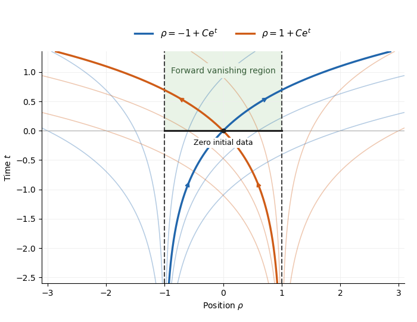

# Paper 105

↑ **Parent:** [Iii](../iii.md)

[https://www.maths.cam.ac.uk/postgrad/part-iii/files/pastpapers/2018/paper_105.pdf](https://www.maths.cam.ac.uk/postgrad/part-iii/files/pastpapers/2018/paper_105.pdf)

**Table of contents**

- [1](#1)
  - [a](#1/a)
    - [Solution](#1/a/solution)
  - [b](#1/b)
    - [Solution](#1/b/solution)
  - [c](#1/c)
    - [Solution](#1/c/solution)
- [2](#2)
  - [a](#2/a)
    - [Solution](#2/a/solution)
  - [b](#2/b)
    - [i](#2/b/i)
      - [Solution](#2/b/i/solution)
    - [ii](#2/b/ii)
      - [Solution](#2/b/ii/solution)
    - [iii](#2/b/iii)
      - [Solution](#2/b/iii/solution)
- [3](#3)
  - [a](#3/a)
    - [Solution](#3/a/solution)
  - [b](#3/b)
    - [i](#3/b/i)
      - [Solution](#3/b/i/solution)
    - [ii](#3/b/ii)
      - [Solution](#3/b/ii/solution)
    - [iii](#3/b/iii)
      - [Solution](#3/b/iii/solution)
  - [c](#3/c)
    - [Solution](#3/c/solution)
- [4](#4)
  - [a](#4/a)
    - [i](#4/a/i)
      - [Solution](#4/a/i/solution)
    - [ii](#4/a/ii)
      - [Solution](#4/a/ii/solution)
    - [iii](#4/a/iii)
      - [Solution](#4/a/iii/solution)
  - [b](#4/b)
    - [i](#4/b/i)
      - [Solution](#4/b/i/solution)
    - [ii](#4/b/ii)
      - [Solution](#4/b/ii/solution)

## 1

↑ **Parent:** [Paper 105](paper-105.md)

<h3 id="1/a">a</h3>

↑ **Parent:** [1](#1)

<h4 id="1/a/solution">Solution</h4>

↑ **Parent:** [A](#1/a)

Put $Q=Q_r(x)$ and $v_Q=|Q|^{-1}\int_Qv$. The [fundamental theorem of calculus along a line segment](../../../calculus.md#fundamental-theorem-of-calculus-along-a-line-segment), followed by averaging, gives

$$
|v(y)-v_Q|\leq\frac1{r^n}\int_Q\int_0^1|Dv(y+t(z-y))|\,|z-y|\,dt\,dz.
$$

For fixed $t$, use the [change of variables formula](../../../calculus.md#change-of-variables-formula) $w=y+t(z-y)$. Its [Jacobian determinant](../../../calculus.md#jacobian-determinant) is $t^n$. The transformed domain $Q_t=y+t(Q-y)$ lies in $Q$, because a cube is a [convex set](../../../mathematical-optimization.md#convex-set). Moreover, $w\in Q_t$ implies $|w-y|\leq\sqrt n\,rt$. Thus [Tonelli theorem](../../../measure-theory.md#tonelli-theorem) gives

$$
\begin{aligned}
|v(y)-v_Q|
&\leq\frac1{r^n}\int_Q |Dv(w)|\,|w-y|
\int_{|w-y|/(\sqrt n r)}^1t^{-n-1}dt\,dw\\
&\leq C_n\int_Q\frac{|Dv(w)|}{|w-y|^{n-1}}\,dw.
\end{aligned}
$$

The diagonal $w=y$ is a null set. The [Holder inequality](../../../functional-analysis.md#holder-inequality) with $p'=p/(p-1)$ now applies: $p>n$ implies $(n-1)p'<n$, and integration in [spherical coordinates](../../../calculus.md#spherical-coordinate-system) bounds the kernel by

$$
\left(\int_Q|w-y|^{-(n-1)p'}dw\right)^{1/p'}
\leq C_{n,p}r^{n/p'-(n-1)}=C_{n,p}r^{1-n/p}.
$$

This proves the [Morrey inequality on a cube](../../../sobolev-space.md#morrey-inequality-on-a-cube), uniformly even when $y$ approaches its boundary:

$$
\boxed{|v_Q-v(y)|\leq C_1r^{1-n/p}\|Dv\|_{L^p(Q)}.}
$$

Apply this at both $y$ and the center $x$ and use the triangle inequality to obtain

$$
\boxed{|v(y)-v(x)|\leq C_2r^{1-n/p}\|Dv\|_{L^p(Q)},\qquad C_2=2C_1.}
$$

<h3 id="1/b">b</h3>

↑ **Parent:** [1](#1)

<h4 id="1/b/solution">Solution</h4>

↑ **Parent:** [B](#1/b)

Let $u_j\in C_c^\infty(\mathbb R^n)$ tend to $u$ in the [Sobolev space](../../../sobolev-space.md) $W^{1,p}$, using [density of smooth functions in a Sobolev space](../../../sobolev-space.md#density-of-smooth-functions-in-a-sobolev-space). Write $\alpha=1-n/p>0$. Applying the [Morrey inequality on a cube](../../../sobolev-space.md#morrey-inequality-on-a-cube) to a unit cube centered at $x$, and bounding its average by the [Holder inequality](../../../functional-analysis.md#holder-inequality), gives

$$
|v(x)|\leq\|v\|_{L^p(\mathbb R^n)}+C\|Dv\|_{L^p(\mathbb R^n)}
$$

for every smooth $v$. Hence $u_j$ is a [Cauchy sequence](../../../real-analysis.md#cauchy-sequence) in the supremum norm and has a bounded continuous limit $u^*$ by [uniform convergence](../../../real-analysis.md#uniform-convergence). On every finite-measure cube, this limit is also the $L^p$ limit, so $u=u^*$ [almost everywhere](../../../measure-theory.md#almost-everywhere).

For $x\ne y$, choose $r=4|x-y|$, so that $y\in Q_r(x)$. The second estimate from part (a), followed by passage to the limit, gives

$$
|u^*(y)-u^*(x)|\leq C|y-x|^\alpha\|Du\|_{L^p(\mathbb R^n)}.
$$

Thus $u^*$ is a [Hölder continuous function](../../../sobolev-space.md#holder-condition) and

$$
\boxed{u^*\in C^{0,1-n/p}(\mathbb R^n),\qquad
\|u^*\|_\infty+[u^*]_{C^{0,1-n/p}}\leq C\|u\|_{W^{1,p}}.}
$$

It is the unique continuous representative: two continuous functions agreeing [almost everywhere](../../../measure-theory.md#almost-everywhere) agree everywhere.

For $1\leq p<n$, take a [smooth cutoff function](../../../analysis.md#smooth-cutoff-function) $\chi$ equal to one near zero and set

$$
\boxed{u(x)=\chi(x)|x|^{-a},\qquad 0<a<\frac np-1.}
$$

Its [weak derivative](../../../distribution-theory.md#weak-derivative) has size $O(|x|^{-a-1})$ near zero, whose $p$th power is integrable because $p(a+1)<n$. Thus $u\in W^{1,p}$, but it is essentially unbounded in every neighborhood of zero and has no continuous representative. The value assigned at zero is irrelevant.

<h3 id="1/c">c</h3>

↑ **Parent:** [1](#1)

<h4 id="1/c/solution">Solution</h4>

↑ **Parent:** [C](#1/c)

Choose $x$ at which $Du(x)$ is finite and the $p$-mean version of the [Lebesgue differentiation theorem](../../../measure-theory.md#lebesgue-differentiation-theorem) holds:

$$
\varepsilon_x(r):=\left(\frac1{|Q_r(x)|}\int_{Q_r(x)}|Du(z)-Du(x)|^p dz\right)^{1/p}\longrightarrow0.
$$

These conditions hold [almost everywhere](../../../measure-theory.md#almost-everywhere). On a cube about $x$, subtract the affine function and put $v(y)=u^*(y)-u^*(x)-Du(x)\cdot(y-x)$. Its [weak derivative](../../../distribution-theory.md#weak-derivative) is $Dv=Du-Du(x)$ and $v(x)=0$. Approximate $u$ as in part (b) and subtract the same affine function from the approximants. [Uniform convergence](../../../real-analysis.md#uniform-convergence) and convergence of their [weak derivatives](../../../distribution-theory.md#weak-derivative) extend part (a)'s estimate to $v$, giving

$$
|v(y)|\leq Cr^{1-n/p}\|Du-Du(x)\|_{L^p(Q_r(x))}
=Cr\varepsilon_x(r)\qquad(y\in Q_r(x)).
$$

For $h\ne0$, choose $r=4|h|$ and $y=x+h$. It follows that

$$
\frac{|u^*(x+h)-u^*(x)-Du(x)\cdot h|}{|h|}
\leq4C\varepsilon_x(4|h|)\longrightarrow0.
$$

This is precisely classical [Fréchet derivative](../../../calculus.md#frechet-derivative) differentiability, not merely existence of coordinate derivatives. Therefore the [differentiability almost everywhere of supercritical Sobolev functions](../../../sobolev-space.md#differentiability-almost-everywhere-of-supercritical-sobolev-functions) gives

$$
\boxed{D_{\mathrm{classical}}u^*(x)=D_{\mathrm{weak}}u(x)\quad\text{for almost every }x.}
$$

## 2

↑ **Parent:** [Paper 105](paper-105.md)

<h3 id="2/a">a</h3>

↑ **Parent:** [2](#2)

<h4 id="2/a/solution">Solution</h4>

↑ **Parent:** [A](#2/a)

The [Lax-Milgram theorem](../../../functional-analysis.md#lax-milgram-theorem) assumes that $H$ is a real [Hilbert space](../../../hilbert-space.md) and $B:H\times H\to\mathbb R$ is a [bounded bilinear form](../../../linear-algebra.md#bounded-bilinear-form) and a [coercive bilinear form](../../../linear-algebra.md#coercive-bilinear-form): there are $M,\alpha>0$ such that

$$
|B[u,v]|\leq M\|u\|_H\|v\|_H,\qquad
B[u,u]\geq\alpha\|u\|_H^2.
$$

Then for every [continuous linear functional](../../../topological-vector-space.md#continuous-linear-functional) $\ell\in H'$ there is a unique $u\in H$ satisfying

$$
\boxed{B[u,v]=\ell(v)\quad(v\in H),\qquad
\|u\|_H\leq\alpha^{-1}\|\ell\|_{H'}.}
$$

Symmetry of $B$ is not required.

For the proof, the [Riesz representation theorem](../../../hilbert-space.md#riesz-representation-theorem) provides a [bounded linear operator](../../../topological-vector-space.md#continuous-linear-operator) $T:H\to H$ and $g\in H$ with $B[u,v]=(Tu,v)_H$ and $\ell(v)=(g,v)_H$. Coercivity and the [Cauchy-Schwarz inequality](../../../probability-and-statistics.md#cauchy-schwarz-inequality) imply

$$
\alpha\|u\|_H^2\leq(Tu,u)_H\leq\|Tu\|_H\|u\|_H,
\qquad\|Tu\|_H\geq\alpha\|u\|_H.
$$

Thus $T$ is injective and its range is closed: if $Tu_j$ converges, the displayed inequality makes $u_j$ a [Cauchy sequence](../../../real-analysis.md#cauchy-sequence); [completeness](../../../topological-analysis.md#completeness) gives $u_j\to u$ and $Tu_j\to Tu$. If $w$ lies in the [orthogonal complement](../../../hilbert-space.md#orthogonal-complement) of the range, then $B[v,w]=0$ for all $v$. Taking $v=w$ gives $\alpha\|w\|^2\leq B[w,w]=0$, so $w=0$. A closed subspace with zero [orthogonal complement](../../../hilbert-space.md#orthogonal-complement) is all of $H$, hence $T$ is surjective. The unique solution is $T^{-1}g$, and the same inequality gives the asserted norm bound.

<h3 id="2/b">b</h3>

↑ **Parent:** [2](#2)

<h4 id="2/b/i">i</h4>

↑ **Parent:** [B](#2/b)

<h5 id="2/b/i/solution">Solution</h5>

↑ **Parent:** [I](#2/b/i)

The principal coefficients satisfy the positive [uniformly elliptic operator](../../../elliptic-boundary-value-problem.md#uniformly-elliptic-operator) condition if there is $\theta>0$, independent of $x$, such that

$$
\boxed{\sum_{i,j=1}^na^{ij}(x)\xi_i\xi_j\geq\theta|\xi|^2
\quad(x\in\overline U,\ \xi\in\mathbb R^n).}
$$

The smooth coefficients on the compact closure also give a uniform upper bound $\sum a^{ij}\xi_i\xi_j\leq\Theta|\xi|^2$. The first-order and zeroth-order coefficients do not enter uniform ellipticity.

<h4 id="2/b/ii">ii</h4>

↑ **Parent:** [B](#2/b)

<h5 id="2/b/ii/solution">Solution</h5>

↑ **Parent:** [Ii](#2/b/ii)

Let $T:H^1(U)\to L^2(\partial U)$ be the trace map from the [Sobolev trace theorem](../../../sobolev-space.md#sobolev-trace-theorem). The [weak Robin problem for a uniformly elliptic operator](../../../differential-equation.md#weak-robin-problem-for-a-uniformly-elliptic-operator) uses all of $H^1(U)$ as the test space, since a [Robin boundary condition](../../../differential-equation.md#robin-boundary-condition) does not require a zero trace. Define

$$
\begin{aligned}
B_\lambda[u,v]={}&\int_U\left(\sum_{i,j}a^{ij}u_{x_i}v_{x_j}
+\sum_i b^iu_{x_i}v+(c+\lambda)uv\right)dx\\
&+\int_{\partial U}\beta\,Tu\,Tv\,dS.
\end{aligned}
$$

The [weak formulation](../../../partial-differential-equation.md#weak-formulation) is

$$
\boxed{u\in H^1(U),\qquad B_\lambda[u,v]=\int_Ufv\,dx
\quad\text{for every }v\in H^1(U).}
$$

For a [classical solution](../../../partial-differential-equation.md#classical-solution), [integration by parts](../../../calculus.md#integration-by-parts) produces the boundary term $-\int_{\partial U}(\sum a^{ij}u_{x_i}\nu_j)v$. Substituting the [Robin boundary condition](../../../differential-equation.md#robin-boundary-condition) replaces it by $\int_{\partial U}\beta uv$, giving the displayed identity.

Conversely, if $u\in C^2(\overline U)$ satisfies the identity, tests $v\in C_c^\infty(U)$ first show $(L+\lambda)u=f$ in the sense of [distributions](../../../distribution-theory.md#distribution-mathematical-analysis). Subtracting this interior equality after [integration by parts](../../../calculus.md#integration-by-parts) gives

$$
\int_{\partial U}\left(\sum_{i,j}a^{ij}u_{x_i}\nu_j+\beta u\right)Tv\,dS=0.
$$

Every smooth boundary function is the trace of a smooth function on $\overline U$. The boundary residual is continuous, so this proves the boundary equation pointwise. Thus the formulations agree for $C^2$ solutions. If $f$ is continuous the interior equation holds pointwise; for merely $f\in L^2$, equality with that given representative of $f$ is understood [almost everywhere](../../../measure-theory.md#almost-everywhere).

<h4 id="2/b/iii">iii</h4>

↑ **Parent:** [B](#2/b)

<h5 id="2/b/iii/solution">Solution</h5>

↑ **Parent:** [Iii](#2/b/iii)

The positive uniform ellipticity condition from part (i) is needed here. It is not explicitly imposed in the printed preamble. Without it the conclusion is false: on $(0,\pi)$, take $L=u''$, $\beta=0$, and $f=0$. The [Neumann boundary condition](../../../differential-equation.md#neumann-boundary-condition) is satisfied by $u(x)=\cos(mx)$, and $(L+m^2)u=0$ for arbitrarily large shifts.

There is also an actual error in the PDF's supplied trace inequality: a nonzero constant has nonzero trace and zero gradient. Use instead the valid [multiplicative trace inequality on a bounded smooth domain](../../../sobolev-space.md#multiplicative-trace-inequality-on-a-bounded-smooth-domain)

$$
\|Tu\|_{L^2(\partial U)}^2\leq K\bigl(\|u\|_2\|Du\|_2+\|u\|_2^2\bigr).
$$

For completeness, choose a smooth vector field $X$ agreeing with the outward [normal vector](../../../differential-geometry.md#normal-vector) on the boundary. The [divergence theorem](../../../calculus.md#divergence-theorem) gives, for smooth $u$,

$$
\int_{\partial U}u^2dS
=\int_U(\operatorname{div}X)u^2+2uX\cdot Du\,dx
\leq C\bigl(\|u\|_2^2+\|u\|_2\|Du\|_2\bigr).
$$

Approximation and the [Sobolev trace theorem](../../../sobolev-space.md#sobolev-trace-theorem) extend it to $H^1(U)$. Thus the intended existence result remains true after correcting the hint.

Set $q=\|u\|_2$, $d=\|Du\|_2$, $\beta_- =\max\{-\beta,0\}$, $c_- =\max\{-c,0\}$, and

$$
M=\|b\|_\infty+K\|\beta_-\|_\infty,\qquad
C_0=\|c_-\|_\infty+K\|\beta_-\|_\infty+\frac{M^2}{2\theta}.
$$

Uniform ellipticity and the [Young inequality](../../../nonlinear-analysis.md#young-s-inequality-for-products) give

$$
\begin{aligned}
B_\lambda[u,u]
&\geq\theta d^2-Mqd+
(\lambda-\|c_-\|_\infty-K\|\beta_-\|_\infty)q^2\\
&\geq\frac\theta2d^2+(\lambda-C_0)q^2.
\end{aligned}
$$

For $\lambda\geq C_0+1$, the [bilinear form](../../../linear-algebra.md#bilinear-form) is [coercive](../../../linear-algebra.md#coercive-bilinear-form) on the real [Hilbert space](../../../hilbert-space.md) $H^1(U)$ with coercivity constant $\min\{\theta/2,1\}$.

All coefficients are bounded, and the [Sobolev trace theorem](../../../sobolev-space.md#sobolev-trace-theorem) gives $\|Tu\|_2\leq C_T\|u\|_{H^1}$. The [Cauchy-Schwarz inequality](../../../probability-and-statistics.md#cauchy-schwarz-inequality) applied to each volume and boundary term therefore proves $|B_\lambda[u,v]|\leq C_\lambda\|u\|_{H^1}\|v\|_{H^1}$. Also $\ell(v)=\int_Ufv$ is a [continuous linear functional](../../../topological-vector-space.md#continuous-linear-functional), with $|\ell(v)|\leq\|f\|_2\|v\|_{H^1}$. Every hypothesis of the [Lax-Milgram theorem](../../../functional-analysis.md#lax-milgram-theorem) is now verified, and it gives

$$
\boxed{\text{a unique }u\in H^1(U)\text{ for every }f\in L^2(U),
\quad\lambda\geq C_0+1,\quad
\|u\|_{H^1}\leq\frac{\|f\|_2}{\min\{\theta/2,1\}}.}
$$

## 3

↑ **Parent:** [Paper 105](paper-105.md)

<h3 id="3/a">a</h3>

↑ **Parent:** [3](#3)

<h4 id="3/a/solution">Solution</h4>

↑ **Parent:** [A](#3/a)

On the [zero-boundary Sobolev space](../../../sobolev-space.md#zero-boundary-sobolev-space) $H_0^1(U)$, the associated [bilinear form](../../../linear-algebra.md#bilinear-form) is

$$
\boxed{B[u,v]=\int_U\left(\sum_{i,j}a^{ij}u_{x_i}v_{x_j}
+\sum_i b^iu_{x_i}v+cuv\right)dx.}
$$

The homogeneous [Dirichlet boundary condition](../../../differential-equation.md#dirichlet-boundary-condition) removes the boundary term, so $(Lu,v)_{L^2}=B[u,v]$ for sufficiently regular $u$ and $v\in H_0^1$.

Formal self-adjointness means that $L$ equals its [formal adjoint](../../../hilbert-space.md#formal-adjoint), or equivalently $(L\phi,\chi)=(\phi,L\chi)$ for compactly supported smooth functions. Here

$$
L^*v=-\sum_{i,j}(a^{ij}v_{x_i})_{x_j}
-\sum_i b^iv_{x_i}+(c-\operatorname{div}b)v.
$$

With the symmetric real principal coefficients in the question, $L=L^*$ is equivalent to $b=0$. It makes $B$ a [symmetric bilinear form](../../../linear-algebra.md#symmetric-bilinear-form).

For the assertions in part (b), positivity must mean strict Dirichlet positivity:

$$
\boxed{B[u,u]>0\quad\text{for every nonzero }u\in H_0^1(U).}
$$

This is the [positive-definite operator](../../../linear-operator-theory.md#positive-definite-operator) convention. The weaker [positive semidefinite operator](../../../hilbert-space.md#positive-operator) convention $B[u,u]\geq0$ does not suffice: $L=-\Delta-\lambda_1$ has zero energy on a first Dirichlet [eigenfunction](../../../linear-operator-theory.md#eigenfunction). Under strict positivity, the compactness argument in part (b)(i) gives a uniform lower bound as well.

<h3 id="3/b">b</h3>

↑ **Parent:** [3](#3)

<h4 id="3/b/i">i</h4>

↑ **Parent:** [B](#3/b)

<h5 id="3/b/i/solution">Solution</h5>

↑ **Parent:** [I](#3/b/i)

Formal self-adjointness gives symmetry of $B$, and strict positivity gives positive definiteness, so $B$ is an [inner product](../../../linear-algebra.md#inner-product). Bounded coefficients give $B[u,u]\leq C\|u\|_{H^1}^2$. To prove the lower bound, uniform ellipticity gives

$$
B[u,u]\geq\theta\|Du\|_2^2-\|c_-\|_\infty\|u\|_2^2.
$$

If no lower bound by the $H^1$ norm existed, choose $u_j\in H_0^1$ with $\|u_j\|_{H^1}=1$ and $B[u_j,u_j]\to0$. By [weak convergence in a Hilbert space](../../../hilbert-space.md#weak-convergence-in-a-hilbert-space) and the [Rellich-Kondrachov compactness theorem](../../../sobolev-space.md#rellich-kondrachov-theorem), a subsequence has $u_j\rightharpoonup u$ in $H_0^1$ and $u_j\to u$ in $L^2$. The principal energy has [weak lower semicontinuity](../../../functional-analysis.md#weak-lower-semicontinuity): it is the squared $L^2$ norm of the bounded multiplication operator $a^{1/2}Du$. The potential term converges because $c$ is bounded. Hence

$$
B[u,u]\leq\liminf_jB[u_j,u_j]=0.
$$

Strict positivity forces $u=0$. The preceding ellipticity estimate now gives $\|Du_j\|_2\to0$, while $\|u_j\|_2\to0$, contradicting $\|u_j\|_{H^1}=1$. Thus [strict positivity implies coercivity for an elliptic Dirichlet form](../../../elliptic-boundary-value-problem.md#strict-positivity-implies-coercivity-for-an-elliptic-dirichlet-form), and

$$
\boxed{\alpha\|u\|_{H^1}^2\leq B[u,u]\leq C\|u\|_{H^1}^2.}
$$

The new norm is equivalent to the original norm, so the space remains complete.

<h4 id="3/b/ii">ii</h4>

↑ **Parent:** [B](#3/b)

<h5 id="3/b/ii/solution">Solution</h5>

↑ **Parent:** [Ii](#3/b/ii)

The assertion about all $H_0^1(U)\cap H^k(U)$ is false as printed in the original PDF. Take $U=(0,\pi)$, $L=-d^2/dx^2$, and $u=x(\pi-x)$. This is a nonzero smooth Dirichlet function, but $Lu=2$ and $L^2u=0$. In particular

$$
\boxed{((u,u))_4=\|L^2u\|_2^2=0\quad\text{although }u\ne0.}
$$

Already at $k=3$, $B[Lu,Lu]$ is not defined on its stipulated domain, because $Lu=2\notin H_0^1$. Extending $B$ to $H^1$ for this example would give zero, not an [inner product](../../../linear-algebra.md#inner-product). Additional boundary conditions are essential.

The corrected spaces are the [Sobolev domains of powers of an elliptic Dirichlet operator](../../../distribution-theory.md#sobolev-domains-of-powers-of-an-elliptic-dirichlet-operator). Let $A_D$ be the [Dirichlet realization of an elliptic operator](../../../elliptic-boundary-value-problem.md#dirichlet-realization-of-an-elliptic-operator), and set

$$
\boxed{X_0=L^2(U),\qquad
X_k=\left\{u\in H^k(U):T(L^ju)=0,
\quad0\leq j\leq\left\lfloor\frac{k-1}{2}\right\rfloor\right\}\quad(k\geq1).}
$$

In particular $X_1=H_0^1$, $X_2=H^2\cap H_0^1$, and $X_3$ also requires $T(Lu)=0$. The formulas in the question define [inner products](../../../linear-algebra.md#inner-product) on these spaces.

Here is the norm-equivalence proof on the corrected domains. The base cases are the $L^2$ [inner product](../../../linear-algebra.md#inner-product) at $k=0$ and part (i) at $k=1$. Standard Dirichlet [elliptic regularity](../../../distribution-theory.md#elliptic-regularity), together with invertibility from the [Lax-Milgram theorem](../../../functional-analysis.md#lax-milgram-theorem), gives for every integer $r\geq0$

$$
\|u\|_{H^{r+2}}\leq C_r\|Lu\|_{H^r},\qquad
\|Lu\|_{H^r}\leq C'_r\|u\|_{H^{r+2}}.
$$

The first estimate applies when $Tu=0$; invertibility absorbs the usual lower-order $L^2$ term. Moreover, $A_D:X_{r+2}\to X_r$ is an isomorphism. To see surjectivity, solve $Lu=f$ with zero Dirichlet trace for $f\in X_r$; regularity gives $u\in H^{r+2}$, and $T(L^ju)=T(L^{j-1}f)=0$ for each further required trace. The formulas satisfy

$$
((u,u))_{r+2}=((Lu,Lu))_r.
$$

Induction therefore gives

$$
\boxed{c_k\|u\|_{H^k}^2\leq((u,u))_k\leq C_k\|u\|_{H^k}^2\qquad(u\in X_k).}
$$

Injectivity of each iterate of $A_D$ gives positive definiteness. These spaces are $D(A_D^{k/2})$; the [spectral characterization of elliptic Dirichlet domains](../../../distribution-theory.md#spectral-characterization-of-elliptic-dirichlet-domains) in the next part makes the half-powers precise. On the paper's uncorrected spaces the claim is valid at $k=0,1,2$, but fails in general beyond them.

<h4 id="3/b/iii">iii</h4>

↑ **Parent:** [B](#3/b)

<h5 id="3/b/iii/solution">Solution</h5>

↑ **Parent:** [Iii](#3/b/iii)

First construct the Dirichlet eigensystem. By part (i) and the [Lax-Milgram theorem](../../../functional-analysis.md#lax-milgram-theorem), the inverse $S=A_D^{-1}$ exists from $L^2$ into $H_0^1$. [Elliptic regularity](../../../distribution-theory.md#elliptic-regularity) gives $Sf\in H^2\cap H_0^1$, and the [Rellich-Kondrachov compactness theorem](../../../sobolev-space.md#rellich-kondrachov-theorem) makes $S$ a [compact operator](../../../compact-operator.md) on $L^2$. Symmetry gives

$$
(Sf,g)=B[Sf,Sg]=(f,Sg),
$$

so $S$ is a [self-adjoint operator](../../../linear-operator-theory.md#self-adjoint-operator). It is injective, and $(Sf,f)=B[Sf,Sf]>0$ for $f\ne0$. The [spectral theorem for compact Hermitian operators](../../../compact-operator.md#spectral-theorem-for-compact-hermitian-operators) supplies an [orthonormal basis](../../../linear-algebra.md#orthonormal-basis) $(w_m)$ with $Sw_m=\mu_mw_m$, $\mu_m>0$, and $\mu_m\to0$. Put $\lambda_m=\mu_m^{-1}$. Then

$$
\boxed{Lw_m=\lambda_mw_m,\qquad Tw_m=0,\qquad
0<\lambda_m\longrightarrow\infty.}
$$

Repeated [elliptic regularity](../../../distribution-theory.md#elliptic-regularity) makes each $w_m$ smooth up to the boundary.

As with part (ii), the stated characterization omits boundary compatibility. At $k=0$, its right-hand side is finite for every $u\in L^2$ by [Parseval identity](../../../fourier-analysis.md#parseval-identity), whereas its left-hand side would require $u\in H_0^1$. At higher orders, the preceding polynomial example is also decisive for the Dirichlet eigensystem: on $(0,\pi)$,

$$
w_m=\sqrt{2/\pi}\sin(mx),\quad\lambda_m=m^2,\quad
(x(\pi-x),w_m)=\begin{cases}4\sqrt{2/\pi}\,m^{-3},&m\text{ odd},\\0,&m\text{ even}.
\end{cases}
$$

Although this function belongs to every ordinary $H^k$, the weighted sum diverges at $k=3$.

The correct [spectral characterization of elliptic Dirichlet domains](../../../distribution-theory.md#spectral-characterization-of-elliptic-dirichlet-domains) is

$$
\boxed{u\in X_k\iff\sum_m\lambda_m^k|(u,w_m)|^2<\infty,\qquad
X_k=D(A_D^{k/2}),}
$$

with $X_k$ defined in part (ii). For finite eigenfunction sums the squared norm $((u,u))_k$ is exactly the weighted sum: even orders follow from $L^lw_m=\lambda_m^lw_m$, and odd orders also use $B[w_m,w_j]=\lambda_m\delta_{mj}$. These sums are dense in $X_1$: if $v$ is $B$-orthogonal to every $w_m$, then $0=B[v,w_m]=\lambda_m(v,w_m)$, so $v=0$. They are dense in $X_0$ by construction, and the isomorphisms $A_D:X_{k+2}\to X_k$ propagate density to every $X_k$. Completion in the equivalent norms from part (ii) proves both directions of the corrected equivalence. In particular, the printed characterization is correct for $k=1,2$.

<h3 id="3/c">c</h3>

↑ **Parent:** [3](#3)

<h4 id="3/c/solution">Solution</h4>

↑ **Parent:** [C](#3/c)

Take $\psi\in L^2(U)$, the natural initial-data assumption needed for the requested $L^2$ convergence but not explicitly stated in this subpart. Use the genuine Dirichlet eigensystem from part (b)(iii) and put $\psi_m=(\psi,w_m)$. The [spectral construction of a parabolic solution](../../../diffusion-equation.md#spectral-construction-of-a-parabolic-solution) is

$$
\boxed{u(t,x)=\sum_{m=1}^\infty e^{-\lambda_mt}\psi_mw_m(x).}
$$

Each finite sum has zero [Dirichlet boundary condition](../../../differential-equation.md#dirichlet-boundary-condition) and satisfies $u_t+Lu=0$.

To justify all derivatives, fix $\varepsilon>0$. For any integers $k,j\geq0$, the squared $X_k$ norm of a tail of the $j$th time derivative is

$$
\sum_{m>N}\lambda_m^{k+2j}e^{-2t\lambda_m}|\psi_m|^2
\leq\sup_{\lambda\geq\lambda_1}\bigl(\lambda^{k+2j}e^{-2\varepsilon\lambda}\bigr)
\sum_{m>N}|\psi_m|^2\longrightarrow0
$$

uniformly for $t\geq\varepsilon$. Use the corrected [Sobolev domains of powers of an elliptic Dirichlet operator](../../../distribution-theory.md#sobolev-domains-of-powers-of-an-elliptic-dirichlet-operator), not the inaccurate unqualified assertion in the PDF. Their norm equivalence gives convergence in every ordinary $H^k$. The [Sobolev embedding theorem](../../../sobolev-space.md#sobolev-embedding-theorem) then gives convergence of every desired spatial derivative by choosing $k$ large enough. Thus termwise differentiation is justified, $u\in C^\infty(U_T)$, and $u(t,\cdot)\in C^\infty(\overline U)$ for every $t>0$. The trace remains zero, and $u_t+Lu=0$ holds pointwise.

Finally [Parseval identity](../../../fourier-analysis.md#parseval-identity) gives

$$
\|u(t)-\psi\|_2^2=\sum_m(1-e^{-t\lambda_m})^2|\psi_m|^2\longrightarrow0
$$

by the [dominated convergence theorem](../../../measure-theory.md#dominated-convergence-theorem), since each factor tends to zero and is bounded by one. No boundary compatibility of the initial $L^2$ data is required for positive-time smoothness.

## 4

↑ **Parent:** [Paper 105](paper-105.md)

<h3 id="4/a">a</h3>

↑ **Parent:** [4](#4)

<h4 id="4/a/i">i</h4>

↑ **Parent:** [A](#4/a)

<h5 id="4/a/i/solution">Solution</h5>

↑ **Parent:** [I](#4/a/i)

For each $t$, let

$$
B_t[u,v]=\int_U\left(\sum_{i,j}a^{ij}(x,t)u_{x_i}v_{x_j}
+\sum_i b^i(x,t)u_{x_i}v+c(x,t)uv\right)dx.
$$

A [weak energy solution of a variable-coefficient wave equation](../../../partial-differential-equation.md#weak-energy-solution-of-a-variable-coefficient-wave-equation) is a function $u\in H^1(U_T)$ with zero lateral trace, equivalently $u\in L^2(0,T;H_0^1(U))$, whose time trace satisfies $u(0)=\psi_0$ in $L^2(U)$ and for which

$$
\boxed{\int_0^T\bigl[-(u_t,v_t)_{L^2}+B_t[u,v]\bigr]dt
=\int_0^T(f,v)_{L^2}dt+(\psi_1,v(0))_{L^2}}
$$

for every $v\in H^1(U_T)$ with zero lateral trace and $v(T)=0$. Here $u\in H^1(0,T;L^2(U))$ has a continuous $L^2$ representative, so the displacement trace is well defined.

The velocity condition is encoded by the boundary term in time; an arbitrary space-time $H^1$ function need not have an $L^2$ trace of $u_t$. The equation implies $u_{tt}=f-L(t)u\in L^2(0,T;H^{-1}(U))$, hence $u_t$ has a continuous $H^{-1}$ representative and $u_t(0)=\psi_1$ in that sense. This is the [weak formulation](../../../partial-differential-equation.md#weak-formulation) obtained by [integration by parts](../../../calculus.md#integration-by-parts) once in time and once in space.

<h4 id="4/a/ii">ii</h4>

↑ **Parent:** [A](#4/a)

<h5 id="4/a/ii/solution">Solution</h5>

↑ **Parent:** [Ii](#4/a/ii)

Take the difference of two [weak solutions](../../../partial-differential-equation.md#weak-solution), so $f=\psi_0=\psi_1=0$. At the stated $H^1(U_T)$ regularity, it is not justified simply to test by $u_t$, which need not belong to the spatial test space $H_0^1$. Instead use the antiderivative test underlying [uniqueness of Sobolev weak solutions of a wave equation](../../../numerical-analysis.md#uniqueness-of-sobolev-weak-solutions-of-a-wave-equation).

Fix $s\in(0,T]$ and define

$$
v(t)=\begin{cases}\displaystyle\int_t^su(r)dr,&0\leq t<s,\\0,&s\leq t\leq T,
\end{cases}
\qquad z(t)=\int_0^tu(r)dr.
$$

These are [Bochner integrals](../../../measure-theory.md#bochner-integral) in $H_0^1$. The function $v$ is an admissible space-time $H^1$ test, $v_t=-u$ before $s$, and $v(t)=z(s)-z(t)$. The time term in the [weak formulation](../../../partial-differential-equation.md#weak-formulation) is

$$
-\int_0^s(u_t,v_t)dt=\frac12\|u(s)\|_2^2,
$$

because $u(0)=0$. Symmetry of $a^{ij}$ and [integration by parts](../../../calculus.md#integration-by-parts) in time give

$$
\int_0^s\int_Ua^{ij}u_{x_i}v_{x_j}
=\frac12\int_Ua^{ij}(x,0)z_{x_i}(s)z_{x_j}(s)
+\frac12\int_0^s\int_Ua_t^{ij}v_{x_i}v_{x_j}.
$$

For the lower-order part, [integration by parts](../../../calculus.md#integration-by-parts) in space gives

$$
\int_U(b^i u_{x_i}v+cuv)
=\int_Uu\bigl((c-\operatorname{div}b)v-b\cdot Dv\bigr).
$$

Bounded coefficients, the [Poincaré inequality](../../../sobolev-space.md#poincare-inequality) for $v$, and the [Young inequality](../../../nonlinear-analysis.md#young-s-inequality-for-products) now imply

$$
\|u(s)\|_2^2+\theta\|Dz(s)\|_2^2
\leq C\int_0^s\bigl(\|u(t)\|_2^2+\|Dv(t)\|_2^2\bigr)dt.
$$

Since $Dv(t)=Dz(s)-Dz(t)$,

$$
\|u(s)\|_2^2+\theta\|Dz(s)\|_2^2
\leq C\int_0^s\bigl(\|u(t)\|_2^2+\|Dz(t)\|_2^2\bigr)dt
+Cs\|Dz(s)\|_2^2.
$$

For $s$ in a sufficiently short fixed interval, absorb the last term into the left-hand side. The [Gronwall inequality](../../../probability-and-statistics.md#gronwall-inequality) applied to $\|u(s)\|_2^2+(\theta/2)\|Dz(s)\|_2^2$ proves $u=0$ on that interval. The equation gives continuity of $u_t$ in $H^{-1}$, so both initial traces at its endpoint are again zero. Repeating with the same uniform coefficient bounds covers $[0,T]$. Therefore

$$
\boxed{\text{the weak solution is unique whenever it exists.}}
$$

<h4 id="4/a/iii">iii</h4>

↑ **Parent:** [A](#4/a)

<h5 id="4/a/iii/solution">Solution</h5>

↑ **Parent:** [Iii](#4/a/iii)

For $F(x,t)=t-\tau(x)$, the conormal to its zero set is $dF=(-D\tau,1)$. The [principal symbol](../../../partial-differential-equation.md#principal-symbol-of-a-partial-differential-equation) of $\partial_t^2+L$ is

$$
p(x,t;\xi,\sigma)=\sigma^2-\sum_{i,j}a^{ij}(x,t)\xi_i\xi_j.
$$

A [characteristic hypersurface](../../../partial-differential-equation.md#characteristic-hypersurface) requires $p(x,t;dF)=0$ on the surface. Thus $\tau$ satisfies the anisotropic [eikonal equation](../../../continuum-mechanics.md#eikonal-equation)

$$
\boxed{\sum_{i,j}a^{ij}(x,\tau(x))\tau_{x_i}(x)\tau_{x_j}(x)=1.}
$$

The first-order and zeroth-order terms do not affect this condition.

<h3 id="4/b">b</h3>

↑ **Parent:** [4](#4)

<h4 id="4/b/i">i</h4>

↑ **Parent:** [B](#4/b)

<h5 id="4/b/i/solution">Solution</h5>

↑ **Parent:** [I](#4/b/i)

Expanding the equation gives

$$
u_{tt}+2\rho u_{\rho t}+(\rho^2-1)u_{\rho\rho}+u_t+2\rho u_\rho=0.
$$

For the [hyperbolic partial differential equation](../../../partial-differential-equation.md#hyperbolic-partial-differential-equation) discriminant, $A=1$, $B=\rho$, $C=\rho^2-1$, so

$$
\boxed{B^2-AC=1>0\quad\text{everywhere}.}
$$

For a curve $\rho=\rho(t)$, the [characteristic hypersurface](../../../partial-differential-equation.md#characteristic-hypersurface) equation is $(\rho')^2-2\rho\rho'+\rho^2-1=0$, or $\rho'=\rho\pm1$. Therefore the two families of [characteristic curves](../../../partial-differential-equation.md#characteristic-curve) are

$$
\boxed{\rho=-1+Ce^t,\qquad\rho=1+Ce^t,\qquad C\in\mathbb R.}
$$

The values $C=0$ include the characteristic lines $\rho=-1$ and $\rho=1$. Every curve in the first family approaches $\rho=-1$ as $t\to-\infty$; every curve in the second approaches $\rho=1$. The two curves through $(\rho,t)=(0,0)$ are $\rho=e^t-1$ and $\rho=1-e^t$, shown as the thick curves below. Equivalently, the [characteristic coordinates](../../../partial-differential-equation.md#characteristic-coordinate) are $e^{-t}(\rho+1)$ and $e^{-t}(\rho-1)$.

**[Figure 1](#4/b/i/image-characteristic-families-of-the-variable-coefficient-wave-equation). Characteristic families of the variable-coefficient wave equation**. Blue and orange curves show the two families of [characteristic curves](../../../partial-differential-equation.md#characteristic-curve), with arrows in the direction of increasing time. Dashed lines mark the characteristic lines $\rho=\pm1$. The thick curves pass through the origin. The initial segment and shaded forward strip indicate the region where the zero data force vanishing, as proved in the next part.

<h4 id="4/b/ii">ii</h4>

↑ **Parent:** [B](#4/b)

<h5 id="4/b/ii/solution">Solution</h5>

↑ **Parent:** [Ii](#4/b/ii)

The all-time conclusion in the original PDF is false. The [expanding-flow transformation of a wave equation](../../../partial-differential-equation.md#expanding-flow-transformation-of-a-wave-equation) makes both the correct forward statement and a counterexample transparent. Put

$$
X=\rho e^{-t},\qquad S=e^{-t}>0,\qquad u(\rho,t)=w(X,S).
$$

For $D=\partial_t+\rho\partial_\rho$, the expanded operator from part (i) is $D^2+D-\partial_\rho^2$. In the new variables $D=-S\partial_S$ and $\partial_\rho=S\partial_X$, hence

$$
(D^2+D-\partial_\rho^2)u=S^2(w_{SS}-w_{XX}).
$$

Thus it is the ordinary [wave equation](../../../wave-equation.md) on the half-plane $S>0$. By the [D'Alembert formula](../../../wave-equation.md#d-alembert-s-formula), any $C^2$ solution has the form

$$
u(\rho,t)=F(e^{-t}(\rho+1))+G(e^{-t}(\rho-1)).
$$

At $t=0$, differentiating the zero displacement with respect to $\rho$ and using the zero velocity gives, for $-1<\rho<1$,

$$
F'(\rho+1)+G'(\rho-1)=0,\qquad
(\rho+1)F'(\rho+1)+(\rho-1)G'(\rho-1)=0.
$$

Subtracting $(\rho-1)$ times the first equation from the second gives $2F'(\rho+1)=0$, and then $G'(\rho-1)=0$. Thus $F=c$ on $(0,2)$ and $G=-c$ on $(-2,0)$. If $t\geq0$ and $-1<\rho<1$, both arguments remain in those intervals. Consequently the valid forward result is

$$
\boxed{u(\rho,t)=0\quad(-1<\rho<1,\ t\geq0).}
$$

For negative time the arguments need not stay in the initial intervals. Take $F(s)=(s-2)_+^3$ and $G=0$, where $q_+=\max\{q,0\}$. Then

$$
\boxed{u(\rho,t)=\bigl(e^{-t}(\rho+1)-2\bigr)_+^3}
$$

is a global $C^2$ solution, has the prescribed zero initial displacement and velocity on $(-1,1)$, but $u(0,-\log3)=1$. This directly disproves the assertion for $t\in\mathbb R$.

The connection with part (i) is directional [finite propagation speed](../../../wave-equation.md#finite-propagation-speed). At a future point in the strip, the two characteristics traced back to $t=0$ meet it at $\rho_0=e^{-t}(\rho+1)-1$ and $\rho_0=e^{-t}(\rho-1)+1$, both in $(-1,1)$. For negative time these intersections can lie outside that interval. The lines $\rho=\pm1$ are characteristic barriers for this forward domain of dependence, not barriers in both time directions.

## ↑ Ancestors (8)

1. [Iii](../iii.md)
2. [2018](../../2018.md)
3. [Past exam of the mathematics course of the University of Cambridge](../../../past-exam-of-the-mathematics-course-of-the-university-of-cambridge.md)
4. [Mathematics course of the University of Cambridge](../../../university-of-cambridge.md#mathematics-course-of-the-university-of-cambridge)
5. [Course of the University of Cambridge](../../../university-of-cambridge.md#course-of-the-university-of-cambridge)
6. [University of Cambridge](../../../university-of-cambridge.md)
7. [List of universities](../../../README.md#list-of-universities)
8. [Codex Wiki](../../../README.md)
