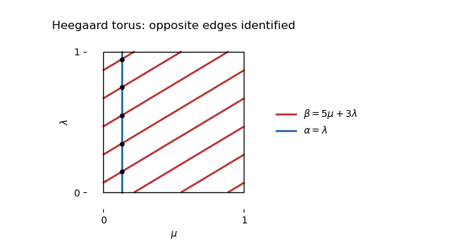

<h1 id="1/a/solution">Solution</h1>

↑ **Parent:** [A](../a.md)

Use the [meridian of a knot](../../../../../../meridian-of-a-knot.md) $\mu$ and [Seifert longitude](../../../../../../seifert-longitude.md) $\lambda$ of the [unknot](../../../../../../unknot.md) on its boundary [torus](../../../../../../torus.md). The [unknot](../../../../../../unknot.md)'s [knot exterior](../../../../../../knot-exterior.md) is a [solid torus](../../../../../../solid-torus.md) whose disk-bounding curve is $\lambda$. A genus-one [Heegaard diagram](../../../../../../heegaard-diagram.md) is therefore

$$
\boxed{\Sigma=\mathbb R^2/\mathbb Z^2,\qquad \alpha=\lambda=(0,1),\qquad \beta=5\mu+3\lambda=(5,3).}
$$

Here the horizontal coordinate is $\mu$ and the vertical coordinate is $\lambda$. The drawing uses a small translate of $\alpha$ to avoid intersections on the edge of the square; opposite edges are identified. The [algebraic intersection number of curves on an oriented surface](../../../../../../algebraic-intersection-number-of-curves-on-an-oriented-surface.md) has absolute value five.

**[Figure 1](#1/a/image-a-heegaard-torus-for-a-lens-space). A Heegaard torus for a lens space**.

Starting with $\Sigma\times[0,1]$, attach a three-dimensional [two-handle](../../../../../../two-handle.md) along $\alpha\times\{0\}$, using its [surface framing](../../../../../../surface-framing.md), and cap the resulting [sphere](../../../../../../sphere.md) with a [three-handle](../../../../../../three-handle.md). This gives the [solid torus](../../../../../../solid-torus.md) on that side. Attach a [two-handle](../../../../../../two-handle.md) along $\beta\times\{1\}$, again using the [surface framing](../../../../../../surface-framing.md), and cap its [sphere](../../../../../../sphere.md) with a [three-handle](../../../../../../three-handle.md). The second [solid torus](../../../../../../solid-torus.md) has its disk-bounding curve identified with $5\mu+3\lambda$, so the resulting oriented [lens space](../../../../../../lens-space.md) is precisely the specified $5/3$ [Dehn filling](../../../../../../dehn-filling.md).

## ↑ Ancestors (11)

1. [A](../a.md)
2. [1](../../1.md)
3. [Paper 141](../../../paper-141-split.md)
4. [Iii](../../../split.md)
5. [2018](../../../../split.md)
6. [Past exam of the mathematics course of the University of Cambridge](../../../../../split.md)
7. [Mathematics course of the University of Cambridge](../../../../../../mathematics-course-of-the-university-of-cambridge.md)
8. [Course of the University of Cambridge](../../../../../../course-of-the-university-of-cambridge.md)
9. [University of Cambridge](../../../../../../university-of-cambridge-split.md)
10. [List of universities](../../../../../../list-of-universities.md)
11. [Codex Wiki](../../../../../../split.md)
