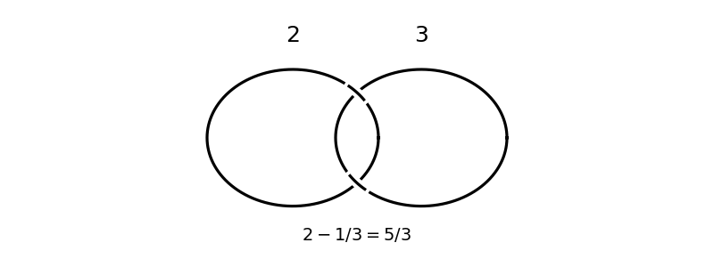

<h1 id="1/d/solution">Solution</h1>

↑ **Parent:** [D](../d.md)

Take a [Hopf link](../../../../../../hopf-link.md) with its two [unknot](../../../../../../unknot.md) components labeled by [integer surgery coefficients](../../../../../../integer-surgery-coefficient.md) $2,3$.

**[Figure 2](#1/d/image-surgery-diagrams-and-continued-fraction-coefficients). Surgery diagrams and continued-fraction coefficients**.

The [slam-dunk move](../../../../../../slam-dunk-move.md) eliminates a meridional component with coefficient $b$ and replaces the other coefficient $a$ by $a-1/b$. Eliminating the component with coefficient three gives

$$
\boxed{[2,3]^-:=2-\frac13=\frac53.}
$$

Thus this [Dehn surgery on a framed link](../../../../../../dehn-surgery-on-a-framed-link.md) becomes $5/3$ [Dehn filling](../../../../../../dehn-filling.md) on the [unknot](../../../../../../unknot.md), with the required orientation. As a check, its [surgery linking matrix](../../../../../../surgery-linking-matrix.md) is

$$
\begin{pmatrix}2&1\\1&3\end{pmatrix},
$$

whose [determinant](../../../../../../determinant.md) is five.

## ↑ Ancestors (11)

1. [D](../d.md)
2. [1](../../1.md)
3. [Paper 141](../../../paper-141-split.md)
4. [Iii](../../../split.md)
5. [2018](../../../../split.md)
6. [Past exam of the mathematics course of the University of Cambridge](../../../../../split.md)
7. [Mathematics course of the University of Cambridge](../../../../../../mathematics-course-of-the-university-of-cambridge.md)
8. [Course of the University of Cambridge](../../../../../../course-of-the-university-of-cambridge.md)
9. [University of Cambridge](../../../../../../university-of-cambridge-split.md)
10. [List of universities](../../../../../../list-of-universities.md)
11. [Codex Wiki](../../../../../../split.md)
