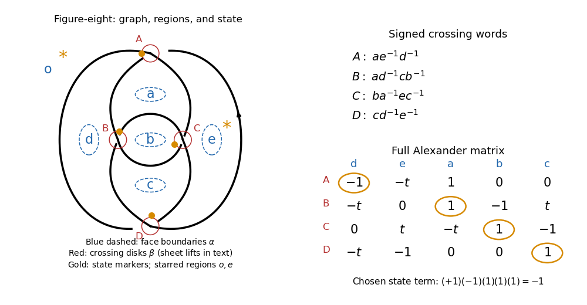

<h1 id="3/d/solution">Solution</h1>

↑ **Parent:** [D](../d.md)

Star the adjacent regions $o,e$. Choose the [Kauffman state of a knot diagram](../../../../../../kauffman-state-of-a-knot-diagram.md) putting the marker at $A$ in region $d$, at $B$ in region $a$, at $C$ in region $b$, and at $D$ in region $c$. Every unstarred region is used exactly once, and every crossing has exactly one marker.

**[Figure 4](#3/d/image-the-figure-eight-graph-regions-and-heegaard-state). The figure-eight graph, regions and Heegaard state**.

In the full [Alexander matrix](../../../../../../alexander-matrix.md), circle the entries $(A,d),(B,a),(C,b),(D,c)$, namely

$$
\begin{pmatrix}
\boxed{-1}&-t&1&0&0\\
-t&0&\boxed{1}&-1&t\\
0&t&-t&\boxed{1}&-1\\
-t&-1&0&0&\boxed{1}
\end{pmatrix}.
$$

In the reduced [Alexander matrix](../../../../../../alexander-matrix.md) $B$, these are the diagonal entries in column order $(d,a,b,c)$. The associated [permutation](../../../../../../permutation.md) is the identity, with [sign of a permutation](../../../../../../sign-of-a-permutation.md) $+1$, so this [Kauffman state of a knot diagram](../../../../../../kauffman-state-of-a-knot-diagram.md) contributes

$$
\boxed{(+1)(-1)(1)(1)(1)=-1}
$$

to $\det B=-t^2+3t-1$. The other four nonzero permutation terms are $t,t,t,-t^2$. The drawing circles the same four entries literally; the boxes above identify them in the typeset matrix. Different row or generator conventions multiply the [Alexander polynomial of a knot](../../../../../../alexander-polynomial.md) and its state weights by the corresponding overall unit.

## ↑ Ancestors (11)

1. [D](../d.md)
2. [3](../../3.md)
3. [Paper 141](../../../paper-141-split.md)
4. [Iii](../../../split.md)
5. [2018](../../../../split.md)
6. [Past exam of the mathematics course of the University of Cambridge](../../../../../split.md)
7. [Mathematics course of the University of Cambridge](../../../../../../mathematics-course-of-the-university-of-cambridge.md)
8. [Course of the University of Cambridge](../../../../../../course-of-the-university-of-cambridge.md)
9. [University of Cambridge](../../../../../../university-of-cambridge-split.md)
10. [List of universities](../../../../../../list-of-universities.md)
11. [Codex Wiki](../../../../../../split.md)
