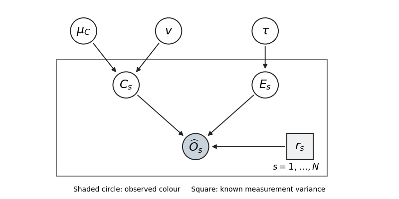

<h1 id="4/ii/solution">Solution</h1>

↑ **Parent:** [Ii](../ii.md)

The [probabilistic graphical model](../../../../../../probabilistic-graphical-model.md) is the following [Directed acyclic graph](../../../../../../directed-acyclic-graph.md). The shared [hyperparameters](../../../../../../hyperparameter.md) lie outside the plate; the plate repeats the local variables for $s=1,\ldots,N$. The observed colour is shaded, and the known error [variance](../../../../../../variance-split.md) $r_s$ is a square.

**[Figure 1](#4/ii/image-graphical-model-for-intrinsic-supernova-colour-dust-reddening-and-measurement-noise). Graphical model for intrinsic supernova colour, dust reddening and measurement noise**. Arrows from $\mu_C,v$ to $C_s$, from $\tau$ to $E_s$, and from $C_s,E_s,r_s$ to the observed $\widehat O_s$ encode the conditional factorization. The plate encloses $N$ local supernova models.

Thus the parent sets are $\boxed{\operatorname{pa}(C_s)=\{\mu_C,v\},\quad\operatorname{pa}(E_s)=\{\tau\},\quad\operatorname{pa}(o_s)=\{C_s,E_s,r_s\}}$. Independent [hyperparameter](../../../../../../hyperparameter.md) prior factors are represented by the three root nodes. With the printed improper priors this is a factorization diagram; it becomes a normalized generative model after proper priors are supplied.

## ↑ Ancestors (11)

1. [Ii](../ii.md)
2. [4](../../4.md)
3. [Paper 219](../../../paper-219-split.md)
4. [Iii](../../../split.md)
5. [2018](../../../../split.md)
6. [Past exam of the mathematics course of the University of Cambridge](../../../../../split.md)
7. [Mathematics course of the University of Cambridge](../../../../../../mathematics-course-of-the-university-of-cambridge.md)
8. [Course of the University of Cambridge](../../../../../../course-of-the-university-of-cambridge.md)
9. [University of Cambridge](../../../../../../university-of-cambridge-split.md)
10. [List of universities](../../../../../../list-of-universities.md)
11. [Codex Wiki](../../../../../../split.md)
