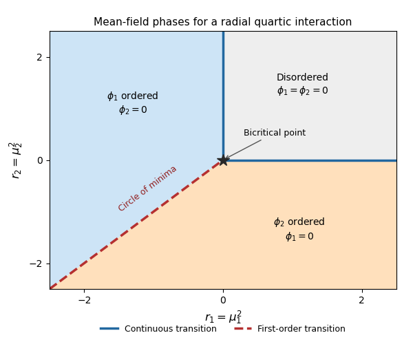

<h1 id="3/a/solution">Solution</h1>

↑ **Parent:** [A](../a.md)

Write $r_i=\mu_i^2$ and assume $g>0$, as required for quartic stability. In the [mean-field approximation](../../../../../../mean-field-approximation.md), the [two-component radial quartic Landau potential](../../../../../../two-component-radial-quartic-landau-potential.md) is

$$
V=\frac12(r_1\phi_1^2+r_2\phi_2^2)+g(\phi_1^2+\phi_2^2)^2.
$$

Set $x=\phi_1^2\geq0$, $y=\phi_2^2\geq0$. At fixed $\rho=x+y$, the quartic term is fixed and the quadratic term is minimized by assigning all of $\rho$ to the component with smaller $r_i$. Minimizing over $\rho$ then gives

$$
\boxed{f_{\min}=-\frac{\min(0,r_1,r_2)^2}{16g}}.
$$

The resulting [phase diagram](../../../../../../phase-diagram.md) has these regions:

- If $r_1>0$ and $r_2>0$, $\phi_1=\phi_2=0$: the disordered phase preserves both [Z2 symmetries](../../../../../../z2-symmetry.md).
- If $r_1<\min(0,r_2)$, $\phi_1=\pm\sqrt{-r_1/(4g)}$ and $\phi_2=0$: the first [Z2 symmetry](../../../../../../z2-symmetry.md) undergoes [spontaneous symmetry breaking](../../../../../../spontaneous-symmetry-breaking.md).
- If $r_2<\min(0,r_1)$, $\phi_2=\pm\sqrt{-r_2/(4g)}$ and $\phi_1=0$: the second [Z2 symmetry](../../../../../../z2-symmetry.md) undergoes [spontaneous symmetry breaking](../../../../../../spontaneous-symmetry-breaking.md).

On $r_1=r_2=r<0$, the [symmetry](../../../../../../symmetry-physics.md) is enhanced to the [orthogonal group](../../../../../../orthogonal-group.md) $O(2)$, and the minima form the circle

$$
\boxed{\phi_1^2+\phi_2^2=-\frac{r}{4g}}.
$$

Mixed-component minima occur on this line, rather than in an open coexistence region. Crossing the negative diagonal swaps the selected component discontinuously: this is a [first-order phase transition](../../../../../../first-order-phase-transition.md), also called a [spin-flop transition](../../../../../../spin-flop-transition.md). For example, holding $r_2=r<0$ fixed and moving $r_1$ across $r$, the derivative $\partial f_{\min}/\partial r_1$ jumps from $-r/(8g)$ to zero. The angular degeneracy exactly on the line does not remove this discontinuity.

The positive half-axis $r_1=0$, $r_2>0$ is a [continuous phase transition](../../../../../../continuous-phase-transition.md), as is $r_2=0$, $r_1>0$. Their endpoint at $(0,0)$ is a [bicritical point](../../../../../../bicritical-point.md), where the two continuous boundaries meet the first-order negative diagonal. Approaching the origin radially makes the ordered amplitude vanish continuously. The negative half-axes lie inside ordered phases and are not additional transition lines. **There are two continuous half-axis boundaries and one first-order negative diagonal, meeting at the origin.**

**[Figure 1](#3/a/image-mean-field-phases-for-a-radial-quartic-interaction). Mean-field phases for a radial quartic interaction**.

## ↑ Ancestors (11)

1. [A](../a.md)
2. [3](../../3.md)
3. [Paper 303](../../../paper-303-split.md)
4. [Iii](../../../split.md)
5. [2018](../../../../split.md)
6. [Past exam of the mathematics course of the University of Cambridge](../../../../../split.md)
7. [Mathematics course of the University of Cambridge](../../../../../../mathematics-course-of-the-university-of-cambridge.md)
8. [Course of the University of Cambridge](../../../../../../course-of-the-university-of-cambridge.md)
9. [University of Cambridge](../../../../../../university-of-cambridge-split.md)
10. [List of universities](../../../../../../list-of-universities.md)
11. [Codex Wiki](../../../../../../split.md)
