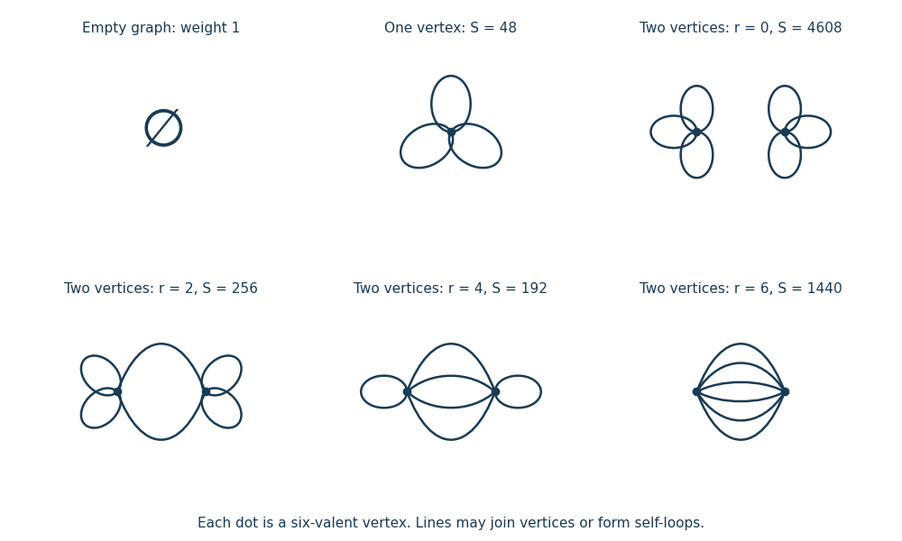

<h1 id="1/solution">Solution</h1>

↑ **Parent:** [1](../1.md)

Assume $m^2>0$ and take $\lambda\to0^+$. The free [Gaussian integral](../../../../../gaussian-integral.md) gives $Z_0=\sqrt{2\pi}/|m|$, and the normalized free [Gaussian measure](../../../../../gaussian-measure.md) has [covariance](../../../../../covariance.md) $C=m^{-2}$. Expanding only the interaction exponential gives the [asymptotic expansion](../../../../../asymptotic-expansion.md)

$$
\frac{Z}{Z_0}=\sum_{V\geq0}\frac{(-\lambda)^V}{V!(6!)^V}\langle\phi^{6V}\rangle_0.
$$

In this [zero-dimensional scalar field theory](../../../../../zero-dimensional-scalar-field-theory.md), the [path integral](../../../../../path-integral.md) has become an ordinary [integral](../../../../../integral.md), but its combinatorics are precisely those of [sextic scalar field theory](../../../../../sextic-scalar-field-theory.md).

The free [generating functional](../../../../../generating-functional.md) is $\langle e^{J\phi}\rangle_0=e^{CJ^2/2}$. Differentiating it proves [Wick theorem](../../../../../wick-s-theorem.md): odd [moments](../../../../../moment.md) vanish, while each even [moment](../../../../../moment.md) is the sum over pairings of its factors. Each [Wick contraction](../../../../../wick-contraction.md) contributes $C$, so

$$
\langle\phi^{2r}\rangle_0=(2r-1)!!\,C^r.
$$

Thus the [Feynman rules](../../../../../feynman-rule.md) are a [quantum field theory propagator](../../../../../propagator.md) $C$ for each internal line and a factor $-\lambda$ for each six-valent [interaction vertex](../../../../../interaction-vertex.md). The [factorials](../../../../../factorial.md) $V!$ and $(6!)^V$ remove vertex and half-edge labels; the remaining weight is $(-\lambda)^V C^I/S$, where $S$ is the [Feynman-diagram symmetry factor](../../../../../feynman-diagram-symmetry-factor.md), the order of the [automorphism group](../../../../../automorphism-group.md) of the resulting diagram, including its half-edge symmetries. A [tadpole diagram](../../../../../tadpole-diagram.md) has an additional interchange symmetry of the two ends of its loop.

There is one empty [Vacuum Feynman diagram](../../../../../vacuum-feynman-diagram.md), contributing $1$. At one [interaction vertex](../../../../../interaction-vertex.md), the six half-edges form three loops. Its [Feynman-diagram symmetry factor](../../../../../feynman-diagram-symmetry-factor.md) is $2^3 3!=48$, so its contribution is $-\lambda C^3/48$.

At two [interaction vertices](../../../../../interaction-vertex.md) let $r$ count the lines joining them. Each [interaction vertex](../../../../../interaction-vertex.md) has $(6-r)/2$ self-loops, so $r$ can only be $0,2,4,6$. These four possibilities exhaust all [Vacuum Feynman diagrams](../../../../../vacuum-feynman-diagram.md) at this order. Their [Feynman-diagram symmetry factors](../../../../../feynman-diagram-symmetry-factor.md) are

$$
S_r=2\,r!\left[2^{(6-r)/2}\left(\frac{6-r}{2}\right)!\right]^2,
\qquad
\begin{array}{c|rrrr}
r&0&2&4&6\\\hline
S_r&4608&256&192&1440
\end{array}.
$$

Here the leading $2$ exchanges the two [interaction vertices](../../../../../interaction-vertex.md), $r!$ permutes the joining lines, and the remaining factors permute and reverse the self-loops. The $r=0$ graph is disconnected and must be included in $Z/Z_0$; only a [connected generating functional](../../../../../connected-generating-functional.md) would discard it.

**[Figure 1](#1/image-all-vacuum-feynman-diagrams-with-at-most-two-interaction-vertices). All Vacuum Feynman diagrams with at most two interaction vertices**. The empty diagram, the one-[interaction vertex](../../../../../interaction-vertex.md) diagram, and the four two-[interaction vertex](../../../../../interaction-vertex.md) diagrams, with their [Feynman-diagram symmetry factors](../../../../../feynman-diagram-symmetry-factor.md).

Consequently,

$$
\boxed{\frac{Z(m,\lambda)}{Z(m,0)}=1-\frac{\lambda}{48m^6}+\frac{77\lambda^2}{7680m^{12}}+O(\lambda^3).}
$$

Indeed $\sum_r S_r^{-1}=77/7680$, independently agreeing with $11!!/[2(6!)^2]$ from [Wick theorem](../../../../../wick-s-theorem.md).

This is an [asymptotic expansion](../../../../../asymptotic-expansion.md), rather than a convergent [perturbation series](../../../../../perturbation-series.md): the coefficient of $\lambda^V$ contains $(6V-1)!!/[V!(6!)^V]$ and grows too rapidly for a nonzero [radius of convergence](../../../../../radius-of-convergence.md). For any fixed truncation order, the [Taylor expansion](../../../../../taylor-expansion.md) remainder bound for $e^{-x}$ on $x\geq0$, followed by the finite Gaussian [moment](../../../../../moment.md) [integral](../../../../../integral.md), proves the stated remainder estimate. For negative real $\lambda$ the original integral diverges.

## ↑ Ancestors (10)

1. [1](../1.md)
2. [Paper 304](../../paper-304-split.md)
3. [Iii](../../split.md)
4. [2018](../../../split.md)
5. [Past exam of the mathematics course of the University of Cambridge](../../../../split.md)
6. [Mathematics course of the University of Cambridge](../../../../../mathematics-course-of-the-university-of-cambridge.md)
7. [Course of the University of Cambridge](../../../../../course-of-the-university-of-cambridge.md)
8. [University of Cambridge](../../../../../university-of-cambridge-split.md)
9. [List of universities](../../../../../list-of-universities.md)
10. [Codex Wiki](../../../../../split.md)
