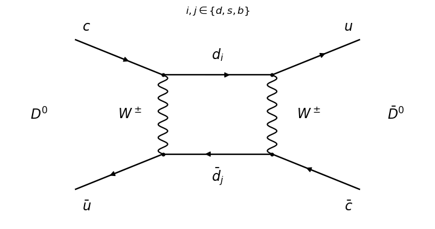

<h1 id="3/a/solution">Solution</h1>

↑ **Parent:** [A](../a.md)

A leading short-distance [Standard Model](../../../../../../standard-model-split.md) contribution to [neutral D-meson mixing](../../../../../../neutral-d-meson-mixing.md) is a [box Feynman diagram](../../../../../../box-feynman-diagram.md) with two [W bosons](../../../../../../w-boson.md) and two internal down-type [quark](../../../../../../quark.md) lines:

**[Figure 1](#3/a/image-short-distance-box-contribution-to-neutral-d-meson-mixing). Short-distance box contribution to neutral D-meson mixing**.

The incoming $c\bar u$ pair becomes $u\bar c$; the internal labels run over the [down quark](../../../../../../down-quark.md), [strange quark](../../../../../../strange-quark.md) and [bottom quark](../../../../../../bottom-quark.md). Each corner is a [weak charged current](../../../../../../charged-current.md) vertex. Four such vertices make the contribution of order $g^4$. Summing the internal flavours produces [Cabibbo-Kobayashi-Maskawa matrix](../../../../../../cabibbo-kobayashi-maskawa-matrix.md) factors and the [Glashow-Iliopoulos-Maiani mechanism](../../../../../../glashow-iliopoulos-maiani-mechanism.md): the flavour-independent term cancels by $\sum_i V_{ci}^*V_{ui}=0$. This [box Feynman diagram](../../../../../../box-feynman-diagram.md) is one contribution; long-distance intermediate [hadron](../../../../../../hadron.md) states can also contribute to [neutral D-meson mixing](../../../../../../neutral-d-meson-mixing.md).

## ↑ Ancestors (11)

1. [A](../a.md)
2. [3](../../3.md)
3. [Paper 305](../../../paper-305-split.md)
4. [Iii](../../../split.md)
5. [2018](../../../../split.md)
6. [Past exam of the mathematics course of the University of Cambridge](../../../../../split.md)
7. [Mathematics course of the University of Cambridge](../../../../../../mathematics-course-of-the-university-of-cambridge.md)
8. [Course of the University of Cambridge](../../../../../../course-of-the-university-of-cambridge.md)
9. [University of Cambridge](../../../../../../university-of-cambridge-split.md)
10. [List of universities](../../../../../../list-of-universities.md)
11. [Codex Wiki](../../../../../../split.md)
