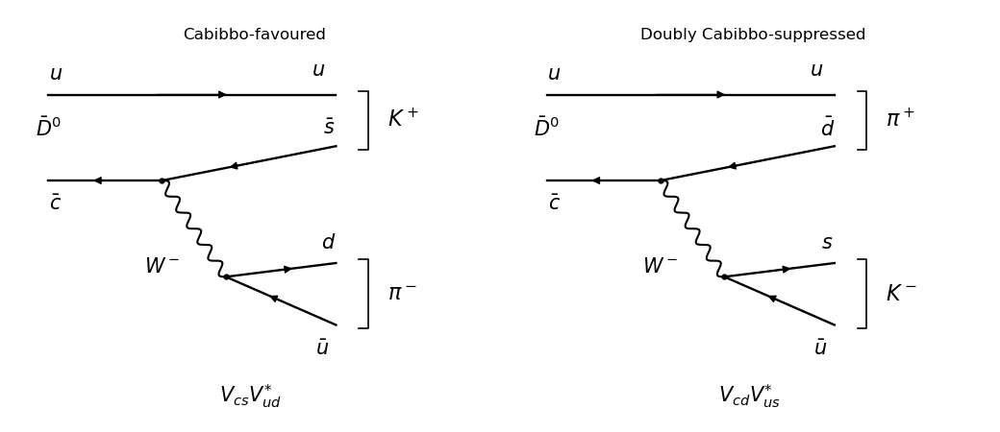

<h1 id="3/c/solution">Solution</h1>

↑ **Parent:** [C](../c.md)

The [tree-level Feynman diagrams](../../../../../../tree-level-feynman-diagram.md) contain an unchanged [spectator quark](../../../../../../spectator-quark.md), of [up quark](../../../../../../up-quark.md) flavour and the two possible [weak charged current](../../../../../../charged-current.md) transitions of the [charm antiquark](../../../../../../charm-antiquark.md):

**[Figure 2](#3/c/image-favoured-and-doubly-cabibbo-suppressed-anti-d-decays). Favoured and doubly Cabibbo-suppressed anti-D decays**.

For $\bar D^0\to K^+\pi^-$, $\bar c\to\bar sW^-$ and $W^-\to d\bar u$. The [spectator quark](../../../../../../spectator-quark.md) combines with $\bar s$ into the [kaon](../../../../../../kaon.md) $K^+=u\bar s$, while $d\bar u$ forms the [pion](../../../../../../pion.md) $\pi^-$. The [Cabibbo-Kobayashi-Maskawa matrix](../../../../../../cabibbo-kobayashi-maskawa-matrix.md) factor is $V_{cs}V_{ud}^*$.

For $\bar D^0\to K^-\pi^+$, $\bar c\to\bar dW^-$ and $W^-\to s\bar u$. The [spectator quark](../../../../../../spectator-quark.md) combines with $\bar d$ into the [pion](../../../../../../pion.md) $\pi^+=u\bar d$, while $s\bar u$ forms the [kaon](../../../../../../kaon.md) $K^-$. The [Cabibbo-Kobayashi-Maskawa matrix](../../../../../../cabibbo-kobayashi-maskawa-matrix.md) factor is $V_{cd}V_{us}^*$.

Neglecting [neutral D-meson mixing](../../../../../../neutral-d-meson-mixing.md) and assuming comparable [strong interaction](../../../../../../strong-interaction.md) [matrix elements](../../../../../../matrix-element.md), the relative direct [decay widths](../../../../../../decay-width.md) are

$$
\boxed{\frac{\Gamma(\bar D^0\to K^-\pi^+)}{\Gamma(\bar D^0\to K^+\pi^-)}
\approx\left|\frac{V_{cd}V_{us}^*}{V_{cs}V_{ud}^*}\right|^2\approx\tan^4\theta_C.}
$$

Here $\theta_C$ is the [Cabibbo angle](../../../../../../cabibbo-angle.md). The second process is **doubly [Cabibbo suppressed](../../../../../../cabibbo-suppression.md)**: it contains two small [Cabibbo suppression](../../../../../../cabibbo-suppression.md) factors in its amplitude. The [Cabibbo angle](../../../../../../cabibbo-angle.md) estimate assumes similar [Quantum chromodynamics](../../../../../../quantum-chromodynamics.md) [matrix elements](../../../../../../matrix-element.md); it is not an exact rate equality.

## ↑ Ancestors (11)

1. [C](../c.md)
2. [3](../../3.md)
3. [Paper 305](../../../paper-305-split.md)
4. [Iii](../../../split.md)
5. [2018](../../../../split.md)
6. [Past exam of the mathematics course of the University of Cambridge](../../../../../split.md)
7. [Mathematics course of the University of Cambridge](../../../../../../mathematics-course-of-the-university-of-cambridge.md)
8. [Course of the University of Cambridge](../../../../../../course-of-the-university-of-cambridge.md)
9. [University of Cambridge](../../../../../../university-of-cambridge-split.md)
10. [List of universities](../../../../../../list-of-universities.md)
11. [Codex Wiki](../../../../../../split.md)
