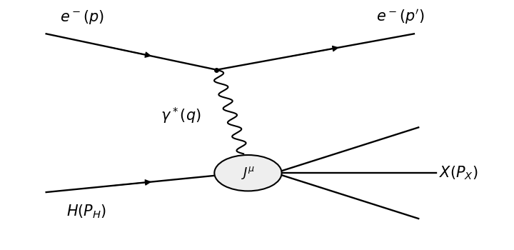

<h1 id="4/a/solution">Solution</h1>

↑ **Parent:** [A](../a.md)

The [deep inelastic scattering](../../../../../../deep-inelastic-scattering.md) process contains a virtual [photon](../../../../../../photon.md) exchanged between the [Electron](../../../../../../electron.md) and the [hadron](../../../../../../hadron.md):

**[Figure 3](#4/a/image-inclusive-electron-hadron-scattering-through-a-virtual-photon). Inclusive electron-hadron scattering through a virtual photon**.

Use an electromagnetic [vector current](../../../../../../vector-current.md) $J^\mu$ containing the dimensionless [quark](../../../../../../quark.md) charges, with the coupling $e$ factored out. The [scattering amplitude](../../../../../../scattering-amplitude.md), up to an irrelevant phase, is

$$
\mathcal M_X=\frac{e^2}{q^2}\bar u(p')\gamma_\mu u(p)\langle X|J^\mu|H\rangle.
$$

To match the printed prefactor, define the [leptonic tensor](../../../../../../leptonic-tensor.md) with a [spin sum](../../../../../../spin-sum.md) over both [Electron](../../../../../../electron.md) spins and keep the initial [spin average](../../../../../../spin-average.md) $1/2$ outside it. The [gamma-matrix trace](../../../../../../gamma-matrix-trace.md) gives

$$
\boxed{L_{\mu\nu}=\operatorname{Tr}(\not p'\gamma_\mu\not p\gamma_\nu)
=4\left(p_\mu p'_\nu+p_\nu p'_\mu-g_{\mu\nu}p\cdot p'\right).}
$$

For a stationary target and massless [Electron](../../../../../../electron.md), the [invariant flux factor](../../../../../../invariant-flux-factor.md) is $4ME$. The inclusive final-state [Lorentz-invariant phase-space measure](../../../../../../lorentz-invariant-phase-space-measure.md) and target [spin average](../../../../../../spin-average.md) are contained in $4\pi W_H^{\mu\nu}$. Thus the [differential scattering cross-section](../../../../../../differential-scattering-cross-section.md) is

$$
\frac{d\sigma}{d^3p'}=\frac1{4ME}\frac1{(2\pi)^3 2E'}\frac12\frac{e^4}{(q^2)^2}L_{\mu\nu}(4\pi W_H^{\mu\nu})
=\boxed{\frac{e^4}{8(2\pi)^2 MEE'(q^2)^2}L_{\mu\nu}W_H^{\mu\nu}.}
$$

Here $q^4$ means $(q^2)^2$. If the initial [spin average](../../../../../../spin-average.md) is instead built into the [leptonic tensor](../../../../../../leptonic-tensor.md), its normalization is $2(\cdots)$ and the displayed cross-section prefactor must be doubled. The two conventions give the same observable.

## ↑ Ancestors (11)

1. [A](../a.md)
2. [4](../../4.md)
3. [Paper 305](../../../paper-305-split.md)
4. [Iii](../../../split.md)
5. [2018](../../../../split.md)
6. [Past exam of the mathematics course of the University of Cambridge](../../../../../split.md)
7. [Mathematics course of the University of Cambridge](../../../../../../mathematics-course-of-the-university-of-cambridge.md)
8. [Course of the University of Cambridge](../../../../../../course-of-the-university-of-cambridge.md)
9. [University of Cambridge](../../../../../../university-of-cambridge-split.md)
10. [List of universities](../../../../../../list-of-universities.md)
11. [Codex Wiki](../../../../../../split.md)
