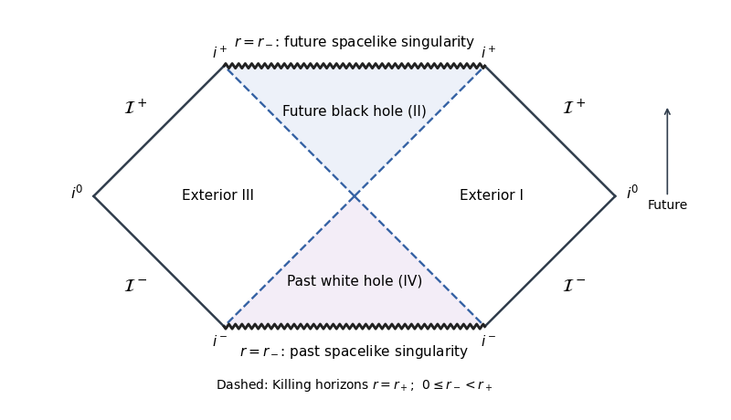

<h1 id="3/iv/solution">Solution</h1>

↑ **Parent:** [Iv](../iv.md)

Given an [asymptotically flat spacetime](../../../../../../asymptotically-flat-spacetime.md) with a [conformal completion](../../../../../../conformal-completion.md) and [future null infinity](../../../../../../future-null-infinity.md) $\mathscr I^+$, its [black hole](../../../../../../black-hole.md) region is

$$
\boxed{\mathcal B=\mathcal M\setminus J^-(\mathscr I^+).}
$$

The [event horizon](../../../../../../event-horizon.md) is its boundary. For the [magnetically charged dilaton black hole](../../../../../../magnetically-charged-dilaton-black-hole.md), first assume $0\le a=r_-<b=r_+$. The physical asymptotic component has $r>a$, and the ingoing chart extends regularly across $r=b$. Its future ingoing null direction is $-\partial_r$. For $a<r<b$,

$$
\nabla r=\partial_v+V\partial_r,\qquad g(\nabla r,\nabla r)=V<0,\qquad g(\nabla r,-\partial_r)=-1.
$$

Hence $\nabla r$ is future timelike. Every nonzero future causal tangent $X$ satisfies $X(r)=g(\nabla r,X)<0$. A future causal curve from this interior can neither cross back to $r=b$ nor reach the asymptotic end $r\to\infty$, so it cannot reach $\mathscr I^+$. It lies in $\mathcal B$.

This proof uses the future black-hole extension. The radial interval alone does not distinguish it from the past [white hole](../../../../../../white-hole.md) interior of the maximal extension; that interior has the same interval and can send signals to infinity. Thus the statement needs this future-component qualification if the maximal spacetime is intended.

The [Kretschmann scalar](../../../../../../kretschmann-scalar.md) confirms that $r=a$ is a genuine [curvature singularity](../../../../../../curvature-singularity.md): for $0<a<b$, its numerator at $r=a$ is $3a^4(a-b)^2$, and

$$
R_{abcd}R^{abcd}\sim\frac{3(a-b)^2}{4a^2(r-a)^4}.
$$

For $a=0$ it instead reduces to $12b^2/r^6$. Since $V<0$ on approaching the singularity from the interior, the singularity is spacelike. At $r=b>a$ the curvature is finite.

For the maximal extension, take $U=-e^{-u/(2b)}$, $W=e^{v/(2b)}$ in the right exterior and continue analytically across the horizons. Then

$$
UW=\left(1-\frac rb\right)e^{r/b},\qquad
 ds^2=-\frac{4b^3}{r}e^{-r/b}dU\,dW+R^2d\Omega_2^2.
$$

The singularity is $UW=(1-a/b)e^{a/b}>0$ and the horizons are $U=0$ and $W=0$. Rescaling the null coordinates by the square root of this positive constant before arctangent compactification produces the usual qualitative [Penrose diagram](../../../../../../penrose-diagram.md) of [Schwarzschild spacetime](../../../../../../schwarzschild-spacetime.md): two exteriors, a future black-hole region, a past white-hole region, and future and past spacelike singularities. The dashed lines below are the horizon branches; only the future interior is the black-hole region.

**[Figure 1](#3/iv/image-radial-effective-potential). Radial effective potential**.

If $a>b$, the physical domain remains $r>a$, but now $V>0$ throughout it. The apparent zero $r=b$ is beyond the curvature singularity and is not an accessible horizon. The singularity is timelike, and outgoing radial null rays with $\dot r=E>0$ escape to infinity from arbitrarily near it. Thus

$$
\boxed{r_->r_+:\ \text{a timelike naked singularity, with no black-hole horizon}.}
$$

The excluded equality $r_-=r_+$ is a singular limiting case, not a regular horizon. These facts describe the [causal structure of the magnetic dilaton black hole](../../../../../../causal-structure-of-the-magnetic-dilaton-black-hole.md).

## ↑ Ancestors (11)

1. [Iv](../iv.md)
2. [3](../../3.md)
3. [Paper 311](../../../paper-311-split.md)
4. [Iii](../../../split.md)
5. [2018](../../../../split.md)
6. [Past exam of the mathematics course of the University of Cambridge](../../../../../split.md)
7. [Mathematics course of the University of Cambridge](../../../../../../mathematics-course-of-the-university-of-cambridge.md)
8. [Course of the University of Cambridge](../../../../../../course-of-the-university-of-cambridge.md)
9. [University of Cambridge](../../../../../../university-of-cambridge-split.md)
10. [List of universities](../../../../../../list-of-universities.md)
11. [Codex Wiki](../../../../../../split.md)
