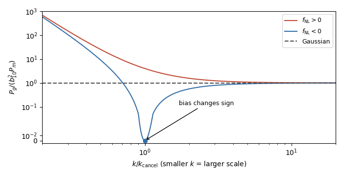

<h1 id="1/ii/solution">Solution</h1>

↑ **Parent:** [Ii](../ii.md)

Evaluate all derivatives at zero long perturbation, where $\nu=\delta_c/\sigma_{G,s}$, and write $\bar n(\nu)$ for the unperturbed abundance. The [peak-background split](../../../../../../peak-background-split.md) changes the [halo peak height](../../../../../../halo-peak-height.md) to

$$
\nu_{\rm loc}=\frac{\delta_c-\delta_L}{\sigma_{G,s}(1+2f_{\rm NL}\varphi_{G,L})}
=\nu-\frac{\nu}{\delta_c}\delta_L-2f_{\rm NL}\nu\varphi_{G,L}+\cdots.
$$

The [chain rule](../../../../../../chain-rule.md) in the specified [bias expansion](../../../../../../bias-expansion.md) therefore gives

$$
\boxed{b_{10}=-\frac{\nu}{\delta_c}\frac{d\log\bar n}{d\nu},\qquad
b_{01}=-2f_{\rm NL}\nu\frac{d\log\bar n}{d\nu}
=2f_{\rm NL}\delta_c b_{10}}.
$$

No explicit abundance law is specified, so these derivatives are the general answer. For example, if $\bar n$ has the [Press-Schechter halo mass function](../../../../../../press-schechter-halo-mass-function.md) dependence $\nu e^{-\nu^2/2}$, then $b_{10}=(\nu^2-1)/\delta_c$ and $b_{01}=2f_{\rm NL}(\nu^2-1)$.

For the linear long mode, the [cosmological Poisson equation](../../../../../../cosmological-poisson-equation.md) gives $\varphi_{G,L}(\mathbf k)=\delta_{G,L}(\mathbf k)/\alpha(k)$. Consequently the deterministic [galaxy bias](../../../../../../galaxy-bias.md) and [power spectrum](../../../../../../power-spectrum.md) are

$$
\delta_g(\mathbf k)=\left[b_{10}+\frac{b_{01}}{\alpha(k)}\right]\delta_{G,L}(\mathbf k),
\qquad
\boxed{P_g(k)=b_{10}^2\left[1+\frac{2f_{\rm NL}\delta_c}{\alpha(k)}\right]^2P_m(k)}.
$$

Here $P_m$ is the linear [cosmological density power spectrum](../../../../../../matter-power-spectrum.md); stochastic tracer noise has been omitted. This [scale-dependent halo bias from local non-Gaussianity](../../../../../../scale-dependent-halo-bias-from-local-non-gaussianity.md) is proportional to $k^{-2}$ in the specified $\alpha(k)=2k^2/(3H^2\Omega_m)$ convention.

For $b_{10}\ne0$, plot the ratio $P_g/(b_{10}^2P_m)$ to separate the effect from the shape of $P_m$. Positive $f_{\rm NL}$ increases the ratio as $k$ decreases. Negative $f_{\rm NL}$ first suppresses it, gives a zero when $\alpha(k)=2|f_{\rm NL}|\delta_c$, and then makes it rise again after the effective [galaxy bias](../../../../../../galaxy-bias.md) changes sign. The auto-[power spectrum](../../../../../../power-spectrum.md) never becomes negative. A truncation $P_g\simeq b_{10}^2[1+4f_{\rm NL}\delta_c/\alpha(k)]P_m$ is valid only when $|2f_{\rm NL}\delta_c/\alpha(k)|\ll1$ and must not be extrapolated through the zero. Within the deterministic expression, both signs give $P_g\propto k^{-4}P_m$ at sufficiently small $k$. For a nearly scale-invariant primordial spectrum, $P_m\propto k^{n_s}$ in the large-scale transfer limit, so this formal asymptote is $k^{n_s-4}$.

**[Figure 1](#1/ii/image-scale-dependent-galaxy-bias). Scale-dependent galaxy bias**. Schematic deterministic power ratio for equal positive and negative coupling magnitudes, with $\alpha\propto k^2$. The negative-coupling cancellation scale defines $k_{\rm cancel}$; the vertical axis is logarithmic away from a small linear region around zero.

There is a convention issue in calling the specified abundance response an observed galaxy overdensity. The threshold response is naturally a [linear Lagrangian halo bias](../../../../../../linear-lagrangian-halo-bias.md). If $b_{10}$ instead denotes the physical [linear Eulerian halo bias](../../../../../../linear-eulerian-halo-bias.md), the [Lagrangian-to-Eulerian linear bias relation](../../../../../../lagrangian-to-eulerian-linear-bias-relation.md) adds one to the density coefficient: $b_{01}=2f_{\rm NL}\delta_c(b_{10}-1)$, and $P_g=[b_{10}+b_{01}/\alpha]^2P_m$. The boxed formulas follow the abundance expansion explicitly supplied in the paper. The Newtonian treatment also cannot be extrapolated beyond its physical large-scale domain without relativistic projection effects.

## ↑ Ancestors (11)

1. [Ii](../ii.md)
2. [1](../../1.md)
3. [Paper 312](../../../paper-312-split.md)
4. [Iii](../../../split.md)
5. [2018](../../../../split.md)
6. [Past exam of the mathematics course of the University of Cambridge](../../../../../split.md)
7. [Mathematics course of the University of Cambridge](../../../../../../mathematics-course-of-the-university-of-cambridge.md)
8. [Course of the University of Cambridge](../../../../../../course-of-the-university-of-cambridge.md)
9. [University of Cambridge](../../../../../../university-of-cambridge-split.md)
10. [List of universities](../../../../../../list-of-universities.md)
11. [Codex Wiki](../../../../../../split.md)
