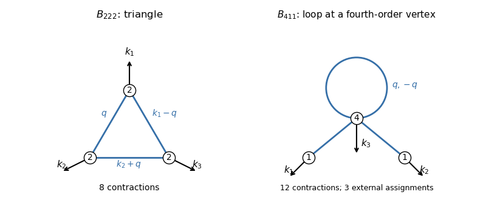

<h1 id="2/ii/solution">Solution</h1>

↑ **Parent:** [Ii](../ii.md)

Use signed one-dimensional external momenta $k_1+k_2+k_3=0$, with nonzero $k_i$. Let $P_L(k)=P_L(-k)$ be the linear [cosmological density power spectrum](../../../../../../matter-power-spectrum.md) at the time of evaluation, normalized by $\langle\delta^{(1)}(k)\delta^{(1)}(k')\rangle=2\pi\delta^{(D)}(k+k')P_L(k)$. Using $P_L$ absorbs the factor $a^6$ multiplying a product of three initial [power spectra](../../../../../../power-spectrum.md). All kernels below are symmetrized [one-dimensional cosmological density kernels](../../../../../../one-dimensional-cosmological-density-kernel.md).

The connected [B222 contribution to the one-loop matter bispectrum](../../../../../../b222-contribution-to-the-one-loop-matter-bispectrum.md) has a triangular [Feynman diagram](../../../../../../feynman-diagram.md): each second-order external field has two Gaussian inputs, joined pairwise to the other two vertices. The connected [B411 contribution to the one-loop matter bispectrum](../../../../../../b411-contribution-to-the-one-loop-matter-bispectrum.md) has a fourth-order vertex joined to both linear external fields, with its remaining two inputs contracted into a loop at that vertex. External stubs indicate the measured momenta; blue internal lines represent linear [power spectra](../../../../../../power-spectrum.md).

**[Figure 2](#2/ii/image-one-loop-triangle-and-fourth-order-vertex-diagrams). One-loop triangle and fourth-order-vertex diagrams**. The two connected one-loop topologies. Vertex labels are perturbative orders, not numbers of external measured fields. The $B_{411}$ diagram must be summed over the three choices of the fourth-order field.

There are $2^3=8$ connected [Wick contractions](../../../../../../wick-contraction.md) in the triangle, giving

$$
\boxed{B_{222}=8\int\frac{dq}{2\pi}\,F_2(q,k_1-q)F_2(-q,k_2+q)F_2(q-k_1,-k_2-q)
P_L(q)P_L(k_1-q)P_L(k_2+q)}.
$$

For a fixed fourth-order external field, attaching the two labelled linear fields gives $4\times3=12$ choices; the remaining pair contracts uniquely. Therefore

$$
\boxed{B_{411}=12P_L(k_1)P_L(k_2)\int\frac{dq}{2\pi}F_4(-k_1,-k_2,q,-q)P_L(q)+\text{two cyclic terms}}.
$$

These are contributions to the reduced connected [one-loop matter bispectrum](../../../../../../one-loop-matter-bispectrum.md), with its external momentum-conserving [Dirac delta function](../../../../../../dirac-delta-function.md) removed. Disconnected contractions have a zero external momentum and are excluded.

For the ultraviolet behaviour, the three $F_2$ denominators multiply to a negative square. In fact

$$
8F_2(q,k_1-q)F_2(-q,k_2+q)F_2(q-k_1,-k_2-q)
=-\frac{k_1^2k_2^2k_3^2}{q^2(k_1-q)^2(k_2+q)^2}.
$$

Thus for $|q|\gg |k_i|$ and a smoothly varying high-momentum spectrum,

$$
B_{222}^{\rm UV}\simeq-k_1^2k_2^2k_3^2\int_{\rm hard}\frac{dq}{2\pi}\frac{P_L(q)^3}{q^6}.
$$

Each second-order vertex exhibits the [ultraviolet softness of the second-order density kernel](../../../../../../ultraviolet-softness-of-the-second-order-density-kernel.md), so this term contains six powers of external momentum.

The fourth-order kernel is even simpler:

$$
F_4(-k_1,-k_2,q,-q)=-\frac{k_3^4}{24k_1k_2q^2}.
$$

With a hard-loop cutoff $q_h<|q|<\Lambda$, define

$$
I_\Lambda=\int_{q_h<|q|<\Lambda}\frac{dq}{2\pi}\frac{P_L(q)}{q^2}.
$$

The [B411 contribution to the one-loop matter bispectrum](../../../../../../b411-contribution-to-the-one-loop-matter-bispectrum.md) from this range is exactly

$$
B_{411}^{\rm hard}=-\frac12\sum_{\rm cyclic}\frac{k_3^4}{k_1k_2}P_L(k_1)P_L(k_2)I_\Lambda
=-\sum_{\rm cyclic}k_3^2F_2(k_1,k_2)P_L(k_1)P_L(k_2)I_\Lambda.
$$

For fixed momentum ratios, it has two external derivative powers multiplying two long-mode [power spectra](../../../../../../power-spectrum.md), rather than the six-derivative stochastic structure of $B_{222}$. It is the leading deterministic UV-sensitive contribution for external modes below the [nonlinear wavenumber](../../../../../../nonlinear-wavenumber.md). This is a comparison of derivative orders and generic cutoff sensitivity; an arbitrary specially chosen spectrum or vanishing shape can change their numerical ranking. A convergent integral can still depend on nonperturbative short scales. For a high-$q$ power law $P_L(q)\propto |q|^n$, the $B_{411}$ integral diverges for $n\geq1$, whereas the $B_{222}$ integral diverges only for $n\geq5/3$, with logarithmic divergences at the thresholds.

At the field level, there are six ways to contract a hard pair within $\delta^{(4)}$. Comparing $6F_4$ with $F_2$ gives

$$
\delta^{(4)}_{\rm hard}(k)=-\frac{I_\Lambda}{2}k^2\delta^{(2)}(k).
$$

The appropriate [second-order density Laplacian counterterm](../../../../../../second-order-density-laplacian-counterterm.md) is therefore

$$
\boxed{\delta_{\rm ct}^{(2)}(x)=C(\Lambda)\partial_x^2\delta^{(2)}(x),\qquad
C(\Lambda)=-\frac12 I_\Lambda+C_{\rm finite}}.
$$

Indeed its contribution with two linear fields is $-2C(\Lambda)\sum_{\rm cyclic}k_3^2F_2P_L(k_1)P_L(k_2)$, which cancels the displayed hard-loop term. The [counterterm](../../../../../../counterterm.md) sign follows from $\partial_x^2\leftrightarrow-k^2$. Its finite coefficient must be matched to short-scale dynamics, as in the [effective field theory of large-scale structure](../../../../../../effective-field-theory-of-large-scale-structure.md). A term proportional to $\partial_x^2\delta^{(1)}$ similarly renormalizes a linear response, but a purely linear insertion cannot by itself cancel this $\langle\delta^{(4)}\delta^{(1)}\delta^{(1)}\rangle$ shape, since an odd Gaussian three-point function vanishes.

## ↑ Ancestors (11)

1. [Ii](../ii.md)
2. [2](../../2.md)
3. [Paper 312](../../../paper-312-split.md)
4. [Iii](../../../split.md)
5. [2018](../../../../split.md)
6. [Past exam of the mathematics course of the University of Cambridge](../../../../../split.md)
7. [Mathematics course of the University of Cambridge](../../../../../../mathematics-course-of-the-university-of-cambridge.md)
8. [Course of the University of Cambridge](../../../../../../course-of-the-university-of-cambridge.md)
9. [University of Cambridge](../../../../../../university-of-cambridge-split.md)
10. [List of universities](../../../../../../list-of-universities.md)
11. [Codex Wiki](../../../../../../split.md)
