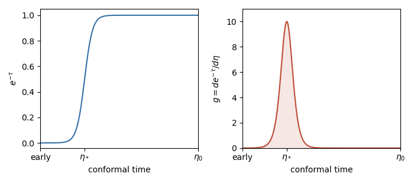

<h1 id="4/i/solution">Solution</h1>

↑ **Parent:** [I](../i.md)

Put $\Gamma(\eta)=a\bar n_e\sigma_T\ge0$, the [Thomson scattering](../../../../../../thomson-scattering.md) rate per unit [conformal time](../../../../../../conformal-time.md). The [cosmological optical depth](../../../../../../cosmological-optical-depth.md) is the integrated scattering rate from emission time to observation, so a Poisson scattering process has survival probability

$$
\boxed{E(\eta)=e^{-\tau(\eta)}=\Pr(\text{no further scattering between }\eta\text{ and }\eta_0)}.
$$

Since $\dot\tau=-\Gamma$, the [cosmological visibility function](../../../../../../cosmological-visibility-function.md) is

$$
\boxed{g(\eta)=\Gamma(\eta)e^{-\tau(\eta)}=\frac{dE}{d\eta}}.
$$

A photon scatters in an interval $d\eta$ with rate factor $\Gamma d\eta$ and then reaches us without another scattering with probability $E$, so $g\,d\eta$ is its probability of last scattering in that interval. For an optically thick initial epoch,

$$
\int_{\eta_i}^{\eta_0}g(\eta)d\eta=1-e^{-\tau(\eta_i)}\simeq1.
$$

If the initial optical depth is finite, the missing weight represents photons that have already stopped scattering before $\eta_i$.

Before [cosmological recombination](../../../../../../recombination-cosmology.md), the optical depth to the present is enormous: $E\simeq0$, and $g$ is also small because almost every scattering is followed by another. Through [photon decoupling](../../../../../../photon-decoupling.md), $E$ rises rapidly and $g$ has its dominant positive peak. After decoupling, without [reionization](../../../../../../reionization.md), $E$ is close to one and reaches exactly one at $\eta_0$, while $g$ is small because the remaining electron density and scattering rate are small. Residual ionization can give a weak tail; there is no second reionization peak. The peak marks the [Cosmic microwave background last-scattering surface](../../../../../../cosmic-microwave-background-last-scattering-surface.md).

**[Figure 3](#4/i/image-the-photon-visibility-function-during-recombination). The photon visibility function during recombination**. Normalized schematic without reionization. The right curve is the derivative of the left curve and has unit area; the horizontal scale and width are illustrative, not a numerical recombination calculation.

## ↑ Ancestors (11)

1. [I](../i.md)
2. [4](../../4.md)
3. [Paper 312](../../../paper-312-split.md)
4. [Iii](../../../split.md)
5. [2018](../../../../split.md)
6. [Past exam of the mathematics course of the University of Cambridge](../../../../../split.md)
7. [Mathematics course of the University of Cambridge](../../../../../../mathematics-course-of-the-university-of-cambridge.md)
8. [Course of the University of Cambridge](../../../../../../course-of-the-university-of-cambridge.md)
9. [University of Cambridge](../../../../../../university-of-cambridge-split.md)
10. [List of universities](../../../../../../list-of-universities.md)
11. [Codex Wiki](../../../../../../split.md)
