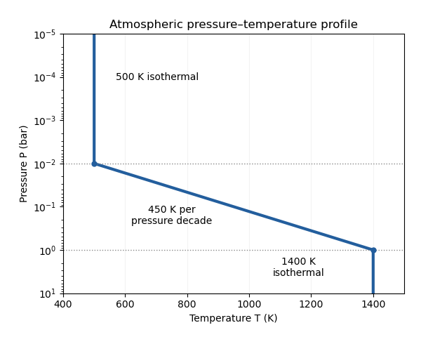

<h1 id="3/b/i/solution">Solution</h1>

↑ **Parent:** [I](../i.md)

Take the logarithm to base ten and write pressure in units of $1\,\mathrm{bar}$, so its argument is dimensionless. Continuity of the [atmospheric pressure-temperature profile](../../../../../../../atmospheric-pressure-temperature-profile.md) gives

$$
C=\frac{1400-500}{\log_{10}(1)-\log_{10}(10^{-2})},\qquad \boxed{C=450\,\mathrm{K}\ \text{per pressure decade}}.
$$

Thus

$$
\boxed{T(P)=\begin{cases}
500\,\mathrm{K},&P\leq10^{-2}\,\mathrm{bar},\\
1400\,\mathrm{K}+450\,\mathrm{K}\log_{10}(P/1\,\mathrm{bar}),&10^{-2}\,\mathrm{bar}<P<1\,\mathrm{bar},\\
1400\,\mathrm{K},&P\geq1\,\mathrm{bar}.
\end{cases}}
$$

If the logarithm means $\ln$, the equivalent constant is $C=900/\ln100\simeq195.4\,\mathrm{K}$. A plot of [temperature](../../../../../../../temperature.md) against logarithmic [pressure](../../../../../../../pressure.md) is vertical in each isothermal region and straight between the two endpoints.

**[Figure 1](#3/b/i/image-atmospheric-pressure-temperature-profile). Atmospheric pressure-temperature profile**.

The processes can be organized by the supplied pressure ranges, although the exact boundaries require reaction rates, irradiation and mixing information:

- At $P>1\,\mathrm{bar}$, the dense $1400\,\mathrm{K}$ gas can approach [thermochemical equilibrium](../../../../../../../thermochemical-equilibrium.md) because collisions and reactions are relatively rapid. Deep [carbon monoxide](../../../../../../../carbon-monoxide.md) and [molecular nitrogen](../../../../../../../molecular-nitrogen.md) can provide reservoirs for transported material.
- At $10^{-2}<P<1\,\mathrm{bar}$, the falling [temperature](../../../../../../../temperature.md) slows chemical conversion. Vertical transport can produce a [chemical quench level](../../../../../../../chemical-quench-level.md) when the [chemical relaxation time](../../../../../../../chemical-relaxation-time.md) crosses the [eddy mixing time](../../../../../../../eddy-mixing-time.md). [Horizontal chemical quenching](../../../../../../../horizontal-chemical-quenching.md) is also possible if dayside and nightside conditions differ. Suitable species can condense and undergo [atmospheric condensate rainout](../../../../../../../atmospheric-condensate-rainout.md) where a saturation curve is crossed.
- At $P<10^{-2}\,\mathrm{bar}$, slow thermal chemistry permits a [quenched atmospheric mixing ratio](../../../../../../../quenched-atmospheric-mixing-ratio.md) to survive. [Atmospheric photochemistry](../../../../../../../atmospheric-photochemistry.md) can dominate where stellar ultraviolet photons penetrate, often at still lower pressures; [atmospheric haze](../../../../../../../haze.md) may form from its products. Extremely high layers can also experience [atmospheric escape](../../../../../../../atmospheric-escape.md).

**The profile identifies plausible chemical regimes, but does not fix their transition pressures by itself.** In particular, cloud formation depends on the species-specific condensation curve, and ultraviolet processing depends on shielding.

## ↑ Ancestors (12)

1. [I](../i.md)
2. [B](../../b.md)
3. [3](../../../3.md)
4. [Paper 315](../../../../paper-315-split.md)
5. [Iii](../../../../split.md)
6. [2018](../../../../../split.md)
7. [Past exam of the mathematics course of the University of Cambridge](../../../../../../split.md)
8. [Mathematics course of the University of Cambridge](../../../../../../../mathematics-course-of-the-university-of-cambridge.md)
9. [Course of the University of Cambridge](../../../../../../../course-of-the-university-of-cambridge.md)
10. [University of Cambridge](../../../../../../../university-of-cambridge-split.md)
11. [List of universities](../../../../../../../list-of-universities.md)
12. [Codex Wiki](../../../../../../../split.md)
