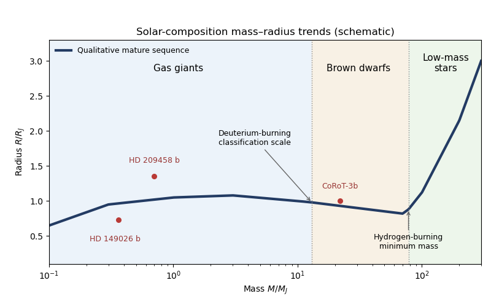

<h1 id="4/d/solution">Solution</h1>

↑ **Parent:** [D](../d.md)

A [mass-radius curve of solar-composition substellar objects](../../../../../../mass-radius-curve-of-solar-composition-substellar-objects.md) must specify age, irradiation and composition. For a mature, weakly irradiated [hydrogen](../../../../../../hydrogen.md)–[helium](../../../../../../helium.md) sequence, the qualitative [mass-radius relation](../../../../../../mass-radius-relation.md) has three main trends:

- At low giant-planet masses, weak compression allows a rough $R\propto M^{1/3}$ scaling at nearly fixed mean [mass density](../../../../../../density.md). Radius rises toward a broad maximum around one to a few Jupiter masses.
- Through massive gas giants and [brown dwarfs](../../../../../../brown-dwarf.md), radii remain near Jupiter's and eventually decline as compression and [electron degeneracy pressure](../../../../../../electron-degeneracy-pressure.md) become important. A nonrelativistic degenerate $n=3/2$ [stellar polytrope](../../../../../../stellar-polytrope.md) gives the approximate [polytropic mass-radius relation](../../../../../../polytropic-mass-radius-relation.md) $R\propto M^{-1/3}$; finite thermal pressure and real equations of state flatten and modify this idealized scaling.
- Above the [hydrogen-burning minimum mass](../../../../../../hydrogen-burning-minimum-mass.md), sustained [hydrogen burning](../../../../../../hydrogen-burning.md) supplies the energy that supports a rising low-mass main-sequence branch. For near-solar composition, the threshold is around $80$ Jupiter masses (about $0.075$ solar masses), with composition-dependent variation. [Red dwarfs](../../../../../../red-dwarf.md) then have radii increasing with mass, approximately linearly over part of the low-mass sequence.

The conventional [deuterium-burning mass](../../../../../../deuterium-burning-mass.md) near $13$ Jupiter masses marks a commonly used giant-planet/[brown dwarf](../../../../../../brown-dwarf.md) classification scale, not a sharp discontinuity in radius or a universal formation boundary. Young [brown dwarfs](../../../../../../brown-dwarf.md) are larger and cool by contraction; irradiation, a heavy-element core and [hot-Jupiter radius inflation](../../../../../../hot-jupiter-radius-inflation.md) shift planets away from a single solar-composition curve.

**[Figure 2](#4/d/image-schematic-mass-radius-trends-for-solar-composition-bodies). Schematic mass-radius trends for solar-composition bodies**.

The drawing is a qualitative mature sequence, not an interpolation of a specified evolutionary model grid. Three relevant observations, using representative historical measurements, are:

- **Inflated radii:** [HD 209458 b](../../../../../../hd-209458-b.md) has a radius around $1.35R_J$ at a mass around $0.7M_J$, illustrating [hot-Jupiter radius inflation](../../../../../../hot-jupiter-radius-inflation.md) relative to a simple mature unirradiated sequence. [Early transit photometry](https://arxiv.org/abs/astro-ph/0101336) measured its unusually large radius.
- **Compact metal-enriched planets:** [HD 149026 b](../../../../../../hd-149026-b.md) was measured near $0.36M_J$ and $0.73R_J$. Its small radius for its mass and irradiation implies substantial heavy-element enrichment in interior models, showing the importance of composition in the [planetary mass-radius relation](../../../../../../planetary-mass-radius-relation.md); see [the discovery analysis](https://arxiv.org/abs/astro-ph/0507009).
- **Jupiter-like sizes at substellar masses:** [CoRoT-3b](../../../../../../corot-3b.md) was measured near $22M_J$ but only $1.0R_J$, supporting the broad near-constant-radius region extending into [brown dwarf](../../../../../../brown-dwarf.md) masses. [Its measured mass and radius](https://arxiv.org/abs/0810.0919) also illustrate why mass alone does not establish a formation history.

**Gas-giant radius growth gives way to a nearly Jupiter-sized compressed branch, followed by rising radii in hydrogen-burning stars.**

## ↑ Ancestors (11)

1. [D](../d.md)
2. [4](../../4.md)
3. [Paper 315](../../../paper-315-split.md)
4. [Iii](../../../split.md)
5. [2018](../../../../split.md)
6. [Past exam of the mathematics course of the University of Cambridge](../../../../../split.md)
7. [Mathematics course of the University of Cambridge](../../../../../../mathematics-course-of-the-university-of-cambridge.md)
8. [Course of the University of Cambridge](../../../../../../course-of-the-university-of-cambridge.md)
9. [University of Cambridge](../../../../../../university-of-cambridge-split.md)
10. [List of universities](../../../../../../list-of-universities.md)
11. [Codex Wiki](../../../../../../split.md)
