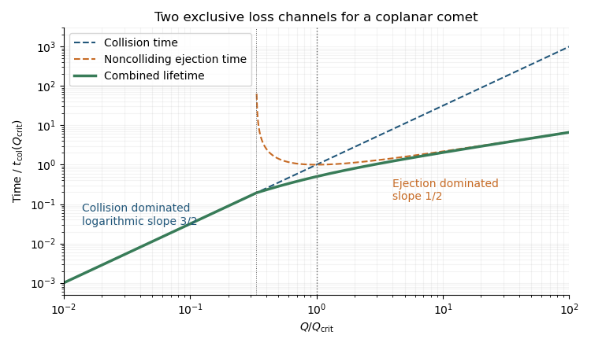
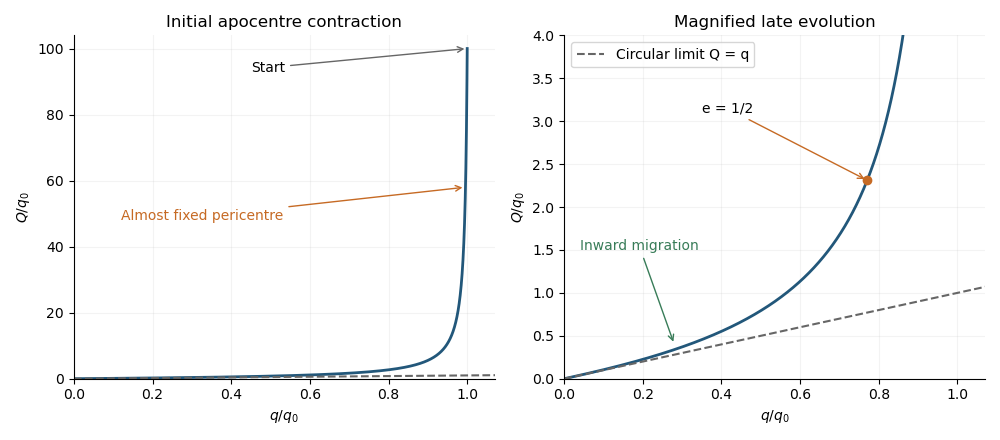
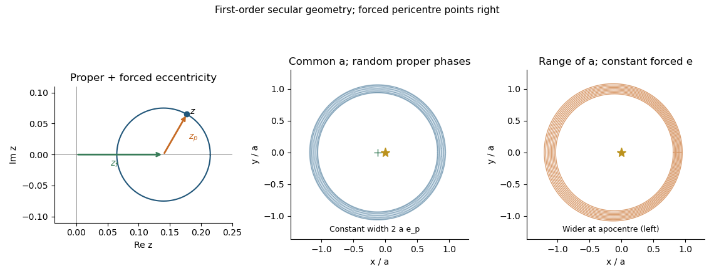
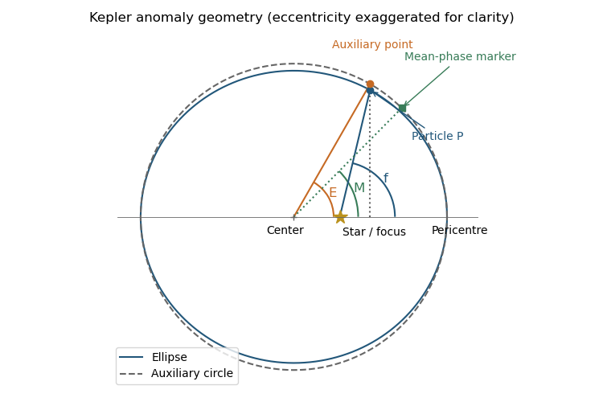
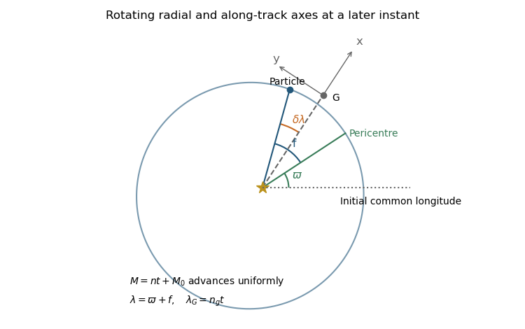

# Paper 316

↑ **Parent:** [Iii](../iii.md)

[https://www.maths.cam.ac.uk/postgrad/part-iii/files/pastpapers/2018/paper_316.pdf](https://www.maths.cam.ac.uk/postgrad/part-iii/files/pastpapers/2018/paper_316.pdf)

**Table of contents**

- [1](#1)
  - [i](#1/i)
    - [Solution](#1/i/solution)
  - [ii](#1/ii)
    - [Solution](#1/ii/solution)
  - [iii](#1/iii)
    - [Solution](#1/iii/solution)
  - [iv](#1/iv)
    - [Solution](#1/iv/solution)
  - [v](#1/v)
    - [Solution](#1/v/solution)
  - [vi](#1/vi)
    - [Solution](#1/vi/solution)
  - [vii](#1/vii)
    - [Solution](#1/vii/solution)
  - [viii](#1/viii)
    - [Solution](#1/viii/solution)
- [2](#2)
  - [i](#2/i)
    - [Solution](#2/i/solution)
  - [ii](#2/ii)
    - [Solution](#2/ii/solution)
  - [iii](#2/iii)
    - [Solution](#2/iii/solution)
  - [iv](#2/iv)
    - [Solution](#2/iv/solution)
  - [v](#2/v)
    - [Solution](#2/v/solution)
  - [vi](#2/vi)
    - [Solution](#2/vi/solution)
  - [vii](#2/vii)
    - [Solution](#2/vii/solution)
- [3](#3)
  - [i](#3/i)
    - [Solution](#3/i/solution)
  - [ii](#3/ii)
    - [Solution](#3/ii/solution)
  - [iii](#3/iii)
    - [Solution](#3/iii/solution)
  - [iv](#3/iv)
    - [Solution](#3/iv/solution)
  - [v](#3/v)
    - [Solution](#3/v/solution)
  - [vi](#3/vi)
    - [Solution](#3/vi/solution)
  - [vii](#3/vii)
    - [Solution](#3/vii/solution)
  - [viii](#3/viii)
    - [Solution](#3/viii/solution)
- [4](#4)
  - [i](#4/i)
    - [Solution](#4/i/solution)
  - [ii](#4/ii)
    - [Solution](#4/ii/solution)
  - [iii](#4/iii)
    - [Solution](#4/iii/solution)
  - [iv](#4/iv)
    - [Solution](#4/iv/solution)
  - [v](#4/v)
    - [Solution](#4/v/solution)
  - [vi](#4/vi)
    - [Solution](#4/vi/solution)

## 1

↑ **Parent:** [Paper 316](paper-316.md)

<h3 id="1/i">i</h3>

↑ **Parent:** [1](#1)

<h4 id="1/i/solution">Solution</h4>

↑ **Parent:** [I](#1/i)

Put $\mu_\star=GM_\star$. Conservation of [specific orbital energy](../../../classical-mechanics.md#specific-orbital-energy) and [specific angular momentum](../../../classical-mechanics.md#specific-angular-momentum) gives

$$
a=\frac{Q+q}{2},\qquad h^2=\frac{2\mu_\star qQ}{Q+q},\qquad
v_c^2=\mu_\star\left(\frac2{a_p}-\frac2{Q+q}\right),\qquad v_p^2=\frac{\mu_\star}{a_p}.
$$

The last [comet](../../../planetary-science.md#comet) expression is the [vis-viva equation](../../../classical-mechanics.md#vis-viva-equation) at the [planet](../../../planetary-science.md#planet)'s orbit. The [planet](../../../planetary-science.md#planet) has only tangential velocity, while the [comet](../../../planetary-science.md#comet)'s tangential component is $v_t=h/a_p$. Consequently its prograde [relative velocity](../../../classical-mechanics.md#relative-velocity) is exactly, before planetary deflection,

$$
\frac{v_{\rm rel}^2}{v_p^2}=3-\frac{2a_p}{Q+q}-2\sqrt{\frac{2qQ}{a_p(Q+q)}}.
$$

In the near-parabolic encounter limit $Q\gg a_p$, this reduces to

$$
\boxed{v_{\rm rel}\simeq v_p\left[3-2\sqrt{2q/a_p}\right]^{1/2}.}
$$

**The displayed approximation also requires $Q\gg a_p$.** The assumptions $Q\gg q$ and $q\ll a_p$ alone do not guarantee it: an orbit with $Q=a_p$ encounters the [planet](../../../planetary-science.md#planet) near [apoapsis](../../../classical-mechanics.md#apoapsis) and has $v_{\rm rel}\simeq v_p$, not $\sqrt3v_p$.

If all coplanar near-parabolic planet-crossing [comets](../../../planetary-science.md#comet) are admitted, so that $0\leq q\leq a_p$, the tangential component ranges from $-\sqrt2v_p$ to $+\sqrt2v_p$ when retrograde orbits are included. Thus

$$
\boxed{(\sqrt2-1)v_p\leq v_{\rm rel}\leq(\sqrt2+1)v_p.}
$$

For prograde orbits alone the upper limit is $\sqrt3v_p$; for the stated deep-crossing limit $q\ll a_p$, both prograde and retrograde encounters approach $\sqrt3v_p$. These are the speeds outside the [planet](../../../planetary-science.md#planet)'s gravitational well. The surface impact speed is $v_{\rm imp}=\sqrt{v_{\rm rel}^2+v_{\rm esc,p}^2}$, where $v_{\rm esc,p}$ is the planetary [escape velocity](../../../classical-mechanics.md#escape-velocity); under negligible [gravitational focusing](../../../classical-mechanics.md#gravitational-focusing) the two speeds agree.

<h3 id="1/ii">ii</h3>

↑ **Parent:** [1](#1)

<h4 id="1/ii/solution">Solution</h4>

↑ **Parent:** [Ii](#1/ii)

For an unperturbed [Kepler orbit](../../../classical-mechanics.md#kepler-orbit), successive revolutions advance the planet-relative orientation by $-n_pT_c$ modulo $2\pi$, where $T_c$ is the [comet](../../../planetary-science.md#comet)'s [orbital period](../../../classical-mechanics.md#orbital-period). An irrational period ratio makes these orientations dense; sufficiently distant [mean-motion resonance](../../../classical-mechanics.md#mean-motion-resonance) and adequate observation time justify the corresponding [phase mixing](../../../planetary-science.md#phase-mixing) approximation.

At each radius between its [pericentre distance](../../../classical-mechanics.md#pericentre-distance) and [apocentre distance](../../../classical-mechanics.md#apocentre-distance), the [comet](../../../planetary-science.md#comet) eventually visits every azimuth in the [rotating reference frame](../../../physics.md#rotating-reference-frame). The spatial projection is therefore

$$
\boxed{q\leq r\leq Q,\quad 0\leq\theta<2\pi.}
$$

It is an [annulus](../../../topology.md#annulus-mathematics), with a nonuniform radial residence probability, rather than a uniformly filled area. Strictly, the full position-velocity [phase space](../../../classical-mechanics.md#phase-space) is not this [annulus](../../../topology.md#annulus-mathematics): at each radius the energy and angular momentum constrain the velocity, with inward and outward branches. The [annulus](../../../topology.md#annulus-mathematics) is its position-space projection. This description assumes the [orbital elements](../../../classical-mechanics.md#orbital-element) have not yet been substantially changed by [planetary scattering](../../../planetary-science.md#planetary-scattering).

<h3 id="1/iii">iii</h3>

↑ **Parent:** [1](#1)

<h4 id="1/iii/solution">Solution</h4>

↑ **Parent:** [Iii](#1/iii)

The radial velocity of a [Kepler orbit](../../../classical-mechanics.md#kepler-orbit) follows from the [vis-viva equation](../../../classical-mechanics.md#vis-viva-equation) after subtracting the tangential component:

$$
v_r^2=\frac{\mu_\star}{a}\frac{(r-q)(Q-r)}{r^2},\qquad
T_c=\frac{2\pi a^{3/2}}{\sqrt{\mu_\star}},\qquad a=\frac{Q+q}{2}.
$$

Each radial interval is crossed twice per [orbital period](../../../classical-mechanics.md#orbital-period), so its fraction of time is

$$
\boxed{\frac{dt_{\rm both}}{T_c}=p_r(r)\,dr=\frac{r\,dr}{\pi a\sqrt{(r-q)(Q-r)}}.}
$$

This is the [phase-mixed radial probability of a Kepler orbit](../../../classical-mechanics.md#phase-mixed-radial-probability-of-a-kepler-orbit), normalized to one between $q$ and $Q$. Dividing by the annular area $2\pi r\,dr$ gives the [phase-mixed comet surface density](../../../planetary-science.md#phase-mixed-comet-surface-density) per [comet](../../../planetary-science.md#comet):

$$
\boxed{\Sigma_c(r)=\frac{1}{\pi^2(Q+q)\sqrt{(r-q)(Q-r)}}.}
$$

For $Q\gg a_p>q$,

$$
\boxed{\Sigma_c(a_p)\simeq\frac{1}{\pi^2Q^{3/2}a_p^{1/2}}\left(1-\frac q{a_p}\right)^{-1/2}.}
$$

**The printed density has the powers of $Q$ and $a_p$ interchanged.** Its expression is too large by $Q/a_p$ in this limit. The normalized residence-time derivation fixes the corrected expression, which is also required for the later $Q^{1/2}$ ejection-time scaling. For a population of $N_c$ independent identical [comets](../../../planetary-science.md#comet), multiply $\Sigma_c$ by $N_c$ to obtain a number [surface density of a disk](../../../astrophysics.md#surface-density-of-a-disk).

<h3 id="1/iv">iv</h3>

↑ **Parent:** [1](#1)

<h4 id="1/iv/solution">Solution</h4>

↑ **Parent:** [Iv](#1/iv)

With negligible [comet](../../../planetary-science.md#comet) radius and mass, the [planet](../../../planetary-science.md#planet)'s radius and [escape velocity](../../../classical-mechanics.md#escape-velocity) are

$$
R_p=\left(\frac{3M_p}{4\pi\rho_p}\right)^{1/3},\qquad
v_{\rm esc,p}^2=\frac{2GM_p}{R_p}.
$$

[Gravitational focusing](../../../classical-mechanics.md#gravitational-focusing) changes the limiting collision [impact parameter](../../../classical-mechanics.md#impact-parameter) from $R_p$ to $R_p\sqrt{1+v_{\rm esc,p}^2/v_{\rm rel}^2}$. Thus it is negligible when $v_{\rm esc,p}^2\ll v_{\rm rel}^2$.

Put $s=q/a_p$ and $\gamma=\sqrt{3-2\sqrt{2s}}$ in the $Q\gg a_p$ prograde approximation. Substituting $v_{\rm rel}=\gamma\sqrt{GM_\star/a_p}$ gives

$$
\boxed{M_p\ll\left(\frac{\gamma^2M_\star}{2a_p}\right)^{3/2}\left(\frac{3}{4\pi\rho_p}\right)^{1/2}.}
$$

Equivalently $2(M_p/M_\star)(a_p/R_p)\ll\gamma^2$. For $q\ll a_p$, use $\gamma^2\simeq3$. If negligible [gravitational focusing](../../../classical-mechanics.md#gravitational-focusing) is required for every coplanar near-parabolic orbit, including nearly tangential prograde encounters, use the smaller value $\gamma^2=(\sqrt2-1)^2$.

<h3 id="1/v">v</h3>

↑ **Parent:** [1](#1)

<h4 id="1/v/solution">Solution</h4>

↑ **Parent:** [V](#1/v)

A coplanar target sweeps a strip of width $2R_p$ through the [comet](../../../planetary-science.md#comet)'s local position probability. Hence the relevant [geometric collision cross-section](../../../classical-mechanics.md#geometric-collision-cross-section) is a length, and the rare collision rate per [comet](../../../planetary-science.md#comet) is $\Gamma_{\rm col}=2R_p\Sigma_c(a_p)v_{\rm rel}$.

Using the corrected [phase-mixed comet surface density](../../../planetary-science.md#phase-mixed-comet-surface-density) and the notation $s=q/a_p$, $\gamma=\sqrt{3-2\sqrt{2s}}$, the [coplanar comet collision time](../../../planetary-science.md#coplanar-comet-collision-time) is

$$
\boxed{t_{\rm col}\simeq\frac{\pi^2Q^{3/2}a_p\sqrt{1-s}}{2R_p\gamma\sqrt{GM_\star}}.}
$$

For $q\ll a_p$, this becomes $\pi^2Q^{3/2}a_p/(2\sqrt3R_p\sqrt{GM_\star})$, so $t_{\rm col}\propto Q^{3/2}M_p^{-1/3}a_p$ at fixed stellar mass and planetary [mass density](../../../fluid-mechanics.md#density). This is the mean waiting time for one orbiting [comet](../../../planetary-science.md#comet); the mean interval between impacts from $N_c$ such independent [comets](../../../planetary-science.md#comet) is $t_{\rm col}/N_c$. It assumes rare encounters and orbital [phase mixing](../../../planetary-science.md#phase-mixing), not a [Poisson process](../../../probability-theory.md#poisson-process) derived from a single deterministic trajectory.

<h3 id="1/vi">vi</h3>

↑ **Parent:** [1](#1)

<h4 id="1/vi/solution">Solution</h4>

↑ **Parent:** [Vi](#1/vi)

Suppose the inclined population samples its arguments of periapsis and nodal orientations, or that sufficiently slow precession supplies this sampling. Near the [planet](../../../planetary-science.md#planet) the vertical amplitude is $H\simeq a_pI$. For uniformly distributed vertical phase, $z=H\sin\psi$ has [probability density function](../../../continuous-probability-distribution.md#probability-density-function) $[\pi\sqrt{H^2-z^2}]^{-1}$, so the midplane volume probability is $\Sigma_c/(\pi H)$.

In the genuinely three-dimensional regime $R_p\ll H\ll a_p$, the [geometric collision cross-section](../../../classical-mechanics.md#geometric-collision-cross-section) is $\pi R_p^2$. The [relative velocity](../../../classical-mechanics.md#relative-velocity) differs from the coplanar value only at order $I^2$ for the specified high-speed encounters. Therefore the [inclined comet collision time](../../../planetary-science.md#inclined-comet-collision-time) is

$$
\boxed{t_{\rm col,I}\simeq\frac{H}{R_p^2\Sigma_c(a_p)v_{\rm rel}}\simeq\frac{\pi^2I Q^{3/2}a_p^2\sqrt{1-q/a_p}}{R_p^2\sqrt{GM_\star}\sqrt{3-2\sqrt{2q/a_p}}}.}
$$

At fixed $\rho_p,M_\star,I$ the leading scaling is $Q^{3/2}M_p^{-2/3}a_p^2$, with no leading $q$ dependence when $q\ll a_p$. The displayed factor retains the first dependence on $q/a_p$. Also $t_{\rm col,I}/t_{\rm col}\simeq2a_pI/R_p$ in this averaging convention.

**Inclination alone does not specify a collision time for one fixed orbit.** If its [orbital nodes](../../../classical-mechanics.md#orbital-node) miss the [planet](../../../planetary-science.md#planet)'s orbit, a tilted [Kepler orbit](../../../classical-mechanics.md#kepler-orbit) can have no collisions at all. The finite result is an orientation-averaged population result, or requires precession or scattering to sample those orientations. When $a_pI\lesssim R_p$, the three-dimensional estimate crosses over to the coplanar result instead of tending to zero.

<h3 id="1/vii">vii</h3>

↑ **Parent:** [1](#1)

<h4 id="1/vii/solution">Solution</h4>

↑ **Parent:** [Vii](#1/vii)

In a planetary [gravitational assist](../../../classical-mechanics.md#gravitational-assist), the incoming and outgoing relative speeds have the same magnitude. If $\mathbf u$ is the planet-frame velocity, the heliocentric [specific orbital energy](../../../classical-mechanics.md#specific-orbital-energy) change is consequently

$$
\Delta\varepsilon=\mathbf v_p\cdot\Delta\mathbf u,
$$

not an arbitrary addition of $|\Delta\mathbf u|$ to the heliocentric speed. The initial binding energy per unit mass is $GM_\star/(Q+q)\simeq GM_\star/Q$.

For a weak deflection, $b\gg b_{90}=GM_p/v_\infty^2$, the hyperbolic scattering formula gives $|\Delta\mathbf u|\simeq2GM_p/(bv_\infty)$. Its direction is perpendicular to the incoming relative velocity. At the [planet](../../../planetary-science.md#planet), in the near-parabolic prograde limit,

$$
u_r\simeq\pm v_p\sqrt{2(1-s)},\qquad u_t\simeq v_p(\sqrt{2s}-1),\qquad
v_\infty=\gamma v_p,\qquad \kappa=\frac{|u_r|}{v_\infty}=\frac{\sqrt{2(1-s)}}\gamma.
$$

On the favorable side of the [planet](../../../planetary-science.md#planet) the energy gain is approximately $2GM_pv_p\kappa/(bv_\infty)$. Equating this to the binding energy gives the ejection [impact parameter](../../../classical-mechanics.md#impact-parameter)

$$
\boxed{b_{\rm ej}\simeq2\frac{M_p}{M_\star}\frac\kappa\gamma Q\propto Q.}
$$

Only one sign of impact parameter gains energy for each radial branch. Noncolliding ejections have $R_p<|b|<b_{\rm ej}$, giving width $(b_{\rm ej}-R_p)_+$, where $x_+=\max(x,0)$. For $b_{\rm ej}\gg R_p$, the [planetary ejection of a comet](../../../planetary-science.md#planetary-ejection-of-a-comet) rate is approximately $\Gamma_{\rm ej}=\Sigma_c v_\infty b_{\rm ej}$. With $\mu_p=M_p/M_\star$ this gives

$$
\boxed{t_{\rm ej}\simeq\frac{\pi^2a_p\sqrt{1-s}}{2\mu_p\kappa\sqrt{GM_\star}}\,Q^{1/2}\propto Q^{1/2}.}
$$

The scaling applies when $b_{90}\ll b_{\rm ej}\ll r_H$ so that the local two-body encounter and weak-deflection approximations are consistent. The favorable-side coefficient assumes a coplanar orbit; averaging over other encounter geometries changes it. Cumulative diffusion by many subthreshold encounters is not included in this one-encounter estimate.

<h3 id="1/viii">viii</h3>

↑ **Parent:** [1](#1)

<h4 id="1/viii/solution">Solution</h4>

↑ **Parent:** [Viii](#1/viii)

Exclude collisions from the ejection count. The effective collision width is $2R_p$, while the favorable noncolliding ejection width is $(b_{\rm ej}-R_p)_+$. Define the first flyby-ejection threshold and the equal-rate crossover by

$$
Q_{\rm hit}=\frac{\gamma R_p}{2\mu_p\kappa},\qquad
\boxed{Q_{\rm crit}=3Q_{\rm hit}=\frac{3[3-2\sqrt{2q/a_p}]R_p}{2\mu_p\sqrt{2(1-q/a_p)}}.}
$$

There are no direct noncolliding ejections in this weak-deflection model for $Q\leq Q_{\rm hit}$. Above that threshold, comparison of the two rates gives **collision is more likely for $Q<Q_{\rm crit}$, while ejection is more likely for $Q>Q_{\rm crit}$.** In the deep-crossing limit $Q_{\rm crit}\simeq[9/(2\sqrt2)](M_\star/M_p)R_p$, so its scaling at fixed density is $M_\star M_p^{-2/3}\rho_p^{-1/3}$. Order-one factors depend on encounter geometry; the robust condition compares $(M_p/M_\star)Q$ with $R_p$.

Adding the mutually exclusive rare-event loss rates gives the [collision-ejection lifetime of a comet](../../../planetary-science.md#collision-ejection-lifetime-of-a-comet):

$$
\boxed{t_{\rm life}\simeq\frac{t_{\rm col}}{1+\tfrac12(Q/Q_{\rm hit}-1)_+}.}
$$

For $Q\leq Q_{\rm hit}$ this is $t_{\rm col}\propto Q^{3/2}$. For $Q\gg Q_{\rm hit}$ it approaches $t_{\rm ej}\propto Q^{1/2}$. A logarithmic sketch therefore bends from slope $3/2$ to slope $1/2$, with no maximum. At the equal-rate crossover the lifetime is half either individual loss time.

**[Figure 1](#1/viii/image-collision-ejection-lifetime-of-a-comet). Collision-ejection lifetime of a comet**. The mutually exclusive collision and flyby-ejection times and their combined lifetime, scaled to the equal-rate crossover.

These asymptotic branches use the corrected residence density from part iii and require $Q\gg a_p$ and a local encounter scale below the [Hill radius](../../../classical-mechanics.md#hill-radius). They cannot be extrapolated indefinitely to arbitrarily distant weakly bound orbits.

## 2

↑ **Parent:** [Paper 316](paper-316.md)

<h3 id="2/i">i</h3>

↑ **Parent:** [2](#2)

<h4 id="2/i/solution">Solution</h4>

↑ **Parent:** [I](#2/i)

For $0<e<1$, differentiate the logarithm of the proposed [Poynting–Robertson drag invariant](../../../planetary-science.md#poynting-robertson-drag-invariant):

$$
\frac{\dot C}{C}=\frac{\dot a}{a}-\frac{2e\dot e}{1-e^2}-\frac45\frac{\dot e}{e}.
$$

Substitution of the orbit-averaged [Poynting–Robertson drag](../../../planetary-science.md#poynting-robertson-drag) rates gives, over the common denominator $a^2(1-e^2)^{3/2}$, the numerator $A[-(2+3e^2)+5e^2+2(1-e^2)]=0$. Hence

$$
\boxed{C=a(1-e^2)e^{-4/5}=\text{constant}.}
$$

Equivalently, eliminating time gives $d\log a/de=(2/5)(2+3e^2)/[e(1-e^2)]$, whose integral is $\log a=(4/5)\log e-\log(1-e^2)+\text{constant}$. An exactly circular orbit remains circular; the expression for $C$ is singular at $e=0$ and is replaced by that separate solution.

<h3 id="2/ii">ii</h3>

↑ **Parent:** [2](#2)

<h4 id="2/ii/solution">Solution</h4>

↑ **Parent:** [Ii](#2/ii)

Using $q=a(1-e)$ and $Q=a(1+e)$, differentiate each apsidal distance. The [apsidal evolution under Poynting–Robertson drag](../../../planetary-science.md#apsidal-evolution-under-poynting-robertson-drag) is

$$
\boxed{\dot q=-\frac{A(1-e)^2(4-e)}{2a(1-e^2)^{3/2}},\qquad
\dot Q=-\frac{A(1+e)^2(4+e)}{2a(1-e^2)^{3/2}}.}
$$

Both the [pericentre distance](../../../classical-mechanics.md#pericentre-distance) and [apocentre distance](../../../classical-mechanics.md#apocentre-distance) decrease. Since $a=(Q+q)/2$ and $e=(Q-q)/(Q+q)$, the same rates are

$$
\dot q=-\frac{A\sqrt q\,(5q+3Q)}{2(Q+q)Q^{3/2}},\qquad
\dot Q=-\frac{A\sqrt Q\,(3q+5Q)}{2(Q+q)q^{3/2}}.
$$

Their ratio is

$$
\boxed{\frac{dQ}{dq}=\left(\frac Qq\right)^2\frac{3q+5Q}{5q+3Q}.}
$$

In particular $Q\gg q$ gives $dQ/dq\simeq(5/3)(Q/q)^2$, whereas the circular limit gives slope $1$.

<h3 id="2/iii">iii</h3>

↑ **Parent:** [2](#2)

<h4 id="2/iii/solution">Solution</h4>

↑ **Parent:** [Iii](#2/iii)

Parameterize the trajectory by the decreasing [orbital eccentricity](../../../classical-mechanics.md#orbital-eccentricity). The [Poynting–Robertson drag invariant](../../../planetary-science.md#poynting-robertson-drag-invariant) gives

$$
\boxed{q(e)=\frac{Ce^{4/5}}{1+e},\qquad Q(e)=\frac{Ce^{4/5}}{1-e},\qquad
C=\frac{2q_0Q_0}{q_0+Q_0}\left(\frac{Q_0-q_0}{Q_0+q_0}\right)^{-4/5}.}
$$

For $Q_0\gg q_0$, $C\simeq2q_0$. Initially $e\simeq1$, and the orbit moves almost vertically down a plot of $Q/q_0$ against $q/q_0$: the [apocentre distance](../../../classical-mechanics.md#apocentre-distance) shrinks rapidly while the [pericentre distance](../../../classical-mechanics.md#pericentre-distance) changes little. Integrating the high-eccentricity slope gives

$$
q_0-q\simeq\frac35q_0^2\left(\frac1Q-\frac1{Q_0}\right),\qquad Q,Q_0\gg q_0.
$$

Once the orbit has moderate [orbital eccentricity](../../../classical-mechanics.md#orbital-eccentricity), both distances change appreciably. For example $e=1/2$ gives $q\simeq0.766q_0$ and $Q\simeq2.30q_0$ in the $Q_0/q_0\to\infty$ limit. Eventually $e\ll1$, $q\simeq Q\simeq Ce^{4/5}$, and the trajectory approaches the diagonal $Q=q$ before reaching the origin. Thus the two approximate phases are **apocentre contraction at nearly fixed pericentre, followed by nearly circular inward migration**. They are a smooth crossover, not two separate exact solutions.

**[Figure 2](#2/iii/image-apsidal-evolution-under-poynting-robertson-drag). Apsidal evolution under Poynting–Robertson drag**. The full apsidal trajectory and a magnified view of its late evolution for an initial apocentre one hundred times the initial pericentre.

<h3 id="2/iv">iv</h3>

↑ **Parent:** [2](#2)

<h4 id="2/iv/solution">Solution</h4>

↑ **Parent:** [Iv](#2/iv)

For a circular [Kepler orbit](../../../classical-mechanics.md#kepler-orbit), $e=0$ remains an exact solution of the averaged [Poynting–Robertson drag](../../../planetary-science.md#poynting-robertson-drag) equations, and $\dot a=-2A/a$. Integrating gives $a^2(t)=a_0^2-4At$, so the point-star [inspiral time under Poynting–Robertson drag](../../../planetary-science.md#inspiral-time-under-poynting-robertson-drag) is

$$
\boxed{t_{\rm circ}=\frac{a_0^2}{4A}=\frac{ca_0^2}{4\beta GM_\star}.}
$$

For a [star](../../../stellar-astrophysics.md#star) of radius $R_\star$, contact occurs instead at $(a_0^2-R_\star^2)/(4A)$ within this model. Sublimation or other forces can remove a real grain earlier.

<h3 id="2/v">v</h3>

↑ **Parent:** [2](#2)

<h4 id="2/v/solution">Solution</h4>

↑ **Parent:** [V](#2/v)

Eliminate $a$ using the [Poynting–Robertson drag invariant](../../../planetary-science.md#poynting-robertson-drag-invariant), $a=Ce^{4/5}/(1-e^2)$. The eccentricity rate becomes

$$
\dot e=-\frac{5A}{2C^2}e^{-3/5}(1-e^2)^{3/2}.
$$

Since the point-star limit corresponds to $a\to0$ and $e\to0$, the [inspiral time under Poynting–Robertson drag](../../../planetary-science.md#inspiral-time-under-poynting-robertson-drag) is

$$
\boxed{t(e_0)=\frac{2C^2}{5A}\int_0^{e_0}\frac{u^{3/5}}{(1-u^2)^{3/2}}\,du,\qquad C=a_0(1-e_0^2)e_0^{-4/5}.}
$$

For $e_0\to0$, the integral is $(5/8)e_0^{8/5}+o(e_0^{8/5})$, recovering $a_0^2/(4A)$ despite the apparent singularity of $C$.

For $e_0\to1$, use $C\simeq2q_0$ and $1-e_0=2q_0/(Q_0+q_0)\simeq2q_0/Q_0$. The endpoint asymptotic integral is $[2(1-e_0)]^{-1/2}$, giving

$$
\boxed{t\simeq\frac4{5A}\,Q_0^{1/2}q_0^{3/2}.}
$$

Most of this long lifetime is spent near the initially large [apocentre distance](../../../classical-mechanics.md#apocentre-distance), before substantial circularization. The result assumes weak drag and a valid orbital average; near-parabolic release can violate that assumption.

<h3 id="2/vi">vi</h3>

↑ **Parent:** [2](#2)

<h4 id="2/vi/solution">Solution</h4>

↑ **Parent:** [Vi](#2/vi)

Assume negligible fragment release speed relative to a circular parent [planetesimal](../../../planetary-science.md#planetesimal). Its initial speed is $v_b=\sqrt{GM_\star/r_b}$, but [radiation pressure](../../../thermodynamics.md#radiation-pressure) reduces the grain's gravitational parameter to $(1-\beta)GM_\star$. Its [specific orbital energy](../../../classical-mechanics.md#specific-orbital-energy) and [specific angular momentum](../../../classical-mechanics.md#specific-angular-momentum) are

$$
\varepsilon_0=\frac{GM_\star}{r_b}\left(\beta-\frac12\right),\qquad h_0^2=GM_\star r_b.
$$

For $0\leq\beta<1/2$, the resulting [dust orbit released from a circular parent ring](../../../planetary-science.md#dust-orbit-released-from-a-circular-parent-ring) has

$$
\boxed{a_0=\frac{(1-\beta)r_b}{1-2\beta},\qquad e_0=\frac\beta{1-\beta},\qquad q_0=r_b,\qquad Q_0=\frac{r_b}{1-2\beta}.}
$$

Release is at [periapsis](../../../classical-mechanics.md#periapsis): the inherited tangential speed exceeds the new circular speed. Low-$\beta$ grains remain near the [dust birth ring](../../../planetary-science.md#dust-birth-ring); higher bound $\beta$ gives increasingly eccentric orbits extending well outside it. Uniform release longitude produces an approximately axisymmetric [dust halo](../../../planetary-science.md#dust-halo), with long residence times near [apoapsis](../../../classical-mechanics.md#apoapsis). At $\beta=1/2$ the conservative release orbit is parabolic; above this [radiation-pressure blowout threshold](../../../planetary-science.md#radiation-pressure-blowout-threshold) it is initially unbound. For $\beta\geq1$, zero or repulsive effective gravity also prevents a bound [ellipse](../../../geometry-and-topology.md#ellipse).

**[Figure 3](#2/vi/image-dust-release-orbits-and-inspiral-time-under-poynting-robertson-drag). Dust release orbits and inspiral time under Poynting–Robertson drag**. Left: representative orbits released at one point on the birth ring, including the parabolic release limit. Right: the formal averaged lifetime of bound grains as a function of the radiation-pressure coefficient.

The left panel shows one release longitude; rotating it around the ring fills the halo. At longer times [Poynting–Robertson drag](../../../planetary-science.md#poynting-robertson-drag) also carries bound grains inward, so an initially outward-spanning release distribution does not imply an empty inner region in a continuously supplied, collision-free population.

<h3 id="2/vii">vii</h3>

↑ **Parent:** [2](#2)

<h4 id="2/vii/solution">Solution</h4>

↑ **Parent:** [Vii](#2/vii)

For the bound release orbits, use $e_0=\beta/(1-\beta)$ and

$$
C=r_b\beta^{-4/5}(1-\beta)^{-1/5},\qquad t_\star=\frac{cr_b^2}{GM_\star}.
$$

The [inspiral time under Poynting–Robertson drag](../../../planetary-science.md#inspiral-time-under-poynting-robertson-drag) is then

$$
\boxed{\frac{t_{\rm PR}(\beta)}{t_\star}=\frac25\beta^{-13/5}(1-\beta)^{-2/5}\int_0^{\beta/(1-\beta)}\frac{u^{3/5}}{(1-u^2)^{3/2}}\,du,\quad0<\beta<\frac12.}
$$

The limiting branches are

$$
\boxed{\frac{t_{\rm PR}}{t_\star}\simeq\frac1{4\beta}\quad(\beta\to0^+),\qquad
\frac{t_{\rm PR}}{t_\star}\simeq\frac4{5\beta\sqrt{1-2\beta}}\quad(\beta\to\tfrac12^-).}
$$

Thus the formal bound-grain curve, shown in the right panel of the preceding figure, diverges at both ends and has a minimum at an intermediate $\beta$. At $\beta=0$ there is no [Poynting–Robertson drag](../../../planetary-science.md#poynting-robertson-drag) and the circular grain survives indefinitely in this collision-free model.

**Initially unbound grains do not have a bound-orbit inspiral lifetime.** For $\beta\geq1/2$ the release calculation gives outward trajectories; their residence time in a specified finite observation region is a dynamical escape time, not the averaged $t_{\rm PR}$ above. A numerical escape lifetime cannot be assigned without specifying the outer boundary. Extremely close to $1/2$, energy lost on the first passage can alter even this bound/unbound classification: orbital averaging requires roughly $1-2\beta\gg v_b/c$. Accordingly the divergence is a formal limit of the supplied secular equations, not an exact prediction for marginal grains.

## 3

↑ **Parent:** [Paper 316](paper-316.md)

<h3 id="3/i">i</h3>

↑ **Parent:** [3](#3)

<h4 id="3/i/solution">Solution</h4>

↑ **Parent:** [I](#3/i)

Differentiating the [disturbing function](../../../planetary-science.md#disturbing-function) in [Lagrange planetary equations](../../../planetary-science.md#lagrange-planetary-equations) gives

$$
\dot e=\sum_j A_j e_j\sin(\varpi-\varpi_j),\qquad
\dot\varpi=A+\sum_j A_j\frac{e_j}{e}\cos(\varpi-\varpi_j).
$$

For the [complex eccentricity](../../../planetary-science.md#complex-eccentricity) $z=e e^{i\varpi}$,

$$
\dot z=e^{i\varpi}(\dot e+ie\dot\varpi).
$$

Use $\sin\delta+i\cos\delta=i e^{-i\delta}$. Each planetary term becomes $iA_je_je^{i\varpi_j}=iA_jz_j$, so

$$
\boxed{\dot z=iAz+i\sum_{j=1}^N A_jz_j.}
$$

Unlike the polar [orbital element](../../../classical-mechanics.md#orbital-element) equations, this linear equation is nonsingular at $e=0$.

<h3 id="3/ii">ii</h3>

↑ **Parent:** [3](#3)

<h4 id="3/ii/solution">Solution</h4>

↑ **Parent:** [Ii](#3/ii)

The planetary expansion is a decomposition into [secular eigenmodes](../../../planetary-science.md#secular-eigenmode) of conservative linear [Laplace-Lagrange secular theory](../../../planetary-science.md#laplace-lagrange-secular-theory). It assumes small [orbital eccentricities](../../../classical-mechanics.md#orbital-eccentricity), coplanarity, approximately constant [semi-major axis](../../../classical-mechanics.md#semi-major-axis) values, and averaging over fast [orbital phases](../../../classical-mechanics.md#orbital-phase) away from important [mean-motion resonances](../../../classical-mechanics.md#mean-motion-resonance) and close encounters. Dissipation, migration, and nonlinear secular effects are absent from this constant-coefficient representation.

The $g_i$ are real eigenfrequencies of the [Laplace-Lagrange secular matrix](../../../planetary-science.md#laplace-lagrange-secular-matrix), describing [apsidal precession](../../../planetary-science.md#apsidal-precession). For mode $i$, the signed real coefficients $e_{ji}$ give its amplitude in [planet](../../../planetary-science.md#planet) $j$; their relative magnitudes are fixed by an eigenvector, and their signs distinguish aligned and anti-aligned apsides. The common phase $\beta_i$ specifies that mode's orientation at the chosen time origin. A [planet](../../../planetary-science.md#planet)'s actual [orbital eccentricity](../../../classical-mechanics.md#orbital-eccentricity) is $|z_j(t)|$, which generally varies through interference of modes; it is not a sum of the positive mode amplitudes.

<h3 id="3/iii">iii</h3>

↑ **Parent:** [3](#3)

<h4 id="3/iii/solution">Solution</h4>

↑ **Parent:** [Iii](#3/iii)

Put $B_i=\sum_j A_j e_{ji}$. For $A\ne g_i$, the solution of the linear [secular forcing of a test particle](../../../planetary-science.md#secular-forcing-of-a-test-particle) equation is

$$
\boxed{z(t)=e_p e^{i(At+\beta_p)}+z_f(t),\qquad
z_f(t)=\sum_i\frac{B_i}{g_i-A}e^{i(g_it+\beta_i)}.}
$$

The initial condition gives $e_p=|z(0)-z_f(0)|$ and $\beta_p=\arg[z(0)-z_f(0)]$. The [proper eccentricity](../../../planetary-science.md#proper-eccentricity) $e_p$ is the constant amplitude of the homogeneous response; its [proper longitude of periapsis](../../../planetary-science.md#proper-longitude-of-periapsis) is $At+\beta_p$. The [forced eccentricity](../../../planetary-science.md#forced-eccentricity) is the driven vector $z_f(t)$, not necessarily a constant magnitude.

On an [Argand diagram](../../../complex-analysis.md#complex-plane), $z-z_f$ describes a circle of radius $e_p$. Its center $z_f$ can itself move under the planetary modes, so $z$ need not trace one fixed circle in the inertial complex plane. At a [secular resonance](../../../planetary-science.md#secular-resonance) $A=g_i$, that mode instead produces $iB_i t e^{i(At+\beta_i)}$, and the undamped linear response grows until the approximation fails.

**[Figure 4](#3/iii/image-complex-eccentricity-and-eccentric-debris-ring-geometries). Complex eccentricity and eccentric debris ring geometries**. Left: proper eccentricity around the forced vector. Middle: the [annulus](../../../topology.md#annulus-mathematics) generated by a common semimajor axis and random proper phases. Right: a family of aligned orbits with constant forced eccentricity and a range of semimajor axes.

<h3 id="3/iv">iv</h3>

↑ **Parent:** [3](#3)

<h4 id="3/iv/solution">Solution</h4>

↑ **Parent:** [Iv](#3/iv)

For one isolated perturbing [planet](../../../planetary-science.md#planet), its [Kepler orbit](../../../classical-mechanics.md#kepler-orbit) has fixed [longitude of periapsis](../../../classical-mechanics.md#longitude-of-periapsis), so $z_1$ is constant and its secular forcing frequency is zero. A constant [forced eccentricity](../../../planetary-science.md#forced-eccentricity) satisfies $0=iAz_f+iA_1z_1$. Since $A=-A_1f(\alpha_1)$,

$$
\boxed{z_f=-\frac{A_1}{A}z_1=\frac{z_1}{f(\alpha_1)}.}
$$

This assumes $A\ne0$. If an external process made the [planet](../../../planetary-science.md#planet) precess at frequency $g$, the particular solution would instead be $z_f=A_1z_1/(g-A)$; the stated formula relies on the isolated single-planet case.

<h3 id="3/v">v</h3>

↑ **Parent:** [3](#3)

<h4 id="3/v/solution">Solution</h4>

↑ **Parent:** [V](#3/v)

To first order in [orbital eccentricity](../../../classical-mechanics.md#orbital-eccentricity), the [semi-minor axis](../../../classical-mechanics.md#semi-minor-axis) is $a+O(e^2)$, while the [ellipse](../../../geometry-and-topology.md#ellipse)'s center is displaced from the [star](../../../stellar-astrophysics.md#star) by $-a\mathbf e$. Thus each orbit is a circle of radius $a$ about $-az$, in complex spatial coordinates.

Write $z=z_f+e_pe^{i\varpi_p}$ at one secular epoch. The centers of the individual circles lie on a circle of radius $ae_p$ about $C_f=-az_f$. Their union is the [proper-eccentricity annulus](../../../planetary-science.md#proper-eccentricity-annulus)

$$
\boxed{a(1-e_p)\leq|\mathbf r-C_f|\leq a(1+e_p),\qquad C_f=-a\mathbf e_f.}
$$

Its full radial width is $2ae_p$ and its center is displaced by $ae_f$ toward the forced [apoapsis](../../../classical-mechanics.md#apoapsis) direction. Relative to the [star](../../../stellar-astrophysics.md#star), if the forced [longitude of periapsis](../../../classical-mechanics.md#longitude-of-periapsis) is zero,

$$
r_{\rm inner,outer}(\theta)\simeq a[1-e_f\cos\theta\mp e_p].
$$

The middle panel of the preceding figure shows this construction. For fully sampled [orbital phases](../../../classical-mechanics.md#orbital-phase) and proper phases, the [annulus](../../../topology.md#annulus-mathematics) is occupied throughout, but its density need not be uniform; turning points in the proper radial excursion give integrable edge enhancements. The construction requires $e_f,e_p\ll1$ and is an instantaneous secular geometry.

<h3 id="3/vi">vi</h3>

↑ **Parent:** [3](#3)

<h4 id="3/vi/solution">Solution</h4>

↑ **Parent:** [Vi](#3/vi)

If the [proper eccentricity](../../../planetary-science.md#proper-eccentricity) is negligible and the [semi-major axis](../../../classical-mechanics.md#semi-major-axis) ranges over $a\pm\Delta a$, particles lie on nearly aligned forced [Kepler orbits](../../../classical-mechanics.md#kepler-orbit). For a locally constant forced vector, these are geometrically similar [ellipses](../../../geometry-and-topology.md#ellipse), represented to first order by circles of radius $a'$ centered at $-a'\mathbf e_f$.

The boundaries of the [aligned eccentric ring](../../../planetary-science.md#aligned-eccentric-ring) are therefore

$$
r_\pm(\theta)\simeq(a\pm\Delta a)[1-e_f\cos\theta],\qquad
\boxed{W(\theta)\simeq2\Delta a(1-e_f\cos\theta).}
$$

It is narrower at forced [periapsis](../../../classical-mechanics.md#periapsis) and wider at forced [apoapsis](../../../classical-mechanics.md#apoapsis), unlike the constant-width [proper-eccentricity annulus](../../../planetary-science.md#proper-eccentricity-annulus). Its centers shift slightly between the two edges, as shown in the right panel of the figure. The condition $e_p/e_f\ll\Delta a/a$ makes the proper radial excursion negligible compared with the variation in forced center location.

The forced vector need not actually be constant across the interval. More generally

$$
W(\theta)\simeq2\Delta a\left|1-\operatorname{Re}\left[(z_f+a\,dz_f/da)e^{-i\theta}\right]\right|.
$$

For aligned apsides this becomes $2\Delta a[1-(e_f+a e_f')\cos\theta]$, provided the orbits remain nested. The radial gradient of [forced eccentricity](../../../planetary-science.md#forced-eccentricity) matters for the density comparison even in a narrow ring.

<h3 id="3/vii">vii</h3>

↑ **Parent:** [3](#3)

<h4 id="3/vii/solution">Solution</h4>

↑ **Parent:** [Vii](#3/vii)

For a [phase-mixed orbit](../../../classical-mechanics.md#phase-mixed-orbit), probability in a short arc is $dt/T=ds/(Tv)$, so the [line density on a Kepler orbit](../../../classical-mechanics.md#line-density-on-a-kepler-orbit) is inversely proportional to speed. At [true anomaly](../../../classical-mechanics.md#true-anomaly) $\theta$,

$$
r=\frac{a(1-e^2)}{1+e\cos\theta}=a[1-e\cos\theta]+O(e^2).
$$

Using the [vis-viva equation](../../../classical-mechanics.md#vis-viva-equation), $v^2=(GM_\star/a)[1+2e\cos\theta]+O(e^2)$ and hence $v=na[1+e\cos\theta]+O(e^2)$. Therefore

$$
\boxed{\lambda_\ell(\theta)\propto1-e\cos\theta+O(e^2).}
$$

For one particle, the normalized line probability is $(2\pi a)^{-1}(1-e\cos\theta)+O(e^2)$. This is density per arc length; density per unit polar angle has a further factor $ds/d\theta\simeq a(1-e\cos\theta)$ and is proportional to $1-2e\cos\theta$.

<h3 id="3/viii">viii</h3>

↑ **Parent:** [3](#3)

<h4 id="3/viii/solution">Solution</h4>

↑ **Parent:** [Viii](#3/viii)

In the [proper-eccentricity annulus](../../../planetary-science.md#proper-eccentricity-annulus), averaging over random proper phases cancels the proper vector in the first-order angular variation. The mean line density is proportional to $1-e_f\cos\theta$, while the full ring width is independent of angle. Thus at corresponding radial locations

$$
\boxed{\frac{\Sigma_{\rm apo}}{\Sigma_{\rm peri}}\simeq\frac{1+e_f}{1-e_f}=1+2e_f+O(e_f^2).}
$$

There is a forced-apocentre enhancement in number [surface density of a disk](../../../astrophysics.md#surface-density-of-a-disk), together with the proper-excursion edge profile.

For a narrow [aligned eccentric ring](../../../planetary-science.md#aligned-eccentric-ring) with locally constant $e_f$, its width has the same first-order factor $1-e_f\cos\theta$ as its line density. Their ratio is constant: **the constant-eccentricity aligned ring has no first-order surface-density contrast**. It still contains more particles per unit longitude at [apoapsis](../../../classical-mechanics.md#apoapsis), spread across a wider area.

The more general [surface density contrast in an eccentric ring](../../../planetary-science.md#surface-density-contrast-in-an-eccentric-ring) depends on the eccentricity gradient. With a smooth number distribution per unit [semi-major axis](../../../classical-mechanics.md#semi-major-axis) and aligned apsides,

$$
\Sigma_{\rm peri}\propto\frac{1-e_f}{1-e_f-ae_f'}\simeq1+ae_f',\qquad
\Sigma_{\rm apo}\propto\frac{1+e_f}{1+e_f+ae_f'}\simeq1-ae_f'.
$$

Hence decreasing $e_f(a)$ can also make the aligned ring apocentre-dense; for $e_f\propto a^{-1}$ it has the same first-order contrast as the proper-phase case. A positive gradient gives a pericentre enhancement. The problem leaves this profile unspecified, so there is no universal observational distinction based solely on the two apse densities.

Resolved ring width and a measured forced-eccentricity profile can distinguish the constant-width and similar-ellipse constructions. Interpreting observed brightness additionally requires the grain [temperature](../../../thermodynamics.md#temperature), illumination, [emissivity](../../../thermodynamics.md#emissivity), and viewing geometry; brightness is not itself particle number density. Inferences from one contrast alone can therefore be degenerate.

## 4

↑ **Parent:** [Paper 316](paper-316.md)

<h3 id="4/i">i</h3>

↑ **Parent:** [4](#4)

<h4 id="4/i/solution">Solution</h4>

↑ **Parent:** [I](#4/i)

Measure angles from [periapsis](../../../classical-mechanics.md#periapsis) in the direction of motion. The [true anomaly](../../../classical-mechanics.md#true-anomaly) $f$ is the angle at the stellar focus between the pericentre ray and the star-particle radius vector. Draw the auxiliary circle of radius $a$ around the [ellipse](../../../geometry-and-topology.md#ellipse)'s center; the point on that circle with the same projected major-axis coordinate as the particle defines the [eccentric anomaly](../../../classical-mechanics.md#eccentric-anomaly) $E$ at the center.

The [mean anomaly](../../../classical-mechanics.md#mean-anomaly) $M=n(t-\tau)$ is a uniformly advancing time phase, with $M=0$ at pericentre passage $t=\tau$. It is the angle swept by a fictitious uniformly moving circular phase marker, not generally the actual position angle. The [mean motion](../../../classical-mechanics.md#mean-motion) is the [angular frequency](../../../classical-mechanics.md#angular-frequency)

$$
\boxed{n=\sqrt{GM_\star/a^3}=\frac{2\pi}{T},\qquad M=E-e\sin E.}
$$

The second formula is [Kepler's equation](../../../classical-mechanics.md#kepler-s-equation), which converts the uniform time phase into geometric position.

**[Figure 5](#4/i/image-true-anomaly-eccentric-anomaly-and-mean-anomaly). True anomaly, eccentric anomaly, and mean anomaly**. The [ellipse](../../../geometry-and-topology.md#ellipse), its auxiliary circle, the stellar focus, the particle, and the uniform mean-phase marker. E is measured at the center and f at the focus; M is a time phase.

<h3 id="4/ii">ii</h3>

↑ **Parent:** [4](#4)

<h4 id="4/ii/solution">Solution</h4>

↑ **Parent:** [Ii](#4/ii)

With the [ellipse](../../../geometry-and-topology.md#ellipse) center as origin and its major axis horizontal, the auxiliary-circle construction gives particle coordinates $X=a\cos E$, $Y=a\sqrt{1-e^2}\sin E$, while the stellar focus is at $(ae,0)$. Therefore

$$
r\cos f=a(\cos E-e),\qquad r\sin f=a\sqrt{1-e^2}\sin E.
$$

Squaring and adding gives $r^2=a^2(1-e\cos E)^2$. The [Kepler orbit](../../../classical-mechanics.md#kepler-orbit) radius and the anomaly conversion are consequently

$$
\boxed{r=a(1-e\cos E),\qquad
\cos f=\frac{\cos E-e}{1-e\cos E},\qquad
\sin f=\frac{\sqrt{1-e^2}\sin E}{1-e\cos E}.}
$$

Equivalently,

$$
\boxed{\tan\frac f2=\sqrt{\frac{1+e}{1-e}}\tan\frac E2.}
$$

The sine and cosine formulas, or a quadrant-aware angle function, fix the correct branch when using the half-angle relation.

<h3 id="4/iii">iii</h3>

↑ **Parent:** [4](#4)

<h4 id="4/iii/solution">Solution</h4>

↑ **Parent:** [Iii](#4/iii)

Iterating [Kepler's equation](../../../classical-mechanics.md#kepler-s-equation) once gives $E=M+e\sin M+O(e^2)$. The exact radius expression then yields

$$
\boxed{\frac ra=1-e\cos M+O(e^2).}
$$

Expansion of the [true anomaly](../../../classical-mechanics.md#true-anomaly) conversion gives $f=E+e\sin E+O(e^2)$, so

$$
\boxed{f-M=2e\sin M+O(e^2).}
$$

The factor of two includes both the nonuniform relation between $M$ and $E$ and the change from center angle $E$ to focus angle $f$.

<h3 id="4/iv">iv</h3>

↑ **Parent:** [4](#4)

<h4 id="4/iv/solution">Solution</h4>

↑ **Parent:** [Iv](#4/iv)

Choose the common initial longitude of the particle and $G$ as zero. Let the fixed inertial [longitude of periapsis](../../../classical-mechanics.md#longitude-of-periapsis) be $\varpi$, positive ahead of that ray. At release $f_0=-\varpi$, but the [mean anomaly](../../../classical-mechanics.md#mean-anomaly) is

$$
M_0=f_0-2e\sin f_0+O(e^2)=-\varpi+2e\sin\varpi+O(e^2).
$$

Thereafter $M(t)=nt+M_0$, $f(t)=M(t)+2e\sin M(t)+O(e^2)$, and the particle's longitude is $\lambda(t)=\varpi+f(t)$. The reference ray has longitude $\lambda_G=n_gt$.

In the [rotating reference frame](../../../physics.md#rotating-reference-frame), the radial $x$ axis points outward along the star-$G$ ray and the $y$ axis points forward. Define $\delta\lambda=\lambda-\lambda_G$. The exact positional relations are

$$
\boxed{x=r\cos\delta\lambda-a_g,\qquad y=r\sin\delta\lambda.}
$$

**[Figure 6](#4/iv/image-orbital-angles-and-a-rotating-reference-frame). Orbital angles and a rotating reference frame**. The stellar radius to G defines the rotating radial axis; the particle is separated from it by delta lambda. The pericentre direction is fixed in the inertial frame. The mean anomaly advances uniformly, while the true anomaly is measured from pericentre to the particle.

The diagram shows a later instant; initially $\delta\lambda=0$, so $y(0)=0$. Retaining the $O(e)$ correction in $M_0$ is what will preserve that initial condition in the approximate trajectory.

<h3 id="4/v">v</h3>

↑ **Parent:** [4](#4)

<h4 id="4/v/solution">Solution</h4>

↑ **Parent:** [V](#4/v)

To first order, the initial-phase correction in $M_0$ can be omitted inside a term already multiplied by $e$. Thus

$$
\frac ra=1-e\cos(nt-\varpi)+O(e^2),\qquad
\delta\lambda=(n-n_g)t+2e\sin(nt-\varpi)+2e\sin\varpi+O(e^2).
$$

For $|a-a_g|/a\ll1$ and $|\delta\lambda|\ll1$, expand the exact [rotating reference frame](../../../physics.md#rotating-reference-frame) coordinates. Products of the small radial and angular displacements are second order. This gives

$$
\boxed{\frac xa\simeq\frac{a-a_g}{a}-e\cos(nt-\varpi),\qquad
\frac ya\simeq(n-n_g)t+2e\sin(nt-\varpi)+2e\sin\varpi.}
$$

At $t=0$ the two sine terms cancel, as required. Equal [mean motion](../../../classical-mechanics.md#mean-motion) gives a closed local [epicyclic motion](../../../astrophysics.md#epicyclic-motion) with radial-to-tangential amplitude ratio $1:2$; unequal [mean motion](../../../classical-mechanics.md#mean-motion) adds along-track drift. The local expansion also requires $|(n-n_g)t|\ll1$, so small frequency mismatch alone does not justify it for arbitrarily large times.

<h3 id="4/vi">vi</h3>

↑ **Parent:** [4](#4)

<h4 id="4/vi/solution">Solution</h4>

↑ **Parent:** [Vi](#4/vi)

Write $\epsilon=\mu^{1/3}$ and $\delta_j=(a_j-a_0)/a_0$. The leading [Keplerian shear](../../../planetary-science.md#keplerian-shear) is

$$
\frac{n_j-n_0}{n_0}=-\frac32\delta_j+O(\delta_j^2,\mu).
$$

The distinction between total mass $m$ and the individual [planet](../../../planetary-science.md#planet)'s two-body central mass is order $\mu$, below the retained order $\epsilon$.

At one common reference epoch, the local [Kepler orbit](../../../classical-mechanics.md#kepler-orbit) expansion takes the form

$$
\frac{x'_j}{a_0}-1\simeq\delta_j-e_j\cos(n_0t-\varpi_j),\qquad
\frac{y'_j}{a_0}\simeq-\frac32\delta_j n_0t+2e_j\sin(n_0t-\varpi_j)+\lambda_{j,0},
$$

where $\lambda_{j,0}$ is the initial [mean longitude](../../../classical-mechanics.md#mean-longitude) relative to the rotating reference ray. Comparing its sine and cosine coefficients with the [free solution of Hill equations](../../../classical-mechanics.md#free-solution-of-hill-equations) gives

$$
D_{1j}=-\frac{e_j}{\epsilon}\cos\varpi_j,\qquad
D_{2j}=-\frac{e_j}{\epsilon}\sin\varpi_j,\qquad
D_{3j}=\frac{\delta_j}{\epsilon},\qquad
D_{4j}=\frac{\lambda_{j,0}}\epsilon.
$$

The required [orbital elements from Hill coordinates](../../../classical-mechanics.md#orbital-elements-from-hill-coordinates) are therefore

$$
\boxed{a_j=a_0(1+\epsilon D_{3j}),\qquad
e_j=\epsilon\sqrt{D_{1j}^2+D_{2j}^2},\qquad
\varpi_j=\operatorname{atan2}(-D_{2j},-D_{1j})\pmod{2\pi}.}
$$

These equalities have the first-order accuracy of the local approximation. If $e_j=0$, the [longitude of periapsis](../../../classical-mechanics.md#longitude-of-periapsis) is undefined. The combination $D_{4j}+2D_{2j}$ fixes the initial true longitude divided by $\epsilon$. The special initial alignment imposed in part v would require $D_{4j}=-2D_{2j}$, but the general two-planet solution need not impose it.

Substitution also verifies $\ddot\xi_j-2n_0\dot\eta_j-3n_0^2\xi_j=0$ and $\ddot\eta_j+2n_0\dot\xi_j=0$: these are the unforced [Hill equations](../../../classical-mechanics.md#hill-equations). Close encounters add mutual-gravity forcing and can change the constants. Replacing $n_j$ by $n_0$ in the oscillation is consistent at leading order over local orbital times; accumulated phase differences must be retained when following much longer evolution.

## ↑ Ancestors (8)

1. [Iii](../iii.md)
2. [2018](../../2018.md)
3. [Past exam of the mathematics course of the University of Cambridge](../../../past-exam-of-the-mathematics-course-of-the-university-of-cambridge.md)
4. [Mathematics course of the University of Cambridge](../../../university-of-cambridge.md#mathematics-course-of-the-university-of-cambridge)
5. [Course of the University of Cambridge](../../../university-of-cambridge.md#course-of-the-university-of-cambridge)
6. [University of Cambridge](../../../university-of-cambridge.md)
7. [List of universities](../../../README.md#list-of-universities)
8. [Codex Wiki](../../../README.md)
