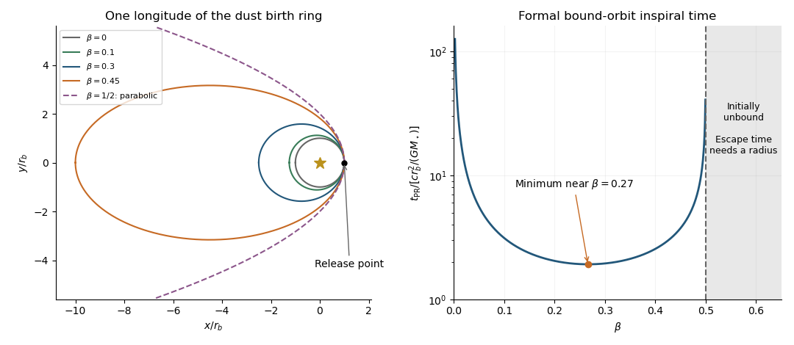

<h1 id="2/vi/solution">Solution</h1>

↑ **Parent:** [Vi](../vi.md)

Assume negligible fragment release speed relative to a circular parent [planetesimal](../../../../../../planetesimal.md). Its initial speed is $v_b=\sqrt{GM_\star/r_b}$, but [radiation pressure](../../../../../../radiation-pressure.md) reduces the grain's gravitational parameter to $(1-\beta)GM_\star$. Its [specific orbital energy](../../../../../../specific-orbital-energy.md) and [specific angular momentum](../../../../../../specific-angular-momentum.md) are

$$
\varepsilon_0=\frac{GM_\star}{r_b}\left(\beta-\frac12\right),\qquad h_0^2=GM_\star r_b.
$$

For $0\leq\beta<1/2$, the resulting [dust orbit released from a circular parent ring](../../../../../../dust-orbit-released-from-a-circular-parent-ring.md) has

$$
\boxed{a_0=\frac{(1-\beta)r_b}{1-2\beta},\qquad e_0=\frac\beta{1-\beta},\qquad q_0=r_b,\qquad Q_0=\frac{r_b}{1-2\beta}.}
$$

Release is at [periapsis](../../../../../../periapsis.md): the inherited tangential speed exceeds the new circular speed. Low-$\beta$ grains remain near the [dust birth ring](../../../../../../dust-birth-ring.md); higher bound $\beta$ gives increasingly eccentric orbits extending well outside it. Uniform release longitude produces an approximately axisymmetric [dust halo](../../../../../../dust-halo.md), with long residence times near [apoapsis](../../../../../../apoapsis.md). At $\beta=1/2$ the conservative release orbit is parabolic; above this [radiation-pressure blowout threshold](../../../../../../radiation-pressure-blowout-threshold.md) it is initially unbound. For $\beta\geq1$, zero or repulsive effective gravity also prevents a bound [ellipse](../../../../../../ellipse.md).

**[Figure 3](#2/vi/image-dust-release-orbits-and-inspiral-time-under-poynting-robertson-drag). Dust release orbits and inspiral time under Poynting–Robertson drag**. Left: representative orbits released at one point on the birth ring, including the parabolic release limit. Right: the formal averaged lifetime of bound grains as a function of the radiation-pressure coefficient.

The left panel shows one release longitude; rotating it around the ring fills the halo. At longer times [Poynting–Robertson drag](../../../../../../poynting-robertson-drag.md) also carries bound grains inward, so an initially outward-spanning release distribution does not imply an empty inner region in a continuously supplied, collision-free population.

## ↑ Ancestors (11)

1. [Vi](../vi.md)
2. [2](../../2.md)
3. [Paper 316](../../../paper-316-split.md)
4. [Iii](../../../split.md)
5. [2018](../../../../split.md)
6. [Past exam of the mathematics course of the University of Cambridge](../../../../../split.md)
7. [Mathematics course of the University of Cambridge](../../../../../../mathematics-course-of-the-university-of-cambridge.md)
8. [Course of the University of Cambridge](../../../../../../course-of-the-university-of-cambridge.md)
9. [University of Cambridge](../../../../../../university-of-cambridge-split.md)
10. [List of universities](../../../../../../list-of-universities.md)
11. [Codex Wiki](../../../../../../split.md)
