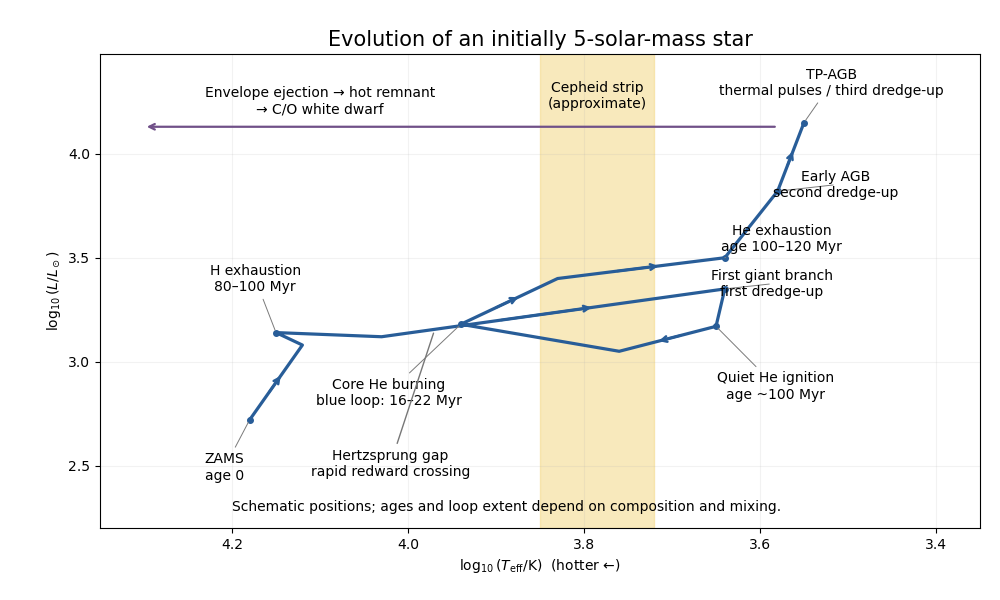
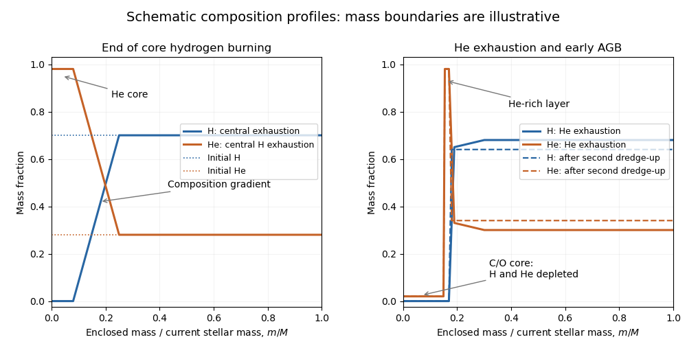

# Paper 317

↑ **Parent:** [Iii](../iii.md)

[https://www.maths.cam.ac.uk/postgrad/part-iii/files/pastpapers/2018/paper_317.pdf](https://www.maths.cam.ac.uk/postgrad/part-iii/files/pastpapers/2018/paper_317.pdf)

**Table of contents**

- [1](#1)
  - [i](#1/i)
    - [Solution](#1/i/solution)
  - [ii](#1/ii)
    - [Solution](#1/ii/solution)
  - [iii](#1/iii)
    - [Solution](#1/iii/solution)
- [2](#2)
  - [i](#2/i)
    - [Solution](#2/i/solution)
  - [ii](#2/ii)
    - [Solution](#2/ii/solution)
  - [iii](#2/iii)
    - [Solution](#2/iii/solution)
  - [iv](#2/iv)
    - [Solution](#2/iv/solution)
- [3](#3)
  - [i](#3/i)
    - [Solution](#3/i/solution)
  - [ii](#3/ii)
    - [Solution](#3/ii/solution)
  - [iii](#3/iii)
    - [Solution](#3/iii/solution)
  - [iv](#3/iv)
    - [Solution](#3/iv/solution)
  - [v](#3/v)
    - [Solution](#3/v/solution)
- [4](#4)
  - [Solution](#4/solution)

## 1

↑ **Parent:** [Paper 317](paper-317.md)

<h3 id="1/i">i</h3>

↑ **Parent:** [1](#1)

<h4 id="1/i/solution">Solution</h4>

↑ **Parent:** [I](#1/i)

Work in an inertial frame centred on the [centre of mass](../../../classical-mechanics.md#center-of-mass), and follow a fixed material mass, with no [stellar wind](../../../stellar-astrophysics.md#stellar-wind) or accretion through its boundary. Assume nonrelativistic motion, Newtonian self-gravity, no external gravitational field, and sufficiently regular integrable fields. Define

$$
I=\int r^2\,dm,\qquad \mathcal T=\frac12\int |\mathbf v|^2\,dm,\qquad
\Omega=-\frac G2\iint\frac{dm\,dm'}{|\mathbf r-\mathbf r'|}=\frac12\int\rho\Phi\,dV.
$$

Here $I$ is the [scalar second mass moment](../../../general-relativity.md#scalar-second-mass-moment), rather than a moment of inertia about one axis. The [kinetic energy](../../../classical-mechanics.md#kinetic-energy) $\mathcal T$ measures resolved internal motions relative to the [centre of mass](../../../classical-mechanics.md#center-of-mass); random microscopic motion contributes to [pressure](../../../thermodynamics.md#pressure) and [internal energy](../../../thermodynamics.md#internal-energy), and must not be counted again in $\mathcal T$.

The paper's symmetric compressive tensor $\mathbb P$ is minus the tensile [stress](../../../continuum-mechanics.md#stress) tensor, so its force per unit volume is $-\partial_jP_{ij}$. Differentiating the material integral twice and substituting the equation of motion gives

$$
\frac12\ddot I=2\mathcal T-\int r_i\partial_jP_{ij}\,dV-\int\mathbf r\cdot\nabla\Phi\,dm.
$$

[Integration by parts](../../../calculus.md#integration-by-parts) and the [divergence theorem](../../../calculus.md#divergence-theorem) turn the stress contribution into

$$
-\int r_i\partial_jP_{ij}\,dV=\int\operatorname{tr}\mathbb P\,dV-\oint r_iP_{ij}n_j\,dS.
$$

For the requested scalar [stellar virial theorem](../../../stellar-structure.md#stellar-virial-theorem), assume isotropic [pressure](../../../thermodynamics.md#pressure), $P_{ij}=P\delta_{ij}$, with uniform surface pressure $P_S$. Then $\operatorname{tr}\mathbb P=3P$ and the surface integral is $P_S\oint\mathbf r\cdot\mathbf n\,dS=3P_SV$. No spherical shape is needed for this step.

Finally, symmetrizing the pair integral for the [Newtonian gravitational potential](../../../classical-mechanics.md#newtonian-gravitational-potential) gives

$$
-\int\mathbf r\cdot\nabla\Phi\,dm
=-\frac G2\iint\frac{(\mathbf r-\mathbf r')\cdot(\mathbf r-\mathbf r')}{|\mathbf r-\mathbf r'|^3}\,dm\,dm'=\Omega.
$$

Therefore

$$
\boxed{\frac12\ddot I=2\mathcal T+3\int P\,dV-3P_SV+\Omega.}
$$

Anisotropic magnetic or viscous stresses retain their full trace and boundary terms; a changing integration mass adds transport terms.

<h3 id="1/ii">ii</h3>

↑ **Parent:** [1](#1)

<h4 id="1/ii/solution">Solution</h4>

↑ **Parent:** [Ii](#1/ii)

For an [ideal gas](../../../thermodynamics.md#ideal-gas) with constant [specific-heat ratio](../../../thermodynamics.md#heat-capacity-ratio) $\gamma$, the specific [internal energy](../../../thermodynamics.md#internal-energy) is $u=c_VT$ and $P=\rho(c_P-c_V)T=(\gamma-1)\rho u$. Hence

$$
\boxed{\int P\,dV=(\gamma-1)U,\qquad U=\int u\,dm.}
$$

The [stellar virial theorem](../../../stellar-structure.md#stellar-virial-theorem) consequently reads $\ddot I/2=2\mathcal T+3(\gamma-1)U-3P_SV+\Omega$. For a static nonrotating star with negligible surface pressure, $\mathcal T=\ddot I=P_S=0$, so $\Omega=-3(\gamma-1)U$.

Fully ionized nonrelativistic ions and electrons form a monatomic [ideal gas](../../../thermodynamics.md#ideal-gas), with $\gamma=5/3$, provided [electron degeneracy pressure](../../../statistical-physics.md#electron-degeneracy-pressure) and [radiation pressure](../../../thermodynamics.md#radiation-pressure) are negligible. Thus

$$
\boxed{\Omega=-2U,\qquad E=U+\Omega=-U=\Omega/2.}
$$

Being steady alone does not eliminate rotation or other macroscopic [kinetic energy](../../../classical-mechanics.md#kinetic-energy); those are additional assumptions needed for this relation.

<h3 id="1/iii">iii</h3>

↑ **Parent:** [1](#1)

<h4 id="1/iii/solution">Solution</h4>

↑ **Parent:** [Iii](#1/iii)

Consider a spherical [stellar polytrope](../../../stellar-structure.md#stellar-polytrope) with $P=K\rho^{1+1/n}$, constant $K$, $0<n<5$, zero surface pressure and finite radius $R$. Its [specific enthalpy](../../../thermodynamics.md#specific-enthalpy), measured from zero density, is $h=\int_0^P dP'/\rho=(n+1)P/\rho$. [Hydrostatic equilibrium](../../../statistical-physics.md#hydrostatic-equilibrium) gives $h+\Phi=\Phi(R)=-GM/R$. Integrating over mass therefore yields

$$
(n+1)\int P\,dV=-\frac{GM^2}{R}-\int\Phi\,dm=-\frac{GM^2}{R}-2\Omega.
$$

The static [stellar virial theorem](../../../stellar-structure.md#stellar-virial-theorem) gives $3\int P\,dV=-\Omega$, and eliminating the pressure integral proves the [gravitational energy of a stellar polytrope](../../../stellar-structure.md#gravitational-energy-of-a-stellar-polytrope):

$$
\boxed{\Omega=-\frac{3}{5-n}\frac{GM^2}{R}.}
$$

For an [ideal gas](../../../thermodynamics.md#ideal-gas) with constant [specific-heat ratio](../../../thermodynamics.md#heat-capacity-ratio), the accompanying [internal energy](../../../thermodynamics.md#internal-energy) is

$$
U=\frac{1}{(5-n)(\gamma-1)}\frac{GM^2}{R}.
$$

To express both energies using $\gamma$ alone one additionally identifies the model as an [adiabatic stellar polytrope](../../../stellar-structure.md#adiabatic-stellar-polytrope), so $n=1/(\gamma-1)$. Then

$$
\boxed{\Omega=-\frac{3(\gamma-1)}{5\gamma-6}\frac{GM^2}{R},\qquad U=\frac{1}{5\gamma-6}\frac{GM^2}{R}.}
$$

For $\gamma=5/3$ these become $\Omega=-6GM^2/(7R)$ and $U=3GM^2/(7R)$. A general [polytropic index](../../../stellar-structure.md#polytropic-index) need not be determined by the thermodynamic [specific-heat ratio](../../../thermodynamics.md#heat-capacity-ratio); without the adiabatic identification both $n$ and $\gamma$ remain.

## 2

↑ **Parent:** [Paper 317](paper-317.md)

<h3 id="2/i">i</h3>

↑ **Parent:** [2](#2)

<h4 id="2/i/solution">Solution</h4>

↑ **Parent:** [I](#2/i)

In the thin [radiative envelope](../../../stellar-structure.md#radiative-envelope), take enclosed mass $m(r)\simeq M$, luminosity $L_r\simeq L$, and constant [mean molecular weight](../../../thermodynamics.md#mean-molecular-weight) $\mu$. Combining [radiative diffusion in a star](../../../stellar-structure.md#radiative-diffusion-in-a-star) with the [hydrostatic pressure support equation](../../../stellar-structure.md#hydrostatic-pressure-support-equation) gives

$$
\nabla_{\rm rad}=\frac{3\kappa PL}{16\pi a_{\rm rad}cGMT^4}.
$$

The [ideal gas](../../../thermodynamics.md#ideal-gas) relation is $\rho=AP/T$, where $A=\mu m_u/k_B$, so the opacity law implies

$$
\boxed{a=n+1,\qquad b=n+s+4,\qquad C=\frac{16\pi a_{\rm rad}cGM}{3\kappa_0A^nL},\qquad \nabla=\frac1C\frac{P^a}{T^b}.}
$$

Here $a_{\rm rad}$ is the [radiation constant](../../../astrophysics.md#radiation-constant), distinct from the exponent $a$. Since $\nabla=(P/T)dT/dP$, separation gives $P^{a-1}dP=CT^{b-1}dT$. With photospheric $T=T_{\rm eff}$, the [power-law opacity radiative envelope](../../../stellar-structure.md#power-law-opacity-radiative-envelope) therefore has

$$
\boxed{P(T)=\left[P_{\rm phot}^{\,a}+\frac{aC}{b}\left(T^b-T_{\rm eff}^{\,b}\right)\right]^{1/a}.}
$$

This expression assumes $a,b\ne0$ and a positive bracket on the physical branch. If $b=0$, replace $(T^b-T_{\rm eff}^b)/b$ by $\log(T/T_{\rm eff})$; if $a=0$, the integrated relation is $\log(P/P_{\rm phot})=C(T^b-T_{\rm eff}^b)/b$, with the same logarithmic limit when $b=0$.

<h3 id="2/ii">ii</h3>

↑ **Parent:** [2](#2)

<h4 id="2/ii/solution">Solution</h4>

↑ **Parent:** [Ii](#2/ii)

At the [photosphere](../../../stellar-structure.md#photosphere), use the stated boundary pressure and the [effective temperature](../../../stellar-structure.md#effective-temperature) relation $L=4\pi R^2\sigma T_{\rm eff}^4$. The [radiation constant](../../../astrophysics.md#radiation-constant) obeys $a_{\rm rad}c=4\sigma$ by the [Stefan–Boltzmann law](../../../thermodynamics.md#stefan-boltzmann-law). Substitution into the [radiative temperature gradient](../../../exoplanet.md#radiative-temperature-gradient) gives

$$
\nabla_{\rm phot}=\frac{3\kappa_{\rm phot}L}{16\pi a_{\rm rad}cGM T_{\rm eff}^4}\frac{2GM}{3\kappa_{\rm phot}R^2}
=\frac{2\sigma}{4a_{\rm rad}c}=\boxed{\frac18}.
$$

This uses the approximate [stellar surface boundary condition](../../../stellar-structure.md#stellar-surface-boundary-condition) at optical depth $2/3$; it is not a universal photospheric gradient for arbitrary atmospheres.

<h3 id="2/iii">iii</h3>

↑ **Parent:** [2](#2)

<h4 id="2/iii/solution">Solution</h4>

↑ **Parent:** [Iii](#2/iii)

For [negative hydrogen ion opacity](../../../stellar-structure.md#negative-hydrogen-ion-opacity), $n=1/2$ and $s=-9$, so the exponents of the [power-law opacity radiative envelope](../../../stellar-structure.md#power-law-opacity-radiative-envelope) are $a=3/2$ and $b=-9/2$. Dividing the integrated pressure relation by $CT^b$ gives

$$
\nabla=\frac ab+\left(\nabla_{\rm phot}-\frac ab\right)\left(\frac{T_{\rm eff}}T\right)^b.
$$

Since $a/b=-1/3$ and $\nabla_{\rm phot}=1/8$,

$$
\boxed{\nabla(r)=-\frac13+\frac{11}{24}\left(\frac{T_{\rm eff}}{T(r)}\right)^{-9/2}.}
$$

It starts below the monatomic [adiabatic temperature gradient](../../../exoplanet.md#adiabatic-temperature-gradient) and rises as the [temperature](../../../thermodynamics.md#temperature) increases inward.

<h3 id="2/iv">iv</h3>

↑ **Parent:** [2](#2)

<h4 id="2/iv/solution">Solution</h4>

↑ **Parent:** [Iv](#2/iv)

For a monatomic [ideal gas](../../../thermodynamics.md#ideal-gas) of fixed composition, the [adiabatic temperature gradient](../../../exoplanet.md#adiabatic-temperature-gradient) is $\nabla_{\rm ad}=2/5$. The [Schwarzschild criterion](../../../stellar-structure.md#schwarzschild-criterion) places the onset of [convection](../../../fluid-mechanics.md#convection) at

$$
-\frac13+\frac{11}{24}\left(\frac T{T_{\rm eff}}\right)^{9/2}=\frac25,
\qquad
\boxed{\frac{T_{\rm eff}}T=\left(\frac58\right)^{2/9}\simeq0.901.}
$$

Thus $T\simeq1.11T_{\rm eff}$. The integrated [power-law opacity radiative envelope](../../../stellar-structure.md#power-law-opacity-radiative-envelope) also gives $P/P_{\rm phot}=2^{2/3}\simeq1.59$ there: the radiative layer spans only a small pressure range below the [photosphere](../../../stellar-structure.md#photosphere). Its geometrical depth is of order $H_P\log(1.59)$, with $H_P$ a representative [pressure scale height](../../../statistical-physics.md#pressure-scale-height), and is small compared with the stellar radius in the assumed thin envelope.

The steep increase of [negative hydrogen ion opacity](../../../stellar-structure.md#negative-hydrogen-ion-opacity) with [temperature](../../../thermodynamics.md#temperature) rapidly increases the [radiative temperature gradient](../../../exoplanet.md#radiative-temperature-gradient), so radiation alone soon fails to transport the flux stably. Beyond that point the radiative profile must be replaced by a [convective envelope](../../../stellar-structure.md#convective-envelope). Partial [ionization](../../../physics.md#ionization) can lower the actual [adiabatic temperature gradient](../../../exoplanet.md#adiabatic-temperature-gradient) and shift onset; the numerical ratio here uses the fixed-$\gamma$ monatomic approximation.

## 3

↑ **Parent:** [Paper 317](paper-317.md)

<h3 id="3/i">i</h3>

↑ **Parent:** [3](#3)

<h4 id="3/i/solution">Solution</h4>

↑ **Parent:** [I](#3/i)

The outward [radiative flux](../../../astrophysics.md#radiative-flux) is $F=L/(4\pi r^2)$. A [photon](../../../quantum-mechanics.md#photon) of energy $E$ carries [momentum](../../../classical-mechanics.md#momentum) $E/c$, so the momentum transferred per unit volume and time to matter is $\kappa\rho F/c$, when $\kappa$ is the appropriate transport opacity. Momentum conservation makes the radiation stress decrease outward by this amount. In the thin atmosphere, where the radiation stress is treated by its scalar [radiation pressure](../../../thermodynamics.md#radiation-pressure),

$$
\boxed{\frac{dP_{\rm rad}}{dr}=-\frac{\kappa\rho F}{c}=-\frac{\kappa\rho L}{4\pi r^2c}.}
$$

This is the first moment of the [radiative transfer equation](../../../astrophysics.md#radiative-transfer-equation). The [grey atmosphere](../../../astrophysics.md#grey-atmosphere) approximation uses a frequency-independent transport opacity; in an optically thick diffusion regime it becomes the [Rosseland mean opacity](../../../astrophysics.md#rosseland-mean-opacity). Near the surface the [plane-parallel atmosphere](../../../astrophysics.md#plane-parallel-atmosphere) approximation removes geometric stress-divergence corrections.

<h3 id="3/ii">ii</h3>

↑ **Parent:** [3](#3)

<h4 id="3/ii/solution">Solution</h4>

↑ **Parent:** [Ii](#3/ii)

Measure [optical depth](../../../astrophysics.md#optical-depth) inward, so $d\tau/dr=-\kappa\rho$ and $\tau=0$ at the exterior boundary. The printed integral is shorthand with inconsistent integration labels; this differential definition fixes its meaning. In a [plane-parallel atmosphere](../../../astrophysics.md#plane-parallel-atmosphere) in radiative equilibrium, $F=\sigma T_{\rm eff}^4$ is constant and $dP_{\rm rad}/d\tau=F/c$.

For the [Eddington surface boundary condition](../../../astrophysics.md#eddington-surface-boundary-condition), approximate the outgoing frequency-integrated intensity by a constant $I_0$ over the outward hemisphere, with no incoming radiation. The angular moments at the surface are

$$
F=2\pi I_0\int_0^1\mu\,d\mu=\pi I_0,\qquad P_{\rm rad}(0)=\frac{2\pi I_0}{c}\int_0^1\mu^2\,d\mu=\boxed{\frac{2F}{3c}}.
$$

Integrating the moment equation then gives $P_{\rm rad}=F(\tau+2/3)/c$. The [Eddington closure approximation](../../../astrophysics.md#eddington-closure-approximation), with [local thermodynamic equilibrium](../../../astrophysics.md#local-thermodynamic-equilibrium) and radiative equilibrium, identifies the radiation energy density with $a_{\rm rad}T^4$ and sets $P_{\rm rad}=a_{\rm rad}T^4/3$. Using $a_{\rm rad}c=4\sigma$ gives

$$
\boxed{T^4(\tau)=\frac34T_{\rm eff}^4\left(\tau+\frac23\right)=\frac12T_{\rm eff}^4\left(1+\frac32\tau\right).}
$$

The [photosphere](../../../stellar-structure.md#photosphere) is represented by $\tau=2/3$, where $T=T_{\rm eff}$; the exterior boundary instead has $T(0)=2^{-1/4}T_{\rm eff}$. The closure and angular boundary condition are approximations, rather than exact isotropy of radiation at the surface.

<h3 id="3/iii">iii</h3>

↑ **Parent:** [3](#3)

<h4 id="3/iii/solution">Solution</h4>

↑ **Parent:** [Iii](#3/iii)

Taking the [logarithmic derivative](../../../analytic-number-theory.md#logarithmic-derivative) of the [grey atmosphere](../../../astrophysics.md#grey-atmosphere) temperature law, $4\log T=\log(\tau+2/3)+\text{constant}$, gives

$$
\boxed{\frac{d\log T}{d\tau}=\frac{1}{4(\tau+2/3)}=\frac{3}{8+12\tau}.}
$$

<h3 id="3/iv">iv</h3>

↑ **Parent:** [3](#3)

<h4 id="3/iv/solution">Solution</h4>

↑ **Parent:** [Iv](#3/iv)

Take the [gas pressure](../../../thermodynamics.md#gas-pressure) $P$ to vanish at the exterior boundary and the atmosphere to be thin enough that [surface gravity of a star](../../../stellar-structure.md#surface-gravity-of-a-star) is constant. With constant [electron-scattering opacity](../../../stellar-structure.md#electron-scattering-opacity), negligible radiative acceleration, and [hydrostatic equilibrium in optical depth](../../../stellar-structure.md#hydrostatic-equilibrium-in-optical-depth),

$$
\frac{dP}{d\tau}=\frac g\kappa,\qquad P=\frac g\kappa\tau,\qquad \boxed{\frac{d\log P}{d\tau}=\frac1\tau}.
$$

If the radiative force is retained, $dP/dr=-\rho(g-\kappa F/c)$ for [gas pressure](../../../thermodynamics.md#gas-pressure), and the same result holds with the constant positive effective gravity $g_{\rm eff}=g-\kappa F/c$. A nonzero exterior gas pressure instead gives $d\log P/d\tau=1/(\tau+\kappa P(0)/g_{\rm eff})$. Total gas-plus-radiation pressure has the nonzero radiative surface term from part (ii), so the advertised exact $1/\tau$ formula presumes gas pressure with zero exterior gas pressure.

<h3 id="3/v">v</h3>

↑ **Parent:** [3](#3)

<h4 id="3/v/solution">Solution</h4>

↑ **Parent:** [V](#3/v)

The [stellar adiabatic exponent](../../../stellar-structure.md#stellar-adiabatic-exponent) $\Gamma_2$ is defined at fixed [specific entropy](../../../thermodynamics.md#specific-entropy) and composition by

$$
\boxed{\frac{\Gamma_2}{\Gamma_2-1}=\left(\frac{\partial\log P}{\partial\log T}\right)_s,\qquad \nabla_{\rm ad}=\frac{\Gamma_2-1}{\Gamma_2}.}
$$

Combining parts (iii) and (iv), the [radiative temperature gradient](../../../exoplanet.md#radiative-temperature-gradient) of the constant-opacity [grey atmosphere](../../../astrophysics.md#grey-atmosphere) is

$$
\nabla_{\rm rad}=\frac{d\log T/d\tau}{d\log P/d\tau}=\frac{3\tau}{8+12\tau}\longrightarrow\frac14.
$$

For $1<\Gamma_2<4/3$, the [adiabatic temperature gradient](../../../exoplanet.md#adiabatic-temperature-gradient) is strictly below $1/4$, and the [Schwarzschild criterion](../../../stellar-structure.md#schwarzschild-criterion) is eventually violated. If $\Gamma_2$ is constant, solving for the crossing gives

$$
\boxed{\tau>\frac{8(\Gamma_2-1)}{12-9\Gamma_2}\quad\Longrightarrow\quad\text{convective instability}.}
$$

At $\Gamma_2=4/3$ the radiative gradient approaches marginality from below, so there is no finite crossing in this model. If $\Gamma_2$ varies, the conclusion requires its subcritical value to persist in the deep layers. Uniform composition is needed for this use of the [Schwarzschild criterion](../../../stellar-structure.md#schwarzschild-criterion); a composition gradient requires the [Ledoux criterion](../../../stellar-structure.md#ledoux-criterion).

## 4

↑ **Parent:** [Paper 317](paper-317.md)

<h3 id="4/solution">Solution</h3>

↑ **Parent:** [4](#4)

Assume an isolated star of initial mass five [solar masses](../../../stellar-astrophysics.md#solar-mass) of approximately solar [stellar metallicity](../../../galaxy.md#stellar-metallicity). Rotation, [convective overshooting](../../../fluid-mechanics.md#convective-overshoot) and mass loss change numerical ages and the extent of a [blue loop](../../../stellar-astrophysics.md#blue-loop), so the ages below are estimates. Take zero age at the [zero-age main sequence](../../../stellar-astrophysics.md#zero-age-main-sequence); the [pre-main-sequence star](../../../stellar-astrophysics.md#pre-main-sequence-star) phase adds a much shorter contraction time.

The original schematic [Hertzsprung-Russell diagram](../../../stellar-astrophysics.md#hertzsprung-russell-diagram) marks the stages discussed below. The strip denotes the approximate [Cepheid instability strip](../../../stellar-astrophysics.md#cepheid-instability-strip); the track is illustrative, rather than a computed stellar model.

**[Figure 1](#4/image-schematic-stellar-evolution-of-an-initially-five-solar-mass-star). Schematic stellar evolution of an initially five-solar-mass star**.

The [main sequence](../../../stellar-astrophysics.md#main-sequence) lasts roughly $8\times10^7$–$10^8$ years. [CNO cycle](../../../stellar-astrophysics.md#cno-cycle) [hydrogen burning](../../../stellar-astrophysics.md#hydrogen-burning) is concentrated in a mixed [convective core](../../../stellar-structure.md#convective-core). Its declining [hydrogen mass fraction](../../../stellar-astrophysics.md#hydrogen-mass-fraction) and rising [helium mass fraction](../../../stellar-astrophysics.md#helium-mass-fraction) are nearly uniform there, while the retreating core leaves a composition gradient. The unprocessed envelope remains [hydrogen](../../../chemistry.md#hydrogen) rich. At the [terminal-age main sequence](../../../stellar-astrophysics.md#terminal-age-main-sequence), core [hydrogen](../../../chemistry.md#hydrogen) is exhausted and a [hydrogen-burning shell](../../../stellar-astrophysics.md#hydrogen-burning-shell) takes over.

The inert helium core grows through shell burning. The [Schönberg-Chandrasekhar limit](../../../stellar-astrophysics.md#schonberg-chandrasekhar-limit) is approximately

$$
q_{\rm SC}\simeq0.37\left(\frac{\mu_{\rm env}}{\mu_{\rm core}}\right)^2\sim0.08\text{--}0.1.
$$

Beyond this limit an isothermal nondegenerate core cannot remain in thermal equilibrium with its envelope. Core contraction and envelope expansion carry the star across the [Hertzsprung gap](../../../stellar-astrophysics.md#hertzsprung-gap). An initial slower shell-burning interval can precede the rapid crossing; the crossing itself is governed by [Kelvin-Helmholtz contraction](../../../stellar-astrophysics.md#kelvin-helmholtz-mechanism), with a representative $GM^2/(RL)\sim10^5$–$10^6$ years. [First dredge-up](../../../stellar-astrophysics.md#first-dredge-up) then mixes hydrogen-processed material into the [convective envelope](../../../stellar-structure.md#convective-envelope), lowering its [hydrogen mass fraction](../../../stellar-astrophysics.md#hydrogen-mass-fraction) and increasing [helium](../../../chemistry.md#helium) and [nitrogen](../../../chemistry.md#nitrogen), while leaving a composition discontinuity where the envelope later retreats.

At an age still of order $10^8$ years, [core helium burning](../../../stellar-astrophysics.md#core-helium-burning) begins quietly: the core is nondegenerate, so there is no [helium flash](../../../stellar-astrophysics.md#helium-flash). The [Triple-alpha process](../../../stellar-astrophysics.md#triple-alpha-process) and subsequent alpha capture build a [carbon-oxygen core](../../../stellar-astrophysics.md#carbon-oxygen-core). Core helium burning lasts roughly $1.6\times10^7$–$2.2\times10^7$ years in representative solar-composition models. [Pols's stellar-evolution notes](https://www.astro.ru.nl/~onnop/education/stev_utrecht_notes/chapter9-11.pdf) illustrate the substantial dependence of these lifetimes on [convective overshooting](../../../fluid-mechanics.md#convective-overshoot).

During a [blue loop](../../../stellar-astrophysics.md#blue-loop) the envelope contracts and [effective temperature](../../../stellar-structure.md#effective-temperature) increases, before the star returns redward. The loop depends on core and envelope structure and the hydrogen discontinuity left by [first dredge-up](../../../stellar-astrophysics.md#first-dredge-up). A loop reaching the [Cepheid instability strip](../../../stellar-astrophysics.md#cepheid-instability-strip) produces two further crossings, blueward and redward, in addition to the earlier rapid crossing of the [Hertzsprung gap](../../../stellar-astrophysics.md#hertzsprung-gap). [Cepheid variables](../../../stellar-astrophysics.md#cepheid-variable) pulsate through the [opacity mechanism](../../../stellar-astrophysics.md#kappa-mechanism), involving [helium](../../../chemistry.md#helium) [ionization](../../../physics.md#ionization). Neither loop extent nor all three strip crossings are guaranteed for every composition or mixing prescription. The [hydrogen-burning shell](../../../stellar-astrophysics.md#hydrogen-burning-shell) continues moving outward in enclosed mass while central [helium](../../../chemistry.md#helium) is depleted. [Lattanzio's five-solar-mass tutorial](https://users.monash.edu.au/~johnl/StellarEvolnV1/m5z02evoln.html) shows these composition changes.

After helium exhaustion, at an age roughly $1.0\times10^8$–$1.2\times10^8$ years, the star ascends the [Asymptotic giant branch](../../../stellar-astrophysics.md#asymptotic-giant-branch). An inert [carbon-oxygen core](../../../stellar-astrophysics.md#carbon-oxygen-core) is surrounded by [helium](../../../chemistry.md#helium)-rich material and a [hydrogen](../../../chemistry.md#hydrogen)-rich envelope. [Second dredge-up](../../../stellar-astrophysics.md#second-dredge-up) mixes [helium](../../../chemistry.md#helium) and [hydrogen burning](../../../stellar-astrophysics.md#hydrogen-burning) products into the envelope and reduces the hydrogen-exhausted core mass. Subsequently a [helium-burning shell](../../../stellar-astrophysics.md#helium-burning-shell) and [hydrogen-burning shell](../../../stellar-astrophysics.md#hydrogen-burning-shell) alternate in importance. A [thermal pulse of an asymptotic-giant-branch star](../../../stellar-astrophysics.md#thermal-pulse-of-an-asymptotic-giant-branch-star) causes intershell convection, expansion and temporary quenching of [hydrogen burning](../../../stellar-astrophysics.md#hydrogen-burning); [third dredge-up](../../../stellar-astrophysics.md#third-dredge-up) can carry [carbon](../../../chemistry.md#carbon) and [slow neutron-capture process](../../../stellar-astrophysics.md#s-process) products outward. Between pulses [hydrogen burning](../../../stellar-astrophysics.md#hydrogen-burning) rebuilds the [helium](../../../chemistry.md#helium) layer. These mechanisms are illustrated in [Lattanzio's AGB tutorial](https://users.monash.edu.au/~johnl/StellarEvolnV1/AGBevoln.html).

The following original [stellar composition profile](../../../stellar-structure.md#stellar-composition-profile) sketches distinguish hydrogen exhaustion from helium exhaustion; their mass boundaries are illustrative.

**[Figure 2](#4/image-schematic-internal-composition-profiles-during-stellar-evolution). Schematic internal composition profiles during stellar evolution**.

The final giant phases add at most a few million years at this level of accuracy. Strong [stellar winds](../../../stellar-astrophysics.md#stellar-wind) remove the envelope; the hot remnant can illuminate a [planetary nebula](../../../stellar-astrophysics.md#planetary-nebula) and then cool as a [carbon-oxygen white dwarf](../../../stellar-astrophysics.md#carbon-oxygen-white-dwarf). A typical remnant is of order one [solar mass](../../../stellar-astrophysics.md#solar-mass). The ordinary isolated $5M_\odot$ case does not reach sustained [carbon burning](../../../stellar-astrophysics.md#carbon-burning) and core collapse. Thus **the usual endpoint is a carbon-oxygen white dwarf**, at a total age of order $10^8$ years, with its subsequent cooling age added separately.

## ↑ Ancestors (8)

1. [Iii](../iii.md)
2. [2018](../../2018.md)
3. [Past exam of the mathematics course of the University of Cambridge](../../../past-exam-of-the-mathematics-course-of-the-university-of-cambridge.md)
4. [Mathematics course of the University of Cambridge](../../../university-of-cambridge.md#mathematics-course-of-the-university-of-cambridge)
5. [Course of the University of Cambridge](../../../university-of-cambridge.md#course-of-the-university-of-cambridge)
6. [University of Cambridge](../../../university-of-cambridge.md)
7. [List of universities](../../../README.md#list-of-universities)
8. [Codex Wiki](../../../README.md)
