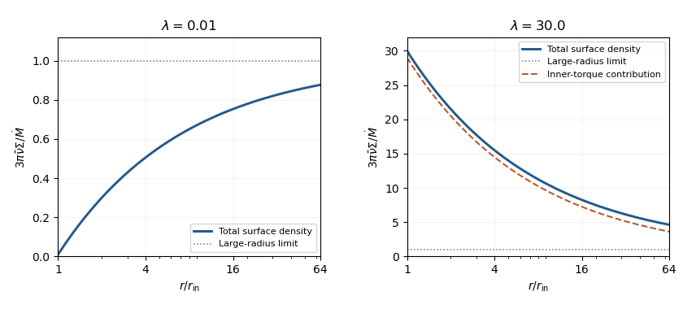

<h1 id="1/e/solution">Solution</h1>

↑ **Parent:** [E](../e.md)

Use $\dot M>0$ for inward [mass accretion rate](../../../../../../mass-accretion-rate.md), and $T_m>0$ for [magnetic torque](../../../../../../surface-magnetic-torque-on-an-accretion-disk.md) adding [angular momentum](../../../../../../angular-momentum.md) to the disk. Combining the [continuity equation](../../../../../../continuity-equation.md) with [conservation of angular momentum](../../../../../../conservation-of-angular-momentum.md) identifies the inward mass flux as $(dh/dr)^{-1}d\mathcal G/dr$. In a steady [Keplerian accretion disk](../../../../../../keplerian-accretion-disk.md), this is the supplied constant $\dot M$, so

$$
\frac{d\mathcal G}{dr}=\dot M\frac{dh}{dr},\qquad
\mathcal G(r)=T_m+\dot M(h-h_{\rm in}),\qquad h=\sqrt{GMr}.
$$

The [boundary condition](../../../../../../boundary-condition.md) is $\mathcal G(r_{\rm in})=T_m$. Since $d\Omega/dr=-3\Omega/(2r)$, the [viscous torque in an accretion disk](../../../../../../viscous-torque-in-an-accretion-disk.md) is $\mathcal G=3\pi\bar\nu\Sigma h$. Hence the [steady Keplerian accretion disk with an inner torque](../../../../../../steady-keplerian-accretion-disk-with-an-inner-torque.md) has

$$
\boxed{\Sigma(r)=\frac{\dot M}{3\pi\bar\nu}\left[1+(\lambda-1)\left(\frac{r_{\rm in}}r\right)^{1/2}\right],\qquad
\lambda=\frac{T_m}{\dot M h_{\rm in}}.}
$$

In particular, $\Sigma(r_{\rm in})=\lambda\dot M/(3\pi\bar\nu)$. For a physical steady solution with this [boundary condition](../../../../../../boundary-condition.md), $\lambda\geq0$.

For $0\leq\lambda\ll1$, the [surface density of a disk](../../../../../../surface-density-of-a-disk.md) rises from a small inner value toward $\dot M/(3\pi\bar\nu)$: this is the usual [Keplerian accretion disk](../../../../../../keplerian-accretion-disk.md) with an approximately [zero-torque inner boundary condition](../../../../../../zero-torque-inner-boundary-condition.md). For $\lambda\gg1$, the inner [surface density of a disk](../../../../../../surface-density-of-a-disk.md) is large and decreases approximately as $r^{-1/2}$, giving a [torque-dominated accretion disk](../../../../../../torque-dominated-accretion-disk.md). This approximation applies where $r/r_{\rm in}\ll(\lambda-1)^2$; sufficiently far out, any fixed finite $\lambda$ again approaches the same constant asymptote.

**[Figure 1](#1/e/image-steady-surface-density-profiles-with-weak-and-strong-inner-torques). Steady surface-density profiles with weak and strong inner torques**.

The constant net inward [angular-momentum flux](../../../../../../angular-momentum-flux.md) is

$$
\dot M h-\mathcal G=\dot M h_{\rm in}(1-\lambda).
$$

For $\lambda>1$, net [angular momentum](../../../../../../angular-momentum.md) moves outward. The strong-torque profile is therefore [decretion disk](../../../../../../decretion-disk.md)-like in its stress-dominated structure, but the specified mass flux remains inward: a genuine net [decretion disk](../../../../../../decretion-disk.md) requires an outward mass flux, not merely large $\lambda$.

At $r_{\rm in}=r_m$, the [Maxwell stress tensor](../../../../../../maxwell-stress-tensor.md) estimate gives

$$
T_m\sim\frac{\epsilon\mu^2}{4\pi r_m^3},\qquad
\lambda\sim\frac{\epsilon\mu^2}{4\pi\dot M\sqrt{GM}\,r_m^{7/2}}.
$$

Using the [magnetospheric truncation radius](../../../../../../magnetospheric-truncation-radius.md) scaling in part (b), all dimensional parameters cancel:

$$
\boxed{\lambda\sim1\quad\text{up to geometric numerical factors}.}
$$

If the displayed $4\pi$ is retained and the scaling radius is assigned unit coefficient, the estimate is $1/(4\pi)$; retaining $\Sigma\simeq2H\rho$ and exact [free-fall speed](../../../../../../free-fall-speed.md) throughout gives $\sqrt2/(4\pi)$. Those prefactors are not controlled by the scaling argument. In particular, it does not generate a parametrically large $\lambda\gg1$.

## ↑ Ancestors (11)

1. [E](../e.md)
2. [1](../../1.md)
3. [Paper 321](../../../paper-321-split.md)
4. [Iii](../../../split.md)
5. [2018](../../../../split.md)
6. [Past exam of the mathematics course of the University of Cambridge](../../../../../split.md)
7. [Mathematics course of the University of Cambridge](../../../../../../mathematics-course-of-the-university-of-cambridge.md)
8. [Course of the University of Cambridge](../../../../../../course-of-the-university-of-cambridge.md)
9. [University of Cambridge](../../../../../../university-of-cambridge-split.md)
10. [List of universities](../../../../../../list-of-universities.md)
11. [Codex Wiki](../../../../../../split.md)
