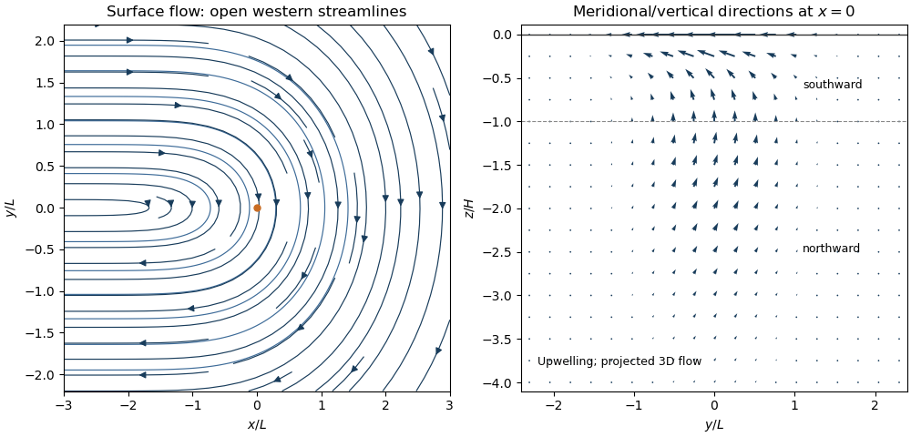

<h1 id="2/solution">Solution</h1>

↑ **Parent:** [2](../2.md)

Adopt the [Boussinesq approximation](../../../../../boussinesq-approximation.md), [hydrostatic approximation](../../../../../hydrostatic-approximation.md), [traditional approximation](../../../../../traditional-approximation-geophysical-fluid-dynamics.md), and inviscid [quasi-geostrophic approximation](../../../../../quasi-geostrophic-approximation.md). Assume stable constant $N_0^2>0$, nonzero [Coriolis parameter](../../../../../coriolis-parameter.md) $f_0$, a [beta plane](../../../../../beta-plane.md), small [Rossby number](../../../../../rossby-number.md), $\beta L/|f_0|$ of that small order, and small displacement of the background stratification. Vertical advection of the buoyancy perturbation is then higher order. Define the [quasi-geostrophic streamfunction](../../../../../quasi-geostrophic-streamfunction.md) by

$$
(u_g,v_g)=(-\psi_y,\psi_x),\qquad b'=f_0\psi_z,\qquad D_g=\partial_t+J(\psi,\cdot),\qquad J(a,b)=a_xb_y-a_yb_x.
$$

The [buoyancy](../../../../../buoyancy.md) and vertical [vorticity](../../../../../vorticity.md) equations at the retained order are

$$
f_0D_g\psi_z+N_0^2w=R,\qquad D_g\nabla_h^2\psi+\beta\psi_x=f_0w_z.
$$

Differentiate the first in $z$. Since $J(\psi_z,\psi_z)=0$, its material-derivative term becomes $f_0D_g\psi_{zz}$. Elimination of $w_z$ gives [diabatically forced quasi-geostrophic potential vorticity](../../../../../diabatically-forced-quasi-geostrophic-potential-vorticity.md):

$$
\boxed{D_gq=\frac{f_0}{N_0^2}R_z,\qquad q=\nabla_h^2\psi+\frac{f_0^2}{N_0^2}\psi_{zz}+\beta y.}
$$

Thus it is the height gradient of heating, rather than heating alone, that produces [potential vorticity](../../../../../potential-vorticity.md) at this order.

For the steady response linearized about rest, assume $\beta\ne0$. The [quasi-geostrophic potential-vorticity equation](../../../../../quasi-geostrophic-potential-vorticity-equation.md) reduces to $\beta\psi_x=f_0R_z/N_0^2$. Choosing the horizontally uniform pressure gauge so that $\psi\to0$ in the east gives the [steady quasi-geostrophic response to localized heating](../../../../../steady-quasi-geostrophic-response-to-localized-heating.md)

$$
\psi=-\frac{f_0}{\beta N_0^2}\int_x^\infty R_z(X,y,z)\,dX.
$$

Set

$$
I(x)=\int_x^\infty e^{-X^2/L^2}\,dX=\frac{\sqrt\pi L}{2}\operatorname{erfc}(x/L),\qquad F(z)=(1+z/H)e^{z/H},\qquad K=\frac{f_0R_0}{\beta N_0^2H}.
$$

Using the [error function](../../../../../error-function.md) to integrate the [Gaussian function](../../../../../gaussian-function.md) gives

$$
\boxed{\psi=KF(z)e^{-y^2/L^2}I(x),\qquad u_g=\frac{2y}{L^2}\psi,\qquad v_g=-KF(z)e^{-(x^2+y^2)/L^2}.}
$$

These velocities vanish as $x\to+\infty$. A depth-dependent but horizontally uniform addition to $\psi$ is dynamically irrelevant for the requested horizontal velocity. At $z=0$, [streamlines](../../../../../streamline.md) are contours of $e^{-y^2/L^2}I(x)$. For $f_0,\beta,R_0>0$, flow approaches the heating region from the west on its northern side, turns southward, and returns westward on its southern side. The contours are open, not closed gyres: $I$ tends to a nonzero constant in the west.

For $-H<z<0$, $R_z<0$ and the forcing decreases [potential vorticity](../../../../../potential-vorticity.md); steady balance requires $\beta v_g=f_0R_z/N_0^2<0$, giving southward flow. Below $z=-H$, $R_z>0$ and the meridional flow reverses. A constant heating rate independent of $z$ would have no such interior [potential vorticity](../../../../../potential-vorticity.md) source.

For the nonlinear diagnostic [quasi-geostrophic omega equation](../../../../../quasi-geostrophic-omega-equation.md), write $\zeta=\nabla_h^2\psi$. Apply $\nabla_h^2$ to buoyancy evolution and $f_0\partial_z$ to vorticity evolution:

$$
f_0\nabla_h^2\psi_{zt}+f_0\nabla_h^2J(\psi,\psi_z)+N_0^2\nabla_h^2w=\nabla_h^2R,
$$

$$
f_0\nabla_h^2\psi_{zt}+f_0\partial_zJ(\psi,\zeta)+f_0\beta\psi_{xz}=f_0^2w_{zz}.
$$

Subtracting eliminates the pressure tendency and yields

$$
\boxed{N_0^2\nabla_h^2w+f_0^2w_{zz}=\nabla_h^2R+f_0\beta\psi_{xz}+f_0\left[\partial_zJ(\psi,\zeta)-\nabla_h^2J(\psi,\psi_z)\right].}
$$

The beta term is linear and must remain when the nonlinear terms are neglected. For the steady weak-forcing solution, $f_0\beta\psi_{xz}=f_0^2R_{zz}/N_0^2$, so

$$
\boxed{w=\frac{R}{N_0^2}=\frac{-R_0z}{N_0^2H}e^{-(x^2+y^2)/L^2+z/H}.}
$$

This also follows immediately from the steady linear buoyancy equation. It satisfies $w=0$ at $z=0$, decay at depth and horizontal infinity, and the linear [quasi-geostrophic omega equation](../../../../../quasi-geostrophic-omega-equation.md); with these homogeneous conditions the elliptic problem has no extra decaying homogeneous solution. The rigid-lid interpretation is an additional boundary approximation for this diagnostic response.

At $x=0$, the displayed $v_g$ and $w$ provide the requested meridional/vertical arrows. For positive heating there is upwelling concentrated near $y=0$, maximal in depth at $z=-H$, with northward flow below that depth and southward flow above. The vertical circulation tends to zero far from the forcing. A western zonal wake persists, but its meridional and vertical components vanish as $x\to-\infty$. Horizontal [ageostrophic flow](../../../../../ageostrophic-flow.md) supplies the divergence associated with the upwelling; the projected $(v_g,w)$ slice is not itself a two-dimensional incompressible flow and need not have closed streamlines.

**[Figure 1](#2/image-thermally-driven-circulation-and-its-boundary-layers). Thermally driven circulation and its boundary layers**. Left: surface streamlines and velocity direction for positive $f_0,\beta,R_0$. Right: meridional and vertical arrows at $x=0$, with components separately scaled to show direction; dashed line marks the reversal depth $z=-H$. The vertical slice is a projection of three-dimensional flow.

The steady calculation fixes an interior circulation, not its attainability from every possible initial and boundary state. For example, a rigid lid with initially uniform boundary buoyancy conserves that buoyancy at linear order because $R(0)=w(0)=0$. The formal steady profile instead generally has nonuniform $b'(0)=f_0\psi_z(0)$. Such additional initial boundary data require a time-dependent adjustment and cannot simply be imposed on this particular steady solution. No boundary buoyancy data are supplied for the requested steady problem.

## ↑ Ancestors (10)

1. [2](../2.md)
2. [Paper 333](../../paper-333-split.md)
3. [Iii](../../split.md)
4. [2018](../../../split.md)
5. [Past exam of the mathematics course of the University of Cambridge](../../../../split.md)
6. [Mathematics course of the University of Cambridge](../../../../../mathematics-course-of-the-university-of-cambridge.md)
7. [Course of the University of Cambridge](../../../../../course-of-the-university-of-cambridge.md)
8. [University of Cambridge](../../../../../university-of-cambridge-split.md)
9. [List of universities](../../../../../list-of-universities.md)
10. [Codex Wiki](../../../../../split.md)
