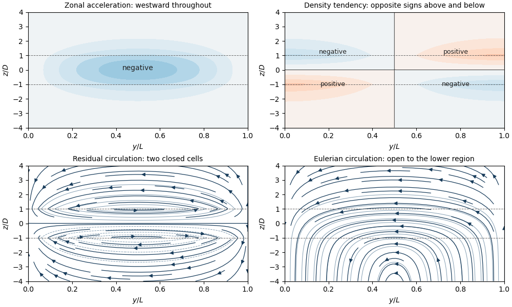

<h1 id="4/i/solution">Solution</h1>

↑ **Parent:** [I](../i.md)

Use the corrected PDF continuity equation $\overline v_{a,y}+\overline w_{a,z}=0$. Set $S=d\rho_s/dz=-\rho_0N^2/g<0$, $M=\overline{u'v'}$, and $B=\overline{\rho'v'}/S$. The [transformed Eulerian mean](../../../../../../transformed-eulerian-mean.md) replaces the [Eulerian mean](../../../../../../eulerian-mean-flow.md) meridional circulation by

$$
\boxed{\overline v_a^*=\overline v_a-B_z,\qquad\overline w_a^*=\overline w_a+B_y.}
$$

These substitutions preserve nondivergence, while density evolution becomes $\overline\rho_t+S\overline w_a^*=0$. Substituting $\overline v_a=\overline v_a^*+B_z$ into the momentum equation gives

$$
\boxed{\overline u_t-f_0\overline v_a^*=\nabla_{y,z}\cdot\mathbf F,\qquad \mathbf F=(-M,f_0B),\qquad\overline\rho_t+S\overline w_a^*=0,\qquad\overline v_{a,y}^*+\overline w_{a,z}^*=0.}
$$

The [geostrophic balance](../../../../../../geostrophic-balance.md) and [hydrostatic approximation](../../../../../../hydrostatic-approximation.md) retain their original form. The vector $\mathbf F$ is the [Eliassen–Palm flux](../../../../../../eliassen-palm-flux.md). It gathers both eddy stresses into one mean-flow forcing rather than treating the eddy density flux as direct heating of the mean density.

For small-amplitude [Rossby waves](../../../../../../rossby-wave.md), the [quasi-geostrophic wave-activity conservation law](../../../../../../quasi-geostrophic-wave-activity-conservation-law.md) has the form $\mathcal A_t+\nabla\cdot\mathbf F=\mathcal D$, with the consistent signed [wave activity](../../../../../../wave-activity.md) convention and $\mathcal D$ representing sources or dissipation. Locally for a slowly varying wave packet, its [Eliassen–Palm flux](../../../../../../eliassen-palm-flux.md) follows the [group velocity](../../../../../../group-velocity.md) multiplied by the signed wave-activity density. In particular, a wave can have westward phase propagation and upward wave-activity transport. Flux convergence during dissipation transfers wave momentum to the mean flow.

The [non-acceleration theorem for quasi-geostrophic waves](../../../../../../non-acceleration-theorem-for-quasi-geostrophic-waves.md) states that steady conservative waves have $\nabla\cdot\mathbf F=0$, and, with no independent boundary forcing or residual circulation, cannot accelerate the balanced mean zonal flow. The residual elliptic problem then has the zero solution under homogeneous impermeable/decaying conditions. The [Eulerian mean](../../../../../../eulerian-mean-flow.md) circulation need not vanish: its eddy correction may be nonzero even when the [residual mean circulation](../../../../../../residual-mean-circulation.md) is zero. Time-dependent wave activity, dissipation and nonhomogeneous boundary conditions are the ways to evade the theorem. This distinction and the flux convention agree with [Haynes's wave–mean-flow discussion, sections 6.2–6.3](https://www.damtp.cam.ac.uk/user/phh1/atmosocean/atmos-ocean.pdf).

For the specified forcing let $\ell=\pi/L$ and $m=N\ell/|f_0|>0$. Then

$$
B=-\frac{G_0}{f_0}\sin(\ell y)\mathcal F(z),\qquad \nabla\cdot\mathbf F=-G_0\sin(\ell y)\mathcal F'(z),\qquad \mathcal F'=\frac1{2D}\mathbf 1_{(-D,D)}.
$$

Introduce a [streamfunction](../../../../../../stream-function.md) for the residual flow with the explicit sign convention

$$
\overline v_a^*=\chi_z^*,\qquad \overline w_a^*=-\chi_y^*,\qquad\chi^*=C(z)\sin(\ell y).
$$

The impermeable sidewalls require $v_a=0$. Since $B$ and $B_z$ vanish there, they also require $v_a^*=0$, giving this sine dependence. Differentiating [geostrophic balance](../../../../../../geostrophic-balance.md) and [hydrostatic approximation](../../../../../../hydrostatic-approximation.md) yields [thermal wind](../../../../../../thermal-wind.md), $f_0\overline u_z=(g/\rho_0)\overline\rho_y$. Its time derivative, together with the transformed density equation, gives $f_0\overline u_{tz}=N^2\overline w_{a,y}^*$. The momentum equation consequently reduces to the [Eliassen equation for residual circulation](../../../../../../eliassen-equation-for-residual-circulation.md):

$$
f_0^2\chi_{zz}^*+N^2\chi_{yy}^*=-f_0(\nabla\cdot\mathbf F)_z,\qquad
\boxed{C''-m^2C=\frac{G_0}{f_0}\mathcal F''.}
$$

Choose decay of the residual response at both vertical infinities, eliminating independently imposed remote circulation and exponentially growing homogeneous solutions. The wave flux itself need not vanish below the dissipating layer. These are conditions on the residual response, not an assumption that both Eulerian velocities vanish at both infinities.

Because $\mathcal F''=[\delta(z+D)-\delta(z-D)]/(2D)$, the decaying [Green function](../../../../../../green-s-function.md) $-e^{-m|z|}/(2m)$ gives the [localized wave-drag response in a stratified channel](../../../../../../localized-wave-drag-response-in-a-stratified-channel.md):

$$
\boxed{C(z)=\frac{G_0}{4f_0Dm}\left[e^{-m|z-D|}-e^{-m|z+D|}\right],\qquad\overline v_a^*=C'(z)\sin(\ell y),\qquad\overline w_a^*=-\ell C(z)\cos(\ell y).}
$$

The derivative coefficient is explicitly

$$
C'(z)=\frac{G_0}{2f_0D}\begin{cases}
-e^{-m|z|}\sinh(mD),&|z|>D,\\
e^{-mD}\cosh(mz),&|z|<D.
\end{cases}
$$

The streamfunction is continuous; its derivative jumps by $+G_0/(2f_0D)$ at $z=-D$ and $-G_0/(2f_0D)$ at $z=D$ in accordance with the delta sources. The sharp change in dissipation rate permits the residual velocity jumps. The Eulerian velocity and zonal acceleration remain continuous.

Using the momentum equation gives

$$
\boxed{\overline u_t=U(z)\sin(\ell y),\qquad U(z)=\frac{G_0}{2D}\begin{cases}
-e^{-m|z|}\sinh(mD),&|z|>D,\\
e^{-mD}\cosh(mz)-1,&|z|<D.
\end{cases}}
$$

Here $U(z)<0$ at every finite height, and it tends to zero at both infinities. Dissipation therefore produces westward acceleration throughout the channel, with exponentially decaying tails outside the directly forced layer. The [geostrophic balance](../../../../../../geostrophic-balance.md) relation fixes the pressure tendency, up to a spatially uniform gauge:

$$
\boxed{\overline p_t=\frac{\rho_0f_0}{\ell}U(z)\cos(\ell y).}
$$

Set that gauge to zero by requiring pressure tendency to decay at both vertical infinities. For $f_0>0$, it is negative on $0<y<L/2$, zero at $L/2$, and positive on $L/2<y<L$.

The density tendency needed for the PDF's sketch follows from the transformed buoyancy equation:

$$
\boxed{\overline\rho_t=-S\overline w_a^*=\ell S C(z)\cos(\ell y).}
$$

For $f_0>0$, it is negative in the upper southern quadrant and positive in the upper northern quadrant; below $z=0$ those signs reverse. It vanishes along $y=L/2$, along $z=0$, and at both vertical infinities. The TeX has misread this density-tendency request as a pressure tendency; the pressure formula above is also provided, but its signs do not reverse across $z=0$.

The corresponding [Eulerian mean](../../../../../../eulerian-mean-flow.md) streamfunction is

$$
\boxed{\chi_a=\chi^*+B=\left[C(z)-\frac{G_0}{f_0}\mathcal F(z)\right]\sin(\ell y),\qquad
\overline v_a=\frac{U(z)}{f_0}\sin(\ell y),\qquad\overline w_a=-\ell\left[C(z)-\frac{G_0}{f_0}\mathcal F(z)\right]\cos(\ell y).}
$$

For $f_0>0$ its bracket is positive and decreases with $z$. Thus the Eulerian meridional flow is southward everywhere; the vertical flow is downward in the southern half and upward in the northern half. Above the wave region it vanishes, but below it

$$
\overline v_a\to0,\qquad\overline w_a\to-\frac{\ell G_0}{f_0}\cos(\ell y)\quad(z\to-\infty).
$$

This nonzero remote Eulerian vertical flow is cancelled by the eddy contribution in the residual circulation. Imposing zero Eulerian vertical velocity there would be incompatible with the prescribed undamped wave density flux.

The residual circulation consists of two oppositely directed cells: $C$ is positive above $z=0$ and negative below. Inside the dissipation layer $v_a^*>0$; outside it $v_a^*<0$. The upper cell moves northward on its lower flank, upward on the northern side, southward aloft and downward on the southern side; the lower cell has the reverse vertical sense.

**[Figure 2](#4/i/image-wave-momentum-transport-and-drag). Wave momentum transport and drag**. Representative $mD=1$, $f_0>0$ response. Upper panels show acceleration and density-tendency signs. Lower panels show residual and Eulerian streamlines with arrows; dashed horizontal lines mark the dissipation-layer edges. Eulerian streamlines remain open to the remote lower wave region.

Finally, integrate the momentum equation in height. Since $C$ vanishes at both ends and $\mathcal F(+\infty)-\mathcal F(-\infty)=1$, [vertically integrated wave-drag acceleration](../../../../../../vertically-integrated-wave-drag-acceleration.md) is

$$
\boxed{\int_{-\infty}^{\infty}\overline u_t\,dz=-G_0\sin(\ell y).}
$$

Putting $s=mD$ and integrating the interior expression gives

$$
\boxed{\int_{-D}^{D}\overline u_t\,dz=-G_0\left[1-\frac{1-e^{-2s}}{2s}\right]\sin(\ell y),\qquad s=\frac{\pi ND}{|f_0|L}.}
$$

The full vertical integral equals the deposited wave momentum independently of stratification. The fraction within the dissipating layer increases from zero to one: for $s\ll1$ it is $s+O(s^2)$, while for $s\gg1$ it is $1-1/(2s)+O(e^{-2s}/s)$. Weak stratification or a thin layer spreads acceleration over the remote vertical scale $1/m$; strong stratification or a thick layer confines most acceleration to the dissipation region.

## ↑ Ancestors (11)

1. [I](../i.md)
2. [4](../../4.md)
3. [Paper 333](../../../paper-333-split.md)
4. [Iii](../../../split.md)
5. [2018](../../../../split.md)
6. [Past exam of the mathematics course of the University of Cambridge](../../../../../split.md)
7. [Mathematics course of the University of Cambridge](../../../../../../mathematics-course-of-the-university-of-cambridge.md)
8. [Course of the University of Cambridge](../../../../../../course-of-the-university-of-cambridge.md)
9. [University of Cambridge](../../../../../../university-of-cambridge-split.md)
10. [List of universities](../../../../../../list-of-universities.md)
11. [Codex Wiki](../../../../../../split.md)
