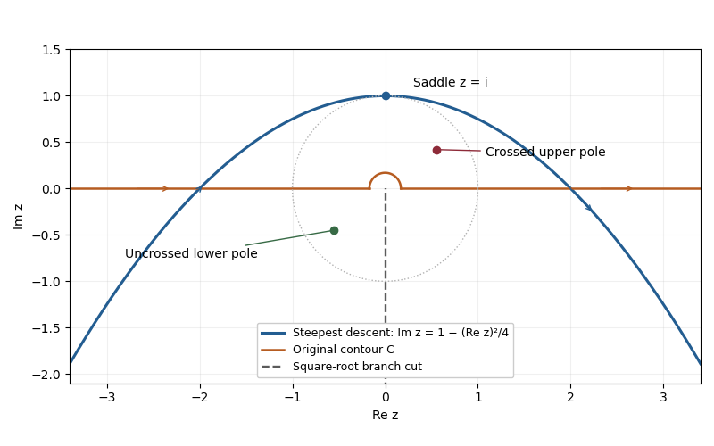

# Paper 336

↑ **Parent:** [Iii](../iii.md)

[https://www.maths.cam.ac.uk/postgrad/part-iii/files/pastpapers/2018/paper_336.pdf](https://www.maths.cam.ac.uk/postgrad/part-iii/files/pastpapers/2018/paper_336.pdf)

**Table of contents**

- [1](#1)
  - [a](#1/a)
    - [Solution](#1/a/solution)
  - [b](#1/b)
    - [a](#1/b/a)
      - [Solution](#1/b/a/solution)
  - [c](#1/c)
    - [Solution](#1/c/solution)
- [2](#2)
  - [i](#2/i)
    - [Solution](#2/i/solution)
  - [ii](#2/ii)
    - [Solution](#2/ii/solution)
  - [iii](#2/iii)
    - [Solution](#2/iii/solution)
- [3](#3)
  - [i](#3/i)
    - [Solution](#3/i/solution)
  - [ii](#3/ii)
    - [Solution](#3/ii/solution)

## 1

↑ **Parent:** [Paper 336](paper-336.md)

<h3 id="1/a">a</h3>

↑ **Parent:** [1](#1)

<h4 id="1/a/solution">Solution</h4>

↑ **Parent:** [A](#1/a)

Choose the [square root](../../../algebra.md#square-root) with $-\pi/2<\arg z<3\pi/2$, so the [branch cut](../../../analysis.md#branch-cut) is the negative imaginary axis. The change of variable $u=e^{-i\pi/4}\sqrt z$ maps this sheet onto $\operatorname{Re}u>0$ and gives $z=iu^2$. Writing the [exponential function](../../../calculus.md#exponential-function) as $e^{k\phi(z)}$, its phase becomes exactly quadratic:

$$
\phi(z)=-i\bigl(z-2e^{i\pi/4}\sqrt z\bigr)=(u-1)^2-1.
$$

The [saddle point](../../../analysis.md#saddle-point) is therefore $u=1$, or **$z_s=i$**. On the descending line $u=1+iv$, $v\in\mathbb R$, the phase is $-1-v^2$. Its image is the [parabola](../../../geometry-and-topology.md#parabola)

$$
\boxed{z=-2v+i(1-v^2),\qquad\operatorname{Im}z=1-\frac{(\operatorname{Re}z)^2}{4}.}
$$

The contour runs from left to right, corresponding to $v$ decreasing from $+\infty$ to $-\infty$. A [contour deformation](../../../complex-analysis.md#contour-deformation) in the right half of the $u$-plane moves the original indented contour to this line. The connecting tails vanish in the descending sectors, and no [branch point](../../../complex-analysis.md#branch-point) or [pole](../../../isolated-singularity.md#pole) is crossed. Since $dz=-2(1+iv)\,dv$, the [Gaussian integral](../../../calculus.md#gaussian-integral) and the [odd function](../../../calculus.md#odd-function) $ve^{-kv^2}$ give

$$
I=2e^{-k}\int_{-\infty}^{\infty}(1+iv)e^{-kv^2}\,dv
=\boxed{2\sqrt{\frac\pi k}\,e^{-k}}.
$$

Here the [method of steepest descent](../../../analysis.md#method-of-steepest-descent) actually gives an exact answer for $k>0$, because the quadratic phase and linear transformed amplitude have no further even correction.

**[Figure 1](#1/a/image-integration-contours-near-a-saddle-and-a-pole). Integration contours near a saddle and a pole**. The original upper indentation, the saddle contour, and the negative imaginary branch cut. The indentation is exaggerated for visibility.

<h3 id="1/b">b</h3>

↑ **Parent:** [1](#1)

<h4 id="1/b/a">a</h4>

↑ **Parent:** [B](#1/b)

<h5 id="1/b/a/solution">Solution</h5>

↑ **Parent:** [A](#1/b/a)

For a fixed [pole](../../../isolated-singularity.md#pole) away from the [saddle point](../../../analysis.md#saddle-point), the smooth amplitude there is $(i-z_0)^{-1}$. The [simple-saddle contribution in steepest descent](../../../analysis.md#simple-saddle-contribution-in-steepest-descent) is

$$
J_{\rm sd}(z_0)=\frac{2\sqrt{\pi/k}\,e^{-k}}{i-z_0}\bigl[1+O(k^{-1})\bigr].
$$

The [residue theorem](../../../analysis.md#residue-theorem) supplies an additional contribution precisely when the [contour deformation](../../../complex-analysis.md#contour-deformation) crosses $z_0$. The region swept above the original contour has positive orientation: the original contour from left to right followed by the reversed saddle contour encloses it counterclockwise. Consequently the original integral equals the saddle integral plus the pole contribution:

$$
\boxed{J(z_0)=J_{\rm sd}(z_0)+2\pi i\chi\,e^{k\phi(z_0)}.}
$$

For $|z_0|<1$, an upper-half-plane pole outside the indentation has $\chi=1$, while a lower-half-plane pole has $\chi=0$. The entire upper unit half-disk lies below the saddle [parabola](../../../geometry-and-topology.md#parabola), so there is no further case inside that half-disk. With a fixed indentation radius $\delta$, a pole inside the upper semicircle, $|z_0|<\delta$, is also below the original contour and has $\chi=0$; real points in the indentation gap are excluded as well. Taking $\delta<|z_0|$ for a fixed nonzero pole gives the usual upper/lower classification. The pole contribution need not always dominate exponentially; its size depends on $\operatorname{Re}\phi(z_0)$, so keeping both terms makes that dependence explicit.

A pole on the original contour requires a stated [Cauchy principal value](../../../complex-analysis.md#cauchy-principal-value) or an indentation prescription. A pole parameter on the negative imaginary [branch cut](../../../analysis.md#branch-cut) still defines the integral: the contour stays on its fixed sheet, and only the denominator uses $z_0$. Such a pole is not crossed, so only $J_{\rm sd}$ is needed and no value of $\sqrt{z_0}$ must be chosen. The residue exponential above is evaluated only when $\chi=1$. At $z_0=0$ the original indentation excludes the singular point, so no additional residue is crossed. These conventions matter before taking any limiting pole position.

<h3 id="1/c">c</h3>

↑ **Parent:** [1](#1)

<h4 id="1/c/solution">Solution</h4>

↑ **Parent:** [C](#1/c)

The ordinary [saddle-point approximation with a nearby pole](../../../analysis.md#saddle-point-approximation-with-a-nearby-pole) loses uniformity when the pole lies within the width of the saddle's [Gaussian function](../../../calculus.md#gaussian-function) profile. The [distinguished limit](../../../differential-equation.md#distinguished-limit) is

$$
\boxed{z_d=z_s=i,\qquad z_0-i=O(k^{-1/2}).}
$$

Use the exact quadratic phase coordinate $s=2i\sqrt{k}(u-1)$ and define

$$
\boxed{s_d=2i\sqrt{k}\bigl(e^{-i\pi/4}\sqrt{z_0}-1\bigr)
=\sqrt{k}(z_0-i)+O\bigl(\sqrt{k}(z_0-i)^2\bigr).}
$$

On the descending contour, $s$ runs along the real axis from $-\infty$ to $+\infty$. The transformed differential has the useful [partial fraction decomposition](../../../isolated-singularity.md#partial-fraction-decomposition)

$$
\frac{dz}{z-z_0}=\left(\frac1{u-u_0}+\frac1{u+u_0}\right)du,
\qquad u_0=e^{-i\pi/4}\sqrt{z_0}.
$$

The first term contains the nearby pole; the second is regular at the saddle and contributes $O(e^{-k}k^{-1/2})$. Approaching from below the descending contour means $\operatorname{Im}s_d<0$. The [residue theorem](../../../analysis.md#residue-theorem) then gives the [Gaussian saddle-pole transition](../../../analysis.md#gaussian-saddle-pole-transition)

$$
J(z_0)=e^{-k}\left[\int_{-\infty}^{\infty}\frac{e^{-s^2/4}}{s-s_d}\,ds+2\pi i e^{-s_d^2/4}\right]+O(e^{-k}k^{-1/2}).
$$

The exponent is $-s^2/4$, as in the original PDF; the converted TeX's $-s^2/2$ is a transcription error. The exact identity $k\phi(z_0)=-k-s_d^2/4$ recovers the pole exponential in the requested expression.

The [Gaussian pole integral](../../../calculus.md#gaussian-pole-integral) expresses the bracket as $i\pi w(s_d/2)$, where $w$ is the [Faddeeva function](../../../calculus.md#faddeeva-function). Thus a convenient uniform leading answer is

$$
\boxed{J(z_0)=i\pi e^{-k}w(s_d/2)+O(e^{-k}k^{-1/2}).}
$$

The error estimate applies for bounded scaled pole position on the indicated side. In the overlap $1\ll|s_d|\ll\sqrt{k}$ below the real axis, the integral contributes $-2\sqrt\pi/s_d$ to leading order while the residue remains $2\pi i e^{-s_d^2/4}$. Since $s_d\sim\sqrt{k}(z_0-i)$, this reproduces the near-saddle limit of the separate saddle and residue terms. Boundary values on the descending contour are limits of this combined expression; the isolated real-axis pole integral itself needs a [Cauchy principal value](../../../complex-analysis.md#cauchy-principal-value) prescription.

## 2

↑ **Parent:** [Paper 336](paper-336.md)

<h3 id="2/i">i</h3>

↑ **Parent:** [2](#2)

<h4 id="2/i/solution">Solution</h4>

↑ **Parent:** [I](#2/i)

The solution and its first [derivative](../../../calculus.md#derivative) are [continuous](../../../calculus.md#continuous-function) at $x=1$: a jump would create a [Dirac delta distribution](../../../distribution-theory.md#dirac-delta-function) or its derivative, absent from the forcing. Put $r=x-1$, $A=a+1$ and $B=b$. The [outer expansions](../../../differential-equation.md#outer-expansion), fixed by the respective endpoint [boundary conditions](../../../differential-equation.md#boundary-condition), are

$$
y_L=A+r+\varepsilon\bigl[r+1+A\log|r|\bigr]+\cdots\quad(r<0),
\qquad y_R=B+\varepsilon B\log r+\cdots\quad(r>0).
$$

Balancing diffusion and advection near $r=0$ gives the [interior layer at a simple zero of advection](../../../differential-equation.md#interior-layer-at-a-simple-zero-of-advection) with [inner variable](../../../differential-equation.md#inner-variable) $z=r/\varepsilon$. The leading [inner expansion](../../../differential-equation.md#inner-expansion) solves $Y_0''+2zY_0'=0$, so matching to $A$ and $B$ gives

$$
Y_0=c+d\operatorname{erf}z,\qquad c=\frac{A+B}{2},\qquad d=\frac{B-A}{2}.
$$

For the next term define the [Gaussian drift primitives](../../../calculus.md#gaussian-drift-primitives)

$$
E_0(z)=\int_0^z e^{-t^2}\int_0^t e^{u^2}\,du\,dt,
\qquad E_1(z)=\int_0^z e^{-t^2}\int_0^t e^{u^2}\operatorname{erf}u\,du\,dt.
$$

Writing $H$ for the [Heaviside step function](../../../analysis.md#heaviside-step-function), let $F(z)=zH(-z)+(\sqrt\pi/4)\operatorname{erf}|z|$. Its value and first derivative match at zero and $(D^2+2zD)F=2zH(-z)$. Thus

$$
Y_1=F+2cE_0+2dE_1+\alpha+\beta\operatorname{erf}z,
$$

where the logarithmic overlaps fix

$$
\alpha=\frac12-\frac{\sqrt\pi}{4}+c\log\varepsilon-2cC_1,
\qquad\beta=-\frac12+d\log\varepsilon-2dC_2.
$$

Here $C_1,C_2$ are the constants in the supplied large-positive-$z$ limits of $E_0,E_1$. The terms $\varepsilon\log\varepsilon$ are essential [switchback terms](../../../differential-equation.md#switchback-term); discarding them would not give accuracy through $O(\varepsilon)$.

Subtracting the common overlap from the [inner expansion](../../../differential-equation.md#inner-expansion) and [outer expansions](../../../differential-equation.md#outer-expansion) gives the [additive composite expansion](../../../differential-equation.md#additive-composite-expansion)

$$
\boxed{y_{\rm comp}(x)=Y_0(z)+\varepsilon Y_1(z)+\frac{\varepsilon r}{2}(1-\operatorname{erf}z),\qquad z=\frac{x-1}{\varepsilon}.}
$$

The standard overlap subtraction leaves $\varepsilon rH(-r)$. Replacing $H(-r)$ by $(1-\operatorname{erf}z)/2$ changes the value only by $O(\varepsilon^2)$ uniformly and gives a composite with continuous first derivative. The last term restores the endpoint values through the retained order. When $b=a+1$, $d=0$ and the order-one error-function jump disappears. An $O(\varepsilon)$ interior adjustment remains to accommodate the leading outer derivative mismatch, together with logarithmic matching when $A\ne0$.

Reversing the diffusion sign changes the leading inner equation to $-Y_0''+2zY_0'=0$. Its nonconstant solution grows like the integral of $e^{z^2}$, so bounded matching forces the same leading value $C$ on both sides. The bulk is $C+r$ on the left and $C$ on the right; both endpoint conditions are instead supplied by decaying [endpoint layers for reversed diffusion](../../../differential-equation.md#endpoint-layers-for-reversed-diffusion), of width $\varepsilon^2$. A weaker width-$\varepsilon$ interior adjustment matches derivatives and selects $C$. Indeed, its first-order equation has a non-growing solution only if

$$
\int_{-\infty}^{\infty}e^{-z^2}\bigl(2C+2zH(-z)\bigr)\,dz=0,
\qquad C=\frac1{2\sqrt\pi}.
$$

The leading structure is consequently

$$
y\sim C+rH(-r)+(a-C+1)e^{-2x/\varepsilon^2}+(b-C)e^{-2(2-x)/\varepsilon^2},
$$

with the smaller interior correction understood. Unlike the positive-diffusion case, the endpoint values are not transported into two distinct order-one inner limits.

<h3 id="2/ii">ii</h3>

↑ **Parent:** [2](#2)

<h4 id="2/ii/solution">Solution</h4>

↑ **Parent:** [Ii](#2/ii)

An [integrating factor](../../../differential-equation.md#integrating-factor) explains the second hint and the first-order inner calculation. For

$$
Y''+2zY'=2a_1z+a_2+a_3\operatorname{erf}z,
$$

multiplication by $e^{z^2}$ gives $(e^{z^2}Y')'=e^{z^2}(2a_1z+a_2+a_3\operatorname{erf}z)$. The term $a_1z$ already produces $2a_1z$, and integrating the remaining terms twice gives $a_2E_0+a_3E_1$, in terms of the [Gaussian drift primitives](../../../calculus.md#gaussian-drift-primitives). The [homogeneous solutions](../../../differential-equation.md#homogeneous-solution) are a constant and the [error function](../../../calculus.md#error-function). Hence

$$
\boxed{Y=a_1z+a_2E_0(z)+a_3E_1(z)+K_0+K_1\operatorname{erf}z.}
$$

For the piecewise forcing in the inner problem, $F$ replaces $a_1z$ and provides the continuously matched particular solution for $2zH(-z)$. The coefficients $2c$ and $2d$ then account for the $2Y_0$ forcing.

<h3 id="2/iii">iii</h3>

↑ **Parent:** [2](#2)

<h4 id="2/iii/solution">Solution</h4>

↑ **Parent:** [Iii](#2/iii)

The first of the [Gaussian drift primitives](../../../calculus.md#gaussian-drift-primitives), $E_0$, is an [even function](../../../calculus.md#even-function); the second, $E_1$, is an [odd function](../../../calculus.md#odd-function). Their derivatives follow by the [fundamental theorem of calculus](../../../calculus.md#fundamental-theorem-of-calculus). In particular $E_0'$ is the [Dawson function](../../../calculus.md#dawson-function), which behaves as $1/(2z)+O(z^{-3})$. Since the [error function](../../../calculus.md#error-function) tends to $\pm1$, the derivative of $E_1$ behaves as $1/(2|z|)+O(|z|^{-3})$ at either end. Integration therefore gives

$$
E_0(z)=\frac12\log|z|+C_1+o(1),
\qquad E_1(z)=\operatorname{sgn}z\left[\frac12\log|z|+C_2+o(1)\right].
$$

Also $F\sim z+\sqrt\pi/4$ on the left and $F\sim\sqrt\pi/4$ on the right. The two inner overlaps are consequently

$$
Y_0+\varepsilon Y_1\sim
\begin{cases}
A+\varepsilon\left[z+A\log|z|+\sqrt\pi/4+2cC_1-2dC_2+\alpha-\beta\right],&z\to-\infty,\\
B+\varepsilon\left[B\log z+\sqrt\pi/4+2cC_1+2dC_2+\alpha+\beta\right],&z\to+\infty.
\end{cases}
$$

Expressing the [outer expansions](../../../differential-equation.md#outer-expansion) in $r=\varepsilon z$ requires the left constant $1+A\log\varepsilon$ and the right constant $B\log\varepsilon$. Equating those constants gives the stated $\alpha,\beta$. This is exactly how a [logarithmic overlap creates a switchback term](../../../differential-equation.md#logarithmic-overlap-creates-a-switchback-term): $\log|r|=\log\varepsilon+\log|z|$. Adding the outer solutions and removing these overlaps leaves the displayed [additive composite expansion](../../../differential-equation.md#additive-composite-expansion).

## 3

↑ **Parent:** [Paper 336](paper-336.md)

<h3 id="3/i">i</h3>

↑ **Parent:** [3](#3)

<h4 id="3/i/solution">Solution</h4>

↑ **Parent:** [I](#3/i)

First remove the small damping term by writing

$$
y=e^{-(1-e^{-2\varepsilon t})/4}v.
$$

The transformed [linear ordinary differential equation](../../../differential-equation.md#linear-ordinary-differential-equation) is

$$
v_{tt}+\left[e^{-2\varepsilon t}+\varepsilon^2e^{-2\varepsilon t}-\frac{\varepsilon^2}{4}e^{-4\varepsilon t}\right]v=0.
$$

The leading frequency is $\omega=e^{-\varepsilon t}$. Its [WKB approximation](../../../analysis.md#wkb-approximation) has amplitude $\omega^{-1/2}$ and phase $\int_0^t\omega\,ds=(1-e^{-\varepsilon t})/\varepsilon$. The [initial conditions](../../../differential-equation.md#initial-condition) select

$$
\boxed{y_{\rm WKB}=e^{\varepsilon t/2-(1-e^{-2\varepsilon t})/4}\sin\left(\frac{1-e^{-\varepsilon t}}{\varepsilon}\right).}
$$

This leading expression has $y(0)=0$ and $y_t(0)=1$. Its [WKB approximation for a slowly varying oscillator](../../../analysis.md#wkb-approximation-for-a-slowly-varying-oscillator) requires $|\omega_t|/\omega^2=\varepsilon e^{\varepsilon t}\ll1$, so it fails around $t_*=\varepsilon^{-1}\log(\varepsilon^{-1})$.

To resolve the [Bessel transition for an exponentially decaying oscillator](../../../analysis.md#bessel-transition-for-an-exponentially-decaying-oscillator), shift to $T=\varepsilon t-\log(\varepsilon^{-1})$, put $Z=e^{-T}$ and rescale $y=\varepsilon^{-1/2}e^{-1/4}Y(T)$. The exact transformed equation is

$$
Y_{TT}+e^{-2T}Y+\varepsilon^2e^{-2T}Y_T=0.
$$

For fixed $T$ its leading form is $Y_{TT}+e^{-2T}Y=0$. The substitution $Z=e^{-T}$ turns it into the order-zero [Bessel differential equation](../../../analysis.md#bessel-differential-equation), so $Y=A_0J_0(Z)+B_0Y_0(Z)$. In the overlap $1\ll Z\ll\varepsilon^{-1}$, matching the large-argument [Bessel functions](../../../analysis.md#bessel-function) to $Z^{-1/2}\sin(\varepsilon^{-1}-Z)$ gives, with $\theta=\varepsilon^{-1}-\pi/4$,

$$
\boxed{y\sim\varepsilon^{-1/2}e^{-1/4}\sqrt{\frac\pi2}\left[\sin\theta J_0(Z)-\cos\theta Y_0(Z)\right].}
$$

Here $J_0$ and $Y_0$ are the [Bessel function of the first kind](../../../analysis.md#bessel-function-of-the-first-kind) and [Bessel function of the second kind](../../../analysis.md#bessel-function-of-the-second-kind); the symbol $Y_0(Z)$ in this question is unrelated to the leading inner function in the preceding question.

At late times $T\gg1$, the small-argument expansions give

$$
\boxed{y\sim\varepsilon^{-1/2}e^{-1/4}\sqrt{\frac\pi2}\left[\sin\theta+\frac2\pi\cos\theta\bigl(T+\log2-\gamma\bigr)\right],}
$$

where $\gamma$ is the [Euler--Mascheroni constant](../../../complex-analysis.md#euler-s-constant). The solution becomes asymptotically linear rather than maintaining the exponentially growing WKB envelope. Its leading late-time slope is $\varepsilon^{1/2}e^{-1/4}\sqrt{2/\pi}\cos\theta$. These are leading asymptotic coefficients as $\varepsilon\to0$: near a zero of $\cos\theta$, higher-order phase corrections determine the small actual slope. The formula is not an absolute-error estimate uniform to arbitrarily late times. The [exact late slope of an exponentially damped oscillator](../../../analysis.md#exact-late-slope-of-an-exponentially-damped-oscillator), obtained from a [Kummer function](../../../differential-equation.md#confluent-hypergeometric-function-of-the-first-kind) and a [Wronskian](../../../differential-equation.md#wronskian), provides a separate check even near those exceptional phases.

<h3 id="3/ii">ii</h3>

↑ **Parent:** [3](#3)

<h4 id="3/ii/solution">Solution</h4>

↑ **Parent:** [Ii](#3/ii)

The transition equation reduces to the [Bessel differential equation](../../../analysis.md#bessel-differential-equation) because $d/dT=-Z\,d/dZ$ and $d^2/dT^2=Z^2d^2/dZ^2+Z\,d/dZ$. Thus $Y_{TT}+e^{-2T}Y=0$ becomes $Z^2Y_{ZZ}+ZY_Z+Z^2Y=0$.

The [Bessel function of the first kind](../../../analysis.md#bessel-function-of-the-first-kind) has $J_0(Z)=1+O(Z^2)$ at zero, while the [Bessel function of the second kind](../../../analysis.md#bessel-function-of-the-second-kind) has $Y_0(Z)=(2/\pi)(\log(Z/2)+\gamma)+O(Z^2|\log Z|)$. Since $\log Z=-T$, these yield a constant and a linear function of $T$, explaining the late-time behavior. At large positive $Z$,

$$
J_0(Z)\sim\sqrt{\frac2{\pi Z}}\cos(Z-\pi/4),\qquad
Y_0(Z)\sim\sqrt{\frac2{\pi Z}}\sin(Z-\pi/4).
$$

Matching $A_0\cos(Z-\pi/4)+B_0\sin(Z-\pi/4)$ to $\sqrt{\pi/2}\sin(\varepsilon^{-1}-Z)$ fixes $A_0=\sqrt{\pi/2}\sin\theta$ and $B_0=-\sqrt{\pi/2}\cos\theta$. The large- and small-argument [asymptotic expansions](../../../analysis.md#asymptotic-expansion) thereby connect the oscillatory [WKB approximation](../../../analysis.md#wkb-approximation) to the nonoscillatory late-time solution through one [Bessel transition for an exponentially decaying oscillator](../../../analysis.md#bessel-transition-for-an-exponentially-decaying-oscillator).

## ↑ Ancestors (8)

1. [Iii](../iii.md)
2. [2018](../../2018.md)
3. [Past exam of the mathematics course of the University of Cambridge](../../../past-exam-of-the-mathematics-course-of-the-university-of-cambridge.md)
4. [Mathematics course of the University of Cambridge](../../../university-of-cambridge.md#mathematics-course-of-the-university-of-cambridge)
5. [Course of the University of Cambridge](../../../university-of-cambridge.md#course-of-the-university-of-cambridge)
6. [University of Cambridge](../../../university-of-cambridge.md)
7. [List of universities](../../../README.md#list-of-universities)
8. [Codex Wiki](../../../README.md)
