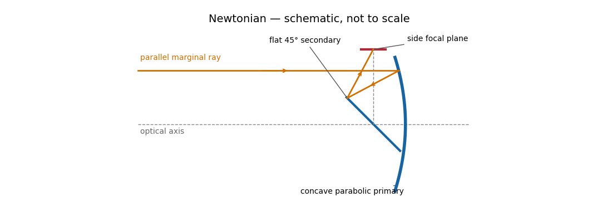
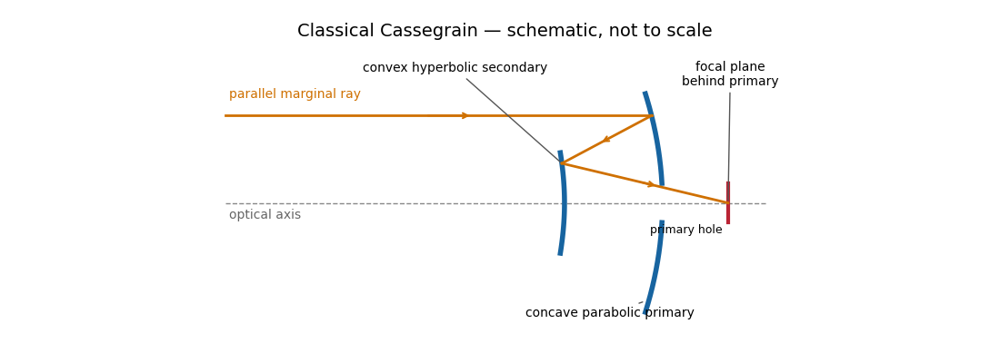

# Paper 338

↑ **Parent:** [Iii](../iii.md)

[https://www.maths.cam.ac.uk/postgrad/part-iii/files/pastpapers/2018/paper_338.pdf](https://www.maths.cam.ac.uk/postgrad/part-iii/files/pastpapers/2018/paper_338.pdf)

**Table of contents**

- [1](#1)
  - [a](#1/a)
    - [i](#1/a/i)
      - [Solution](#1/a/i/solution)
    - [ii](#1/a/ii)
      - [Solution](#1/a/ii/solution)
  - [b](#1/b)
    - [i](#1/b/i)
      - [Solution](#1/b/i/solution)
    - [ii](#1/b/ii)
      - [Solution](#1/b/ii/solution)
    - [iii](#1/b/iii)
      - [Solution](#1/b/iii/solution)
    - [iv](#1/b/iv)
      - [Solution](#1/b/iv/solution)
    - [v](#1/b/v)
      - [Solution](#1/b/v/solution)
  - [c](#1/c)
    - [i](#1/c/i)
      - [Solution](#1/c/i/solution)
    - [ii](#1/c/ii)
      - [Solution](#1/c/ii/solution)
    - [iii](#1/c/iii)
      - [Solution](#1/c/iii/solution)
- [2](#2)
  - [a](#2/a)
    - [i](#2/a/i)
      - [Solution](#2/a/i/solution)
    - [ii](#2/a/ii)
      - [Solution](#2/a/ii/solution)
    - [iii](#2/a/iii)
      - [Solution](#2/a/iii/solution)
    - [iv](#2/a/iv)
      - [Solution](#2/a/iv/solution)
    - [v](#2/a/v)
      - [Solution](#2/a/v/solution)
  - [b](#2/b)
    - [Solution](#2/b/solution)
  - [c](#2/c)
    - [i](#2/c/i)
      - [Solution](#2/c/i/solution)
    - [ii](#2/c/ii)
      - [Solution](#2/c/ii/solution)
- [3](#3)
  - [a](#3/a)
    - [i](#3/a/i)
      - [Solution](#3/a/i/solution)
    - [ii](#3/a/ii)
      - [Solution](#3/a/ii/solution)
  - [b](#3/b)
    - [i](#3/b/i)
      - [Solution](#3/b/i/solution)
    - [ii](#3/b/ii)
      - [Solution](#3/b/ii/solution)
    - [iii](#3/b/iii)
      - [Solution](#3/b/iii/solution)
  - [c](#3/c)
    - [Solution](#3/c/solution)

## 1

↑ **Parent:** [Paper 338](paper-338.md)

<h3 id="1/a">a</h3>

↑ **Parent:** [1](#1)

<h4 id="1/a/i">i</h4>

↑ **Parent:** [A](#1/a)

<h5 id="1/a/i/solution">Solution</h5>

↑ **Parent:** [I](#1/a/i)

Use the [gnomonic projection](../../../geometry-and-topology.md#gnomonic-projection) associated with an undistorted [focal plane](../../../optics.md#focal-plane). Write $\Delta=\alpha-A$ and rotate the celestial [Cartesian coordinate system](../../../linear-algebra.md#cartesian-coordinate-system) so that the pointing meridian has longitude zero. The stellar direction and an [orthonormal basis](../../../linear-algebra.md#orthonormal-basis) adapted to the [optical axis](../../../optics.md#optical-axis) are

$$
\mathbf s=(\cos\delta\cos\Delta,\cos\delta\sin\Delta,\sin\delta),\quad
\mathbf b=(\cos D,0,\sin D),\quad
\mathbf e=(0,1,0),\quad
\mathbf n=(-\sin D,0,\cos D).
$$

Here $\mathbf e$ points east and $\mathbf n$ points north. Intersect the ray $t\mathbf s$ with the plane $\mathbf x\cdot\mathbf b=f$. It gives $t=f/(\mathbf s\cdot\mathbf b)$, so the detector coordinates are

$$
\xi=f\frac{\cos\delta\sin\Delta}{\cos\delta\cos\Delta\cos D+\sin\delta\sin D},\qquad
\eta=f\frac{\sin\delta\cos D-\cos\delta\cos\Delta\sin D}{\cos\delta\cos\Delta\cos D+\sin\delta\sin D}.
$$

These equations also avoid spurious singularities caused by writing individual tangents or cotangents.

To put this [gnomonic projection](../../../geometry-and-topology.md#gnomonic-projection) in the desired form, let $\rho=(\cos^2\delta\cos^2\Delta+\sin^2\delta)^{1/2}$ and choose $q$ locally by

$$
\rho\cos q=\cos\delta\cos\Delta,\qquad \rho\sin q=\sin\delta.
$$

Thus $\cot q=\cot\delta\cos\Delta$. The denominator becomes $\rho\cos(q-D)$, the numerator for $\eta$ becomes $\rho\sin(q-D)$, and $\cos\delta\sin\Delta=\rho\cos q\tan\Delta$. Consequently

$$
\boxed{\xi=f\frac{\cos q\tan(\alpha-A)}{\cos(q-D)},\qquad \eta=f\tan(q-D).}
$$

Use the local meridian chart $\cos\Delta>0$, with $q\in[-\pi/2,\pi/2]$ chosen continuously near $D$ and $q=D$ at the image centre. A visible [gnomonic projection](../../../geometry-and-topology.md#gnomonic-projection) requires $\mathbf s\cdot\mathbf b>0$, but this front-hemisphere condition alone does not select that meridian chart. A narrow field near a celestial pole can cross the opposite meridian; for such fields use the Cartesian expressions above and distinguish the oriented [great circle](../../../geometry-and-topology.md#great-circle) parameter from ordinary [declination](../../../astrophysics.md#declination). In particular, the small-field limit is $\xi\simeq f\cos D(\alpha-A)$ and $\eta\simeq f(\delta-D)$, with angles in radians. The factor $\cos D$ is the shrinking angular distance per unit [right ascension](../../../astrophysics.md#right-ascension) near the pole.

<h4 id="1/a/ii">ii</h4>

↑ **Parent:** [A](#1/a)

<h5 id="1/a/ii/solution">Solution</h5>

↑ **Parent:** [Ii](#1/a/ii)

The [great circle](../../../geometry-and-topology.md#great-circle) containing the pointing and celestial pole is the intersection of the [unit sphere](../../../topology.md#unit-sphere) with the meridian plane $y=0$. The [orthogonal projection](../../../hilbert-space.md#orthogonal-projection) of $\mathbf s$ onto that plane, normalized to unit length, is

$$
\boldsymbol\ell=\rho^{-1}(\cos\delta\cos\Delta,0,\sin\delta)=(\cos q,0,\sin q).
$$

Within the local meridian chart $\cos\Delta>0$, its [declination](../../../astrophysics.md#declination) is therefore $q$. Outside that chart, the same construction gives an oriented [great circle](../../../geometry-and-topology.md#great-circle) parameter; the foot can lie on the opposite right-ascension half of the meridian, and $q$ need not be its ordinary [declination](../../../astrophysics.md#declination).

To verify the right angle geometrically, the tangent to the [great circle](../../../geometry-and-topology.md#great-circle) from $L$ toward $S$ is proportional to $\mathbf s-(\mathbf s\cdot\boldsymbol\ell)\boldsymbol\ell$. Since $\mathbf s\cdot\boldsymbol\ell=\rho$, that tangent has only a $y$ component. The tangent from $L$ toward the pole, $\mathbf P-(\mathbf P\cdot\boldsymbol\ell)\boldsymbol\ell$, lies in $y=0$. Their [orthogonality](../../../linear-algebra.md#orthogonal-vectors) proves the claimed spherical right angle. Thus **within the local meridian chart, $q$ is the [declination](../../../astrophysics.md#declination) of the perpendicular foot on the pointing meridian.**

There are antipodal perpendicular feet on the complete [great circle](../../../geometry-and-topology.md#great-circle). On the local meridian chart, the telescope field selects the foot near the pointing; the cotangent equation alone determines $q$ only modulo $\pi$. At a coincident foot or pole, the corresponding angle is understood by continuity rather than by a nonzero tangent vector.

<h3 id="1/b">b</h3>

↑ **Parent:** [1](#1)

<h4 id="1/b/i">i</h4>

↑ **Parent:** [B](#1/b)

<h5 id="1/b/i/solution">Solution</h5>

↑ **Parent:** [I](#1/b/i)

A [Newtonian reflector](../../../optics.md#newtonian-telescope) uses a concave primary generated by a [parabola](../../../geometry-and-topology.md#parabola), followed by a flat secondary inclined at $45^\circ$ to the [optical axis](../../../optics.md#optical-axis). Parallel marginal rays converge toward the primary focus; the secondary intercepts that converging beam and folds it sideways to an accessible [focal plane](../../../optics.md#focal-plane).

**[Figure 1](#1/b/i/image-light-paths-in-a-newtonian-reflector). Light paths in a Newtonian reflector**.

The [Newtonian reflector](../../../optics.md#newtonian-telescope) needs only one powered mirror, so it is relatively simple to fabricate and inexpensive. A parabolic primary has no on-axis [spherical aberration](../../../optics.md#spherical-aberration). Its principal wide-field limitation is [coma](../../../optics.md#coma-optics), accompanied by [field curvature](../../../optics.md#petzval-field-curvature) and off-axis [astigmatism](../../../optics.md#astigmatism-optical-systems). The diagonal and its supports obstruct the [entrance pupil](../../../optics.md#entrance-pupil) and introduce [diffraction](../../../quantum-mechanics.md#diffraction); the tube is long compared with a folded two-powered-mirror design, and heavy instruments at the side focus can be awkward to support. These comments also answer the unheaded design-comparison clause on the next PDF page.

**Parabolic primary → flat diagonal → side focus.**

<h4 id="1/b/ii">ii</h4>

↑ **Parent:** [B](#1/b)

<h5 id="1/b/ii/solution">Solution</h5>

↑ **Parent:** [Ii](#1/b/ii)

In a [classical Cassegrain reflector](../../../optics.md#classical-cassegrain-reflector), a concave parabolic primary sends light toward an intermediate focus, but a convex hyperbolic secondary intercepts it before it reaches that focus. The secondary returns the beam through a central hole in the primary to a [focal plane](../../../optics.md#focal-plane) behind the primary. The two relevant foci of the secondary’s [hyperbola](../../../geometry-and-topology.md#hyperbola) are the primary’s would-be focus and the final focus.

**[Figure 2](#1/b/ii/image-light-paths-in-a-classical-cassegrain-reflector). Light paths in a classical Cassegrain reflector**.

The secondary magnifies the effective [focal length](../../../optics.md#focal-length), giving a compact tube and convenient rear-mounted instruments. The classical conics correct on-axis [spherical aberration](../../../optics.md#spherical-aberration), but not the off-axis [coma](../../../optics.md#coma-optics), [astigmatism](../../../optics.md#astigmatism-optical-systems) or [field curvature](../../../optics.md#petzval-field-curvature). There is secondary obscuration, [diffraction](../../../quantum-mechanics.md#diffraction) from its supports, and sensitivity to mirror alignment. A long effective [focal length](../../../optics.md#focal-length) is useful for a small angular image scale per detector pixel, but yields a small field for a fixed detector size.

**Parabolic primary → convex hyperbolic secondary before prime focus → rear focus.**

<h4 id="1/b/iii">iii</h4>

↑ **Parent:** [B](#1/b)

<h5 id="1/b/iii/solution">Solution</h5>

↑ **Parent:** [Iii](#1/b/iii)

The [Ritchey–Chrétien reflector](../../../optics.md#ritchey-chretien-telescope) follows the same folded path as a [Cassegrain reflector](../../../optics.md#cassegrain-reflector), but both the concave primary and convex secondary are hyperbolic. Their conic constants and separation are chosen to cancel third-order [spherical aberration](../../../optics.md#spherical-aberration) and [coma](../../../optics.md#coma-optics). The [focal plane](../../../optics.md#focal-plane) is behind the perforated primary.

**[Figure 3](#1/b/iii/image-light-paths-in-a-ritchey-chretien-telescope). Light paths in a Ritchey–Chrétien telescope**.

The absence of third-order [coma](../../../optics.md#coma-optics) gives a much more useful wide field than a [classical Cassegrain reflector](../../../optics.md#classical-cassegrain-reflector), making this design attractive for research imaging. It retains [astigmatism](../../../optics.md#astigmatism-optical-systems) and [field curvature](../../../optics.md#petzval-field-curvature), so a large flat detector generally needs corrective optics; higher-order [optical aberrations](../../../optics.md#optical-aberration) are not all removed. Both aspheric mirrors are more demanding to manufacture and align, and the usual secondary obstruction remains. The sketch illustrates the beam routing and mirror types; its conics are not an optimized aplanatic prescription.

**Two hyperbolic mirrors give a compact system corrected for third-order spherical aberration and coma.**

<h4 id="1/b/iv">iv</h4>

↑ **Parent:** [B](#1/b)

<h5 id="1/b/iv/solution">Solution</h5>

↑ **Parent:** [Iv](#1/b/iv)

A [classical Schmidt telescope](../../../optics.md#schmidt-camera) combines a concave spherical primary with a thin aspheric corrector plate at its centre of curvature. The plate is also near the aperture stop. It supplies just the extra ray bending needed to cancel the mirror’s [spherical aberration](../../../optics.md#spherical-aberration); rays then return toward an internal focus roughly halfway between the plate and primary. The native best-focus surface is curved, as indicated in red.

**[Figure 4](#1/b/iv/image-light-paths-in-a-schmidt-telescope). Light paths in a Schmidt telescope**.

The spherical primary is easy to manufacture, and the stop at its centre of curvature gives a nearly symmetric optical geometry that suppresses [coma](../../../optics.md#coma-optics) and [astigmatism](../../../optics.md#astigmatism-optical-systems) over a large field. Fast [Schmidt cameras](../../../optics.md#schmidt-camera) are consequently excellent survey instruments. The costs are a long enclosed optical assembly, a large precision corrector, an internal camera that obstructs the beam, and a curved focal surface. A flat detector needs field flattening. The transmissive corrector introduces wavelength-dependent effects and transmission losses, unlike an entirely reflecting system.

**Spherical primary + aspheric corrector at the centre of curvature → wide field on a curved internal focal surface.**

<h4 id="1/b/v">v</h4>

↑ **Parent:** [B](#1/b)

<h5 id="1/b/v/solution">Solution</h5>

↑ **Parent:** [V](#1/b/v)

A [Gregorian telescope](../../../optics.md#gregorian-telescope) has a concave parabolic primary and a concave ellipsoidal secondary. Unlike the [Cassegrain reflector](../../../optics.md#cassegrain-reflector), the secondary is beyond the primary focus: the rays cross that focus before reaching it. The two foci of the secondary’s [ellipse](../../../geometry-and-topology.md#ellipse) are the intermediate focus and final rear focus, so the reflected rays return through the primary hole to the detector.

**[Figure 5](#1/b/v/image-light-paths-in-a-gregorian-telescope). Light paths in a Gregorian telescope**.

The real intermediate focus permits a field stop to reject unwanted light, and the two image inversions give an erect image. The rear focus is convenient and the effective [focal length](../../../optics.md#focal-length) can be large. The secondary beyond prime focus makes the tube longer than the corresponding [Cassegrain reflector](../../../optics.md#cassegrain-reflector), often with a larger secondary obstruction. The classical design retains off-axis [coma](../../../optics.md#coma-optics), [astigmatism](../../../optics.md#astigmatism-optical-systems) and [field curvature](../../../optics.md#petzval-field-curvature), and needs careful alignment.

**Parabolic primary → real intermediate focus → concave ellipsoidal secondary → rear focus.**

<h3 id="1/c">c</h3>

↑ **Parent:** [1](#1)

<h4 id="1/c/i">i</h4>

↑ **Parent:** [C](#1/c)

<h5 id="1/c/i/solution">Solution</h5>

↑ **Parent:** [I](#1/c/i)

An ordinary passive primary must keep its optical figure while the direction of gravity relative to the mirror changes as the telescope tracks. A thin unsupported disk bends enough to introduce [wavefront errors](../../../optics.md#wavefront-error), degrading the [point spread function](../../../optics.md#point-spread-function). Increasing thickness strongly raises its resistance to bending.

For an isotropic [elastic plate](../../../continuum-mechanics.md#elastic-plate) of thickness $t$, [Young's modulus](../../../continuum-mechanics.md#young-s-modulus) $E_Y$ and [Poisson's ratio](../../../continuum-mechanics.md#poisson-s-ratio) $\nu$, the flexural rigidity is $\mathcal B=E_Yt^3/[12(1-\nu^2)]$. Under its own weight the load per area scales as $\rho g_0t$. With support spans of order the diameter $D$, plate bending therefore gives

$$
\boxed{h\sim\frac{\rho g_0D^4}{E_Yt^2}.}
$$

Numerical coefficients depend on the support and boundary conditions. A larger $t$ greatly reduces gravitational sag, even though it adds weight. Near normal incidence a mirror displacement $h$ changes [optical path length](../../../optics.md#optical-path-length) by approximately $2h$, so surface errors must be much smaller than the observing [wavelength](../../../wave-equation.md#wavelength). **Thickness provides passive stiffness needed to preserve the mirror figure.**

<h4 id="1/c/ii">ii</h4>

↑ **Parent:** [C](#1/c)

<h5 id="1/c/ii/solution">Solution</h5>

↑ **Parent:** [Ii](#1/c/ii)

The difficulty is an unfavorable engineering scaling, rather than a fundamental diameter cutoff. For the same passive support concept and fixed allowed sag, the [elastic plate](../../../continuum-mechanics.md#elastic-plate) estimate gives $t\propto D^2$. Consequently

$$
M\sim\rho D^2t\propto D^4,
\qquad t_{\rm thermal}\sim t^2/\kappa\propto D^4,
$$

where $\kappa$ is the [thermal diffusivity](../../../thermodynamics.md#thermal-diffusivity). Thus increasing diameter makes the casting, annealing, transport and support progressively harder, while its long [thermal diffusion time](../../../thermodynamics.md#thermal-diffusion-time) prevents the mirror following the changing ambient temperature. Temperature gradients deform the surface; a warm mirror also creates local turbulence that worsens [astronomical seeing](../../../optics.md#astronomical-seeing). A thinner solid disk has a shorter thermal response but is too flexible without better support.

The quoted four-metre scale is a practical rule of thumb for the simple thick passive design, not an absolute physical impossibility. The [official BTA description](https://www.sao.ru/Doc-en/Telescopes/bta/descrip.html) records a 6.05-metre, 42-tonne primary already operating well before this examination. Its existence rules out interpreting the stated number as a hard bound.

**Mass, gravitational deformation and thermal response make straightforward thick-disk scaling impractical.**

<h4 id="1/c/iii">iii</h4>

↑ **Parent:** [C](#1/c)

<h5 id="1/c/iii/solution">Solution</h5>

↑ **Parent:** [Iii](#1/c/iii)

Three complementary approaches replace the simple thick solid disk:

- A thin meniscus on an [active optics](../../../optics.md#active-optics) support distributes and adjusts forces to preserve the figure despite changing gravity and temperature. The [Very Large Telescope](../../../exoplanet.md#very-large-telescope) has four 8.2-metre unit telescopes of this type; the [ESO active-optics account](https://elt.eso.org/public/teles-instr/technology/active_optics/) describes their controlled mirror supports.
- A [lightweight telescope mirror](../../../optics.md#lightweight-telescope-mirror) uses a honeycomb or ribbed backing: a deep structure retains stiffness without a massive solid interior and cools more readily. The [Large Binocular Telescope](../../../optics.md#large-binocular-telescope) uses two 8.4-metre primaries; its [official history](https://www.lbto.org/our-history/) describes their honeycomb construction.
- A [segmented mirror](../../../optics.md#segmented-mirror) constructs the aperture from manageable pieces. Support actuators and [mirror segment phasing](../../../optics.md#mirror-segment-phasing) control figure, piston and tilt. Each ten-metre [Keck telescope](../../../optics.md#w-m-keck-observatory) uses 36 hexagonal segments, as recorded in the [observatory’s telescope description](https://keckobservatory.org/our-story/telescopes/).

“Operational” and “planned” here refer to the 2018 examination date. The next generation included the 39-metre [Extremely Large Telescope](../../../exoplanet.md#extremely-large-telescope) with 798 segments, the thirty-metre [Thirty Meter Telescope](../../../optics.md#thirty-meter-telescope) with 492 segments, and the [Giant Magellan Telescope](../../../optics.md#giant-magellan-telescope) using seven 8.4-metre primary mirrors. These designs extend segmentation or lightweight casting with active control, rather than simply making a thicker slab. The specifications are documented by the [2017 ELT announcement](https://www.eso.org/public/announcements/ann17085/), [TMT optics design](https://www.tmt.org/page/optics/) and [GMT primary-mirror description](https://giantmagellan.org/gallery/primary-mirrors/). [Adaptive optics](../../../optics.md#adaptive-optics) is also needed to exploit the large apertures against [atmospheric turbulence](../../../optics.md#atmospheric-turbulence); it corrects faster disturbances than [active optics](../../../optics.md#active-optics).

**Thin actively supported menisci, lightweight honeycomb mirrors, and phased segmented primaries enable larger apertures.**

## 2

↑ **Parent:** [Paper 338](paper-338.md)

<h3 id="2/a">a</h3>

↑ **Parent:** [2](#2)

<h4 id="2/a/i">i</h4>

↑ **Parent:** [A](#2/a)

<h5 id="2/a/i/solution">Solution</h5>

↑ **Parent:** [I](#2/a/i)

The telescope forms the sky image at the entrance slit. A [collimator](../../../optics.md#collimator) makes the transmitted beam parallel, a reflection [diffraction grating](../../../optics.md#diffraction-grating) disperses it, and a camera’s [optical lens](../../../optics.md#lens-optics) focuses each [wavelength](../../../wave-equation.md#wavelength) to a different detector position.

**[Figure 6](#2/a/i/image-reflection-grating-spectrograph-and-slit-limited-line-profile). Reflection-grating spectrograph and slit-limited line profile**.

With a uniformly illuminated slit, ideal imaging and negligible slit [diffraction](../../../quantum-mechanics.md#diffraction), each monochromatic slit image has an approximately top-hat intensity profile of physical width $p$. A small [wavelength](../../../wave-equation.md#wavelength) separation $\Delta\lambda$ displaces two such images by $q\Delta\lambda$, using the positive magnitude of [grating dispersion](../../../optics.md#grating-dispersion). In the geometrical, slit-limited convention, resolution occurs when the displacement is of order the slit-image width. Hence

$$
\boxed{\Delta\lambda_{\rm slit}=\frac pq,\qquad R=\frac{\lambda q}{p},\qquad p=q\Delta\lambda_{\rm slit}.}
$$

Here $p/q$ is the slit’s apparent wavelength extent. A finite [diffraction grating](../../../optics.md#diffraction-grating) broadens the sharp edges; the top-hat sketch and the following identities presume [slit-limited resolving power of a grating](../../../optics.md#slit-limited-resolving-power-of-a-grating), rather than the regime where the grating’s own diffraction determines the line width. A precise resolution criterion for nonideal profiles can change order-unity factors.

<h4 id="2/a/ii">ii</h4>

↑ **Parent:** [A](#2/a)

<h5 id="2/a/ii/solution">Solution</h5>

↑ **Parent:** [Ii](#2/a/ii)

Let the telescope and [collimator](../../../optics.md#collimator) have [focal lengths](../../../optics.md#focal-length) $f_t,f_c$, and let $w=f_t\theta$ be the physical slit width. The collimated beam diameter in the dispersion direction is $A_c=f_cD/f_t$, so $wA_c/f_c=\theta D$.

The [diffraction grating](../../../optics.md#diffraction-grating) changes both the angular width and the beam diameter. At fixed [wavelength](../../../wave-equation.md#wavelength), differentiating the [grating equation](../../../optics.md#grating-equation) gives $|d\beta/d\alpha|=\cos\alpha/\cos\beta$. Thus the [anamorphic magnification of a grating](../../../optics.md#anamorphic-magnification-of-a-grating) gives

$$
p=w\frac{f_{\rm cam}}{f_c}\frac{\cos\alpha}{\cos\beta}.
$$

If $W$ is the illuminated surface length, its projected beam diameters are $A_c=W\cos\alpha$ and $A_{\rm cam}=W\cos\beta$. Multiplication cancels the anamorphic factors:

$$
\frac{pA_{\rm cam}}{f_{\rm cam}}
=\frac{wA_c}{f_c}=\theta D.
$$

Therefore

$$
\boxed{L=R\theta D=\frac{RpA_{\rm cam}}{f_{\rm cam}}.}
$$

This is a one-dimensional optical-invariant relation: a grating cannot independently magnify the slit and shrink the corresponding beam without compensating angular changes. The calculation uses local paraxial imaging about each instrument’s chief ray and an unclipped beam.

<h4 id="2/a/iii">iii</h4>

↑ **Parent:** [A](#2/a)

<h5 id="2/a/iii/solution">Solution</h5>

↑ **Parent:** [Iii](#2/a/iii)

From the slit profile, the [spectral resolving power](../../../optics.md#spectral-resolving-power) obeys $R=\lambda q/p$. Substitute into the preceding optical-invariant relation:

$$
L=\left(\frac{\lambda q}{p}\right)\frac{pA_{\rm cam}}{f_{\rm cam}}
=\boxed{\frac{\lambda qA_{\rm cam}}{f_{\rm cam}}}.
$$

The slit-image width cancels. Although $q$ is a detector length per unit [wavelength](../../../wave-equation.md#wavelength), $\lambda q$ is a detector length, so this expression for $L$ has units of length, as does $R\theta D$.

<h4 id="2/a/iv">iv</h4>

↑ **Parent:** [A](#2/a)

<h5 id="2/a/iv/solution">Solution</h5>

↑ **Parent:** [Iv](#2/a/iv)

Use the signed-angle convention in which the reflection [grating equation](../../../optics.md#grating-equation) is $m\lambda=d(\sin\alpha+\sin\beta)$, with positive [diffraction order](../../../optics.md#diffraction-order) $m$. For fixed incidence,

$$
\frac{d\beta}{d\lambda}=\frac{m}{d\cos\beta},\qquad
q=f_{\rm cam}\frac{d\beta}{d\lambda}=\frac{mf_{\rm cam}}{d\cos\beta}.
$$

The second identity is the local focal-plane scale, measured about the camera axis aligned with the central diffracted ray. Since $A_{\rm cam}=W\cos\beta$, the projected beam size cancels the cosine in the [grating dispersion](../../../optics.md#grating-dispersion):

$$
\boxed{L=\frac{\lambda qA_{\rm cam}}{f_{\rm cam}}=\frac{Wm\lambda}{d}.}
$$

Writing $N=W/d$ for the number of illuminated grooves also gives $L=mN\lambda$. This connects the geometrical instrument invariant to the phase span of the illuminated [diffraction grating](../../../optics.md#diffraction-grating).

<h4 id="2/a/v">v</h4>

↑ **Parent:** [A](#2/a)

<h5 id="2/a/v/solution">Solution</h5>

↑ **Parent:** [V](#2/a/v)

Substitute the [grating equation](../../../optics.md#grating-equation) into the preceding result:

$$
\boxed{L=W(\sin\alpha+\sin\beta).}
$$

Moving across the illuminated grating by one groove spacing changes the incident-plus-outgoing [optical path length](../../../optics.md#optical-path-length) by $d(\sin\alpha+\sin\beta)=m\lambda$. Across length $W$, the total path difference is therefore $L$. Thus **$L$ is the optical path difference between contributions from the two ends of the illuminated grating.**

The number of coherent phase cycles across it is $L/\lambda=mN$, which is the intrinsic diffraction-limited [spectral resolving power](../../../optics.md#spectral-resolving-power) of the [diffraction grating](../../../optics.md#diffraction-grating) under the usual first-minimum criterion. In the slit-limited regime, $R\theta D=L$ also states how much sky angle can be accepted at a given resolution and aperture. Holding slit angle and resolution fixed while increasing telescope diameter requires a larger optical path span. The geometry gives $|L|\leq2W$; large incidence and diffraction angles increase resolution per unit grating length, though grazing beams become impractical.

The slit equations do not imply unlimited resolution when $\theta$ tends to zero. Once $\theta D$ is comparable to $\lambda$, finite-aperture [diffraction](../../../quantum-mechanics.md#diffraction) matters and the actual resolving power is bounded by about $mN$.

<h3 id="2/b">b</h3>

↑ **Parent:** [2](#2)

<h4 id="2/b/solution">Solution</h4>

↑ **Parent:** [B](#2/b)

An [integral field spectrograph](../../../optics.md#integral-field-spectrograph) obtains spectra throughout a two-dimensional field instead of along one slit alone. Its reduced [spectral data cube](../../../optics.md#spectral-data-cube) is $I(x,y,\lambda)$: two coordinates locate a spatial sampling element and the third labels [wavelength](../../../wave-equation.md#wavelength). One slice at fixed [wavelength](../../../wave-equation.md#wavelength) is an image; one column at fixed spatial position is an [optical spectrum](../../../optics.md#optical-spectrum). The third axis is spectral, not a third spatial direction.

Six ways to obtain such a cube illustrate the distinction between field reformatting and scanning:

- A [lenslet array](../../../optics.md#lenslet-array) divides the image into spatial elements. The [spectrograph](../../../optics.md#spectrograph) disperses each lenslet’s output into a microspectrum, with spacing and orientation chosen to avoid overlap.
- A [lenslet array](../../../optics.md#lenslet-array) feeding [optical fibers](../../../optics.md#optical-fiber) provides contiguous sampling; the fiber outputs are rearranged into a pseudo-slit for a conventional [spectrograph](../../../optics.md#spectrograph).
- A bare [optical fiber](../../../optics.md#optical-fiber) bundle samples the image and also reformats it into a pseudo-slit. Its packing fraction and coupling can leave spatial gaps or transmission losses.
- An [image slicer](../../../optics.md#image-slicer) divides the image into strips, then rearranges them end to end. Dispersion preserves position along each strip, and the reconstruction restores the second spatial coordinate.
- A scanning [Fabry–Pérot interferometer](../../../optics.md#fabry-perot-interferometer) or tunable narrow-band filter records a sequence of nearly monochromatic images, stepping the transmitted band to assemble the cube.
- Imaging [Fourier transform spectroscopy](../../../optics.md#fourier-transform-spectroscopy) records an interferogram at every spatial pixel while scanning [optical path length](../../../optics.md#optical-path-length) difference. Transforming each interferogram supplies the spectral coordinate.

The first four are simultaneous spatially multiplexed grating arrangements. The last two deliver equivalent cube coordinates by scanning; they are imaging spectrometers rather than simultaneous grating integral-field units, and variability during the scan can corrupt the cube. Detector packing, sampling, calibration and throughput determine the practical tradeoffs.

**A data cube contains one spectrum per spatial element: two sky coordinates plus wavelength.**

<h3 id="2/c">c</h3>

↑ **Parent:** [2](#2)

<h4 id="2/c/i">i</h4>

↑ **Parent:** [C](#2/c)

<h5 id="2/c/i/solution">Solution</h5>

↑ **Parent:** [I](#2/c/i)

In [angular differential imaging](../../../optics.md#angular-differential-imaging), the instrument is operated in pupil tracking: its pupil and associated quasi-static [speckle patterns](../../../optics.md#speckle-pattern) remain nearly fixed on the detector, while the sky rotates with the [parallactic angle](../../../astrophysics.md#parallactic-angle). A reference stellar [point spread function](../../../optics.md#point-spread-function) is formed from other exposures, preferably excluding frames where a companion remains at almost the same location. Subtract the reference from each exposure, then derotate the residuals into the sky frame and combine them. A companion adds coherently after derotation; the stellar residuals are reduced. This is the technique described in the [original angular-differential-imaging analysis](https://arxiv.org/abs/astro-ph/0512335). At angular separation $\rho$, the approximate displacement is $\rho\Delta\psi$, so useful diversity normally requires $\rho|\Delta\psi|\gtrsim\lambda/D$.

In [simultaneous spectral differential imaging](../../../optics.md#simultaneous-spectral-differential-imaging), acquire nearby spectral-band images simultaneously, for example with a [beam splitter](../../../optics.md#beam-splitter) and filters or an [integral field spectrograph](../../../optics.md#integral-field-spectrograph). Stellar [speckle patterns](../../../optics.md#speckle-pattern) approximately move radially in proportion to [wavelength](../../../wave-equation.md#wavelength). Rescale each image by $\lambda_0/\lambda$ and normalize the stellar flux before subtracting bands. The speckles then approximately align, while a companion at a fixed sky position moves in the rescaled coordinates. A companion absorption band can also distinguish its spectrum from the star: methane bands are useful for cool companions, as in the [TRIDENT instrument description](https://arxiv.org/abs/astro-ph/0212033), but methane is not a universal companion property. Positional diversity scales as $\rho|\Delta\lambda|/\lambda$.

**ADI uses sky rotation; SSDI uses simultaneous spectral diversity and wavelength scaling of stellar speckles.**

<h4 id="2/c/ii">ii</h4>

↑ **Parent:** [C](#2/c)

<h5 id="2/c/ii/solution">Solution</h5>

↑ **Parent:** [Ii](#2/c/ii)

Both methods reduce structured stellar residuals, rather than removing all noise. In [angular differential imaging](../../../optics.md#angular-differential-imaging), changing [atmospheric turbulence](../../../optics.md#atmospheric-turbulence), imperfect [adaptive optics](../../../optics.md#adaptive-optics), flexure and thermal drift change the [point spread function](../../../optics.md#point-spread-function) between frames. The reference then fails to represent the instantaneous stellar field. Small sky rotation makes close companions contaminate their own reference, causing [differential-imaging self-subtraction](../../../optics.md#differential-imaging-self-subtraction). Extended disks are especially susceptible; subtraction can alter shape as well as total flux. More images help independent [photon shot noise](../../../optics.md#photon-shot-noise), but do not necessarily average away correlated residuals.

[Simultaneous spectral differential imaging](../../../optics.md#simultaneous-spectral-differential-imaging) avoids the time delay, but different channels have non-common-path [wavefront errors](../../../optics.md#wavefront-error). Chromatic [optical aberrations](../../../optics.md#optical-aberration), wavelength-dependent amplitude errors and out-of-pupil propagation prevent a perfect radial rescaling of [speckle patterns](../../../optics.md#speckle-pattern). Filter throughput, detector calibration, image registration and [atmospheric dispersion](../../../optics.md#atmospheric-dispersion) also leave subtraction residuals. Nearby bands align the stellar field better but give less positional diversity; wider separation gives more displacement but larger chromatic mismatch. A smooth-spectrum companion, or one too close for appreciable rescaled displacement, can undergo severe [differential-imaging self-subtraction](../../../optics.md#differential-imaging-self-subtraction).

Artificial-companion injection through the complete processing pipeline and forward modelling can calibrate lost throughput and photometric or astrometric biases. They do not guarantee that every correlated residual is a real source. Independent epochs or spectral evidence remain valuable.

**Reference mismatch produces residual speckles; source contamination produces self-subtraction and biased photometry.**

## 3

↑ **Parent:** [Paper 338](paper-338.md)

<h3 id="3/a">a</h3>

↑ **Parent:** [3](#3)

<h4 id="3/a/i">i</h4>

↑ **Parent:** [A](#3/a)

<h5 id="3/a/i/solution">Solution</h5>

↑ **Parent:** [I](#3/a/i)

First include the mean-gain calculation preceding the numbered clauses. At each [electron-multiplying CCD](../../../optics.md#electron-multiplying-ccd) stage one electron contributes an expected $1+p$ electrons to the next stage. If $N_j$ is the charge after stage $j$, [conditional expectation](../../../measure-theory.md#conditional-expectation) gives $\mathbb E[N_{j+1}\mid N_j]=(1+p)N_j$. Iteration from $n$ input electrons yields

$$
\boxed{g=(1+p)^r,\qquad \mathbb E[x_n]=ng.}
$$

For small $p$, $g\simeq e^{rp}$ if corrections of order $rp^2$ are negligible.

In the high-gain approximation the output from one input electron has an [exponential distribution](../../../continuous-probability-distribution.md#exponential-distribution) of scale $g$. Independent input electrons produce independent cascades, and their charges add. By [convolution of independent random variables](../../../probability-theory.md#convolution-of-independent-random-variables), assuming the formula for $n$ inputs,

$$
P_{n+1}(x)=\int_0^x P_n(y)P_1(x-y)\,dy
=\frac{e^{-x/g}}{g^{n+1}(n-1)!}\int_0^x y^{n-1}\,dy
=\frac{x^ne^{-x/g}}{g^{n+1}n!}.
$$

Together with the single-electron base case this proves

$$
\boxed{P_n(x)=\frac{x^{n-1}e^{-x/g}}{g^n(n-1)!},\qquad x\geq0,\ n\geq1.}
$$

It is a [gamma distribution](../../../continuous-probability-distribution.md#gamma-distribution) with shape $n$ and scale $g$, so it is normalized and has [expected value](../../../probability-theory.md#expected-value) $ng$ and [variance](../../../variance.md) $ng^2$. The formula is a continuous approximation to discrete output charge, not an exact integer-valued branching distribution; for $n=0$ there is a point mass at zero instead.

<h4 id="3/a/ii">ii</h4>

↑ **Parent:** [A](#3/a)

<h5 id="3/a/ii/solution">Solution</h5>

↑ **Parent:** [Ii](#3/a/ii)

Let $N$ be the input photoelectron count and $\mu=\eta Q$ its mean, with [quantum efficiency](../../../optics.md#quantum-efficiency) $\eta$ and mean incident photon count $Q$. Independent arrivals give a [Poisson distribution](../../../discrete-probability-distribution.md#poisson-distribution), so $\operatorname{Var}N=\mathbb EN=\mu$. Conditional on $N$, the preceding [gamma distribution](../../../continuous-probability-distribution.md#gamma-distribution) gives $\mathbb E[X\mid N]=gN$ and $\operatorname{Var}(X\mid N)=g^2N$. The [law of total variance](../../../probability-theory.md#law-of-total-variance) therefore yields

$$
\mathbb EX=g\mu,\qquad
\operatorname{Var}X
=\mathbb E[g^2N]+\operatorname{Var}(gN)
=2g^2\mu.
$$

One contribution is the ordinary [photon shot noise](../../../optics.md#photon-shot-noise); the other is [multiplication excess noise](../../../optics.md#multiplication-excess-noise). Thus, neglecting [read noise](../../../optics.md#read-noise) and backgrounds,

$$
\mathrm{SNR}=\frac{g\mu}{\sqrt{2g^2\mu}}=\sqrt{\frac{\eta Q}{2}},
\qquad \boxed{\eta_{\rm noise\ equivalent}=\frac\eta2.}
$$

This is an excess-noise factor $\sqrt2$ in analog operation: actual photon conversion efficiency has not been halved. At low occupancy, thresholding each pixel as zero or one event can avoid most multiplication noise, but high arrival rates produce coincident events that cannot be counted separately. That is why the high-rate result concerns charge measurement rather than ideal binary photon counting.

<h3 id="3/b">b</h3>

↑ **Parent:** [3](#3)

<h4 id="3/b/i">i</h4>

↑ **Parent:** [B](#3/b)

<h5 id="3/b/i/solution">Solution</h5>

↑ **Parent:** [I](#3/b/i)

Treat $Q$ and $B$ as mean detected counts, or as photon counts with unit [quantum efficiency](../../../optics.md#quantum-efficiency). Let the independent patch measurements be $X\sim\operatorname{Poisson}(Q+B)$ and $Y\sim\operatorname{Poisson}(fB)$. For the specified unweighted [background subtraction](../../../optics.md#background-subtraction) $\widehat Q=X-Y$,

$$
\mathbb E\widehat Q=Q+(1-f)B,\quad
b=\mathbb E\widehat Q-Q=(1-f)B,\quad
\operatorname{Var}\widehat Q=Q+(1+f)B.
$$

The first error is a fixed [bias of an estimator](../../../statistical-modelling.md#bias-of-an-estimator); the last expression is the sum of independent [photon shot noise](../../../optics.md#photon-shot-noise) variances. Since $Q,B$ are already patch totals, no extra factor of the pixel count $n$ is needed, and [read noise](../../../optics.md#read-noise) is neglected.

To obtain the systematic-error ceiling requested in the following clause, define the accuracy measure $Z$ using total root-mean-square error relative to the true source count. By the [bias-variance decomposition of mean squared error](../../../statistical-modelling.md#bias-variance-decomposition-of-mean-squared-error),

$$
\boxed{Z=\frac{Q}{\sqrt{\mathbb E[(\widehat Q-Q)^2]}}
=\frac{Q}{\sqrt{Q+(1+f)B+(1-f)^2B^2}}.}
$$

For $f\simeq1$, the shot-noise term is approximately $Q+2B$, but the mismatch term must be retained.

There is a terminology qualification: the usual variance-based [signal-to-noise ratio in photon counting](../../../optics.md#signal-to-noise-ratio-in-photon-counting) is $Q/\sqrt{Q+(1+f)B}$ and does not include a fixed bias as noise. The printed next-part limit requires the root-mean-square accuracy convention above. A deterministic background mismatch contributes $b^2$ to [mean squared error](../../../statistical-modelling.md#mean-squared-error), not to the statistical variance.

<h4 id="3/b/ii">ii</h4>

↑ **Parent:** [B](#3/b)

<h5 id="3/b/ii/solution">Solution</h5>

↑ **Parent:** [Ii](#3/b/ii)

Put $Q=R_QT$ and $B=R_BT$ in the root-mean-square accuracy measure:

$$
Z(T)=\frac{R_Q\sqrt T}{\sqrt{R_Q+(1+f)R_B+(1-f)^2R_B^2T}}.
$$

For a fixed uncorrected $f\neq1$ and $R_B>0$, the squared bias eventually dominates the shot-noise terms. Therefore

$$
\boxed{\lim_{T\to\infty}Z(T)=\frac{R_Q}{|1-f|R_B}.}
$$

The PDF omits the absolute value. Its expression is the positive accuracy ratio only if $f<1$; for $f>1$ the residual background changes sign, but an error magnitude and a [signal-to-noise ratio in photon counting](../../../optics.md#signal-to-noise-ratio-in-photon-counting) remain nonnegative. The printed signed formula can instead be read as source divided by signed bias.

For exact background matching $f=1$, there is no [systematic-error signal-to-noise ceiling](../../../optics.md#systematic-error-signal-to-noise-ceiling): $Z=R_Q\sqrt{T/(R_Q+2R_B)}$ grows without bound in this idealized model. With $R_B=0$ the same conclusion holds. Limits in which $f$ itself approaches one with exposure time are different from the fixed-mismatch limit used here.

<h4 id="3/b/iii">iii</h4>

↑ **Parent:** [B](#3/b)

<h5 id="3/b/iii/solution">Solution</h5>

↑ **Parent:** [Iii](#3/b/iii)

Increasing exposure reduces fractional [photon shot noise](../../../optics.md#photon-shot-noise) as $T^{-1/2}$, but a fixed background mismatch grows in proportion to the signal. The fractional systematic error is $|1-f|R_B/R_Q$, independent of exposure. The [systematic-error signal-to-noise ceiling](../../../optics.md#systematic-error-signal-to-noise-ceiling) can therefore be poor for a faint source in a bright sky even when random fluctuations are tiny.

Better [background subtraction](../../../optics.md#background-subtraction) requires matching sky location and time, correcting detector response, dithering or modelling spatial background variations. If $f$ were known exactly, one could instead use $X-Y/f$, which is unbiased and has variance $Q+B+B/f$. The ceiling arises from an uncorrected or unknown mismatch in the prescribed subtraction, not an unavoidable property of measuring two patches.

To reach an accuracy ratio $Z_*$ at all, a necessary condition in the fixed-mismatch model is

$$
\boxed{|1-f|<\frac{R_Q}{Z_*R_B}.}
$$

Equality allows only an asymptotic approach; finite exposure adds positive random error. **More exposure improves precision, but only better calibration removes the fixed background bias.**

<h3 id="3/c">c</h3>

↑ **Parent:** [3](#3)

<h4 id="3/c/solution">Solution</h4>

↑ **Parent:** [C](#3/c)

An [H2RG detector](../../../optics.md#h2rg-detector) is a [hybrid infrared detector](../../../optics.md#hybrid-infrared-detector): a photosensitive array is bonded, pixel by pixel through indium contacts, to a separate silicon readout circuit. In infrared use the absorber is normally [mercury cadmium telluride](../../../physics.md#mercury-cadmium-telluride), whose composition sets the absorption cutoff. The H2RG readout architecture can also be used with other absorbing materials, so the readout name does not fix the detector’s wavelength response. The [manufacturer’s H2RG specification](https://www.teledyne-si.com/en-us/Products-and-Services_/Documents/Infrared%20and%20Visible%20FPAs/TSI-0855%20H2RG%20Brochure-25Feb2022.pdf) gives a $2048\times2048$ grid and $18\,\mu\mathrm m$ pixel pitch, together with reference-pixel and guide-window capabilities.

Each illuminated pixel contains a [photodiode](../../../optics.md#photodiode) connected to its own readout node. Absorbed photons generate carriers; their accumulated charge changes the node voltage, with $|\Delta V|=|\Delta Q|/C$ for node [capacitance](../../../electromagnetism.md#capacitance) $C$. A reset establishes the baseline; row and column addressing and multiplexed output amplifiers sample the pixel voltage. This is not the serial transfer of charge packets through adjacent pixels used by a [charge-coupled device](../../../optics.md#charge-coupled-device).

[Nondestructive detector readout](../../../optics.md#nondestructive-detector-readout) allows repeated measurements during an integration. [Correlated double sampling](../../../optics.md#correlated-double-sampling) removes the reset baseline, [Fowler sampling](../../../optics.md#fowler-sampling) differences groups of reads at the beginning and end, and [up-the-ramp sampling](../../../optics.md#up-the-ramp-sampling) estimates the signal from its slope and can flag cosmic-ray steps or saturation. The “R” denotes [detector reference pixels](../../../optics.md#detector-reference-pixel), which monitor electronic offsets; “G” denotes a programmable guide window that can be read rapidly between full-array operations. Reference pixels do not measure sky background. Cooling suppresses [dark current](../../../optics.md#dark-current-physics) and thermal background. [Read noise](../../../optics.md#read-noise), nonlinearity, persistence and interpixel coupling still require calibration.

**An independently addressed hybrid photodiode array integrates charge and permits nondestructive voltage reads, reference correction and rapid guide-window sampling.**

## ↑ Ancestors (8)

1. [Iii](../iii.md)
2. [2018](../../2018.md)
3. [Past exam of the mathematics course of the University of Cambridge](../../../past-exam-of-the-mathematics-course-of-the-university-of-cambridge.md)
4. [Mathematics course of the University of Cambridge](../../../university-of-cambridge.md#mathematics-course-of-the-university-of-cambridge)
5. [Course of the University of Cambridge](../../../university-of-cambridge.md#course-of-the-university-of-cambridge)
6. [University of Cambridge](../../../university-of-cambridge.md)
7. [List of universities](../../../README.md#list-of-universities)
8. [Codex Wiki](../../../README.md)
