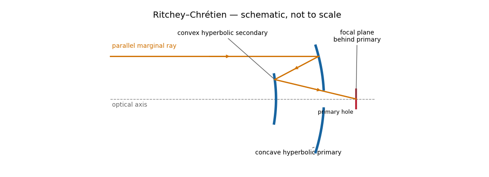

<h1 id="1/b/iii/solution">Solution</h1>

↑ **Parent:** [Iii](../iii.md)

The [Ritchey–Chrétien reflector](../../../../../../../ritchey-chretien-telescope.md) follows the same folded path as a [Cassegrain reflector](../../../../../../../cassegrain-reflector.md), but both the concave primary and convex secondary are hyperbolic. Their conic constants and separation are chosen to cancel third-order [spherical aberration](../../../../../../../spherical-aberration.md) and [coma](../../../../../../../coma-optics.md). The [focal plane](../../../../../../../focal-plane.md) is behind the perforated primary.

**[Figure 3](#1/b/iii/image-light-paths-in-a-ritchey-chretien-telescope). Light paths in a Ritchey–Chrétien telescope**.

The absence of third-order [coma](../../../../../../../coma-optics.md) gives a much more useful wide field than a [classical Cassegrain reflector](../../../../../../../classical-cassegrain-reflector.md), making this design attractive for research imaging. It retains [astigmatism](../../../../../../../astigmatism-optical-systems.md) and [field curvature](../../../../../../../petzval-field-curvature.md), so a large flat detector generally needs corrective optics; higher-order [optical aberrations](../../../../../../../optical-aberration.md) are not all removed. Both aspheric mirrors are more demanding to manufacture and align, and the usual secondary obstruction remains. The sketch illustrates the beam routing and mirror types; its conics are not an optimized aplanatic prescription.

**Two hyperbolic mirrors give a compact system corrected for third-order spherical aberration and coma.**

## ↑ Ancestors (12)

1. [Iii](../iii.md)
2. [B](../../b.md)
3. [1](../../../1.md)
4. [Paper 338](../../../../paper-338-split.md)
5. [Iii](../../../../split.md)
6. [2018](../../../../../split.md)
7. [Past exam of the mathematics course of the University of Cambridge](../../../../../../split.md)
8. [Mathematics course of the University of Cambridge](../../../../../../../mathematics-course-of-the-university-of-cambridge.md)
9. [Course of the University of Cambridge](../../../../../../../course-of-the-university-of-cambridge.md)
10. [University of Cambridge](../../../../../../../university-of-cambridge-split.md)
11. [List of universities](../../../../../../../list-of-universities.md)
12. [Codex Wiki](../../../../../../../split.md)
