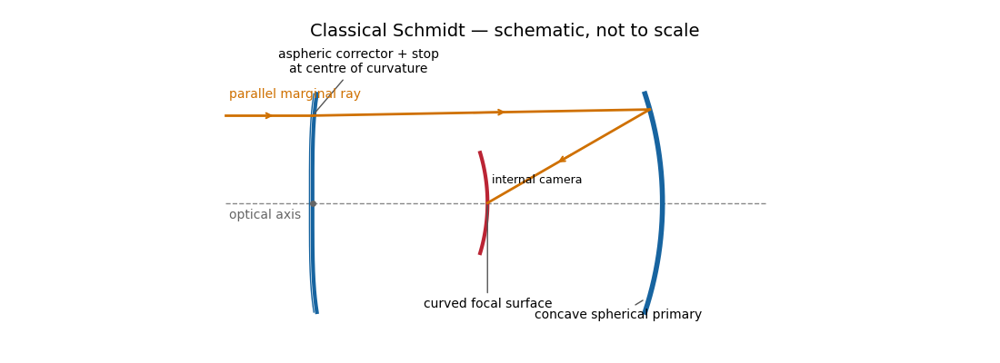

<h1 id="1/b/iv/solution">Solution</h1>

↑ **Parent:** [Iv](../iv.md)

A [classical Schmidt telescope](../../../../../../../schmidt-camera.md) combines a concave spherical primary with a thin aspheric corrector plate at its centre of curvature. The plate is also near the aperture stop. It supplies just the extra ray bending needed to cancel the mirror’s [spherical aberration](../../../../../../../spherical-aberration.md); rays then return toward an internal focus roughly halfway between the plate and primary. The native best-focus surface is curved, as indicated in red.

**[Figure 4](#1/b/iv/image-light-paths-in-a-schmidt-telescope). Light paths in a Schmidt telescope**.

The spherical primary is easy to manufacture, and the stop at its centre of curvature gives a nearly symmetric optical geometry that suppresses [coma](../../../../../../../coma-optics.md) and [astigmatism](../../../../../../../astigmatism-optical-systems.md) over a large field. Fast [Schmidt cameras](../../../../../../../schmidt-camera.md) are consequently excellent survey instruments. The costs are a long enclosed optical assembly, a large precision corrector, an internal camera that obstructs the beam, and a curved focal surface. A flat detector needs field flattening. The transmissive corrector introduces wavelength-dependent effects and transmission losses, unlike an entirely reflecting system.

**Spherical primary + aspheric corrector at the centre of curvature → wide field on a curved internal focal surface.**

## ↑ Ancestors (12)

1. [Iv](../iv.md)
2. [B](../../b.md)
3. [1](../../../1.md)
4. [Paper 338](../../../../paper-338-split.md)
5. [Iii](../../../../split.md)
6. [2018](../../../../../split.md)
7. [Past exam of the mathematics course of the University of Cambridge](../../../../../../split.md)
8. [Mathematics course of the University of Cambridge](../../../../../../../mathematics-course-of-the-university-of-cambridge.md)
9. [Course of the University of Cambridge](../../../../../../../course-of-the-university-of-cambridge.md)
10. [University of Cambridge](../../../../../../../university-of-cambridge-split.md)
11. [List of universities](../../../../../../../list-of-universities.md)
12. [Codex Wiki](../../../../../../../split.md)
