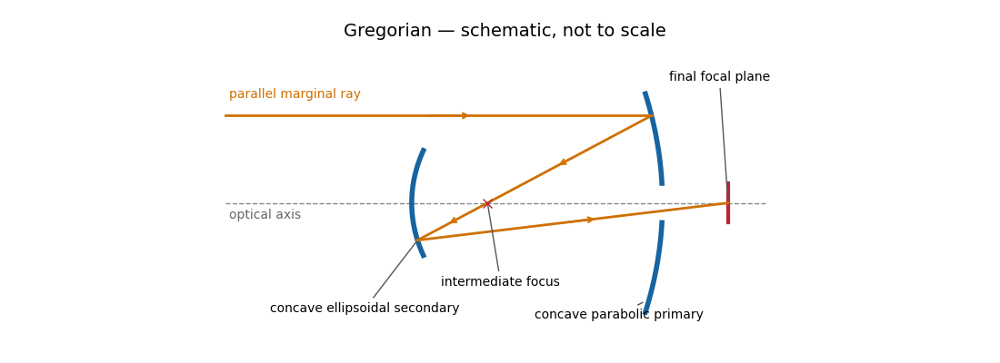

<h1 id="1/b/v/solution">Solution</h1>

↑ **Parent:** [V](../v.md)

A [Gregorian telescope](../../../../../../../gregorian-telescope.md) has a concave parabolic primary and a concave ellipsoidal secondary. Unlike the [Cassegrain reflector](../../../../../../../cassegrain-reflector.md), the secondary is beyond the primary focus: the rays cross that focus before reaching it. The two foci of the secondary’s [ellipse](../../../../../../../ellipse.md) are the intermediate focus and final rear focus, so the reflected rays return through the primary hole to the detector.

**[Figure 5](#1/b/v/image-light-paths-in-a-gregorian-telescope). Light paths in a Gregorian telescope**.

The real intermediate focus permits a field stop to reject unwanted light, and the two image inversions give an erect image. The rear focus is convenient and the effective [focal length](../../../../../../../focal-length.md) can be large. The secondary beyond prime focus makes the tube longer than the corresponding [Cassegrain reflector](../../../../../../../cassegrain-reflector.md), often with a larger secondary obstruction. The classical design retains off-axis [coma](../../../../../../../coma-optics.md), [astigmatism](../../../../../../../astigmatism-optical-systems.md) and [field curvature](../../../../../../../petzval-field-curvature.md), and needs careful alignment.

**Parabolic primary → real intermediate focus → concave ellipsoidal secondary → rear focus.**

## ↑ Ancestors (12)

1. [V](../v.md)
2. [B](../../b.md)
3. [1](../../../1.md)
4. [Paper 338](../../../../paper-338-split.md)
5. [Iii](../../../../split.md)
6. [2018](../../../../../split.md)
7. [Past exam of the mathematics course of the University of Cambridge](../../../../../../split.md)
8. [Mathematics course of the University of Cambridge](../../../../../../../mathematics-course-of-the-university-of-cambridge.md)
9. [Course of the University of Cambridge](../../../../../../../course-of-the-university-of-cambridge.md)
10. [University of Cambridge](../../../../../../../university-of-cambridge-split.md)
11. [List of universities](../../../../../../../list-of-universities.md)
12. [Codex Wiki](../../../../../../../split.md)
