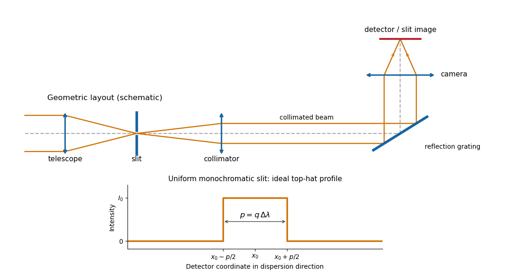

<h1 id="2/a/i/solution">Solution</h1>

↑ **Parent:** [I](../i.md)

The telescope forms the sky image at the entrance slit. A [collimator](../../../../../../../collimator.md) makes the transmitted beam parallel, a reflection [diffraction grating](../../../../../../../diffraction-grating.md) disperses it, and a camera’s [optical lens](../../../../../../../lens-optics.md) focuses each [wavelength](../../../../../../../wavelength.md) to a different detector position.

**[Figure 6](#2/a/i/image-reflection-grating-spectrograph-and-slit-limited-line-profile). Reflection-grating spectrograph and slit-limited line profile**.

With a uniformly illuminated slit, ideal imaging and negligible slit [diffraction](../../../../../../../diffraction.md), each monochromatic slit image has an approximately top-hat intensity profile of physical width $p$. A small [wavelength](../../../../../../../wavelength.md) separation $\Delta\lambda$ displaces two such images by $q\Delta\lambda$, using the positive magnitude of [grating dispersion](../../../../../../../grating-dispersion.md). In the geometrical, slit-limited convention, resolution occurs when the displacement is of order the slit-image width. Hence

$$
\boxed{\Delta\lambda_{\rm slit}=\frac pq,\qquad R=\frac{\lambda q}{p},\qquad p=q\Delta\lambda_{\rm slit}.}
$$

Here $p/q$ is the slit’s apparent wavelength extent. A finite [diffraction grating](../../../../../../../diffraction-grating.md) broadens the sharp edges; the top-hat sketch and the following identities presume [slit-limited resolving power of a grating](../../../../../../../slit-limited-resolving-power-of-a-grating.md), rather than the regime where the grating’s own diffraction determines the line width. A precise resolution criterion for nonideal profiles can change order-unity factors.

## ↑ Ancestors (12)

1. [I](../i.md)
2. [A](../../a.md)
3. [2](../../../2.md)
4. [Paper 338](../../../../paper-338-split.md)
5. [Iii](../../../../split.md)
6. [2018](../../../../../split.md)
7. [Past exam of the mathematics course of the University of Cambridge](../../../../../../split.md)
8. [Mathematics course of the University of Cambridge](../../../../../../../mathematics-course-of-the-university-of-cambridge.md)
9. [Course of the University of Cambridge](../../../../../../../course-of-the-university-of-cambridge.md)
10. [University of Cambridge](../../../../../../../university-of-cambridge-split.md)
11. [List of universities](../../../../../../../list-of-universities.md)
12. [Codex Wiki](../../../../../../../split.md)
