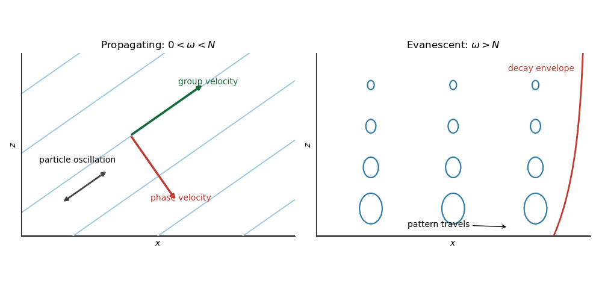

# Paper 345

↑ **Parent:** [Iii](../iii.md)

[https://www.maths.cam.ac.uk/postgrad/part-iii/files/pastpapers/2018/paper_345.pdf](https://www.maths.cam.ac.uk/postgrad/part-iii/files/pastpapers/2018/paper_345.pdf)

**Table of contents**

- [1](#1)
  - [a](#1/a)
    - [Solution](#1/a/solution)
  - [b](#1/b)
    - [Solution](#1/b/solution)
  - [c](#1/c)
    - [Solution](#1/c/solution)
- [2](#2)
  - [a](#2/a)
    - [Solution](#2/a/solution)
  - [b](#2/b)
    - [Solution](#2/b/solution)
  - [c](#2/c)
    - [Solution](#2/c/solution)
- [3](#3)
  - [a](#3/a)
    - [Solution](#3/a/solution)
  - [b](#3/b)
    - [Solution](#3/b/solution)
  - [c](#3/c)
    - [Solution](#3/c/solution)
  - [d](#3/d)
    - [Solution](#3/d/solution)
- [4](#4)
  - [a](#4/a)
    - [Solution](#4/a/solution)
  - [b](#4/b)
    - [Solution](#4/b/solution)
  - [c](#4/c)
    - [Solution](#4/c/solution)
  - [d](#4/d)
    - [Solution](#4/d/solution)

## 1

↑ **Parent:** [Paper 345](paper-345.md)

<h3 id="1/a">a</h3>

↑ **Parent:** [1](#1)

<h4 id="1/a/solution">Solution</h4>

↑ **Parent:** [A](#1/a)

Let $p$ denote the [fluid pressure](../../../fluid-mechanics.md#fluid-pressure) perturbation divided by the reference [mass density](../../../fluid-mechanics.md#density), and let $b=-g\rho'/\rho_0$ be the [buoyancy perturbation](../../../fluid-mechanics.md#buoyancy-perturbation). The [buoyancy frequency](../../../gravity-wave.md#buoyancy-frequency) satisfies $N^2=-g\hat\rho_z/\rho_0$. [Linearization](../../../algebra.md#linearization) requires small boundary slope $k|\eta_0|\ll1$, small displacements compared with the vertical scales of the disturbance and background, and [advection](../../../fluid-mechanics.md#advection) small compared with the oscillatory acceleration. For a propagating [internal gravity wave](../../../gravity-wave.md#internal-wave) this includes $|m\eta_0|\ll1$; boundary slope alone is insufficient when $|m|\gg k$. The [Boussinesq approximation](../../../geophysical-fluid-dynamics.md#boussinesq-approximation) also requires small relative [mass density](../../../fluid-mechanics.md#density) differences over the region of interest. These conditions must hold for the resulting disturbance, including any amplification by [resonance](../../../dynamical-systems.md#resonance).

The inviscid [Linearized Boussinesq equations](../../../geophysical-fluid-dynamics.md#linearized-boussinesq-equations) and linear [kinematic boundary condition](../../../fluid-mechanics.md#kinematic-boundary-condition) are

$$
u_t=-p_x,\qquad w_t=-p_z+b,\qquad b_t+N^2w=0,\qquad u_x+w_z=0,\qquad W(0)=-i\omega\eta_0.
$$

Write the [velocity field](../../../fluid-mechanics.md#velocity-field) as $(u,w)=\operatorname{Re}\{(U(z),W(z))e^{i(kx-\omega t)}\}$. [Incompressibility](../../../fluid-mechanics.md#incompressible-flow) and horizontal [momentum](../../../classical-mechanics.md#momentum) balance give

$$
U=\frac{i}{k}W',\qquad P=\frac{i\omega}{k^2}W',\qquad B=-\frac{iN^2}{\omega}W.
$$

The vertical [momentum](../../../classical-mechanics.md#momentum) balance therefore yields

$$
W''+k^2\left(\frac{N^2}{\omega^2}-1\right)W=0.
$$

For a real vertical [wavenumber](../../../wave-equation.md#wavenumber) $m$, this gives the [dispersion relation](../../../wave-equation.md#dispersion-relation)

$$
\boxed{\omega^2=\frac{N^2k^2}{k^2+m^2}}.
$$

When $0<\omega<N$, define $\ell=k\sqrt{N^2/\omega^2-1}$. The [radiation condition](../../../gravity-wave.md#radiation-condition) selects $m=-\ell$, because energy must leave the boundary upward. The [boundary-forced internal gravity wave](../../../gravity-wave.md#boundary-forced-internal-gravity-wave) is

$$
\boxed{W=-i\omega\eta_0e^{-i\ell z},\qquad U=\frac{\ell}{k}W}.
$$

Its [wavevector](../../../continuum-mechanics.md#wavevector) is $\mathbf K=(k,m)$, its [phase velocity](../../../wave-equation.md#phase-velocity) is $\mathbf c_p=\omega\mathbf K/(k^2+m^2)$, and its [group velocity](../../../wave-equation.md#group-velocity) is

$$
\mathbf c_g=\left(\frac{Nm^2}{(k^2+m^2)^{3/2}},-\frac{Nkm}{(k^2+m^2)^{3/2}}\right).
$$

Thus the [phase velocity](../../../wave-equation.md#phase-velocity) points down and right, while the [group velocity](../../../wave-equation.md#group-velocity) points up and right. They are perpendicular. [Internal-wave polarization](../../../gravity-wave.md#internal-wave-polarization) makes the particle motion an oscillation along the [group velocity](../../../wave-equation.md#group-velocity) direction, with zero first-order mean transport. The [constant-phase lines of an internal gravity wave](../../../gravity-wave.md#constant-phase-line-of-an-internal-gravity-wave) are also parallel to the [group velocity](../../../wave-equation.md#group-velocity). Their inclination $\vartheta$ above the horizontal satisfies $\sin\vartheta=\omega/N$.

When $\omega>N$, set $\kappa=k\sqrt{1-N^2/\omega^2}$. Boundedness at infinity selects the [evanescent wave](../../../continuum-mechanics.md#evanescent-wave)

$$
\boxed{W=-i\omega\eta_0e^{-\kappa z},\qquad U=-\frac{i\kappa}{k}W}.
$$

The horizontal and vertical [velocity](../../../classical-mechanics.md#velocity) components are in quadrature: fluid particles describe small [ellipses](../../../geometry-and-topology.md#ellipse), and the response decays over $\kappa^{-1}$. There is no upward time-averaged [energy flux](../../../physics.md#energy-flux), because $P$ and $W$ are in quadrature. A real vertical [group velocity](../../../wave-equation.md#group-velocity) is not defined for this [evanescent wave](../../../continuum-mechanics.md#evanescent-wave). The pattern travels horizontally with [phase velocity](../../../wave-equation.md#phase-velocity) $\omega/k$.

For $N=0$ the response is the [evanescent wave](../../../continuum-mechanics.md#evanescent-wave) with $\kappa=k$; the ratios $\omega/N$ should not be used. At the cutoff $\omega=N>0$, the bounded harmonic solution has $W=-i\omega\eta_0$, $U=0$: it neither decays nor has nonzero upward [group velocity](../../../wave-equation.md#group-velocity). It is the limiting cutoff response, rather than a localized radiating disturbance. A uniform nonzero [buoyancy frequency](../../../gravity-wave.md#buoyancy-frequency) in an infinitely deep [Boussinesq approximation](../../../geophysical-fluid-dynamics.md#boussinesq-approximation) is itself a local idealization of the background [mass density](../../../fluid-mechanics.md#density).

**[Figure 1](#1/a/image-propagating-and-evanescent-responses). Propagating and evanescent responses**.

The arrows distinguish the [phase velocity](../../../wave-equation.md#phase-velocity), [group velocity](../../../wave-equation.md#group-velocity), and oscillatory particle motion of the [internal gravity wave](../../../gravity-wave.md#internal-wave). The right panel shows the decay envelope and particle [ellipses](../../../geometry-and-topology.md#ellipse) of the [evanescent wave](../../../continuum-mechanics.md#evanescent-wave).

<h3 id="1/b">b</h3>

↑ **Parent:** [1](#1)

<h4 id="1/b/solution">Solution</h4>

↑ **Parent:** [B](#1/b)

At the change in [buoyancy frequency](../../../gravity-wave.md#buoyancy-frequency), continuity of vertical [velocity](../../../classical-mechanics.md#velocity) and [fluid pressure](../../../fluid-mechanics.md#fluid-pressure) gives

$$
[W]_{H^-}^{H^+}=0,\qquad [P]_{H^-}^{H^+}=0.
$$

The background [mass density](../../../fluid-mechanics.md#density) is continuous, so there is no interfacial density jump or separate surface restoring [force](../../../classical-mechanics.md#force). Since $P=i\omega W'/k^2$, these [internal-wave transmission across a stratification step](../../../gravity-wave.md#internal-wave-transmission-across-a-stratification-step) conditions are continuity of $W$ and $W'$. The [buoyancy perturbation](../../../fluid-mechanics.md#buoyancy-perturbation) need not be continuous, because the background density gradient jumps.

Let $W_0=-i\omega\eta_0$ and $\ell=k\sqrt{N_2^2/\omega^2-1}$. The lower unstratified layer obeys $W''-k^2W=0$ and the upper [radiation condition](../../../gravity-wave.md#radiation-condition) gives

$$
W(z)=C e^{-i\ell(z-H)}\quad(z>H),\qquad W'(H)=-i\ell C.
$$

Propagating these matching data downward gives

$$
W(z)=C\left[\cosh k(H-z)+i\frac{\ell}{k}\sinh k(H-z)\right]\quad(0\leq z\leq H).
$$

The [kinematic boundary condition](../../../fluid-mechanics.md#kinematic-boundary-condition) at the moving lower boundary therefore gives

$$
\boxed{C=\frac{-i\omega\eta_0}{\cosh(kH)+i(\ell/k)\sinh(kH)}}.
$$

The upper vertical-displacement [complex amplitude](../../../physics.md#complex-amplitude) at $H$ is

$$
\boxed{\eta_H=\frac{\eta_0}{\cosh(kH)+i(\ell/k)\sinh(kH)}},\qquad
(U,W)=\left(\frac\ell k,1\right)C e^{-i\ell(z-H)}.
$$

In particular, $|\eta_H/\eta_0|=[\cosh^2(kH)+(\ell/k)^2\sinh^2(kH)]^{-1/2}$. The unstratified layer attenuates and phase-shifts the transmitted [internal gravity wave](../../../gravity-wave.md#internal-wave). The matching height is $H$ in the original PDF; the TeX transcription's $H'$ is a typo.

<h3 id="1/c">c</h3>

↑ **Parent:** [1](#1)

<h4 id="1/c/solution">Solution</h4>

↑ **Parent:** [C](#1/c)

The central stratified layer supports upward and downward [internal gravity waves](../../../gravity-wave.md#internal-wave), whose counterpropagating components form a [standing wave](../../../physics.md#standing-wave). The unstratified regions support [evanescent waves](../../../continuum-mechanics.md#evanescent-wave), and the upper disturbance decays as $e^{-k(z-2H)}$. Consequently the central layer is a [stratified internal-wave guide](../../../gravity-wave.md#stratified-internal-wave-guide), rather than a source of propagating energy at infinity.

The largest response occurs at its trapped [normal mode](../../../wave-equation.md#normal-mode) [frequencies](../../../physics.md#frequency). They can be specified without solving the forced problem. Set the boundary forcing to zero to find a free [normal mode](../../../wave-equation.md#normal-mode). The lower solution is proportional to $\sinh(kz)$, so continuity of [fluid pressure](../../../fluid-mechanics.md#fluid-pressure) and vertical [velocity](../../../classical-mechanics.md#velocity) gives

$$
W'(H)=aW(H),\qquad a=k\coth(kH),\qquad W'(2H)=-kW(2H).
$$

In the central layer write

$$
W\propto\sin\bigl(\ell(z-H)+\delta\bigr),\qquad
\delta=\arctan(\ell/a),\qquad
\ell=k\sqrt{N_2^2/\omega^2-1}.
$$

The upper [Robin boundary condition](../../../differential-equation.md#robin-boundary-condition) then gives the exact trapped-mode condition

$$
\boxed{\ell_nH+\arctan(\ell_n/a)+\arctan(\ell_n/k)=n\pi,\qquad
\omega_n=\frac{N_2k}{\sqrt{k^2+\ell_n^2}},\quad n=1,2,\ldots}.
$$

The left side increases strictly from zero to infinity, so there is one positive root for each $n$; the [frequencies](../../../physics.md#frequency) accumulate at zero. This is constructive phase matching after reflection at both ends. The phase shifts from the [evanescent waves](../../../continuum-mechanics.md#evanescent-wave) matter: simply imposing integer half-wavelengths across the stratified layer is generally incorrect.

**In the ideal inviscid model, exact resonant forcing has no bounded steady harmonic solution.** The undamped [normal mode](../../../wave-equation.md#normal-mode) grows secularly under sustained forcing. Weak [viscosity](../../../fluid-mechanics.md#dynamic-viscosity) or other losses would produce large finite peaks near the displayed [frequencies](../../../physics.md#frequency); the linear approximation eventually fails if the disturbance becomes too large.

**[Figure 2](#1/c/image-a-trapped-internal-wave-mode). A trapped internal-wave mode**.

The illustrated free [normal mode](../../../wave-equation.md#normal-mode) has an oscillatory central region and [evanescent wave](../../../continuum-mechanics.md#evanescent-wave) tails. Its lower tail reaches the fixed zero-displacement boundary; its upper tail decays to infinity.

## 2

↑ **Parent:** [Paper 345](paper-345.md)

<h3 id="2/a">a</h3>

↑ **Parent:** [2](#2)

<h4 id="2/a/solution">Solution</h4>

↑ **Parent:** [A](#2/a)

The exact mixture [equation of state](../../../thermodynamics.md#equation-of-state) is $\rho=(1-\phi)\rho_f+\phi\rho_p$. Keeping first-order terms in the small [particle volume fraction](../../../fluid-mechanics.md#particle-volume-fraction) and [thermal expansion](../../../thermodynamics.md#thermal-expansion) gives

$$
\boxed{\rho=\rho_0(1+\gamma\phi-\theta)}.
$$

The omitted term is $\rho_0\phi\theta$. The downward solid-volume [particle deposition flux](../../../fluid-mechanics.md#particle-deposition-flux) is $J_v=W_s\phi$; the corresponding particle [mass flux](../../../physics.md#mass-flux) is $J_m=\rho_pW_s\phi$. Uniform vertical mixing and constant layer depth imply

$$
H\dot\phi=-W_s\phi,\qquad \dot\theta=\beta\phi.
$$

For $W_s>0$, set $r=W_s/H$. Then

$$
\boxed{\phi(t)=\phi_0e^{-rt},\qquad
\theta(t)=\frac{\beta\phi_0}{r}(1-e^{-rt})},
$$

and hence

$$
\frac{\rho(t)-\rho_0}{\rho_0}
=\phi_0\left[\left(\gamma+\frac\beta r\right)e^{-rt}-\frac\beta r\right].
$$

The [heated particle-laden layer](../../../fluid-mechanics.md#heated-particle-laden-layer) loses its [stable density stratification](../../../gravity-wave.md#stable-density-stratification) when this contrast vanishes. For $\beta>0$, solving for the neutral-buoyancy time gives

$$
\boxed{T_s=\frac H{W_s}\log\left(1+\frac{\gamma W_s}{\beta H}\right)}.
$$

**The layer is neutral at $T_s$ and statically unstable for $t>T_s$.** The subsequent uniformly mixed lower-layer solution cannot represent the resulting overturning.

If $W_s=0$, then $\phi=\phi_0$, $\theta=\beta\phi_0t$, and the continuous limit is $T_s=\gamma/\beta$. If $\beta=0$, the layer stays denser than its surroundings at every finite time and becomes neutral only asymptotically when $W_s>0$; thus $T_s=\infty$. These limiting cases must replace the printed formula when its denominator vanishes.

<h3 id="2/b">b</h3>

↑ **Parent:** [2](#2)

<h4 id="2/b/solution">Solution</h4>

↑ **Parent:** [B](#2/b)

Use the [shallow-water approximation](../../../physics.md#shallow-water-approximation), a hydrostatic vertically mixed layer, a deep motionless ambient, and no ambient [fluid entrainment](../../../fluid-mechanics.md#fluid-entrainment). Particle loss changes [reduced gravity](../../../reduced-gravity.md) but changes total layer volume only at the discarded dilute-particle order. Likewise [thermal expansion](../../../thermodynamics.md#thermal-expansion) changes the [equation of state](../../../thermodynamics.md#equation-of-state) while the leading [Boussinesq approximation](../../../geophysical-fluid-dynamics.md#boussinesq-approximation) retains [volume conservation](../../../physics.md#volume-conservation). Define

$$
b=g(\gamma\phi-\theta),\qquad D=\partial_t+u\partial_x.
$$

Depth integration of [mass conservation](../../../continuum-mechanics.md#mass-conservation), horizontal [momentum](../../../classical-mechanics.md#momentum) balance, particle transport, and the heating law gives

$$
\boxed{\begin{aligned}
h_t+(hu)_x&=0,\\
(hu)_t+\left(hu^2+\frac12bh^2\right)_x&=0,\\
(h\phi)_t+(hu\phi)_x&=-W_s\phi,\\
(h\theta)_t+(hu\theta)_x&=\beta h\phi.
\end{aligned}}
$$

Here the integrated excess [hydrostatic pressure](../../../fluid-mechanics.md#hydrostatic-pressure) is $bh^2/2$. There is no particle source from the bed. Bed drag and the particle contribution to inertia are neglected at this order. The equivalent [variable-buoyancy shallow water equations](../../../physics.md#variable-buoyancy-shallow-water-equations) are

$$
Dh=-hu_x,\qquad Du=-bh_x-\frac h2b_x,\qquad
D\phi=-\frac{W_s\phi}{h},\qquad D\theta=\beta\phi.
$$

The term $hb_x/2$ is necessary when heating or particle loss makes the [reduced gravity](../../../reduced-gravity.md) vary horizontally.

For $v=(h,u,\phi,\theta)^T$, the [quasilinear system](../../../partial-differential-equation.md#quasilinear-system) $v_t+A(v)v_x=S(v)$ has

$$
A=\begin{pmatrix}
u&h&0&0\\
b&u&g\gamma h/2&-gh/2\\
0&0&u&0\\
0&0&0&u
\end{pmatrix},\qquad
S=\left(0,0,-\frac{W_s\phi}{h},\beta\phi\right)^T.
$$

Its [characteristic polynomial](../../../linear-operator-theory.md#characteristic-polynomial) factors as

$$
\det(A-\lambda I)=(u-\lambda)^2\bigl[(u-\lambda)^2-bh\bigr].
$$

Thus the [characteristic curves](../../../partial-differential-equation.md#characteristic-curve) have slopes

$$
\boxed{\frac{dx}{dt}=u-\sqrt{bh},\quad u,\quad u,\quad u+\sqrt{bh}}.
$$

On the two repeated contact [characteristic curves](../../../partial-differential-equation.md#characteristic-curve), the particle and heating laws are $D\phi=-W_s\phi/h$ and $D\theta=\beta\phi$. Writing $c_g=\sqrt{bh}$ and $D_\pm=\partial_t+(u\pm c_g)\partial_x$, the gravity-wave compatibility relations are

$$
D_\pm u\ \pm\frac{c_g}{h}D_\pm h=-\frac h2b_x.
$$

For $h>0$ and $b>0$, gravity-wave right [eigenvectors](../../../linear-operator-theory.md#eigenvector) can be taken as $(1,\pm c_g/h,0,0)^T$. The contact [eigenspace](../../../linear-operator-theory.md#eigenspace) has dimension two: $\delta u=0$ and $b\delta h+(h/2)\delta b=0$, with independent $\delta\phi,\delta\theta$. Therefore $A$ has a full set of real [eigenvectors](../../../linear-operator-theory.md#eigenvector).

**The system is hyperbolic throughout strict static stability, but not strictly hyperbolic because the contact speed is repeated.** At $b=0$ the [eigenvalues](../../../linear-operator-theory.md#eigenvalue) coalesce and this diagonalizability is lost; when $b<0$ the gravity-wave speeds become complex, reflecting the loss of a statically stable lower layer.

<h3 id="2/c">c</h3>

↑ **Parent:** [2](#2)

<h4 id="2/c/solution">Solution</h4>

↑ **Parent:** [C](#2/c)

Let $\mathcal V=HL_0$ be the layer volume per unit transverse width. The [gravity-current box model](../../../reduced-gravity.md#gravity-current-box-model) imposes $hL=\mathcal V$; it approximates the front and scalar balances, rather than an exactly uniform solution of the local [momentum](../../../classical-mechanics.md#momentum) equation. For a specified constant front [Froude number](../../../reduced-gravity.md#froude-number) $\operatorname{Fr}$, the [heated particle-laden gravity current](../../../reduced-gravity.md#heated-particle-laden-gravity-current) satisfies

$$
\boxed{h=\frac{\mathcal V}{L},\qquad
\dot L=\operatorname{Fr}\sqrt{\frac{g\mathcal V(\gamma\phi-\theta)}{L}},\qquad
\dot\phi=-\frac{W_sL}{\mathcal V}\phi,\qquad
\dot\theta=\beta\phi}.
$$

The initial data are $L=L_0$, $\phi=\phi_0$, and $\theta=0$. The [gravity-current front condition](../../../reduced-gravity.md#gravity-current-front-condition) applies only while $\gamma\phi-\theta\geq0$.

For heating without settling, $\phi=\phi_0$ and $\theta=\beta\phi_0t$. Integration of the front equation gives

$$
\boxed{L(t)=\left[L_0^{3/2}+\frac{\operatorname{Fr}\sqrt{g\mathcal V\phi_0}}{\beta}
\left\{\gamma^{3/2}-(\gamma-\beta t)^{3/2}\right\}\right]^{2/3}},\qquad
0\leq t\leq\frac\gamma\beta.
$$

Hence the [heated gravity-current runout](../../../reduced-gravity.md#heated-gravity-current-runout) is

$$
\boxed{L_{\max}=\left[L_0^{3/2}+\frac{\operatorname{Fr}\sqrt{g\mathcal V\phi_0}\,\gamma^{3/2}}{\beta}\right]^{2/3}}.
$$

It is reached at the neutral-buoyancy time $\gamma/\beta$ within this front model. A finite-[momentum](../../../classical-mechanics.md#momentum) current could subsequently coast or lift off: the formula is the maximum predicted by the prescribed [gravity-current front condition](../../../reduced-gravity.md#gravity-current-front-condition), which contains no independent front inertia.

For settling without heating, $\theta=0$. Set $K=\operatorname{Fr}\sqrt{g\gamma\mathcal V}$, so $\dot L=K\sqrt\phi\,L^{-1/2}$. Eliminating time yields

$$
\frac{d\sqrt\phi}{dL}=-\frac{W_sL^{3/2}}{2\mathcal V K},\qquad
\sqrt\phi=\sqrt{\phi_0}-\frac{W_s}{5\mathcal V K}(L^{5/2}-L_0^{5/2}).
$$

Thus the [runout length of a gravity current](../../../reduced-gravity.md#runout-length-of-a-gravity-current) is

$$
\boxed{L_{\max}=\left[L_0^{5/2}+
\frac{5\operatorname{Fr}\mathcal V^{3/2}\sqrt{g\gamma\phi_0}}{W_s}\right]^{2/5}}.
$$

This length is approached as $t\to\infty$, because positive concentration cannot disappear at a finite time under the settling law. If distance means displacement from the removed barrier, the answer is $L_{\max}-L_0$ in either case.

## 3

↑ **Parent:** [Paper 345](paper-345.md)

<h3 id="3/a">a</h3>

↑ **Parent:** [3](#3)

<h4 id="3/a/solution">Solution</h4>

↑ **Parent:** [A](#3/a)

It is important to fix the [mass flux](../../../physics.md#mass-flux) convention. With literal mass units and the corresponding density-weighted [buoyancy flux](../../../turbulent-plume.md#buoyancy-flux), the [Boussinesq approximation](../../../geophysical-fluid-dynamics.md#boussinesq-approximation) and circular [top-hat plume model](../../../turbulent-plume.md#top-hat-plume-model) give

$$
\boxed{Q=\rho_0\pi b^2V,\qquad
\mathbf M=\rho_0\pi b^2V^2(\cos\theta,\sin\theta),\qquad
F=g(\rho_0-\rho)\pi b^2V}.
$$

Replacing $\rho$ by $\rho_0$ in inertial fluxes is the [Boussinesq approximation](../../../geophysical-fluid-dynamics.md#boussinesq-approximation); the density difference is retained in the [buoyancy flux](../../../turbulent-plume.md#buoyancy-flux). Define the [kinematic plume fluxes](../../../turbulent-plume.md#kinematic-plume-fluxes)

$$
q=Q/\rho_0,\qquad \mathbf m=\mathbf M/\rho_0,\qquad
f=F/\rho_0,\qquad m=|\mathbf m|=\pi b^2V^2.
$$

If the symbols $Q,\mathbf M,F$ instead denote the customary kinematic fluxes, simply omit the factors $\rho_0$ in all conversions below. Keeping the two conventions consistent is essential for the [jet length](../../../turbulent-plume.md#jet-length) and dimensional prefactors.

The [Batchelor entrainment hypothesis](../../../turbulent-plume.md#batchelor-entrainment-hypothesis) prescribes inward edge [velocity](../../../classical-mechanics.md#velocity)

$$
\boxed{u_e=\alpha V}.
$$

The constant [entrainment coefficient](../../../turbulent-plume.md#entrainment-coefficient) relates ambient inflow to the local axial [velocity](../../../classical-mechanics.md#velocity). A centreline segment of [arc length](../../../riemannian-geometry.md#arc-length) $ds$ entrains volume $2\pi b\,u_e\,ds$. Hence, setting $E=2\alpha\sqrt\pi$,

$$
\boxed{\frac{dq}{ds}=2\pi\alpha bV=E\sqrt m,\qquad
\frac{df}{ds}=0},\qquad
\frac{dQ}{ds}=2\alpha\sqrt{\pi\rho_0|\mathbf M|},\qquad \frac{dF}{ds}=0.
$$

The [buoyancy flux](../../../turbulent-plume.md#buoyancy-flux) is conserved because the homogeneous entrained ambient has zero density deficit, and mixing has no buoyancy source or sink. The imposed zero source [mass flux](../../../physics.md#mass-flux) with nonzero source [momentum flux](../../../physics.md#momentum-flux) is a singular point-source idealization, not a finite-radius nozzle with zero emitted fluid. Indeed $V=m/q$ and the plume [reduced gravity](../../../reduced-gravity.md) $f/q$ diverge as $q\to0$ with nonzero source fluxes. The [Boussinesq approximation](../../../geophysical-fluid-dynamics.md#boussinesq-approximation) cannot remain valid arbitrarily close to that point. The [top-hat plume model](../../../turbulent-plume.md#top-hat-plume-model) is applied outside the unresolved source region.

<h3 id="3/b">b</h3>

↑ **Parent:** [3](#3)

<h4 id="3/b/solution">Solution</h4>

↑ **Parent:** [B](#3/b)

For a neutrally buoyant horizontal [turbulent round jet](../../../turbulence.md#turbulent-round-jet), a segment's horizontal [momentum flux](../../../physics.md#momentum-flux) changes only if an external horizontal [force](../../../classical-mechanics.md#force) or ambient [momentum](../../../classical-mechanics.md#momentum) input exists. Neither is present, so

$$
\boxed{\frac{dM_x}{ds}=0,\qquad M_x=M_0\quad(F_0=0,\ \theta_0=0)}.
$$

Positive [buoyancy](../../../fluid-mechanics.md#buoyancy) adds a vertical [force](../../../classical-mechanics.md#force), not a horizontal one. Therefore $dM_x/ds=0$ remains true for an [inclined forced plume](../../../turbulent-plume.md#inclined-forced-plume) even when $F_0\ne0$; in general $M_x=M_0\cos\theta_0$.

The net upward [force](../../../classical-mechanics.md#force) on a segment is $g(\rho_0-\rho)\pi b^2ds$. Since $F=g(\rho_0-\rho)\pi b^2V$ and $V=|\mathbf M|/Q$, vertical [momentum](../../../classical-mechanics.md#momentum) balance gives

$$
\boxed{\frac{dM_z}{ds}=\frac FV=\frac{FQ}{|\mathbf M|}}.
$$

In [kinematic plume fluxes](../../../turbulent-plume.md#kinematic-plume-fluxes), the equations are $m_x'=0$, $m_z'=fq/m$, where $m=(m_x^2+m_z^2)^{1/2}$. The centreline geometry satisfies

$$
\frac{dx}{ds}=\cos\theta=\frac{m_x}{m},\qquad
\frac{dz}{ds}=\sin\theta=\frac{m_z}{m}.
$$

For $F_0>0$, $Q>0$ beyond the source, and an initially nonvertical [turbulent round jet](../../../turbulence.md#turbulent-round-jet) pointing right, $M_z$ increases and the centreline turns toward the vertical. The magnitude of [momentum flux](../../../physics.md#momentum-flux) is not conserved once the tangent has a vertical component.

<h3 id="3/c">c</h3>

↑ **Parent:** [3](#3)

<h4 id="3/c/solution">Solution</h4>

↑ **Parent:** [C](#3/c)

Put $m_0=M_0/\rho_0$ and $f_0=F_0/\rho_0>0$ under the literal mass convention. Their dimensions are $[m_0]=L^4T^{-2}$ and $[f_0]=L^4T^{-3}$. [Dimensional analysis](../../../physics.md#dimensional-analysis) gives

$$
\boxed{L_J=\frac{m_0^{3/4}}{f_0^{1/2}}
=\frac{M_0^{3/4}}{\rho_0^{1/4}F_0^{1/2}}}.
$$

The [jet length](../../../turbulent-plume.md#jet-length) compares source [momentum](../../../classical-mechanics.md#momentum) with [buoyancy](../../../fluid-mechanics.md#buoyancy). The region near the source behaves as a [turbulent round jet](../../../turbulence.md#turbulent-round-jet); sufficiently far away, the [forced plume](../../../turbulent-plume.md#forced-plume) behaves like a [pure plume](../../../turbulent-plume.md#pure-plume). With the constant [entrainment coefficient](../../../turbulent-plume.md#entrainment-coefficient) retained explicitly, substantial turning occurs over a length of order $\ell_J=L_J/\sqrt E$, where $E=2\alpha\sqrt\pi$. Statements involving $s\ll L_J$ or $s\gg L_J$ normally hold this dimensionless coefficient fixed.

Near the point source, $m\sim m_0$ and the [Batchelor entrainment hypothesis](../../../turbulent-plume.md#batchelor-entrainment-hypothesis) gives $q\sim E\sqrt{m_0}s$. Therefore

$$
m_z=m_0\sin\theta_0+\frac{Ef_0}{2\sqrt{m_0}}s^2+O(s^4),\qquad
\theta=\theta_0+\frac{Ef_0\cos\theta_0}{2m_0^{3/2}}s^2+O(s^4).
$$

Integrating the centreline tangent gives

$$
\begin{aligned}
x(s)&=s\cos\theta_0-\frac{Ef_0\sin\theta_0\cos\theta_0}{6m_0^{3/2}}s^3+O(s^5),\\
z(s)&=s\sin\theta_0+\frac{Ef_0\cos^2\theta_0}{6m_0^{3/2}}s^3+O(s^5).
\end{aligned}
$$

**To leading order the centreline is a straight [turbulent round jet](../../../turbulence.md#turbulent-round-jet) at its source inclination.** For the horizontal source, the first curvature is the [horizontal forced-plume trajectory](../../../turbulent-plume.md#horizontal-forced-plume-trajectory)

$$
\boxed{z\sim\frac{Ef_0}{6m_0^{3/2}}x^3
=\frac{\alpha\sqrt\pi}{3L_J^2}x^3}.
$$

For a vertical source, $\cos\theta_0=0$, the trajectory stays vertical rather than developing this cubic transverse displacement. If $F_0=0$, there is no finite buoyancy-induced [jet length](../../../turbulent-plume.md#jet-length) and the [turbulent round jet](../../../turbulence.md#turbulent-round-jet) remains straight.

<h3 id="3/d">d</h3>

↑ **Parent:** [3](#3)

<h4 id="3/d/solution">Solution</h4>

↑ **Parent:** [D](#3/d)

For a horizontal source, $m_x=m_0$ throughout. Far downstream $m_z\gg m_0$, so the [kinematic plume fluxes](../../../turbulent-plume.md#kinematic-plume-fluxes) obey the vertical [pure plume](../../../turbulent-plume.md#pure-plume) equations to leading order,

$$
q'=E\sqrt{m_z},\qquad m_z'=f_0q/m_z,\qquad f=f_0.
$$

Set $q=q_*f_0^{1/3}\hat s^{5/3}$ and $m_z=m_*f_0^{2/3}\hat s^{4/3}$ with $\hat s=s+s_0$. Matching exponents and coefficients gives $(5/3)q_*=E\sqrt{m_*}$ and $(4/3)m_*^2=q_*$. Consequently

$$
\boxed{m_*=(9E/20)^{2/3},\qquad q_*=\frac43(9E/20)^{4/3}},
$$

and the requested literal mass and density-weighted [buoyancy fluxes](../../../turbulent-plume.md#buoyancy-flux) are

$$
\boxed{Q=\rho_0q_*f_0^{1/3}\hat s^{5/3},\qquad
M_z=\rho_0m_*f_0^{2/3}\hat s^{4/3},\qquad F=F_0}
$$

to leading order. The radius is $b\sim(6\alpha/5)\hat s$ and the axial [velocity](../../../classical-mechanics.md#velocity) decreases as $\hat s^{-1/3}$.

The centreline becomes nearly vertical but retains finite horizontal drift:

$$
\frac{dx}{ds}\sim\frac{m_0}{m_*f_0^{2/3}}\hat s^{-4/3},\qquad
\boxed{x_\infty-x\sim\frac{3m_0}{m_*f_0^{2/3}}\hat s^{-1/3}}.
$$

Since $dz/ds=1-O(\hat s^{-8/3})$, there is a finite positive geometric deficit $D=\lim_{s\to\infty}(s-z)$, and $z=s-D+o(1)$. The equivalent vertical [plume virtual origin](../../../turbulent-plume.md#plume-virtual-origin) is therefore located at

$$
\boxed{(x_v,z_v)=(x_\infty,-D-s_0)}.
$$

**For the horizontal point-source forced plume, the virtual source is downstream and below the actual source.** The horizontal [turbulent round jet](../../../turbulence.md#turbulent-round-jet) first entrains substantial ambient fluid while rising only a little. Thus at the height where it turns upward it already has a finite radius and [volume flux](../../../fluid-mechanics.md#volumetric-flow-rate); an equivalent [pure plume](../../../turbulent-plume.md#pure-plume) must have begun rising from below to acquire these. The turning displacement, entrained radius divided by its far-field spreading angle, and virtual vertical depth all scale as

$$
x_\infty=O(\ell_J),\qquad |z_v|=O(\ell_J),\qquad s_0=O(\ell_J),\qquad
\ell_J=\frac{L_J}{\sqrt{2\alpha\sqrt\pi}}.
$$

At fixed [entrainment coefficient](../../../turbulent-plume.md#entrainment-coefficient) this is simply $O(L_J)$. The arclength origin $s=-s_0$ should not be interpreted as a physical height: the curved near field supplies the additional shift $D$. The numerical constants depend on the chosen [top-hat plume model](../../../turbulent-plume.md#top-hat-plume-model) and [entrainment coefficient](../../../turbulent-plume.md#entrainment-coefficient); scaling does not fix them.

**[Figure 3](#3/d/image-a-horizontal-forced-plume-and-its-far-field-virtual-origin). A horizontal forced plume and its far-field virtual origin**.

The [inclined forced plume](../../../turbulent-plume.md#inclined-forced-plume) bends from a cubic near-field trajectory toward a vertical asymptote. Dashed far-field spreading lines extrapolate to the equivalent [plume virtual origin](../../../turbulent-plume.md#plume-virtual-origin); the marked location is obtained from the integral model for this illustration, not a universal numerical prediction.

## 4

↑ **Parent:** [Paper 345](paper-345.md)

<h3 id="4/a">a</h3>

↑ **Parent:** [4](#4)

<h4 id="4/a/solution">Solution</h4>

↑ **Parent:** [A](#4/a)

Let $\Delta\rho=\rho_p-\rho_f>0$. A spherical grain has [submerged weight](../../../fluid-mechanics.md#submerged-weight)

$$
G=\frac\pi6\Delta\rho\,gd^3.
$$

Neglect lift and contact torque, and use a sliding [static friction](../../../classical-mechanics.md#static-friction) model with normal reaction $R=G$. The inertial [quadratic drag](../../../fluid-mechanics.md#quadratic-drag) is

$$
F_D=\frac12C_D\rho_fU^2\frac{\pi d^2}{4}=\frac{C_D\pi d^2}{8}\tau,
$$

where the last equality fixes the convention $\tau=\rho_fU^2$. Equivalently $U$ is the bed [shear velocity](../../../viscous-fluid-flow.md#shear-velocity) and $C_D$ is an effective [drag coefficient](../../../fluid-mechanics.md#drag-coefficient) referred to it. A literal grain-level flow speed can differ from the [shear velocity](../../../viscous-fluid-flow.md#shear-velocity); that conversion must then be absorbed into $C_D$.

Downstream sliding begins when $F_D>\mu_sR$. Defining the [Shields parameter](../../../fluid-mechanics.md#shields-parameter) by $\Theta=\tau/(\Delta\rho\,gd)$, the threshold [force balance](../../../classical-mechanics.md#force-balance) is

$$
\frac{C_D\pi d^2}{8}\tau_{\mathrm{th},0}=\mu_s\frac\pi6\Delta\rho\,gd^3,
\qquad
\boxed{\Theta_{\mathrm{th},0}=\frac{4\mu_s}{3C_D}}.
$$

**The grain moves downstream above this threshold in the stated sliding model.** Real grain motion can instead involve lift, rolling, irregular contacts, or viscous drag; the printed constant belongs to the particular inertial-drag convention and [force balance](../../../classical-mechanics.md#force-balance) above.

**[Figure 4](#4/a/image-grain-force-balances-on-horizontal-and-inclined-beds). Grain force balances on horizontal and inclined beds**.

The normal contact [force](../../../classical-mechanics.md#force) and resisting [static friction](../../../classical-mechanics.md#static-friction) balance the [drag force](../../../fluid-mechanics.md#drag-physics) and [submerged weight](../../../fluid-mechanics.md#submerged-weight) at impending motion. The right panel uses locally bed-tangent [drag force](../../../fluid-mechanics.md#drag-physics).

<h3 id="4/b">b</h3>

↑ **Parent:** [4](#4)

<h4 id="4/b/solution">Solution</h4>

↑ **Parent:** [B](#4/b)

Use locally bed-tangent [drag force](../../../fluid-mechanics.md#drag-physics), consistent with interpreting $\tau$ as bed [shear stress](../../../viscous-fluid-flow.md#shear-stress). Let the bed rise downstream at angle $\alpha$ and retain the same effective [drag coefficient](../../../fluid-mechanics.md#drag-coefficient). The normal reaction is $R=G\cos\alpha$, while the opposing downslope component of [submerged weight](../../../fluid-mechanics.md#submerged-weight) is $G\sin\alpha$. At impending upslope motion,

$$
F_D=G\sin\alpha+\mu_sG\cos\alpha.
$$

Thus the [inclined-bed sediment threshold](../../../fluid-mechanics.md#inclined-bed-sediment-threshold) is

$$
\boxed{\Theta_{\mathrm{th},0}(\alpha)=\frac4{3C_D}(\mu_s\cos\alpha+\sin\alpha)
=\Theta_{\mathrm{th},0}\left(\cos\alpha+\frac{\sin\alpha}{\mu_s}\right)}.
$$

For $|\alpha|\ll1$,

$$
\boxed{\tau_{\mathrm{th}}(\alpha)=\tau_{\mathrm{th},0}\left(1+\frac\alpha{\mu_s}\right)+O(\alpha^2)}.
$$

An uphill slope increases the [sediment entrainment threshold](../../../fluid-mechanics.md#sediment-entrainment-threshold); a downhill slope lowers it, until spontaneous gravity-driven motion invalidates the resting-bed model.

There is a geometric convention to specify: if the [drag force](../../../fluid-mechanics.md#drag-physics) remains horizontal while the bed tilts, then $R=G\cos\alpha+F_D\sin\alpha$. The corresponding [force balance](../../../classical-mechanics.md#force-balance) gives instead

$$
\Theta_{\mathrm{th}}^{\mathrm{horizontal\ drag}}
=\frac4{3C_D}\frac{\mu_s\cos\alpha+\sin\alpha}{\cos\alpha-\mu_s\sin\alpha}
=\Theta_{\mathrm{th},0}\left[1+(\mu_s+\mu_s^{-1})\alpha+O(\alpha^2)\right].
$$

The subsequent bed [shear stress](../../../viscous-fluid-flow.md#shear-stress) analysis uses the first, locally tangent convention. The two interpretations should not be mixed.

<h3 id="4/c">c</h3>

↑ **Parent:** [4](#4)

<h4 id="4/c/solution">Solution</h4>

↑ **Parent:** [C](#4/c)

The [Exner equation](../../../fluid-mechanics.md#exner-equation) is solid-volume [mass conservation](../../../continuum-mechanics.md#mass-conservation): a downstream increase in [sediment transport](../../../fluid-mechanics.md#sediment-transport) flux removes material and lowers the bed. The factor $\phi_b$ converts bed-height change into solid-volume change. The [saturation length](../../../fluid-mechanics.md#saturation-length) equation models downstream adjustment of actual [sediment transport](../../../fluid-mechanics.md#sediment-transport) to the [equilibrium sediment flux](../../../fluid-mechanics.md#equilibrium-sediment-flux). Grain acceleration and entrainment/deposition need a finite distance, so $q$ lags $q_{\mathrm{sat}}$. The last relation is an empirical transport law above the [sediment entrainment threshold](../../../fluid-mechanics.md#sediment-entrainment-threshold), with $\chi>0$ and normally $\gamma>0$; below threshold it must be interpreted with a [positive part](../../../function.md#positive-part-of-a-real-valued-function) rather than raising negative excess stress to an arbitrary power. It is a constitutive closure, not a consequence of [mass conservation](../../../continuum-mechanics.md#mass-conservation).

Take the physical parameters $L_{\mathrm{sat}}>0$, $\phi_b>0$, $\chi>0$ and $\gamma>0$. Linearize about a horizontal, uniformly transporting bed with $\Delta=\tau_0-\tau_{\mathrm{th},0}>0$ and $q_0=\phi_b\chi\Delta^\gamma$. Set $\lambda=\sigma-ikc$ and use the real parts of

$$
\eta=\hat\eta e^{\lambda t+ikx},\qquad
q=q_0+\hat q e^{\lambda t+ikx},\qquad
q_{\mathrm{sat}}=q_0+\hat q_{\mathrm{sat}}e^{\lambda t+ikx},\qquad
\tau=\tau_0+\hat\tau e^{\lambda t+ikx}.
$$

The locally planar approximation uses the small instantaneous bed slope to compute the [inclined-bed sediment threshold](../../../fluid-mechanics.md#inclined-bed-sediment-threshold). Since $\alpha=\eta_x+O(\eta_x^3)$,

$$
\boxed{\hat\tau_{\mathrm{th}}=\frac{ik\tau_{\mathrm{th},0}}{\mu_s}\hat\eta}.
$$

A sinusoidal disturbance has both uphill and downhill slopes: the printed $0<\alpha\ll1$ describes the uphill derivation, and its first-order continuation applies to both signs. The zero-slope reference is the one implicit in the printed decomposition with constant term $\tau_{\mathrm{th},0}$; a finite mean inclined bed would require a shifted base threshold.

Define $C=\chi\gamma\Delta^{\gamma-1}$. The linearized transport equations are

$$
\boxed{\phi_b\lambda\hat\eta=-ik\hat q,\qquad
(1+ikL_{\mathrm{sat}})\hat q=\hat q_{\mathrm{sat}},\qquad
\hat q_{\mathrm{sat}}=\phi_bC\left(\hat\tau-\frac{ik\tau_{\mathrm{th},0}}{\mu_s}\hat\eta\right)}.
$$

The [linearization](../../../algebra.md#linearization) requires $|\eta_x|\ll1$ and $|\hat\tau-\hat\tau_{\mathrm{th}}|\ll\Delta$.

**A fluid-dynamical shear-response closure is missing from the printed question.** The three sediment equations and local slope correction do not determine $\hat\tau$ from $\hat\eta$. Write the general [bed shear response](../../../fluid-mechanics.md#bed-shear-response) as $\hat\tau=\mathcal T(k)\hat\eta$. A frequently used scale-invariant closure for $k>0$ is

$$
\boxed{\mathcal T(k)=\tau_0k(A+iB)}.
$$

Here $A$ is the component in phase with bed height and $B$ represents an upstream phase lead in bed [shear stress](../../../viscous-fluid-flow.md#shear-stress). They require an independent flow model and can depend on $k$. Introducing them explicitly makes the [linear stability analysis](../../../dynamical-systems.md#linear-stability) complete conditional on a specified flow response; it does not turn them into data supplied by the question. An example of this hydrodynamic closure is given in [Fourrière, Claudin and Andreotti's bedform-instability analysis](https://arxiv.org/abs/0805.3417).

<h3 id="4/d">d</h3>

↑ **Parent:** [4](#4)

<h4 id="4/d/solution">Solution</h4>

↑ **Parent:** [D](#4/d)

Eliminate the transport amplitudes in the [linear stability analysis](../../../dynamical-systems.md#linear-stability). For a general [bed shear response](../../../fluid-mechanics.md#bed-shear-response) $\mathcal T(k)$, the [dispersion relation](../../../wave-equation.md#dispersion-relation) is

$$
\boxed{\lambda=\sigma-ikc=-\frac{ikC}{1+ikL_{\mathrm{sat}}}
\left[\mathcal T(k)-\frac{ik\tau_{\mathrm{th},0}}{\mu_s}\right]}.
$$

This is the most specific result available without adding the missing hydrodynamic closure. With $\mathcal T(k)=\tau_0k(A+iB)$, set

$$
a=\tau_0A,\qquad b=\tau_0B-\tau_{\mathrm{th},0}/\mu_s,\qquad x=kL_{\mathrm{sat}},\qquad k>0.
$$

Multiplication by $1-ix$ gives the [growth rate](../../../wave-equation.md#growth-rate) and migration [velocity](../../../classical-mechanics.md#velocity)

$$
\boxed{\sigma(k)=Ck^2\frac{b-akL_{\mathrm{sat}}}{1+(kL_{\mathrm{sat}})^2},\qquad
c(k)=Ck\frac{a+bkL_{\mathrm{sat}}}{1+(kL_{\mathrm{sat}})^2}}.
$$

The packed-bed volume fraction cancels. For a real physical closure the negative [wavenumber](../../../wave-equation.md#wavenumber) response is the complex conjugate; the displayed $k>0$ formulas cover the independent [normal modes](../../../wave-equation.md#normal-mode).

If $A>0$, $B>0$ are treated as constants, the upstream [shear stress](../../../viscous-fluid-flow.md#shear-stress) phase lead promotes growth, while the [inclined-bed sediment threshold](../../../fluid-mechanics.md#inclined-bed-sediment-threshold) reduces it and the finite [saturation length](../../../fluid-mechanics.md#saturation-length) delays sediment transport. **There is an unstable band precisely when $b>0$: $0<k<b/(aL_{\mathrm{sat}})$.** Within this band $c>0$, so the growing [bedforms](../../../fluid-mechanics.md#bedform) migrate downstream. The fastest [normal mode](../../../wave-equation.md#normal-mode) satisfies

$$
\boxed{(k_{\max}L_{\mathrm{sat}})^3+3k_{\max}L_{\mathrm{sat}}=2b/a}.
$$

This last maximization assumes constant $A,B$; if the hydrodynamic coefficients vary with [wavenumber](../../../wave-equation.md#wavenumber), their derivatives also enter the selection condition. When $b\leq0$ and $a>0$, all nonzero [normal modes](../../../wave-equation.md#normal-mode) decay.

Just above the [sediment entrainment threshold](../../../fluid-mechanics.md#sediment-entrainment-threshold),

$$
b\simeq\tau_{\mathrm{th},0}(B-1/\mu_s).
$$

Thus the common regime $B<1/\mu_s$ is stable near onset: the slope penalty overwhelms the hydrodynamic phase lead. This conclusion is conditional on that inequality, not universal. For constant $B>0$, instability begins only when $\tau_0>\tau_{\mathrm{th},0}/(\mu_sB)$ as well as $\tau_0>\tau_{\mathrm{th},0}$. The transport sensitivity $C=\chi\gamma\Delta^{\gamma-1}$ vanishes at onset for $\gamma>1$, is finite for $\gamma=1$, and is singular for $0<\gamma<1$. Exactly at threshold, the positive-part transport law needs separate treatment; the above [linearization](../../../algebra.md#linearization) with perturbations small compared with $\Delta$ is unavailable.

Far above the [sediment entrainment threshold](../../../fluid-mechanics.md#sediment-entrainment-threshold), $b\simeq\tau_0B$. If $A,B>0$, the unstable cutoff tends to $B/(AL_{\mathrm{sat}})$, and the dominant wavelength is set by the [saturation length](../../../fluid-mechanics.md#saturation-length). Both [growth rate](../../../wave-equation.md#growth-rate) and migration [velocity](../../../classical-mechanics.md#velocity) scale with $C\tau_0\sim\chi\gamma\tau_0^\gamma$, apart from their length factors. Their numerical values and any detailed dependence on [wavenumber](../../../wave-equation.md#wavenumber) still require a flow closure.

For example, prescribing uniform [shear stress](../../../viscous-fluid-flow.md#shear-stress) independently of the bed gives $\mathcal T=0$ and

$$
\sigma=-\frac{C\tau_{\mathrm{th},0}}{\mu_s}\frac{k^2}{1+(kL_{\mathrm{sat}})^2}<0.
$$

This equally admissible closure illustrates why instability cannot be asserted from the printed sediment equations alone.

**[Figure 5](#4/d/image-conditional-bedform-growth-and-migration). Conditional bedform growth and migration**.

The plots use constant $a>0$ and three illustrative ratios $b/a$. They show how the sign of the shear phase lead minus the slope correction determines stability; they are not numerical predictions for unspecified flow conditions.

## ↑ Ancestors (8)

1. [Iii](../iii.md)
2. [2018](../../2018.md)
3. [Past exam of the mathematics course of the University of Cambridge](../../../past-exam-of-the-mathematics-course-of-the-university-of-cambridge.md)
4. [Mathematics course of the University of Cambridge](../../../university-of-cambridge.md#mathematics-course-of-the-university-of-cambridge)
5. [Course of the University of Cambridge](../../../university-of-cambridge.md#course-of-the-university-of-cambridge)
6. [University of Cambridge](../../../university-of-cambridge.md)
7. [List of universities](../../../README.md#list-of-universities)
8. [Codex Wiki](../../../README.md)
