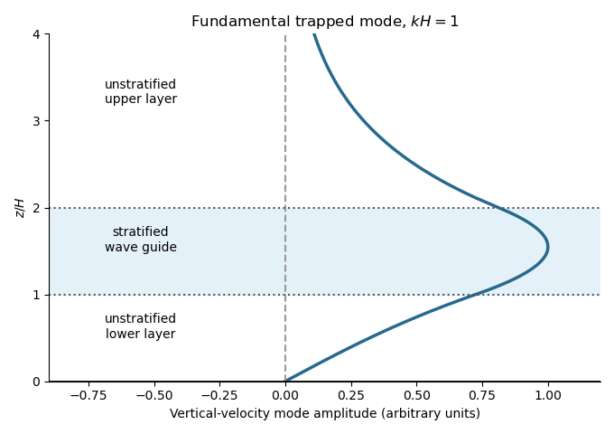

<h1 id="1/c/solution">Solution</h1>

↑ **Parent:** [C](../c.md)

The central stratified layer supports upward and downward [internal gravity waves](../../../../../../internal-wave.md), whose counterpropagating components form a [standing wave](../../../../../../standing-wave.md). The unstratified regions support [evanescent waves](../../../../../../evanescent-wave.md), and the upper disturbance decays as $e^{-k(z-2H)}$. Consequently the central layer is a [stratified internal-wave guide](../../../../../../stratified-internal-wave-guide.md), rather than a source of propagating energy at infinity.

The largest response occurs at its trapped [normal mode](../../../../../../normal-mode.md) [frequencies](../../../../../../frequency.md). They can be specified without solving the forced problem. Set the boundary forcing to zero to find a free [normal mode](../../../../../../normal-mode.md). The lower solution is proportional to $\sinh(kz)$, so continuity of [fluid pressure](../../../../../../fluid-pressure.md) and vertical [velocity](../../../../../../velocity.md) gives

$$
W'(H)=aW(H),\qquad a=k\coth(kH),\qquad W'(2H)=-kW(2H).
$$

In the central layer write

$$
W\propto\sin\bigl(\ell(z-H)+\delta\bigr),\qquad
\delta=\arctan(\ell/a),\qquad
\ell=k\sqrt{N_2^2/\omega^2-1}.
$$

The upper [Robin boundary condition](../../../../../../robin-boundary-condition.md) then gives the exact trapped-mode condition

$$
\boxed{\ell_nH+\arctan(\ell_n/a)+\arctan(\ell_n/k)=n\pi,\qquad
\omega_n=\frac{N_2k}{\sqrt{k^2+\ell_n^2}},\quad n=1,2,\ldots}.
$$

The left side increases strictly from zero to infinity, so there is one positive root for each $n$; the [frequencies](../../../../../../frequency.md) accumulate at zero. This is constructive phase matching after reflection at both ends. The phase shifts from the [evanescent waves](../../../../../../evanescent-wave.md) matter: simply imposing integer half-wavelengths across the stratified layer is generally incorrect.

**In the ideal inviscid model, exact resonant forcing has no bounded steady harmonic solution.** The undamped [normal mode](../../../../../../normal-mode.md) grows secularly under sustained forcing. Weak [viscosity](../../../../../../dynamic-viscosity.md) or other losses would produce large finite peaks near the displayed [frequencies](../../../../../../frequency.md); the linear approximation eventually fails if the disturbance becomes too large.

**[Figure 2](#1/c/image-a-trapped-internal-wave-mode). A trapped internal-wave mode**.

The illustrated free [normal mode](../../../../../../normal-mode.md) has an oscillatory central region and [evanescent wave](../../../../../../evanescent-wave.md) tails. Its lower tail reaches the fixed zero-displacement boundary; its upper tail decays to infinity.

## ↑ Ancestors (11)

1. [C](../c.md)
2. [1](../../1.md)
3. [Paper 345](../../../paper-345-split.md)
4. [Iii](../../../split.md)
5. [2018](../../../../split.md)
6. [Past exam of the mathematics course of the University of Cambridge](../../../../../split.md)
7. [Mathematics course of the University of Cambridge](../../../../../../mathematics-course-of-the-university-of-cambridge.md)
8. [Course of the University of Cambridge](../../../../../../course-of-the-university-of-cambridge.md)
9. [University of Cambridge](../../../../../../university-of-cambridge-split.md)
10. [List of universities](../../../../../../list-of-universities.md)
11. [Codex Wiki](../../../../../../split.md)
