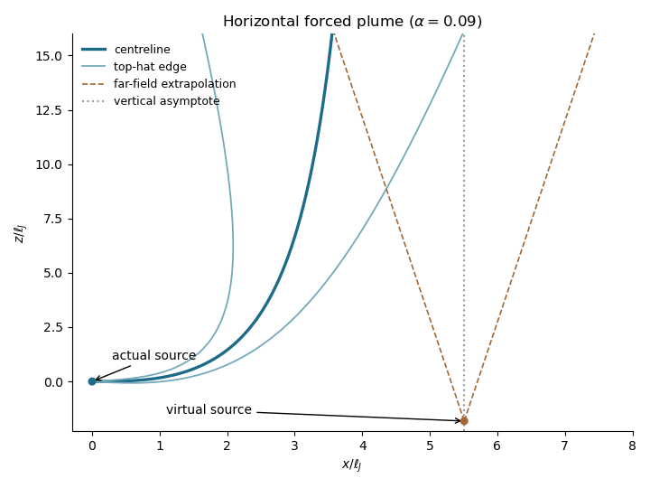

<h1 id="3/d/solution">Solution</h1>

↑ **Parent:** [D](../d.md)

For a horizontal source, $m_x=m_0$ throughout. Far downstream $m_z\gg m_0$, so the [kinematic plume fluxes](../../../../../../kinematic-plume-fluxes.md) obey the vertical [pure plume](../../../../../../pure-plume.md) equations to leading order,

$$
q'=E\sqrt{m_z},\qquad m_z'=f_0q/m_z,\qquad f=f_0.
$$

Set $q=q_*f_0^{1/3}\hat s^{5/3}$ and $m_z=m_*f_0^{2/3}\hat s^{4/3}$ with $\hat s=s+s_0$. Matching exponents and coefficients gives $(5/3)q_*=E\sqrt{m_*}$ and $(4/3)m_*^2=q_*$. Consequently

$$
\boxed{m_*=(9E/20)^{2/3},\qquad q_*=\frac43(9E/20)^{4/3}},
$$

and the requested literal mass and density-weighted [buoyancy fluxes](../../../../../../buoyancy-flux.md) are

$$
\boxed{Q=\rho_0q_*f_0^{1/3}\hat s^{5/3},\qquad
M_z=\rho_0m_*f_0^{2/3}\hat s^{4/3},\qquad F=F_0}
$$

to leading order. The radius is $b\sim(6\alpha/5)\hat s$ and the axial [velocity](../../../../../../velocity.md) decreases as $\hat s^{-1/3}$.

The centreline becomes nearly vertical but retains finite horizontal drift:

$$
\frac{dx}{ds}\sim\frac{m_0}{m_*f_0^{2/3}}\hat s^{-4/3},\qquad
\boxed{x_\infty-x\sim\frac{3m_0}{m_*f_0^{2/3}}\hat s^{-1/3}}.
$$

Since $dz/ds=1-O(\hat s^{-8/3})$, there is a finite positive geometric deficit $D=\lim_{s\to\infty}(s-z)$, and $z=s-D+o(1)$. The equivalent vertical [plume virtual origin](../../../../../../plume-virtual-origin.md) is therefore located at

$$
\boxed{(x_v,z_v)=(x_\infty,-D-s_0)}.
$$

**For the horizontal point-source forced plume, the virtual source is downstream and below the actual source.** The horizontal [turbulent round jet](../../../../../../turbulent-round-jet.md) first entrains substantial ambient fluid while rising only a little. Thus at the height where it turns upward it already has a finite radius and [volume flux](../../../../../../volumetric-flow-rate.md); an equivalent [pure plume](../../../../../../pure-plume.md) must have begun rising from below to acquire these. The turning displacement, entrained radius divided by its far-field spreading angle, and virtual vertical depth all scale as

$$
x_\infty=O(\ell_J),\qquad |z_v|=O(\ell_J),\qquad s_0=O(\ell_J),\qquad
\ell_J=\frac{L_J}{\sqrt{2\alpha\sqrt\pi}}.
$$

At fixed [entrainment coefficient](../../../../../../entrainment-coefficient.md) this is simply $O(L_J)$. The arclength origin $s=-s_0$ should not be interpreted as a physical height: the curved near field supplies the additional shift $D$. The numerical constants depend on the chosen [top-hat plume model](../../../../../../top-hat-plume-model.md) and [entrainment coefficient](../../../../../../entrainment-coefficient.md); scaling does not fix them.

**[Figure 3](#3/d/image-a-horizontal-forced-plume-and-its-far-field-virtual-origin). A horizontal forced plume and its far-field virtual origin**.

The [inclined forced plume](../../../../../../inclined-forced-plume.md) bends from a cubic near-field trajectory toward a vertical asymptote. Dashed far-field spreading lines extrapolate to the equivalent [plume virtual origin](../../../../../../plume-virtual-origin.md); the marked location is obtained from the integral model for this illustration, not a universal numerical prediction.

## ↑ Ancestors (11)

1. [D](../d.md)
2. [3](../../3.md)
3. [Paper 345](../../../paper-345-split.md)
4. [Iii](../../../split.md)
5. [2018](../../../../split.md)
6. [Past exam of the mathematics course of the University of Cambridge](../../../../../split.md)
7. [Mathematics course of the University of Cambridge](../../../../../../mathematics-course-of-the-university-of-cambridge.md)
8. [Course of the University of Cambridge](../../../../../../course-of-the-university-of-cambridge.md)
9. [University of Cambridge](../../../../../../university-of-cambridge-split.md)
10. [List of universities](../../../../../../list-of-universities.md)
11. [Codex Wiki](../../../../../../split.md)
