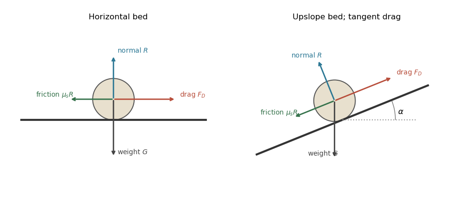

<h1 id="4/a/solution">Solution</h1>

↑ **Parent:** [A](../a.md)

Let $\Delta\rho=\rho_p-\rho_f>0$. A spherical grain has [submerged weight](../../../../../../submerged-weight.md)

$$
G=\frac\pi6\Delta\rho\,gd^3.
$$

Neglect lift and contact torque, and use a sliding [static friction](../../../../../../static-friction.md) model with normal reaction $R=G$. The inertial [quadratic drag](../../../../../../quadratic-drag.md) is

$$
F_D=\frac12C_D\rho_fU^2\frac{\pi d^2}{4}=\frac{C_D\pi d^2}{8}\tau,
$$

where the last equality fixes the convention $\tau=\rho_fU^2$. Equivalently $U$ is the bed [shear velocity](../../../../../../shear-velocity.md) and $C_D$ is an effective [drag coefficient](../../../../../../drag-coefficient.md) referred to it. A literal grain-level flow speed can differ from the [shear velocity](../../../../../../shear-velocity.md); that conversion must then be absorbed into $C_D$.

Downstream sliding begins when $F_D>\mu_sR$. Defining the [Shields parameter](../../../../../../shields-parameter.md) by $\Theta=\tau/(\Delta\rho\,gd)$, the threshold [force balance](../../../../../../force-balance.md) is

$$
\frac{C_D\pi d^2}{8}\tau_{\mathrm{th},0}=\mu_s\frac\pi6\Delta\rho\,gd^3,
\qquad
\boxed{\Theta_{\mathrm{th},0}=\frac{4\mu_s}{3C_D}}.
$$

**The grain moves downstream above this threshold in the stated sliding model.** Real grain motion can instead involve lift, rolling, irregular contacts, or viscous drag; the printed constant belongs to the particular inertial-drag convention and [force balance](../../../../../../force-balance.md) above.

**[Figure 4](#4/a/image-grain-force-balances-on-horizontal-and-inclined-beds). Grain force balances on horizontal and inclined beds**.

The normal contact [force](../../../../../../force.md) and resisting [static friction](../../../../../../static-friction.md) balance the [drag force](../../../../../../drag-physics.md) and [submerged weight](../../../../../../submerged-weight.md) at impending motion. The right panel uses locally bed-tangent [drag force](../../../../../../drag-physics.md).

## ↑ Ancestors (11)

1. [A](../a.md)
2. [4](../../4.md)
3. [Paper 345](../../../paper-345-split.md)
4. [Iii](../../../split.md)
5. [2018](../../../../split.md)
6. [Past exam of the mathematics course of the University of Cambridge](../../../../../split.md)
7. [Mathematics course of the University of Cambridge](../../../../../../mathematics-course-of-the-university-of-cambridge.md)
8. [Course of the University of Cambridge](../../../../../../course-of-the-university-of-cambridge.md)
9. [University of Cambridge](../../../../../../university-of-cambridge-split.md)
10. [List of universities](../../../../../../list-of-universities.md)
11. [Codex Wiki](../../../../../../split.md)
