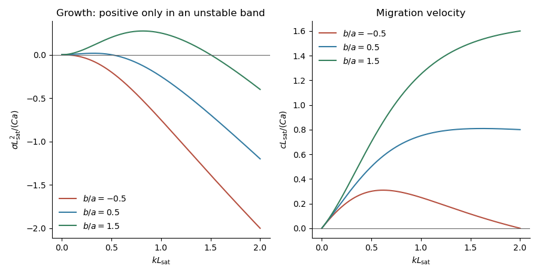

<h1 id="4/d/solution">Solution</h1>

↑ **Parent:** [D](../d.md)

Eliminate the transport amplitudes in the [linear stability analysis](../../../../../../linear-stability.md). For a general [bed shear response](../../../../../../bed-shear-response.md) $\mathcal T(k)$, the [dispersion relation](../../../../../../dispersion-relation.md) is

$$
\boxed{\lambda=\sigma-ikc=-\frac{ikC}{1+ikL_{\mathrm{sat}}}
\left[\mathcal T(k)-\frac{ik\tau_{\mathrm{th},0}}{\mu_s}\right]}.
$$

This is the most specific result available without adding the missing hydrodynamic closure. With $\mathcal T(k)=\tau_0k(A+iB)$, set

$$
a=\tau_0A,\qquad b=\tau_0B-\tau_{\mathrm{th},0}/\mu_s,\qquad x=kL_{\mathrm{sat}},\qquad k>0.
$$

Multiplication by $1-ix$ gives the [growth rate](../../../../../../growth-rate.md) and migration [velocity](../../../../../../velocity.md)

$$
\boxed{\sigma(k)=Ck^2\frac{b-akL_{\mathrm{sat}}}{1+(kL_{\mathrm{sat}})^2},\qquad
c(k)=Ck\frac{a+bkL_{\mathrm{sat}}}{1+(kL_{\mathrm{sat}})^2}}.
$$

The packed-bed volume fraction cancels. For a real physical closure the negative [wavenumber](../../../../../../wavenumber.md) response is the complex conjugate; the displayed $k>0$ formulas cover the independent [normal modes](../../../../../../normal-mode.md).

If $A>0$, $B>0$ are treated as constants, the upstream [shear stress](../../../../../../shear-stress.md) phase lead promotes growth, while the [inclined-bed sediment threshold](../../../../../../inclined-bed-sediment-threshold.md) reduces it and the finite [saturation length](../../../../../../saturation-length.md) delays sediment transport. **There is an unstable band precisely when $b>0$: $0<k<b/(aL_{\mathrm{sat}})$.** Within this band $c>0$, so the growing [bedforms](../../../../../../bedform.md) migrate downstream. The fastest [normal mode](../../../../../../normal-mode.md) satisfies

$$
\boxed{(k_{\max}L_{\mathrm{sat}})^3+3k_{\max}L_{\mathrm{sat}}=2b/a}.
$$

This last maximization assumes constant $A,B$; if the hydrodynamic coefficients vary with [wavenumber](../../../../../../wavenumber.md), their derivatives also enter the selection condition. When $b\leq0$ and $a>0$, all nonzero [normal modes](../../../../../../normal-mode.md) decay.

Just above the [sediment entrainment threshold](../../../../../../sediment-entrainment-threshold.md),

$$
b\simeq\tau_{\mathrm{th},0}(B-1/\mu_s).
$$

Thus the common regime $B<1/\mu_s$ is stable near onset: the slope penalty overwhelms the hydrodynamic phase lead. This conclusion is conditional on that inequality, not universal. For constant $B>0$, instability begins only when $\tau_0>\tau_{\mathrm{th},0}/(\mu_sB)$ as well as $\tau_0>\tau_{\mathrm{th},0}$. The transport sensitivity $C=\chi\gamma\Delta^{\gamma-1}$ vanishes at onset for $\gamma>1$, is finite for $\gamma=1$, and is singular for $0<\gamma<1$. Exactly at threshold, the positive-part transport law needs separate treatment; the above [linearization](../../../../../../linearization.md) with perturbations small compared with $\Delta$ is unavailable.

Far above the [sediment entrainment threshold](../../../../../../sediment-entrainment-threshold.md), $b\simeq\tau_0B$. If $A,B>0$, the unstable cutoff tends to $B/(AL_{\mathrm{sat}})$, and the dominant wavelength is set by the [saturation length](../../../../../../saturation-length.md). Both [growth rate](../../../../../../growth-rate.md) and migration [velocity](../../../../../../velocity.md) scale with $C\tau_0\sim\chi\gamma\tau_0^\gamma$, apart from their length factors. Their numerical values and any detailed dependence on [wavenumber](../../../../../../wavenumber.md) still require a flow closure.

For example, prescribing uniform [shear stress](../../../../../../shear-stress.md) independently of the bed gives $\mathcal T=0$ and

$$
\sigma=-\frac{C\tau_{\mathrm{th},0}}{\mu_s}\frac{k^2}{1+(kL_{\mathrm{sat}})^2}<0.
$$

This equally admissible closure illustrates why instability cannot be asserted from the printed sediment equations alone.

**[Figure 5](#4/d/image-conditional-bedform-growth-and-migration). Conditional bedform growth and migration**.

The plots use constant $a>0$ and three illustrative ratios $b/a$. They show how the sign of the shear phase lead minus the slope correction determines stability; they are not numerical predictions for unspecified flow conditions.

## ↑ Ancestors (11)

1. [D](../d.md)
2. [4](../../4.md)
3. [Paper 345](../../../paper-345-split.md)
4. [Iii](../../../split.md)
5. [2018](../../../../split.md)
6. [Past exam of the mathematics course of the University of Cambridge](../../../../../split.md)
7. [Mathematics course of the University of Cambridge](../../../../../../mathematics-course-of-the-university-of-cambridge.md)
8. [Course of the University of Cambridge](../../../../../../course-of-the-university-of-cambridge.md)
9. [University of Cambridge](../../../../../../university-of-cambridge-split.md)
10. [List of universities](../../../../../../list-of-universities.md)
11. [Codex Wiki](../../../../../../split.md)
