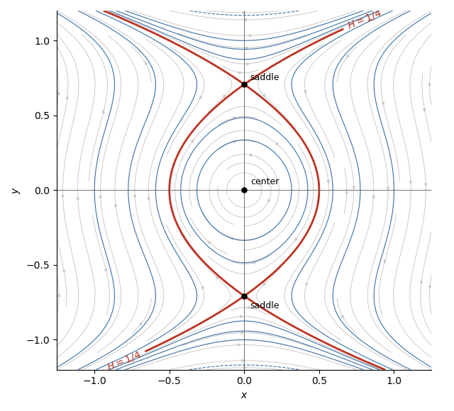

<h1 id="8c/b/solution">Solution</h1>

↑ **Parent:** [B](../b.md)

A [critical point of a dynamical system](../../../../../../equilibrium-point-of-a-dynamical-system.md) satisfies $x=0$ and $y-2y^3=0$, so the critical points are

$$
(0,0),\qquad \left(0,\frac1{\sqrt2}\right),\qquad \left(0,-\frac1{\sqrt2}\right).
$$

The [Jacobian matrix](../../../../../../jacobian-matrix.md) of the vector field is

$$
J(x,y)=\begin{pmatrix}0&1-6y^2\\-1&0\end{pmatrix}.
$$

At the origin its [eigenvalues](../../../../../../eigenvalue.md) are $\pm i$. Moreover, $H=x^2+y^2+O(y^4)$ has a strict local minimum there, so the origin is a stable [center of a planar dynamical system](../../../../../../center-equilibrium.md). At either other critical point,

$$
J=\begin{pmatrix}0&-2\\-1&0\end{pmatrix}
$$

has eigenvalues $\pm\sqrt2$, so both points are unstable [saddle points](../../../../../../saddle-point.md). Their common value $H=1/4$ identifies the special [separatrices](../../../../../../separatrix.md) shown below.

**[Figure 1](#8c/b/image-phase-portrait-and-trajectories-of-the-dynamical-system). Phase portrait and trajectories of the dynamical system**.

## ↑ Ancestors (11)

1. [B](../b.md)
2. [8C](../../8c.md)
3. [Paper 2](../../../paper-2-split.md)
4. [Ia](../../../split.md)
5. [2019](../../../../split.md)
6. [Past exam of the mathematics course of the University of Cambridge](../../../../../split.md)
7. [Mathematics course of the University of Cambridge](../../../../../../mathematics-course-of-the-university-of-cambridge.md)
8. [Course of the University of Cambridge](../../../../../../course-of-the-university-of-cambridge.md)
9. [University of Cambridge](../../../../../../university-of-cambridge-split.md)
10. [List of universities](../../../../../../list-of-universities.md)
11. [Codex Wiki](../../../../../../split.md)
