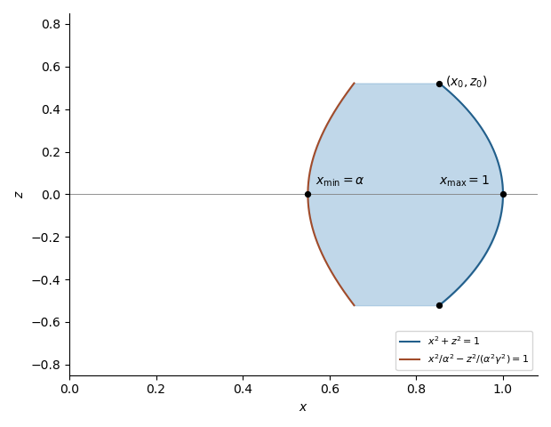

<h1 id="9b/solution">Solution</h1>

↑ **Parent:** [9B](../9b.md)

For the one-to-one transformation $(u,v,w)\mapsto(x,y,z)$, the [Jacobian determinant](../../../../../jacobian-determinant.md) used in the stated formula is

$$
J=\det\frac{\partial(x,y,z)}{\partial(u,v,w)}.
$$

Locally, the derivative maps a small rectangular box of volume $du\,dv\,dw$ to a parallelepiped of volume $|J|\,du\,dv\,dw$. Partitioning the region into such boxes and passing to the [Riemann integral](../../../../../riemann-integral.md) gives the [change of variables formula](../../../../../change-of-variables-formula.md)

$$
\int_Df(x,y,z)\,dx\,dy\,dz
=\int_\Delta |J|f(x(u,v,w),y(u,v,w),z(u,v,w))\,du\,dv\,dw.
$$

In the plane $y=0$, the region is inside the unit circle and on the right-hand side of the hyperbola

$$
x^2+z^2\leq1,
\qquad
\frac{x^2}{\alpha^2}-\frac{z^2}{\alpha^2\gamma^2}\geq1.
$$

It is nonempty exactly when $\alpha\leq1$; it has positive area when $\alpha<1$. In $x>0$, its boundaries are $x=\sqrt{1-z^2}$ and $x=\alpha\sqrt{1+z^2/\gamma^2}$. The minimum and maximum $x$ values are $\alpha$ and $1$, both at $z=0$. The largest absolute $z$ occurs where the boundaries meet:

$$
z_0=\gamma\sqrt{\frac{1-\alpha^2}{1+\gamma^2}},
\qquad
x_0=\sqrt{\frac{1+\alpha^2\gamma^2}{1+\gamma^2}}.
$$

**[Figure 1](#9b/image-cross-section-of-the-integration-region). Cross-section of the integration region**.

Now set $u=x$, $v=y/k$, and $w=z$. The inverse [Jacobian determinant](../../../../../jacobian-determinant.md) is $k$, and in cylindrical coordinates $r^2=u^2+v^2$ the transformed region is

$$
r^2+w^2\leq1,
\qquad
r^2\geq\alpha^2+\frac{w^2}{\gamma^2}.
$$

Thus $|w|\leq z_0$, and each horizontal cross-section is an annulus. Its volume is

$$
\begin{aligned}
\operatorname{Vol}(D)
&=k\pi\int_{-z_0}^{z_0}
\left[1-w^2-\alpha^2-\frac{w^2}{\gamma^2}\right]dw\\
&=\frac{4\pi k}{3}(1-\alpha^2)z_0.
\end{aligned}
$$

Therefore, for $\alpha<1$,

$$
\boxed{\operatorname{Vol}(D)=
\frac{4\pi k\gamma}{3\sqrt{1+\gamma^2}}(1-\alpha^2)^{3/2}}.
$$

For $\alpha=1$ the region has zero volume.

## ↑ Ancestors (10)

1. [9B](../9b.md)
2. [Paper 3](../../paper-3-split.md)
3. [Ia](../../split.md)
4. [2019](../../../split.md)
5. [Past exam of the mathematics course of the University of Cambridge](../../../../split.md)
6. [Mathematics course of the University of Cambridge](../../../../../mathematics-course-of-the-university-of-cambridge.md)
7. [Course of the University of Cambridge](../../../../../course-of-the-university-of-cambridge.md)
8. [University of Cambridge](../../../../../university-of-cambridge-split.md)
9. [List of universities](../../../../../list-of-universities.md)
10. [Codex Wiki](../../../../../split.md)
