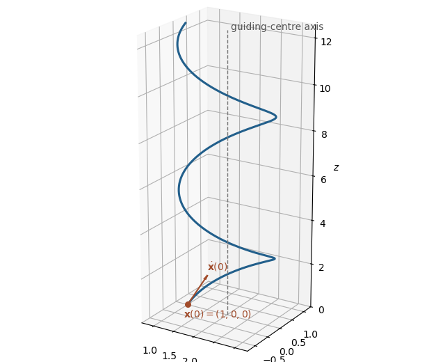

<h1 id="10a/a/solution">Solution</h1>

↑ **Parent:** [A](../a.md)

The [Lorentz force](../../../../../../lorentz-force.md) and [Newton's second law](../../../../../../newton-s-second-law.md) give

$$
m\ddot{\mathbf x}=q\dot{\mathbf x}\times\mathbf B.
$$

Writing $\Omega=qB/m$, the component equations are

$$
\ddot x=\Omega\dot y,\qquad \ddot y=-\Omega\dot x,\qquad \ddot z=0.
$$

The initial [velocity](../../../../../../velocity.md) therefore gives

$$
\dot x=v\sin(\Omega t),\qquad \dot y=v\cos(\Omega t),\qquad \dot z=v,
$$

and integration with the initial [position](../../../../../../position.md) gives

$$
\boxed{\mathbf x(t)=\left(1+\frac v\Omega[1-\cos(\Omega t)],\ \frac v\Omega\sin(\Omega t),\ vt\right)}.
$$

This is [helical motion in a uniform magnetic field](../../../../../../helical-motion-in-a-uniform-magnetic-field.md): a [helix](../../../../../../helix.md) of radius $v/\Omega$ around the line $x=1+v/\Omega$, $y=0$, with its axis parallel to the [magnetic field](../../../../../../magnetic-field.md).

**[Figure 1](#10a/a/image-the-helical-trajectory-of-a-charged-particle-in-a-magnetic-field). The helical trajectory of a charged particle in a magnetic field**.

## ↑ Ancestors (11)

1. [A](../a.md)
2. [10A](../../10a.md)
3. [Paper 4](../../../paper-4-split.md)
4. [Ia](../../../split.md)
5. [2019](../../../../split.md)
6. [Past exam of the mathematics course of the University of Cambridge](../../../../../split.md)
7. [Mathematics course of the University of Cambridge](../../../../../../mathematics-course-of-the-university-of-cambridge.md)
8. [Course of the University of Cambridge](../../../../../../course-of-the-university-of-cambridge.md)
9. [University of Cambridge](../../../../../../university-of-cambridge-split.md)
10. [List of universities](../../../../../../list-of-universities.md)
11. [Codex Wiki](../../../../../../split.md)
