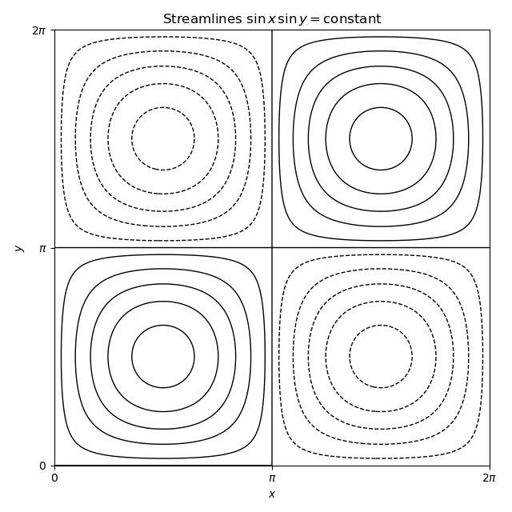

<h1 id="7c/solution">Solution</h1>

↑ **Parent:** [7C](../7c.md)

The velocity field is [incompressible](../../../../../incompressible-flow.md) because

$$
\nabla\cdot\mathbf u
=\frac{\partial u_x}{\partial x}+\frac{\partial u_y}{\partial y}
=\cos x\cos y-\cos x\cos y=0.
$$

With the convention $u_x=\psi_y$ and $u_y=-\psi_x$, a [stream function](../../../../../stream-function.md) is

$$
\boxed{\psi(x,y)=\sin x\sin y}.
$$

The [vorticity](../../../../../vorticity.md) is vertical:

$$
\boldsymbol\omega=\nabla\times\mathbf u
=(0,0,\partial_xu_y-\partial_yu_x)
=\boxed{(0,0,2\sin x\sin y)}=2\psi\,\mathbf e_z.
$$

For a steady inviscid incompressible flow, the [vorticity equation](../../../../../vorticity-equation.md) is $(\mathbf u\cdot\nabla)\boldsymbol\omega=(\boldsymbol\omega\cdot\nabla)\mathbf u$. Here the right side is zero because the flow is independent of $z$, while the left side is $2(\mathbf u\cdot\nabla\psi)\mathbf e_z=0$ because velocity is tangent to the level sets of $\psi$. Thus the equation is satisfied.

The [streamlines](../../../../../streamline.md) are the level curves $\sin x\sin y=\text{constant}$. The lines $x=\pi$ and $y=\pi$, together with the boundary, are separatrices; each of the four cells contains closed nested curves around a centre at $(\pi/2,\pi/2)$, $(3\pi/2,\pi/2)$, $(\pi/2,3\pi/2)$, or $(3\pi/2,3\pi/2)$.

**[Figure 1](#7c/image-streamlines-of-a-cellular-fluid-flow). Streamlines of a cellular fluid flow**.

## ↑ Ancestors (10)

1. [7C](../7c.md)
2. [Paper 2](../../paper-2-split.md)
3. [Ib](../../split.md)
4. [2019](../../../split.md)
5. [Past exam of the mathematics course of the University of Cambridge](../../../../split.md)
6. [Mathematics course of the University of Cambridge](../../../../../mathematics-course-of-the-university-of-cambridge.md)
7. [Course of the University of Cambridge](../../../../../course-of-the-university-of-cambridge.md)
8. [University of Cambridge](../../../../../university-of-cambridge-split.md)
9. [List of universities](../../../../../list-of-universities.md)
10. [Codex Wiki](../../../../../split.md)
