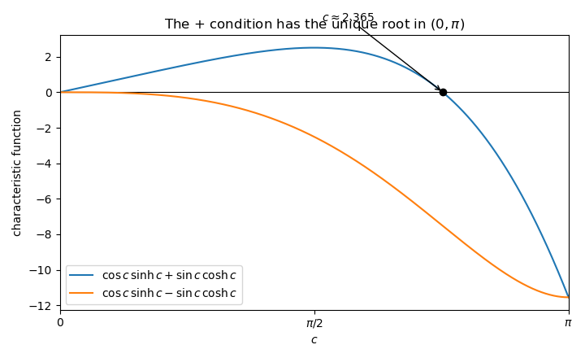
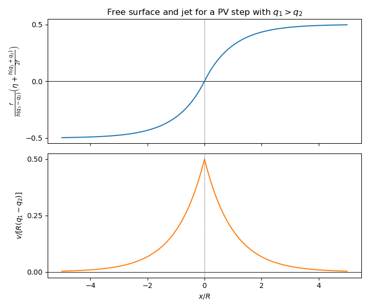

# Paper 4

↑ **Parent:** [Ib](../ib.md)

[https://www.maths.cam.ac.uk/undergrad/pastpapers/files/2019/paperib_4_2019.pdf](https://www.maths.cam.ac.uk/undergrad/pastpapers/files/2019/paperib_4_2019.pdf)

**Table of contents**

- [1F](#1f)
  - [Solution](#1f/solution)
- [2G](#2g)
  - [a](#2g/a)
    - [Solution](#2g/a/solution)
  - [b](#2g/b)
    - [Solution](#2g/b/solution)
- [3E](#3e)
  - [i](#3e/i)
    - [Solution](#3e/i/solution)
  - [ii](#3e/ii)
    - [Solution](#3e/ii/solution)
  - [iii](#3e/iii)
    - [Solution](#3e/iii/solution)
- [4F](#4f)
  - [Solution](#4f/solution)
- [5D](#5d)
  - [Solution](#5d/solution)
- [6B](#6b)
  - [a](#6b/a)
    - [Solution](#6b/a/solution)
  - [b](#6b/b)
    - [Solution](#6b/b/solution)
- [7A](#7a)
  - [Solution](#7a/solution)
- [8C](#8c)
  - [Solution](#8c/solution)
- [9H](#9h)
  - [a](#9h/a)
    - [Solution](#9h/a/solution)
  - [b](#9h/b)
    - [Solution](#9h/b/solution)
- [10F](#10f)
  - [Solution](#10f/solution)
- [11G](#11g)
  - [a](#11g/a)
    - [Solution](#11g/a/solution)
  - [b](#11g/b)
    - [Solution](#11g/b/solution)
  - [c](#11g/c)
    - [Solution](#11g/c/solution)
- [12E](#12e)
  - [a](#12e/a)
    - [i](#12e/a/i)
      - [Solution](#12e/a/i/solution)
    - [ii](#12e/a/ii)
      - [Solution](#12e/a/ii/solution)
  - [b](#12e/b)
    - [i](#12e/b/i)
      - [Solution](#12e/b/i/solution)
    - [ii](#12e/b/ii)
      - [Solution](#12e/b/ii/solution)
    - [iii](#12e/b/iii)
      - [Solution](#12e/b/iii/solution)
- [13G](#13g)
  - [a](#13g/a)
    - [Solution](#13g/a/solution)
  - [b](#13g/b)
    - [Solution](#13g/b/solution)
  - [c](#13g/c)
    - [Solution](#13g/c/solution)
- [14D](#14d)
  - [a](#14d/a)
    - [Solution](#14d/a/solution)
  - [b](#14d/b)
    - [Solution](#14d/b/solution)
  - [c](#14d/c)
    - [Solution](#14d/c/solution)
- [15E](#15e)
  - [a](#15e/a)
    - [Solution](#15e/a/solution)
  - [b](#15e/b)
    - [Solution](#15e/b/solution)
  - [c](#15e/c)
    - [Solution](#15e/c/solution)
  - [d](#15e/d)
    - [Solution](#15e/d/solution)
- [16A](#16a)
  - [a](#16a/a)
    - [Solution](#16a/a/solution)
  - [b](#16a/b)
    - [Solution](#16a/b/solution)
  - [c](#16a/c)
    - [Solution](#16a/c/solution)
- [17B](#17b)
  - [a](#17b/a)
    - [Solution](#17b/a/solution)
  - [b](#17b/b)
    - [Solution](#17b/b/solution)
  - [c](#17b/c)
    - [Solution](#17b/c/solution)
- [18C](#18c)
  - [a](#18c/a)
    - [Solution](#18c/a/solution)
  - [b](#18c/b)
    - [Solution](#18c/b/solution)
  - [c](#18c/c)
    - [Solution](#18c/c/solution)
- [19H](#19h)
  - [a](#19h/a)
    - [Solution](#19h/a/solution)
  - [b](#19h/b)
    - [Solution](#19h/b/solution)
  - [c](#19h/c)
    - [Solution](#19h/c/solution)
- [20H](#20h)
  - [a](#20h/a)
    - [Solution](#20h/a/solution)
  - [b](#20h/b)
    - [i](#20h/b/i)
      - [Solution](#20h/b/i/solution)
    - [ii](#20h/b/ii)
      - [Solution](#20h/b/ii/solution)
    - [iii](#20h/b/iii)
      - [Solution](#20h/b/iii/solution)
  - [c](#20h/c)
    - [Solution](#20h/c/solution)

## 1F

↑ **Parent:** [Paper 4](paper-4.md)

<h3 id="1f/solution">Solution</h3>

↑ **Parent:** [1F](#1f)

An [eigenvalue](../../../linear-operator-theory.md#eigenvalue) of a [matrix](../../../vector-space.md#matrix) $A$ is a [scalar](../../../vector-space.md#scalar) $\lambda$ for which $Av=\lambda v$ for some nonzero [eigenvector](../../../linear-operator-theory.md#eigenvector) $v$. Its corresponding [eigenspace](../../../linear-operator-theory.md#eigenspace) is

$$
E_\lambda=\ker(A-\lambda I).
$$

Write $v=(a,b,c,d)^T$. The displayed matrix is the [outer product](../../../vector-space.md#outer-product) $A=vv^T$, so

$$
Ax=v(v^Tx)=v(v\mathbin{\cdot}x).
$$

Its [column space](../../../vector-space.md#column-space) is contained in $\operatorname{span}\{v\}$ and is nonzero because $Av=\lVert v\rVert^2v\ne0$. Hence $A$ is a [rank-one matrix](../../../vector-space.md#rank-one-matrix).

The vector $v$ is an eigenvector with eigenvalue $\lVert v\rVert^2=a^2+b^2+c^2+d^2$, and every vector in the [orthogonal complement](../../../hilbert-space.md#orthogonal-complement) $v^\perp$ has eigenvalue $0$. Thus

$$
E_{\lVert v\rVert^2}=\operatorname{span}\{v\},
\qquad E_0=v^\perp.
$$

Since $\mathbb R^4=\operatorname{span}\{v\}\oplus v^\perp$ is a [direct sum](../../../vector-space.md#direct-sum) of these eigenspaces, $A$ has an [eigenbasis](../../../linear-operator-theory.md#eigenbasis) and is therefore a [diagonalizable](../../../linear-operator-theory.md#diagonalizable-matrix).

## 2G

↑ **Parent:** [Paper 4](paper-4.md)

<h3 id="2g/a">a</h3>

↑ **Parent:** [2G](#2g)

<h4 id="2g/a/solution">Solution</h4>

↑ **Parent:** [A](#2g/a)

The [normalizer](../../../group-theory.md#normalizer) of $P$ in $G$ is

$$
N_G(P)=\{g\in G:gPg^{-1}=P\}.
$$

It is the stabilizer of the subgroup $P$ under the [conjugation action](../../../group-theory.md#conjugation-action) of $G$ on its subgroups.

<h3 id="2g/b">b</h3>

↑ **Parent:** [2G](#2g)

<h4 id="2g/b/solution">Solution</h4>

↑ **Parent:** [B](#2g/b)

Take $g\in G$. Since $K$ is a [normal subgroup](../../../group-theory.md#normal-subgroup), $gPg^{-1}\leq K$; it has the same order as $P$, so it is also a [Sylow subgroup](../../../finite-group-theory.md#sylow-subgroup) of $K$. The conjugacy assertion in the [Sylow theorems](../../../finite-group-theory.md#sylow-theorems) supplies $k\in K$ such that

$$
k(gPg^{-1})k^{-1}=P.
$$

Consequently $kg\in N_G(P)$, and therefore

$$
g=k^{-1}(kg)\in K N_G(P)=N_G(P)K.
$$

Thus $G\subseteq N_G(P)K$, while the reverse inclusion is immediate because both factors are subgroups of $G$. Hence

$$
\boxed{G=N_G(P)K}.
$$

## 3E

↑ **Parent:** [Paper 4](paper-4.md)

<h3 id="3e/i">i</h3>

↑ **Parent:** [3E](#3e)

<h4 id="3e/i/solution">Solution</h4>

↑ **Parent:** [I](#3e/i)

A sequence of functions $f_n:A\to\mathbb R$ [converges uniformly](../../../real-analysis.md#uniform-convergence) to $f$ when, for every $\varepsilon>0$, there is an $N$ such that

$$
n\geq N\quad\Longrightarrow\quad |f_n(x)-f(x)|<\varepsilon
$$

for every $x\in A$. Equivalently, $\lVert f_n-f\rVert_\infty\to0$ in the [supremum norm](../../../functional-analysis.md#supremum-norm).

**Yes.** Fix $x_0\in A$ and $\varepsilon>0$. Uniform convergence gives $N$ such that $|f_N(x)-f(x)|<\varepsilon/3$ for every $x\in A$. Since the [continuous function](../../../calculus.md#continuous-function) $f_N$ is continuous at $x_0$, there is a $\delta>0$ such that $|x-x_0|<\delta$ implies $|f_N(x)-f_N(x_0)|<\varepsilon/3$. The [triangle inequality](../../../topological-analysis.md#triangle-inequality) then gives

$$
|f(x)-f(x_0)|
\leq |f(x)-f_N(x)|+|f_N(x)-f_N(x_0)|+|f_N(x_0)-f(x_0)|
<\varepsilon.
$$

This proves the [uniform limit theorem](../../../real-analysis.md#uniform-limit-theorem): $f$ is continuous.

<h3 id="3e/ii">ii</h3>

↑ **Parent:** [3E](#3e)

<h4 id="3e/ii/solution">Solution</h4>

↑ **Parent:** [Ii](#3e/ii)

**No.** For each $x>0$, $e^{-nx}\to0$, whereas $e^{-n0}=1$ for every $n$. The [pointwise limit](../../../real-analysis.md#pointwise-convergence) on $[0,1]$ is therefore

$$
f(x)=\begin{cases}1,&x=0,\\0,&x>0.\end{cases}
$$

This limit is not [continuous](../../../calculus.md#continuous-function) at $0$. Since every $f_n(x)=e^{-nx}$ is continuous, the [uniform limit theorem](../../../real-analysis.md#uniform-limit-theorem) rules out uniform convergence. Directly, $|f_n(x)-f(x)|=e^{-nx}$ for $x>0$, whose [supremum](../../../real-analysis.md#supremum) over $(0,1]$ is $1$ for every $n$.

<h3 id="3e/iii">iii</h3>

↑ **Parent:** [3E](#3e)

<h4 id="3e/iii/solution">Solution</h4>

↑ **Parent:** [Iii](#3e/iii)

**No.** Define

$$
f_n(x)=\sqrt{x^2+\frac1n}.
$$

Each $f_n$ is a [differentiable function](../../../analysis.md#differentiable-function) on $[-1,1]$, while

$$
0\leq f_n(x)-|x|
=\frac{1/n}{\sqrt{x^2+1/n}+|x|}
\leq\frac1{\sqrt n}.
$$

**Thus $f_n$ converges uniformly to the [absolute value function](../../../real-analysis.md#absolute-value) $|x|$, which is not differentiable at $0$. Uniform convergence alone therefore does not preserve differentiability.**

## 4F

↑ **Parent:** [Paper 4](paper-4.md)

<h3 id="4f/solution">Solution</h3>

↑ **Parent:** [4F](#4f)

The [Cauchy integral formula](../../../analysis.md#cauchy-integral-formula) says that if $f$ is [holomorphic](../../../complex-analysis.md#holomorphic-function) on a neighbourhood of the closed disc $\overline{D(z_0;R)}$, then for $z\in D(z_0;R)$,

$$
f(z)=\frac1{2\pi i}\int_{|\zeta-z_0|=R}\frac{f(\zeta)}{\zeta-z}\,d\zeta.
$$

In particular, at the centre,

$$
f(z_0)=\frac1{2\pi}\int_0^{2\pi}f(z_0+re^{i\theta})\,d\theta
$$

for every $0<r<R$.

If $f(z_0)=0$, the assumed bound gives $|f(z)|\leq0$, so $f=0$. Otherwise define $g=f/f(z_0)$. Then $g(z_0)=1$ and $|g|\leq1$. Applying the centre formula and taking [real parts](../../../complex-analysis.md#real-part) gives

$$
1=\frac1{2\pi}\int_0^{2\pi}\operatorname{Re}g(z_0+re^{i\theta})\,d\theta,
\qquad \operatorname{Re}g\leq|g|\leq1.
$$

The continuous nonnegative function $1-\operatorname{Re}g$ has integral zero, so it vanishes around the circle. Equality $\operatorname{Re}g=1$ together with $|g|\leq1$ forces $g=1$. This holds for every $r<R$, hence $f(z)=f(z_0)$ throughout the disc. This is the equality case underlying the [maximum modulus principle](../../../complex-analysis.md#maximum-modulus-principle).

## 5D

↑ **Parent:** [Paper 4](paper-4.md)

<h3 id="5d/solution">Solution</h3>

↑ **Parent:** [5D](#5d)

Introduce the [Cauchy approximate identity](../../../fourier-analysis.md#cauchy-approximate-identity)

$$
\delta_\varepsilon(x)=\frac{\varepsilon}{\pi(\varepsilon^2+x^2)}.
$$

It is an [approximate identity](../../../fourier-analysis.md#approximate-identity) converging to the [Dirac delta function](../../../distribution-theory.md#dirac-delta-function) $\delta$, and $g_\varepsilon=\delta_\varepsilon'$. For a smooth rapidly decaying [test function](../../../distribution-theory.md#test-function) $\phi$, [integration by parts](../../../calculus.md#integration-by-parts) gives

$$
\int_{-\infty}^{\infty}\phi(x)g_\varepsilon(x)\,dx
=-\int_{-\infty}^{\infty}\phi'(x)\delta_\varepsilon(x)\,dx
\longrightarrow-\phi'(0).
$$

By the definition of the [derivative of the Dirac delta](../../../distribution-theory.md#derivative-of-the-dirac-delta), $\langle\delta',\phi\rangle=-\phi'(0)$. Therefore the limit as a [distribution](../../../distribution-theory.md#distribution-mathematical-analysis) is

$$
\boxed{g_\varepsilon\longrightarrow\delta'}.
$$

## 6B

↑ **Parent:** [Paper 4](paper-4.md)

<h3 id="6b/a">a</h3>

↑ **Parent:** [6B](#6b)

<h4 id="6b/a/solution">Solution</h4>

↑ **Parent:** [A](#6b/a)

For a [wavefunction](../../../quantum-mechanics.md#wave-function) $\Psi(x,t)$, the [probability density](../../../quantum-mechanics.md#probability-density) and [probability current](../../../quantum-mechanics.md#probability-current) are

$$
\rho=|\Psi|^2,
\qquad
j=\frac{\hbar}{2mi}\left(\Psi^*\frac{\partial\Psi}{\partial x}-\Psi\frac{\partial\Psi^*}{\partial x}\right).
$$

Multiply the [Schrödinger equation](../../../physics.md#schrodinger-equation) by $\Psi^*$, multiply its [complex conjugate](../../../complex-analysis.md#complex-conjugate) by $\Psi$, and subtract. The real [potential energy](../../../classical-mechanics.md#potential-energy) terms cancel, leaving

$$
\frac{\partial|\Psi|^2}{\partial t}
=-\frac{\partial}{\partial x}
\left[\frac{\hbar}{2mi}
\left(\Psi^*\Psi_x-\Psi\Psi_x^*\right)\right],
$$

which is the [probability continuity equation](../../../quantum-mechanics.md#probability-continuity-equation) $\rho_t+j_x=0$.

For a [stationary state](../../../quantum-mechanics.md#stationary-state), $\rho_t=0$, so $j_x=0$ and $j$ is constant in space. A [normalizable wavefunction](../../../quantum-mechanics.md#normalizable-wavefunction) has vanishing current at spatial infinity, forcing this constant to be zero. By contrast the nonnormalizable [plane wave](../../../quantum-mechanics.md#plane-wave)

$$
\Psi(x,t)=A e^{i(kx-\omega t)}
$$

has stationary density $|A|^2$ and nonzero current

$$
\boxed{j=\frac{\hbar k}{m}|A|^2}
$$

when $k\ne0$.

<h3 id="6b/b">b</h3>

↑ **Parent:** [6B](#6b)

<h4 id="6b/b/solution">Solution</h4>

↑ **Parent:** [B](#6b/b)

The [momentum operator](../../../quantum-mechanics.md#momentum-operator) in the position representation is $\widehat p=-i\hbar\,d/dx$. Differentiating the given [Gaussian wave packet](../../../quantum-mechanics.md#gaussian-wave-packet) gives

$$
\frac{d\Psi}{dx}=(-2\alpha x+ik)\Psi,
\qquad
\Psi^*\widehat p\Psi=(2i\hbar\alpha x+\hbar k)|\Psi|^2.
$$

The probability density $|\Psi|^2$ is an [even function](../../../calculus.md#even-function), so the term proportional to the [odd function](../../../calculus.md#odd-function) $x$ has integral zero. Normalization supplies $\int_{-\infty}^{\infty}|\Psi|^2dx=1$, and hence

$$
\boxed{\langle p\rangle=\int_{-\infty}^{\infty}\Psi^*\widehat p\Psi\,dx=\hbar k}.
$$

## 7A

↑ **Parent:** [Paper 4](paper-4.md)

<h3 id="7a/solution">Solution</h3>

↑ **Parent:** [7A](#7a)

In vacuum the [Maxwell equations](../../../electromagnetism.md#maxwell-equations) are

$$
\nabla\mathbin{\cdot}E=0,
\qquad \nabla\mathbin{\cdot}B=0,
\qquad \nabla\times E=-\frac{\partial B}{\partial t},
\qquad \nabla\times B=\frac1{c^2}\frac{\partial E}{\partial t}.
$$

Substitution of the complex [plane electromagnetic wave](../../../electromagnetism.md#plane-electromagnetic-wave) amplitudes into these equations gives

$$
k\mathbin{\cdot}E_0=0,
\qquad
B_0=\frac{k\times E_0}{\omega},
\qquad
\omega^2=c^2|k|^2.
$$

Thus the electric field must be [transverse](../../../wave-equation.md#transverse-polarization) to $k$; taking the positive-frequency branch gives $\omega=c|k|$.

For $E_0=E(1,i,0)$, $k=k\widehat z$, and $\varphi=kz-\omega t$, the real fields are

$$
E(x,t)=E(\cos\varphi,-\sin\varphi,0),
\qquad
B(x,t)=\frac Ec(\sin\varphi,\cos\varphi,0).
$$

The electric vector rotates with constant magnitude, so this is [circular polarization](../../../electromagnetism.md#circular-polarization). Its [Poynting vector](../../../electromagnetism.md#poynting-vector) is

$$
\boxed{S=\frac1{\mu_0}E\times B
=\frac{E^2}{\mu_0c}\widehat z}.
$$

The Poynting vector is the electromagnetic [energy flux](../../../physics.md#energy-flux): its direction is the direction of propagation and its magnitude is the power crossing unit area.

## 8C

↑ **Parent:** [Paper 4](paper-4.md)

<h3 id="8c/solution">Solution</h3>

↑ **Parent:** [8C](#8c)

[Gaussian elimination](../../../numerical-analysis.md#gaussian-elimination) without row exchanges gives the [LU decomposition](../../../numerical-analysis.md#lu-decomposition)

$$
A=LU,
\qquad
L=\begin{pmatrix}
1&0&0&0\\
2&1&0&0\\
1&1&1&0\\
-2&-1&-1&1
\end{pmatrix},
\qquad
U=\begin{pmatrix}
3&2&-3&-3\\
0&-1&-1&-2\\
0&0&-2&1\\
0&0&0&-1
\end{pmatrix}.
$$

Because $L$ has unit diagonal and $U$ is [upper triangular](../../../linear-algebra.md#upper-triangular-matrix),

$$
\boxed{\det A=\det L\det U=3(-1)(-2)(-1)=-6}.
$$

Solving the two triangular systems gives

$$
Ly=b
\quad\Longrightarrow\quad
y=(3,-3,-1,-1)^T,
$$

and

$$
Ux=y
\quad\Longrightarrow\quad
\boxed{x=(3,0,1,1)^T}.
$$

## 9H

↑ **Parent:** [Paper 4](paper-4.md)

<h3 id="9h/a">a</h3>

↑ **Parent:** [9H](#9h)

<h4 id="9h/a/solution">Solution</h4>

↑ **Parent:** [A](#9h/a)

Let $R$ be the number of returns to $v$ after time $0$. Since $v$ is a [recurrent state](../../../markov-process.md#recurrent-state), the probability of another return after each visit is one. By the stated [geometric distribution](../../../discrete-probability-distribution.md#geometric-distribution) description, $\mathbb P_v(R\geq k)=1$ for every positive integer $k$. Thus $R=\infty$ almost surely and $\mathbb E_vR=\infty$.

On the other hand, writing each visit as an [indicator random variable](../../../probability-theory.md#indicator-random-variable) and applying the [monotone convergence theorem](../../../measure-theory.md#monotone-convergence-theorem) to the partial sums gives

$$
1+\mathbb E_vR
=\mathbb E_v\left[\sum_{n=0}^{\infty}\boldsymbol1_{\{X_n=v\}}\right]
=\sum_{n=0}^{\infty}\mathbb P_v(X_n=v)
=\sum_{n=0}^{\infty}p_{vv}(n).
$$

The left side is infinite, proving the [recurrence criterion by return probabilities](../../../markov-process.md#recurrence-criterion-by-return-probabilities) in the required direction:

$$
\boxed{\sum_{n=0}^{\infty}p_{vv}(n)=\infty}.
$$

<h3 id="9h/b">b</h3>

↑ **Parent:** [9H](#9h)

<h4 id="9h/b/solution">Solution</h4>

↑ **Parent:** [B](#9h/b)

By [independence](../../../random-variable.md#independent-random-variables) of the two [simple random walks](../../../markov-process.md#simple-random-walk), [linearity of expectation](../../../probability-theory.md#linearity-of-expectation), and symmetry of their transition probabilities,

$$
\begin{aligned}
\mathbb E Z
&=\sum_{n=0}^{\infty}\mathbb P(X_n=Y_n)\\
&=\sum_{n=0}^{\infty}\sum_{x\in\mathbb Z}p_{0x}(n)^2\\
&=\sum_{n=0}^{\infty}\sum_{x\in\mathbb Z}p_{0x}(n)p_{x0}(n).
\end{aligned}
$$

The [Chapman-Kolmogorov equation](../../../markov-process.md#chapman-kolmogorov-equation) identifies the inner sum as $p_{00}(2n)$, so

$$
\boxed{\mathbb E Z=\sum_{n=0}^{\infty}p_{00}(2n)}.
$$

A [simple random walk on the integer line](../../../markov-process.md#simple-random-walk-on-the-integer-line) can return to $0$ only at an [even](../../../number-theory.md#even-number) time. Since it is recurrent at $0$, part (a) gives

$$
\sum_{m=0}^{\infty}p_{00}(m)=\sum_{n=0}^{\infty}p_{00}(2n)=\infty.
$$

Therefore $\boxed{\mathbb E Z=\infty}$.

## 10F

↑ **Parent:** [Paper 4](paper-4.md)

<h3 id="10f/solution">Solution</h3>

↑ **Parent:** [10F](#10f)

For $u\in U$, define $\phi(u)\in U^*$ by $\phi(u)(u')=\langle u,u'\rangle$. If $\phi(u)=0$, then in particular

$$
0=\phi(u)(u)=\langle u,u\rangle=\lVert u\rVert^2,
$$

so $u=0$. Thus $\phi$ is [injective](../../../algebra.md#injective-function). Since a finite-dimensional vector space and its [dual space](../../../linear-algebra.md#dual-space) have the same [dimension](../../../vector-space.md#dimension-vector-space), $\phi$ is also [surjective](../../../algebra.md#surjective-function) and hence an [isomorphism](../../../algebra.md#isomorphism). This is the finite-dimensional real case of the [Riesz representation theorem](../../../hilbert-space.md#riesz-representation-theorem).

The [adjoint operator](../../../hilbert-space.md#adjoint-operator) of $\alpha:V\to W$ is the unique linear map $\alpha^*:W\to V$ satisfying

$$
\langle\alpha v,w\rangle_W=\langle v,\alpha^*w\rangle_V
$$

for every $v\in V$ and $w\in W$. In the stated [orthonormal bases](../../../linear-algebra.md#orthonormal-basis), if $v$ and $w$ denote coordinate columns, then

$$
\langle Av,w\rangle=(Av)^Tw=v^TA^Tw.
$$

Therefore the matrix of $\alpha^*$ is the [matrix transpose](../../../vector-space.md#transpose) $A^T$.

For $w\in W$,

$$
w\in\ker\alpha^*
\iff \langle v,\alpha^*w\rangle=0\text{ for every }v
\iff \langle\alpha v,w\rangle=0\text{ for every }v
\iff w\in(\operatorname{im}\alpha)^\perp.
$$

Hence $\ker\alpha^*=(\operatorname{im}\alpha)^\perp$. Taking orthogonal complements in the finite-dimensional space $W$ proves the [image-kernel orthogonality for an adjoint](../../../hilbert-space.md#image-kernel-orthogonality-for-an-adjoint)

$$
\boxed{\operatorname{im}\alpha=(\ker\alpha^*)^\perp}.
$$

Put $r=\alpha(v_0)-w_0$. For any $h\in V$,

$$
\lVert\alpha(v_0+h)-w_0\rVert^2
=\lVert r\rVert^2+2\langle r,\alpha h\rangle+\lVert\alpha h\rVert^2.
$$

This is minimized at $h=0$ exactly when $r\perp\operatorname{im}\alpha$, equivalently when $\alpha^*r=0$. Thus the [normal equation for a linear inverse problem](../../../inverse-problem.md#normal-equation-for-a-linear-inverse-problem) is

$$
\boxed{\alpha^*\alpha(v_0)=\alpha^*(w_0)}.
$$

For the given [linear least-squares problem](../../../linear-algebra.md#linear-least-squares-problem),

$$
A^TA=\begin{pmatrix}2&1\\1&2\end{pmatrix},
\qquad
A^Tb=\begin{pmatrix}3\\5\end{pmatrix}.
$$

The normal equations $2x+y=3$ and $x+2y=5$ have the unique solution

$$
\boxed{x=\frac13,\qquad y=\frac73}.
$$

## 11G

↑ **Parent:** [Paper 4](paper-4.md)

<h3 id="11g/a">a</h3>

↑ **Parent:** [11G](#11g)

<h4 id="11g/a/solution">Solution</h4>

↑ **Parent:** [A](#11g/a)

A [Smith normal form](../../../algebra.md#smith-normal-form) of an $m\times n$ matrix $A$ over a [principal ideal domain](../../../commutative-algebra.md#principal-ideal-domain) $R$ is a diagonal matrix

$$
D=UAV=\operatorname{diag}(d_1,\ldots,d_r,0,\ldots,0),
\qquad d_1\mid d_2\mid\cdots\mid d_r,
$$

where $U\in GL_m(R)$ and $V\in GL_n(R)$. It is guaranteed to exist for every matrix over a principal ideal domain. The entries $d_i$ are determined up to multiplication by [units](../../../algebra.md#unit-in-a-ring); over $\mathbb Z$ they are conventionally chosen positive.

<h3 id="11g/b">b</h3>

↑ **Parent:** [11G](#11g)

<h4 id="11g/b/solution">Solution</h4>

↑ **Parent:** [B](#11g/b)

Present a [finitely generated abelian group](../../../group.md#finitely-generated-abelian-group) $G$ as the [cokernel](../../../linear-algebra.md#cokernel) of an integer matrix $A:\mathbb Z^m\to\mathbb Z^n$. Changing $A$ by the invertible row and column operations used in its [Smith normal form](../../../algebra.md#smith-normal-form) does not change the isomorphism type of the cokernel. If

$$
UAV=\operatorname{diag}(d_1,\ldots,d_s,0,\ldots,0),
$$

then

$$
\boxed{G\cong\mathbb Z^r\oplus\mathbb Z/d_1\mathbb Z\oplus\cdots\oplus\mathbb Z/d_s\mathbb Z},
\qquad d_1\mid\cdots\mid d_s,
$$

where factors with $d_i=1$ may be omitted. This is the [Fundamental theorem of finitely generated abelian groups](../../../group.md#fundamental-theorem-of-finitely-generated-abelian-groups); the [rank of an abelian group](../../../group.md#rank-of-an-abelian-group) $r$ and invariant factors $d_i>1$ are unique.

<h3 id="11g/c">c</h3>

↑ **Parent:** [11G](#11g)

<h4 id="11g/c/solution">Solution</h4>

↑ **Parent:** [C](#11g/c)

There are

$$
\boxed{0}
$$

such conjugacy classes. Every matrix in $GL_{10}(\mathbb Q)$ is an [invertible matrix](../../../linear-algebra.md#invertible-matrix), so by the [minimal polynomial of an invertible matrix](../../../linear-operator-theory.md#minimal-polynomial-of-an-invertible-matrix) its minimal polynomial must have nonzero constant term. But

$$
X^7-4X^3=X^3(X^4-4)
$$

has constant term zero and cannot be the minimal polynomial of an invertible matrix.

## 12E

↑ **Parent:** [Paper 4](paper-4.md)

<h3 id="12e/a">a</h3>

↑ **Parent:** [12E](#12e)

<h4 id="12e/a/i">i</h4>

↑ **Parent:** [A](#12e/a)

<h5 id="12e/a/i/solution">Solution</h5>

↑ **Parent:** [I](#12e/a/i)

Let $(x_n)$ be a [Cauchy sequence](../../../real-analysis.md#cauchy-sequence) in a compact metric space $X$. By [sequential compactness of a compact metric space](../../../topological-analysis.md#sequential-compactness-of-a-compact-metric-space), it has a [convergent subsequence](../../../real-analysis.md#convergent-subsequence) $x_{n_j}\to x\in X$. Given $\varepsilon>0$, choose $N$ such that $d(x_m,x_n)<\varepsilon/2$ whenever $m,n\geq N$, and then choose $j$ such that $n_j\geq N$ and $d(x_{n_j},x)<\varepsilon/2$. For every $n\geq N$, the [triangle inequality](../../../topological-analysis.md#triangle-inequality) gives

$$
d(x_n,x)\leq d(x_n,x_{n_j})+d(x_{n_j},x)<\varepsilon.
$$

**Thus the whole sequence converges to $x$. Every Cauchy sequence converges in $X$, so $X$ is a [complete metric space](../../../topological-analysis.md#complete-metric-space).**

<h4 id="12e/a/ii">ii</h4>

↑ **Parent:** [A](#12e/a)

<h5 id="12e/a/ii/solution">Solution</h5>

↑ **Parent:** [Ii](#12e/a/ii)

**No.** Give an infinite set $X$ the [discrete metric](../../../topological-analysis.md#discrete-metric)

$$
d(x,y)=\begin{cases}0,&x=y,\\1,&x\ne y.\end{cases}
$$

This space is bounded. Every Cauchy sequence is eventually constant, so it is complete. However, the open cover by the singleton balls $B_{1/2}(x)=\{x\}$ has no finite subcover. Hence $X$ is not [compact](../../../topology.md#compact-space).

<h3 id="12e/b">b</h3>

↑ **Parent:** [12E](#12e)

<h4 id="12e/b/i">i</h4>

↑ **Parent:** [B](#12e/b)

<h5 id="12e/b/i/solution">Solution</h5>

↑ **Parent:** [I](#12e/b/i)

For any $\varepsilon>0$, the balls $\{B_\varepsilon(x):x\in X\}$ form an [open cover](../../../topology.md#open-cover) of the compact metric space $X$. Compactness supplies a finite subcover

$$
X=B_\varepsilon(x_1)\cup\cdots\cup B_\varepsilon(x_N).
$$

This is exactly [total boundedness](../../../topological-analysis.md#totally-bounded-space).

<h4 id="12e/b/ii">ii</h4>

↑ **Parent:** [B](#12e/b)

<h5 id="12e/b/ii/solution">Solution</h5>

↑ **Parent:** [Ii](#12e/b/ii)

Let $(x_n)$ be any [sequence](../../../real-analysis.md#sequence) in a complete, totally bounded metric space $X$. Cover $X$ by finitely many balls of radius $2^{-1}$; one contains infinitely many terms. From those terms choose an infinite subsequence lying in one ball of radius $2^{-2}$, and continue. The [diagonal argument](../../../foundations-of-mathematics.md#diagonal-argument) produces a subsequence $(x_{n_j})$ whose tail from its $j$th term onward lies in a ball of radius $2^{-j}$. Hence

$$
d(x_{n_k},x_{n_\ell})<2^{1-j}
$$

whenever $k,\ell\geq j$, so the subsequence is Cauchy. Completeness makes it converge in $X$.

Every sequence in $X$ therefore has a convergent subsequence, so $X$ is [sequentially compact](../../../geometry-and-topology.md#sequentially-compact-space). Sequential compactness is equivalent to compactness for metric spaces, and thus $X$ is compact. This proves that a [complete totally bounded metric space is compact](../../../topological-analysis.md#complete-totally-bounded-metric-space-is-compact).

<h4 id="12e/b/iii">iii</h4>

↑ **Parent:** [B](#12e/b)

<h5 id="12e/b/iii/solution">Solution</h5>

↑ **Parent:** [Iii](#12e/b/iii)

The space is not compact because it is not [complete](../../../topological-analysis.md#complete-metric-space). For $n\geq2$, define the continuous function

$$
f_n(t)=\begin{cases}
0,&0\leq t\leq\frac12-\frac1n,\\
\frac n2\left(t-\frac12+\frac1n\right),&\frac12-\frac1n<t<\frac12+\frac1n,\\
1,&\frac12+\frac1n\leq t\leq1.
\end{cases}
$$

These functions converge in the [L1 norm](../../../functional-analysis.md#l1-norm) to the [step function](../../../measure-theory.md#step-function) $h=\boldsymbol1_{(1/2,1]}$, because $f_n-h$ is supported on an interval of length $2/n$ and bounded in [absolute value](../../../real-analysis.md#absolute-value) by one. They are consequently Cauchy for the metric $d$, since for sufficiently close pairs the outer minimum with $1$ does nothing.

If $(f_n)$ converged in this metric to some $f\in C[0,1]$, it would also converge to $f$ in $L^1$. Uniqueness of an $L^1$ limit would give $f=h$ almost everywhere. Continuity would then force $f=0$ on $[0,1/2)$ and $f=1$ on $(1/2,1]$, which is impossible at $1/2$. Thus this Cauchy sequence has no limit in $C[0,1]$, while every compact metric space is complete.

## 13G

↑ **Parent:** [Paper 4](paper-4.md)

<h3 id="13g/a">a</h3>

↑ **Parent:** [13G](#13g)

<h4 id="13g/a/solution">Solution</h4>

↑ **Parent:** [A](#13g/a)

If $A\subseteq X$, the [subspace topology](../../../topology.md#subspace-topology) on $A$ is

$$
\{A\cap U:U\text{ is open in }X\}.
$$

If $\sim$ is an [equivalence relation](../../../set-theory.md#equivalence-relation) on $X$ and $q:X\to X/{\sim}$ is the natural projection, the [quotient topology](../../../topology.md#quotient-topology) declares $V\subseteq X/{\sim}$ open exactly when $q^{-1}(V)$ is open in $X$. For topological spaces $X$ and $Y$, the [product topology](../../../geometry-and-topology.md#product-topology) on $X\times Y$ has as a basis all sets $U\times V$ with $U$ open in $X$ and $V$ open in $Y$.

<h3 id="13g/b">b</h3>

↑ **Parent:** [13G](#13g)

<h4 id="13g/b/solution">Solution</h4>

↑ **Parent:** [B](#13g/b)

A [closed set](../../../topology.md#closed-set) $C\subseteq X$ is compact because it is closed in the compact space $X$. Its image $f(C)$ is compact by the fact that a [continuous image of a compact space](../../../topology.md#continuous-image-of-a-compact-space) is compact, and every compact subset of the [Hausdorff space](../../../topology.md#hausdorff-space) $Y$ is closed. Thus the continuous bijection $f$ is a [closed map](../../../topology.md#closed-map). Its inverse $f^{-1}:Y\to X$ is consequently continuous, so $f$ is a [homeomorphism](../../../topology.md#homeomorphism). This is the [compact-to-Hausdorff continuous bijection theorem](../../../topology.md#compact-to-hausdorff-continuous-bijection-theorem).

<h3 id="13g/c">c</h3>

↑ **Parent:** [13G](#13g)

<h4 id="13g/c/solution">Solution</h4>

↑ **Parent:** [C](#13g/c)

Define a continuous map $F:S\to T$ by the standard [embedded torus of revolution](../../../topology.md#embedded-torus-of-revolution) parametrization

$$
F(s,t)=\bigl((2+\cos2\pi t)\cos2\pi s,
(2+\cos2\pi t)\sin2\pi s,
\sin2\pi t\bigr).
$$

Its image lies in $T$ because

$$
\sqrt{x^2+y^2}=2+\cos2\pi t,
\qquad
(\sqrt{x^2+y^2}-2)^2+z^2=1.
$$

The periodicity of the [trigonometric functions](../../../geometry-and-topology.md#trigonometric-function) makes $F(s,0)=F(s,1)$ and $F(0,t)=F(1,t)$, so $F$ is constant on every $\sim$-equivalence class. The [universal property of the quotient topology](../../../topology.md#universal-property-of-the-quotient-topology) therefore gives a unique continuous map

$$
\overline F:S/{\sim}\longrightarrow T,
\qquad
\overline F([s,t])=F(s,t).
$$

Every point of $T$ has cylindrical radius between $1$ and $3$, so its polar angle determines $s$ modulo one, while the pair $(\sqrt{x^2+y^2}-2,z)$ on the [unit circle](../../../complex-analysis.md#complex-unit-circle) determines $t$ modulo one. Hence $\overline F$ is surjective, and two parameters have the same image exactly when they differ by the endpoint identifications defining $\sim$; thus it is injective.

The quotient $S/{\sim}$ is compact as the continuous image of the given compact space $S$ under the [quotient map](../../../topology.md#quotient-map). The surface $T$ is Hausdorff because it has the [subspace topology](../../../topology.md#subspace-topology) inherited from $\mathbb R^3$. The [compact-to-Hausdorff continuous bijection theorem](../../../topology.md#compact-to-hausdorff-continuous-bijection-theorem) now shows that $\overline F$ is a homeomorphism. Therefore

$$
\boxed{S/{\sim}\cong T}.
$$

## 14D

↑ **Parent:** [Paper 4](paper-4.md)

<h3 id="14d/a">a</h3>

↑ **Parent:** [14D](#14d)

<h4 id="14d/a/solution">Solution</h4>

↑ **Parent:** [A](#14d/a)

The [Bromwich inversion formula](../../../analysis.md#bromwich-inversion-formula) gives

$$
f(t)=\frac1{2\pi i}\int_{\gamma-i\infty}^{\gamma+i\infty}\frac{e^{st}}{s^2}\,ds,
\qquad \gamma>0.
$$

For $t>0$, close the [Bromwich contour](../../../complex-analysis.md#bromwich-contour) in the left half-plane. The only enclosed singularity is the [double pole](../../../isolated-singularity.md#double-pole) at $s=0$, whose [residue](../../../analysis.md#residue) is

$$
\operatorname*{Res}_{s=0}\frac{e^{st}}{s^2}
=\left.\frac d{ds}e^{st}\right|_{s=0}=t.
$$

The [residue theorem](../../../analysis.md#residue-theorem) therefore yields

$$
\boxed{\mathcal L^{-1}\{s^{-2}\}(t)=t}.
$$

<h3 id="14d/b">b</h3>

↑ **Parent:** [14D](#14d)

<h4 id="14d/b/solution">Solution</h4>

↑ **Parent:** [B](#14d/b)

Taking the [Laplace transform](../../../analysis.md#laplace-transform) in $t$ and using the initial condition $u(r,0)=u_0$, the [radial heat equation in three dimensions](../../../diffusion-equation.md#radial-heat-equation-in-three-dimensions) becomes

$$
sU-u_0=\frac1r(rU)_{rr}.
$$

Put $W=rU$ and $q=\sqrt s$. Then

$$
W''-sW=-u_0r,
$$

so

$$
U(r,s)=\frac{u_0}{s}+\frac{A(s)\sinh(qr)+B(s)\cosh(qr)}r.
$$

Finiteness at the centre forces $B(s)=0$.

The transformed boundary condition is

$$
\frac1kU_r(a,s)=\frac{u_0}{s}-U(a,s)-\frac1{s^2}.
$$

Since

$$
U_r(a,s)=A(s)\frac{qa\cosh(qa)-\sinh(qa)}{a^2},
$$

substitution and cancellation of the two $u_0/s$ terms gives

$$
A(s)\left[\frac{qa\cosh(qa)-\sinh(qa)}{ka^2}+\frac{\sinh(qa)}a\right]
=-\frac1{s^2}.
$$

Hence

$$
A(s)=-\frac{ka^2}{s^2\{qa\cosh(qa)+(ka-1)\sinh(qa)\}},
$$

and the required explicit transform is

$$
\boxed{
U(r,s)=\frac{u_0}{s}
-\frac{ka^2\sinh(r\sqrt s)}
{r s^2\{a\sqrt s\cosh(a\sqrt s)+(ka-1)\sinh(a\sqrt s)\}}
}.
$$

<h3 id="14d/c">c</h3>

↑ **Parent:** [14D](#14d)

<h4 id="14d/c/solution">Solution</h4>

↑ **Parent:** [C](#14d/c)

Taking $r\to0$ and using $\sinh(r\sqrt s)/r\to\sqrt s$ gives

$$
U(0,s)=\frac{u_0}{s}
-\frac{ka^2\sqrt s}
{s^2\{a\sqrt s\cosh(a\sqrt s)+(ka-1)\sinh(a\sqrt s)\}}.
$$

Set $x=a\sqrt s$. The [Taylor series](../../../calculus.md#taylor-series) of the denominator is

$$
x\cosh x+(ka-1)\sinh x
=ka\,x+\frac{ka+2}{6}x^3+O(x^5).
$$

Consequently

$$
\frac{ka^2\sqrt s}{a\sqrt s\cosh(a\sqrt s)+(ka-1)\sinh(a\sqrt s)}
=1-\left(\frac{a^2}{6}+\frac{a}{3k}\right)s+O(s^2).
$$

The singular part at $s=0$ is therefore

$$
U(0,s)=-\frac1{s^2}
+\frac1s\left(u_0+\frac{a}{3k}+\frac{a^2}{6}\right)+O(1).
$$

Using [long-time asymptotics from a Laplace transform](../../../analysis.md#long-time-asymptotics-from-a-laplace-transform) and part (a), the centre temperature has late-time behaviour

$$
\boxed{u(0,t)\sim u_0-t+\frac{a}{3k}+\frac{a^2}{6}}.
$$

## 15E

↑ **Parent:** [Paper 4](paper-4.md)

The group

$$
PSL_2(\mathbb R)=SL_2(\mathbb R)/\{\pm I\}
$$

acts on the [Poincaré half-plane model](../../../geometry-and-topology.md#poincare-half-plane-model) by

$$
g(z)=\frac{az+b}{cz+d},
\qquad ad-bc=1.
$$

A direct calculation gives

$$
\operatorname{Im}g(z)=\frac{\operatorname{Im}z}{|cz+d|^2},
\qquad
dg=\frac{dz}{(cz+d)^2}.
$$

Therefore

$$
\frac{|dg|^2}{(\operatorname{Im}g(z))^2}
=\frac{|dz|^2}{(\operatorname{Im}z)^2},
$$

so every element of [PSL2(R)](../../../geometry-and-topology.md#psl2-r) is an isometry of the hyperbolic metric.

<h3 id="15e/a">a</h3>

↑ **Parent:** [15E](#15e)

<h4 id="15e/a/solution">Solution</h4>

↑ **Parent:** [A](#15e/a)

A [Geodesic in the Poincare half-plane model](../../../geometry-and-topology.md#geodesic-in-the-poincare-half-plane-model) is a vertical line or a semicircle orthogonal to the real axis. Given a hyperbolic line $\ell$, choose a real Möbius transformation sending its two ideal endpoints to $0$ and $\infty$. After multiplying its representing matrix by a scalar and, if necessary, changing its sign, it represents an element of $PSL_2(\mathbb R)$ and sends $\ell$ to the positive imaginary axis $\ell_+$.

The chosen point $P\in\ell$ then maps to $iy$ for some $y>0$. The dilation $z\mapsto z/y$, represented by

$$
\begin{pmatrix}y^{-1/2}&0\\0&y^{1/2}\end{pmatrix}\in SL_2(\mathbb R),
$$

fixes $\ell_+$ and sends $iy$ to $i$. Thus every pointed line $(\ell,P)$ can be sent to $(\ell_+,i)$, proving [transitivity on pointed hyperbolic lines](../../../geometry-and-topology.md#transitivity-on-pointed-hyperbolic-lines).

<h3 id="15e/b">b</h3>

↑ **Parent:** [15E](#15e)

<h4 id="15e/b/solution">Solution</h4>

↑ **Parent:** [B](#15e/b)

An orientation-preserving isometry fixing every point of $\ell_+$ fixes more than two points in the upper half-plane and hence, as a [Möbius transformation](../../../group-theory.md#mobius-transformation), is the identity. The map

$$
R(z)=-\overline z
$$

fixes $\ell_+$ pointwise and preserves the hyperbolic metric; it is the [hyperbolic reflection](../../../geometry-and-topology.md#hyperbolic-reflection) in $\ell_+$. Consequently the pointwise stabilizer is exactly

$$
\boxed{\{\operatorname{id},R\}}.
$$

For any isometry $F$, use part (a) to choose $g\in PSL_2(\mathbb R)$ that agrees with $F$ on one pointed line and its tangent direction. Then $g^{-1}F$ fixes that line pointwise, so it is either the identity or its reflection. Hence the [Isometry group of the Poincare half-plane](../../../geometry-and-topology.md#isometry-group-of-the-poincare-half-plane) consists of

$$
z\longmapsto\frac{az+b}{cz+d}
\quad(ad-bc>0)
$$

and

$$
z\longmapsto\frac{a\overline z+b}{c\overline z+d}
\quad(ad-bc<0),
$$

with real coefficients, modulo multiplication of all four coefficients by a nonzero scalar.

<h3 id="15e/c">c</h3>

↑ **Parent:** [15E](#15e)

<h4 id="15e/c/solution">Solution</h4>

↑ **Parent:** [C](#15e/c)

Because the half-plane metric is a [conformal rescaling](../../../differential-geometry.md#conformal-rescaling-of-a-riemannian-metric) of the Euclidean metric, its angles are Euclidean angles. For each $y>0$, the [hyperbolic lines meeting the imaginary axis at a fixed angle](../../../geometry-and-topology.md#hyperbolic-lines-meeting-the-imaginary-axis-at-a-fixed-angle) $\alpha$ at $iy$ are the Euclidean circles

$$
(x-y\cot\alpha)^2+Y^2=y^2\csc^2\alpha,
$$

where $Y$ denotes the vertical coordinate. These circles have centres on the real axis and are therefore hyperbolic lines; varying $y$ gives the required collection.

To construct a triangle, put one vertex at $i$ and a second at $it$ on $\ell_+$, with $t>1$. Draw from these vertices the lines making interior angles $\alpha$ and $\beta$ with $\ell_+$. Their Euclidean centres and radii are

$$
C_1=\cot\alpha,
\quad R_1=\csc\alpha,
\qquad
C_2=-t\cot\beta,
\quad R_2=t\csc\beta.
$$

If their other intersection has angle $\gamma$, the [law of cosines](../../../geometry-and-topology.md#law-of-cosines) in the Euclidean triangle formed by the two centres and that intersection gives

$$
\cos\gamma
=\frac{R_1^2+R_2^2-(C_1-C_2)^2}{2R_1R_2}
=\frac{\sin\alpha\sin\beta}{2}\left(t+\frac1t\right)-\cos\alpha\cos\beta.
$$

Equivalently,

$$
\frac12\left(t+\frac1t\right)
=\frac{\cos\gamma+\cos\alpha\cos\beta}{\sin\alpha\sin\beta}.
$$

The right side is greater than one exactly when $\alpha+\beta+\gamma<\pi$. Since $(t+t^{-1})/2$ ranges continuously and strictly increasingly from $1$ to infinity for $t>1$, such a $t$ exists. The three lines therefore bound a [hyperbolic triangle](../../../geometry-and-topology.md#hyperbolic-triangle) with the prescribed angles.

<h3 id="15e/d">d</h3>

↑ **Parent:** [15E](#15e)

<h4 id="15e/d/solution">Solution</h4>

↑ **Parent:** [D](#15e/d)

**Yes.** By an element of $PSL_2(\mathbb R)$, part (a) puts the side between the $\alpha$- and $\beta$-vertices on $\ell_+$ and the first vertex at $i$. A reflection if needed puts the triangle on the chosen side. The remaining freedom is the ratio $t>1$ of the heights of the second and first vertices, and the equation from part (c) determines it uniquely because $(t+t^{-1})/2$ is strictly increasing on $(1,\infty)$. The two incident circles are then fixed, so their other intersection and the triangle are fixed. Thus triangles with the same three angles are isometric, which is [Hyperbolic AAA congruence](../../../geometry-and-topology.md#hyperbolic-aaa-congruence).

## 16A

↑ **Parent:** [Paper 4](paper-4.md)

<h3 id="16a/a">a</h3>

↑ **Parent:** [16A](#16a)

<h4 id="16a/a/solution">Solution</h4>

↑ **Parent:** [A](#16a/a)

Write the admissible [variation](../../../calculus-of-variations.md#variation) as $y_\varepsilon=y+\varepsilon\eta$, where $\eta(x)\to0$ at both ends. Differentiating the [functional](../../../calculus-of-variations.md#functional) under the integral sign gives the [first variation](../../../calculus-of-variations.md#first-variation)

$$
\delta I[y;\eta]
=\int_{-\infty}^{\infty}
\left(y'\eta'+U(y)U'(y)\eta\right)dx.
$$

After [integration by parts](../../../calculus.md#integration-by-parts), with the boundary term vanishing,

$$
\boxed{\delta I[y;\eta]
=\int_{-\infty}^{\infty}
\left[-y''+U(y)U'(y)\right]\eta\,dx}.
$$

Thus the [Euler-Lagrange equation](../../../analysis.md#euler-lagrange-equation) is

$$
y''=U(y)U'(y).
$$

A second differentiation gives the [second variation](../../../calculus-of-variations.md#second-variation)

$$
\boxed{\delta^2I[y;\eta]
=\int_{-\infty}^{\infty}
\left\{(\eta')^2+\left[U'(y)^2+U(y)U''(y)\right]\eta^2\right\}dx}.
$$

<h3 id="16a/b">b</h3>

↑ **Parent:** [16A](#16a)

<h4 id="16a/b/solution">Solution</h4>

↑ **Parent:** [B](#16a/b)

The integrand

$$
\frac12y'^2+\frac12U(y)^2
$$

is nonnegative, so $I[y]\geq0$. If $I[y]=0$, both continuous summands vanish everywhere. Hence $y'=0$, so $y$ is constant; the common boundary value forces $y(x)=a$. Conversely, $y\equiv a$ has $y'=0$ and $U(a)=0$, so $I[y]=0$. Therefore

$$
\boxed{I[y]=0\iff y(x)=a\text{ for every }x}.
$$

This agrees with part (a): at $y=a$, the first variation vanishes because $y''=U(a)=0$, and

$$
\delta^2I[a;\eta]
=\int_{-\infty}^{\infty}\left[(\eta')^2+U'(a)^2\eta^2\right]dx\geq0.
$$

**Thus the constant configuration is a stationary local minimum as well as the global minimum identified directly.**

<h3 id="16a/c">c</h3>

↑ **Parent:** [16A](#16a)

<h4 id="16a/c/solution">Solution</h4>

↑ **Parent:** [C](#16a/c)

For $U(y)=c^2-y^2$, [completing the square](../../../polynomial.md#completing-the-square) gives the [Bogomolny bound](../../../quantum-field-theory.md#bogomolny-bound)

$$
\begin{aligned}
I[y]
&=\frac12\int_{-\infty}^{\infty}\left[(y'-U(y))^2+2U(y)y'\right]dx\\
&=\frac12\int_{-\infty}^{\infty}(y'-U(y))^2dx
+\int_{-c}^{c}(c^2-y^2)\,dy\\
&=\frac12\int_{-\infty}^{\infty}(y'-U(y))^2dx+\frac{4c^3}{3}.
\end{aligned}
$$

Consequently

$$
\boxed{I[y]\geq\frac{4c^3}{3}},
$$

with equality exactly when the [Bogomolny equation](../../../quantum-field-theory.md#bogomolny-equations)

$$
y'=c^2-y^2
$$

holds everywhere. Separating variables, or differentiating the proposed form directly, gives all solutions with the required limits:

$$
\boxed{y(x)=c\tanh\{c(x-x_0)\}},
\qquad x_0\in\mathbb R.
$$

These are the translated [phi-four kinks](../../../classical-field-theory-soliton.md#phi-four-kink).

Differentiating the first-order equation yields

$$
y''=-2yy'=(-2y)(c^2-y^2)=U'(y)U(y),
$$

which is precisely the Euler-Lagrange equation from part (a). Thus every configuration saturating the first-order bound is automatically a stationary solution of the second-order variational equation.

## 17B

↑ **Parent:** [Paper 4](paper-4.md)

<h3 id="17b/a">a</h3>

↑ **Parent:** [17B](#17b)

<h4 id="17b/a/solution">Solution</h4>

↑ **Parent:** [A](#17b/a)

Let $D=d/dx$. Repeated [integration by parts](../../../calculus.md#integration-by-parts) gives the [formal adjoint](../../../hilbert-space.md#formal-adjoint) rules

$$
D^*= -D,
\qquad
(pD^2)^*=D^2p=pD^2+2p'D+p'',
\qquad
(qD)^*=-Dq=-qD-q'.
$$

Therefore

$$
L^*=D^4+pD^2+(2p'-q)D+(p''-q'+r).
$$

Equality of the coefficients of $D$ in $L$ and $L^*$ requires

$$
q=2p'-q,
$$

so $q=p'$. This also makes the zeroth-order coefficients equal because $p''-q'=0$. Hence, under boundary conditions that remove the boundary terms,

$$
\boxed{L\text{ is self-adjoint}\iff q=p'}.
$$

This is the [self-adjoint fourth-order scalar differential operator](../../../analysis.md#self-adjoint-fourth-order-scalar-differential-operator) $D^4+pD^2+p'D+r$.

<h3 id="17b/b">b</h3>

↑ **Parent:** [17B](#17b)

<h4 id="17b/b/solution">Solution</h4>

↑ **Parent:** [B](#17b/b)

With $q=p'$ and $r=0$, the equation is

$$
y''''+(py')'=\lambda y.
$$

Multiply by the real [eigenfunction](../../../linear-operator-theory.md#eigenfunction) $y$ and integrate over $[a,b]$. The [clamped boundary conditions](../../../differential-equation.md#clamped-boundary-condition) $y=y'=0$ at both endpoints eliminate all boundary terms, so

$$
\lambda\int_a^b y^2dx
=\int_a^b(y'')^2dx-\int_a^b p(x)(y')^2dx.
$$

Since $p(x)<0$, the right side is a sum of nonnegative terms. It cannot vanish for a nonzero eigenfunction: if $y''=y'=0$, the boundary conditions force $y=0$. Thus

$$
\boxed{\lambda
=\frac{\int_a^b\{(y'')^2-p(y')^2\}\,dx}{\int_a^b y^2dx}>0}.
$$

<h3 id="17b/c">c</h3>

↑ **Parent:** [17B](#17b)

<h4 id="17b/c/solution">Solution</h4>

↑ **Parent:** [C](#17b/c)

For $p=0$ and $\lambda=1$, the [linear ordinary differential equation](../../../differential-equation.md#linear-ordinary-differential-equation) is $y''''=y$, whose general solution is

$$
y=A\cos x+B\sin x+C\cosh x+D\sinh x.
$$

By the stated parity reduction, an [even](../../../calculus.md#even-function) eigenfunction has the form $y=A\cos x+C\cosh x$. The conditions $y(c)=y'(c)=0$ have a nonzero solution exactly when

$$
\det\begin{pmatrix}
\cos c&\cosh c\\
-\sin c&\sinh c
\end{pmatrix}=0,
$$

that is,

$$
\cos c\sinh c+\sin c\cosh c=0.
$$

An [odd](../../../calculus.md#odd-function) eigenfunction has the form $y=B\sin x+D\sinh x$, and the corresponding determinant gives

$$
\cos c\sinh c-\sin c\cosh c=0.
$$

Thus $\lambda=1$ is an eigenvalue precisely under one of the two stated conditions.

**[Figure 1](#17b/c/image-the-fourth-order-eigenvalue-condition-and-its-roots). The fourth-order eigenvalue condition and its roots**.

For the minus sign, division by $\cos c\cosh c$ away from $c=\pi/2$ gives $\tan c=\tanh c$. On $(0,\pi/2)$, $\tan c>\tanh c$ for $c>0$, while on $(\pi/2,\pi)$ their signs differ, so there is no root. For the plus sign the equation is

$$
\tan c=-\tanh c.
$$

There is no root in $(0,\pi/2)$. On $(\pi/2,\pi)$, the function $\tan c+\tanh c$ increases strictly from $-\infty$ to $\tanh\pi>0$, so it has exactly one root by the [intermediate value theorem](../../../calculus.md#intermediate-value-theorem). Numerically,

$$
\boxed{c\approx2.365020372}.
$$

**Hence the combined $\pm$ condition has exactly one solution in $0<c<\pi$.**

## 18C

↑ **Parent:** [Paper 4](paper-4.md)

<h3 id="18c/a">a</h3>

↑ **Parent:** [18C](#18c)

<h4 id="18c/a/solution">Solution</h4>

↑ **Parent:** [A](#18c/a)

The constant $f=2\Omega\sin\varphi$ is the positive [Coriolis parameter](../../../geophysical-fluid-dynamics.md#coriolis-parameter) at northern latitude $\varphi$, $g$ is the [gravitational acceleration](../../../classical-mechanics.md#gravitational-acceleration), and $h$ is the undisturbed mean depth of the layer.

The [linearized shallow water equations](../../../physics.md#linearized-shallow-water-equations) assume a homogeneous, incompressible, inviscid layer over a flat bed; a horizontal scale much larger than the depth, so the [shallow-water approximation](../../../physics.md#shallow-water-approximation) and [hydrostatic approximation](../../../fluid-mechanics.md#hydrostatic-approximation) apply; depth-independent horizontal velocity; a free-surface displacement $|\eta|\ll h$ and sufficiently small velocity to neglect nonlinear products; and an [f-plane](../../../geophysical-fluid-dynamics.md#f-plane) on which $f$ is constant. The equations also omit viscosity, forcing, and bottom topography.

<h3 id="18c/b">b</h3>

↑ **Parent:** [18C](#18c)

<h4 id="18c/b/solution">Solution</h4>

↑ **Parent:** [B](#18c/b)

The vertical [relative vorticity](../../../fluid-mechanics.md#relative-vorticity) is

$$
\zeta=v_x-u_y.
$$

Differentiate the $v$-momentum equation with respect to $x$ and the $u$-momentum equation with respect to $y$, then subtract. The mixed pressure derivatives cancel, giving

$$
\zeta_t
=(-fu-g\eta_y)_x-(fv-g\eta_x)_y
=-f(u_x+v_y).
$$

The mass-conservation equation says $\eta_t=-h(u_x+v_y)$. Therefore the linearized [shallow-water potential vorticity](../../../geophysical-fluid-dynamics.md#shallow-water-potential-vorticity)

$$
q=\zeta-\frac fh\eta
$$

satisfies

$$
q_t=\zeta_t-\frac fh\eta_t
=-f(u_x+v_y)+f(u_x+v_y)=0.
$$

Thus

$$
\boxed{\frac{\partial q}{\partial t}=0}.
$$

<h3 id="18c/c">c</h3>

↑ **Parent:** [18C](#18c)

<h4 id="18c/c/solution">Solution</h4>

↑ **Parent:** [C](#18c/c)

For a steady flow independent of $y$, [geostrophic balance](../../../physics.md#geostrophic-balance) gives

$$
u=0,
\qquad
v=\frac gf\frac{d\eta}{dx}.
$$

Hence $\zeta=v_x=(g/f)\eta''$, and the definition of $q$ becomes

$$
q=\frac gf\eta''-\frac fh\eta.
$$

Equivalently,

$$
\boxed{\eta''-\frac{f^2}{gh}\eta=\frac fgq}.
$$

With the [Rossby deformation radius](../../../physics.md#rossby-deformation-radius) $R=\sqrt{gh}/f$, the bounded solution for the stated potential-vorticity step is

$$
\eta(x)=
\begin{cases}
-\dfrac{hq_1}{f}+A e^{x/R},&x<0,\\
-\dfrac{hq_2}{f}+B e^{-x/R},&x>0.
\end{cases}
$$

Continuity of $\eta$ and $v=(g/f)\eta'$ at $x=0$ gives

$$
A=\frac{h(q_1-q_2)}{2f},
\qquad
B=-\frac{h(q_1-q_2)}{2f}.
$$

Therefore

$$
\boxed{
\eta(x)=
\begin{cases}
-\dfrac{hq_1}{f}+\dfrac{h(q_1-q_2)}{2f}e^{x/R},&x<0,\\
-\dfrac{hq_2}{f}-\dfrac{h(q_1-q_2)}{2f}e^{-x/R},&x>0,
\end{cases}}
$$

and

$$
\boxed{v(x)=\frac{R(q_1-q_2)}2e^{-|x|/R}}.
$$

When $q_1>q_2$, the surface height increases smoothly from $-hq_1/f$ to $-hq_2/f$, while $v$ is a positive eastward jet with its maximum at the discontinuity and [exponential decay](../../../analysis.md#exponential-decay) on the Rossby-radius scale:

**[Figure 2](#18c/c/image-free-surface-and-jet-for-a-potential-vorticity-step). Free surface and jet for a potential-vorticity step**.

## 19H

↑ **Parent:** [Paper 4](paper-4.md)

Write

$$
S_{xx}=\sum_{i=1}^n x_i^2,
$$

and assume $S_{xx}>0$ so that $\beta$ is identifiable.

<h3 id="19h/a">a</h3>

↑ **Parent:** [19H](#19h)

<h4 id="19h/a/solution">Solution</h4>

↑ **Parent:** [A](#19h/a)

Apart from terms independent of $\beta$, the Gaussian [log-likelihood](../../../statistical-modelling.md#log-likelihood) is

$$
\ell(\beta,\sigma^2)
=-\frac1{2\sigma^2}\sum_{i=1}^n(Y_i-\beta x_i)^2.
$$

Differentiating with respect to $\beta$ gives

$$
\frac{\partial\ell}{\partial\beta}
=\frac1{\sigma^2}\sum_{i=1}^n x_i(Y_i-\beta x_i).
$$

The unique zero, and hence the [maximum-likelihood estimate](../../../statistical-modelling.md#maximum-likelihood-estimation), is

$$
\boxed{\widehat\beta=\frac{\sum_i x_iY_i}{\sum_i x_i^2}}.
$$

The same value minimizes the [residual sum of squares](../../../linear-regression.md#residual-sum-of-squares) $\sum_i(Y_i-\beta x_i)^2$, since maximizing the Gaussian likelihood for fixed $\sigma^2$ is equivalent to minimizing this sum. It is therefore also the [least-squares estimator](../../../statistical-modelling.md#linear-regression-through-the-origin).

<h3 id="19h/b">b</h3>

↑ **Parent:** [19H](#19h)

<h4 id="19h/b/solution">Solution</h4>

↑ **Parent:** [B](#19h/b)

For this model, the [Gauss-Markov theorem](../../../statistical-modelling.md#gauss-markov-theorem) states that $\widehat\beta$ is the unique minimum-variance [linear unbiased estimator](../../../statistical-modelling.md#linear-unbiased-estimator) of $\beta$: if

$$
\widetilde\beta=\sum_{i=1}^n a_iY_i
$$

is unbiased for every $\beta$, then $\operatorname{var}(\widetilde\beta)\geq\operatorname{var}(\widehat\beta)$.

Indeed,

$$
\mathbb E\widetilde\beta
=\beta\sum_i a_ix_i,
$$

so unbiasedness is equivalent to $\sum_i a_ix_i=1$. Write

$$
a_i=\frac{x_i}{S_{xx}}+c_i.
$$

The constraint becomes $\sum_i c_ix_i=0$. Since the errors are [independent](../../../random-variable.md#independent-random-variables) with common variance $\sigma^2$,

$$
\begin{aligned}
\operatorname{var}(\widetilde\beta)
&=\sigma^2\sum_i a_i^2\\
&=\sigma^2\left(\frac1{S_{xx}}+\frac2{S_{xx}}\sum_i c_ix_i+\sum_i c_i^2\right)\\
&=\frac{\sigma^2}{S_{xx}}+\sigma^2\sum_i c_i^2\\
&\geq\frac{\sigma^2}{S_{xx}}
=\operatorname{var}(\widehat\beta).
\end{aligned}
$$

Equality holds exactly when every $c_i=0$, which gives $a_i=x_i/S_{xx}$ and $\widetilde\beta=\widehat\beta$.

<h3 id="19h/c">c</h3>

↑ **Parent:** [19H](#19h)

<h4 id="19h/c/solution">Solution</h4>

↑ **Parent:** [C](#19h/c)

Any unbiased linear estimator has the form considered in part (b), and its error is the [linear combination of independent normal random variables](../../../probability-theory.md#linear-combination-of-independent-normal-random-variables)

$$
\widetilde\beta-\beta=\sum_i a_i\varepsilon_i
\sim N\left(0,\sigma^2\sum_i a_i^2\right).
$$

The [moment-generating function of a normal distribution](../../../probability-theory.md#moment-generating-function-of-a-normal-distribution) therefore gives, for every nonzero real $\theta$,

$$
\mathbb E_{\beta,\sigma^2}
\left[e^{\theta(\widetilde\beta-\beta)}\right]
=\exp\left(\frac{\theta^2\sigma^2}{2}\sum_i a_i^2\right).
$$

Since the [exponential function](../../../calculus.md#exponential-function) is strictly increasing and $\theta^2\sigma^2/2>0$, minimizing this [exponential moment](../../../probability-theory.md#exponential-moment) is exactly the same as minimizing $\sum_i a_i^2$. Part (b) shows that the unique minimizer is $a_i=x_i/S_{xx}$. Thus, independently of the sign or magnitude of $\theta$,

$$
\boxed{\widetilde\beta
=\widehat\beta
=\frac{\sum_i x_iY_i}{\sum_i x_i^2}}.
$$

## 20H

↑ **Parent:** [Paper 4](paper-4.md)

<h3 id="20h/a">a</h3>

↑ **Parent:** [20H](#20h)

<h4 id="20h/a/solution">Solution</h4>

↑ **Parent:** [A](#20h/a)

The [max-flow min-cut theorem](../../../graph-theory.md#max-flow-min-cut-theorem) states that in a finite [flow network](../../../graph-theory.md#flow-network), the maximum value of a feasible source-to-sink flow equals the minimum capacity of a source-to-sink [cut](../../../graph-theory.md#cut-of-a-flow-network).

First consider any feasible flow $f$ and any cut $(A,V\setminus A)$ with $S\in A$ and $T\notin A$. Summing [flow conservation](../../../graph-theory.md#flow-conservation) over the vertices in $A$ cancels all contributions from edges internal to $A$ and gives

$$
|f|
=\sum_{u\in A,v\notin A}f(u,v)
-\sum_{u\notin A,v\in A}f(u,v)
\leq\sum_{u\in A,v\notin A}c(u,v)
=c(A,V\setminus A).
$$

Thus every flow value is at most every cut capacity.

A maximum flow exists because the feasible flows form a nonempty compact subset of a finite-dimensional Euclidean space and the flow value is continuous. Let $f$ be maximum and form its [residual network](../../../graph-theory.md#residual-network). If there were an [augmenting path](../../../graph-theory.md#augmenting-path) from $S$ to $T$, increasing $f$ by the path's positive bottleneck capacity would contradict maximality. Let $A$ be the set of vertices reachable from $S$ in the residual network. Then $T\notin A$. Every original edge from $A$ to its complement is saturated, while every original edge entering $A$ carries zero flow; otherwise the corresponding forward or reverse residual edge would make its other endpoint reachable. Consequently

$$
|f|
=\sum_{u\in A,v\notin A}c(u,v)
=c(A,V\setminus A).
$$

The general upper bound is attained by this flow and cut, proving the theorem.

<h3 id="20h/b">b</h3>

↑ **Parent:** [20H](#20h)

<h4 id="20h/b/i">i</h4>

↑ **Parent:** [B](#20h/b)

<h5 id="20h/b/i/solution">Solution</h5>

↑ **Parent:** [I](#20h/b/i)

Starting from zero, one valid run of the [Ford-Fulkerson algorithm](../../../graph-theory.md#ford-fulkerson-algorithm) augments along

$$
\begin{aligned}
S\to a\to d\to T &\quad\text{by }1,\\
S\to b\to d\to T &\quad\text{by }2,\\
S\to b\to e\to T &\quad\text{by }1,\\
S\to c\to e\to T &\quad\text{by }4.
\end{aligned}
$$

The resulting nonzero edge flows are

$$
\begin{array}{c|ccccccccc}
\text{edge}&Sa&Sb&Sc&ad&bd&be&ce&dT&eT\\ \hline
\text{flow}&1&3&4&1&2&1&4&3&5
\end{array}
$$

and they obey every [capacity constraint](../../../graph-theory.md#capacity-constraint) and every flow-conservation equation. The flow value is

$$
\boxed{|f|=1+3+4=8}.
$$

<h4 id="20h/b/ii">ii</h4>

↑ **Parent:** [B](#20h/b)

<h5 id="20h/b/ii/solution">Solution</h5>

↑ **Parent:** [Ii](#20h/b/ii)

After these augmentations, the vertices reachable from $S$ in the [residual network](../../../graph-theory.md#residual-network) are

$$
A=\{S,a,c\}.
$$

The edges leaving this set are $S\to b$, $a\to d$, and $c\to e$, with capacities $3$, $1$, and $4$. Hence

$$
c(A,V\setminus A)=3+1+4=8.
$$

The flow in part (i) has the same value, so the [max-flow min-cut theorem](../../../graph-theory.md#max-flow-min-cut-theorem) proves that it is maximum and that this cut is minimum.

<h4 id="20h/b/iii">iii</h4>

↑ **Parent:** [B](#20h/b)

<h5 id="20h/b/iii/solution">Solution</h5>

↑ **Parent:** [Iii](#20h/b/iii)

The maximum flow is not unique. For any $x\in[1,2]$, set

$$
f(Sa)=f(ad)=1,
\qquad f(Sb)=3,
\qquad f(Sc)=f(ce)=4,
$$

and split the flow from $b$ by

$$
f(bd)=x,
\qquad f(be)=3-x.
$$

Flow conservation then requires

$$
f(dT)=1+x,
\qquad f(eT)=7-x.
$$

All capacities are respected precisely throughout the displayed interval, and every member of this one-parameter family has value $8$. For example, $x=1$ and $x=2$ give distinct maximum flows.

<h3 id="20h/c">c</h3>

↑ **Parent:** [20H](#20h)

<h4 id="20h/c/solution">Solution</h4>

↑ **Parent:** [C](#20h/c)

Assume the capacities are integers and begin with the zero flow. Inductively, if every edge flow is an integer, then every forward residual capacity $c(u,v)-f(u,v)$ and reverse residual capacity $f(u,v)$ is an integer. The bottleneck on an [augmenting path](../../../graph-theory.md#augmenting-path) is therefore a positive integer. Augmenting by it changes every affected edge flow by an integer, so all edge flows remain integral.

Each augmentation raises the flow value by at least one. On the other hand, every feasible flow satisfies

$$
|f|\leq\sum_{v}c(S,v),
$$

and the right side is a finite integer because the network is finite. There can therefore be only finitely many augmentations. When the algorithm stops, no augmenting path remains, and the source-reachable cut in the residual network has capacity equal to the current flow value. The [max-flow min-cut theorem](../../../graph-theory.md#max-flow-min-cut-theorem) proves that the terminating flow is maximum. This proves both termination and the [Integrality of the Ford-Fulkerson algorithm](../../../graph-theory.md#integrality-of-the-ford-fulkerson-algorithm).

## ↑ Ancestors (8)

1. [Ib](../ib.md)
2. [2019](../../2019.md)
3. [Past exam of the mathematics course of the University of Cambridge](../../../past-exam-of-the-mathematics-course-of-the-university-of-cambridge.md)
4. [Mathematics course of the University of Cambridge](../../../university-of-cambridge.md#mathematics-course-of-the-university-of-cambridge)
5. [Course of the University of Cambridge](../../../university-of-cambridge.md#course-of-the-university-of-cambridge)
6. [University of Cambridge](../../../university-of-cambridge.md)
7. [List of universities](../../../README.md#list-of-universities)
8. [Codex Wiki](../../../README.md)
