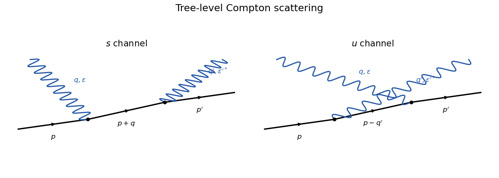
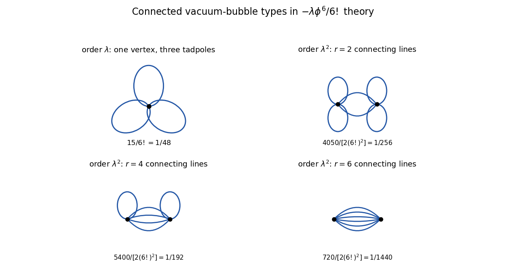

# Paper 301

↑ **Parent:** [Iii](../iii.md)

[https://www.maths.cam.ac.uk/postgrad/part-iii/files/pastpapers/2019/paper_301.pdf](https://www.maths.cam.ac.uk/postgrad/part-iii/files/pastpapers/2019/paper_301.pdf)

**Table of contents**

- [1](#1)
  - [i](#1/i)
    - [Solution](#1/i/solution)
  - [ii](#1/ii)
    - [a](#1/ii/a)
      - [Solution](#1/ii/a/solution)
    - [b](#1/ii/b)
      - [Solution](#1/ii/b/solution)
    - [c](#1/ii/c)
      - [Solution](#1/ii/c/solution)
    - [d](#1/ii/d)
      - [Solution](#1/ii/d/solution)
    - [e](#1/ii/e)
      - [Solution](#1/ii/e/solution)
- [2](#2)
  - [i](#2/i)
    - [Solution](#2/i/solution)
  - [ii](#2/ii)
    - [Solution](#2/ii/solution)
  - [iii](#2/iii)
    - [Solution](#2/iii/solution)
  - [iv](#2/iv)
    - [Solution](#2/iv/solution)
- [3](#3)
  - [i](#3/i)
    - [Solution](#3/i/solution)
  - [ii](#3/ii)
    - [Solution](#3/ii/solution)
  - [iii](#3/iii)
    - [Solution](#3/iii/solution)
  - [iv](#3/iv)
    - [a](#3/iv/a)
      - [Solution](#3/iv/a/solution)
    - [b](#3/iv/b)
      - [Solution](#3/iv/b/solution)
    - [c](#3/iv/c)
      - [Solution](#3/iv/c/solution)
    - [d](#3/iv/d)
      - [Solution](#3/iv/d/solution)
- [4](#4)
  - [i](#4/i)
    - [Solution](#4/i/solution)
  - [ii](#4/ii)
    - [Solution](#4/ii/solution)
  - [iii](#4/iii)
    - [Solution](#4/iii/solution)

## 1

↑ **Parent:** [Paper 301](paper-301.md)

<h3 id="1/i">i</h3>

↑ **Parent:** [1](#1)

<h4 id="1/i/solution">Solution</h4>

↑ **Parent:** [I](#1/i)

A spacetime translation $x^\mu\mapsto x^\mu+\epsilon^\mu$ gives, by [Noether theorem](../../../calculus-of-variations.md#noether-theorem), the [canonical stress-energy tensor](../../../quantum-field-theory.md#canonical-stress-energy-tensor)

$$
\boxed{T^{\mu\nu}=\partial^\mu\phi\,\partial^\nu\phi
-\eta^{\mu\nu}\mathcal L.}
$$

The [Klein-Gordon equation](../../../wave-equation.md#klein-gordon-equation) implies $\partial_\mu T^{\mu\nu}=0$. With canonical momentum $\pi=\dot\phi$, the conserved physical three-momentum is

$$
\boxed{\mathbf P=\int d^3x\,T^{0i}\mathbf e_i
=-\int d^3x\,\pi(\mathbf x)\boldsymbol\nabla\phi(\mathbf x).}
$$

The minus sign follows from $\partial^i=-\partial_i$ for metric signature $(+---)$.

<h3 id="1/ii">ii</h3>

↑ **Parent:** [1](#1)

<h4 id="1/ii/a">a</h4>

↑ **Parent:** [Ii](#1/ii)

<h5 id="1/ii/a/solution">Solution</h5>

↑ **Parent:** [A](#1/ii/a)

Insert the [mode expansion of a free field](../../../quantum-field-theory.md#mode-expansion-of-a-free-field) into the classical expression for $\mathbf P$. The $aa$ and $a^\dagger a^\dagger$ terms cancel after $\mathbf p\mapsto-\mathbf p$, while the mixed terms give, after the stated [normal ordering](../../../perturbative-quantum-field-theory.md#normal-ordering),

$$
\boxed{\mathbf P=\int\frac{d^3p}{(2\pi)^3}\,
\mathbf p\,a_{\mathbf p}^\dagger a_{\mathbf p}.}
$$

Thus the momentum operator counts each occupied mode with weight $\mathbf p$.

<h4 id="1/ii/b">b</h4>

↑ **Parent:** [Ii](#1/ii)

<h5 id="1/ii/b/solution">Solution</h5>

↑ **Parent:** [B](#1/ii/b)

Using $[AB,C]=A[B,C]+[A,C]B$ and the canonical commutator,

$$
[\mathbf P,a_{\mathbf q}^\dagger]
=\int\frac{d^3p}{(2\pi)^3}\mathbf p\,
a_{\mathbf p}^\dagger[a_{\mathbf p},a_{\mathbf q}^\dagger]
=\boxed{\mathbf q\,a_{\mathbf q}^\dagger}.
$$

<h4 id="1/ii/c">c</h4>

↑ **Parent:** [Ii](#1/ii)

<h5 id="1/ii/c/solution">Solution</h5>

↑ **Parent:** [C](#1/ii/c)

The iterated commutators are

$$
[-i\mathbf P\cdot\mathbf y,a_{\mathbf q}^\dagger]
=-i\mathbf q\cdot\mathbf y\,a_{\mathbf q}^\dagger,
$$

so the [Baker--Campbell--Hausdorff formula](../../../linear-operator-theory.md#baker-campbell-hausdorff-formula) gives

$$
\boxed{e^{-i\mathbf P\cdot\mathbf y}a_{\mathbf q}^\dagger
 e^{i\mathbf P\cdot\mathbf y}
=e^{-i\mathbf q\cdot\mathbf y}a_{\mathbf q}^\dagger.}
$$

<h4 id="1/ii/d">d</h4>

↑ **Parent:** [Ii](#1/ii)

<h5 id="1/ii/d/solution">Solution</h5>

↑ **Parent:** [D](#1/ii/d)

The vacuum has zero momentum and is invariant under translations. Hence

$$
e^{-i\mathbf P\cdot\mathbf y}|\mathbf q\rangle
=e^{-i\mathbf P\cdot\mathbf y}a_{\mathbf q}^\dagger
 e^{i\mathbf P\cdot\mathbf y}|0\rangle
=\boxed{e^{-i\mathbf q\cdot\mathbf y}|\mathbf q\rangle}.
$$

Thus a one-particle [momentum eigenstate](../../../quantum-mechanics.md#momentum-eigenstate) remains the same ray and acquires the translation phase appropriate to its momentum.

<h4 id="1/ii/e">e</h4>

↑ **Parent:** [Ii](#1/ii)

<h5 id="1/ii/e/solution">Solution</h5>

↑ **Parent:** [E](#1/ii/e)

Similarly $[\mathbf P,a_{\mathbf p}]=-\mathbf p,a_{\mathbf p}$. Transforming both terms of the field expansion gives

$$
\boxed{e^{-i\mathbf P\cdot\mathbf y}\phi(\mathbf x)
 e^{i\mathbf P\cdot\mathbf y}=\phi(\mathbf x+\mathbf y).}
$$

Therefore the [spatial translation operator](../../../quantum-mechanics.md#spatial-translation-operator) generated by $\mathbf P$ translates the field argument. Equivalently, its action on states translates a wavefunction in the opposite argument convention.

## 2

↑ **Parent:** [Paper 301](paper-301.md)

<h3 id="2/i">i</h3>

↑ **Parent:** [2](#2)

<h4 id="2/i/solution">Solution</h4>

↑ **Parent:** [I](#2/i)

With all momenta incoming and Fourier convention $e^{-ikx}$, differentiating the scalar contributes $-ik_\mu$. The sole interaction vertex is therefore

$$
\boxed{\bar\psi\psi\phi:\quad -\lambda\gamma^\mu k_\mu=-\lambda\not k,}
$$

where $k$ enters on the scalar line; reversing the convention reverses the irrelevant overall sign. The free internal lines use the [Dirac propagator](../../../quantum-field-theory.md#dirac-propagator)

$$
\frac{i(\not p+m)}{p^2-m^2+i\epsilon}
$$

and the scalar [Feynman propagator](../../../quantum-field-theory.md#feynman-propagator) $i/(p^2-\mu^2+i\epsilon)$. Momentum is conserved at the vertex.

**[Figure 1](#2/i/image-derivative-scalar-current-vertex-and-scalar-decay-cut-diagram). Derivative scalar-current vertex and scalar decay cut diagram**. The scalar momentum enters a derivative vertex on an oriented fermion line. The decay amplitude and its conjugate vanish because the scalar momentum contracts the conserved on-shell Dirac current.

<h3 id="2/ii">ii</h3>

↑ **Parent:** [2](#2)

<h4 id="2/ii/solution">Solution</h4>

↑ **Parent:** [Ii](#2/ii)

In four spacetime dimensions $[\psi]=3/2$, $[\phi]=1$, and $[\partial_\mu]=1$. Hence

$$
[\bar\psi\gamma^\mu\psi\,\partial_\mu\phi]=5,
\qquad\boxed{[\lambda]=-1.}
$$

The coupling is an [irrelevant coupling](../../../perturbative-quantum-field-theory.md#irrelevant-coupling) by [power counting in quantum field theory](../../../perturbative-quantum-field-theory.md#power-counting-in-quantum-field-theory), so it is a [nonrenormalizable interaction](../../../perturbative-quantum-field-theory.md#nonrenormalizable-interaction) that would ordinarily define only an effective theory with a cutoff. Here it is also a [redundant operator](../../../perturbative-quantum-field-theory.md#redundant-operator): integration by parts gives $\lambda\phi\,\partial_\mu j^\mu$ up to a boundary term, and the [Dirac current](../../../quantum-field-theory.md#dirac-current) $j^\mu=\bar\psi\gamma^\mu\psi$ is conserved. This [derivative coupling to a conserved current](../../../quantum-field-theory.md#derivative-coupling-to-a-conserved-current) is removed exactly by the local phase redefinition $\psi=e^{-i\lambda\phi}\chi$.

<h3 id="2/iii">iii</h3>

↑ **Parent:** [2](#2)

<h4 id="2/iii/solution">Solution</h4>

↑ **Parent:** [Iii](#2/iii)

The tree amplitude is, up to an overall convention-dependent sign,

$$
\mathcal M=-\lambda\bar u(q_2)\not p\,v(q_1),
\qquad p=q_1+q_2.
$$

The [Clifford algebra](../../../algebra.md#clifford-algebra) gives the momentum-space [Dirac equation](../../../relativistic-quantum-field.md#dirac-equation) and its adjoint:

$$
\not q_1v(q_1)=-m v(q_1),
\qquad \bar u(q_2)\not q_2=m\bar u(q_2).
$$

Therefore

$$
\mathcal M=-\lambda\bar u(q_2)(\not q_1+\not q_2)v(q_1)=0.
$$

Although $\mu>2m$ permits the [relativistic two-body decay](../../../special-relativity.md#relativistic-two-body-decay) kinematically, the matrix element vanishes. Thus

$$
\boxed{\sum_{\rm spins}|\mathcal M|^2=0,
\qquad \Gamma(\phi\to\bar\psi\psi)=0.}
$$

<h3 id="2/iv">iv</h3>

↑ **Parent:** [2](#2)

<h4 id="2/iv/solution">Solution</h4>

↑ **Parent:** [Iv](#2/iv)

Every scalar-fermion vertex contracts the scalar momentum with the [Dirac current](../../../quantum-field-theory.md#dirac-current). Between on-shell external spinors,

$$
(p'-p)_\mu\bar u(p')\gamma^\mu u(p)
=\bar u(p')(\not p'-\not p)u(p)=0,
$$

and the analogous particle-antiparticle identity also vanishes. Equivalently, the field redefinition in the previous part turns the theory into a free theory. Consequently every putative tree channel for $\psi\bar\psi\to\psi\bar\psi$ has zero amplitude and

$$
\boxed{\overline{|\mathcal M|^2}=0,
\qquad \sigma(\psi\bar\psi\to\psi\bar\psi)=0.}
$$

## 3

↑ **Parent:** [Paper 301](paper-301.md)

<h3 id="3/i">i</h3>

↑ **Parent:** [3](#3)

<h4 id="3/i/solution">Solution</h4>

↑ **Parent:** [I](#3/i)

For metric $\eta^{\mu\nu}=\operatorname{diag}(1,-1,-1,-1)$, the defining [Clifford algebra](../../../algebra.md#clifford-algebra) relation is

$$
\boxed{\{\gamma^\mu,\gamma^\nu\}
=\gamma^\mu\gamma^\nu+\gamma^\nu\gamma^\mu
=2\eta^{\mu\nu}\mathbf1_4.}
$$

<h3 id="3/ii">ii</h3>

↑ **Parent:** [3](#3)

<h4 id="3/ii/solution">Solution</h4>

↑ **Parent:** [Ii](#3/ii)

A positive-frequency on-shell [Dirac spinor](../../../relativistic-quantum-field.md#dirac-spinor) obeys

$$
\boxed{(\not p-m)u(s,p)=0,
\qquad p^0=+\sqrt{\mathbf p^2+m^2}.}
$$

<h3 id="3/iii">iii</h3>

↑ **Parent:** [3](#3)

<h4 id="3/iii/solution">Solution</h4>

↑ **Parent:** [Iii](#3/iii)

With $D_\mu=\partial_\mu+ieA_\mu$ and $F_{\mu\nu}=\partial_\mu A_\nu-\partial_\nu A_\mu$, the [quantum electrodynamics](../../../perturbative-quantum-field-theory.md#quantum-electrodynamics) Lagrangian is

$$
\boxed{\mathcal L
=-\frac14F_{\mu\nu}F^{\mu\nu}
+\bar\psi(i\gamma^\mu D_\mu-m)\psi
=-\frac14F^2+\bar\psi(i\not\partial-m)\psi
-e\bar\psi\gamma^\mu\psi A_\mu.}
$$

<h3 id="3/iv">iv</h3>

↑ **Parent:** [3](#3)

<h4 id="3/iv/a">a</h4>

↑ **Parent:** [Iv](#3/iv)

<h5 id="3/iv/a/solution">Solution</h5>

↑ **Parent:** [A](#3/iv/a)

The required [QED Feynman rules](../../../perturbative-quantum-field-theory.md#qed-feynman-rules) are the electron-photon vertex $-ie\gamma^\mu$, the internal electron propagator

$$
\frac{i(\not k+m)}{k^2-m^2+i\epsilon},
$$

the external spinors $u(p,s)$ and $\bar u(p',s')$, and photon factors $\epsilon_{\rm in}^\nu$ and $\epsilon_{\rm out}^{*\mu}$. Momentum conservation is imposed at both vertices.

<h4 id="3/iv/b">b</h4>

↑ **Parent:** [Iv](#3/iv)

<h5 id="3/iv/b/solution">Solution</h5>

↑ **Parent:** [B](#3/iv/b)

There are two [tree-level Feynman diagrams](../../../perturbative-quantum-field-theory.md#tree-level-feynman-diagram) for [Compton scattering](../../../physics.md#compton-scattering): an $s$-channel ordering in which the electron first absorbs the incoming photon, with internal momentum $p+q$, and a crossed $u$-channel ordering in which it first emits the outgoing photon, with internal momentum $p-q'$.

**[Figure 2](#3/iv/b/image-tree-level-compton-scattering-diagrams). Tree-level Compton-scattering diagrams**. The two orderings of photon absorption and emission give the electron-exchange s-channel and u-channel diagrams.

<h4 id="3/iv/c">c</h4>

↑ **Parent:** [Iv](#3/iv)

<h5 id="3/iv/c/solution">Solution</h5>

↑ **Parent:** [C](#3/iv/c)

Multiplying the [QED Feynman rules](../../../perturbative-quantum-field-theory.md#qed-feynman-rules) in fermion-line order gives, up to the common convention for $i\mathcal M$,

$$
\boxed{
\mathcal M=-e^2\bar u(p')\left[
\not\!\epsilon_{\rm out}^{,*}
\frac{\not p+\not q+m}{s-m^2}
\not\!\epsilon_{\rm in}
+
\not\!\epsilon_{\rm in}
\frac{\not p-\not q'+m}{u-m^2}
\not\!\epsilon_{\rm out}^{,*}
\right]u(p).}
$$

The two terms are both required by the [Ward identity](../../../perturbative-quantum-field-theory.md#ward-identity); replacing either external polarization by its photon momentum makes their sum vanish after using momentum conservation and the external [Dirac equations](../../../relativistic-quantum-field.md#dirac-equation).

<h4 id="3/iv/d">d</h4>

↑ **Parent:** [Iv](#3/iv)

<h5 id="3/iv/d/solution">Solution</h5>

↑ **Parent:** [D](#3/iv/d)

Average over the two initial electron spins and two initial photon polarizations, and sum over the final ones. The supplied [fermion spin sum](../../../relativistic-quantum-field.md#fermion-spin-sum) and photon polarization sum turn the result into [gamma-matrix traces](../../../relativistic-quantum-field.md#gamma-matrix-trace). The [Clifford algebra](../../../algebra.md#clifford-algebra) implies

$$
\gamma_\mu\not a\gamma^\mu=-2\not a,
\qquad
\gamma_\mu\not a\not b\gamma^\mu=4a\cdot b,
$$

by anticommuting the outside matrix through the product. Together with

$$
\operatorname{tr}(\not a\not b\not c\not d)
=4(a\cdot b\,c\cdot d-a\cdot c\,b\cdot d+a\cdot d\,b\cdot c),
$$

the two channel squares reduce, at $m=0$, to $-2e^4u/s$ and $-2e^4s/u$; the remaining cross terms cancel. Thus, in terms of the [Mandelstam variables](../../../special-relativity.md#mandelstam-variables),

$$
\boxed{\overline{|\mathcal M|^2}
=-2e^4\left(\frac{s}{u}+\frac{u}{s}\right).}
$$

Physical Compton kinematics has $s>0$ and $u<0$, so the displayed expression is nonnegative.

## 4

↑ **Parent:** [Paper 301](paper-301.md)

<h3 id="4/i">i</h3>

↑ **Parent:** [4](#4)

<h4 id="4/i/solution">Solution</h4>

↑ **Parent:** [I](#4/i)

For bosonic fields, [time ordering](../../../perturbative-quantum-field-theory.md#time-ordering) places operators with later time arguments to the left:

$$
T\{\phi_1\cdots\phi_n\}
=\phi_{\pi(1)}\cdots\phi_{\pi(n)},
\qquad t_{\pi(1)}\geq\cdots\geq t_{\pi(n)}.
$$

[Normal ordering](../../../perturbative-quantum-field-theory.md#normal-ordering) places all creation operators to the left of all annihilation operators and is denoted by colons. A [Wick contraction](../../../perturbative-quantum-field-theory.md#wick-contraction) is

$$
\operatorname{contr}(\phi_i,\phi_j)
=\langle0|T\{\phi_i\phi_j\}|0\rangle
=D_F(x_i-x_j).
$$

[Wick theorem](../../../perturbative-quantum-field-theory.md#wick-s-theorem) states

$$
\boxed{T\{\phi_1\cdots\phi_n\}
=:\!\phi_1\cdots\phi_n\!:
+\sum_{\text{single contractions}}:\!\cdots\!:
+\sum_{\text{double contractions}}:\!\cdots\!:+\cdots,}
$$

where each sum runs over inequivalent disjoint pairings and contracted fields are replaced by their [Feynman propagator](../../../quantum-field-theory.md#feynman-propagator).

<h3 id="4/ii">ii</h3>

↑ **Parent:** [4](#4)

<h4 id="4/ii/solution">Solution</h4>

↑ **Parent:** [Ii](#4/ii)

Write each free field as creation and annihilation parts, $\phi_i=\phi_i^-+\phi_i^+$. Moving every annihilation part to the right produces commutators $[\phi_i^+,\phi_j^-]$, which are precisely the contractions. Applying the $n=2$ identity once and then normal ordering the remaining field gives

$$
\boxed{
T\{\phi_1\phi_2\phi_3\}
=:\!\phi_1\phi_2\phi_3\!:
+D_F(x_1-x_2):\!\phi_3\!:
+D_F(x_1-x_3):\!\phi_2\!:
+D_F(x_2-x_3):\!\phi_1\!: .}
$$

No double contraction is possible for three fields. This is exactly [Wick theorem](../../../perturbative-quantum-field-theory.md#wick-s-theorem) at $n=3$.

<h3 id="4/iii">iii</h3>

↑ **Parent:** [4](#4)

<h4 id="4/iii/solution">Solution</h4>

↑ **Parent:** [Iii](#4/iii)

For [Phi-six theory](../../../scalar-field-theory.md#phi-six-theory), let $D_0=D_F(0)$ and $D_{xy}=D_F(x-y)$. The [Dyson series](../../../perturbative-quantum-field-theory.md#dyson-series) gives

$$
Z[0]=\langle0|T\{S\}|0\rangle
=1-\frac{i\lambda}{6!}\int d^4x\,\langle\phi(x)^6\rangle_0
+\frac{(-i\lambda)^2}{2(6!)^2}\int d^4x\,d^4y\,
\langle\phi(x)^6\phi(y)^6\rangle_0+O(\lambda^3).
$$

At one vertex, [Wick theorem](../../../perturbative-quantum-field-theory.md#wick-s-theorem) supplies $5!!=15$ pairings. At two vertices let $r$ be the number of propagators joining them. It must be $0,2,4,$ or $6$, and the number of contractions is

$$
N_r=\binom6r^2r!\bigl((5-r)!!\bigr)^2,
\qquad
(N_0,N_2,N_4,N_6)=(225,4050,5400,720).
$$

Therefore

$$
\boxed{
\begin{aligned}
Z[0]={}&1-\frac{i\lambda}{48}\int d^4x\,D_0^3\\
&+(-i\lambda)^2\int d^4x\,d^4y\left[
\frac{D_0^6}{4608}
+\frac{D_0^4D_{xy}^2}{256}
+\frac{D_0^2D_{xy}^4}{192}
+\frac{D_{xy}^6}{1440}
\right]+O(\lambda^3).
\end{aligned}}
$$

The four [Vacuum Feynman diagram](../../../perturbative-quantum-field-theory.md#vacuum-feynman-diagram) types are shown below. The $r=0$ term is two disconnected copies of the order-$\lambda$ three-tadpole graph; the other three are connected.

**[Figure 3](#4/iii/image-vacuum-diagrams-in-phi-six-theory-through-second-order). Vacuum diagrams in phi-six theory through second order**. At first order one six-valent vertex is paired into three tadpoles. At second order the two vertices can have two, four, or six connecting propagators, with the remaining legs paired into tadpoles.

Define

$$
B_1=-\frac{i\lambda}{48}\int d^4x\,D_0^3
$$

and let $B_2$ be the sum of the $r=2,4,6$ terms in the second line. The disconnected $r=0$ contribution is exactly $B_1^2/2$. Hence

$$
\boxed{Z[0]=\exp\{B_1+B_2+O(\lambda^3)\},}
$$

which is the [linked-cluster theorem](../../../perturbative-quantum-field-theory.md#linked-cluster-theorem): the logarithm of the vacuum amplitude is the sum of connected vacuum bubbles.

## ↑ Ancestors (8)

1. [Iii](../iii.md)
2. [2019](../../2019.md)
3. [Past exam of the mathematics course of the University of Cambridge](../../../past-exam-of-the-mathematics-course-of-the-university-of-cambridge.md)
4. [Mathematics course of the University of Cambridge](../../../university-of-cambridge.md#mathematics-course-of-the-university-of-cambridge)
5. [Course of the University of Cambridge](../../../university-of-cambridge.md#course-of-the-university-of-cambridge)
6. [University of Cambridge](../../../university-of-cambridge.md)
7. [List of universities](../../../README.md#list-of-universities)
8. [Codex Wiki](../../../README.md)
