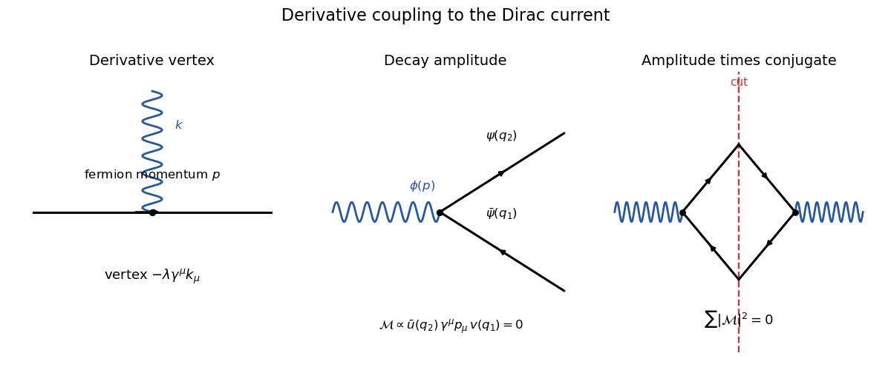

<h1 id="2/i/solution">Solution</h1>

↑ **Parent:** [I](../i.md)

With all momenta incoming and Fourier convention $e^{-ikx}$, differentiating the scalar contributes $-ik_\mu$. The sole interaction vertex is therefore

$$
\boxed{\bar\psi\psi\phi:\quad -\lambda\gamma^\mu k_\mu=-\lambda\not k,}
$$

where $k$ enters on the scalar line; reversing the convention reverses the irrelevant overall sign. The free internal lines use the [Dirac propagator](../../../../../../dirac-propagator.md)

$$
\frac{i(\not p+m)}{p^2-m^2+i\epsilon}
$$

and the scalar [Feynman propagator](../../../../../../feynman-propagator.md) $i/(p^2-\mu^2+i\epsilon)$. Momentum is conserved at the vertex.

**[Figure 1](#2/i/image-derivative-scalar-current-vertex-and-scalar-decay-cut-diagram). Derivative scalar-current vertex and scalar decay cut diagram**. The scalar momentum enters a derivative vertex on an oriented fermion line. The decay amplitude and its conjugate vanish because the scalar momentum contracts the conserved on-shell Dirac current.

## ↑ Ancestors (11)

1. [I](../i.md)
2. [2](../../2.md)
3. [Paper 301](../../../paper-301-split.md)
4. [Iii](../../../split.md)
5. [2019](../../../../split.md)
6. [Past exam of the mathematics course of the University of Cambridge](../../../../../split.md)
7. [Mathematics course of the University of Cambridge](../../../../../../mathematics-course-of-the-university-of-cambridge.md)
8. [Course of the University of Cambridge](../../../../../../course-of-the-university-of-cambridge.md)
9. [University of Cambridge](../../../../../../university-of-cambridge-split.md)
10. [List of universities](../../../../../../list-of-universities.md)
11. [Codex Wiki](../../../../../../split.md)
