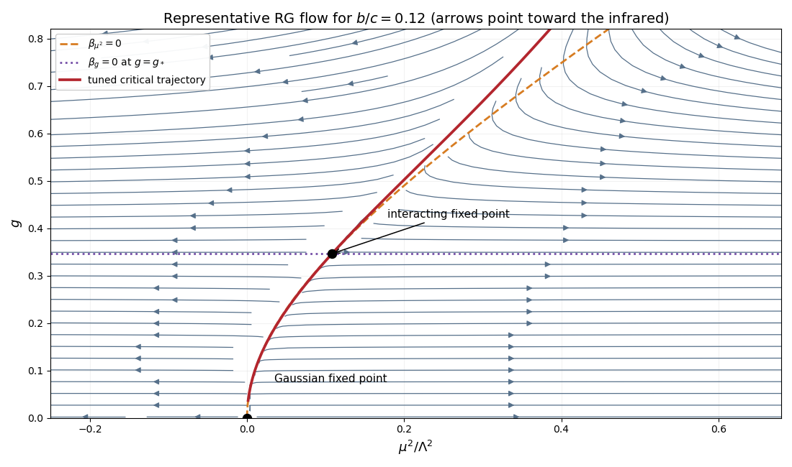

<h1 id="3/iv/solution">Solution</h1>

↑ **Parent:** [Iv](../iv.md)

Besides $g=0$, the coupling beta function vanishes at

$$
g_*^2=\frac bc.
$$

The mass fixed-point equation is

$$
\mu_*^2(\Lambda^2+\mu_*^2)=\Lambda^4g_*^2,
$$

so the root continuously connected to the origin is

$$
\boxed{\frac{\mu_*^2}{\Lambda^2}
=\frac{-1+\sqrt{1+4b/c}}2
=\frac bc+O\left(\frac{b^2}{c^2}\right),
\qquad g_*^2=\frac bc.}
$$

Perturbation theory requires **$b/c\ll1$**, ensuring that the fixed-point coupling is small and the omitted higher powers are suppressed.

**[Figure 1](#3/iv/image-renormalization-group-flow-near-the-gaussian-and-interacting-fixed-points). Renormalization-group flow near the Gaussian and interacting fixed points**. The arrows point toward the infrared. The Gaussian fixed point lies at the origin, the interacting fixed point lies at positive mass and coupling, and the red tuned critical trajectory connects their neighborhoods. Flows away from that trajectory leave along the relevant mass direction.

For increasing infrared scale $s$, positive $g<g_*$ flows upward toward $g_*$ and $g>g_*$ flows downward toward it. The mass direction remains relevant, so only the tuned critical trajectory reaches the interacting fixed point; trajectories on either side leave toward the two phases.

The relevant thermal [eigenvalue](../../../../../../eigenvalue.md) is obtained from the [stability matrix of a renormalization-group fixed point](../../../../../../stability-matrix-of-a-renormalization-group-fixed-point.md) by differentiating the mass beta function:

$$
y_t=\left.\frac{\partial\beta_{\mu^2}}{\partial\mu^2}\right|_*
=2+\frac{2\Lambda^4g_*^2}{(\Lambda^2+\mu_*^2)^2}
=2+2g_*^2+O(g_*^4).
$$

It follows that

$$
\boxed{\nu_*=\frac1{y_t}
=\frac1{2+2g_*^2}+O(g_*^4)
=\frac12\left(1-\frac bc\right)
+O\left(\frac{b^2}{c^2}\right).}
$$

## ↑ Ancestors (11)

1. [Iv](../iv.md)
2. [3](../../3.md)
3. [Paper 303](../../../paper-303-split.md)
4. [Iii](../../../split.md)
5. [2019](../../../../split.md)
6. [Past exam of the mathematics course of the University of Cambridge](../../../../../split.md)
7. [Mathematics course of the University of Cambridge](../../../../../../mathematics-course-of-the-university-of-cambridge.md)
8. [Course of the University of Cambridge](../../../../../../course-of-the-university-of-cambridge.md)
9. [University of Cambridge](../../../../../../university-of-cambridge-split.md)
10. [List of universities](../../../../../../list-of-universities.md)
11. [Codex Wiki](../../../../../../split.md)
