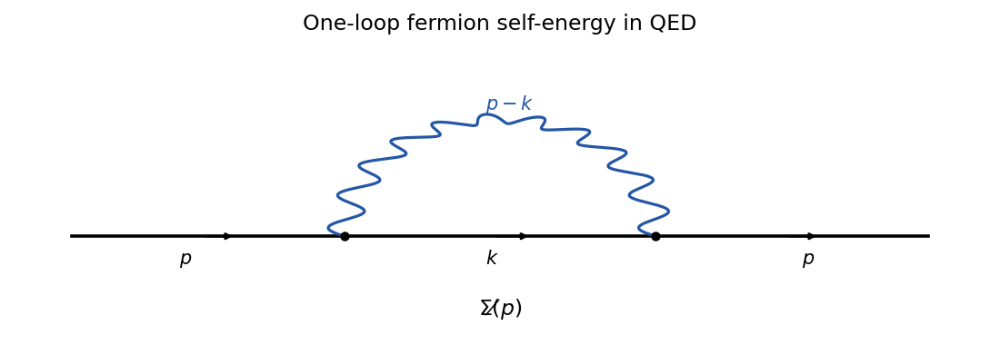

<h1 id="3/b/solution">Solution</h1>

↑ **Parent:** [B](../b.md)

The one-loop graph is a fermion line that emits and reabsorbs one internal photon:

**[Figure 1](#3/b/image-one-loop-qed-fermion-self-energy). One-loop QED fermion self-energy**. An external fermion of momentum p emits an internal photon of momentum p minus k, propagates with loop momentum k, and reabsorbs the photon.

The [QED Feynman rules](../../../../../../qed-feynman-rules.md) assign $(-ie\gamma^\mu)(-ie\gamma^\nu)$ to the two vertices, the [Feynman-gauge photon propagator](../../../../../../feynman-gauge-photon-propagator.md) contracts $\mu$ and $\nu$ and contributes $\delta_{\mu\nu}/(p-k)^2$, and the internal [Dirac propagator](../../../../../../dirac-propagator.md) is $(-i\not k+m)/(k^2+m^2)$. Hence

$$
\boxed{\Sigma(\not p)=(-ie)^2\int\frac{d^4k}{(2\pi)^4}
\gamma^\mu\frac{-i\not k+m}{k^2+m^2}\gamma_\mu
\frac1{(p-k)^2}.}
$$

## ↑ Ancestors (11)

1. [B](../b.md)
2. [3](../../3.md)
3. [Paper 304](../../../paper-304-split.md)
4. [Iii](../../../split.md)
5. [2019](../../../../split.md)
6. [Past exam of the mathematics course of the University of Cambridge](../../../../../split.md)
7. [Mathematics course of the University of Cambridge](../../../../../../mathematics-course-of-the-university-of-cambridge.md)
8. [Course of the University of Cambridge](../../../../../../course-of-the-university-of-cambridge.md)
9. [University of Cambridge](../../../../../../university-of-cambridge-split.md)
10. [List of universities](../../../../../../list-of-universities.md)
11. [Codex Wiki](../../../../../../split.md)
