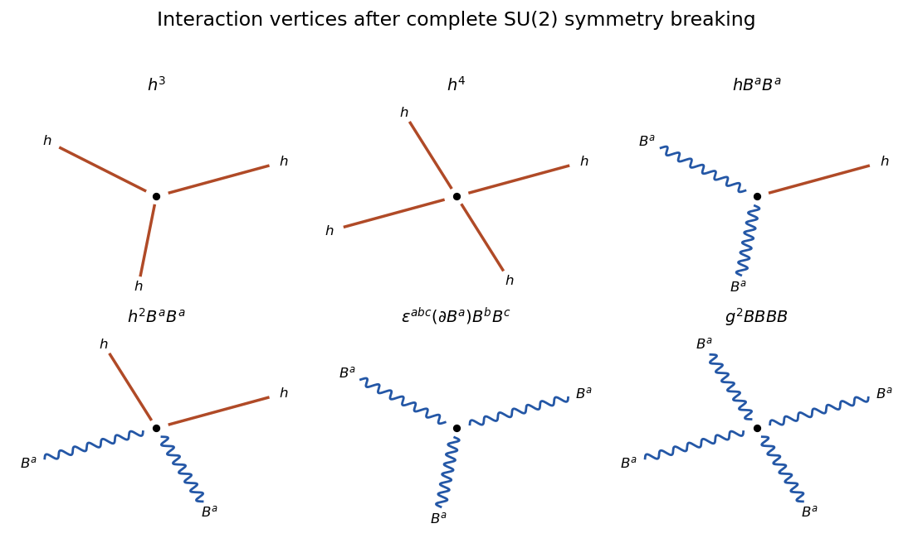

<h1 id="2/b/solution">Solution</h1>

↑ **Parent:** [B](../b.md)

The minima of the [scalar potential](../../../../../../scalar-potential.md)

$$
V(\phi)=m^2\phi^\dagger\phi+\frac\lambda2(\phi^\dagger\phi)^2
$$

satisfy

$$
\phi^\dagger\phi=-\frac{m^2}{\lambda}=\frac{v^2}{2},
\qquad
v^2=-\frac{2m^2}{\lambda}.
$$

The [SU(2) group](../../../../../../su-2-group.md) acts transitively on this three-sphere of vacua, and the stabilizer of a nonzero fundamental doublet is trivial. A global transformation may therefore choose $\phi_0=(0,v)^T/\sqrt2$. Because the symmetry is gauged, [unitary gauge](../../../../../../unitary-gauge.md) removes all three angular [Goldstone bosons](../../../../../../goldstone-boson.md), leaving only the real radial [Higgs mode](../../../../../../higgs-mode.md) $h$:

$$
\phi(x)=\frac1{\sqrt2}\binom0{v+h(x)}.
$$

Substitution into the [gauge-covariant kinetic term](../../../../../../gauge-covariant-kinetic-term.md) gives

$$
\boxed{
\mathcal L=-\frac14F^a_{\mu\nu}F^{a\mu\nu}
+\frac12(\partial h)^2+\frac{g^2}{8}(v+h)^2B^a_\mu B^{a\mu}
-\frac12m_h^2h^2-\frac{\lambda v}{2}h^3-\frac\lambda8h^4+\text{constant}
}
$$

with

$$
\boxed{m_h^2=\lambda v^2=-2m^2,\qquad m_B^2=\frac{g^2v^2}{4}.}
$$

The interaction terms produce $h^3$, $h^4$, $hBB$, $hhBB$, and the cubic and quartic non-Abelian gauge-boson vertices shown below.

**[Figure 1](#2/b/image-interaction-vertices-after-complete-su-2-symmetry-breaking). Interaction vertices after complete SU(2) symmetry breaking**.

The three broken generators supply the three longitudinal polarizations of the equally massive gauge bosons. No physical massless [Goldstone boson](../../../../../../goldstone-boson.md) remains, and because the unbroken subgroup is trivial there is no massless [gauge boson](../../../../../../gauge-boson.md) either. The remaining physical spectrum has $3\times3+1=10$ degrees of freedom, equal to the original $3\times2+4=10$.

## ↑ Ancestors (11)

1. [B](../b.md)
2. [2](../../2.md)
3. [Paper 305](../../../paper-305-split.md)
4. [Iii](../../../split.md)
5. [2019](../../../../split.md)
6. [Past exam of the mathematics course of the University of Cambridge](../../../../../split.md)
7. [Mathematics course of the University of Cambridge](../../../../../../mathematics-course-of-the-university-of-cambridge.md)
8. [Course of the University of Cambridge](../../../../../../course-of-the-university-of-cambridge.md)
9. [University of Cambridge](../../../../../../university-of-cambridge-split.md)
10. [List of universities](../../../../../../list-of-universities.md)
11. [Codex Wiki](../../../../../../split.md)
