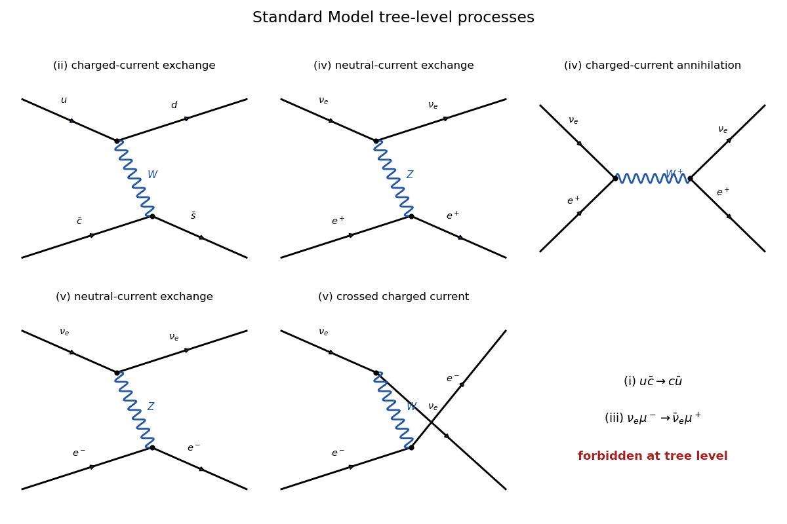

<h1 id="3/a/v/solution">Solution</h1>

↑ **Parent:** [V](../v.md)

**Allowed.** There are again two [tree-level Feynman diagrams](../../../../../../../tree-level-feynman-diagram.md): $t$-channel [Z boson](../../../../../../../z-boson.md) exchange and the crossed charged-current diagram with a [W boson](../../../../../../../w-boson.md) exchanged between the neutrino and electron lines.

The complete tree-level list for (ii), (iv), and (v) is:

**[Figure 2](#3/a/v/image-tree-level-processes-in-the-standard-model). Tree-level processes in the Standard Model**.

## ↑ Ancestors (12)

1. [V](../v.md)
2. [A](../../a.md)
3. [3](../../../3.md)
4. [Paper 305](../../../../paper-305-split.md)
5. [Iii](../../../../split.md)
6. [2019](../../../../../split.md)
7. [Past exam of the mathematics course of the University of Cambridge](../../../../../../split.md)
8. [Mathematics course of the University of Cambridge](../../../../../../../mathematics-course-of-the-university-of-cambridge.md)
9. [Course of the University of Cambridge](../../../../../../../course-of-the-university-of-cambridge.md)
10. [University of Cambridge](../../../../../../../university-of-cambridge-split.md)
11. [List of universities](../../../../../../../list-of-universities.md)
12. [Codex Wiki](../../../../../../../split.md)
