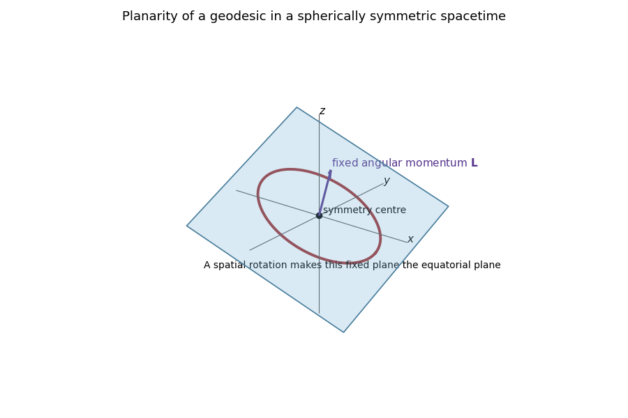

<h1 id="3/solution">Solution</h1>

↑ **Parent:** [3](../3.md)

For an affine parameter $\lambda$, the [geodesic Lagrangian](../../../../../geodesic-lagrangian.md) is

$$
\mathcal L=\frac12\left[-(1+r^2)\dot t^2
+\frac{\dot r^2}{1+r^2}
+r^2\dot\theta^2+r^2\sin^2\theta\,\dot\phi^2\right].
$$

Varying $S=\int\mathcal L\,d\lambda$ gives the [geodesic equations](../../../../../geodesic-equation.md)

$$
\ddot t+\frac{2r}{1+r^2}\dot r\dot t=0,
$$

$$
\ddot r+r(1+r^2)\dot t^2
-\frac{r}{1+r^2}\dot r^2
-r(1+r^2)(\dot\theta^2+\sin^2\theta\,\dot\phi^2)=0,
$$

$$
\ddot\theta+\frac{2\dot r}{r}\dot\theta
-\sin\theta\cos\theta\,\dot\phi^2=0,
\qquad
\ddot\phi+\frac{2\dot r}{r}\dot\phi
+2\cot\theta\,\dot\theta\dot\phi=0.
$$

The rotational [Killing vector fields](../../../../../killing-vector-field.md) of the [spherical symmetry](../../../../../spherical-symmetry.md) conserve the angular-momentum vector. Its direction is fixed, so every nonradial orbit lies in the plane through the symmetry centre orthogonal to that vector. A spatial rotation can make this the equatorial plane. Equivalently, the initial conditions $\theta=\pi/2$ and $\dot\theta=0$ solve the $\theta$ equation uniquely. This is the [planarity of geodesics in spherical symmetry](../../../../../planarity-of-geodesics-in-spherical-symmetry.md); a radial geodesic has zero [angular momentum](../../../../../angular-momentum.md) and may be assigned any plane.

**[Figure 1](#3/image-an-equatorial-geodesic-in-a-spherically-symmetric-spacetime). An equatorial geodesic in a spherically symmetric spacetime**.

On $\theta=\pi/2$, the cyclic coordinates $t$ and $\phi$ produce [geodesic conserved quantities from Killing vectors](../../../../../geodesic-conserved-quantity-from-a-killing-vector.md),

$$
\boxed{E=(1+r^2)\dot t,
\qquad L=r^2\dot\phi}.
$$

For a timelike geodesic parametrized by [proper time](../../../../../proper-time.md), the [proper-time normalization](../../../../../proper-time-normalization.md) is $g_{ab}\dot x^a\dot x^b=-1$. Substitution of $E$ and $L$ gives the first-order radial equation

$$
\boxed{\dot r^2=E^2-(1+r^2)\left(1+\frac{L^2}{r^2}\right)}.
$$

This is the [timelike geodesic effective potential](../../../../../timelike-geodesic-effective-potential.md) for static [Anti-de Sitter spacetime](../../../../../anti-de-sitter-spacetime.md) with curvature radius one.

A geodesic passing through $r=0$ must have $L=0$. If it moves away from the origin, $E>1$, and

$$
\dot r^2=(E^2-1)-r^2.
$$

Taking proper time $s=0$ at departure gives

$$
r(s)=\sqrt{E^2-1}\sin s
\qquad(0\leq s\leq\pi).
$$

It turns around at $s=\pi/2$ and first returns to the origin at

$$
\boxed{\Delta s=\pi}.
$$

This energy-independent refocusing is the characteristic [radial timelike geodesic in anti-de Sitter spacetime](../../../../../radial-timelike-geodesic-in-anti-de-sitter-spacetime.md) result; for curvature radius $a$, the answer is $\pi a$.

## ↑ Ancestors (10)

1. [3](../3.md)
2. [Paper 309](../../paper-309-split.md)
3. [Iii](../../split.md)
4. [2019](../../../split.md)
5. [Past exam of the mathematics course of the University of Cambridge](../../../../split.md)
6. [Mathematics course of the University of Cambridge](../../../../../mathematics-course-of-the-university-of-cambridge.md)
7. [Course of the University of Cambridge](../../../../../course-of-the-university-of-cambridge.md)
8. [University of Cambridge](../../../../../university-of-cambridge-split.md)
9. [List of universities](../../../../../list-of-universities.md)
10. [Codex Wiki](../../../../../split.md)
