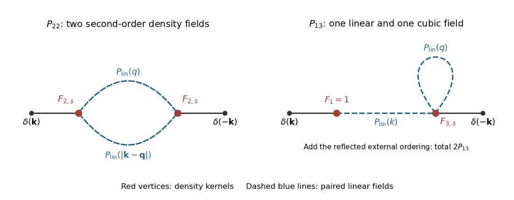

<h1 id="2/i/solution">Solution</h1>

↑ **Parent:** [I](../i.md)

Use the [one-loop matter power spectrum](../../../../../../one-loop-matter-power-spectrum.md) convention in which $P_{13}$ is one ordering of $\langle\delta^{(1)}\delta^{(3)}\rangle$. Then

$$
P(k,t)=D^2P_{\rm lin}(k)+P_{22}(k,t)+2P_{13}(k,t)+\cdots,
$$

with the [P22 contribution to the one-loop matter power spectrum](../../../../../../p22-contribution-to-the-one-loop-matter-power-spectrum.md)

$$
\boxed{P_{22}=2D^4\int\frac{d^3q}{(2\pi)^3}
F_{2,s}(\mathbf q,\mathbf k-\mathbf q)^2
P_{\rm lin}(q)P_{\rm lin}(|\mathbf k-\mathbf q|)}
$$

and the [P13 contribution to the one-loop matter power spectrum](../../../../../../p13-contribution-to-the-one-loop-matter-power-spectrum.md)

$$
\boxed{P_{13}=3D^4P_{\rm lin}(k)
\int\frac{d^3q}{(2\pi)^3}
F_{3,s}(\mathbf k,\mathbf q,-\mathbf q)P_{\rm lin}(q)}.
$$

The factors two and three count [Wick contractions](../../../../../../wick-contraction.md). The mixed $P_{12}$ contains an odd number of zero-mean Gaussian fields, so **$P_{12}=0$**.

**[Figure 1](#2/i/image-one-loop-contributions-to-the-matter-power-spectrum). One-loop contributions to the matter power spectrum**. The two one-loop power-spectrum topologies. Solid lines attach external density fields to kernels; dashed lines pair linear fields and carry a linear power spectrum. The P13 topology has two external orderings.

For $q\gg k$, the [ultraviolet softness of the second-order density kernel](../../../../../../ultraviolet-softness-of-the-second-order-density-kernel.md) gives $F_{2,s}=O(k^2/q^2)$, so

$$
P_{22}^{\rm UV}=O\left(D^4k^4\int\frac{d^3q}{(2\pi)^3}
\frac{P_{\rm lin}(q)^2}{q^4}\right).
$$

The third-order kernel has $F_{3,s}(\mathbf k,\mathbf q,-\mathbf q)=O(k^2/q^2)$, giving

$$
2P_{13}^{\rm UV}=O\left(D^4k^2P_{\rm lin}(k)
\int\frac{d^3q}{(2\pi)^3}\frac{P_{\rm lin}(q)}{q^2}\right).
$$

These integrals expose the sensitivity to unresolved short-scale dynamics. The [effective sound-speed counterterm in large-scale structure](../../../../../../effective-sound-speed-counterterm-in-large-scale-structure.md) has exactly the required deterministic shape:

$$
\boxed{P_{\rm ct}(k,t)=-2c_{\rm eff}^2(t)\,k^2P_L(k,t)},
\qquad P_L=D^2P_{\rm lin}.
$$

Here $c_{\rm eff}^2$ absorbs the time and normalization conventions and has dimensions of length squared. A stochastic correction begins at $k^4$ and can absorb the corresponding short-scale sensitivity of $P_{22}$.

## ↑ Ancestors (11)

1. [I](../i.md)
2. [2](../../2.md)
3. [Paper 312](../../../paper-312-split.md)
4. [Iii](../../../split.md)
5. [2019](../../../../split.md)
6. [Past exam of the mathematics course of the University of Cambridge](../../../../../split.md)
7. [Mathematics course of the University of Cambridge](../../../../../../mathematics-course-of-the-university-of-cambridge.md)
8. [Course of the University of Cambridge](../../../../../../course-of-the-university-of-cambridge.md)
9. [University of Cambridge](../../../../../../university-of-cambridge-split.md)
10. [List of universities](../../../../../../list-of-universities.md)
11. [Codex Wiki](../../../../../../split.md)
