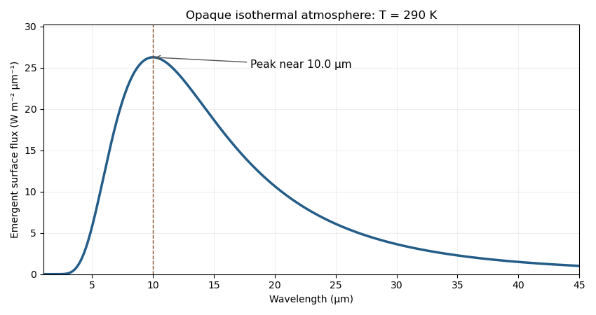

<h1 id="2/b/solution">Solution</h1>

↑ **Parent:** [B](../b.md)

For $a\gg a_{AB}$, both stars illuminate the [circumbinary planet](../../../../../../circumbinary-planet.md) at approximately distance $a$. Treat them as [blackbodies](../../../../../../blackbody.md), neglect internal heating, and assume [Bond albedo](../../../../../../bond-albedo.md) $A_B$ and uniform global reradiation. The absorbed and emitted powers are

$$
\pi R_p^2(1-A_B)\sigma_{\rm SB}\frac{R_A^2T_A^4+R_B^2T_B^4}{a^2}
=4\pi R_p^2\sigma_{\rm SB}T_p^4.
$$

Thus the [equilibrium temperature of a circumbinary planet](../../../../../../equilibrium-temperature-of-a-circumbinary-planet.md) is

$$
\boxed{T_p=\left[\frac{1-A_B}{4a^2}(R_A^2T_A^4+R_B^2T_B^4)\right]^{1/4}.}
$$

For an example, take $R_A=R_\odot$, $R_B=0.3R_\odot$, $T_A=6000\,\mathrm K$, $T_B=3000\,\mathrm K$, $a=1\,\mathrm{au}$, $a_{AB}=0.05\,\mathrm{au}$, circular coplanar orbits, and $A_B=0$. Then

$$
\boxed{T_p\simeq290\,\mathrm K.}
$$

The cooler star contributes only $0.3^2(3000/6000)^4\simeq0.0056$ of the hotter star's luminosity in this example.

An opaque isothermal atmosphere emits $F_\lambda=\pi B_\lambda(T_p)$, with no absorption or emission bands. The [Wien displacement law](../../../../../../wien-s-displacement-law.md) puts the maximum of this wavelength spectrum near $\lambda_{\rm max}\simeq10\,\mu\mathrm m$. At observer distance $d$, the planetary spectral flux is $\pi B_\lambda(T_p)(R_p/d)^2$.

**[Figure 1](#2/b/image-isothermal-circumbinary-planet-emission-spectrum). Isothermal circumbinary-planet emission spectrum**. The emergent surface flux for the example above. The wavelength spectrum peaks near ten micrometres; the exactly isothermal opaque model has no molecular bands.

## ↑ Ancestors (11)

1. [B](../b.md)
2. [2](../../2.md)
3. [Paper 315](../../../paper-315-split.md)
4. [Iii](../../../split.md)
5. [2019](../../../../split.md)
6. [Past exam of the mathematics course of the University of Cambridge](../../../../../split.md)
7. [Mathematics course of the University of Cambridge](../../../../../../mathematics-course-of-the-university-of-cambridge.md)
8. [Course of the University of Cambridge](../../../../../../course-of-the-university-of-cambridge.md)
9. [University of Cambridge](../../../../../../university-of-cambridge-split.md)
10. [List of universities](../../../../../../list-of-universities.md)
11. [Codex Wiki](../../../../../../split.md)
